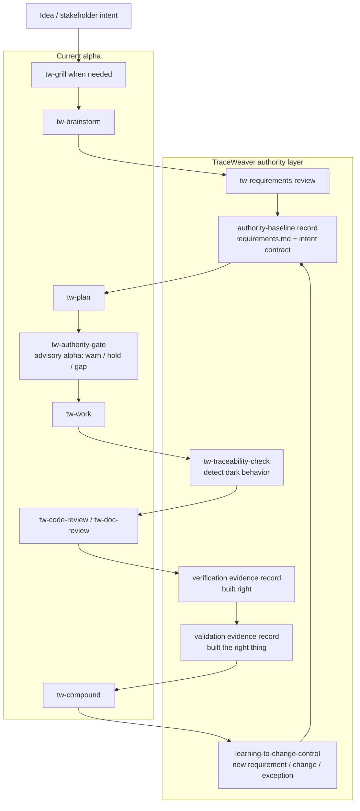

# TraceWeaver Core

Open-source systems engineering traceability for agentic software development.

TraceWeaver Core is a systems-engineering control layer for agentic software
development. Its core role is to preserve intent, authority, and traceability as
agents move from stakeholder needs to requirements, plans, code, tests, and
release decisions.

The problem TraceWeaver solves is that agents can move very fast, but they often
blur the chain between:

```text
what the stakeholder asked for
-> what the agent interpreted
-> what got implemented
```

TraceWeaver forces a controlled chain:

```text
stakeholder intent
-> captured needs
-> reviewed requirements
-> approved authority or approved exception
-> implementation
-> verification
-> validation
-> change control
```

The key principle is:

> Agents may help create requirements, plans, code, tests, and evidence, but
> they may not silently promote their own interpretation into authority.

The current wedge is:

> Meaningful behaviour must trace to approved authority, or it is not ready to
> implement, approve, or ship.

The code-level gate is:

> Every meaningful behavior-bearing unit must trace to approved authority and
> verification evidence.

In practice, a behavior-bearing skill, workflow wrapper, command, script,
function, method, or class cannot be treated as done until the traceability
matrix names the requirement or approved exception that authorizes it, the
implementation location, and the verification evidence that proves it.

In simple terms: TraceWeaver keeps agentic development aligned to the original
intent, proves that implementation traces back to approved requirements, and
records gaps, risks, assumptions, and changes instead of letting them become
hidden authority.

TraceWeaver is useful when a codebase has grown faster than its memory. It helps
answer practical engineering questions:

- why does this module exist?
- which requirement or decision does this behavior serve?
- which test or smoke proves the behavior still works?
- is this code still current, or did the requirement move on?
- are two places doing the same thing for unclear reasons?
- did an agent add plausible code that no one actually authorized?

The goal is not paperwork for its own sake. The goal is a codebase where intent
is visible enough that humans and agents can safely change it.

TraceWeaver calls these common problems out explicitly:

| Problem | What TraceWeaver looks for |
|---|---|
| Lost intent | Code, tests, or workflow behavior that no longer links back to a current stakeholder need, requirement, exception, validation question, or decision. |
| Dark code | Behavior-bearing files or entrypoints with no approved authority anchor or matrix row. |
| Orphaned code | Source-level anchors that are not reachable from `traceability-matrix.md` evidence. |
| Abandoned or obsolete code | Behavior linked to stale, held, retired, superseded, or missing requirements. |
| Duplicate or similar behavior | Multiple artifacts with similar behavior under the same or unclear authority. |
| Anchor-only coverage | Code has a trace comment, but no verification implementation, procedure, result, or held-validation record. |
| Dead TDD | Tests or smokes that still verify a requirement that no longer exists or is no longer approved. |

TraceWeaver is intended to become a standalone plugin that can replace the
installed Compound Engineering plugin for this workflow. It is based on the
selected CE planning, work, review, and learning surface, but TraceWeaver adds
the controlling authority layer: Intent Contract, requirements baseline,
traceability matrix, verification evidence, validation questions, and explicit
gap/change/exception handling.

## Systems Engineering Foundations

TraceWeaver is an agentic-software adaptation of established systems
engineering practice, not a new replacement for that discipline. Its workflow is
grounded in the same core controls used by systems engineering standards and
handbooks:

- INCOSE systems-engineering guidance and handbook practice around stakeholder
  needs, requirements, architecture/design traceability, verification,
  validation, risk, and lifecycle evidence;
- lifecycle control from stakeholder need through requirements, design,
  implementation, verification, validation, and change control, aligned with the
  intent of ISO/IEC/IEEE 15288-style systems lifecycle practice;
- requirements quality, traceability, acceptance criteria, and requirements
  baseline management, aligned with ISO/IEC/IEEE 29148-style requirements
  engineering practice;
- explicit verification and validation separation: verification asks whether
  the implementation satisfies the specified requirement, while validation asks
  whether the delivered behavior satisfies the stakeholder intent;
- change, gap, exception, risk, and evidence records so unresolved ambiguity is
  controlled rather than converted into hidden implementation authority;
- end-to-end traceability so reviewers can move from intent to requirement,
  artifact, test, result, validation question, and release decision without
  relying on agent memory.

TraceWeaver does not claim certification, endorsement, or full compliance with
INCOSE or any formal standard. It translates their useful control ideas into a
lightweight, file-based workflow that coding agents and human reviewers can
actually use in a normal repository.

## Naming Model

| Name | Role |
|---|---|
| TraceWeaver Core | Open-source method, standalone alpha plugin, skills, templates, and validation protocol |
| TraceWeaver Enterprise | Paid commercial product for larger-project governance |
| TraceWeaver Cloud | Hosted MCP/API service |

TraceWeaver Core should stay usable without the future paid layer. The paid
Enterprise and Cloud products should make the same method scalable through
relationship storage, dashboards, governance, hosted services, audit logs, and
integrations.

## Architecture Layers

| Layer | Purpose | Names |
|---|---|---|
| TraceWeaver Core method | Open-source systems-engineering workflow, requirements baseline, traceability matrix, validation protocol, and skill guidance | `requirements.md`, `traceability-matrix.md`, `.traceweaver/`, templates, references, and validation records |
| TraceWeaver Core plugin | Standalone alpha plugin surface for Codex with TraceWeaver-owned `tw-*` wrappers and packaged CE-derived internal engines | `plugins/traceweaver-core`, `tw-auto`, `tw-plan`, `tw-work`, `tw-code-review`, `tw-doc-review`, `tw-commit-push-pr`, `lfg` |
| TraceWeaver Enterprise and Cloud | Commercial scale-out layer for multi-repo governance, relationship storage, dashboards, hosted services, audit logs, and integrations | Future Enterprise and Cloud products |

Ownership rule:

- TraceWeaver Core defines the method and standalone plugin behavior.
- User-facing workflow should enter through TraceWeaver-owned `tw-*` wrappers or
  the `lfg` compatibility alias.
- Packaged CE-derived skills are internal implementation components only. They
  must not become the product identity, public workflow surface, or source of
  TraceWeaver authority.
- Enterprise and Cloud may add storage, dashboards, hosted services, connectors,
  and governance features, but they must not be required for local Core use.

## Intent Contract

TraceWeaver's authority model is Intent Contract centered. Skills are
capabilities, not authority. Every behavior-changing agent handoff must be able
to cite:

- stakeholder intent;
- approved requirement or approved exception;
- verification method;
- validation question;
- current baseline version.

Alpha implementations can remain advisory, but missing authority must be
visible as a gap, proposed requirement, change, exception, accepted-risk
candidate, clarification record, or held claim. Agent assumptions are not
implementation authority.

The planned file-based alpha shape is:

```text
requirements.md
traceability-matrix.md
.traceweaver/
  intent-contract.yml
  authority-baseline.yml
  task-capsules/
  trace-records/
  gaps/
  changes/
  exceptions/
```

The plugin package should provide templates for consuming repositories to create
these files. It should not install project-specific authority records into a
repo automatically.

For TraceWeaver projects, `requirements.md` and `traceability-matrix.md` should
live at the repository root because they are primary human-facing authority
files. Supporting plans, validation records, brainstorms, and review evidence
can live under `docs/` as normal. Operational TraceWeaver records, task
capsules, gaps, changes, and exceptions live under `.traceweaver/`.

## Requirements Baseline

The accepted master controlled requirements baseline is
[requirements.md](requirements.md). It is the current planning authority for
TraceWeaver Core and supersedes the older brainstorm requirement documents as
the controlling baseline. Those brainstorm documents remain source evidence and
rationale.

The project traceability matrix is
[traceability-matrix.md](traceability-matrix.md). In the early project shape,
it intentionally lives beside `requirements.md` because it is a primary
human-facing authority file: `requirements.md` says what is approved, while
`traceability-matrix.md` shows how intent, requirements, artifacts,
verification, validation, gaps, and held claims connect.

## How To Use TraceWeaver Alpha

### Install For Codex

TraceWeaver alpha is installed from a local checkout. The current repo-local
installer supports Codex installs only and requires `--include-skills`; that
flag materializes the user-facing `tw-*` skills plus the packaged internal
CE-derived implementation components.

Prerequisites:

- `git`
- `bun`
- a local TraceWeaver checkout

Install or update from the latest `main`:

```sh
git clone git@github.com:Oxiom-Systems/traceweaver.git
cd traceweaver
git pull --ff-only origin main
bun run src/index.ts install ./plugins/traceweaver-core --to codex --include-skills
```

If the checkout already exists, run only:

```sh
cd /path/to/traceweaver
git pull --ff-only origin main
bun run src/index.ts install ./plugins/traceweaver-core --to codex --include-skills
```

For this Mac/Codex host, reconcile the active direct-callable skill surface
after installing or after pulling a newer TraceWeaver checkout:

```sh
scripts/traceweaver-reconcile-codex-host-skills
TRACEWEAVER_HOST_RUNTIME_EXEC=0 scripts/traceweaver-smoke-codex-host-registry
```

Verify a fresh isolated install without relying on the active Codex home:

```sh
TRACEWEAVER_HOST_RUNTIME_EXEC=0 scripts/traceweaver-smoke-codex-discovery
TRACEWEAVER_HOST_RUNTIME_EXEC=0 scripts/traceweaver-smoke-codex-separate-home-runtime
```

Expected install shape:

- user-facing skills are `tw-*` plus the `lfg` compatibility alias;
- raw `ce-*` skills are packaged as internal TraceWeaver implementation
  components, not as the normal user workflow;
- Codex model default is recorded as `gpt-5.5` with `medium` reasoning;
- full runtime-driver invocation, release-ready status, clean replacement, and
  unconstrained-host claims remain held.

Claude packaging has a manifest with Sonnet policy recorded, but the repo-local
installer currently supports only `--to codex`. Treat Claude install/release
claims as held until a reviewed Claude installation path is added.

### Recommended Environment Tools

TraceWeaver Core is the workflow plugin. The tools below are recommended so
other contributors have an environment where TraceWeaver works well. They help
with task state, session recall, and compatibility context; they do not replace
TraceWeaver authority files and they do not approve implementation by
themselves.

| Tool | Why it helps a TraceWeaver project |
|---|---|
| TraceWeaver Core plugin | Provides the normal `tw-*` workflow, including `tw-auto`, `tw-plan`, `tw-work`, reviews, traceability checks, and controlled publication. |
| Beads (`bd`) | Keeps dependency-aware issue state, blockers, ownership, and ready work visible when a repository opts in with `.beads/`. Requirements authority still lives in `requirements.md`, `traceability-matrix.md`, and `.traceweaver/intent-contract.yml`. |
| MemSearch / `memory-recall` | Provides semantic recall over past agent sessions. Recalled sessions are context and source evidence; anything authoritative still needs the normal TraceWeaver requirements and traceability gates. |
| Compound Engineering plugin or source checkout | Provides upstream compatibility context while TraceWeaver is alpha. The normal user path should still enter through TraceWeaver-owned `tw-*` wrappers; direct `ce-*` use does not close TraceWeaver authority, traceability, verification, or validation gates. |

### Start A Project

In a consuming repository, TraceWeaver expects these authority files at the
root:

```text
requirements.md
traceability-matrix.md
.traceweaver/intent-contract.yml
```

If you want TraceWeaver to drive the flow instead of stepping through each gate
manually, start with `tw-auto`:

```text
tw-auto "describe the work, idea, bug, audit, or improvement"
```

`tw-auto` is the automation front door. It can route the request to the highest
safe wrapper: intent deepening, brainstorming, requirements review, planning,
work, traceability checks, review, or publication. Use the lower wrappers
directly when you want to follow the flow manually or deliberately run one gate.

TraceWeaver exposes `tw-strategy` and `tw-ideate` as source-evidence wrappers.
Use `tw-strategy` to create or refresh `STRATEGY.md` as grounding for target
problem, approach, persona, metrics, and tracks. Use `tw-ideate` when you want
ranked ideas before choosing one to grill or brainstorm. There is no separate
`tw-ideas` command. `STRATEGY.md` and ideation artifacts are upstream context,
not implementation authority. Once `requirements.md` and
`.traceweaver/intent-contract.yml` exist, approved requirements, approved
exceptions, and the Intent Contract control what may be implemented.

If the authority files do not exist yet, `tw-auto` should enter bootstrap mode:

```text
tw-auto "bootstrap TraceWeaver authority for this project"
```

The manual narrow path is available when you explicitly want to step through the
early gates yourself:

```text
tw-strategy "capture product direction"  # optional, source evidence only
tw-ideate "generate options"             # optional, source evidence only
tw-grill "stress-test this idea"    # optional, when intent is still fuzzy
tw-brainstorm "describe the idea or problem"
tw-requirements-review
tw-plan
```

For normal bounded implementation work with approved authority, choose either
the automation path or the manual wrapper path. Use TraceWeaver wrappers instead
of raw `ce-*` commands:

```text
tw-auto "implement the approved plan"
```

```text
tw-plan "plan the approved change"
tw-work "implement the approved plan"
tw-code-review
tw-doc-review
tw-commit-push-pr
```

`tw-work` is responsible for implementation under approved authority. When the
mapping is unambiguous, it can add coarse code trace anchors and matching Code
Anchor Evidence rows. `tw-code-review` runs the traceability preflight before
the packaged CE code-review engine. `tw-doc-review` reviews requirements,
plans, matrices, Intent Contracts, and evidence records. `tw-commit-push-pr`
is the controlled publication wrapper and must stop when authority, review,
verification, target, credential, or held-claim checks are not clean.

`tw-auto` remains experimental. Use it for bounded dogfood loops where stopping
is acceptable. It is intended
to run the high-level TraceWeaver sequence:

```text
authority gate
-> work
-> trace-anchor authoring
-> traceability check
-> code/doc review
-> record clean review or stop on a real blocker
```

Current `tw-auto` limitations are intentional:

- it is experimental and may stop after one cycle with the next wrapper command;
- it must not invent or change requirements;
- it must stop for missing, stale, contradictory, or materially changed
  authority;
- it must keep commit, push, PR, release, clean replacement, and broad runtime
  claims held unless their publication gate passes;
- full runtime-driver invocation, release-ready status, Vestro dogfood, and
  unconstrained-host claims remain held until later evidence accepts them.

When `tw-auto` stops, treat its last line as the workflow handoff. It should
recommend the highest-level next wrapper that can safely continue. It should
not tell users to "fix the authority" without naming the next command or human
decision.

Common handoffs:

| Situation | Use |
|---|---|
| Unsure where to start | `tw-auto "describe the goal"` |
| Product direction or `STRATEGY.md` needs to ground the work | `tw-strategy`, or `tw-auto` when you want the automated route |
| Need generated/ranked ideas before choosing one | `tw-ideate`, then `tw-grill` or `tw-brainstorm` |
| Fuzzy idea or product direction | `tw-grill`, then `tw-brainstorm` |
| Candidate requirement or acceptance criteria | `tw-requirements-review` |
| Approved requirement needs an implementation plan | `tw-plan` |
| Approved plan needs code/docs changed | `tw-work` |
| Work finished and behavior-bearing files changed | `tw-code-review` |
| Requirements, plans, matrix, Intent Contract, evidence, status, or hashes changed | `tw-doc-review` |
| Existing repo needs dark-code or lost-intent audit | `tw-traceability-check` |
| Bug, regression, failing test, or production incident | `tw-debug` |
| Commit, push, or PR is requested | `tw-commit-push-pr` |
| Learning should be captured after a solved problem | `tw-compound` |

### User-Facing Skills

The Codex install exposes these TraceWeaver-owned user-facing skills. Packaged
`ce-*` skills remain internal implementation components.

| Skill | Use |
|---|---|
| `tw-auto` | Experimental advisory workflow driver for bounded TraceWeaver loops. |
| `lfg` | Compatibility alias that delegates to `tw-auto`. |
| `tw-strategy` | Capture or update `STRATEGY.md` as source-evidence grounding. |
| `tw-ideate` | Generate and rank ideas as source evidence before grilling, brainstorming, or requirements review. |
| `tw-grill` | Optional intent-deepening interview before brainstorming. |
| `tw-brainstorm` | Explore ideas as source evidence before requirements review. |
| `tw-requirements-review` | Review requirements, acceptance criteria, and candidate authority. |
| `tw-plan` | Plan approved work while preserving authority and traceability boundaries. |
| `tw-authority-gate` | Check that implementation has approved authority before work starts. |
| `tw-work` | Implement approved work, add trace anchors when unambiguous, run verification, and hand off to review. |
| `tw-traceability-check` | Check plans, code, docs, PRs, and release evidence for authority and verification traceability. |
| `tw-code-review` | Run traceability preflight, then code review. |
| `tw-doc-review` | Review requirements, plans, matrices, Intent Contracts, and evidence records. |
| `tw-debug` | Diagnose failures or production issues without bypassing authority or publication gates. |
| `tw-test-browser` | Run browser verification as linked TraceWeaver evidence. |
| `tw-test-xcode` | Run Xcode/iOS/macOS verification as linked TraceWeaver evidence. |
| `tw-setup` | Diagnose or prepare the local TraceWeaver/CE-derived environment. |
| `tw-worktree` | Create or inspect local worktrees under TraceWeaver boundaries. |
| `tw-sessions` | Use prior session history as source evidence, not authority. |
| `tw-resolve-pr-feedback` | Evaluate and repair PR review feedback with traceability gates. |
| `tw-commit` | Prepare a local commit only after the controlled TraceWeaver commit gate is clean. |
| `tw-commit-push-pr` | Commit, push, and open/update PRs only through the controlled publication gate. |
| `tw-compound` | Capture learning without silently changing requirements. |
| `tw-compound-refresh` | Refresh existing learning material while keeping authority changes held. |

### Audit An Existing Codebase

TraceWeaver can be used on an existing repository before any new feature work.
The audit goal is to find candidate lost intent, dark behavior, obsolete code,
or duplicate behavior so a human can decide whether to keep, trace, merge,
rewrite, or remove it.

Use the high-level skill when you want a review-style report:

```text
tw-traceability-check audit this repo for dark code, orphaned code, obsolete or abandoned behavior, duplicate or similar behavior, dead tests, missing verification, and lost intent. Report candidate findings only; do not remove or rewrite anything.
```

Use the scanner directly when you need a deterministic baseline artifact:

```sh
mkdir -p .traceweaver/audit
plugins/traceweaver-core/skills/tw-traceability-check/scripts/traceweaver-check-code-anchors \
  --root . \
  --mode audit \
  --markdown .traceweaver/audit/code-traceability-audit.md \
  --jsonl .traceweaver/audit/code-traceability-audit.jsonl
```

Audit-mode findings are candidates, not automatic cleanup authority. A duplicate
or obsolete-code finding means "review this with the owner and authority
records," not "delete it now." Before changing code, route the decision through
the normal TraceWeaver flow:

```text
tw-requirements-review
tw-plan
tw-work
tw-code-review
tw-doc-review
```

The current deterministic scanner is intentionally conservative. It checks
supported source files, TraceWeaver anchors, matrix reachability, requirement
status, verification closure, dead-TDD patterns, and token-similarity candidates.
It does not prove full semantic equivalence across every language or call graph.
Use it to surface suspicious areas, then use review and requirements authority
to decide what the behavior should become.

Read audit findings as routing signals:

| Finding type | Normal next step |
|---|---|
| Dark or orphaned code | Decide whether to add authority and anchors, convert to a gap, or remove through a reviewed plan. |
| Obsolete or abandoned behavior | Check whether the requirement is stale, retired, superseded, or still intentionally supported. |
| Duplicate or similar behavior | Compare intent and authority before merging, deleting, or keeping both paths. |
| Anchor-only coverage | Add or link verification implementation, procedure, result, or held-validation evidence. |
| Dead TDD | Decide whether the test still proves a current requirement or should be retired with authority. |

The safe cleanup path is still:

```text
tw-plan "classify and clean up the audit findings"
tw-work
tw-code-review
tw-doc-review
```

## Compound Engineering Workflow

TraceWeaver does not replace the Compound Engineering loop. It wraps that loop
with authority control, traceability, verification, validation, and change
control.

The base workflow is:

```text
idea
-> tw-strategy when product direction needs grounding
-> tw-ideate when options need generation and critique
-> tw-grill when the intent needs deeper interview
-> brainstorm
-> TraceWeaver requirements baseline
-> plan
-> work
-> review
-> verification
-> validation
-> compound learning
```

The important control point is between `brainstorm` and `plan`: ideas stop being
loose context and become controlled requirements authority only after they are
captured, reviewed, and baselined.

| CE method stage | Standalone TraceWeaver entrypoint | Purpose |
|---|---|---|
| `idea` | `tw-strategy` / `tw-ideate` / intent capture | Capture strategy grounding and candidate ideas. Ideas are not authority yet. |
| grill | optional `tw-grill` | Stress-test one selected idea before brainstorming. Output is source evidence, not authority. |
| brainstorm | `tw-brainstorm`, then `tw-requirements-review` and authority-baseline record | Explore needs, risks, options, assumptions, and gaps, then convert accepted ideas into `requirements.md`, intent IDs, requirement IDs, exceptions, validation questions, and baseline version. |
| plan | `tw-plan`, with `tw-authority-gate` before implementation | Plan only against approved requirements or approved exceptions. Every task gets an Intent Capsule. |
| work | `tw-work`, with `tw-traceability-check` before review | Agents implement only what their capsule authorizes. Assumptions become gaps or change requests, not code. |
| review | `tw-code-review` / `tw-doc-review` | Check what changed, what requirement authorized it, what verifies it, and whether it still satisfies the stakeholder validation question. |
| compound learning | `tw-compound` | Record lessons and patterns without silently changing authority. New learning creates proposed requirements or change records when needed. |

The target TraceWeaver-controlled CE loop is:

```text
idea
-> tw-strategy
-> tw-ideate
-> tw-grill when the intent needs deeper interview
-> tw-brainstorm
-> tw-requirements-review
-> authority-baseline record
-> tw-plan
-> tw-authority-gate
-> tw-work
-> tw-traceability-check
-> tw-code-review / tw-doc-review
-> verification evidence record
-> validation evidence record
-> tw-compound
```

In the current alpha, the standalone TraceWeaver package installs the selected
`tw-*` wrappers and the approved `lfg` compatibility alias as the user-facing
surface. Selected `ce-*` components are packaged internally for wrapper
delegation, not exposed as the normal user workflow. Full `tw-auto`
runtime-driver decision binding, clean CE replacement behavior, slash-command
surfaces, release-ready status, and unconstrained-host support remain held until
their own evidence records approve them.

TraceWeaver is strongest at five handoffs:

1. After `brainstorm`, before `plan`: turn ideas into controlled requirements.
2. Before `work`: warn in advisory mode, and block only after enforcing mode is
   approved, when a task has no approved authority.
3. During `review`: detect untraced dark behavior.
4. Before release: verify and validate against the original intent.
5. During `compound`: preserve learning without silently rewriting the baseline.

Every TraceWeaver task should end with suggested next steps. The handoff should
name the next TraceWeaver command, evidence record, or held condition so
contributors do not have to reconstruct the workflow state from validation
history.

## CE Static Continuity And Future Wrapper Rule

TraceWeaver should not reimplement Compound Engineering workflow logic when a
selected CE workflow skill can be preserved. The standalone TraceWeaver plugin
uses selected CE-compatible skills as implementation components, then routes
the normal autonomous entrypoint through TraceWeaver authority controls.

The user-facing controlled workflow is:

```text
idea
-> tw-strategy
-> ideation source
-> tw-grill
-> tw-brainstorm
-> tw-requirements-review
-> authority-baseline record
-> tw-plan
-> tw-authority-gate
-> tw-work
-> tw-traceability-check
-> tw-code-review / tw-doc-review
-> verification evidence record
-> validation evidence record
-> tw-compound
```

The alpha rule is:

- preserve selected `ce-*` workflow behavior as static implementation
  components unless runtime evidence approves deeper wrapper sequencing or
  replacement;
- use `tw-*` skills for TraceWeaver-specific adapters: requirements review,
  optional post-ideation grilling, authority gate, traceability check, and
  evidence handoff;
- represent authority-baseline, verification, and validation as records in the
  current alpha, not as installed skills, unless a later unit explicitly
  materializes and proves those skills;
- create `tw-auto` as the TraceWeaver-controlled autonomy surface;
- make packaged `lfg` a compatibility alias that delegates to `tw-auto` so the
  familiar autonomous entrypoint cannot bypass TraceWeaver authority;
- keep selected `ce-*` bodies as internal implementation components for wrapper
  delegation, static continuity testing, and reviewed upstream-drift comparison;
- do not expose direct `ce-*` invocation as the standalone user workflow;
- keep clean CE replacement, slash commands, enforcing mode, and dynamic
  discovery claims held until a later accepted runtime proof explicitly
  approves them.

`tw-auto` is the experimental advisory automation path for this model. It
groups CE-style planning, work, and review with TraceWeaver authority checks,
matrix updates, bounded review-fix cycles, and next-step handoffs. In the alpha
it may stop after a single cycle and report the next wrapper command. It must
stop before commit, push, or PR creation unless the controlled publication gate
is clean; full autonomous publication remains a later runtime claim.

There are two valid blank-project starts. Use `tw-auto` when you want the
automation path; use the narrower wrappers when you want to follow each gate
manually:

```text
intent-first path:
idea
-> tw-strategy when direction is unclear
-> tw-ideate when options are needed
-> ideation source
-> tw-grill
-> tw-brainstorm
-> tw-requirements-review
-> accepted requirements baseline
-> tw-auto
```

```text
fast bootstrap path:
tw-auto "build X"
-> draft requirements.md
-> draft traceability-matrix.md
-> draft .traceweaver/intent-contract.yml
-> stop for tw-requirements-review
```

`tw-auto` may route strategy or idea-generation requests through `tw-strategy`
and `tw-ideate` before brainstorming. It should skip them for an approved
implementation plan that does not ask for upstream source evidence. When a new
project has no TraceWeaver authority files yet, it bootstraps draft
`requirements.md`, `traceability-matrix.md`, and
`.traceweaver/intent-contract.yml`, then stops for requirements review before
implementation. Missing authority starts a baseline conversation; it does not
authorize code.

`STRATEGY.md`, when present, is grounding for ideation, brainstorming, and
planning. It may describe the product's target problem, approach, persona,
metrics, and tracks, but it is not the authoritative work source once
`requirements.md` and `.traceweaver/intent-contract.yml` exist. If strategy and
requirements disagree, `tw-auto` should stop or route to requirements review
instead of implementing from strategy text.

`tw-grill` is an optional source-evidence step between ideation and
`tw-brainstorm`. It stress-tests one selected idea, inspects repo context instead
of asking when the answer is discoverable, and gives a recommended answer for
each user-facing question. Its output is not authority until reviewed into
`requirements.md`. `tw-ideate` is the packaged TraceWeaver route for generated
ideas; raw `ce-ideate` and `ce-strategy` are internal implementation
components, not user-facing workflow.

## CE Method With TraceWeaver Authority

The product intent is not to install CE skills beside separate TraceWeaver
skills and expect users to remember the right sequence. TraceWeaver should
repackage the selected Compound Engineering method so the familiar simple steps
remain, but each step carries systems-engineering authority.

That means the TraceWeaver plugin should turn:

```text
idea -> ideate -> grill -> brainstorm -> plan -> work -> review -> compound learning
```

into:

```text
idea
-> selected idea stress-tested by tw-grill when needed
-> captured stakeholder intent
-> brainstormed needs, risks, options, assumptions, and gaps
-> reviewed requirements baseline
-> Intent Contract and task capsules
-> plan/work/review with authority gates
-> traceability matrix updates
-> verification evidence
-> validation against the original intent
-> compound learning routed to change control
```

The selected CE skills are implementation components for that flow. They should
be wrapped or aliased by TraceWeaver entrypoints when needed so users get the CE
style of work, but TraceWeaver remains the authority layer.

Every wrapped step must ask the same control questions:

- What stakeholder intent is this serving?
- Which approved requirement or approved exception authorizes it?
- Is the requirement good enough to become implementation authority?
- What traceability-matrix row needs to be created or updated?
- What verification proves we built it right?
- What validation question proves we built the right thing?
- Did this introduce dark behavior, duplicate behavior, a missing requirement,
  or a logical implementation that has not been captured as authority?

If the answer is missing, the workflow creates a gap, proposed requirement,
change, exception, accepted-risk candidate, clarification, or removal candidate.
It does not let the agent silently turn useful-looking code into product
behavior.

## Fast Path To TraceWeaver-First Use

The fastest useful path is not to wait for full runtime-driver or clean
replacement proof. Use TraceWeaver first as the advisory user-facing workflow
surface while selected CE-derived components remain internal implementation
engines behind the `tw-*` wrappers.

Immediate advisory use:

1. Capture project intent and requirements in `requirements.md`.
2. Create `.traceweaver/intent-contract.yml` from the accepted baseline.
3. Require every plan/work/review handoff to cite the baseline, intent IDs,
   requirement IDs or exceptions, verification method, and validation question.
4. Treat missing authority as a warning, gap, proposed requirement, change
   request, exception, or held claim.
5. Use `tw-auto`, `tw-plan`, `tw-work`, `tw-code-review`, and `tw-doc-review`
   for user-facing workflow; do not route normal standalone work through raw
   `ce-*` commands.

TraceWeaver can claim clean CE replacement only when these conditions are met:

- selected CE workflow skill names are materialized in `plugins/traceweaver-core`;
- selected CE agent files are materialized or explicitly held with degradation
  behavior;
- `tw-*` adapters invoke Core skills without redefining Core authority rules;
- install evidence proves the selected skills, references, agents, and manifests
  are present after install;
- runtime proof shows planning, work, review, verification, validation, and
  compound-learning flows operate without the installed CE plugin;
- clean CE replacement, dynamic discovery, slash commands, enforcing mode, and
  release-ready status stay held until their evidence records pass.

The standalone packaging surface has static install/discovery proof for a
CE-absent Codex home and a TW-only direct-callable host surface. That is enough
to use the package as an alpha advisory workflow surface, but it is not a
release-ready or clean-replacement claim. The full runtime-driver proof remains
held because the current opt-in runtime harness proves prompt-registry
visibility, installed skill identity, controlled fixture outcomes, unresolved
mapping evidence, and no-publication boundaries, but not that loaded `tw-auto`
itself made every runtime handoff decision.



The operational migration is:

| Stage | What changes | What remains held |
|---|---|---|
| Advisory overlay | Keep CE installed; use TraceWeaver baseline, Intent Capsules, and trace checks on every meaningful task. | CE replacement, enforcing mode, dynamic discovery claims. |
| TraceWeaver plugin alpha | Install `plugins/traceweaver-core` with selected skills and references; use `tw-auto` or the `lfg` compatibility alias for controlled automation; record static install evidence. | Full runtime-driver decision binding, release-ready status, and clean replacement as release claims. |
| Standalone package proof | Prove fresh CE-absent installs, TW-only user-facing skill surfaces, README/manifest/model-default consistency, and no-publication boundaries. | Autonomous publication, unconstrained-host support, and clean replacement as a release claim. |
| Runtime-driver proof | Prove that `tw-auto` itself drives planning, work, trace-anchor authoring, traceability checks, code/doc review, and review recording rather than a prompt merely echoing the route. | Release-ready status until the runtime proof and publication gate both pass. |
| TraceWeaver-first | Use the TraceWeaver plugin as the default workflow surface. | Enterprise, Cloud, release, and upstream claims unless separately approved. |

## Alpha Status

TraceWeaver Core is currently a standalone alpha plugin for Codex. It is usable
for advisory TraceWeaver-first work, requirements and authority review,
trace-anchor authoring, deterministic traceability scans, and controlled
publication gates.

What is available now:

- `plugins/traceweaver-core` installs the TraceWeaver-owned `tw-*` skills and
  the `lfg` compatibility alias as the user-facing surface.
- selected CE-derived workflow engines are packaged as internal implementation
  components, so users do not need an external CE plugin for the normal
  TraceWeaver wrapper flow.
- root `requirements.md`, root `traceability-matrix.md`, and
  `.traceweaver/intent-contract.yml` are the file-based authority model.
- `tw-work` can add coarse code trace anchors and matching Code Anchor Evidence
  rows when requirement, trace, verification, role, target, and anchor level are
  unambiguous.
- `tw-traceability-check` supports implementation-mode checks and audit-mode
  candidate findings for dark, obsolete, orphaned, duplicate, similar,
  anchor-only, dead-TDD, and missing-procedure cases.
- install/discovery, active-host registry, separate-home runtime-disabled,
  no-publication, code-anchor, authoring, and standalone packaging smokes have
  passed for the current alpha surface.

What remains held:

- full `tw-auto` runtime-driver decision binding;
- autonomous publication;
- clean CE replacement as a release claim;
- release-ready, package-ready, and upstream-ready claims;
- unconstrained-host support;
- Vestro dogfood completion;
- automatic removal, merge, or deprecation authority for audit findings.

The practical rule is: TraceWeaver may point to suspicious code, stale intent,
duplicate behavior, or missing verification, but a human still decides whether
to keep, trace, merge, rewrite, deprecate, or remove it.

## Evidence Trail

The README is the product entry point. The detailed proof trail lives in the
controlled authority and validation files:

| File | Purpose |
|---|---|
| `requirements.md` | Current TraceWeaver Core requirements baseline. |
| `traceability-matrix.md` | Human-facing traceability and evidence matrix. |
| `.traceweaver/intent-contract.yml` | Baseline hashes, active gates, held claims, and materialized artifact identities. |
| `docs/plans/` | Reviewed implementation plans and scope decisions. |
| `docs/validation/` | Review records, install/runtime observations, smoke evidence, and held-claim records. |
| `fixtures/` | Deterministic proof fixtures for traceability, authoring, wrapper routing, publication, and audit behavior. |
| `scripts/traceweaver-smoke-*` | Reproducible smoke checks for the current alpha behavior. |

Use those files when you need to audit a claim. Do not duplicate the full
validation history in the README.

## Core Rules

TraceWeaver Core uses a compact systems-engineering operating model:

```text
idea / intent
-> stakeholder need
-> reviewed requirement or approved exception
-> design decision
-> implementation
-> verification
-> validation
-> change control
```

The rules are intentionally strict:

- Brainstorming and grilling create source evidence, not implementation
  authority.
- Planning must preserve stakeholder intent and approved authority.
- Work may implement meaningful behavior only when it traces to approved
  authority.
- Review findings are evidence, not authority, until converted into an approved
  requirement, design decision, risk control, exception, or traceability gap.
- A task ID, draft requirement, inferred requirement, bare risk ID, or
  convenience argument is not enough authority by itself.
- Verification asks whether we built it right.
- Validation asks whether we built the right thing.
- Missing traceability must be exposed, not invented.

If a link is inferred, draft, stale, ambiguous, or not approved, the behavior
remains unresolved until human approval or an explicit held state resolves it.

## Source Materials Policy

Committed TraceWeaver artifacts must be original project writing. They may cite
official or public source pages, but they must not reproduce protected standards
or handbook text.

Local source material belongs only in:

```text
.source-materials/
```

That directory is intentionally ignored by git. It may contain licensed
standards, public downloads, extraction notes, checksums, and source inventories
used to create original distilled guidance.

Policy: public commits keep local source-processing instructions out of the
repository. Promotion and hygiene constraints are recorded in
`docs/validation/traceweaver-core-11-promotion-records.md`.

Canonical distilled guidance:

- `docs/distilled/systems-engineering-traceability-operating-model.md`
- `docs/distilled/traceability-matrix-template.md`
- `docs/distilled/requirements-and-vv-guide.md`
- `docs/distilled/risk-gap-and-change-control-guide.md`

## Repository Map

| Path | Purpose |
|---|---|
| `docs/brainstorms/` | Requirements and product framing |
| `docs/distilled/` | Public TraceWeaver source-of-truth guidance produced through controlled promotion records |
| `docs/specs/` | Source specification for the MVP skill |
| `docs/plans/` | Implementation and validation plans |
| `skills/` | Historical/source skill folders retained as source evidence and development context; the standalone plugin surface lives under `plugins/traceweaver-core/` |
| `plugins/traceweaver-core/` | Installable TraceWeaver Core standalone alpha plugin source |
| `docs/upstream/` | Upstream issue and public-safe fork preflight records |
| `docs/validation/` | Fork validation protocol and results |
| `.source-materials/` | Ignored local source cache |

Remote:

- `git@github.com:Oxiom-Systems/traceweaver.git`

## Near-Term Next Steps

1. Dogfood the standalone alpha on TraceWeaver and Vestro through the
   user-facing `tw-*` wrappers, especially `tw-auto`, `tw-work`,
   `tw-traceability-check`, `tw-code-review`, and `tw-doc-review`.
2. Close or explicitly keep held the full `tw-auto` runtime-driver proof. The
   current alpha can prove installed files, registry visibility, fixture
   outcomes, unresolved-mapping evidence, and no-publication boundaries; it
   still must prove that loaded `tw-auto` made the runtime handoff decisions.
3. Add a reviewed Claude install path before claiming Claude package support.
   The model policy is recorded, but the current repo-local installer is Codex
   focused.
4. Improve audit mode beyond anchors and token-similarity candidates with
   reviewed semantic/call-graph evidence before claiming broad duplicate-code
   or obsolete-code certainty.
5. Keep release-ready, package-ready, upstream-ready, clean-replacement,
   unconstrained-host, autonomous-publication, and automatic removal/deprecation
   claims held until their own review and proof gates pass.

## Product Direction

TraceWeaver Core provides the open-source method: lifecycle rules, traceability
matrix, approved-authority gate, verification/validation distinction,
brownfield debt handling, and review discipline.

TraceWeaver Enterprise is the paid commercial product for teams that need
larger-project governance, auditability, policy profiles, and integration with
existing engineering systems.

TraceWeaver Cloud is the hosted MCP/API service for agent access, hosted
traceability storage, dashboards, audit logs, and connector-backed workflows.

TraceWeaver Enterprise and TraceWeaver Cloud should provide:

- MCP and API servers
- relational traceability database
- knowledge-base access
- impact analysis
- dashboards and audit reports
- audit logs
- enterprise policy profiles
- larger-project governance
- GitHub, Jira, Linear, ReqIF, OSLC, Capella, RMF, DOORS, Jama, and Polarion
  connectors over time

The open-source version should work without those services. The paid version
should make the same control model practical at team and enterprise scale.
