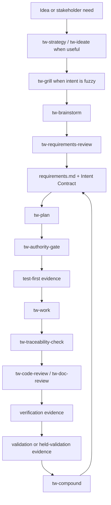

# TraceWeaver Core

<!-- TRACEWEAVER: file-role=first-time-root-readme; req=REQ-TW-015; trace=TRACE-TW-004; ver=VAL-TW-006 -->
<!-- TRACEWEAVER: file-role=first-time-root-readme; req=REQ-TW-016; trace=TRACE-TW-010; ver=VAL-TW-006 -->
<!-- TRACEWEAVER: file-role=first-time-root-readme; req=REQ-TW-020; trace=TRACE-TW-006; ver=VAL-TW-008 -->
<!-- TRACEWEAVER: file-role=first-time-root-readme; req=REQ-TW-021; trace=TRACE-TW-005; ver=VAL-TW-009 -->
<!-- TRACEWEAVER: file-role=first-time-root-readme; req=REQ-TW-023; trace=TRACE-TW-046; ver=VAL-TW-011 -->
<!-- TRACEWEAVER: file-role=first-time-root-readme; req=REQ-TW-041; trace=TRACE-TW-010; ver=VAL-TW-011 -->
<!-- TRACEWEAVER: file-role=first-time-root-readme; req=REQ-TW-043; trace=TRACE-TW-010; ver=VAL-TW-011 -->
<!-- TRACEWEAVER: file-role=first-time-root-readme; req=REQ-TW-065; trace=TRACE-TW-048; ver=VAL-TW-011 -->
<!-- TRACEWEAVER: file-role=first-time-root-readme; req=REQ-TW-068; trace=TRACE-TW-054; ver=VAL-TW-016 -->

TraceWeaver is an open-source agent workflow that keeps coding-agent work tied
to intent, approved requirements, verification evidence, validation questions,
and explicit held claims.

Use it when you want Codex, Claude Code, or other agent tools to move quickly
without losing the proof behind what changed and why.

## Setup

TraceWeaver Core releases from `main`: every release bumps the plugin version
and publishes a `traceweaver-core--v<version>` git tag and a matching GitHub
Release. The marketplace tracks `main`, so a marketplace install or update gives
you the current release, and [GitHub Releases](https://github.com/Oxiom-Systems/traceweaver/releases)
are the canonical release list. To stay current after installing, see
[Updating](#updating) — or just run the `tw-update` skill from inside your
harness.

Pin the tagged `traceweaver-core--v0.2.3` snapshot instead when you need a
reproducible, fixed install. Contributors developing TraceWeaver itself work on
feature branches and open PRs into `main`.

### Codex

Add or refresh the marketplace:

```sh
codex plugin marketplace add Oxiom-Systems/traceweaver
codex plugin marketplace upgrade traceweaver
```

Install `traceweaver-core` from the Codex plugin UI.

Use the tagged release snapshot for a pinned, reproducible local alpha install:

```sh
git clone --branch traceweaver-core--v0.2.3 --depth 1 git@github.com:Oxiom-Systems/traceweaver.git
cd traceweaver
bun run src/index.ts install ./plugins/traceweaver-core --to codex --include-skills
```

If you are developing TraceWeaver itself from an existing checkout, update from
`main` explicitly before reinstalling:

```sh
cd /path/to/traceweaver
git pull --ff-only origin main
bun run src/index.ts install ./plugins/traceweaver-core --to codex --include-skills
```

Verify an isolated Codex install:

```sh
TRACEWEAVER_HOST_RUNTIME_EXEC=0 scripts/traceweaver-smoke-codex-discovery
TRACEWEAVER_HOST_RUNTIME_EXEC=0 scripts/traceweaver-smoke-codex-separate-home-runtime
```

### Claude

Add or refresh the repository marketplace, then install or update the released
plugin:

```sh
claude plugin marketplace add Oxiom-Systems/traceweaver
claude plugin install traceweaver-core@traceweaver
claude plugin marketplace update traceweaver
claude plugin update traceweaver-core@traceweaver
```

Reload active plugins inside Claude Code:

```text
/reload-plugins
```

Install at user scope (the default above) so the `tw-*` skills are available in
every repository you open. The `/reload-plugins` step picks the plugin up
without restarting Claude Code. A user-scope install also follows the Claude
desktop app into mobile remote-control sessions, because remote-control drives
the same Claude Code session running on your machine.

#### Claude Code on the web

Web/cloud sessions (launched from the Claude mobile or web app) run in a fresh,
isolated container that does **not** inherit the plugins installed on your
machine. There is no plugin-only way to auto-install a marketplace plugin into a
cloud session today, so the marketplace and an install step must be committed
into the repository you open on the web.

Copy the small kit in [`examples/claude-code-on-web/`](examples/claude-code-on-web/)
into the repo you want to use on the web. It adds two things to that repo's
`.claude/` configuration:

- `extraKnownMarketplaces`, so the TraceWeaver marketplace is known in the
  container, and
- a `SessionStart` hook that runs `claude plugin install
  traceweaver-core@traceweaver` once the container starts.

After the repo trusts the configuration and the hook runs, the plugin is
installed in the container. If the `tw-*` skills do not appear immediately, run
`/reload-plugins` (or start a fresh session): Claude Code does not always
register a plugin installed into an already-running session without a reload.
This is optional: if you only use the desktop app and mobile remote-control, the
user-scope install above is enough.

### Cursor

TraceWeaver includes a Cursor peer manifest at
`plugins/traceweaver-core/.cursor-plugin/plugin.json`.

Cursor install/update is compatibility-preview only in `0.2.3`: the manifest is
versioned with the Codex and Claude manifests, but TraceWeaver does not claim a
proven Cursor marketplace or runtime install path yet. If you inspect the Cursor
manifest, inspect it from the `traceweaver-core--v0.2.3` tag rather than `main`.
Use the Codex or Claude setup above for supported alpha plugin use, and treat
Cursor testing as held until a Cursor runtime validation record exists.

### Antigravity

For local alpha testing and dogfooding under the Google Antigravity coding
assistant environment, start from the tagged release snapshot rather than
`main`:

```sh
git clone --branch traceweaver-core--v0.2.3 --depth 1 git@github.com:Oxiom-Systems/traceweaver.git
cd traceweaver
bun run src/index.ts install ./plugins/traceweaver-core --to antigravity --include-skills
```

By default, the installer targets
`$HOME/.gemini/config/plugins/traceweaver-core`. If you are using a custom
configuration path, specify it via `--geminiHome`:

```sh
bun run src/index.ts install ./plugins/traceweaver-core --to antigravity --include-skills --geminiHome /path/to/custom/gemini/home
```

Verify the installed layout using the discovery smoke script:

```sh
scripts/traceweaver-smoke-antigravity-discovery
```

## Updating

TraceWeaver Core releases from `main` with a bumped version per release, so
staying current means pulling the marketplace's current state (or re-running the
installer against the latest tag). The easiest path is to ask your agent to run
the `tw-update` skill — it checks the installed version against the latest
release and prints the exact command for your harness:

```text
tw-update
```

The per-harness update commands it recommends are:

### Codex

```sh
codex plugin marketplace upgrade traceweaver
```

Then reinstall `traceweaver-core` from the Codex plugin UI. For a pinned local
install, re-run the installer against the latest tag:

```sh
git clone --branch traceweaver-core--v<latest> --depth 1 git@github.com:Oxiom-Systems/traceweaver.git
cd traceweaver && bun run src/index.ts install ./plugins/traceweaver-core --to codex --include-skills
```

### Claude

```sh
claude plugin marketplace update traceweaver
claude plugin update traceweaver-core@traceweaver
```

Then reload active plugins inside Claude Code:

```text
/reload-plugins
```

Claude resolves a plugin's version from its manifest and caches by that string,
so an update only lands when a new release bumps the version — which every
TraceWeaver release does. For Claude Code on the web, the committed
`SessionStart` install hook reinstalls on each fresh container, picking up the
current release; pin the marketplace ref in `extraKnownMarketplaces` to hold a
specific version.

### Antigravity

```sh
git clone --branch traceweaver-core--v<latest> --depth 1 git@github.com:Oxiom-Systems/traceweaver.git
cd traceweaver && bun run src/index.ts install ./plugins/traceweaver-core --to antigravity --include-skills
```

Find `<latest>` on the
[Releases page](https://github.com/Oxiom-Systems/traceweaver/releases). After any
update, reload plugins or start a fresh session so the new skill surface
registers.

## First Command

For a new or unclear project, start with the high-level route:

```text
tw-auto "bootstrap TraceWeaver authority for this project"
```

For an existing codebase audit:

```text
tw-audit "audit this project for requirements authority, code traces, verification evidence, validation evidence, generated-view drift, dark code, orphaned code, obsolete behavior, duplicate behavior, dead tests, missing verification, and lost intent. Report candidate findings only; do not remove or rewrite anything."
```

For a specific approved change:

```text
tw-auto "implement the approved plan"
```

## Current Alpha Boundaries

TraceWeaver Core `0.2.3` is an alpha advisory plugin for Codex and Claude Code.
It is usable for first-time authority bootstrap, requirements review, planning,
work handoffs, traceability checks, audits, and controlled review flows.
This release keeps the selected Compound Engineering compatibility surface
pinned to upstream `compound-engineering-v3.12.0` while preserving the
TraceWeaver wrapper boundary; direct CE parity and clean replacement remain
held.
Antigravity support is limited to static local install/discovery metadata in
this release scope; Antigravity workflow invocation remains held.
Runtime-driver binding, release-ready status, clean CE replacement, enforcing
mode, slash-command support, unconstrained-host support, and autonomous
publication remain held until their own evidence gates pass.

## What TraceWeaver Gives You

TraceWeaver controls the chain between what the stakeholder asked for, what the
agent interpreted, what changed, how it was verified, and what claims are still
not proven.

```text
stakeholder intent
-> captured needs
-> reviewed requirements
-> approved authority or approved exception
-> implementation
-> verification
-> validation
-> change control
```

The practical rule is simple:

> Meaningful behavior must trace to approved authority and verification
> evidence, or it is not ready to implement, approve, publish, or ship.

TraceWeaver is useful when you need to answer:

- why does this behavior exist?
- which requirement or exception authorizes it?
- which test, fixture, smoke, or review evidence proves it?
- does it still satisfy the original stakeholder need?
- is this code dark, stale, orphaned, duplicated, or only partly validated?
- did an agent make an assumption that should have become a question, gap,
  change, exception, or held claim?

## First Project

For a step-by-step route from a blank prompt to a reviewed first plan, see
[Starting A New Project With TraceWeaver](docs/guides/starting-a-new-project-with-traceweaver.md).

TraceWeaver expects three authority files at the root of a consuming project:

```text
requirements.md
traceability-matrix.md
.traceweaver/intent-contract.yml
```

If those files are missing, `tw-auto` should enter bootstrap mode: draft the
authority shape, stop for requirements review, and avoid implementing code from
an assumption.

```text
tw-auto "bootstrap TraceWeaver authority for this project"
```

If the project already has requirements and an Intent Contract, use `tw-auto`
for the normal path:

```text
tw-auto "describe the work, bug, audit, or improvement"
```

Use the manual route when you want to step through each gate yourself:

```text
tw-strategy "capture product direction"  # optional source evidence
tw-ideate "generate options"             # optional source evidence
tw-grill "stress-test this idea"         # optional source evidence
tw-brainstorm "describe the idea or problem"
tw-requirements-review
tw-plan
tw-authority-gate
tw-work
tw-traceability-check
tw-code-review
tw-doc-review
```

Next step after bootstrap: review the draft requirements before implementation.

## The TraceWeaver Loop



| Situation | Use |
| --- | --- |
| Unsure where to start | `tw-auto "describe the goal"` |
| Product direction needs grounding | `tw-strategy` or `tw-auto` |
| Need generated options before choosing | `tw-ideate`, then `tw-grill` or `tw-brainstorm` |
| Candidate requirements or acceptance criteria exist | `tw-requirements-review` |
| Approved work needs an implementation plan | `tw-plan` |
| Approved plan needs code or docs changed | `tw-work` |
| Behavior-bearing files changed | `tw-code-review` |
| Requirements, plan, matrix, Intent Contract, or evidence changed | `tw-doc-review` |
| Existing repo needs dark-code or lost-intent audit | `tw-audit` |
| Bug, regression, failing test, or incident | `tw-debug` |
| Commit, push, or PR is requested | `tw-commit-push-pr` |
| Learning should be captured | `tw-compound` |

Every TraceWeaver task should end with the next wrapper, review, evidence
record, held condition, or human decision. Do not leave the next workflow step
implicit.

## Authority Files

| File | Purpose |
| --- | --- |
| `requirements.md` | Controlled requirements baseline: stakeholder intent, approved requirements, verification method, validation question, and status. |
| `traceability-matrix.md` | Human-facing traceability matrix linking needs, requirements, implementation, verification, validation, evidence, gaps, and held claims. |
| `.traceweaver/intent-contract.yml` | Current project authority contract: baseline hash, approved scope, active review gate, held claims, and material artifact identity. |
| `.traceweaver/trace-records/` | Evidence records for specific tasks, gates, audits, validation runs, and held conditions. |
| `.traceweaver/gaps/`, `.traceweaver/changes/`, `.traceweaver/exceptions/` | Controlled places for missing authority, changed intent, approved exceptions, accepted risks, and open decisions. |

Skills are capabilities, not authority. A behavior-changing agent handoff must
be able to cite stakeholder intent, approved requirement or approved exception,
verification method, validation question, and current baseline version.

## User-Facing Skills

The normal installed surface is TraceWeaver-owned `tw-*` wrappers plus the
`lfg` compatibility alias. Selected `ce-*` components are packaged as internal
implementation engines and do not close TraceWeaver authority gates by
themselves.

| Skill | Use |
| --- | --- |
| `tw-auto` | Advisory high-level workflow driver for bounded TraceWeaver loops. |
| `lfg` | Compatibility alias that routes through `tw-auto`. |
| `tw-strategy` | Capture or update `STRATEGY.md` as source-evidence grounding. |
| `tw-ideate` | Generate and rank ideas as source evidence. |
| `tw-grill` | Stress-test one idea before brainstorming; output is source evidence only. |
| `tw-brainstorm` | Explore needs, risks, options, assumptions, and gaps before requirements review. |
| `tw-requirements-review` | Review requirements, acceptance criteria, and candidate authority. |
| `tw-plan` | Plan approved work while preserving authority and traceability boundaries. |
| `tw-authority-gate` | Check that implementation has approved authority before work starts. |
| `tw-work` | Implement approved work, establish verification evidence, and update trace evidence. |
| `tw-audit` | Audit a project or branch for authority, traces, verification, validation, and candidate dark behavior. |
| `tw-traceability-check` | Check plans, code, docs, PRs, and release evidence for authority and verification traceability. |
| `tw-code-review` | Run traceability preflight, then code review. |
| `tw-doc-review` | Review requirements, plans, matrices, Intent Contracts, and evidence records. |
| `tw-debug` | Diagnose failures or incidents without bypassing authority or publication gates. |
| `tw-test-browser` / `tw-test-xcode` | Produce linked browser or Xcode verification evidence. |
| `tw-setup` / `tw-worktree` | Diagnose local setup or manage worktrees inside TraceWeaver boundaries. |
| `tw-update` | Check whether the installed TraceWeaver Core is current and recommend the per-harness update command. |
| `tw-sessions` | Use prior sessions as source evidence, not authority. |
| `tw-resolve-pr-feedback` | Evaluate and repair PR feedback with TraceWeaver gates. |
| `tw-commit` / `tw-commit-push-pr` | Publication wrappers for commit, push, and PR intent after gates are clean. |
| `tw-compound` / `tw-compound-refresh` | Capture or refresh learning without silently changing requirements. |

## Audit An Existing Codebase

Use `tw-audit` when you want a project-level report before cleanup, completion,
or release claims:

```text
tw-audit "audit this project for requirement authority, code traces, verification evidence, validation or acceptance evidence, generated traceability view drift, dark code, orphaned code, obsolete or abandoned behavior, duplicate or similar behavior, dead tests, missing verification, and lost intent. Report candidate findings only; do not remove or rewrite anything."
```

Audit findings are routing signals, not automatic cleanup authority.

| Finding type | Normal next step |
| --- | --- |
| Dark or orphaned code | Decide whether to add authority and anchors, convert to a gap, or remove through a reviewed plan. |
| Obsolete behavior | Check whether the requirement is stale, retired, superseded, or intentionally supported. |
| Duplicate behavior | Compare intent and authority before merging, deleting, or keeping both paths. |
| Anchor-only coverage | Add or link verification implementation, procedure, result, or held-validation evidence. |
| Dead TDD | Decide whether the test still proves a current requirement or should be retired with authority. |

Safe cleanup path:

```text
tw-plan "classify and clean up the audit findings"
tw-work
tw-code-review
tw-doc-review
```

## Alpha Boundaries

What is available now:

- installable TraceWeaver Core plugin metadata for Codex and Claude Code, plus
  Antigravity local install metadata;
- TraceWeaver-owned `tw-*` skills and the `lfg` compatibility alias;
- selected CE-derived workflow components packaged internally;
- file-based authority model with `requirements.md`,
  `traceability-matrix.md`, and `.traceweaver/intent-contract.yml`;
- deterministic install/discovery, traceability, no-publication, code-anchor,
  authoring, audit, and packaging smokes for the reviewed alpha surface;
- advisory use for requirements review, planning, work handoffs, audits,
  traceability checks, and controlled review.

What remains held:

- full `tw-auto` runtime-driver decision binding;
- release-ready, package-ready, and upstream-ready claims;
- clean CE replacement as a release claim;
- enforcing mode;
- slash-command support;
- unconstrained-host support;
- autonomous publication;
- automatic removal, merge, or deprecation authority for audit findings.

## Systems Engineering Foundations

TraceWeaver adapts established systems-engineering controls to agentic software
work:

- stakeholder needs and requirements baseline management;
- verification and validation as separate questions;
- traceability from intent through implementation and evidence;
- explicit risk, gap, change, exception, and held-claim records;
- review gates before unsupported claims become release decisions.

TraceWeaver does not claim certification, endorsement, or formal compliance
with INCOSE, ISO, IEEE, NASA, or any other standard. Public artifacts must use
original TraceWeaver wording and must not copy protected standards or handbook
text.

## Product Model

| Name | Role |
| --- | --- |
| TraceWeaver Core | Open-source method, alpha plugin, templates, skills, and validation protocol. |
| TraceWeaver Enterprise | Future commercial product for larger-project governance, dashboards, auditability, and policy profiles. |
| TraceWeaver Cloud | Future hosted MCP/API service for agent access, hosted traceability storage, audit logs, and connectors. |

TraceWeaver Core should stay usable without the future paid layer.

## Repository Map

| Path | Purpose |
| --- | --- |
| `requirements.md` | Current TraceWeaver Core requirements baseline. |
| `traceability-matrix.md` | Human-facing traceability and evidence matrix. |
| `.traceweaver/intent-contract.yml` | Baseline hashes, active gates, held claims, and materialized artifact identities. |
| `plugins/traceweaver-core/` | Installable TraceWeaver Core standalone alpha plugin source. |
| `docs/plans/` | Reviewed implementation plans and scope decisions. |
| `docs/validation/` | Review records, install/runtime observations, smoke evidence, and held-claim records. |
| `docs/guides/` | Public-facing guide drafts and explanatory material. |
| `fixtures/` | Deterministic proof fixtures for traceability, authoring, wrapper routing, publication, and audit behavior. |
| `scripts/traceweaver-smoke-*` | Reproducible smoke checks for the current alpha behavior. |
| `.source-materials/` | Ignored local source cache; never commit protected source material from here. |

Remote:

```text
git@github.com:Oxiom-Systems/traceweaver.git
```

## Proof Trail

The README is the product entry point. Use the controlled authority and
validation files when auditing specific claims:

- [requirements.md](requirements.md)
- [traceability-matrix.md](traceability-matrix.md)
- [.traceweaver/intent-contract.yml](.traceweaver/intent-contract.yml)
- [docs/validation/](docs/validation/)
- [docs/plans/](docs/plans/)
- [CHANGELOG.md](CHANGELOG.md)

## Near-Term Next Steps

1. Dogfood the alpha on TraceWeaver and Vestro through `tw-auto`, `tw-work`,
   `tw-traceability-check`, `tw-code-review`, and `tw-doc-review`.
2. Close or explicitly keep held the full `tw-auto` runtime-driver proof.
3. Keep release-ready, package-ready, upstream-ready, clean-replacement,
   unconstrained-host, autonomous-publication, and automatic cleanup claims held
   until their own evidence gates pass.
