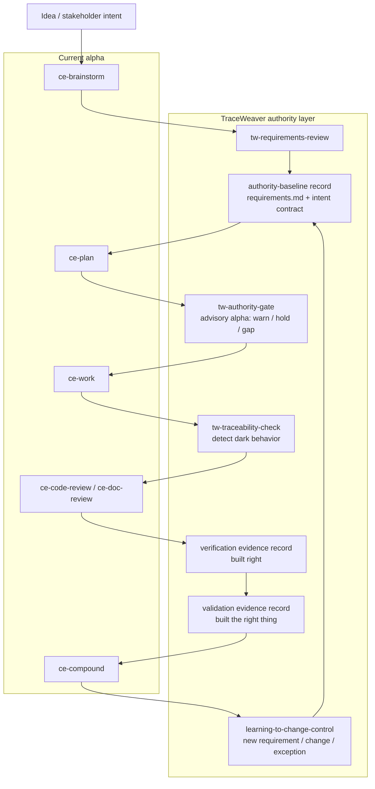

# TraceWeaver Core

Open-source systems engineering traceability for agentic software development.

TraceWeaver Core is a systems-engineering control layer for agentic software
development. Its core role is to preserve intent, authority, and traceability as
agents move from stakeholder needs to requirements, plans, code, tests, and
release decisions.

The problem TraceWeaver solves is that agents can move very fast, but they often
blur the chain between:

```text
what the stakeholder asked for
-> what the agent interpreted
-> what got implemented
```

TraceWeaver forces a controlled chain:

```text
stakeholder intent
-> captured needs
-> reviewed requirements
-> approved authority or approved exception
-> implementation
-> verification
-> validation
-> change control
```

The key principle is:

> Agents may help create requirements, plans, code, tests, and evidence, but
> they may not silently promote their own interpretation into authority.

The current wedge is:

> Meaningful behaviour must trace to approved authority, or it is not ready to
> implement, approve, or ship.

The code-level gate is:

> Every meaningful behavior-bearing unit must trace to approved authority and
> verification evidence.

In practice, a behavior-bearing skill, workflow wrapper, command, script,
function, method, or class cannot be treated as done until the traceability
matrix names the requirement or approved exception that authorizes it, the
implementation location, and the verification evidence that proves it.

In simple terms: TraceWeaver keeps agentic development aligned to the original
intent, proves that implementation traces back to approved requirements, and
records gaps, risks, assumptions, and changes instead of letting them become
hidden authority.

TraceWeaver is intended to become a standalone plugin that can replace the
installed Compound Engineering plugin for this workflow. It is based on the
selected CE planning, work, review, and learning surface, but TraceWeaver adds
the controlling authority layer: Intent Contract, requirements baseline,
traceability matrix, verification evidence, validation questions, and explicit
gap/change/exception handling.

## Naming Model

| Name | Role |
|---|---|
| TraceWeaver | Overall project and product identity |
| TraceWeaver Core | Open-source method, skills, templates, and validation protocol |
| TraceWeaver CE | Compound Engineering adapter/plugin implementation |
| TraceWeaver Enterprise | Paid commercial product for larger-project governance |
| TraceWeaver Cloud | Hosted MCP/API service |
| TraceWeaver Connect | Connector layer for enterprise and cloud integrations |
| `systems-engineering-traceability` | Upstream-neutral Agent Skills skill name |
| `ce-traceability` | Compound Engineering-specific skill name |

TraceWeaver Core should stay usable without the future paid layer. The paid
layer should make the same method scalable through relationship storage,
dashboards, governance, and integrations.

## Architecture Layers

| Layer | Purpose | Names |
|---|---|---|
| Core skills | Portable, upstream-neutral capabilities usable in any agentic workflow | Core 11 suite under `skills/`; `requirements-reviewer` and `systems-engineering-traceability` remain the current runtime-candidate subset |
| Core lifecycle guidance | Explains how the core skills work together from idea to change control | `traceweaver-operating-model`, matrix template, requirements/V&V guide, risk/gap/change-control guide |
| Compound Engineering adapter | Wires the core capabilities into Compound Engineering workflows, prompts, agents, and delegation | TraceWeaver CE, `ce-traceability`, `ce-traceability-reviewer`, CE hooks |

Ownership rule:

- `requirements-reviewer` answers whether needs, requirements, success criteria,
  acceptance criteria, or reframed requirements are good enough to become
  authority.
- `systems-engineering-traceability` answers whether meaningful behaviour traces
  to approved authority, implementation, verification, and validation evidence.
- TraceWeaver CE wires those Core capabilities into Compound Engineering. CE
  wrappers must not become the source definition of the Core capabilities.

## Intent Contract

TraceWeaver's authority model is Intent Contract centered. Skills are
capabilities, not authority. Every behavior-changing agent handoff must be able
to cite:

- stakeholder intent;
- approved requirement or approved exception;
- verification method;
- validation question;
- current baseline version.

Alpha implementations can remain advisory, but missing authority must be
visible as a gap, proposed requirement, change, exception, accepted-risk
candidate, clarification record, or held claim. Agent assumptions are not
implementation authority.

The planned file-based alpha shape is:

```text
requirements.md
traceability-matrix.md
.traceweaver/
  intent-contract.yml
  authority-baseline.yml
  task-capsules/
  trace-records/
  gaps/
  changes/
  exceptions/
```

The plugin package should provide templates for consuming repositories to create
these files. It should not install project-specific authority records into a
repo automatically.

For TraceWeaver projects, `requirements.md` and `traceability-matrix.md` should
live at the repository root because they are primary human-facing authority
files. Supporting plans, validation records, brainstorms, and review evidence
can live under `docs/` as normal. Operational TraceWeaver records, task
capsules, gaps, changes, and exceptions live under `.traceweaver/`.

## Requirements Baseline

The accepted master controlled requirements baseline is
[requirements.md](requirements.md). It is the current planning authority for
TraceWeaver Core and supersedes the older brainstorm requirement documents as
the controlling baseline. Those brainstorm documents remain source evidence and
rationale.

The project traceability matrix is
[traceability-matrix.md](traceability-matrix.md). In the early project shape,
it intentionally lives beside `requirements.md` because it is a primary
human-facing authority file: `requirements.md` says what is approved, while
`traceability-matrix.md` shows how intent, requirements, artifacts,
verification, validation, gaps, and held claims connect.

## Compound Engineering Workflow

TraceWeaver does not replace the Compound Engineering loop. It wraps that loop
with authority control, traceability, verification, validation, and change
control.

The base workflow is:

```text
idea
-> brainstorm
-> TraceWeaver requirements baseline
-> plan
-> work
-> review
-> verification
-> validation
-> compound learning
```

The important control point is between `brainstorm` and `plan`: ideas stop being
loose context and become controlled requirements authority only after they are
captured, reviewed, and baselined.

| CE stage | TraceWeaver control step | Purpose |
|---|---|---|
| `idea` | intent capture | Capture stakeholder intent. Ideas are not authority yet. |
| `ce-brainstorm` | `tw-requirements-review`, then authority-baseline record | Explore needs, risks, options, assumptions, and gaps, then convert accepted ideas into `requirements.md`, intent IDs, requirement IDs, exceptions, validation questions, and baseline version. |
| `ce-plan` | `tw-authority-gate` | Plan only against approved requirements or approved exceptions. Every task gets an Intent Capsule. |
| `ce-work` | `tw-traceability-check` | Agents implement only what their capsule authorizes. Assumptions become gaps or change requests, not code. |
| `ce-code-review` / `ce-doc-review` | verification evidence record, then validation evidence record | Check what changed, what requirement authorized it, what verifies it, and whether it still satisfies the stakeholder validation question. |
| `ce-compound` | learning-to-change-control handoff | Record lessons and patterns without silently changing authority. New learning creates proposed requirements or change records when needed. |

The target TraceWeaver-controlled CE loop is:

```text
idea
-> ce-brainstorm
-> tw-requirements-review
-> authority-baseline record
-> ce-plan
-> tw-authority-gate
-> ce-work
-> tw-traceability-check
-> ce-code-review / ce-doc-review
-> verification evidence record
-> validation evidence record
-> ce-compound
```

In the current alpha, this is a workflow architecture and documentation
baseline. Runtime wrappers, clean CE replacement behavior, slash-command
surfaces, and dynamic discovery remain held until the relevant U6b-dynamic, U7,
or U9 evidence records approve them.

TraceWeaver is strongest at five handoffs:

1. After `brainstorm`, before `plan`: turn ideas into controlled requirements.
2. Before `work`: warn in advisory mode, and block only after enforcing mode is
   approved, when a task has no approved authority.
3. During `review`: detect untraced dark behavior.
4. Before release: verify and validate against the original intent.
5. During `compound`: preserve learning without silently rewriting the baseline.

Every TraceWeaver task should end with suggested next steps. The handoff should
name the next CE command, TraceWeaver gate, evidence record, or held condition so
contributors do not have to reconstruct the workflow state from validation
history.

## CE Static Continuity And Future Wrapper Rule

TraceWeaver should not reimplement Compound Engineering workflow logic when a
selected CE workflow skill can be preserved. The standalone TraceWeaver plugin
uses selected CE-compatible skills as implementation components, then routes
the normal autonomous entrypoint through TraceWeaver authority controls.

The user-facing controlled workflow is:

```text
idea
-> ideation source
-> tw-grill
-> ce-brainstorm
-> tw-requirements-review
-> authority-baseline record
-> ce-plan
-> tw-authority-gate
-> ce-work
-> tw-traceability-check
-> ce-code-review / ce-doc-review
-> verification evidence record
-> validation evidence record
-> ce-compound
```

The alpha rule is:

- preserve selected `ce-*` workflow behavior as static implementation
  components unless runtime evidence approves deeper wrapper sequencing or
  replacement;
- use `tw-*` skills for TraceWeaver-specific adapters: requirements review,
  optional post-ideation grilling, authority gate, traceability check, and
  evidence handoff;
- represent authority-baseline, verification, and validation as records in the
  current alpha, not as installed skills, unless a later unit explicitly
  materializes and proves those skills;
- create `tw-auto` as the TraceWeaver-controlled autonomy surface;
- make packaged `lfg` a compatibility alias that delegates to `tw-auto` so the
  familiar autonomous entrypoint cannot bypass TraceWeaver authority;
- keep direct `ce-*` invocation as legacy/manual-continuity only until wrapper
  sequencing is materialized and runtime-proven;
- keep clean CE replacement, slash commands, enforcing mode, and dynamic
  no-forced discovery held until U9 or a later accepted runtime proof.

`tw-auto` is the advisory automation path for this model. It groups CE-style
planning, work, and review with TraceWeaver authority checks, matrix updates,
bounded review-fix cycles, and next-step handoffs. In the alpha it must stop
before commit, push, or PR creation; publication automation remains a later
runtime claim.

There are two valid blank-project starts:

```text
intent-first path:
idea
-> ideation source
-> tw-grill
-> ce-brainstorm
-> tw-requirements-review
-> accepted requirements baseline
-> tw-auto
```

```text
fast bootstrap path:
tw-auto "build X"
-> draft requirements.md
-> draft traceability-matrix.md
-> draft .traceweaver/intent-contract.yml
-> stop for tw-requirements-review
```

`tw-auto` does not automatically run idea generation or `tw-grill`. When a new
project has no TraceWeaver authority files yet, it bootstraps draft
`requirements.md`, `traceability-matrix.md`, and
`.traceweaver/intent-contract.yml`, then stops for requirements review before
implementation. Missing authority starts a baseline conversation; it does not
authorize code.

`tw-grill` is an optional source-evidence step between ideation and
`ce-brainstorm`. It stress-tests one selected idea, inspects repo context instead
of asking when the answer is discoverable, and gives a recommended answer for
each user-facing question. Its output is not authority until reviewed into
`requirements.md`. In this alpha, `ce:ideate` is optional external CE context,
not a packaged TraceWeaver skill.

## CE Method With TraceWeaver Authority

The product intent is not to install CE skills beside separate TraceWeaver
skills and expect users to remember the right sequence. TraceWeaver should
repackage the selected Compound Engineering method so the familiar simple steps
remain, but each step carries systems-engineering authority.

That means the TraceWeaver plugin should turn:

```text
idea -> ideate -> grill -> brainstorm -> plan -> work -> review -> compound learning
```

into:

```text
idea
-> selected idea stress-tested by tw-grill when needed
-> captured stakeholder intent
-> brainstormed needs, risks, options, assumptions, and gaps
-> reviewed requirements baseline
-> Intent Contract and task capsules
-> plan/work/review with authority gates
-> traceability matrix updates
-> verification evidence
-> validation against the original intent
-> compound learning routed to change control
```

The selected CE skills are implementation components for that flow. They should
be wrapped or aliased by TraceWeaver entrypoints when needed so users get the CE
style of work, but TraceWeaver remains the authority layer.

Every wrapped step must ask the same control questions:

- What stakeholder intent is this serving?
- Which approved requirement or approved exception authorizes it?
- Is the requirement good enough to become implementation authority?
- What traceability-matrix row needs to be created or updated?
- What verification proves we built it right?
- What validation question proves we built the right thing?
- Did this introduce dark behavior, duplicate behavior, a missing requirement,
  or a logical implementation that has not been captured as authority?

If the answer is missing, the workflow creates a gap, proposed requirement,
change, exception, accepted-risk candidate, clarification, or removal candidate.
It does not let the agent silently turn useful-looking code into product
behavior.

## Fast Path To TraceWeaver-First Use

The fastest useful path is not to wait for full CE replacement. Use TraceWeaver
first as an advisory authority layer while CE remains the execution engine, then
replace CE only after the selected CE-compatible workflow surface is proven.

Immediate advisory use:

1. Capture project intent and requirements in `requirements.md`.
2. Create `.traceweaver/intent-contract.yml` from the accepted baseline.
3. Require every plan/work/review handoff to cite the baseline, intent IDs,
   requirement IDs or exceptions, verification method, and validation question.
4. Treat missing authority as a warning, gap, proposed requirement, change
   request, exception, or held claim.
5. Keep using CE commands for execution until TraceWeaver proves the replacement
   surface.

TraceWeaver can replace the CE plugin only when these conditions are met:

- selected CE workflow skill names are materialized in `plugins/traceweaver-core`;
- selected CE agent files are materialized or explicitly held with degradation
  behavior;
- `tw-*` adapters invoke Core skills without redefining Core authority rules;
- install evidence proves the selected skills, references, agents, and manifests
  are present after install;
- runtime proof shows planning, work, review, verification, validation, and
  compound-learning flows operate without the installed CE plugin;
- clean CE replacement, dynamic discovery, slash commands, and enforcing mode
  stay held until their evidence records pass.



The operational migration is:

| Stage | What changes | What remains held |
|---|---|---|
| Advisory overlay | Keep CE installed; use TraceWeaver baseline, Intent Capsules, and trace checks on every meaningful task. | CE replacement, enforcing mode, dynamic discovery claims. |
| TraceWeaver plugin alpha | Install `plugins/traceweaver-core` with selected skills and references; use `tw-auto` or the `lfg` compatibility alias for controlled automation; record static install evidence. | Agent-backed CE parity, slash commands, clean replacement. |
| CE-compatible runtime | Materialize selected CE workflow skills and selected agents or record explicit limitations. | Full CE replacement until runtime proof passes. |
| Replacement proof | Run planning, work, review, verification, validation, and compound-learning smoke tests without CE installed. | Release-ready and full Core 11 claims until U9/R31 pass. |
| TraceWeaver-first | Use the TraceWeaver plugin as the default workflow surface. | Enterprise/release/upstream claims unless separately approved. |

## Current State

As of 2026-05-01:

| Area | Status | Notes |
|---|---|---|
| TraceWeaver Core repo | Primary project home | `git@github.com:Oxiom-Systems/traceweaver.git` |
| Agent Skills fork | U5.5 reduced static-scope candidate | `feature/systems-engineering-traceability` branch in the Agent Skills fork at `696548694dd40ce298d77e603db069934b58f645`; selected file deltas are recorded, but dynamic no-forced runtime discovery is deferred to U6b/U9 |
| U5 validation baseline commit | `ca6ff66` | `docs: align skill tree count` |
| U5 delta inventory | `CLOSED_NO_DELTA` | No exact U5 public artifact targets remain outside the U4-promoted skill-folder paths |
| U5.5 expanded runtime candidate | `REDUCED_FOR_U6A_STATIC_SCOPE_ONLY` | Candidate `696548694dd40ce298d77e603db069934b58f645` has file-level delta/impact records and static requirements-quality/lifecycle-discovery evidence, including referenced requirements-reviewer files, under limitation `U55-LIMIT-STATIC-DISCOVERY-001`. Dynamic discovery, package-ready, release-ready, and upstream-ready claims remain held |
| TraceWeaver Core plugin alpha | U6b Unit 2 static materialization accepted; controlled-autonomy package scope in review | `plugins/traceweaver-core` contains plugin manifests, selected Light v0.1 runtime skills, selected CE-compatible skills and agents, skill-local selected references, Intent Contract/templates, `tw-auto`, optional `tw-grill`, and an `lfg` compatibility alias that delegates to `tw-auto`. The repo-local README install command now materializes the selected skills and 49 selected CE agent TOML files with `--include-skills`; `tw-auto`/`lfg`/`tw-grill` static install smoke has passed. Review refresh, dynamic discovery, real invocation transcript, clean CE replacement, package-ready, release-ready, upstream-ready, and R31 claims remain held |
| Intent Contract architecture | Active file-based authority baseline and templates | Root `requirements.md`, root `traceability-matrix.md`, and `.traceweaver/intent-contract.yml` are active project authority artifacts. Packaged templates now include requirements baseline, Intent Contract, trace record, task capsule, gap/change/exception, matrix bootstrap, and controlled-autonomy policy templates. Runtime enforcement and wrapper behavior remain held until later proof |
| Core 11 public skill folders | U4-promoted public artifacts | `skills/` contains all eleven scrubbed public-candidate skill folders; only the Light v0.1 subset has U6b alpha install-smoke evidence |
| Operating model reference | Implementation-ready candidate | `references/systems-engineering-traceability-operating-model.md` |
| Traceability matrix template | Implementation-ready candidate | `references/traceability-matrix-template.md`; matrix is mandatory for the MVP |
| Requirements and V&V guide | U6b alpha static loading evidence | `references/requirements-and-vv-guide.md`; packaged as a selected skill-local reference in `plugins/traceweaver-core`, but not package-ready or release accepted |
| Risk, gap, and change-control guide | U6b alpha static loading evidence | `references/risk-gap-and-change-control-guide.md`; packaged as a selected skill-local reference in `plugins/traceweaver-core`, but not package-ready or release accepted |
| Discovery routing | Runtime candidate evidence scope | Idea/intent lifecycle evidence is in scope as source-preservation and routing context only; `idea-refine` command wiring remains follow-up unless separately authorized. Requirements and success criteria route through `requirements-reviewer`; meaningful behavior routes through traceability as a cross-cutting hop |
| Validation record | Refreshed through U5.5 reduced static-scope handoff | U5 representative pass applies only to `ca6ff66d46f140da72f423ea3dec819f81ef5337`; U5 delta inventory is closed no-delta; U5.5 terminal state is `REDUCED_FOR_U6A_STATIC_SCOPE_ONLY` |
| Controlled validation | Representative complete for U5 baseline | VRUN-001, VRUN-002, and VRUN-003 passed with human ratings recorded at `ca6ff66`, but R31 real-project validation remains open |
| Upstream PR packaging | Blocked before release evidence | U6b now records only alpha install smoke and static selected-skill materialization; do not claim release/upstream readiness until later gates provide dynamic runtime, release, and R31 evidence |
| TraceWeaver CE adapter | In progress | Compound Engineering adapter work is separate from the Core repo |
| TraceWeaver CE lifecycle baseline | In progress | Baseline approval and validation are not closed yet |

## TraceWeaver Core MVP Bundle

The TraceWeaver Core MVP is not just a skill prompt. The minimum usable
traceability capability is:

- `skills/requirements-reviewer/SKILL.md`
- `skills/systems-engineering-traceability/SKILL.md`
- `references/systems-engineering-traceability-operating-model.md`
- `references/traceability-matrix-template.md`
- `references/requirements-and-vv-guide.md`
- `references/risk-gap-and-change-control-guide.md`
- README or index discoverability updates
- fork validation evidence from controlled scenarios

The traceability matrix is mandatory once the skill is used. Lite mode may use a
minimal matrix row, but it cannot skip the matrix artifact entirely.

The two companion guides are mandatory candidate guidance for the Core MVP, not
optional extras; runtime acceptance still depends on U5.5/U6 records.

## Upstream Packaging Boundary

The upstream `agent-skills` PR is a separate acceptance surface. It may be
packaged smaller than TraceWeaver Core if required by maintainer feedback, but
any reduction must be recorded as a scope decision. The matrix template and
operating model remain required for a usable traceability MVP.

## Guidance Pipeline

TraceWeaver uses a three-layer guidance pipeline:

| Layer | Path | Git Status | Purpose |
|---|---|---|---|
| Private source work | `.source-materials/` | Ignored | Source cache, conversions, extraction notes, and synthesis. Not for agents. |
| Public source of truth | `docs/distilled/` | Committed | Original TraceWeaver guidance developers review, edit, and evolve. |
| Runtime agent bundle | `agent-skills/references/` | Committed in the Agent Skills fork | Candidate runtime copies; not package/release accepted until U5.5/U6 records close. |

Agent implementations must not read from `.source-materials/`. Runtime
references must first come from reviewed `docs/distilled/` guidance, then be
synced into `agent-skills/references/`.

When the runtime references change, the Agent Skills implementation commit must
be refreshed, reviewed, and recorded in the validation record before that new
runtime bundle is treated as validated.

Runtime guidance is not considered synced unless the source-to-runtime mapping,
version stamp, checksum, reviewer, review session, and implementation commit are
recorded in the validation record.

## Operating Model

TraceWeaver Core uses an original, lightweight, systems-engineering-aligned
operating model for agentic software work:

```text
idea / intent
-> stakeholder need
-> user requirement
-> system requirement
-> design decision
-> implementation
-> verification
-> validation
-> change control
```

The agent-facing rules are intentionally compact:

- Brainstorming creates candidate needs, assumptions, risks, and success
  signals. It does not create implementation authority.
- Idea refinement is part of the lifecycle. Ideas are preserved as candidate
  needs, assumptions, risks, success/failure signals, open decisions, and
  not-doing boundaries before they become requirements or work.
- Planning preserves original stakeholder wording beside any agent reframe,
  marks reframed requirements as `Draft`, and uses requirements-reviewer before
  those requirements or success criteria can become approved authority.
- Planning converts approved needs and reviewed draft requirements into design
  decisions, ATP/result expectations, verification paths, and validation paths.
- Work agents may only implement meaningful behaviour when it traces to
  approved authority.
- Review findings are provenance, not authority. They become authority only
  when converted into an approved requirement change, design decision, risk
  control, or approved traceability gap.
- A task ID alone is not authority.
- A bare `RISK-*` ID is not authority.
- Verification asks whether we built it right.
- Validation asks whether we built the right thing.
- Missing traceability must be exposed, not invented.

## Approved Authority Rule

Valid approved authority means one of:

- approved requirement
- approved ADR or design decision
- first-class approved risk control
- approved traceability gap
- task ID that closes directly to one of the approved authorities above

The following are not valid authority by themselves:

- bare task ID
- bare stakeholder need
- draft requirement
- inferred requirement
- unapproved design note
- bare `RISK-*` ID
- review finding
- traceability debt item
- implementation convenience

If a link is inferred, draft, stale, ambiguous, or not approved, the behaviour
remains orphaned until human approval resolves it.

## Validation Gate

TraceWeaver Core representative validation is complete for the U2-U5 baseline
implementation slice at `ca6ff66d46f140da72f423ea3dec819f81ef5337`.

Validation status:

- `ca6ff66d46f140da72f423ea3dec819f81ef5337`: U2-U5 implementation slice
  passed representative dummy validation.
- R31 real-project validation remains open for the real feature, unclear
  existing module, and low-risk Lite-mode scenarios.
- U5.5 expanded runtime candidate: `REDUCED_FOR_U6A_STATIC_SCOPE_ONLY`. Candidate
  `696548694dd40ce298d77e603db069934b58f645` has static file-level
  delta/impact, requirements-quality, and lifecycle-discovery evidence under
  `U55-LIMIT-STATIC-DISCOVERY-001`.
- Packaging status: U6b alpha install smoke passed for static loading only.
  Dynamic discovery and real adapter invocation remain U9 or later
  U6b-dynamic testing requirements.

The validation record contains all three controlled U5 baseline runs. These are
representative dummy runs, not R31-completing real-project validation:

| Scenario | Purpose | Status |
|---|---|---|
| VRUN-001: New feature with document chain | Prove requirement-to-plan-to-implementation-to-results traceability | Representative pass; R31 real run still required |
| VRUN-002: Existing module audit | Prove the skill finds dark-code candidates and missing traceability | Representative pass; R31 real run still required |
| VRUN-003: Low-risk Lite mode | Prove Lite mode stays lightweight while still using a minimal matrix artifact | Representative pass; R31 real run still required |

The validation record must compare baseline Agent Skills behaviour against the
traceability-enabled workflow from the same starting state. It must record
distinct value, reviewer confidence, useful findings, low-value noise, and
workflow overhead.

Current validation record:

- `docs/validation/systems-engineering-traceability-fork-results.md`

## Source Materials Policy

Committed TraceWeaver artifacts must be original project writing. They may cite
official or public source pages, but they must not reproduce protected standards
or handbook text.

Local source material belongs only in:

```text
.source-materials/
```

That directory is intentionally ignored by git. It may contain licensed
standards, public downloads, extraction notes, checksums, and source inventories
used to create original distilled guidance.

Policy: public commits keep local source-processing instructions out of the
repository. Promotion and hygiene constraints are recorded in
`docs/validation/traceweaver-core-11-promotion-records.md`.

Canonical distilled guidance:

- `docs/distilled/systems-engineering-traceability-operating-model.md`
- `docs/distilled/traceability-matrix-template.md`
- `docs/distilled/requirements-and-vv-guide.md`
- `docs/distilled/risk-gap-and-change-control-guide.md`

## Repository Map

| Path | Purpose |
|---|---|
| `docs/brainstorms/` | Requirements and product framing |
| `docs/distilled/` | Public TraceWeaver source-of-truth guidance produced through controlled promotion records |
| `docs/specs/` | Source specification for the MVP skill |
| `docs/plans/` | Implementation and validation plans |
| `skills/` | U4-promoted public TraceWeaver Core skill folders; not runtime/package accepted until U6 records exist |
| `plugins/traceweaver-core/` | Installable TraceWeaver Core alpha plugin for the U6a-selected Light v0.1 runtime scope |
| `docs/upstream/` | Upstream issue and public-safe fork preflight records |
| `docs/validation/` | Fork validation protocol and results |
| `.source-materials/` | Ignored local source cache |

Related implementation workspaces:

| Workspace | Purpose |
|---|---|
| Agent Skills fork | Upstream-neutral Agent Skills candidate implementation |
| Compound Engineering plugin workspace | TraceWeaver CE / Compound Engineering adapter work |

Remote:

- `git@github.com:Oxiom-Systems/traceweaver.git`

## Near-Term Next Steps

1. Treat U6b as passed only for TraceWeaver Core alpha install smoke and static
   selected-skill materialization under `light-v0.1-authority-traceability`.
2. Record observed no-forced runtime discovery and real adapter invocation as
   U9 or later U6b-dynamic evidence before
   any dynamic discovery, package-ready, release-ready, or upstream-ready claim.
3. Complete R31 real-project validation or keep it as an explicit U7 release
   blocker.
4. Prepare U7 release-gate decisions and release claim records before any U8
   upstream-neutral package, PR, or release-note surface.
5. Continue TraceWeaver CE baseline and lifecycle integration with the Core
   validation surface as the control point.

## Product Direction

TraceWeaver Core provides the open-source method: lifecycle rules, traceability
matrix, approved-authority gate, verification/validation distinction,
brownfield debt handling, and review discipline.

TraceWeaver Enterprise is the paid commercial product for teams that need
larger-project governance, auditability, policy profiles, and integration with
existing engineering systems.

TraceWeaver Cloud is the hosted MCP/API service for agent access, hosted
traceability storage, dashboards, audit logs, and connector-backed workflows.

TraceWeaver Enterprise and TraceWeaver Cloud should provide:

- MCP and API servers
- relational traceability database
- knowledge-base access
- impact analysis
- dashboards and audit reports
- audit logs
- enterprise policy profiles
- larger-project governance
- GitHub, Jira, Linear, ReqIF, OSLC, Capella, RMF, DOORS, Jama, and Polarion
  connectors over time

The open-source version should work without those services. The paid version
should make the same control model practical at team and enterprise scale.
