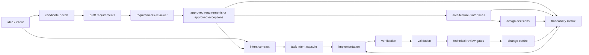

# TraceWeaver Core Skill Taxonomy Requirements

## Problem Frame

TraceWeaver is drifting because Core capabilities, lifecycle orchestration, and
Compound Engineering adapter wiring are being discussed as if they are the same
thing.

TraceWeaver Core should be the portable, systems-engineering-aligned skill set.
TraceWeaver CE should be only the adapter that wires Core capabilities into
Compound Engineering workflows, prompts, reviewers, and delegation payloads.

The Core architecture must preserve stakeholder intent through a controlled
authority baseline. Skills are capabilities; they do not preserve intent by
themselves. TraceWeaver must therefore give every agent a small mandatory
Intent Contract that defines the approved intent, requirement or exception,
verification method, validation question, out-of-scope boundaries, and current
baseline version for the work it is allowed to perform.

Core invariant:

```text
No agent may implement, review, or modify behavior unless it can point to:
1. stakeholder intent,
2. approved requirement or approved exception,
3. verification method,
4. validation intent,
5. current baseline version.
```

The taxonomy must answer five questions before more implementation work starts:

- Which skills are Core now?
- Which skills are Core later?
- Which skills are CE adapter only?
- Which systems-engineering process contexts does Core cover directly,
  acknowledge as context, or defer?
- Which skill owns lifecycle transition reviews and audits?

## Recommended Taxonomy

| Category | Skills | Decision |
|---|---|---|
| First batch: authority foundation | `needs-and-requirements-capture`, `requirements-reviewer`, `systems-engineering-traceability`, `risk-gap-change-control`, Intent Contract runtime artifacts | Required before TraceWeaver can behave correctly because it defines what may become authority and how agents receive a bounded authority slice. |
| Second batch: lifecycle and architecture control | `traceweaver-lifecycle-orchestrator`, `architecture-and-interface-reviewer`, `design-decision-reviewer` | Defines how work moves through the lifecycle, how architecture/interface structure is controlled, and how design choices are justified. |
| Third batch: evidence, review, and brownfield control | `verification-planner`, `validation-planner`, `technical-review-and-audit-gate`, `baseline-configuration-control` | Defines proof, V&V evidence, lifecycle transition readiness, and adoption in existing projects. |
| CE adapter only | `ce-traceability`, `ce-traceability-reviewer`, future `ce-requirements-reviewer`, CE hooks, CE delegation prompts | Adapter wrappers only. They must not define Core semantics. |

The eleven-skill set is the intended TraceWeaver Core systems-engineering skill
set. It is not a four-skill Lite add-on. All eleven skills now exist in the
scrubbed public-candidate baseline and should be promoted through controlled
review, baseline, runtime, and validation gates.

Scrubbed public-candidate baseline:

```text
internal_provenance_record: TWCORE-INT-PROV-2026-04-29-001
status: scrubbed public candidate, not public/runtime authority
```

Recommended public-promotion order for the seven skills added after the first
batch:

1. `baseline-configuration-control`
2. `technical-review-and-audit-gate`
3. `verification-planner`
4. `validation-planner`
5. `architecture-and-interface-reviewer`
6. `design-decision-reviewer`
7. `traceweaver-lifecycle-orchestrator`

This order is driven by current control gaps: stale candidates, fork diffs,
review readiness, target-runtime verification, and independent adoption
validation need owners before broad lifecycle orchestration is promoted.

## Current Acceptance State

Batch membership is not the same as approved runtime, package, or release
status. U4 public skill-folder promotion has passed for all eleven skills where
supported by `docs/validation/traceweaver-core-11-promotion-records.md`.
Runtime candidate acceptance and release/package acceptance remain separate
states; U4 passed does not imply runtime-ready or release-ready.

| Skill | Batch | Public skill-folder acceptance | Runtime candidate acceptance | Release/package acceptance | Notes |
|---|---|---|---|---|---|
| `needs-and-requirements-capture` | Batch 1 | U4 passed | Held; no accepted runtime subset yet | Held | Preserves original source wording, candidate status, assumptions, constraints, and success signals. |
| `requirements-reviewer` | Batch 1 | U4 passed | U5.5 pending for the first runtime subset | Held | Live candidate exists, but runtime acceptance still needs focused review and validation closure. |
| `systems-engineering-traceability` | Batch 1 | U4 passed | U5.5 pending for the first runtime subset | Held | U5 representative validation exists for an older slice; R31 real-project validation remains open. |
| `risk-gap-change-control` | Batch 1 | U4 passed | Held; no accepted runtime subset yet | Held | Owns accepted risks, approved gaps, weak-requirement exceptions, and change-control records. |
| `baseline-configuration-control` | Batch 3 / priority 1 for runtime consideration | U4 passed | Held; no accepted runtime subset yet | Held | Needed to control final candidates, fork diffs, stale gates, and package scope. |
| `technical-review-and-audit-gate` | Batch 3 / priority 2 for runtime consideration | U4 passed | Held; no accepted runtime subset yet | Held | Needed for entry/exit criteria, not-clean review states, action closure, and readiness-to-proceed decisions. |
| `verification-planner` | Batch 3 / priority 3 for runtime consideration | U4 passed | Held; no accepted runtime subset yet | Held | Needed for target-runtime discovery, harness evidence, and objective proof that implementation satisfies requirements. |
| `validation-planner` | Batch 3 / priority 4 for runtime consideration | U4 passed | Held; no accepted runtime subset yet | Held | Needed for R31 independent/representative adoption evidence and stakeholder/intended-use validation. |
| `architecture-and-interface-reviewer` | Batch 2 / priority 5 for runtime consideration | U4 passed | Held; no accepted runtime subset yet | Held | Reviews stakeholders, concerns, viewpoints/views, interfaces, consistency, constraints, risks, and rationale. |
| `design-decision-reviewer` | Batch 2 / priority 6 for runtime consideration | U4 passed | Held; no accepted runtime subset yet | Held | Reviews ADR/design-decision quality, alternatives, trade-offs, linked authority, and drift. |
| `traceweaver-lifecycle-orchestrator` | Batch 2 / priority 7 for runtime consideration | U4 passed | Held; no accepted runtime subset yet | Held | Routes lifecycle state and handoffs; it must not approve technical content itself. |

## Distillation Focus

| Skill | Core question | What to distill |
|---|---|---|
| `needs-and-requirements-capture` | What problem, mission context, stakeholder need, constraints, assumptions, and success signals are we responding to? | Mission/business context, stakeholder classes, stakeholder concerns, operating context, original wording preservation, needs extraction, assumptions, constraints, success signals, open questions, candidate vs approved status. |
| `requirements-reviewer` | Is this requirement good enough to become authority? | Requirement quality rules, bad requirement patterns, functional and non-functional classification, shall-style wording, ambiguity checks, verifiability, accepted weak requirement handling. |
| `systems-engineering-traceability` | Does this behavior trace to approved authority and V&V evidence? | Traceability matrix rules, no-orphan gate, valid authority, approved gaps, risk-control authority, dark-code detection, trace links. |
| `risk-gap-change-control` | How do we handle exceptions and moving requirements? | Approved gaps, accepted risks, weak requirement exceptions, requirement change records, risk/hazard statements where applicable, severity/probability or impact/likelihood, mitigation/control, mitigation verification, residual-risk acceptance, owners, allowed use, review conditions, lifecycle tracking. |
| `traceweaver-lifecycle-orchestrator` | Which skill runs at each lifecycle stage? | Lifecycle process map, handoff contracts, skill routing rules, artifact flow, cumulative routing, stop/ask rules. |
| `architecture-and-interface-reviewer` | Is the architecture/interface structure justified, consistent, and traceable? | Stakeholders, concerns, viewpoints/views, interface contracts, integration assumptions, consistency across views, rationale, linked requirements, linked risks, linked constraints. |
| `design-decision-reviewer` | Is this design choice justified? | ADR quality, design rationale, alternatives, trade-offs, requirement links, risk links, scope drift checks. |
| `verification-planner` | How do we prove we built it right? | Verification methods, ATP structure, pass/fail criteria, test evidence, inspection/analysis/demonstration/test distinction. |
| `validation-planner` | How do we prove we built the right thing? | Validation scenarios, stakeholder acceptance, operational fit, demonstration criteria, validation gaps, deferred validation. |
| `technical-review-and-audit-gate` | Are we ready to proceed to the next lifecycle stage? | Review readiness, entry criteria, exit criteria, success criteria, review/audit outputs, action closure, proceed/revise/hold decisions, readiness-to-proceed evidence. |
| `baseline-configuration-control` | What is the controlled baseline and what changed after it? | Baseline refs, delta enforcement, traceability debt, behavior-level reconciliation, reproducible evidence, brownfield adoption, change identification, change recording, impact evaluation, approval/disapproval, incorporation, verification, audit evidence. |

## Systems Engineering Process Context

TraceWeaver is an original, lightweight adaptation for agentic software
development. It does not claim to implement external protected standards or
related process frameworks. It maps its Core skills to selected
systems-engineering process contexts so readers can see what is covered
directly, what is context, and what is deferred.

| Process Context | TraceWeaver Coverage | Core Skills | Status |
|---|---|---|---|
| Agreement processes | Contract, acquisition, supplier, and external agreement concerns provide context for authority and acceptance, but TraceWeaver Core does not implement agreement management in v0.x. | None directly; authority records may reference external agreements. | Context / deferred |
| Organizational project-enabling processes | Governance, portfolio, resource, infrastructure, and organizational policy concerns are acknowledged, but not implemented as Core skill behavior in v0.x. | None directly; future enterprise policy profiles may connect here. | Context / enterprise roadmap |
| Technical management processes | TraceWeaver directly targets selected planning, assessment/control, decision management, risk management, configuration management, information management, measurement, and quality-assurance controls where they affect agentic software work. | `traceweaver-lifecycle-orchestrator`, `risk-gap-change-control`, `technical-review-and-audit-gate`, `baseline-configuration-control`; later enterprise skills may add information item management, measurement, QA, and trade-study depth. | Direct selected coverage |
| Technical processes | TraceWeaver directly targets selected stakeholder-needs, requirements definition, architecture/interface, design decision, implementation traceability, verification, validation, transition-readiness, and change-control concerns. | `needs-and-requirements-capture`, `requirements-reviewer`, `architecture-and-interface-reviewer`, `design-decision-reviewer`, `systems-engineering-traceability`, `verification-planner`, `validation-planner`. | Direct selected coverage |

## Lifecycle Placement



The first batch handles authority formation and authority traceability. The
second batch adds explicit lifecycle orchestration, architecture/interface
control, and design-decision control. The third batch adds V&V planning,
technical review/audit gates, and brownfield baseline control.

`traceweaver-lifecycle-orchestrator` is a second-batch skill, not part of the
first-batch authority foundation. Until it exists, lifecycle routing is handled
by the Core operating model and explicit handoff guidance.

## Requirements

**Architecture Classification**

- R1. TraceWeaver must classify every skill or wrapper as one of: Core now, Core
  candidate, Core batch 1, Core batch 2, Core batch 3, or CE adapter only.
- R2. A skill belongs in Core when it can be used in any agentic workflow without
  Compound Engineering commands, prompts, reviewer agents, or delegation
  payloads.
- R3. A skill or wrapper belongs in TraceWeaver CE when it only exists to wire
  Core capabilities into Compound Engineering workflows.

**Core Batch 1: Authority Foundation**

- R4. TraceWeaver Core batch 1 must include
  `needs-and-requirements-capture` as the skill that preserves
  mission/business context, stakeholder identity, stakeholder concerns,
  original stakeholder wording, candidate needs, assumptions, constraints,
  success signals, candidate requirements, and open questions before authority
  is created.
- R5. TraceWeaver Core batch 1 must keep `requirements-reviewer` as the skill that
  answers whether a need, requirement, success criterion, acceptance criterion,
  or reframed requirement is good enough to become authority.
- R6. TraceWeaver Core batch 1 must keep
  `systems-engineering-traceability` as the skill that answers whether
  meaningful behavior traces to approved authority, implementation,
  verification, and validation evidence.
- R7. TraceWeaver Core batch 1 must include `risk-gap-change-control`
  because weak requirements, approved gaps, accepted risks, validation gaps, and
  change-control exceptions need a controlled owner separate from traceability.
  It must require risk/hazard statements where applicable, severity/probability
  or impact/likelihood, mitigation/control, mitigation verification,
  residual-risk acceptance, allowed use, review condition, and lifecycle
  tracking.
- R7a. TraceWeaver Core batch 1 must define the Intent Contract as a runtime
  authority artifact. The contract must include stakeholder intent IDs, approved
  requirement IDs, approved exception IDs, accepted risks where applicable,
  verification methods, validation questions, blocked assumptions,
  out-of-scope items, and baseline hash/version.
- R7b. TraceWeaver Core batch 1 must define Intent Capsules for tasks. A capsule
  must identify `authorized_by`, `intent_served`, `verification_required`,
  `validation_question`, `must_not_change`, and open assumptions before an agent
  can treat work as implementation-authorized.
- R7c. TraceWeaver must treat agent assumptions as non-authority. An assumption
  can become only an open question, proposed requirement, approved exception,
  accepted risk, or rejected assumption until approved through the normal
  authority path.

**Core Batch 2: Lifecycle Control**

- R8. Core batch 2 must include `traceweaver-lifecycle-orchestrator` as the skill
  that routes work through the correct Core skills at each lifecycle stage.
- R9. `traceweaver-lifecycle-orchestrator` must not own all checks. It must route
  work to the relevant Core skills and preserve handoff contracts.
- R10. Core batch 2 must include `architecture-and-interface-reviewer` as the
  skill that checks whether architecture and interface structure is justified,
  internally consistent, and traceable to stakeholder concerns, approved
  requirements, risks, constraints, and approved exceptions.
- R11. Core batch 2 must include `design-decision-reviewer` as the skill that
  checks whether a design choice is justified by approved requirements,
  constraints, risks, trade-offs, or approved exceptions.

**Core Batch 3: Evidence and Brownfield Control**

- R12. Core batch 3 must include `verification-planner` as the skill that defines
  how to prove the implementation was built right.
- R13. Core batch 3 must include `validation-planner` as the skill that defines
  how to prove the solution is the right thing for stakeholder needs and
  operational context.
- R14. Core batch 3 must include `technical-review-and-audit-gate` as the skill
  that defines lifecycle transition readiness, entry criteria, exit criteria,
  success criteria, review/audit outputs, action closure, and
  proceed/revise/hold decisions.
- R15. Core batch 3 must include `baseline-configuration-control` as the skill
  that controls baseline refs, delta enforcement, traceability debt,
  behavior-level reconciliation, reproducible evidence, brownfield adoption,
  change identification, change recording, impact evaluation,
  approval/disapproval, incorporation, verification, and audit evidence.

**CE Adapter Boundary**

- R16. TraceWeaver CE may provide wrappers such as `ce-traceability`,
  `ce-traceability-reviewer`, and future `ce-requirements-reviewer`.
- R17. TraceWeaver CE wrappers must invoke or adapt Core skills. They must not
  become the source definition for requirements quality, traceability authority,
  risk/gap handling, verification, validation, or baseline rules.
- R18. CE hooks for `ce-brainstorm`, `ce-plan`, `ce-work`, `ce-doc-review`,
  `ce-code-review`, `ce-compound`, and delegation prompts are adapter scope, not
  Core scope.
- R19. TraceWeaver CE wrappers must pass the relevant Intent Contract slice or
  Intent Capsule into CE planning, work, and review flows. They must not rely on
  broad context or agent interpretation as the authority baseline.
- R20. Before `ce-plan`, the adapter must run or route through requirements
  review and authority-gate checks that identify approved requirements, weak
  requirements, missing intent, assumptions, approved exceptions, and blocked
  areas.
- R21. Before `ce-work`, every behavior-changing task must have an Intent
  Capsule. If no approved requirement or approved exception authorizes the task,
  the agent may create a gap, proposed requirement, change, exception, or
  clarification record, but must not implement.
- R22. During `ce-code-review` or `ce-doc-review`, TraceWeaver CE must run or
  route through traceability checks that classify untraced meaningful behavior
  as dark behavior requiring removal, authority linkage, or approved exception.

## Success Criteria

- A reviewer can tell which skills are in batch 1, batch 2, batch 3, and CE
  adapter only.
- The eleven-skill Core target is explicit, and all eleven scrubbed
  public-candidate skill outputs are controlled by promotion gates.
- The public/runtime promotion order is explicit: baseline control, technical
  review/audit, verification, validation, architecture/interface,
  design-decision, then lifecycle orchestration.
- The taxonomy shows which systems-engineering process contexts are direct Core
  coverage, context only, deferred, or enterprise roadmap.
- Architecture/interface review and technical review/audit gates have explicit
  Core owners.
- Internal provenance outputs are not treated as public Core or runtime
  authority. Public/runtime authority requires scrubbed public-candidate
  promotion records, review decisions, schemas, examples, and operating models.
- CE-specific hooks and wrappers cannot redefine Core semantics.
- TraceWeaver's authority model is explicit: every agent-facing workflow has a
  path from stakeholder intent to approved requirement or exception,
  verification method, validation question, and baseline version.
- The first CE-compatible alpha can remain advisory, but it still exposes
  missing intent, blocked assumptions, and dark behavior as records or held
  claims instead of silently allowing agent interpretation to become authority.

## Scope Boundaries

- This brainstorm does not sync runtime skills.
- This brainstorm does not validate the scrubbed public candidate.
- This brainstorm does not promote all eleven skills into public/runtime scope
  in one unreviewed unit.
- This brainstorm does not require a database-backed requirements tool. The
  Intent Contract alpha should remain file-based unless later evidence proves a
  heavier store is needed.
- This brainstorm does not add CE hooks or reviewer wrappers to Core.
- This brainstorm does not claim compliance with protected source material.
  TraceWeaver guidance remains original project-specific guidance aligned to
  selected systems-engineering concepts.

## Key Decisions

- TraceWeaver Core should target an eleven-skill systems-engineering set delivered
  in controlled promotion increments.
- First batch is the authority foundation:
  `needs-and-requirements-capture`, `requirements-reviewer`,
  `systems-engineering-traceability`, and `risk-gap-change-control`.
- Second batch is lifecycle and architecture control:
  `traceweaver-lifecycle-orchestrator`, `architecture-and-interface-reviewer`,
  and `design-decision-reviewer`.
- Third batch is evidence, review, and brownfield control:
  `verification-planner`, `validation-planner`,
  `technical-review-and-audit-gate`, and `baseline-configuration-control`.
- The old four-skill/Lite framing is superseded. The scrubbed public-candidate
  baseline contains eleven skills, while public/runtime promotion remains
  controlled by review, baseline, validation, and package-scope gates.
- TraceWeaver CE is adapter-only and must wrap Core skills rather than redefine
  them.

## Dependencies / Assumptions

- The full eleven-skill scrubbed public-candidate baseline is recorded by
  internal provenance record `TWCORE-INT-PROV-2026-04-29-001` and can be
  reviewed before public sync.
- Existing public docs already separate Core from TraceWeaver CE, but they do
  not yet express this expanded taxonomy.
- The current U5.5 runtime candidate remains pending until focused review,
  runtime-sync evidence, lifecycle-discoverability validation, real-project
  validation, and an exact accepted/reduced/split runtime subset are recorded.

## Outstanding Questions

### Resolve Before Planning

- None.

### Deferred to Planning

- [Affects R4-R15][Review] Which public artifacts, if any, remain outside the
  U4-promoted skill-folder paths and need delta-only U5 inventory records?
- [Affects R8, R9][Technical] What handoff contract should the second-batch
  orchestrator use so it routes without owning every lifecycle check?
- [Affects R10, R11][Review] What output split should separate
  `architecture-and-interface-reviewer` findings from `design-decision-reviewer`
  findings?
- [Affects R12, R13][Validation] What minimum evidence model is needed before
  `verification-planner` and `validation-planner` become separate Core skills?
- [Affects R14][Review] Which review gates are required for the first
  implementation: requirements review, design review, test readiness,
  validation readiness, release review, or all of them?
- [Affects R15][Validation] Which baseline-configuration-control rules are
  portable Core rules versus CE-specific brownfield baseline rules?

## Next Steps

Use `ce:work` on the Core 11 plan-control patch before starting U5. U5 must be
delta-only or no-op, U5.5 must name exact runtime subsets before U6, and no
runtime/package/release claim may be inferred from U4 public skill-folder
acceptance.
