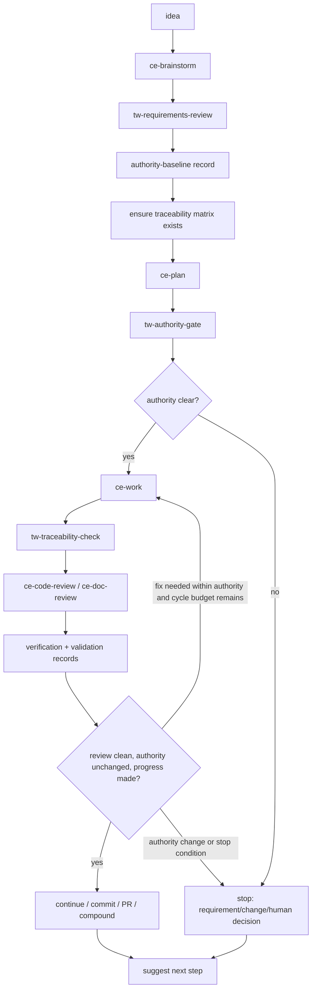

# TraceWeaver-Controlled Autonomy Requirements

## Problem Frame

TraceWeaver currently has separate authority-control skills and selected
CE-compatible workflow skills. The core idea is correct, but users still have
to remember when to call each TraceWeaver step. That creates workflow drift: an
agent can plan, work, review, and iterate quickly while skipping the intent,
authority, traceability, verification, and validation controls that TraceWeaver
exists to preserve.

The project also needs a stronger automation path. Compound Engineering already
has `lfg` as a full autonomous workflow that runs plan, work, review, residual
handling, tests, commit, push, and PR flow. TraceWeaver should add its authority
model to that automation so the loop can continue automatically while the work
stays inside approved authority, but stops when a missing requirement, changed
intent, unapproved assumption, traceability gap, or human decision is required.

The desired behavior is not "make agents autonomous at all costs." The desired
behavior is:

```text
automate while authority is clear
stop when authority must change
```

## Requirements

**Workflow Composition**

- R1. TraceWeaver must group its authority-control steps into the relevant
  CE-compatible workflow skills so users do not need to manually remember the
  correct `tw-*` call after every CE step.
- R2. `ce-brainstorm` in the TraceWeaver plugin must end with
  `tw-requirements-review` and an authority-baseline record handoff when durable
  requirements were created or changed. Alpha must produce this as a
  baseline/update record using existing TraceWeaver authority artifacts; it must
  not name a separate authority-baseline skill unless that skill is separately
  scoped, materialized, and proven.
- R3. `ce-plan` in the TraceWeaver plugin must include `tw-authority-gate`
  before a plan can become implementation authority.
- R4. `ce-work` in the TraceWeaver plugin must require or create an Intent
  Capsule for meaningful work and must update traceability evidence or
  traceability debt after implementation.
- R5. `ce-code-review` and `ce-doc-review` in the TraceWeaver plugin must run
  `tw-traceability-check` and must produce separate verification and validation
  evidence records before engineering-complete, package-ready, release-ready, or
  clean-replacement claims may be made. Alpha must treat verification and
  validation as evidence record types or substeps unless separate skills are
  later scoped, materialized, and proven.
- R6. `ce-compound` in the TraceWeaver plugin must preserve lessons as learning
  records only; learning may create proposed requirements, changes, gaps, or
  exceptions, but must not silently rewrite the authority baseline.
- R7. Every TraceWeaver-controlled CE workflow step must end with suggested next
  steps naming the next CE command, TraceWeaver gate, evidence record, or held
  condition.

**TraceWeaver-Controlled Automation**

- R8. TraceWeaver must provide an autonomous workflow mode that composes
  planning, document review, work, code review, review-fix work, and repeated
  review cycles while authority remains clear.
- R9. The autonomous loop must stop and request human/product input when it
  detects a missing requirement, changed stakeholder intent, unapproved
  assumption, weak authority, validation-question change, contradictory
  requirement, unapproved scope expansion, or unresolved dark behavior.
- R10. The autonomous loop must not continue by inventing requirements,
  exceptions, validation criteria, or release claims. It may propose them, but
  they require approval before becoming authority.
- R11. The autonomous workflow must update or create task capsules, trace
  records, matrix rows, gaps, changes, exceptions, and held-claim records as
  needed during the loop.
- R12. The autonomous workflow must classify each loop result as one of:
  `continue`, `needs_review_fix`, `needs_requirement_change`,
  `needs_human_decision`, `held_claim`, `blocked`, or `complete`.
- R13. The autonomous workflow must preserve CE's useful execution automation
  while adding TraceWeaver controls; it must not fork CE behavior in ways that
  make the selected CE-compatible skills harder to keep current.
- R23. The alpha autonomous invocation surface must be a new `tw-auto` skill that
  wraps the selected CE-compatible `lfg` flow with TraceWeaver authority gates
  and stop conditions. The packaged `lfg` skill must remain behavior-compatible
  with CE until runtime-equivalence evidence approves replacing or modifying it.
- R24. `tw-auto` must not start implementation work until
  `traceability-matrix.md` exists. If the matrix is missing, alpha
  must create a bootstrap matrix from the accepted `requirements.md` baseline
  and `.traceweaver/intent-contract.yml`, record the bootstrap as the first loop
  action, then run a traceability check before continuing.
- R25. The autonomous review-fix loop must be bounded by progress checks. Alpha
  must default to at most two review-fix cycles per run unless a project-local
  Intent Contract override sets a lower or higher reviewed limit. It must stop
  and request human review when the cycle limit is reached, no material diff is
  produced in a cycle, the same blocking finding recurs, the same loop status
  repeats without new evidence, or verification fails twice.

**Intent Contract And Traceability Enforcement**

- R14. The Intent Contract is the loop authority. The autonomous workflow must
  load the current `.traceweaver/intent-contract.yml` and cite the accepted
  baseline before work starts.
- R15. Each behavior-bearing unit changed by automation must trace to
  stakeholder intent, approved requirement or approved exception, verification
  method, validation question, and current baseline version.
- R16. If a code block, function, method, class, skill, script, manifest, or
  document section changes meaningful behavior, the workflow must link it to a
  traceability matrix row or create traceability debt.
- R17. Small helper code may inherit traceability from its owning behavior unit
  only when it does not introduce independent behavior, authority, risk, or
  testable logic.
- R18. Behavior-bearing code changes must link test evidence to the matrix by
  default. Non-test verification such as inspection, analysis, or demonstration
  may replace or defer tests only when the approved requirement's verification
  method explicitly allows it, or when an approved gap/exception records why
  tests are not required yet, with owner, allowed scope, review condition, and
  next step.

**Claims And Safety**

- R19. TraceWeaver-controlled automation starts in advisory mode. It may warn,
  hold claims, and create records, but must not claim enforcing behavior until
  runtime validation approves enforcing mode.
- R20. The first public alpha automation surface must be `tw-auto`. It may call
  or wrap the packaged CE-compatible `lfg` behavior, but it must not modify the
  packaged `lfg` semantics or advertise `lfg` as TraceWeaver-controlled until
  runtime evidence proves that claim. Public docs must describe the invocation
  surface accurately.
- R21. Clean CE replacement remains held until runtime evidence proves the
  TraceWeaver-controlled loop works without the original CE plugin installed.
- R22. The automation must stop before commit/push/PR when review findings show
  unresolved requirement drift, missing authority, unapproved release claims,
  failed tests or verification, blocking review findings, failed traceability
  record or matrix updates, unresolved dark behavior, stale evidence, or failed
  gap/change/exception record writes.
- R26. `tw-auto` must define review severity policy before running automation:
  P0 and P1 findings always block commit/push/PR; P2 findings block when they
  affect authority, requirements, tests, traceability, validation, release
  claims, security, data integrity, or runtime safety; P3 findings may be
  recorded as non-blocking debt only when authority is clear, verification
  passed, and the traceability matrix or trace record names the debt owner and
  next step.

## Success Criteria

- A user can start from an idea and follow a TraceWeaver-controlled CE loop
  without manually remembering which `tw-*` skill belongs after each CE step.
- The automated loop can run plan, review, work, code review, review-fix work,
  and another review pass without user intervention when all work stays within
  approved authority.
- The first alpha automation entrypoint is `tw-auto`; packaged `lfg` remains
  CE-compatible and is not claimed as TraceWeaver-controlled until runtime proof
  approves that claim.
- If `traceability-matrix.md` is missing, `tw-auto` creates a
  bootstrap matrix from the accepted baseline before implementation starts.
- The same loop stops cleanly when a requirement must change, stakeholder intent
  is missing, or a human authority decision is required.
- The loop stops cleanly when it stops making progress, repeats blocking
  findings, fails verification twice, or reaches the default two-cycle
  review-fix limit or a reviewed Intent Contract override.
- Every meaningful behavior-bearing unit changed by the loop has a traceability
  matrix row, linked test evidence by default, or an approved non-test
  verification method/gap/exception.
- Every completed automated cycle ends with suggested next steps.
- Public docs do not overclaim enforcement, runtime equivalence, clean CE
  replacement, or release readiness.

## Scope Boundaries

- Do not make enforcing mode the default in the first implementation.
- Do not claim full autonomous product authority. Automation can execute and
  review inside approved bounds; it cannot approve new requirements by itself.
- Do not require every literal line or tiny helper to have a separate matrix
  row. Trace behavior-bearing units and make inheritance explicit.
- Do not expand the full Core 11 runtime suite as part of this requirement.
- Do not claim clean CE replacement until U9 or equivalent runtime proof passes.
- Do not add slash-command claims unless prompt/command surfaces are installed
  and proven.

## Key Decisions

- Controlled autonomy should be built around the existing CE loop instead of
  replacing it with a new process. TraceWeaver adds authority, traceability,
  verification, validation, and stop conditions.
- Alpha will introduce `tw-auto` as the TraceWeaver-controlled autonomous
  workflow. Packaged `lfg` remains a CE-compatible surface until runtime
  evidence proves TraceWeaver-controlled replacement semantics.
- The first automation mode should be advisory. It can continue automatically
  while authority is clear and stop when authority changes are required.
- Matrix availability is a hard alpha precondition. `tw-auto` may satisfy it by
  creating a bootstrap matrix from accepted authority before the first
  implementation cycle, but it may not skip matrix creation or replace it with
  informal traceability debt.
- Autonomous iteration needs a loop-safety boundary. Alpha defaults to two
  review-fix cycles per run, and repeated cycles are allowed only while each
  cycle produces material progress and does not repeat the same blocking
  failure.
- Review severity policy is part of the product contract: P0/P1 block, P2
  blocks when authority or safety relevant, and P3 can be non-blocking debt only
  with trace ownership and next step.
- The TraceWeaver-aware automation should treat requirement changes as a hard
  boundary. Agents may propose requirement changes, but a human or approved
  baseline process must accept them before implementation continues.
- Authority-baseline, verification, and validation are alpha record outputs of
  existing TraceWeaver gates, not implied skill names. Separate `tw-*` skills
  may be added later only through an accepted scope decision and runtime proof.
- Suggested next steps are now a product requirement, not just a formatting
  preference. They reduce workflow drift and must be present at each handoff.

## Dependencies / Assumptions

- The accepted master baseline remains `requirements.md` at
  `REQ-BASELINE-2026-04-30-001` until this new requirement set is reviewed and
  promoted.
- `.traceweaver/intent-contract.yml` is the current project authority contract.
- `traceability-matrix.md` now exists at the repository root as the current
  accepted traceability matrix. Future consuming projects may still be missing
  the file; `tw-auto` must either find it or create a bootstrap matrix before
  the first implementation cycle.
- Current `lfg` exists as a CE-compatible packaged skill, but its runtime
  TraceWeaver behavior is not yet proven.

## Workflow Map



## Outstanding Questions

### Resolve Before Planning

- None.

### Deferred to Planning

- [Affects R11, R16][Technical] What is the first practical matrix-update
  mechanism: direct Markdown updates, trace-record files that later roll up
  into the matrix, or both?
- [Affects R8-R12][Technical] What exact loop state file or transcript should
  record each autonomous cycle so review can audit why the model continued or
  stopped?
- [Affects R22][Technical] How should non-blocking review findings be recorded
  before commit/push/PR when authority is clear and verification passed?

## Next Steps

-> `/ce-doc-review docs/brainstorms/2026-05-01-traceweaver-controlled-autonomy-requirements.md`
-> If clean, `/ce:plan docs/brainstorms/2026-05-01-traceweaver-controlled-autonomy-requirements.md`
