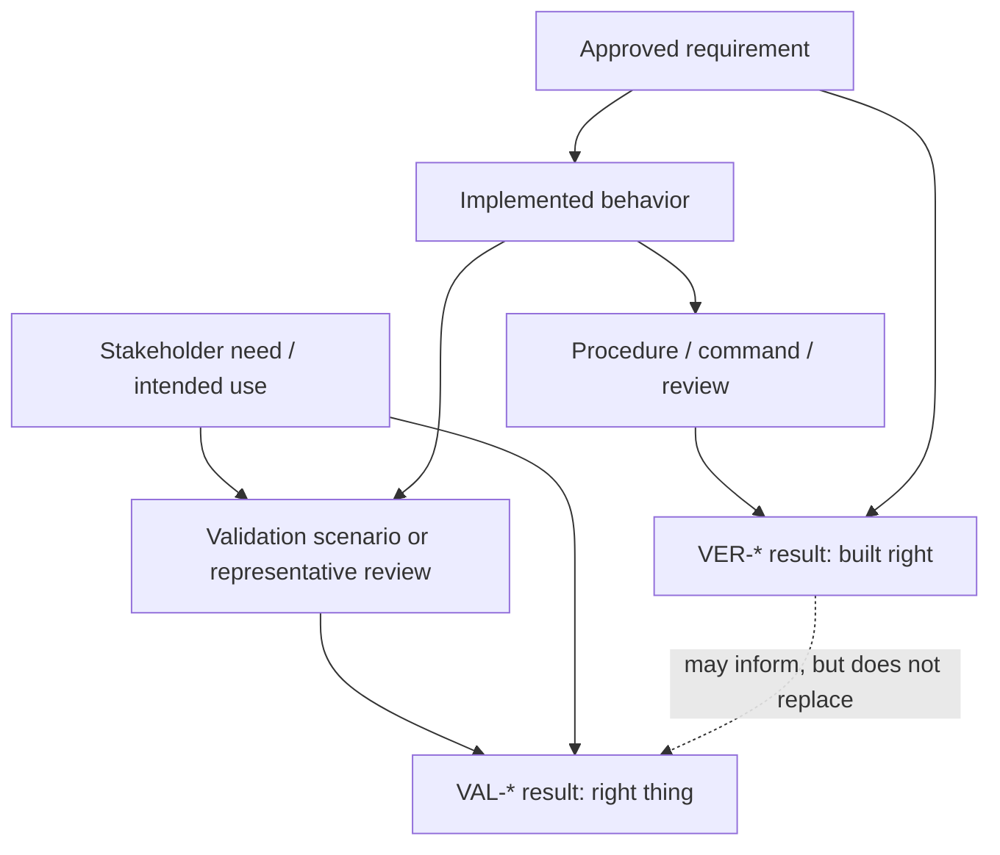

# Requirements And V&V Guide

Status: Distilled TraceWeaver Core guidance

This guide gives agents runtime rules for needs, requirements, verification,
validation, ATPs, and result records. It is original TraceWeaver guidance and
does not reproduce protected source definitions, checklists, examples, tables,
or diagrams.

## Need, Requirement, Decision

Keep these records separate:

| Record | TraceWeaver Role | Authority? |
|---|---|---|
| `NEED-*` | Why a stakeholder or user needs a result | Not by itself |
| `UREQ-*` | User-facing requirement derived from need and approved context | Yes, once approved |
| `SREQ-*` | System, interface, quality, constraint, or behavior requirement | Yes, once approved |
| `ADR-*` / `DD-*` | Design decision explaining how requirements are satisfied | Yes, once approved |
| `TASK-*` | Work package that implements approved authority | Only if it closes directly to approved authority |

A need can explain why work matters. It does not by itself authorize
implementation. A requirement can authorize implementation only after approval.

## Candidate Need Format

Use this shape during brainstorming or early specification:

```markdown
### NEED-[SCOPE]-001: [short name]

- Stakeholder / source:
- Problem or opportunity:
- Intended user or operator:
- Intended context:
- Success signal:
- Failure signal:
- Assumptions:
- Constraints:
- Risks:
- Status: Candidate
```

Candidate needs should become approved requirements before implementation starts.
If the team intentionally proceeds without a full requirement, record an approved
gap with scope, owner, and review condition.

## Requirement Row Guidance

A useful TraceWeaver requirement should answer:

- What must be true?
- Who or what needs it?
- Which need or parent requirement does it come from?
- What makes it testable or reviewable?
- Which design decision or allocation owns it?
- How will it be verified?
- How will the stakeholder need be validated?
- Who owns it?
- What is its approval state?

Use this compact shape:

```markdown
| ID | Type | Requirement | Source | Rationale | Verification Method | Validation Path | Owner | Status |
|---|---|---|---|---|---|---|---|---|
| SREQ-AUTH-001 | System |  | NEED-AUTH-001 |  | Test / Analysis / Inspection / Review | VAL-AUTH-001 |  | Draft |
```

Do not mark a requirement `Approved` unless approval evidence exists.

## Inferred And Derived Requirements

Agents may discover inferred or derived requirements while reading code,
reviewing behavior, or planning implementation.

Rules:

- Mark inferred requirements `Draft`.
- Record source context and why the inference was made.
- Ask for human approval before using the inferred requirement as authority.
- Link derived requirements to the parent need, requirement, design decision, or
  interface that produced them.
- If approval is denied or deferred, convert the item to traceability debt,
  approved gap, or rejected decision with rationale.

## Verification

Verification asks whether the implementation satisfies the requirement.

A verification record needs enough context for another reviewer or agent to
understand what was checked:

| Field | Required Purpose |
|---|---|
| `VER ID` | Stable evidence ID |
| `Requirement IDs` | Requirements verified |
| `Method` | Test, analysis, inspection, review, build, static analysis, or demonstration |
| `Procedure / Command` | ATP/procedure entry, command, manual review, or analysis note |
| `Tested Ref` | Commit, build, artifact hash, environment, document version, or config |
| `Date / Session` | When evidence was produced |
| `Outcome` | Pass, Fail, Partial, Blocked, Deferred |
| `Evidence Path` | Result artifact path or report |
| `Deviation / Notes` | Limits, assumptions, failures, or follow-up |

A command without outcome, context, or tested reference is an activity note, not
verification evidence.

## Validation

Validation asks whether the result satisfies the stakeholder need, intended use,
or operational context.

Validation may come from:

- human acceptance review
- demo or UAT
- representative scenario
- operational evidence
- telemetry or rollout signal
- customer/support/maintainer acceptance
- approved later validation plan

A validation record should capture:

| Field | Required Purpose |
|---|---|
| `VAL ID` | Stable validation ID |
| `Need IDs` | Stakeholder needs validated |
| `Scenario / Intended Use` | Context the solution must satisfy |
| `Stakeholder / Representative` | User, owner, reviewer, telemetry source, or approved proxy |
| `Acceptance Signal` | Human rating, signed review, observed outcome, telemetry target, or rollout signal |
| `Evidence Path` | Result record, review note, measurement, or validation report |
| `Status` | Planned, Pass, Fail, Partial, Deferred |
| `Owner` | Responsible human or role |
| `Deferred Trigger` | Event or condition if validation happens later |

Tests can support validation, but only when they exercise the stakeholder or
intended-use question. Do not overclaim ordinary unit or integration tests as
validation.

## ATP And Result Records

ATP means acceptance test plan or acceptance test procedure.

Use ATP entries when the work needs a named procedure or scenario:

```markdown
| ID | Requirement | Procedure / Scenario | Setup / Context | Expected Result | Owner | Status |
|---|---|---|---|---|---|---|
| ATP-001 | SREQ-001 |  |  |  |  | Draft |
```

Use result records to prove what happened:

```markdown
| ID | Requirement / Need | ATP / Method | Tested Ref / Context | Evidence Artifact | Result | Date / Session |
|---|---|---|---|---|---|---|
| RESULT-001 | SREQ-001 | ATP-001 |  |  | Pending |  |
```

## Evidence Split



## Failed, Partial, Or Deferred Evidence

Failed or partial V&V is useful engineering evidence. Do not hide it.

When verification or validation fails:

- record the actual outcome
- link the affected requirement or need
- identify whether the issue is implementation, requirement quality, design,
  test setup, environment, or stakeholder mismatch
- create a change-control item, gap, or debt item
- do not mark the requirement `Verified` or the need `Validated`

When validation must happen later:

- record the owner
- record the trigger for later validation
- record the expected evidence
- record approval for the deferred path
- link any `TD-*` or `GAP-*` item

## Runtime Checklist

Before build:

- [ ] Need/source is known.
- [ ] Requirement or approved authority exists.
- [ ] Inferred requirements are `Draft`.
- [ ] Verification method is identified.
- [ ] Validation path is identified or explicitly deferred.

Before review:

- [ ] Implementation links point to requirement or design IDs.
- [ ] Verification evidence has outcome, context, and tested ref.
- [ ] Validation is separate from verification.
- [ ] Missing evidence is recorded as gap or debt.

Before ship:

- [ ] Stakeholder-facing behavior has validation evidence or an approved
      validation path.
- [ ] Failed or partial results have a visible disposition.
- [ ] No tests are overclaimed as validation.

## Source Basis

This guide is original TraceWeaver guidance. It is informed by source-aware
distillation from needs/requirements and V&V guidance, but it does not copy
source definitions, examples, tables, or procedure templates.
