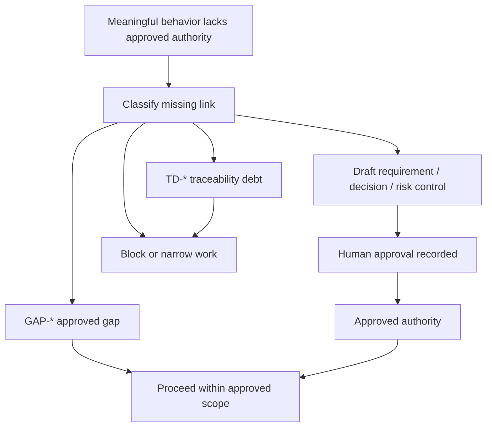
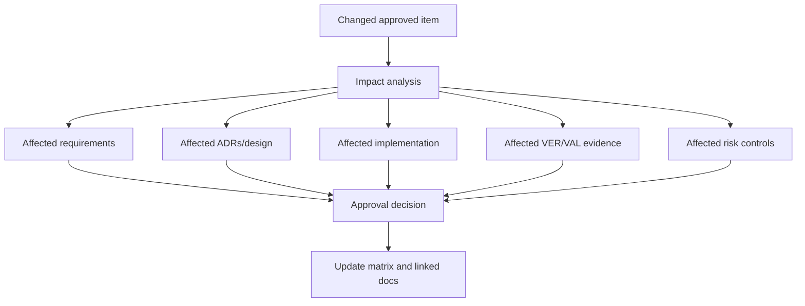

# Risk, Gap, And Change Control Guide

Status: Distilled TraceWeaver Core guidance

This guide gives agents runtime rules for risk controls, approved gaps,
traceability debt, dark-code candidates, and change control. It is original
TraceWeaver guidance and does not reproduce protected source tables, diagrams,
or checklists.

## Risk Controls

A risk label is not authority. A risk control can become authority only when it
is approved, owned, linked, and evidenced.

Use this row shape:

```markdown
| Risk ID | Risk Statement | Owner | Control / Mitigation | Authority Link | Evidence Path | Approval Status | Residual / Accepted Risk | Notes |
|---|---|---|---|---|---|---|---|---|
| RISK-001 |  |  |  | SREQ-001 / GAP-001 | VER-001 / VAL-001 | Draft / Approved / Retired |  |  |
```

Required fields:

- risk statement
- owner
- control or mitigation
- linked requirement, design decision, or approved gap
- evidence path
- approval status
- residual or accepted-risk note when risk remains

If any required field is missing, the `RISK-*` row is not valid authority.

## Approved Gaps

An approved gap is a bounded exception that lets work proceed despite known
missing traceability. It must be explicit and temporary.

Use this row shape:

```markdown
| Gap ID | Description | Affected IDs | Owner | Allowed Use / Scope | Approval ID | Approved By | Approval Date / Session | Review / Expiry Condition | Status |
|---|---|---|---|---|---|---|---|---|---|
| GAP-001 |  | SREQ-001 / TRACE-001 |  |  | APP-001 |  |  |  | Draft / Approved / Expired / Closed |
```

An approved gap is valid authority only inside its recorded scope and review
condition. If scope, approval, owner, or expiry is missing, the gap is not valid
authority.

## Traceability Debt

Traceability debt is visible work, not authority.

Use debt for missing, stale, contradictory, or unapproved trace links that need
follow-up but do not authorize implementation.

```markdown
| Debt ID | Description | Affected IDs | Risk | Owner | Action | Status |
|---|---|---|---|---|---|---|
| TD-001 |  | SREQ-001 |  |  |  | Open / Deferred / Closed |
```

Debt can be closed by:

- adding missing evidence
- correcting stale links
- retiring the behavior
- converting to an approved gap
- converting to an approved requirement, design decision, or risk control

Open debt must not be cited as authority.

## Gap, Debt, And Authority Flow



## Dark-Code Candidates

Dark code is meaningful behavior whose reason, authority, evidence, owner, or
safe-change story is unclear.

Flag candidates when you cannot answer:

- Why does this exist?
- Which need, requirement, design decision, risk control, or approved gap
  authorizes it?
- Where is it implemented?
- How is it verified?
- How is it validated?
- Who owns it?
- What breaks if it changes or is removed?

Classify each candidate:

| Action | Meaning |
|---|---|
| Keep and document | Behavior is needed; add traceability |
| Test and verify | Authority is plausible but evidence is missing |
| Validate | Technical behavior exists but stakeholder fit is unproven |
| Deprecate | Behavior may be replaced but needs a safe path |
| Remove | Behavior is unauthorized and safe to delete |
| Escalate | Human decision is required |

Dark code does not automatically mean delete it. It means traceability has been
lost or was never created.

## Change Control

Run change control when an approved item changes or when new evidence challenges
the current trace.

Triggers:

- requirement change
- design decision or ADR change
- interface or data-flow change
- externally observable behavior change
- risk control change
- validation path change
- implementation starts depending on an untraced brownfield behavior
- review finding introduces new scope

Change-control records should capture:

| Field | Purpose |
|---|---|
| Change ID | Stable ID for the change decision |
| Source | Review finding, human request, test failure, validation failure, incident, or planning discovery |
| Affected IDs | Needs, requirements, ADRs, risks, gaps, implementation, evidence |
| Impact | What must be changed or rechecked |
| Decision | Approve, reject, defer, split, retire, or request more information |
| Approver | Human or governance source |
| Date / Session | When the decision was made |
| Follow-up | Required work, debt, validation, or retirement path |

## Change Impact Path



## Review Findings

Review findings are provenance until converted.

Convert each finding into one of:

- approved requirement change
- approved design decision
- first-class approved risk control
- approved traceability gap
- traceability debt
- rejected finding with rationale

Do not implement new meaningful behavior from a review finding alone.

## Brownfield Dependencies

For existing code with weak traceability:

- do not invent historical requirements
- record known uncertainty as debt
- apply strict no-orphan enforcement to new or changed behavior
- create an approved gap only when limited work must proceed before full
  traceability is restored
- require impact analysis when new work depends on untraced behavior

## Runtime Checklist

Before implementation:

- [ ] No meaningful behavior relies on a bare `RISK-*`.
- [ ] No meaningful behavior relies on open `TD-*`.
- [ ] Any `GAP-*` authority has owner, approval, scope, and expiry.

Before review:

- [ ] Dark-code candidates are classified.
- [ ] Review findings are not treated as authority.
- [ ] Change-control triggers were checked.

Before ship:

- [ ] Approved gaps are still within scope and not expired.
- [ ] Debt has owner and follow-up action.
- [ ] Changed authority has impact analysis.
- [ ] Retired behavior has rationale and downstream effects checked.

## Source Basis

This guide is original TraceWeaver guidance. It is informed by source-aware
distillation around systems-engineering risk management, technical reviews,
baselines, configuration control, and requirements change control. It does not
copy source checklists, tables, diagrams, or standard wording.
