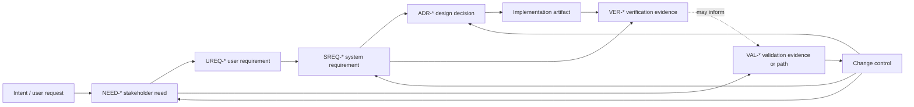
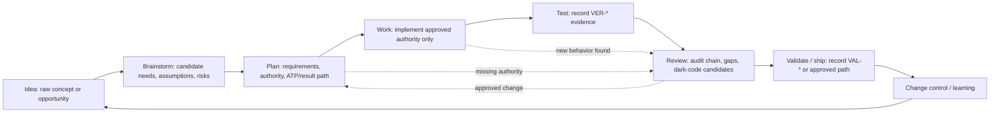

# Systems Engineering Traceability Operating Model

Status: Distilled TraceWeaver Core guidance

This is original TraceWeaver guidance for agentic software development. It is
informed by systems-engineering sources, but it does not reproduce protected
standards, handbooks, tables, or diagrams and does not claim standards
compliance.

TraceWeaver's purpose is simple: meaningful behavior must trace to approved
authority, evidence, ownership, and a safe-change story.

## Lifecycle Chain

Preserve traceability through this chain:

```text
idea or intent
  -> stakeholder need
  -> user requirement
  -> system requirement
  -> design decision
  -> implementation
  -> verification
  -> validation
  -> change control
```

For projects that use separate documents, preserve this document chain when the
artifacts exist:

```text
requirements document
  -> plan document
  -> traceability matrix
  -> acceptance test plan or procedure
  -> result record
```

ATP means acceptance test plan or acceptance test procedure. Result records may
be acceptance test results, verification output, validation notes, or acceptance
test report artifacts.

## Core Agent Rules

1. Ideation and brainstorming create candidate needs, assumptions, risks,
   success signals, failure signals, and open decisions. They do not create
   implementation authority.

2. Planning converts approved or candidate needs into requirements, design
   decisions, ATP/result expectations, verification paths, and validation paths.

3. Work agents may only implement meaningful behavior when it traces to approved
   authority.

4. Review findings are provenance, not authority. They become authority only
   when converted into an approved requirement change, approved design decision,
   first-class approved risk control, or approved gap.

5. Requirements may evolve, but they must evolve through explicit change
   control.

6. A task ID alone is not authority. A task only carries authority when it
   closes directly to approved upstream authority.

7. A bare `RISK-*` ID is not authority. A risk control only authorizes
   implementation when it is approved, owned, evidenced, and linked to a
   requirement or approved gap.

8. Verification asks whether the team built the thing right.

9. Validation asks whether the team built the right thing.

10. Missing traceability must be exposed, not invented.

## Idea Capture Rule

Ideas are first-class lifecycle inputs. They are not authority.

Any agent or skill that creates, refines, selects, ranks, reviews, or summarizes
ideas for a product, feature, workflow, code change, process change, or agent
behavior must preserve the idea in systems-engineering form:

- candidate `NEED-*` or problem/opportunity statement
- stakeholder or user group
- intended context
- success signal
- failure signal
- key assumptions
- risk candidates
- open decisions or approval questions
- explicit status: `Candidate` or `Draft`

An idea becomes implementation authority only when a later lifecycle step
converts it into approved authority: approved requirement, approved design
decision, first-class approved risk control, approved traceability gap, or a
task that closes directly to one of those authorities.

Do not let an idea-refinement artifact, brainstorm note, roadmap thought, or
review suggestion silently skip into implementation. If an idea would change
meaningful behavior, route it through planning and traceability before work
begins.

## Valid Authority

Meaningful implementation behavior must link to at least one valid approved
authority:

- approved requirement
- approved ADR or design decision
- first-class approved risk control
- approved traceability gap
- task that closes directly to one of the approved authorities above

The following are not authority by themselves:

- brainstorm idea
- idea-refinement note
- assumption
- roadmap note
- stakeholder need
- review finding
- task ID
- inferred link
- draft requirement
- unapproved design note
- bare `RISK-*` reference
- traceability debt item
- test existence without a requirement or design link

If the authority is inferred, mark it `Draft` and ask for human approval before
treating it as implementation authority.

## Authority State

Authority is a state transition, not the presence of an ID.

```text
Candidate / Draft / Provenance
  -> reviewed by human or project governance
  -> Approved
  -> used as implementation authority
```

Agents may propose requirements, design decisions, risk controls, and gaps. They
must not silently promote them to approved authority.

## Mode Selection

Use the lightest mode that preserves the chain.

| Mode | Use When | Minimum Traceability |
|---|---|---|
| Lite | Small, low-risk work with clear intent and existing authority | One matrix row with authority, implementation, verification, validation path, owner, and status |
| Standard | New or changed meaningful behavior, interfaces, data flows, workflows, or agent behavior | Full traceability artifact with requirements, design, implementation, V&V, gaps, and decisions |
| Audit | High-risk, release-critical, compliance-sensitive, owner-unclear, or brownfield work | Full artifact plus dark-code candidates, impact analysis, gap/debt classification, and human decisions |

Lite mode may reduce detail. It must not skip the matrix artifact once the skill
is used.

## Agent Lifecycle Responsibilities

| Agent Phase | Responsibility | Output |
|---|---|---|
| Ideate / Brainstorm | Capture candidate needs, assumptions, risks, success and failure signals, unresolved questions, and not-doing boundaries | Candidate `NEED-*`, assumptions, `RISK-*` candidates, required decisions, `Candidate` / `Draft` status |
| Plan | Convert approved or candidate context into requirements, authority links, tasks, ATP/result expectations, and validation paths | `UREQ-*`, `SREQ-*`, `ADR-*`, `TASK-*`, `ATP-*`, matrix rows |
| Work | Implement only behavior backed by valid approved authority | Implementation links and immediate gap updates |
| Test | Produce verification evidence that points to requirement IDs | `VER-*` rows and result records |
| Review | Audit the chain in both directions and classify missing traceability | findings, `GAP-*`, `TD-*`, dark-code candidates |
| Validate / Ship | Record validation evidence or an approved validation path | `VAL-*` rows, owner, status, deferred trigger |
| Change Control | Convert findings and changes into approved authority, rejected decisions, or visible debt | approval records, retired items, impact analysis |

## Traceability Matrix

The Markdown traceability matrix is the audit/control surface for the workflow.
It records links, status, owners, evidence references, gaps, and human
decisions.

Source artifacts remain authoritative for their detailed content:

- requirements live in specifications or requirements documents
- design rationale lives in ADRs or design notes
- procedures live in ATPs or test plans
- measured outcomes live in result records

The matrix connects those artifacts. It should not rewrite or replace them.

Mermaid diagrams are derived views. If a diagram and the matrix disagree, update
the diagram from the matrix.

## Original TraceWeaver Diagrams

These diagrams are TraceWeaver-specific views. They are not copies or redraws of
source diagrams.

### Authority Chain



### Agent Checkpoints



## Brownfield Work

For existing projects that did not start with traceability, do not invent
historical trace links after the fact.

Record known gaps as traceability debt. Apply strict no-orphan enforcement to
new or changed meaningful behavior from the chosen baseline forward. Existing
untraced behavior becomes trace-relevant when new work depends on it, modifies
it, uses it as authority, or needs it for validation.

## Change Control

When requirements, design decisions, risks, validation paths, or meaningful
behavior change, update the traceability record in the same work cycle.

If a review finding introduces new scope, convert it into one of:

- requirement change
- design decision
- first-class approved risk control
- approved traceability gap
- rejected finding with rationale

Do not silently promote a review comment, assumption, or inferred link into
authority.

## Supporting Guides

Use these companion distilled guides when more detail is needed:

- `traceability-matrix-template.md`
- `requirements-and-vv-guide.md`
- `risk-gap-and-change-control-guide.md`

## Source Basis

This operating model is original TraceWeaver guidance. It is informed by
systems-engineering concepts from official or public source pages, including:

| Source | Public Link | Use |
|---|---|---|
| ISO/IEC/IEEE 15288:2023 | https://www.iso.org/standard/81702.html | Lifecycle-process alignment only; no local extraction claim from protected wrapper |
| INCOSE Systems Engineering Handbook | https://www.incose.org/resources-publications/technical-publications/se-handbook/ | Lifecycle, tailoring, risk, technical review, and systems-engineering practice context |
| INCOSE Requirements Working Group | https://www.incose.org/group/requirements-working-group/ | Public context for needs, requirements, verification, validation, and data-centric requirements work |
| IEEE 15288.1 / 15288.2 standards page | https://standards.ieee.org/ieee/15288.2/5705/ | Application and review/audit concepts used only as generic evidence and tailoring guidance |

TraceWeaver does not reproduce those materials and does not claim compliance
with them.
