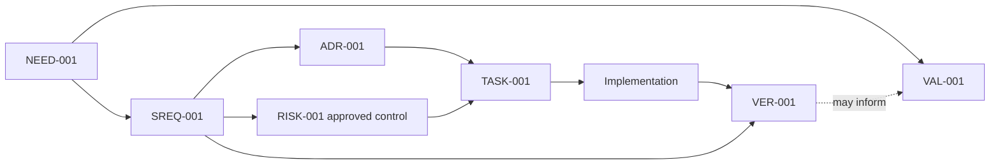

# Traceability Matrix Template

Status: Distilled TraceWeaver Core guidance

Use this template when TraceWeaver needs a durable traceability artifact.

Recommended path:

```text
docs/traceability/[scope].md
```

The Markdown matrix is the audit record for trace links, status, evidence
references, gaps, and human decisions. Source artifacts remain authoritative for
their detailed content. Mermaid diagrams are visual views only.

## File Skeleton

````markdown
# Traceability: [Scope]

## System Context

System:
Subsystem:
Scope:
Owner:
Mode: Lite / Standard / Audit
Status: Draft
Last updated:

Success signal:
Failure signal:
Baseline or starting ref:

## Stakeholder Needs

| ID | Need | Stakeholder / Source | Success Signal | Status |
|---|---|---|---|---|
| NEED-001 |  |  |  | Draft |

## Requirements

| ID | Type | Requirement | Source Need / Parent | Rationale | Verification Method | Validation Path | Owner | Status |
|---|---|---|---|---|---|---|---|---|
| SREQ-001 | User / System / Interface / Quality / Constraint |  | NEED-001 |  | Test / Analysis / Inspection / Review | VAL-001 / Deferred |  | Draft |

## Design Decisions

| ID | Decision / ADR | Linked Requirements | Rationale | Interfaces / Dependencies | Status |
|---|---|---|---|---|---|
| ADR-001 | `docs/decisions/adr-001.md` | SREQ-001 |  |  | Draft |

## Risk Controls

Risk controls may authorize meaningful behavior only when they are first-class
approved trace links.

| Risk ID | Risk Statement | Owner | Control / Mitigation | Authority Link | Evidence Path | Approval Status | Residual / Accepted Risk | Notes |
|---|---|---|---|---|---|---|---|---|
| RISK-001 |  |  |  | SREQ-001 / GAP-001 | VER-001 / VAL-001 | Draft / Approved / Retired |  |  |

A bare `RISK-*` ID does not satisfy the no-orphan gate.

## Traceability Matrix

| Trace ID | Owner | Need | Requirement | Authority | Design / ADR | Risk Control | Plan / Task | Implementation | Verification | Validation | Status | Gap / Debt |
|---|---|---|---|---|---|---|---|---|---|---|---|---|
| TRACE-001 |  | NEED-001 | SREQ-001 | Approved requirement | ADR-001 | RISK-001 | TASK-001 | `src/module/file.ts` | VER-001 | VAL-001 | Draft | GAP-001 / TD-001 |

## Document Chain Links

| Requirement | Requirements Doc | Plan / Task Doc | ATP Entry | Result Record | Status |
|---|---|---|---|---|---|
| SREQ-001 | `docs/specs/example.md` | `docs/plans/example-plan.md#task-1` | ATP-001 | RESULT-001 | Draft |

## ATP Entries

ATP means acceptance test plan or acceptance test procedure.

| ID | Requirement | Procedure / Scenario | Setup / Context | Expected Result | Owner | Status |
|---|---|---|---|---|---|---|
| ATP-001 | SREQ-001 |  |  |  |  | Draft |

## Result Records

Result records may be acceptance test results, verification output, validation
notes, or acceptance test report artifacts.

| ID | Requirement / Need | ATP / Method | Tested Ref / Context | Evidence Artifact | Result | Date / Session |
|---|---|---|---|---|---|---|
| RESULT-001 | SREQ-001 | ATP-001 |  |  | Pending |  |

## Verification Evidence

| ID | Requirement | Method | Procedure / Command | Tested Ref | Result | Evidence Path | Date / Session | Notes |
|---|---|---|---|---|---|---|---|---|
| VER-001 | SREQ-001 | Unit / integration / E2E / build / static analysis / inspection / analysis |  |  | Pending / Pass / Fail / Partial / Blocked |  |  |  |

## Validation Evidence

| ID | Source Need | Scenario / Intended Use | Stakeholder / Representative | Acceptance Signal | Evidence Path | Result | Owner | Deferred Trigger / Notes |
|---|---|---|---|---|---|---|---|---|
| VAL-001 | NEED-001 |  |  |  |  | Planned / Accepted / Rejected / Partial / Deferred |  |  |

## Traceability Diagram



If the diagram and matrix disagree, update the diagram from the matrix. The
matrix wins.

## Traceability Debt

Use this table for missing, stale, contradictory, or unapproved trace links.
Open traceability debt is not authority.

| Debt ID | Description | Affected IDs | Risk | Owner | Action | Status |
|---|---|---|---|---|---|---|
| TD-001 |  | SREQ-001 |  |  |  | Open / Deferred / Closed |

## Approved Traceability Gaps

Approved gaps may authorize behavior only when explicitly recorded here.

| Gap ID | Description | Affected IDs | Owner | Allowed Use / Scope | Approval ID | Approved By | Approval Date / Session | Review / Expiry Condition | Status |
|---|---|---|---|---|---|---|---|---|---|
| GAP-001 |  | SREQ-001 / TRACE-001 |  |  | APP-001 |  |  |  | Draft / Approved / Expired / Closed |

A `GAP-*` ID is not valid authority unless it has approval proof: approval ID,
approver, date/session, allowed use or scope, and review/expiry condition.

Open traceability debt is not authority. It becomes authority only when
explicitly approved as a gap in this section.

## Dark-Code Candidates

| Candidate | Location | Why Flagged | Suggested Action | Owner | Status |
|---|---|---|---|---|---|
|  | `src/module/file.ts` | No linked requirement / no test / unclear validation / unclear owner | Keep and document / test and verify / validate / deprecate / remove / escalate |  | Open |

## Human Decisions Required

| ID | Question | Options | Recommendation | Status |
|---|---|---|---|---|
| DEC-001 |  |  |  | Open |

## Change Impact Analysis

Change:

Affected needs:
Affected requirements:
Affected design decisions:
Affected implementation:
Affected verification:
Affected validation:
Affected risk controls:
Affected gaps or debt:
Human decision required:
````

## Status Values

Use these status values consistently:

| Status | Meaning | Required Evidence |
|---|---|---|
| `Draft` | Proposed or inferred; not yet approved | Source artifact or agent note plus required human decision |
| `Approved` | Accepted requirement, decision, risk control, or gap | Human approval record with approver, date/session, source artifact, and affected IDs |
| `Implemented` | Implementation artifacts linked | Files, modules, interfaces, tasks, or config linked to requirement or design IDs |
| `Verified` | Technical requirement has evidence | Test, ATP, build, static analysis, analysis, or inspection result linked to the requirement |
| `Validated` | Stakeholder need satisfied in context | Demo, UAT, scenario, operational evidence, telemetry, or accepted validation result |
| `Open` | Item is unresolved and still needs action or decision | Owner, next action, and affected IDs |
| `Gap` | Missing, stale, contradictory, or unapproved trace link | Gap description, risk, owner, and next action |
| `Deferred` | Valid trace item intentionally postponed | Owner, reason, expected follow-up, and accepted risk |
| `Closed` | Debt or gap has been resolved or converted | Resolution note and linked replacement, approval, or retirement evidence |
| `Expired` | Approval or accepted gap is no longer valid | Expiry condition, owner, and required re-approval or closure action |
| `Retired` | Requirement, behavior, or artifact no longer active | Deprecation or removal rationale and impact analysis |

## Lightweight Mode

For a small change, use a minimal matrix row instead of the full matrix:

```markdown
| Trace ID | Owner | Need / Requirement | Authority | Implementation | Verification | Validation or Path | Status | Gap / Debt |
|---|---|---|---|---|---|---|---|---|
| TRACE-001 |  | SREQ-001 | Approved requirement / ADR / risk control / gap |  |  |  | Draft |  |
```

An optional note may explain the row, but it does not replace the matrix
artifact.

Do not use Lite mode to hide unclear or risky behavior. If the reason,
verification, validation, or owner is unclear, switch to Standard or Audit mode.

## Source Basis

This template is original TraceWeaver guidance. It uses public-safe field
families derived from the TraceWeaver operating model and source-aware
distillation. It does not reproduce protected source tables or diagrams.
