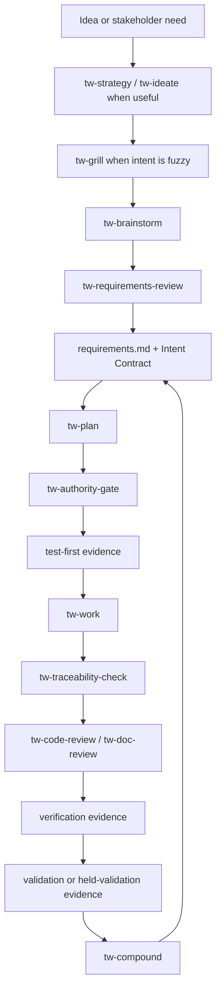

# How To Use TraceWeaver

<!-- TRACEWEAVER: file-role=deep-usage-guide; req=REQ-TW-015; trace=TRACE-TW-004; ver=VAL-TW-006 -->
<!-- TRACEWEAVER: file-role=deep-usage-guide; req=REQ-TW-016; trace=TRACE-TW-010; ver=VAL-TW-006 -->
<!-- TRACEWEAVER: file-role=deep-usage-guide; req=REQ-TW-020; trace=TRACE-TW-006; ver=VAL-TW-008 -->
<!-- TRACEWEAVER: file-role=deep-usage-guide; req=REQ-TW-021; trace=TRACE-TW-005; ver=VAL-TW-009 -->
<!-- TRACEWEAVER: file-role=deep-usage-guide; req=REQ-TW-023; trace=TRACE-TW-046; ver=VAL-TW-011 -->
<!-- TRACEWEAVER: file-role=deep-usage-guide; req=REQ-TW-041; trace=TRACE-TW-010; ver=VAL-TW-011 -->
<!-- TRACEWEAVER: file-role=deep-usage-guide; req=REQ-TW-043; trace=TRACE-TW-010; ver=VAL-TW-011 -->
<!-- TRACEWEAVER: file-role=deep-usage-guide; req=REQ-TW-065; trace=TRACE-TW-048; ver=VAL-TW-011 -->
<!-- TRACEWEAVER: file-role=deep-usage-guide; req=REQ-TW-068; trace=TRACE-TW-054; ver=VAL-TW-016 -->

TraceWeaver is an alpha advisory workflow for coding agents. It keeps agent
work tied to intent, approved requirements or exceptions, verification
evidence, validation questions, and held claims.

Use this guide when the root README is too short and you need the practical
details.

## Install

### Setup Video

<a href="https://youtu.be/7ZK5m8_VvZA?si=z-IZw-l5ChIbrA6C">
  
</a>

Watch the setup guide for the install, bootstrap, and first-cycle flow.

TraceWeaver Core releases from `main`. Each release bumps the plugin version
and publishes a `traceweaver-core--v<version>` git tag with a matching GitHub
Release. The marketplace tracks the current release. Use the
`traceweaver-core--v0.2.6` tag when you need a reproducible alpha snapshot.

### Codex

Add or refresh the marketplace:

```sh
codex plugin marketplace add Oxiom-Systems/traceweaver
codex plugin marketplace upgrade traceweaver
```

Install `traceweaver-core` from the Codex plugin UI.

Pinned local install:

```sh
git clone --branch traceweaver-core--v0.2.6 --depth 1 git@github.com:Oxiom-Systems/traceweaver.git
cd traceweaver
bun run src/index.ts install ./plugins/traceweaver-core --to codex --include-skills
```

Verify an isolated Codex install shape:

```sh
TRACEWEAVER_HOST_RUNTIME_EXEC=0 scripts/traceweaver-smoke-codex-discovery
TRACEWEAVER_HOST_RUNTIME_EXEC=0 scripts/traceweaver-smoke-codex-separate-home-runtime
```

### Claude Code

Add or refresh the repository marketplace, install or update the plugin, then
reload active plugins:

```sh
claude plugin marketplace add Oxiom-Systems/traceweaver
claude plugin install traceweaver-core@traceweaver
claude plugin marketplace update traceweaver
claude plugin update traceweaver-core@traceweaver
```

```text
/reload-plugins
```

Install at user scope so the `tw-*` skills are available in every repository
you open.

### Claude Code On The Web

Web/cloud sessions run in fresh containers and do not inherit plugins installed
on your machine. Copy the kit in
[`examples/claude-code-on-web/`](../../examples/claude-code-on-web/) into the
repo you want to use on the web. It adds:

- `extraKnownMarketplaces`, so the TraceWeaver marketplace is known in the
  container;
- a `SessionStart` hook that installs `traceweaver-core@traceweaver` after the
  container starts.

If the `tw-*` skills do not appear immediately, run `/reload-plugins` or start
a fresh session.

### Antigravity

Antigravity support in `0.2.6` is local alpha install/discovery metadata only.
Runtime workflow invocation remains held.

```sh
git clone --branch traceweaver-core--v0.2.6 --depth 1 git@github.com:Oxiom-Systems/traceweaver.git
cd traceweaver
bun run src/index.ts install ./plugins/traceweaver-core --to antigravity --include-skills
```

Custom Gemini configuration path:

```sh
bun run src/index.ts install ./plugins/traceweaver-core --to antigravity --include-skills --geminiHome /path/to/custom/gemini/home
```

Verify the installed layout:

```sh
scripts/traceweaver-smoke-antigravity-discovery
```

### Cursor

TraceWeaver includes a Cursor peer manifest at
`plugins/traceweaver-core/.cursor-plugin/plugin.json`.

Cursor install/update is compatibility-preview only in `0.2.6`. The manifest is
versioned with the Codex and Claude manifests, but TraceWeaver does not claim a
proven Cursor marketplace or runtime install path yet.

## Updating

The easiest update path is to ask your agent to run the `tw-update` skill:

```text
tw-update
```

It checks the installed TraceWeaver Core version against the latest release and
prints the command for the active harness.

Codex:

```sh
codex plugin marketplace upgrade traceweaver
```

Claude:

```sh
claude plugin marketplace update traceweaver
claude plugin update traceweaver-core@traceweaver
```

Then reload active plugins:

```text
/reload-plugins
```

Pinned local install:

```sh
git clone --branch traceweaver-core--v<latest> --depth 1 git@github.com:Oxiom-Systems/traceweaver.git
cd traceweaver
bun run src/index.ts install ./plugins/traceweaver-core --to codex --include-skills
```

Find `<latest>` on the
[Releases page](https://github.com/Oxiom-Systems/traceweaver/releases).

## First Command

For a new or unclear project:

```text
tw-auto "bootstrap TraceWeaver authority for this project"
```

For an existing codebase audit:

```text
tw-audit "audit this project for requirements authority, code traces, verification evidence, validation evidence, generated-view drift, dark code, orphaned code, obsolete behavior, duplicate behavior, dead tests, missing verification, and lost intent. Report candidate findings only; do not remove or rewrite anything."
```

For a specific approved change:

```text
tw-auto "implement the approved plan"
```

## First Project

For a step-by-step route from a blank prompt to a reviewed first plan, use
[Starting A New Project With TraceWeaver](starting-a-new-project-with-traceweaver.md).
For concrete starter contents, use the
[worked authority bootstrap example](worked-authority-bootstrap-example.md).

TraceWeaver expects three authority files at the root of a consuming project:

```text
requirements.md
traceability-matrix.md
.traceweaver/intent-contract.yml
```

If those files are missing, `tw-auto` should enter bootstrap mode: draft the
authority shape, stop for requirements review, and avoid implementing code from
an assumption.

That stop is normal first-run behavior. It means TraceWeaver found that the
project does not yet have enough reviewed authority to implement safely.

Manual route:

```text
tw-strategy "capture product direction"  # optional source evidence
tw-ideate "generate options"             # optional source evidence
tw-grill "stress-test this idea"         # optional source evidence
tw-brainstorm "describe the idea or problem"
tw-requirements-review
tw-plan
tw-authority-gate
tw-work
tw-traceability-check
tw-code-review
tw-doc-review
```

Next step after bootstrap: review the draft requirements before implementation.

## The TraceWeaver Loop



| Situation | Use |
| --- | --- |
| Unsure where to start | `tw-auto "describe the goal"` |
| Product direction needs grounding | `tw-strategy` or `tw-auto` |
| Need generated options before choosing | `tw-ideate`, then `tw-grill` or `tw-brainstorm` |
| Candidate requirements or acceptance criteria exist | `tw-requirements-review` |
| Approved work needs an implementation plan | `tw-plan` |
| Approved plan needs code or docs changed | `tw-work` |
| Behavior-bearing files changed | `tw-code-review` |
| Requirements, plan, matrix, Intent Contract, or evidence changed | `tw-doc-review` |
| Existing repo needs dark-code or lost-intent audit | `tw-audit` |
| Bug, regression, failing test, or incident | `tw-debug` |
| Commit, push, or PR is requested | `tw-commit-push-pr` |
| Learning should be captured | `tw-compound` |

Every TraceWeaver task should end with the next wrapper, review, evidence
record, held condition, or human decision.

## Authority Files

| File | Purpose |
| --- | --- |
| `requirements.md` | Controlled requirements baseline: stakeholder intent, approved requirements, verification method, validation question, and status. |
| `traceability-matrix.md` | Human-facing traceability matrix linking needs, requirements, implementation, verification, validation, evidence, gaps, and held claims. |
| `.traceweaver/intent-contract.yml` | Current project authority contract: baseline hash, approved scope, active review gate, held claims, and material artifact identity. |
| `.traceweaver/trace-records/` | Evidence records for specific tasks, gates, audits, validation runs, and held conditions. |
| `.traceweaver/gaps/`, `.traceweaver/changes/`, `.traceweaver/exceptions/` | Controlled places for missing authority, changed intent, approved exceptions, accepted risks, and open decisions. |

Skills are capabilities, not authority. A behavior-changing agent handoff must
be able to cite stakeholder intent, approved requirement or approved exception,
verification method, validation question, and current baseline version.

## User-Facing Skills

The normal installed surface is TraceWeaver-owned `tw-*` wrappers plus the
`lfg` compatibility alias. Selected `ce-*` components are packaged as internal
implementation engines and do not close TraceWeaver authority gates by
themselves.

| Skill | Use |
| --- | --- |
| `tw-auto` | Advisory high-level workflow driver for bounded TraceWeaver loops. |
| `lfg` | Compatibility alias that routes through `tw-auto`. |
| `tw-strategy` | Capture or update `STRATEGY.md` as source-evidence grounding. |
| `tw-ideate` | Generate and rank ideas as source evidence. |
| `tw-grill` | Stress-test one idea before brainstorming; output is source evidence only. |
| `tw-brainstorm` | Explore needs, risks, options, assumptions, and gaps before requirements review. |
| `tw-requirements-review` | Review requirements, acceptance criteria, and candidate authority. |
| `tw-plan` | Plan approved work while preserving authority and traceability boundaries. |
| `tw-authority-gate` | Check that implementation has approved authority before work starts. |
| `tw-work` | Implement approved work, establish verification evidence, and update trace evidence. |
| `tw-audit` | Audit a project or branch for authority, traces, verification, validation, and candidate dark behavior. |
| `tw-traceability-check` | Check plans, code, docs, PRs, and release evidence for authority and verification traceability. |
| `tw-code-review` | Run traceability preflight, then code review. |
| `tw-doc-review` | Review requirements, plans, matrices, Intent Contracts, and evidence records. |
| `tw-debug` | Diagnose failures or incidents without bypassing authority or publication gates. |
| `tw-test-browser` / `tw-test-xcode` | Produce linked browser or Xcode verification evidence. |
| `tw-setup` / `tw-worktree` | Diagnose local setup or manage worktrees inside TraceWeaver boundaries. |
| `tw-update` | Check whether the installed TraceWeaver Core is current and recommend the per-harness update command. |
| `tw-sessions` | Use prior sessions as source evidence, not authority. |
| `tw-resolve-pr-feedback` | Evaluate and repair PR feedback with TraceWeaver gates. |
| `tw-commit` / `tw-commit-push-pr` | Publication wrappers for commit, push, and PR intent after gates are clean. |
| `tw-compound` / `tw-compound-refresh` | Capture or refresh learning without silently changing requirements. |

## Audit An Existing Codebase

Use `tw-audit` when you want a project-level report before cleanup,
completion, or release claims:

```text
tw-audit "audit this project for requirement authority, code traces, verification evidence, validation or acceptance evidence, generated traceability view drift, dark code, orphaned code, obsolete or abandoned behavior, duplicate or similar behavior, dead tests, missing verification, and lost intent. Report candidate findings only; do not remove or rewrite anything."
```

Audit findings are routing signals, not automatic cleanup authority.

| Finding type | Normal next step |
| --- | --- |
| Dark or orphaned code | Decide whether to add authority and anchors, convert to a gap, or remove through a reviewed plan. |
| Obsolete behavior | Check whether the requirement is stale, retired, superseded, or intentionally supported. |
| Duplicate behavior | Compare intent and authority before merging, deleting, or keeping both paths. |
| Anchor-only coverage | Add or link verification implementation, procedure, result, or held-validation evidence. |
| Dead TDD | Decide whether the test still proves a current requirement or should be retired with authority. |

Safe cleanup path:

```text
tw-plan "classify and clean up the audit findings"
tw-work
tw-code-review
tw-doc-review
```

## Alpha Boundaries

What is available now:

- installable TraceWeaver Core plugin metadata for Codex and Claude Code, plus
  Antigravity local install metadata;
- TraceWeaver-owned `tw-*` skills and the `lfg` compatibility alias;
- selected CE-derived workflow components packaged internally;
- file-based authority model with `requirements.md`,
  `traceability-matrix.md`, and `.traceweaver/intent-contract.yml`;
- deterministic install/discovery, traceability, no-publication, code-anchor,
  authoring, audit, and packaging smokes for the reviewed alpha surface;
- advisory use for requirements review, planning, work handoffs, audits,
  traceability checks, and controlled review.

What remains held:

- full `tw-auto` runtime-driver decision binding;
- release-ready, package-ready, and upstream-ready claims;
- clean CE replacement as a release claim;
- enforcing mode;
- slash-command support;
- unconstrained-host support;
- autonomous publication;
- automatic removal, merge, or deprecation authority for audit findings.

## Systems Engineering Foundations

TraceWeaver adapts established systems-engineering controls to agentic
software work:

- stakeholder needs and requirements baseline management;
- verification and validation as separate questions;
- traceability from intent through implementation and evidence;
- explicit risk, gap, change, exception, and held-claim records;
- review gates before unsupported claims become release decisions.

Intended scope: TraceWeaver targets single-project, well-scoped agentic
feature work. It does not claim coverage of multi-layer system programs,
supplier management, or regulated-domain engineering, and its distilled
knowledge base deliberately omits quantitative systems-engineering domains such
as design margins, FMEA, and performance budgeting.

TraceWeaver does not claim certification, endorsement, or formal compliance
with INCOSE, ISO, IEEE, NASA, or any other standard. Public artifacts must use
original TraceWeaver wording and must not copy protected standards or handbook
text.

## Product Model

| Name | Role |
| --- | --- |
| TraceWeaver Core | Open-source method, alpha plugin, templates, skills, and validation protocol. |
| TraceWeaver Enterprise | Future commercial product for larger-project governance, dashboards, auditability, and policy profiles. |
| TraceWeaver Cloud | Future hosted MCP/API service for agent access, hosted traceability storage, audit logs, and connectors. |

TraceWeaver Core should stay usable without a future paid layer.

## Proof Trail

Use the controlled authority and validation files when auditing specific
claims:

- [requirements.md](../../requirements.md)
- [traceability-matrix.md](../../traceability-matrix.md)
- [.traceweaver/intent-contract.yml](../../.traceweaver/intent-contract.yml)
- [docs/validation/](../validation/)
- [docs/plans/](../plans/)
- [CHANGELOG.md](../../CHANGELOG.md)

Gate types: smoke scripts under `scripts/` are mechanical checks with pass/fail
exit codes. Requirements-quality scores, review records, audits, and `tw-*`
skill judgments are LLM judgment surfaces and are advisory in alpha; they
prepare evidence but do not mechanically block anything.
