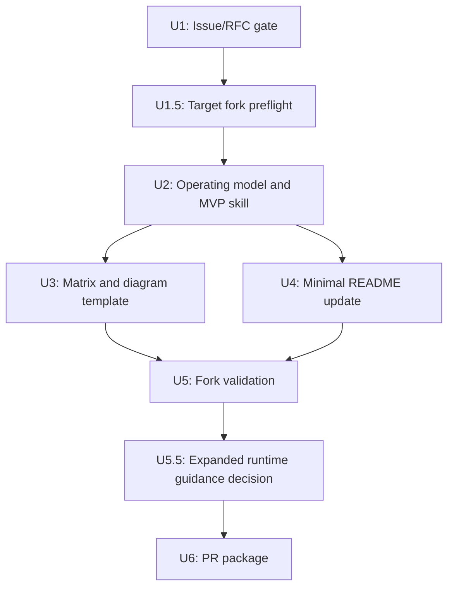

# Add Systems Engineering Traceability Skill MVP

## Overview

Create a focused, upstreamable MVP for the TraceWeaver Core skills in
`addyosmani/agent-skills`.

TraceWeaver Core MVP is the open-source runtime bundle: two core skills, four runtime
references, and README/index discoverability updates. The upstream
`agent-skills` PR remains a separate acceptance surface and may be packaged
smaller only through an explicit scope decision.

The architecture has three layers:

| Layer | Purpose | Names |
|---|---|---|
| Core skills | Portable, upstream-neutral capabilities usable in any agentic workflow | `requirements-reviewer`, `systems-engineering-traceability` |
| Core lifecycle guidance | Explains how the core skills work together across the lifecycle | `traceweaver-operating-model`, matrix template, requirements/V&V guide, risk/gap/change-control guide |
| Compound Engineering adapter | Wires core capabilities into Compound Engineering workflows, prompts, agents, and delegation | TraceWeaver CE, `ce-traceability`, `ce-traceability-reviewer`, CE hooks |

Core capabilities must stay portable. CE-specific hooks, reviewer agents, and
delegation payloads belong in TraceWeaver CE and must not become the source
definition of the core skills.

The core artifact model is:

- Requirements-reviewer skill: reviews whether needs, requirements, success
  criteria, acceptance criteria, and reframed requirements are good enough to
  become authority.
- Systems-engineering-traceability skill: checks whether meaningful behavior
  traces to approved authority, implementation, verification, and validation
  evidence.
- Agent-facing operating model: original, distilled lifecycle rules for agentic systems-engineering traceability.
- Markdown traceability matrix: authoritative audit record for links, status, evidence references, gaps, and human decisions.
- Requirements and V&V guide: runtime guidance for idea/need separation,
  inferred requirements, ATPs, result records, verification, and validation.
- Risk, gap, and change-control guide: runtime guidance for first-class risk
  controls, approved gaps, traceability debt, dark-code classification, and
  impact analysis.
- Mermaid diagram: derived visual map.
- Stable IDs: links across docs, code, tasks, tests, reviews, gaps, and human decisions.
- Document chain: requirements doc -> plan doc -> traceability matrix -> ATP -> results.
- Agent workflow: setup and maintenance owner.

**Target repo for MVP implementation:** fork of `addyosmani/agent-skills`

**Local planning source:** `docs/specs/systems-engineering-traceability-agent-skill.md`

---

## Problem Frame

Agent-generated code can pass tests while losing the engineering chain that explains why behavior exists, what requirement it satisfies, how it is verified, and how it is validated. The requirements call for a skill that manages that traceability flow across the existing agent lifecycle without presenting a heavyweight systems engineering framework.

The updated requirements also require a lightweight tooling flow. In v1, tooling means agent-executable setup and maintenance instructions plus a reference template. That tooling must preserve document-to-document traceability from requirements to plans, traceability rows, ATP entries, and results. Executable automation such as `/trace`, automatic Mermaid generation, metrics calculation, or CI enforcement remains follow-up work unless maintainers request it.

---

## Requirements Trace

- R1-R6. The skill must manage traceability across lifecycle phases, define mode-selection rules, and include checkpoints before planning, building, testing, review, and shipping.
- R7-R13. The skill must define setup and maintenance tooling: stable IDs, feature-scoped prefixes, authoritative Markdown matrix, Mermaid view, repo-local traceability artifact, and helper inheritance.
- R14-R17. The skill must record verification, validation, and human approval evidence without confusing tests with validation.
- R18-R22. The skill must detect dark code, classify gaps, narrow impact-analysis triggers, and prevent fake traceability.
- R23-R28. The first upstream contribution must follow Agent Skills anatomy, stay focused, keep supporting templates in top-level `references/`, and avoid bundled concerns.
- R29-R33. The contribution path must verify upstream rules, open an issue/RFC, validate in a fork before PR submission, capture adoption friction, and defer executable tooling.
- R34-R36. The skill must explicitly link requirements documents, planning documents, traceability rows, ATP entries, and result records, and treat missing or stale document links as traceability gaps.
- R37-R41. The project must keep raw source material in ignored local cache, commit only original distilled guidance, mark provisional source-derived guidance until ground-truth review, and separate the operating model from the matrix template.
- R42. The project must make source-to-runtime guidance sync auditable through mapping, version stamp, checksum, review owner, review session, and implementation commit evidence.
- R43-R50. The lifecycle must include requirements-reviewer quality control before requirements or success criteria can become implementation authority, preserve original stakeholder wording during agent reframing, convert accepted weak requirements into approved exceptions instead of approved requirements, and route requirements-quality and traceability skills cumulatively when both apply.
- R51-R53. The project must keep TraceWeaver Core skills, Core lifecycle guidance, and the Compound Engineering adapter separate. Core skills stay upstream-neutral; TraceWeaver CE wires those core capabilities into CE-specific workflows without redefining them.
- F1-F5. The implementation must support setup, maintenance, audit, visual-map, and engineering-document-chain use cases from the origin document.
- AE1-AE10. The plan must support the acceptance examples for setup, matrix authority, helper inheritance, inferred requirements, fork validation, document-chain traceability, source/distillation control, requirements-quality control, cumulative skill routing, and core-vs-adapter separation.

---

## Scope Boundaries

- Do not add `/trace` in the first PR.
- Do not add `agents/systems-engineer.md` in the first PR.
- Do not patch every existing skill in the first PR.
- Do not treat traceability as an end-of-project reconstruction exercise.
- Do not add executable automation for diagram generation, metrics, or CI enforcement.
- Do not add high-assurance variants, SysML, MBSE, DOORS, or a requirements database.
- Do not require line-level or helper-level traceability.
- Do not claim the Mermaid diagram is authoritative.
- Do not reproduce ISO/IEC/IEEE 15288:2023, ISO/IEC/IEEE 29148, ISO/IEC/IEEE 15289, or the INCOSE Systems Engineering Handbook.
- Do not claim standards compliance. The MVP may say it is a lightweight original operating model aligned with systems-engineering concepts.
- Do not commit downloaded standards, handbook PDFs, source screenshots, extraction notes, or long copied excerpts.

### Deferred to Follow-Up Work

- `/trace` command: follow-up PR after the core skill is accepted or requested.
- Systems engineer persona: follow-up PR after the core skill is accepted or requested.
- Lifecycle skill patches: follow-up PRs with one concern per PR.
- Executable Mermaid generation: follow-up after the matrix/template workflow is accepted.
- Metrics, CI checks, and high-assurance variants: future iteration after the lightweight skill has field evidence.

---

## Context & Research

### Current Upstream Signals

- `CONTRIBUTING.md` still says new skills belong under `skills/`, require `SKILL.md`, require YAML `name` and `description`, and should be specific, verifiable, battle-tested, and minimal.
- `CONTRIBUTING.md` also says supporting files should be created only when content exceeds 100 lines and should live in top-level `references/`, not inside skill directories.
- `README.md` still frames Agent Skills around lifecycle commands and automatic skill activation, so the first PR should avoid claiming command wiring unless it is actually added.
- `docs/skill-anatomy.md` remains the anatomy reference for the new skill.
- PR #59 remains the split-concerns precedent: do not bundle the core skill with persona or orchestration wiring.

### Relevant Upstream Patterns

- `skills/spec-driven-development/SKILL.md` is the tone reference for specification discipline.
- `skills/planning-and-task-breakdown/SKILL.md` is the pattern reference for task blocks and acceptance criteria.
- `skills/code-review-and-quality/SKILL.md` is the pattern reference for review gates without over-expanding the review model.
- `skills/documentation-and-adrs/SKILL.md` is the pattern reference for linking decisions to requirements without duplicating implementation detail.
- `references/testing-patterns.md`, `references/security-checklist.md`, `references/performance-checklist.md`, and `references/accessibility-checklist.md` establish that reusable templates/checklists belong under `references/`.

### External Systems Engineering References

Use these as background references for the implementation and validation framing, not as extra upstream PR scope:

- ISO/IEC/IEEE 15288:2023 is the primary systems life-cycle process source. Use it for the broad lifecycle process frame, not as text to copy into the repo.
- INCOSE Systems Engineering Handbook, 5th Edition is the primary systems-engineering handbook source. Use it as process guidance aligned with ISO/IEC/IEEE 15288:2023, not as runtime skill text.
- ISO/IEC/IEEE 29148 is the requirements-engineering companion source for requirements processes, requirement structure, and requirements information items.
- ISO/IEC/IEEE 15289 is the documentation companion source for life-cycle information items and documentation framing.
- NASA public systems engineering material is practical example material for traceability matrices, requirement IDs, verification and validation planning, and V&V evidence.
- Agent Skills contribution rules support the requirement that the first PR stay specific, verifiable, battle-tested, and minimal.
- Addy Osmani's AI spec guidance supports spec-as-persistent-context, planning before implementation, small reviewable chunks, and iterative refinement through tests and feedback.

The repository artifact must use original project language:

```text
ISO/INCOSE = authority and provenance for systems-engineering alignment.
NASA = public implementation examples.
TraceWeaver Markdown = original agent-facing operating model.
```

### Local Context

- Origin document: `docs/brainstorms/2026-04-25-systems-engineering-traceability-skill-requirements.md`
- Source spec: `docs/specs/systems-engineering-traceability-agent-skill.md`
- Existing plan updated in place: `docs/plans/2026-04-25-001-feat-traceability-skill-mvp-plan.md`
- Source material policy: public commits keep source-processing instructions out
  of the repository; promotion and hygiene constraints are recorded in
  `docs/validation/traceweaver-core-11-promotion-records.md`.
- Local ignored source cache: `.source-materials/`
- No `docs/solutions/` institutional learnings exist in this workspace.

---

## Repository Context

Local prep and evidence files live in this planning repo unless explicitly moved later:

```text
docs/upstream/
docs/validation/
.source-materials/  # local-only, ignored by git
```

Target-fork files live in the `addyosmani/agent-skills` fork:

```text
skills/
references/
README.md
```

Implementation units U1, U1.5, U5, U5.5, and U6 create local planning/evidence
files. U2-U4 modify the target fork. U5.5 may also modify the target fork only
after it is recorded as a scope-change candidate and only for Core skill work:
requirements quality, runtime guidance sync, and cumulative
requirements/traceability routing. Persona-awareness, CE-specific reviewer
agents, CE hooks, and broader persona wiring remain TraceWeaver CE or follow-up
work unless separately authorized. Implementers must complete the U1.5
configuration-control preflight before editing `skills/`, `references/`, or
`README.md`.

---

## Key Technical Decisions

- Include `references/traceability-matrix-template.md` in the MVP as a required traceability artifact. If the issue/RFC or maintainer feedback rejects a separate matrix template, treat that as a scope-change decision and revise the MVP shape before implementation or packaging.
- Include `references/systems-engineering-traceability-operating-model.md` in the MVP as the original, distilled, agent-facing operating model.
- Include `references/requirements-and-vv-guide.md` and `references/risk-gap-and-change-control-guide.md` as mandatory TraceWeaver Core runtime guidance. If upstream packaging removes either companion guide, record that as a scope decision instead of silently shrinking Core.
- Keep `SKILL.md` concise and workflow-oriented; put longer table examples, evidence blocks, and Mermaid examples in the reference template.
- Keep the deeper source hierarchy and lifecycle rules in the operating model reference rather than making every skill section read like a handbook.
- Make the Markdown matrix authoritative for trace links, trace status, evidence references, gaps, and human decisions. Source artifacts remain authoritative for their own detailed content: requirements live in the requirements/spec documents, design rationale in ADRs/design notes, procedures in ATPs, and measured outcomes in result records.
- Preserve the document chain from requirements doc to plan doc to traceability matrix to ATP and results when those artifacts exist.
- Include feature-scoped ID guidance such as `SREQ-AUTH-001` without forcing every namespace on small projects.
- Make Lite the default mode, Standard the mode for ambiguous behavior/interface/data-flow changes, and Audit the mode for high-risk or owner-unclear work.
- Satisfy lifecycle management through Core skill triggers, phase checkpoints, and requirements-quality plus traceability review tasks in the first PR; defer command wiring, lifecycle skill patches, and CE-specific hooks to adapter or follow-up work.
- Make clear that the Core skills are intended for use during `/spec`, `/plan`, `/build`, `/test`, `/review`, and `/ship` work, even though the first PR does not wire those commands automatically. If validation shows the Core skills are not naturally discoverable during lifecycle work, narrow the first PR claim to directly usable or manually invoked requirements-quality and traceability support.
- Add a no-orphan-implementation gate: before creating meaningful behavior, the agent must identify approved authority. Valid authority is an approved requirement, approved ADR/design decision, first-class approved risk control, approved traceability gap, or task that closes directly to one of those approved authorities. A task ID alone is not authority, and a bare `RISK-*` ID is not authority.
- Add a requirements-quality gate: before a requirement or success criterion can authorize implementation, requirements-reviewer must confirm it preserves source intent and is clear, singular, necessary, feasible, verifiable, validation-aware, source-traceable, implementation-neutral unless intentionally constrained, and at the correct abstraction level.
- Human acceptance of a weak, ambiguous, unverifiable, implementation-biased, or incomplete requirement does not make it an approved requirement. If the team chooses to proceed, convert the item into an approved gap, accepted risk, design decision, validation gap, or change-control exception with owner, approved by, date/session, allowed use, review condition, and rationale.
- Treat inferred requirements as `Draft` until approval evidence records approver, date/session, source artifact, affected IDs, and resulting status.
- Use evidence-based trace status transitions: `Draft -> Approved -> Implemented -> Verified -> Validated`, with non-linear statuses for `Gap`, `Deferred`, and `Retired`.
- Treat ATP as acceptance test plan/procedure and result records as acceptance test results, verification output, or acceptance test report artifacts linked by requirement ID.
- Validate with three scenarios before opening the upstream PR: one new feature, one unclear existing module, and one low-risk Lite-mode case.
- Representative or dummy runs may validate workflow shape and evidence capture, but they do not satisfy R31's real-scenario validation requirement.
- Measure validation quality by actionability, false positives, confusing guidance, overhead, and reviewer confidence, not just gap counts.

---

## Open Questions

### Resolved During Planning

- Should the MVP include a separate matrix template? Yes. The matrix/template is central to setup and dry-run validation; maintainer pushback triggers a scope-change decision, not optional omission.
- Should Mermaid be in the MVP? Yes, as a section in the template and guidance in the skill, not as executable generation.
- Should the first PR include `/trace` or a systems engineer persona? No. Those are separate concerns.
- Should lifecycle skill patches be part of the first PR? No. They increase review surface and should be separate follow-ups.

### Deferred to Implementation

- Exact final wording of `SKILL.md`: defer to implementation review against upstream tone and line count.
- Exact README placement: defer until editing the fork because upstream README may change.
- Exact fork validation subjects: choose during validation based on available real projects/modules.
- How to respond if maintainers reject the matrix template: decide after issue/RFC discussion and revise the MVP before implementation or packaging.

---

## Output Structure

Target fork files:

```text
skills/
  requirements-reviewer/
    SKILL.md
  systems-engineering-traceability/
    SKILL.md
references/
  systems-engineering-traceability-operating-model.md
  traceability-matrix-template.md
  requirements-and-vv-guide.md
  risk-gap-and-change-control-guide.md
README.md
```

Porting note: this plan targets `addyosmani/agent-skills`, where supporting references belong in top-level `references/`. If the same operating model is ported into the Compound Engineering plugin runtime, the equivalent portable runtime location should be skill-local, for example `plugins/compound-engineering/skills/ce-traceability/references/systems-engineering-traceability-operating-model.md`.

Local prep and evidence files:

```text
docs/
  upstream/
    systems-engineering-traceability-issue.md
    fork-checkout-preflight.md
    systems-engineering-traceability-pr.md
  validation/
    systems-engineering-traceability-fork-results.md
```

---

## High-Level Technical Design

> This illustrates the intended approach and is directional guidance for review, not implementation specification. The implementing agent should treat it as context, not code to reproduce.

The skill should be structured around a systems engineering control loop:

```text
Select scope and mode
  -> Establish system context
  -> Set up or update traceability artifact
  -> Create or reuse stable IDs
  -> Before plan: link requirement source and success criteria
  -> Allocate requirements to design and tasks
  -> Link source requirements docs and plan docs
  -> During build: update implementation links as artifacts change
  -> Link implementation artifacts
  -> During test: link ATP entries, verification commands, and results
  -> Link ATP entries and result records
  -> Record verification evidence
  -> Record validation evidence or plan
  -> During review: run traceability-auditor pass on provenance, links, gaps, and evidence
  -> Update Mermaid view when useful
  -> Detect dark code and traceability gaps
  -> Perform scoped impact analysis
  -> Apply engineering-complete gate
```

The reference template should expose one compact traceability file shape:

```text
System context
Stakeholder needs
Requirements
Design decisions
Traceability matrix
Mermaid traceability diagram
Document chain links
ATP and result records
Verification evidence
Validation evidence
Traceability gaps
Dark-code candidates
Human decisions required
```

The operating model should expose one compact lifecycle rule set:

```text
idea / intent
  -> stakeholder need
  -> user requirement
  -> system requirement
  -> design decision
  -> implementation
  -> verification
  -> validation
  -> change control
```

The first PR should expose this core loop and the selected runtime references.
Command and persona integrations remain outside the first PR unless U5.5 is
explicitly accepted into the packaging surface.

---

## Implementation Units



- [ ] **U1: Draft and open upstream issue/RFC**

**Goal:** Create and open a focused issue proposal that frames the work as a lightweight traceability workflow for agent-generated behavior, including setup/maintenance artifacts but excluding executable tooling.

**Requirements:** R23-R36

**Dependencies:** Requirements doc approved.

**Local prep/evidence files:**
- Create: `docs/upstream/systems-engineering-traceability-issue.md`

**Approach:**
- Re-verify upstream `CONTRIBUTING.md`, `README.md`, and `docs/skill-anatomy.md` immediately before drafting.
- Use the upstream-friendly framing from the requirements: extend the existing lifecycle with lightweight traceability.
- Include the problem, why now, proposed MVP, explicit non-goals, validation plan, and follow-up boundary.
- Explain the artifact model in one paragraph: matrix is audit record, Mermaid is visual map, IDs are links, and requirements/plan/ATP/results links are lightweight document traceability.
- Keep `/trace`, persona, lifecycle patches, executable diagram generation, metrics, and high-assurance variants out of the initial ask.
- Record the issue URL after opening.
- If no maintainer response is available, continue only with fork-state evidence
  and non-packaging preparation unless the product owner records an explicit
  local-only strategy. Treat maintainer response as the upstream packaging gate,
  not as a silent approval.
- Before U2, record a proceed/revise/wait decision:
  - Proceed only for supportive response, bounded concern with recorded scope
    limits, or product-owner-approved local-only evidence work.
  - Revise if maintainers signal that the artifact model, top-level references, or README framing should change.
  - Wait if maintainers ask for discussion before a PR or question whether these belong as standalone Core skills.
  - Pivot if maintainers prefer patching an existing lifecycle skill instead of adding standalone Core skills.
- Before U6 PR packaging, review any maintainer feedback and record whether it changes scope, template inclusion, wording, or follow-up sequencing.

**Patterns to follow:**
- `CONTRIBUTING.md`
- `docs/skill-anatomy.md`
- PR #59 split-concerns precedent

**Test scenarios:**
- Happy path: reader can understand the proposal without reading the full local spec.
- Happy path: issue explains why setup/maintenance artifacts are part of the MVP.
- Happy path: issue explains document-chain traceability without making the MVP sound like a full ALM tool.
- Edge case: issue does not imply the repo is deficient or missing "real systems engineering."
- Error path: issue does not request approval for `/trace`, persona wiring, lifecycle patches, or executable automation.

**Verification:**
- Issue draft has a concise title, motivation, MVP scope, non-goals, validation plan, and follow-up list.
- Issue URL is recorded before U2 begins.
- U2 may begin once U1.5 preflight is complete and the proceed/revise/wait decision is recorded; maintainer response is not required before fork implementation starts unless the decision is `wait`.
- Before U6, maintainer feedback is reviewed and either incorporated or explicitly recorded as no change.

- [ ] **U1.5: Target Fork Preflight**

**Goal:** Establish configuration control before U2-U4 begin by confirming the exact repository checkout, working baseline, remotes, and change branch that will be modified.

**Requirements:** R23-R36

**Dependencies:** U1 issue URL recorded.

**Local prep/evidence files:**
- Create: `docs/upstream/fork-checkout-preflight.md`

**Approach:**
- Locate or clone the contributor fork of `addyosmani/agent-skills`.
- Record the local checkout path:

```bash
pwd
```

- Verify remotes:

```bash
git remote -v
```

Expected:

```text
origin    git@github.com:<contributor>/agent-skills.git
upstream  git@github.com:addyosmani/agent-skills.git
```

- If `upstream` is missing, add it:

```bash
git remote add upstream git@github.com:addyosmani/agent-skills.git
```

- Fetch latest refs:

```bash
git fetch origin
git fetch upstream
```

- Create the working branch from the intended upstream baseline:

```bash
git checkout main
git pull upstream main
git checkout -b feature/systems-engineering-traceability
```

If `feature/systems-engineering-traceability` already exists, do not blindly recreate, reset, or rebase it. Instead:

- Check out the existing branch.
- Record its current HEAD and relationship to `upstream/main`.
- Confirm whether it is the intended working branch for this validation run.
- If it is not the intended branch, create a new branch name from the verified upstream baseline.
- Only rebase, reset, or discard branch contents with explicit human approval.

```bash
git checkout feature/systems-engineering-traceability
git rev-parse HEAD
git merge-base HEAD upstream/main
git status --short
```

- Confirm active branch and clean state:

```bash
git branch --show-current
git status --short
```

Expected branch:

```text
feature/systems-engineering-traceability
```

Expected status before edits: `git status --short` prints no output.

**Rule:**
- All U2-U4 edits must happen only inside this verified checkout and only on `feature/systems-engineering-traceability`.
- Do not edit the planning repository.
- Do not edit the upstream `addyosmani/agent-skills` checkout.
- Do not edit any local checkout where `origin` is not the contributor fork.
- Do not edit any branch other than `feature/systems-engineering-traceability`.

**Evidence to record:**

```markdown
## Fork Checkout Preflight

Local path:
Origin remote:
Upstream remote:
Base branch:
Working branch:
Preflight completed by:
Date:
```

**Acceptance criteria:**
- [ ] Local checkout path is recorded.
- [ ] `origin` points to the contributor fork.
- [ ] `upstream` points to `addyosmani/agent-skills`.
- [ ] Working branch exists and is active.
- [ ] Working tree is clean before U2 begins.
- [ ] U2-U4 edits are explicitly scoped to this checkout.

- [ ] **U2: Create operating model and MVP `SKILL.md`**

**Goal:** Add the original agent-facing operating model and the core `systems-engineering-traceability` skill in the target fork.

**Requirements:** R1-R28, R34-R41, F1-F5, AE1-AE4, AE6-AE7

**Dependencies:** U1 issue URL recorded; U1.5 target fork preflight complete.

**Target fork files:**
- Create: `references/systems-engineering-traceability-operating-model.md`
- Create: `references/requirements-and-vv-guide.md`
- Create: `references/risk-gap-and-change-control-guide.md`
- Create: `skills/systems-engineering-traceability/SKILL.md`
- Reference while writing: `docs/skill-anatomy.md`
- Reference while writing: `skills/spec-driven-development/SKILL.md`
- Reference while writing: `skills/planning-and-task-breakdown/SKILL.md`
- Reference while writing: `skills/code-review-and-quality/SKILL.md`

**Approach:**
- Create `references/systems-engineering-traceability-operating-model.md` first so `SKILL.md` can link to an existing reference.
- Add `# Systems Engineering Traceability Operating Model`.
- State that the file is an original, lightweight operating model for agentic software development. It is aligned with INCOSE / ISO/IEC/IEEE 15288 systems-engineering concepts, but does not reproduce the standards or the INCOSE handbook.
- Include the lifecycle chain: idea / intent -> stakeholder need -> user requirement -> system requirement -> design decision -> implementation -> verification -> validation -> change control.
- Include direct agent rules:
  - Brainstorming and idea refinement create candidate ideas, needs,
    assumptions, risks, success and failure signals, open decisions, and
    not-doing boundaries. They do not create implementation authority.
  - When planning converts an idea, vague stakeholder statement, or candidate
    need into a requirement or success criterion, it preserves the original
    wording, source, agent reframe, introduced assumptions, reframe rationale,
    requirements-reviewer result, and approval state.
  - Agent-reframed requirements remain `Draft` until requirements-reviewer
    confirms they preserve intent and a human approval record accepts them.
  - Planning converts approved needs and reviewed draft requirements into
    design decisions, ATP/result expectations, verification paths, and
    validation paths.
  - Work agents may only implement meaningful behavior when it traces to approved authority.
  - Review findings are provenance, not authority. They become authority only when converted into an approved requirement change, design decision, risk control, or approved gap.
  - Requirements may evolve, but they must evolve through explicit change control.
  - A task ID alone is not authority.
  - A bare `RISK-*` ID is not authority.
  - Validation asks whether we built the right thing.
  - Verification asks whether we built it right.
  - Missing traceability must be exposed, not invented.
- Add a `Reference Basis` section naming ISO/IEC/IEEE 15288:2023, INCOSE Systems Engineering Handbook 5th Edition, ISO/IEC/IEEE 29148, ISO/IEC/IEEE 15289, and NASA public systems engineering material.
- Keep source descriptions paraphrased and brief. The operating model must not copy protected standard text.
- If licensed ground-truth sources are not yet available in `.source-materials/`, the operating model may be drafted from public knowledge and public references, but any uncertain source-derived claims must stay provisional until reviewed against the ground truth.
- Use standard skill anatomy: frontmatter, overview, when-to-use, process, rationalizations, red flags, verification.
- Define mode-selection rules and exclusions.
- Include lifecycle checkpoints for planning, building, testing, review, and shipping.
- Define the traceability review task: an agent reviews only requirement provenance, downstream links, ATP/results, gaps, and validation status before the work is called engineering-complete.
- Include the no-orphan-implementation gate: meaningful behavior must not be created unless it can be tied to an approved requirement, approved ADR/design decision, first-class approved risk control, approved traceability gap, or task that closes directly to one of those approved authorities.
- State that brainstorm ideas, inferred links, review findings, and task IDs are provenance or work packaging, not implementation authority, until converted through approval.
- Include setup and maintenance steps for `docs/traceability/[scope].md`.
- State that the Markdown matrix is authoritative for trace links, status, evidence references, gaps, and human decisions, while source artifacts remain authoritative for their own detailed content.
- State that requirements docs, plan docs, ATP entries, and result records should link through stable requirement IDs when those artifacts exist.
- Include stable ID guidance, including short IDs and optional feature-scoped IDs.
- Define allowed trace status values and evidence required to move between them.
- Keep wording practical and lightweight; avoid enterprise process vocabulary unless it directly changes agent behavior.
- Reference related skills instead of duplicating spec, planning, testing, ADR, review, or shipping workflows.
- Link to `references/systems-engineering-traceability-operating-model.md` for lifecycle rules.
- Link to `references/requirements-and-vv-guide.md` for needs, requirements,
  inferred links, ATPs, result records, verification, and validation.
- Link to `references/risk-gap-and-change-control-guide.md` for risk controls,
  approved gaps, traceability debt, dark-code classification, change control,
  and impact analysis.
- Include a forward link to `references/traceability-matrix-template.md` only as the matrix/template reference that U3 creates next; verify that link after U3 lands.

**Required lifecycle checkpoint table in `SKILL.md`:**

This table may be embedded directly in `SKILL.md` if it remains concise. If it makes the skill read like a handbook, keep a compact checkpoint checklist in `SKILL.md` and put the full table in `references/systems-engineering-traceability-operating-model.md`.

| Lifecycle phase | Agent question | Required trace update | Block condition |
|---|---|---|---|
| `/spec` | What stakeholder need and success signal justify this behavior? | Capture or reuse need and requirement IDs; preserve original wording beside agent reframes; mark inferred items as `Draft`; run requirements-reviewer before approval. | Requirement is ambiguous, untestable, contradictory, unapproved, or rewritten without source-intent evidence. |
| `/plan` | Which requirement IDs does each task satisfy? | Link plan/task IDs, acceptance criteria, likely artifacts, verification method, and validation path. | Task does not close to an approved requirement, approved ADR/design decision, first-class approved risk control, approved gap, or equivalent approved authority. |
| `/build` | Does this implementation still match the traced intent? | Link meaningful files/modules/interfaces to requirement or design IDs; record new gaps immediately. | New meaningful behavior appears without a traced reason. |
| `/test` | What ATP, test, or evidence proves the requirement? | Link ATP entries, test paths, commands/results, and verification evidence to requirement IDs. | Verification evidence is missing for implemented behavior. |
| `/review` | Can a reviewer walk backward and forward through the chain? | Run traceability-focused review for provenance, links, gaps, inferred requirements, and dark-code candidates. | Unapproved inferred links, unexplained behavior, or unresolved dark-code candidates remain. |
| `/ship` | Is the stakeholder need validated or is a validation path approved? | Link result records, validation evidence, owner, date/session, or approved validation plan. | Stakeholder-facing work lacks validation evidence or an approved validation path. |

**Required status model in `SKILL.md`:**

This table may be embedded directly in `SKILL.md` only if it stays compact. Otherwise, keep the status names and blocking rule in `SKILL.md`, then place the full evidence table in the operating model or matrix template reference.

| Status | Meaning | Required evidence |
|---|---|---|
| `Draft` | Proposed or inferred; not yet approved. | Source artifact or agent note plus required human decision. |
| `Approved` | Accepted requirement, decision, or gap. | Human approval record with approver, date/session, source artifact, and affected IDs. |
| `Implemented` | Implementation artifacts linked. | Files/modules/interfaces/tasks linked to requirement or design IDs. |
| `Verified` | Technical requirement has evidence. | Test/ATP/build/static-analysis/manual-inspection result linked to the requirement. |
| `Validated` | Stakeholder need satisfied in context. | Demo/UAT/scenario/operational evidence or accepted validation result. |
| `Gap` | Missing, stale, contradictory, or unapproved trace link. | Gap description, risk, owner, and next action. |
| `Deferred` | Valid trace item intentionally postponed. | Owner, reason, expected follow-up, and accepted risk. |
| `Retired` | Requirement, behavior, or artifact no longer active. | Deprecation/removal rationale and impact analysis. |

**Patterns to follow:**
- Existing `SKILL.md` tone and section order.
- `README.md` skill description style.
- Origin requirements R1-R28 and R34-R41.

**Test scenarios:**
- Happy path: an agent can read the operating model and understand that brainstorm outputs are candidates, review findings are provenance, and only approved authority authorizes implementation.
- Happy path: when an agent starts a meaningful feature, the skill tells it how to set up traceability before implementation.
- Happy path: as work moves through plan, build, test, review, and ship phases, the skill tells the agent which trace links to update at each phase.
- Happy path: when an agent changes behavior, the skill tells it how to maintain the matrix and evidence links.
- Happy path: before generating meaningful behavior, the agent identifies a
  valid approved authority: approved requirement, approved ADR/design decision,
  first-class approved risk control, approved gap, or a task that closes
  directly to one of those authorities.
- Happy path: before completion, a traceability-focused reviewer pass checks provenance, links, ATP/results, gaps, and validation status.
- Happy path: when an agent reviews unclear code, the skill tells it how to identify and classify dark-code candidates.
- Edge case: a tiny behavior change can use Lite mode with a minimal matrix row instead of a heavy matrix.
- Edge case: a private helper inherits traceability through its parent feature/module instead of requiring a direct requirement ID.
- Error path: an agent-inferred requirement remains `Draft` until human-approved.
- Error path: a proposed implementation artifact with no traced reason is blocked or recorded as an approved gap before code is added.
- Error path: tests alone cannot be presented as validation when they only verify technical behavior.
- Error path: ATP or result records without requirement IDs are treated as traceability gaps.

**Verification:**
- Operating model contains the lifecycle chain, agent rules, reference basis, and copyright-safe non-reproduction statement.
- YAML frontmatter has `name` and `description`, and the name matches the directory.
- Description includes clear `Use when` trigger conditions.
- Skill has clear exclusions for formatting-only, typo-only, and obvious low-risk changes.
- Skill explicitly covers matrix authority, Mermaid view status, stable IDs, document-chain links, V&V distinction, ATP/result records, dark-code detection, impact control, and completion gate.
- Skill explicitly rejects building traceability only at the end of the work.
- Skill links to the operating model reference and includes the lifecycle checkpoint table, no-orphan-implementation gate, and evidence-based status model.
- Skill stays focused on workflow and avoids embedding the full local spec.

- [ ] **U3: Add traceability matrix and Mermaid template**

**Goal:** Add the matrix/template reference for setup, matrix rows, document-chain links, Mermaid view, ATP/result records, evidence records, dark-code findings, impact analysis, and human decisions.

**Requirements:** R7-R17, R18-R22, R26-R28, R34-R41, AE1-AE7

**Dependencies:** U2 process outline stable.

**Target fork files:**
- Create: `references/traceability-matrix-template.md`
- Reference while writing: `references/testing-patterns.md`
- Reference while writing: `references/security-checklist.md`
- Reference while writing: `references/performance-checklist.md`

**Approach:**
- Keep the matrix template practical and short enough to load only when needed.
- Link back to `references/systems-engineering-traceability-operating-model.md` for lifecycle rules, candidate-vs-approved authority, and V&V definitions.
- Include one full-file skeleton for `docs/traceability/[scope].md`.
- Include system context, stakeholder needs, requirements, design decisions, traceability matrix, requirements-doc links, plan-doc links, ATP entries, result records, Mermaid diagram, verification evidence, validation evidence, gaps, dark-code candidates, and human decisions.
- Make the matrix source-of-truth rule explicit.
- Include status values and status evidence fields so rows cannot move from `Draft` to `Verified` or `Validated` without supporting evidence.
- Keep the Mermaid diagram compact and clearly labeled as generated or maintained from the matrix IDs.
- Avoid turning the template into a methodology document.

**Patterns to follow:**
- Top-level `references/` convention.
- Checklist/reference style used by existing reference files.

**Test scenarios:**
- Happy path: an agent can copy the template into `docs/traceability/[scope].md` and fill it out.
- Happy path: a reviewer can follow a requirement from requirements doc to plan task to traceability row to ATP entry to result record.
- Happy path: a reviewer can read the diagram for relationship context while relying on the matrix for audit fields.
- Edge case: validation is planned but not complete; the template records owner and status without pretending validation happened.
- Edge case: Mermaid rendering is unavailable; the matrix remains usable.
- Error path: a dark-code candidate has missing requirement and validation links; the template captures the gap and classification.
- Error path: an ATP entry or result record has no requirement link; the template captures the missing document-chain link as a gap.
- Error path: matrix and diagram disagree; the template tells the agent to update the diagram from the matrix.

**Verification:**
- `SKILL.md` links to the matrix template reference.
- Matrix template links to the operating model rather than duplicating the lifecycle rules.
- Matrix template contains no duplicate long-form process that belongs in `SKILL.md`.
- Matrix template uses repo-relative example paths.
- Matrix template includes matrix, document-chain, ATP/result, Mermaid, verification, validation, gap, dark-code, and human-decision sections.

- [ ] **U4: Add minimal README/index update**

**Goal:** Make the skill discoverable in the upstream README or relevant index with the smallest viable change.

**Requirements:** R23-R28

**Dependencies:** U2 and U3 complete.

**Target fork files:**
- Modify: `README.md`
- Potentially modify if required by fork state: `skills/using-agent-skills/SKILL.md`

**Approach:**
- Add one row in the most appropriate lifecycle section or a concise cross-cutting note if that fits upstream better.
- If upstream structure allows a cross-cutting note, state that traceability is maintained during spec, plan, build, test, review, and ship work, not reconstructed at the end.
- Do not restructure lifecycle diagrams or command counts unless the current README requires it.
- Avoid wiring the skill into slash commands in the first PR.
- Phrase the skill as a lightweight traceability workflow for agent-generated behavior.

**Patterns to follow:**
- Existing README skill table entries.
- Existing short "What it does" and "Use when" style.

**Test scenarios:**
- Happy path: a reader scanning README understands when to use the new skill.
- Happy path: a reader understands the skill is a lifecycle companion for meaningful behavior changes, not only an after-the-fact audit.
- Edge case: the skill is discoverable without implying every command now invokes it automatically.
- Error path: README update does not claim `/trace` exists or that Mermaid generation is executable.

**Verification:**
- Skill count, directory tree, and table entries remain consistent if the README maintains those counts.
- README wording keeps the first PR scope narrow.
- README/index links resolve to the new skill path.

- [ ] **U5: Validate the skill in a fork**

**Goal:** Verify and validate that the skill improves traceability across the development lifecycle while remaining lightweight enough for normal agentic development.

**Requirements:** R29-R36, AE5-AE6

**Dependencies:** U2-U4 complete in a fork.

**Local prep/evidence files:**
- Create: `docs/validation/systems-engineering-traceability-fork-results.md`

**Approach:**
- Treat the traceability skill itself as a system that must be verified and validated before upstreaming.
- Define pass, revise, and fail criteria before validation starts.
- Run a distinct-value baseline before validating the new skill: execute the same scenario once with existing Agent Skills only, then again with `systems-engineering-traceability` added.
- Run the skill on at least three realistic fork scenarios: one new-feature scenario, one unclear-existing-module scenario, and one low-risk Lite-mode scenario.
- Pre-register validation scenario selection before running comparisons: source pool, inclusion and exclusion criteria, why each selected scenario is representative, and any rejected candidates.
- Include at least one negative-control or already-well-documented scenario where the expected result may be little or no added traceability value.
- Include at least one scenario with separate requirements, plan, ATP, and result artifacts.
- The low-risk Lite-mode scenario may be small, but it still needs recorded baseline and traceability-enabled outputs so overhead and over-process can be measured.
- Run at least one lifecycle-discoverability check using a realistic lifecycle prompt without explicitly forcing the new skill. If the skill is not selected or its guidance is not applied, record the result and narrow the MVP language to manual/direct invocation or add a follow-up integration proposal.
- Test whether the skill helps agents maintain the chain: idea / intent -> stakeholder need -> requirement -> design decision -> implementation -> verification -> validation -> change control.
- Record the chosen mode, artifact produced, baseline workflow time, traceability-enabled workflow time, traceability gaps, false positives, confusing guidance, and reviewer confidence.
- Track whether findings led to concrete spec, plan, ATP, result, design, validation, test, or removal decisions.
- Capture examples without including sensitive project details.

### U5.1: Distinct Value Baseline

Before validating the traceability skill, run the same validation scenario using the existing Agent Skills workflow only.

Baseline workflow:

- `spec-driven-development`
- `planning-and-task-breakdown`
- `test-driven-development`
- `documentation-and-adrs`
- `code-review-and-quality`
- `shipping-and-launch`

Then run the same scenario again with `systems-engineering-traceability` added.

The purpose is to prove that the new skill adds distinct value rather than duplicating existing workflows. This is the allocation argument for adding a new skill: the new capability must provide a function the current lifecycle does not explicitly enforce.

Run the baseline comparison across all three validation scenarios. For each scenario, record controlled inputs before comparing outcomes so the evidence is not anecdotal or biased by rerun effects.

**Controlled validation run record:**

```markdown
## Validation Run: [Scenario ID]

Scenario:
Selection rationale:
Rejected candidate scenarios:
Starting repository and commit:
Starting branch/worktree:
Baseline workflow:
Traceability workflow:
Exact baseline prompt:
Exact traceability prompt:
Artifacts available at start:
Artifacts produced by baseline:
Artifacts produced with traceability skill:
Reviewer:
Timing method:
Baseline elapsed time:
Traceability elapsed time:
Comparison notes:
```

Rules:

- Record the baseline output before running the traceability-enabled version.
- Use the same starting repository state, scenario description, and available source artifacts for both runs.
- Do not let the traceability-enabled run inherit unrecorded human interpretation from the baseline run.
- Compare only recorded artifacts, findings, and reviewer ratings.

**Baseline comparison matrix:**

| Area | Existing Agent Skills Baseline | With Traceability Skill | Distinct Value Added |
|---|---|---|---|
| Stakeholder need captured |  |  |  |
| Requirement IDs created |  |  |  |
| Requirement-to-plan links |  |  |  |
| Requirement-to-implementation links |  |  |  |
| Requirement-to-test links |  |  |  |
| ATP / acceptance test procedure recorded |  |  |  |
| Verification evidence recorded |  |  |  |
| Validation path recorded |  |  |  |
| Design decision linked to requirement |  |  |  |
| Dark-code candidates found |  |  |  |
| Unapproved inferred requirements flagged |  |  |  |
| Change impact analysis performed |  |  |  |
| Reviewer confidence |  |  |  |
| Workflow overhead |  |  |  |
| Lifecycle discoverability |  |  |  |

**Pass criteria for distinct value:**

The traceability skill must show distinct value in at least two of the following areas:

- Finds requirement links that the baseline did not make explicit.
- Links plan tasks back to requirement IDs.
- Links implementation artifacts back to requirements or design decisions.
- Identifies missing verification evidence.
- Identifies missing validation paths.
- Identifies dark-code candidates.
- Flags inferred requirements that need human approval.
- Improves reviewer confidence in system ownership.
- Improves change impact analysis.

At least one distinct-value signal must be outcome-based, not only an artifact-completion signal. Examples include a missing validation path changing the plan, a dark-code candidate leading to removal or explicit approval, a missing verification link adding a concrete test, or reviewer confidence improving with a recorded rationale.

**Blocker:**

Do not package the PR if the traceability skill only repeats what existing Agent Skills already catch. If the new skill does not produce distinct findings, revise it into a smaller patch to an existing skill instead of submitting it as a new skill.

**Skill-level V&V matrix:**

| ID | Skill Requirement | Evidence Method | Pass Threshold |
|---|---|---|---|
| SREQ-TRACE-001 | The skill must create useful traceability from stakeholder need and requirement authority to implementation, verification, and validation evidence. | Run on the three required fork scenarios. | Finds at least one meaningful traceability gap, missing requirement, missing test link, missing validation path, or dark-code candidate in the new-feature and unclear-module scenarios; Lite mode may pass by avoiding unnecessary process while preserving the required minimal matrix row. Idea/intent lifecycle coverage is validated separately under U5.5 before packaging claims include it. |
| SREQ-TRACE-002 | The skill must remain lightweight. | Compare baseline workflow time against traceability-enabled workflow time. | Adds no more than roughly 10-15% overhead for small or medium changes. |
| SREQ-TRACE-003 | The skill must be low-noise. | Human reviewer classifies findings as useful or low-value. | Fewer than roughly 25% of findings are false positives or low-value. |
| SREQ-TRACE-004 | The skill must improve reviewer confidence. | Reviewer rates confidence before and after using the skill. | Confidence improves, and reviewer would use the skill again. |
| SREQ-TRACE-005 | The skill must not require broad repo changes. | Review PR scope. | Can be submitted as one focused skill, not a cross-repo rewrite. |
| SREQ-TRACE-006 | The skill must expose missing traceability, not invent it. | Inspect inferred links. | Any inferred requirement, design decision, or validation link is marked as needing human approval. |
| SREQ-TRACE-007 | The skill must provide distinct value beyond existing Agent Skills workflows. | Compare baseline run against traceability-enabled run. | Shows distinct value in at least two baseline comparison areas, including at least one outcome-based signal. |

**Pass / revise / fail gate:**

- **Pass:** Package the skill for PR if all skill-level requirements pass across the three required validation scenarios.
- **Revise:** Shrink and retest the skill if it is useful but too heavy, too noisy, unclear to reviewers, or producing generic findings. Typical revisions include reducing mandatory tables, tracing meaningful behavior instead of every helper function, moving heavy checks into optional Audit mode, simplifying terminology, and marking inferred links as needing human approval.
- **Fail:** Do not package the PR yet if overhead exceeds roughly 25%, findings are mostly low-value, reviewers would not use it again, the skill creates process without clarity, it requires broad changes across many existing skills, or the agent fabricates traceability after the fact.

The failure bar is not whether the skill made more documents. The failure bar is whether the skill preserved traceability from need to requirement to design to implementation to verification and validation without becoming too heavy for the Agent Skills workflow.

**Patterns to follow:**
- Success criteria in `docs/brainstorms/2026-04-25-systems-engineering-traceability-skill-requirements.md`.

**Test scenarios:**
- Happy path: the skill produces a traceability chain for a new feature.
- Happy path: baseline comparison shows the traceability skill catches explicit gaps the existing workflow did not surface.
- Happy path: the skill traces a requirement from requirements doc to plan task to matrix row to ATP entry to result record.
- Happy path: the skill identifies gaps in an unclear existing module.
- Happy path: Lite mode uses a minimal matrix row for a low-risk change without creating heavy process.
- Edge case: the skill recommends a validation plan rather than false validation.
- Error path: the skill flags inferred requirements as draft instead of approved scope.
- Error path: missing or stale links between plan, ATP, and results are recorded as traceability gaps.
- Error path: a noisy finding is recorded as false positive or confusing guidance instead of counted as success.

**Verification:**
- Validation report contains concrete counts and at least three summarized examples.
- Validation report distinguishes actual findings from illustrative examples.
- Validation report includes at least one document-chain example covering requirements, plan, ATP, and results.
- Validation report includes actionability, false positives, confusing guidance, baseline time, traceability-enabled time, overhead, and reviewer confidence.
- Validation report includes the baseline comparison matrix and states which gaps were only found by the traceability skill.
- Validation report evaluates each `SREQ-TRACE-*` row.
- Validation report includes a pass, revise, or fail decision on whether the PR is ready.

- [ ] **U5.5: Review expanded runtime guidance candidate**

**Goal:** Decide whether post-U5 runtime changes become part of TraceWeaver Core,
move to a follow-up candidate, or are reduced back to the U2-U5 validated bundle.

**Requirements:** R27, R42-R53

**Dependencies:** Representative U5 validation baseline recorded at `ca6ff66`.
R31 real-project validation remains open and is a packaging blocker. The
representative VRUNs validate workflow shape and expected evidence capture, but
they do not satisfy the real-project validation requirement.

**Candidate commit:** `987793dfd477bc205a0a49efe4ec1b1e31045903 fix: stabilize traceability authority rules`

**Scope change:**
- Adds idea / intent lifecycle framing.
- Expands runtime references from two to four files.
- Adds requirements-reviewer as a requirements-quality gate before requirements
  or success criteria can become implementation authority.
- Adds cumulative routing so requirements or success criteria use
  `requirements-reviewer`, and meaningful behavior or implementation authority
  also uses `systems-engineering-traceability`.
- Clarifies that `requirements-reviewer` and `systems-engineering-traceability`
  are Core skills, while CE-specific wrappers and hooks belong to TraceWeaver CE.
- Introduces additional distilled systems-engineering guidance.

U5.5 is not only a packaging/sync unit. It introduces expanded runtime guidance
around idea/intent lifecycle framing, requirements quality, and skill discovery.
These changes are authorized by R43-R53.

Out of scope for U5.5:

- broader agent persona guidance
- persona-awareness
- non-essential lifecycle persona wiring
- CE-specific hooks and reviewer wrappers

Those changes must move to a follow-up candidate unless separately authorized by
new requirements.

**Decision required:**
- Accept into TraceWeaver Core MVP.
- Split into follow-up candidate.
- Reduce scope back to the U2-U5 validated bundle.

**U5.5 Validation Gate:**

U5.5 passes only if all of the following are true:

1. A lifecycle-discoverability prompt involving requirements or success criteria
   invokes `requirements-reviewer` without being explicitly forced.
2. The same scenario also invokes `systems-engineering-traceability` when
   meaningful behavior or implementation authority is involved.
3. Original stakeholder wording is preserved beside any agent-reframed
   requirement or success criterion.
4. Reframed requirements remain `Draft` until requirements-reviewer confirms
   intent preservation and human approval accepts them.
5. Weak accepted requirements are converted into approved gaps, accepted risks,
   design decisions, validation gaps, or change-control exceptions.
6. Accepted-risk or exception evidence records owner, approved by, date/session,
   allowed use, review condition, and rationale.
7. Human reviewer rates the guidance clear enough to use.
8. Any failure to route requirements or success criteria through
   requirements-reviewer blocks U5.5.

Fail conditions:

- requirements-reviewer is bypassed for requirements or success criteria.
- Rewritten requirements lose original intent or source text.
- Task-only authority passes.
- Weak requirements become approved authority.
- Dummy or representative validation is presented as satisfying R31 real
  validation.

### VRUN-U55-001: Lifecycle Discoverability and Requirements-Reviewer Routing

**Purpose:** Verify that requirements-related work discovers
`requirements-reviewer` without explicitly forcing the skill, and invokes
`systems-engineering-traceability` when implementation authority is involved.

**Starting state:**

- Repo: `TraceWeaver`
- Branch: `main`
- Candidate commit: `987793dfd477bc205a0a49efe4ec1b1e31045903 fix: stabilize traceability authority rules`
- Working tree status: clean
- Runtime bundle:
  - `skills/systems-engineering-traceability/SKILL.md`
  - `references/systems-engineering-traceability-operating-model.md`
  - `references/requirements-and-vv-guide.md`
  - `references/risk-gap-and-change-control-guide.md`
  - `references/traceability-matrix-template.md`
  - `skills/requirements-reviewer/SKILL.md`
  - `skills/requirements-reviewer/references/requirements-review-finding-schema.md`

**Prompt:**

```text
I want to build a small browser-based 2.5D puzzle-combat game about weaving five original elemental forces. Help me turn this idea into a buildable plan and identify what must be true before implementation can start.
```

**Expected behavior:**

- Preserves the original idea text.
- Creates candidate needs and requirements, not approved authority.
- Invokes or recommends `requirements-reviewer` for requirement quality.
- Keeps reframed requirements in `Draft` until reviewed.
- Invokes or recommends `systems-engineering-traceability` before
  implementation authority is granted.
- Does not treat a task, idea, weak requirement, or inferred link as approved
  authority.
- Produces required evidence or blocks with a clear reason.

**Required evidence artifact:** `docs/validation/u55-lifecycle-discoverability.md`

**Human rating fields:**

- Requirements-reviewer discovered without being forced: Pass / Fail
- Traceability skill discovered when authority was needed: Pass / Fail
- Original intent preserved: 1-5
- Requirement quality guidance useful: 1-5
- Traceability guidance useful: 1-5
- Over-process level acceptable: 1-5
- Reviewer confidence improved: Yes / No

**Fail conditions:**

- Requirements-reviewer is bypassed.
- The agent rewrites the idea into requirements without preserving the original
  source.
- Draft requirements become authority.
- Task-only authority passes.
- Weak requirements become approved requirements.
- Traceability is only checked after implementation.

Additional verification:

- Focused document review reconciles requirements, spec, plan, README,
  validation record, and distilled guidance.
- Focused code review covers the accepted U5.5 Agent Skills runtime surface.
- Runtime sync evidence records source mapping, checksums, reviewer, review
  session, and implementation commit.
- Lifecycle-discoverability validation is recorded before packaging.

- [ ] **U6: Package first PR**

**Goal:** Prepare a focused upstream PR with a clean description, test plan, validation evidence, and explicit non-goals.

**Requirements:** R23-R36

**Dependencies:** U1-U5 complete. If packaging includes the expanded runtime
candidate, U5.5 must also be accepted and validated.

**Local prep/evidence files:**
- Create: `docs/upstream/systems-engineering-traceability-pr.md`

**Approach:**
- PR body should emphasize the chosen packaging surface. TraceWeaver Core
  includes the four-reference runtime bundle; upstream packaging may be smaller
  only when recorded as a scope decision.
- Include fork validation evidence from U5.
- Explicitly state that `/trace`, executable diagram generation, metrics, and
  high-assurance extensions are follow-ups. Persona and lifecycle-routing
  changes belong in U5.5 unless a smaller upstream package is explicitly chosen.
- If maintainers ask to remove the separate template, stop and revise the PR scope; do not package a traceability MVP that lacks an accepted matrix artifact or explicitly approved equivalent matrix guidance.

**Patterns to follow:**
- Upstream contribution guide.
- PR #59 split-concerns lesson.

**Test scenarios:**
- Happy path: reviewer can evaluate the PR without reasoning about future `/trace` or persona work.
- Happy path: PR description explains the artifact model without making the contribution feel enterprise-heavy.
- Happy path: PR description mentions document-chain traceability without presenting it as a full ALM or requirements database.
- Edge case: if maintainers ask to remove the separate template, packaging is blocked until the revised scope still includes an accepted matrix artifact or explicitly approved equivalent matrix guidance satisfying R9 and R10.
- Error path: PR description does not overclaim that systems engineering is now fully covered.

**Verification:**
- PR package lists changed files and explains why each belongs in the first PR.
- PR test plan includes frontmatter validation, README consistency, template review, and fork validation summary.
- Follow-up ideas are clearly labeled as out of scope.

---

## System-Wide Impact

- **Interaction graph:** The first PR adds a cross-cutting skill but does not wire it into commands or personas. Discovery happens through skill metadata and README/index references, while the skill text requires lifecycle-time use at planning, build, test, review, and ship checkpoints.
- **Traceability state:** Process state lives in Markdown traceability artifacts. The matrix is authoritative for trace links, status, evidence references, gaps, and human decisions; Mermaid diagrams are views. Requirements docs, plan docs, ATPs, and result records link through stable requirement IDs when they exist.
- **Source-of-truth boundary:** The traceability matrix is the audit record for links, status, evidence references, gaps, and human decisions. It should point back to source artifacts instead of copying or rewriting detailed requirement text, ADR rationale, ATP procedures, or result data.
- **Error propagation:** The main failure modes are fake traceability, stale diagrams, stale document-chain links, orphan implementation, and over-heavy process. Mitigations are Draft status for inferred requirements, matrix-as-source-of-truth rule, no-orphan-implementation gate, Lite mode, explicit validation plans, document-chain gaps, status transition evidence, and scoped impact triggers.
- **API surface parity:** No public API, CLI, or command surface changes in the first PR.
- **Integration coverage:** Fork validation should cover setup, maintenance, audit, and Lite-mode restraint because document review alone will not prove the skill works in practice.
- **Unchanged invariants:** Existing `/spec`, `/plan`, `/build`, `/test`, `/review`, and `/ship` commands remain technically unchanged in the first PR; the new skill defines what traceability attention agents must give when those lifecycle phases are used.

---

## Risks & Dependencies

| Risk | Mitigation |
|------|------------|
| Skill reads as enterprise-heavy systems engineering process | Keep MVP language lightweight, behavior-focused, and anchored to agent-generated code. |
| PR rejected for bundling concerns | First PR excludes `/trace`, persona, lifecycle patches, executable automation, metrics, and high-assurance variants. |
| Template duplicates too much process | Keep the matrix template short, keep the operating model focused on lifecycle rules, and make `SKILL.md` the entry point for workflow decisions. |
| Matrix and Mermaid drift | State that the matrix is authoritative for trace links and diagrams must be updated from matrix IDs. |
| Requirements, plan, ATP, and results drift | Treat missing, stale, or contradictory document-chain links as traceability gaps. |
| Skill creates fake traceability | Require inferred requirements to stay `Draft` until human-approved with approval evidence. |
| Distillation accidentally copies protected source text | Keep raw source material and extraction notes only in `.source-materials/`; commit original distilled prose with public/official source links. |
| Agent generates orphan behavior before traceability exists | Require the no-orphan-implementation gate before creating meaningful behavior. |
| Trace statuses become optimistic labels | Require evidence-backed status transitions and keep gaps/deferred/retired states explicit. |
| Validation evidence is confused with tests | Preserve explicit verification vs validation distinction in skill and template. |
| Validation cherry-picks easy wins | Require new-feature, unclear-module, and low-risk Lite cases plus false-positive and overhead reporting. |
| README/index changes expand scope | Limit README update to discoverability and consistency only. |

---

## Documentation / Operational Notes

- The issue/RFC should be opened before the PR to test maintainers' appetite and framing.
- Open or refresh the issue/RFC before U2. If no maintainer response exists,
  continue only with fork-state evidence and non-packaging preparation unless
  the product owner records an explicit local-only strategy with scope bounds.
- Do not treat the proceed/revise/wait decision as upstream approval. It is a
  risk-control decision; upstream packaging remains held until maintainer
  response or an explicit local-only scope decision exists.
- Use `.source-materials/` only as a local source cache. Committed guidance must be original distilled writing and should cite official or public source pages rather than local private files.
- The PR should be submitted only after fork validation produces concrete evidence.
- Any future `/trace` command should be designed in a separate follow-up after the core skill is accepted or requested.
- Any future systems engineer persona should be a single-perspective reviewer and should not invoke other personas.

---

## Alternative Approaches Considered

| Approach | Decision | Rationale |
|---|---|---|
| One large systems engineering PR | Rejected | Too much review surface and likely to feel process-heavy. |
| Skill-only PR without matrix template | Rejected for current MVP | Traceability requires an audit-record artifact. A skill-only PR that omits matrix guidance makes traceability optional or unusable. |
| Add `/trace` immediately | Deferred | Command behavior should follow acceptance of the core skill. |
| Add executable Mermaid generation immediately | Deferred | The first PR should prove the artifact model before adding automation. |
| Add systems engineer persona immediately | Deferred | Persona wiring is an independent concern and should be a separate PR. |

---

## Success Metrics

- Requirements R1-R53 are covered by the plan and first-prioritized work.
- First PR modifies only the MVP files needed for the core skill.
- Fork validation records useful findings from new-feature and existing-code scenarios.
- Fork validation demonstrates distinct value against an existing Agent Skills baseline in at least two comparison areas.
- Fork validation includes at least one outcome-based distinct-value signal.
- Fork validation records whether realistic lifecycle prompts discover the skill without manual forcing, or narrows the PR claim to direct/manual invocation.
- Fork validation demonstrates at least one trace from requirements doc to plan doc to traceability row to ATP and results.
- Fork validation records whether Lite mode avoids over-process on a low-risk change.
- Fork validation records false positives, confusing guidance, overhead, and reviewer confidence.
- The PR description can explain the contribution without relying on the full systems engineering draft.

---

## Phased Delivery

### Phase 1: Upstream Proposal

- Draft and open the issue/RFC.
- Confirm or refine the MVP framing based on maintainer response if it arrives before PR packaging.

### Phase 2: MVP Skill in Fork

- Create `SKILL.md`.
- Add the operating model plus matrix and Mermaid template.
- Add minimal discoverability update.

### Phase 3: Fork Validation

- Run new-feature, unclear-module, and Lite-mode scenarios.
- Record evidence, noise, overhead, and reviewer confidence.
- Tighten the skill and template before PR packaging.

### Phase 4: First Upstream PR

- Submit the focused MVP PR.
- Keep follow-up ideas out of the diff.

---

## Sources & References

- **Origin document:** [docs/brainstorms/2026-04-25-systems-engineering-traceability-skill-requirements.md](../brainstorms/2026-04-25-systems-engineering-traceability-skill-requirements.md)
- **Source spec:** [docs/specs/systems-engineering-traceability-agent-skill.md](../specs/systems-engineering-traceability-agent-skill.md)
- Upstream repository: https://github.com/addyosmani/agent-skills
- Upstream contributing guide: https://github.com/addyosmani/agent-skills/blob/main/CONTRIBUTING.md
- Upstream skill anatomy: https://github.com/addyosmani/agent-skills/blob/main/docs/skill-anatomy.md
- Split-concerns precedent: https://github.com/addyosmani/agent-skills/pull/59
- Addy Osmani AI spec guidance: https://addyosmani.com/blog/good-spec/
- ISO/IEC/IEEE 15288:2023: https://www.iso.org/standard/81702.html
- ISO/IEC/IEEE 29148:2018: https://www.iso.org/standard/72089.html
- ISO/IEC/IEEE 15289:2019: https://www.iso.org/standard/74909.html
- INCOSE Systems Engineering Handbook, 5th Edition: https://www.incose.org/resources-publications/technical-publications/se-handbook/
- NASA Requirements Verification Matrix: https://www.nasa.gov/reference/appendix-d-requirements-verification-matrix/
- NASA Systems Engineering Handbook: https://www.nasa.gov/reference/systems-engineering-handbook/
- NASA Systems Modeling Handbook: https://standards.nasa.gov/standard/NASA/NASA-HDBK-1009
- SEBoK Systems Engineering Overview: https://sebokwiki.org/wiki/Systems_Engineering_Overview
