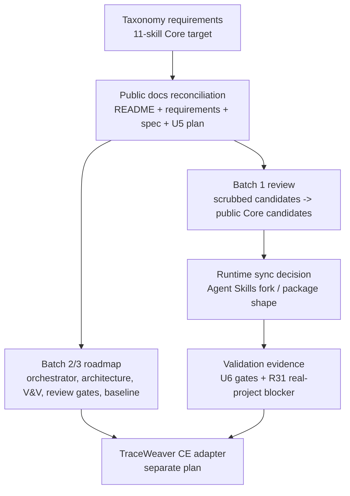

# Reconcile TraceWeaver Core Taxonomy

Supersession note: this plan captured the first reconciliation after the
taxonomy moved to an eleven-skill target. It is superseded for forward work by
`docs/plans/2026-04-29-001-feat-traceweaver-core-11-skill-suite-promotion-plan.md`
because the eleven-skill scrubbed public-candidate baseline is now the only
normal source for public/live promotion. Implementation units below are
historical unless explicitly reaffirmed by the Core 11 promotion plan.

## Overview

Reconcile the TraceWeaver public product contract after the Core taxonomy moved
from the earlier two-skill runtime bundle to an eleven-skill staged
systems-engineering taxonomy.

This plan does not implement all eleven skills. It updates requirements, specs,
plans, README language, runtime-sync evidence, and validation gates so reviewers
can tell:

- TraceWeaver Core target: eleven portable systems-engineering skills.
- TraceWeaver Core v0.1 implementation: batch 1 authority foundation only.
- `traceweaver-lifecycle-orchestrator`: batch 2 / v0.2 runtime skill, with
  interim routing handled by the Core operating model.
- TraceWeaver CE: adapter-only wiring for Compound Engineering workflows.

## Problem Frame

The reviewed taxonomy document changes the product contract. The older MVP
documents describe Core as `requirements-reviewer`,
`systems-engineering-traceability`, and a small set of runtime references. The
new contract defines a staged eleven-skill Core systems-engineering set:

- Batch 1: authority foundation.
- Batch 2: lifecycle and architecture control.
- Batch 3: evidence, review, and brownfield control.

If the old MVP plan remains the only controlling implementation plan, reviewers
can confuse historical U5/U5.5 runtime packaging with the new Core target. The
next work must create a controlled reconciliation path rather than silently
expanding MVP scope.

## Requirements Trace

- Taxonomy R1-R3. Classify Core skills, Core candidates, staged batches, and CE
  adapter-only wrappers.
- Taxonomy R4-R7. Establish batch 1 authority foundation:
  `stakeholder-needs-and-requirements-capture`, `requirements-reviewer`,
  `systems-engineering-traceability`, and `risk-gap-change-control`.
- Taxonomy R8-R11. Establish batch 2 lifecycle, architecture/interface, and
  design-decision control without pulling it into v0.1 runtime scope.
- Taxonomy R12-R15. Establish batch 3 V&V, technical review/audit, and baseline
  configuration-control roadmap scope.
- Taxonomy R16-R18. Keep CE wrappers and lifecycle hooks adapter-only.
- Existing R27. Reconcile the older Core MVP runtime bundle with the new staged
  taxonomy instead of leaving two competing definitions.
- Existing R31. Preserve the real-project validation blocker; representative
  dummy validation cannot satisfy it.
- Existing R42. Keep source-to-runtime sync auditable through mapping, version
  stamp, checksum, review owner, review session, and implementation commit.
- Existing R43-R50. Preserve requirements-quality review, source-preserving
  reframes, accepted weak requirement conversion, and cumulative routing.
- Existing R51-R53. Preserve the Core / operating-model / CE adapter split.

## Scope Boundaries

- Do not implement all eleven skills in one unit.
- Do not treat the eleven-skill taxonomy as a completed runtime bundle.
- Do not move CE hooks, CE reviewers, or CE delegation prompts into Core.
- Do not claim external standards compliance; describe TraceWeaver as an
  original lightweight operating model aligned with selected
  systems-engineering practices.
- Do not package a new upstream Agent Skills bundle until runtime sync,
  focused review, lifecycle discovery, and R31 real-project validation are
  recorded.

### Deferred to Separate Tasks

- Batch 2 runtime skill implementation:
  `traceweaver-lifecycle-orchestrator`,
  `architecture-and-interface-reviewer`, and `design-decision-reviewer`.
- Batch 3 runtime skill implementation: `verification-planner`,
  `validation-planner`, `technical-review-and-audit-gate`, and
  `baseline-configuration-control`.
- TraceWeaver CE adapter wiring for `ce-brainstorm`, `ce-plan`, `ce-work`,
  `ce-doc-review`, `ce-code-review`, `ce-compound`, and delegation prompts.
- Enterprise/cloud governance, dashboards, relationship storage, and connector
  work.

## Context & Research

### Relevant Files and Patterns

- `docs/brainstorms/2026-04-27-traceweaver-core-skill-taxonomy-requirements.md`
  is the origin document for the eleven-skill staged taxonomy.
- `README.md` still presents current state around U5/U5.5 and the older Core
  MVP bundle.
- `docs/brainstorms/2026-04-25-systems-engineering-traceability-skill-requirements.md`
  contains the prior R1-R53 requirements set and must be reconciled rather than
  discarded.
- `docs/specs/systems-engineering-traceability-agent-skill.md` still describes
  the earlier Agent Skills contribution shape.
- `docs/plans/2026-04-25-001-feat-traceability-skill-mvp-plan.md` is the
  existing U1-U5.5 MVP plan and should become historical/current-slice context,
  not the only product contract.
- `docs/validation/systems-engineering-traceability-fork-results.md` records U5
  representative validation and the unaccepted U5.5 candidate.
- `docs/distilled/` contains reviewed public guidance that must remain the
  source for runtime copies.

Private skill-output workspace: `REDACTED_NON_PUBLIC`. Paths below are relative
to that workspace:

- `outputs/agent-skills/needs-and-requirements-capture/`
- `outputs/agent-skills/requirements-reviewer/`
- `outputs/agent-skills/systems-engineering-traceability/`
- `outputs/agent-skills/risk-gap-change-control/`

The first candidate folder uses the old working name
`needs-and-requirements-capture`; the public Core name should be
`stakeholder-needs-and-requirements-capture`, with a migration note or alias
only if needed.

### Institutional Learnings

- No `docs/solutions/` learning records exist in this repository yet.

### External References

- No new external research is required for this reconciliation plan. The origin
  taxonomy document already incorporates reviewed protected-source framing and
  explicitly avoids standards-compliance claims.

## Key Technical Decisions

- Treat the 2026-04-27 taxonomy as the new product contract for TraceWeaver
  Core, but treat implementation as staged.
- Do not execute U6 runtime or packaging work before the existing U1-U5.5 MVP
  slice is either completed, explicitly frozen, or explicitly superseded. U6 is
  the reconciliation layer that prevents U1-U5.5 from being misread as the whole
  eleven-skill product contract.
- Define Core v0.1 as batch 1 authority foundation, not the full eleven-skill
  set.
- Define `traceweaver-lifecycle-orchestrator` as a batch 2 / v0.2 runtime skill.
  Until it exists, the Core operating model owns explicit routing guidance.
- Preserve the U5/U5.5 Agent Skills work as a historical implementation slice
  and candidate runtime bundle. Do not let it claim the whole new Core target.
- Promote first-batch scrubbed public-candidate outputs only after source-basis, schema,
  checklist, examples, and operating-model review.
- Keep valid authority strict: a task ID alone is never authority; it only
  carries authority when it closes directly to approved upstream authority.
- Convert intentionally accepted weak requirements into approved gaps, accepted
  risks, design decisions, validation gaps, or change-control exceptions with
  owner, approval, date/session, allowed use, review condition, and rationale.
- Keep TraceWeaver CE as an adapter layer. CE wrappers may invoke Core skills
  but must not redefine Core semantics.

## Dependencies / Prerequisites

- The existing U1-U5.5 MVP plan remains the execution path for the original
  Agent Skills traceability slice.
- Before implementing U6 changes, decide the state of U1-U5.5:
  - complete U1-U5.5 and record acceptance;
  - freeze U5.5 as a pending candidate while preserving U5 representative
    validation; or
  - explicitly supersede parts of U5.5 with the new taxonomy contract.
- Do not package the U5.5 runtime candidate as accepted unless its focused
  review, runtime-sync evidence, lifecycle-discoverability validation, and R31
  real-project validation blockers are resolved or explicitly deferred by a
  recorded scope decision.
- U6 may be planned now because the taxonomy changed, but U6 execution should
  not retroactively claim that unfinished U1-U5.5 work is complete.

## Open Questions

### Resolved During Planning

- Is the nine-skill Core set still the target? No. The reviewed taxonomy is an
  eleven-skill Core target.
- Is the eleven-skill set the MVP implementation? No. It is the staged Core
  target; v0.1 promotes the batch 1 authority foundation.
- Is `traceweaver-lifecycle-orchestrator` v0.1 or v0.2? It is batch 2 / v0.2
  runtime scope. v0.1 may include operating-model routing guidance, but not the
  orchestrator skill.
- Are CE wrappers Core skills? No. They are adapter-only wrappers around Core.

### Deferred to Implementation

- Exact public distilled file split for the first-batch skill outputs after
  source-basis review.
- Whether the upstream Agent Skills PR accepts one batch 1 bundle or requires a
  smaller package.
- Exact schemas for batch 2 and batch 3 skills that are not drafted yet.
- The real projects/modules selected for R31 real-project validation.

## High-Level Technical Design

> *This illustrates the intended approach and is directional guidance for
> review, not implementation specification. The implementing agent should treat
> it as context, not code to reproduce.*

## Implementation Units

- [ ] **U1: Reconcile public product contract**

**Goal:** Update public-facing product language so TraceWeaver Core is described
as an eleven-skill staged systems-engineering taxonomy while preserving the
current candidate/runtime status.

**Requirements:** Taxonomy R1-R18, existing R51-R53

**Dependencies:** Reviewed taxonomy requirements document.

**Files:**
- Modify: `README.md`
- Modify: `docs/brainstorms/2026-04-25-systems-engineering-traceability-skill-requirements.md`
- Modify: `docs/specs/systems-engineering-traceability-agent-skill.md`
- Reference: `docs/brainstorms/2026-04-27-traceweaver-core-skill-taxonomy-requirements.md`

**Approach:**
- Add a concise Core taxonomy section with batch 1, batch 2, batch 3, and CE
  adapter-only categories.
- Clarify current acceptance state: only `requirements-reviewer` and
  `systems-engineering-traceability` are controlled Core runtime candidates
  today; `stakeholder-needs-and-requirements-capture` and
  `risk-gap-change-control` are first-batch scrubbed candidates pending review.
- Replace language that implies the old two-skill bundle is the entire Core
  product contract.
- Keep the upstream Agent Skills packaging boundary explicit: upstream may
  accept a smaller package, but that is a scope decision, not a change to the
  TraceWeaver Core target.
- Keep the process-context map: Agreement and organizational processes are
  context/deferred; selected technical-management and technical processes are
  direct Core coverage.

**Patterns to follow:**
- The taxonomy and process-context tables in
  `docs/brainstorms/2026-04-27-traceweaver-core-skill-taxonomy-requirements.md`.
- The architecture-layer wording already present in `README.md`.

**Test scenarios:**
- Happy path: a reader can identify Core v0.1 batch 1, batch 2, batch 3, and CE
  adapter-only scope from `README.md` without opening the plan.
- Edge case: old U5/U5.5 validation language remains accurate and does not claim
  the eleven-skill target is already validated.
- Error path: a search for stale "two core skills" or "Core MVP bundle" wording
  does not leave a competing product definition.
- Error path: CE wrappers are never described as Core source definitions.

**Verification:**
- Public docs consistently describe eleven skills as the target taxonomy and
  batch 1 as the v0.1 implementation scope.
- No public doc says the U5/U5.5 runtime candidate validates the new taxonomy.

- [ ] **U2: Reconcile the existing MVP plan into U6 scope**

**Goal:** Keep the U5/U5.5 plan useful as historical implementation evidence
while adding a controlled U6 scope-change path for the taxonomy reconciliation.

**Requirements:** Existing R27, R31, R42-R53; Taxonomy R1-R18

**Dependencies:** U1 product-contract reconciliation.

**Files:**
- Modify: `docs/plans/2026-04-25-001-feat-traceability-skill-mvp-plan.md`
- Reference: `docs/plans/2026-04-27-001-feat-traceweaver-core-taxonomy-reconciliation-plan.md`

**Approach:**
- Add a clear note that the older MVP plan governs the original U1-U5.5 Agent
  Skills traceability slice, not the full eleven-skill Core target.
- Add or reference U6 as the controlled taxonomy reconciliation unit.
- Preserve U5 representative validation status at `ca6ff66` and keep R31
  real-project validation open.
- Narrow U5.5 claims so it remains a candidate for ideation,
  requirements-reviewer, cumulative routing, and companion runtime guidance, not
  a claim that batch 1 is fully implemented.
- Ensure task-only authority is disallowed everywhere the plan discusses
  planning, implementation, and no-orphan gates.

**Patterns to follow:**
- Existing U5.5 language around representative baseline, fail conditions, and
  VRUN-U55-001.

**Test scenarios:**
- Happy path: a reviewer can tell which parts of the older plan are historical
  U5/U5.5 work and which parts are superseded by U6.
- Edge case: U5.5 remains useful if the upstream Agent Skills PR proceeds with a
  smaller package.
- Error path: R31 dummy/representative validation is not treated as
  real-project validation.
- Error path: task-only authority cannot pass in any planning or implementation
  gate.

**Verification:**
- The old plan links to this U6 plan or otherwise states the taxonomy
  reconciliation dependency.
- U5/U5.5 acceptance state remains auditable and does not overclaim validation.

- [ ] **U3: Superseded - Batch 1 Candidate Promotion**

**Goal:** Historical only. Do not execute this unit as written. Batch 1
promotion is now governed by
`docs/plans/2026-04-29-001-feat-traceweaver-core-11-skill-suite-promotion-plan.md`
and must consume scrubbed public-candidate material, not internal provenance
source material.

**Requirements:** Taxonomy R4-R7; existing R37-R42, R43-R50

**Dependencies:** Superseded by the Core 11 promotion plan U0.5/U2 gates and
downstream mapped promotion units.

**Files:** See the Core 11 promotion plan. This superseded unit must not create
or modify public artifacts.

**Approach:**
- Hold this unit. Use the Core 11 promotion plan U3/U4/U5 sequence for any
  public docs, `docs/distilled/`, public skill artifact, schema, checklist,
  example, operating-model, or runtime promotion.
- Promote only from accepted scrubbed public-candidate records, with source-to-
  target promotion records and reproducible hashes.
- Keep skill boundaries strict:
  - capture creates candidates, not authority.
  - requirements-reviewer decides quality, not approval itself.
  - traceability checks approved authority and evidence.
  - risk-gap-change-control owns exceptions and moving requirements.
- Record explicit accept/revise/block decisions for each candidate.

**Patterns to follow:**
- Existing guidance pipeline in `README.md`.
- Existing runtime sync evidence table in
  `docs/validation/systems-engineering-traceability-fork-results.md`.

**Test scenarios:**
- Happy path: the capture skill preserves original stakeholder wording and emits
  candidate needs/requirements with `Candidate` or `Draft` status.
- Happy path: requirements-reviewer blocks a vague requirement from becoming
  authority unless converted to an approved exception.
- Happy path: traceability accepts an approved requirement or approved exception
  as authority and links implementation, verification, and validation evidence.
- Happy path: risk-gap-change-control records owner, approval, date/session,
  allowed use, review condition, rationale, and affected IDs for an accepted
  weak requirement.
- Error path: internal provenance identifiers are not repurposed or shifted into
  public source-basis claims.
- Error path: any copied or over-close source material blocks public promotion.

**Verification:**
- Each promoted first-batch skill has reviewed source basis, checklist,
  operating model, output schema, examples, and acceptance decision.
- `docs/distilled/` is the public source of truth before any runtime copy is
  treated as synced.

- [ ] **U4: Define runtime sync and packaging for batch 1**

**Goal:** Convert accepted batch 1 guidance into a controlled runtime packaging
decision without confusing TraceWeaver Core target scope with upstream Agent
Skills packaging scope.

**Requirements:** Existing R27, R42; Taxonomy R4-R7, R16-R18

**Dependencies:** U3 accepted or revised the first-batch candidates.

**Files:**
- Modify: `docs/validation/systems-engineering-traceability-fork-results.md`
- Modify or create: `docs/validation/u6-taxonomy-reconciliation.md`
- Target repo `addyosmani/agent-skills`: `skills/stakeholder-needs-and-requirements-capture/SKILL.md`
- Target repo `addyosmani/agent-skills`: `skills/requirements-reviewer/SKILL.md`
- Target repo `addyosmani/agent-skills`: `skills/systems-engineering-traceability/SKILL.md`
- Target repo `addyosmani/agent-skills`: `skills/risk-gap-change-control/SKILL.md`
- Target repo `addyosmani/agent-skills`: `references/`
- Target repo `addyosmani/agent-skills`: `README.md`
- Target repo `addyosmani/agent-skills`: `skills/using-agent-skills/SKILL.md`

**Approach:**
- Decide whether batch 1 is packaged as four standalone runtime skills, a
  smaller upstream bundle with companion references, or a staged upstream PR
  sequence.
- Record any smaller upstream package as a packaging decision, not a change to
  the TraceWeaver Core taxonomy.
- For every runtime copy, record source path, runtime path, source commit,
  runtime commit, checksum, reviewer, review session, and acceptance state.
- Update discovery/routing only for batch 1 lifecycle behavior:
  stakeholder-needs capture, requirements quality, traceability, and exception
  control.
- Do not add CE hooks, CE reviewer wrappers, persona-awareness, or the batch 2
  orchestrator in this unit.

**Patterns to follow:**
- U5.5 runtime-sync table shape in
  `docs/validation/systems-engineering-traceability-fork-results.md`.
- Agent Skills contribution anatomy referenced by the existing MVP plan.

**Test scenarios:**
- Happy path: a requirements-related prompt routes to capture and
  requirements-reviewer before traceability grants implementation readiness.
- Happy path: meaningful behavior routes to systems-engineering-traceability
  after authority exists.
- Happy path: an accepted weak requirement routes to risk-gap-change-control
  rather than becoming an approved requirement.
- Edge case: upstream packaging accepts only a subset; the validation record
  still preserves the full Core taxonomy and records the packaging decision.
- Error path: a task-only authority example fails.
- Error path: a CE-specific wrapper or hook is not introduced as Core runtime
  behavior.

**Verification:**
- Runtime sync evidence is complete before any batch 1 bundle is marked
  accepted.
- The target runtime package does not claim batch 2 or batch 3 behavior.

- [ ] **U5: Add U6 validation gates and evidence records**

**Goal:** Make taxonomy reconciliation and batch 1 promotion reproducible for
another reviewer or agent.

**Requirements:** Existing R31, R32, R42, R43-R50; Taxonomy success criteria

**Dependencies:** U1-U4 completed.

**Files:**
- Modify: `docs/validation/systems-engineering-traceability-fork-results.md`
- Create: `docs/validation/u6-taxonomy-reconciliation.md`
- Create or update: `docs/validation/runs/`

**Approach:**
- Add a U6 validation record with exact starting state, candidate commits,
  runtime bundle, prompts, expected output shape, required evidence artifacts,
  human rating fields, and fail conditions.
- Include at least these reproducible checks:
  - taxonomy consistency across README, requirements, spec, plan, and validation
    record.
  - initial idea to candidate needs/requirements without approved authority.
  - requirements-quality review preserving original stakeholder wording.
  - weak accepted requirement converted to approved exception evidence.
  - no-orphan traceability gate rejecting task-only authority.
  - runtime sync evidence completeness.
  - R31 real-project validation remains open until real scenarios are completed.
- Keep representative/dummy validation separate from R31 real-project
  validation.

**Patterns to follow:**
- VRUN-U55-001 prompt, evidence artifact, rating fields, and fail conditions in
  the existing MVP plan and validation record.

**Test scenarios:**
- Happy path: another agent can rerun the U6 lifecycle prompt and know exactly
  what counts as pass or fail.
- Happy path: human rating fields capture usefulness, over-process, and reviewer
  confidence for batch 1 guidance.
- Edge case: validation can pass for taxonomy consistency while still blocking
  packaging on R31 real-project validation.
- Error path: dummy evidence presented as real-project validation fails.
- Error path: missing checksum, reviewer, or implementation commit blocks
  runtime-sync acceptance.

**Verification:**
- U6 validation evidence contains exact prompts, starting state, expected
  behavior, required artifacts, human ratings, and fail conditions.
- Packaging status is explicit and cannot be inferred from incomplete evidence.

- [ ] **U6: Record batch 2 and batch 3 roadmap boundaries**

**Goal:** Preserve the eleven-skill target without letting later skills leak
into batch 1 implementation.

**Requirements:** Taxonomy R8-R15

**Dependencies:** U1 product-contract reconciliation.

**Files:**
- Modify: `README.md`
- Modify: `docs/brainstorms/2026-04-25-systems-engineering-traceability-skill-requirements.md`
- Modify: `docs/specs/systems-engineering-traceability-agent-skill.md`
- Modify: `docs/plans/2026-04-25-001-feat-traceability-skill-mvp-plan.md`

**Approach:**
- Add stable roadmap language for:
  - `traceweaver-lifecycle-orchestrator`
  - `architecture-and-interface-reviewer`
  - `design-decision-reviewer`
  - `verification-planner`
  - `validation-planner`
  - `technical-review-and-audit-gate`
  - `baseline-configuration-control`
- Make the orchestrator boundary explicit: it routes and coordinates; it does
  not own every check.
- Make `architecture-and-interface-reviewer` distinct from
  `design-decision-reviewer` unless future planning proves a combined skill is
  cleaner.
- Define `technical-review-and-audit-gate` as the owner for readiness,
  entry/exit criteria, action closure, and proceed/revise/hold decisions.
- Strengthen baseline configuration control language around change
  identification, recording, impact evaluation, approval/disapproval,
  incorporation, verification, and audit evidence.

**Patterns to follow:**
- Current Acceptance State and Distillation Focus tables in the taxonomy origin
  document.

**Test scenarios:**
- Happy path: a reader can tell every later skill is part of the Core target but
  not part of the batch 1 runtime acceptance gate.
- Edge case: operating-model routing guidance can mention lifecycle stages
  without claiming the orchestrator skill exists.
- Error path: design decisions do not absorb architecture/interface review by
  accident.
- Error path: verification and validation are not collapsed into generic tests.

**Verification:**
- Later-skill roadmap language is present, staged, and scoped out of batch 1
  runtime packaging.
- No doc describes all eleven skills as implemented or validated.

- [ ] **U7: Run focused review and prepare commit**

**Goal:** Close the planning/reconciliation loop with focused document review
and a clean, reviewable commit set.

**Requirements:** All taxonomy success criteria

**Dependencies:** U1-U6 completed.

**Files:**
- Review: `README.md`
- Review: `docs/brainstorms/2026-04-25-systems-engineering-traceability-skill-requirements.md`
- Review: `docs/brainstorms/2026-04-27-traceweaver-core-skill-taxonomy-requirements.md`
- Review: `docs/specs/systems-engineering-traceability-agent-skill.md`
- Review: `docs/plans/2026-04-25-001-feat-traceability-skill-mvp-plan.md`
- Review: `docs/plans/2026-04-27-001-feat-traceweaver-core-taxonomy-reconciliation-plan.md`
- Review: `docs/validation/systems-engineering-traceability-fork-results.md`
- Review: `docs/validation/u6-taxonomy-reconciliation.md`

**Approach:**
- Run focused document review for scope control, terminology consistency,
  validation reproducibility, and Core/CE boundary leakage.
- Check for stale terms:
  - "nine-skill" as a current target.
  - unqualified `needs-and-requirements-capture` as a public skill name.
  - "two core skills" as the entire product contract.
  - task-only authority.
  - dummy validation satisfying R31.
- Split commits by concern if execution produces a large diff:
  product-contract docs, first-batch promotion, runtime sync evidence, and
  validation records.

**Patterns to follow:**
- Existing review finding format in this thread.
- Existing validation record style.

**Test scenarios:**
- Happy path: document review finds no P1/P2 scope-control blockers.
- Edge case: old U5/U5.5 wording remains only as historical validation context.
- Error path: any doc can still be read as saying CE wrappers define Core
  semantics.
- Error path: any validation record implies the eleven-skill target is already
  validated.

**Verification:**
- Whitespace/diff checks pass.
- Review findings are either fixed or explicitly recorded as deferred with owner
  and condition.
- Commit history preserves the taxonomy change as a deliberate product-contract
  reconciliation.

## System-Wide Impact

- **Product contract:** Core changes from a small MVP bundle description to an
  eleven-skill staged target with a batch 1 v0.1 implementation path.
- **Validation posture:** U5 representative validation remains useful but does
  not validate the new taxonomy or satisfy R31.
- **Runtime packaging:** Agent Skills packaging may be smaller than the Core
  target, but that must be recorded as a scope decision.
- **Naming:** `stakeholder-needs-and-requirements-capture` becomes the public
  skill name; `needs-and-requirements-capture` is treated as an internal working
  name until renamed or aliased.
- **CE adapter:** CE work is downstream of Core and must not redefine Core
  semantics.

## Risks & Dependencies

| Risk | Mitigation |
|------|------------|
| The eleven-skill target is mistaken for an implemented MVP. | Repeat current acceptance state in README, requirements, spec, plan, and validation records. |
| U5/U5.5 validation is overclaimed. | Keep U5 representative, U5.5 pending, U6 pending, and R31 real-project validation separate. |
| First-batch candidate outputs introduce source or schema drift. | Review source basis, output schemas, examples, and runtime sync evidence before promotion under the Core 11 promotion plan. |
| CE adapter language leaks into Core semantics. | Keep CE wrappers under adapter-only scope and validate with search/review checks. |
| Scope expands into batch 2/3 implementation. | Record batch 2/3 as roadmap boundaries and block runtime packaging claims for later skills. |

## Success Metrics

- A reviewer can identify Core target, Core v0.1 batch 1 scope, batch 2/3
  roadmap, and CE adapter scope from public docs.
- Every first-batch candidate has an accept/revise/block decision before public
  runtime sync.
- Runtime sync evidence includes mapping, version stamp, checksum, reviewer,
  review session, and implementation commit.
- U6 validation is reproducible from exact prompts, starting state, expected
  outputs, required artifacts, ratings, and fail conditions.
- No document claims R31 is satisfied by representative or dummy validation.

## Phased Delivery

### Phase 0: Close or Freeze the Existing MVP Slice

- Finish, freeze, or supersede U1-U5.5 in
  `docs/plans/2026-04-25-001-feat-traceability-skill-mvp-plan.md`.
- Preserve the distinction between U5 representative validation, U5.5 pending
  candidate status, and R31 real-project validation.

### Phase 1: Contract Reconciliation

- Complete U1 and U2 so the public docs and existing MVP plan stop presenting
  competing Core definitions.

### Phase 2: Batch 1 Promotion

- Use the Core 11 promotion plan for scrubbed-candidate review and runtime
  packaging decisions.

### Phase 3: Validation and Roadmap Control

- Complete U5 and U6 to make validation reproducible and keep batch 2/3 scoped
  as roadmap work.

### Phase 4: Review and Commit

- Complete U7, then commit the plan and accepted reconciliation docs as a
  reviewable product-contract update.

## Sources & References

- **Origin document:** `docs/brainstorms/2026-04-27-traceweaver-core-skill-taxonomy-requirements.md`
- **Prior requirements:** `docs/brainstorms/2026-04-25-systems-engineering-traceability-skill-requirements.md`
- **Prior spec:** `docs/specs/systems-engineering-traceability-agent-skill.md`
- **Existing MVP plan:** `docs/plans/2026-04-25-001-feat-traceability-skill-mvp-plan.md`
- **Validation record:** `docs/validation/systems-engineering-traceability-fork-results.md`
- **Public distilled guidance:** `docs/distilled/`
