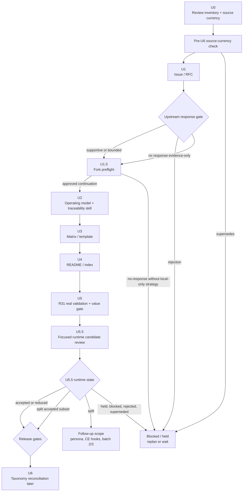

# Close Traceability MVP Through U5.5

## Overview

Close the existing U1-U5.5 MVP slice before executing the broader U6 taxonomy
reconciliation.

The taxonomy changed TraceWeaver Core into an eleven-skill staged
systems-engineering target, but the immediate work remains the original
traceability MVP slice:

- U1: upstream issue/RFC.
- U1.5: target fork preflight.
- U2: operating model and `systems-engineering-traceability`.
- U3: traceability matrix/template.
- U4: README/index discoverability.
- U5: validation in a fork.
- U5.5: focused review of the expanded runtime guidance candidate.

This plan keeps U5.5 tight. It does not accept persona-awareness, broad
lifecycle persona wiring, CE hooks, or batch 2/3 Core skills.

The 2026-04-27 document review is a stop signal for implementation until the
plan itself has controlled gates. This revision adds a durable review-finding
inventory, U5.5 validation harness, adoption/value gate, upstream response gate,
R31 scenario-selection thresholds, U6 supersession criteria, and canonical U5.5
terminal states.

The protected-source framing strengthens these gates. They are not packaging
polish; they are the baseline, release-readiness, V&V, configuration-control,
and tailored-conformance controls for TraceWeaver Light.

## Problem Frame

Review findings show that U5.5 and the older MVP plan can still be read as doing
more than their current authority supports. Before U6 expands the public product
contract around the eleven-skill taxonomy, the existing MVP slice needs a clean
closeout path.

The closeout must answer:

- Which U1-U5.5 work is already complete, pending, blocked, or superseded?
- Which review findings are stale because the docs now contain R43-R53, and
  which findings still require edits?
- Which canonical runtime-candidate state U5.5 reaches: `accepted`, `reduced`,
  `split`, `held`, `rejected`, `superseded`, or `blocked`.
- Whether validation evidence is representative-only or satisfies R31.

## Requirements Trace

- Existing R23-R28. First upstream contribution stays focused, follows Agent
  Skills anatomy, excludes `/trace`, persona work, broad lifecycle patches,
  automation, and full systems-engineering theory.
- Existing R29-R33. Issue/RFC, fork validation, adoption friction, and
  real-project validation evidence are required before first upstream PR.
- Existing R34-R42. Document-chain traceability and source-to-runtime sync
  evidence must remain auditable.
- Existing R43-R50. Requirements-reviewer is the quality gate before
  requirements become authority; weak accepted requirements convert to approved
  exceptions; agent reframes preserve source wording; requirements and
  traceability routing are cumulative.
- Existing R51-R53. `requirements-reviewer` and
  `systems-engineering-traceability` are Core skills; TraceWeaver CE is an
  adapter only.
- Taxonomy R4-R7. Batch 1 authority foundation is the near-term Core direction,
  but this U1-U5.5 closeout only accepts the already scoped traceability MVP
  pieces.
- Taxonomy R8-R18. Batch 2, batch 3, and CE adapter work are later scope and
  must not be smuggled into U5.5.

## Scope Boundaries

- Do not execute U6 taxonomy reconciliation in this plan.
- Do not promote all eleven Core skills.
- Do not implement `traceweaver-lifecycle-orchestrator`.
- Do not add `architecture-and-interface-reviewer`,
  `design-decision-reviewer`, `verification-planner`, `validation-planner`,
  `technical-review-and-audit-gate`, or `baseline-configuration-control`.
- Do not add CE wrapper hooks or CE reviewer prompts to Core.
- Do not treat representative/dummy VRUNs as satisfying R31.

### Deferred to Separate Tasks

- U6 taxonomy reconciliation:
  `docs/plans/2026-04-27-001-feat-traceweaver-core-taxonomy-reconciliation-plan.md`.
- First-batch private skill promotion for
  `stakeholder-needs-and-requirements-capture` and
  `risk-gap-change-control`.
- Batch 2 and batch 3 runtime skills.
- TraceWeaver CE adapter implementation.

## Context & Research

### Relevant Files and Patterns

- `docs/plans/2026-04-25-001-feat-traceability-skill-mvp-plan.md` is the
  controlling U1-U5.5 MVP plan.
- `docs/brainstorms/2026-04-25-systems-engineering-traceability-skill-requirements.md`
  now includes R43-R53 and should be checked before treating older
  requirements-reviewer findings as current.
- `docs/specs/systems-engineering-traceability-agent-skill.md` contains the
  spec shape and must continue to reject task-only authority.
- `docs/validation/systems-engineering-traceability-fork-results.md` records U5
  representative validation and U5.5 pending state.
- `README.md` records current packaging and validation status for readers.
- `docs/brainstorms/2026-04-27-traceweaver-core-skill-taxonomy-requirements.md`
  changes the long-term Core taxonomy but explicitly stages implementation.
- `docs/reviews/2026-04-27-u1-u55-closeout-review-findings.md` is the durable
  review-finding inventory that U0 must update before work proceeds.

### Institutional Learnings

- No `docs/solutions/` learning records exist in this repository yet.

### External References

- No new external research is required for this closeout plan. The relevant
  standards framing has already been distilled into the requirements and
  taxonomy documents.

## Key Technical Decisions

- Execute the older MVP slice through U5.5 before using U6 to reconcile the
  eleven-skill product contract.
- Treat U5 representative validation at `ca6ff66` as representative workflow
  evidence only.
- Keep R31 real-project validation open until the real feature, unclear module,
  and low-risk Lite scenarios are completed and recorded.
- Accept only this U5.5 scope unless requirements are changed first:
  requirements-reviewer, source-preserving reframes, companion runtime guidance
  sync, and cumulative requirements/traceability routing.
- Move persona-awareness, `idea-refine` command wiring, broad lifecycle persona
  guidance, CE hooks, and non-essential lifecycle routing into follow-up scope.
- Require exact U5.5 validation evidence before accepting the runtime candidate:
  prompt, starting state, expected output, evidence artifact, human rating
  fields, and fail conditions.
- Treat the closeout plan as a controlled artifact: each active review finding
  must have an inventory row, owner unit, status, evidence quote, and required
  action before `ce:work` starts.
- Run a source-currency check before U1. If standards, upstream Agent Skills
  contribution guidance, or local distilled sources changed materially, route
  the delta into U0 as an open finding before implementation edits begin.
- Let U6 supersede this plan only through an explicit gate, not by quietly
  absorbing taxonomy work into U1-U5.5.
- Treat U5.5 terminal state as the runtime-candidate decision only. It does not
  mean the TraceWeaver Light package is publishable, upstream-ready, or
  adoption-validated.
- Keep packaging readiness, upstream anatomy, target-runtime discovery, R31
  adoption validation, traceability-specific value, and fork-diff
  classification as separate release gates. A candidate may be runtime-accepted
  but release-held.

## Standards Alignment Note

TraceWeaver Light v0.1 does not claim full external standards or
process-framework conformance.

It uses a tailored systems-engineering subset focused on authority formation,
requirements quality, traceability, verification evidence, validation evidence,
configuration control, and approved exceptions.

Any deviation from the selected lifecycle, packaging, runtime, validation, or
baseline controls must be recorded as an approved exception, accepted risk, or
deferred follow-up.

## Internal Provenance Evidence

Non-public source details for this closeout are retained only through internal
provenance record `TWCORE-INT-PROV-2026-04-29-001`. Public docs and promotion
work consume scrubbed public-candidate material, not internal source material,
and this section does not authorize public/runtime promotion.

```text
internal_provenance_record: TWCORE-INT-PROV-2026-04-29-001
publishable_source_baseline: scrubbed public candidate
internal_provenance_status: non-promotable evidence only

light_v0_1_live_promoted_scope:
  - requirements-reviewer
  - systems-engineering-traceability

deferred_core_seed:
  - needs-and-requirements-capture
  - risk-gap-change-control
```

Internal provenance material is not release authority. Only promoted files in
the scrubbed public candidate and final live candidate commit count for
packaging, runtime validation, adoption validation, and upstream-ready claims.

## Open Questions

### Resolved During Planning

- Should U6 run before U1-U5.5 closes? No. U6 can remain planned, but execution
  should wait until U1-U5.5 reaches a canonical runtime-candidate state that
  permits U6.
- Should U5.5 include persona-awareness? No. It is follow-up scope unless new
  requirements authorize it.
- Should representative VRUNs satisfy R31? No. They validate workflow shape, not
  the required real-project scenarios.

### Deferred to Implementation

- Exact upstream issue/RFC URL and maintainer response.
- Exact Agent Skills fork commit used for final U5.5 validation.
- Exact real projects/modules selected for R31 validation.
- Which canonical U5.5 runtime-candidate state is reached after focused review.

## Plan Control Gates

### Review-Finding Inventory Gate

Before implementation starts, U0 must update
`docs/reviews/2026-04-27-u1-u55-closeout-review-findings.md`.

Each finding must have:

- title and severity;
- review source and evidence quote;
- affected artifact;
- current status;
- required action;
- owning implementation unit.

U0 may mark a finding `fixed` or `stale` only when it records the file/section
that proves the status. If the finding requires content changes, U0 assigns it
to the owning U1-U5.5 unit instead of editing that content directly.

### Pre-U6 Source-Currency And Supersession Check

This check does not execute U6 taxonomy reconciliation. It uses source-currency
results, already-known taxonomy decisions, upstream feedback, and validation
evidence to decide whether U1-U5.5 can continue or must be held before U6.

Before U1, perform a lightweight source-currency check for:

- protected standards/framework framing already cited in the
  requirements/taxonomy documents;
- upstream Agent Skills contribution, skill anatomy, and review guidance;
- local distilled sources in `docs/distilled/` and private first-batch skill
  outputs used as inputs to the closeout.

Record the checked source, checked date/session, current ref or URL, and result.
If a source delta changes scope, validation expectations, or packaging rules,
add or update an inventory finding and keep the affected U unit blocked until
the source delta is resolved.

U1-U5.5 must stop or replan before runtime stabilization if this pre-U6 check
finds one of these conditions:

- Core skill identity changes, such as `requirements-reviewer` or
  `systems-engineering-traceability` no longer being accepted as Core names.
- The Core/CE boundary changes so CE hooks, commands, reviewers, or delegation
  prompts become required for the Core MVP.
- Requirements-reviewer ownership changes, such that requirement quality is no
  longer a separate authority gate before traceability.
- Cumulative routing semantics change, such that requirements-quality and
  traceability are no longer both required when both apply.
- U5.5 validation acceptance criteria change enough that the current
  validation harness would no longer prove the runtime claim.
- R31 adoption/value validation shows the traceability MVP has insufficient
  value or unacceptable overhead for the target upstream user.

If any supersession condition is met, set the runtime-candidate state to
`superseded` or `blocked`, update the review inventory, and create a new plan or
plan revision before making runtime packaging changes.

### Upstream Response Gate

U1 records the maintainer/upstream response class and controls later work:

| Response class | Meaning | Required action |
|----------------|---------|-----------------|
| `supportive` | Maintainer accepts the problem and proposed narrow MVP direction. | Proceed through U1.5-U5.5. |
| `bounded concern` | Maintainer accepts the problem but asks for smaller packaging, naming changes, or narrower validation. | Revise the owning U unit, reduce scope if needed, then proceed only with recorded bounds. |
| `rejection` | Maintainer rejects the problem, contribution shape, skill identity, or routing model. | Stop packaging; mark U5.5 `rejected` or `superseded`; replan before implementation. |
| `no response` | No upstream response is available by the implementation decision point. | Run only evidence preparation after U1 unless the product owner records an explicit local-only strategy. Keep upstream packaging blocked and keep U5.5 release readiness `held` until upstream responds or local-only scope is approved. |

No-response checkpoint:

- Record the date/session when the upstream request was sent or refreshed.
- Record the planned wait window or explicit decision trigger before local-only
  work can continue beyond evidence preparation.
- If no local-only strategy is approved, U1.5 may record fork state, but U2-U5.5
  packaging/release work remains held.

Local-only strategy decision:

- Decision date/session: 2026-04-29, product-owner approval in Codex session.
- Scope: continue U2-U5.5 only for the local/live TraceWeaver candidate.
- Upstream/public release status: remains `held` while upstream response class
  is `no response`; do not claim upstream-ready or public-release-ready.
- Light v0.1 promoted scope remains limited to `requirements-reviewer` and
  `systems-engineering-traceability`.
- Internal provenance records remain non-promotable evidence only; public/runtime
  promotion must consume the scrubbed public candidate. Internal/private
  material and exception-record rewrites cannot satisfy Core 11 public skill,
  runtime/package, or public-release acceptance.
- Target-runtime discovery mechanism must be named before U5.5 equivalence can
  pass.
- R31, U5.5 harness evidence, target-runtime equivalence, fork-diff
  classification, packaging anatomy, and traceability-value evidence must bind
  to the same final live candidate commit.
- If any runtime/package-controlled file changes after a gate passes, reset
  affected gates to `held` unless explicitly impact-reviewed.

### U5.5 Runtime-Candidate Terminal States

These states describe only the U5.5 runtime candidate. They do not by
themselves approve release, upstream packaging, or adoption validation.

| State | Runtime-candidate meaning | U6 allowed? | Release readiness impact |
|-------|---------------------------|-------------|--------------------------|
| `accepted` | U5.5 runtime scope is accepted as written and runtime validation passes. | Yes | Release may still be held by R31, upstream anatomy, runtime equivalence, or packaging gates. |
| `reduced` | A narrower runtime subset is accepted; excluded deltas are removed or deferred. | Yes | Release may proceed only for the reduced subset after separate release gates pass. |
| `split` | Some runtime deltas move to follow-up while an accepted/reduced subset remains. | Yes for the accepted/reduced subset | Accepted subset can proceed to U6/release gates; split-out deltas remain held/follow-up. |
| `held` | Runtime decision waits on upstream response, source currency, target-runtime evidence, or validation evidence. | No | Release blocked. |
| `rejected` | Candidate is not accepted for the MVP. | No | Replan or return to U2-U5 baseline. |
| `superseded` | A source-currency, upstream, U6, or product-contract decision replaces this closeout path. | No | Replan required. |
| `blocked` | Required runtime gate failed or required evidence is unavailable. | No | Blocked until the blocker is resolved. |

Separate release gates:

- upstream response and packaging acceptance;
- upstream Agent Skills anatomy or approved package-structure exception;
- target-runtime discovery equivalence;
- R31 real-project validation;
- traceability-specific value;
- fork-diff baseline classification and source-to-runtime sync evidence.

### Final Candidate Evidence Index Gate

Every release gate must bind to the same final live candidate commit. If any
runtime or package file changes after a gate passes, the affected gate resets to
`held` until it is rerun against the new commit or explicitly impact-reviewed.

```text
final_candidate_evidence_index:
  internal_provenance_record: TWCORE-INT-PROV-2026-04-29-001
  publishable_source_baseline: scrubbed public candidate
  live_agent_skills_repo: addyosmani/agent-skills
  upstream_base_commit: ca6ff66d46f140da72f423ea3dec819f81ef5337
  live_candidate_commit: <set by U1.5 and confirmed by U5.5>

  promoted_skills:
    - requirements-reviewer
    - systems-engineering-traceability

  deferred_private_skills:
    - needs-and-requirements-capture
    - risk-gap-change-control

  gates_bound_to_live_candidate_commit:
    - R31 adoption validation
    - U5.5 harness evidence
    - target-runtime discovery equivalence
    - fork-diff classification
    - packaging anatomy check
    - traceability-specific value scenario
```

U5 and U5.5 validation artifacts must copy this index, fill in
`live_candidate_commit`, and name any later runtime/package-file change. A later
change does not inherit earlier validation by default.

### R31 Adoption And Value Gate

R31 validation must prove practical value for representative stakeholders or
approval authorities, not only document completeness.

Primary adoption actors:

- Upstream maintainer is the release/adoption approval authority for public
  upstream packaging.
- Agent Skills contributor is the representative user for task-success and
  workflow-overhead ratings.

If one person fills both roles, the validation record must say so and explain
why that is representative. If neither role is available, R31 can record local
evidence, but release readiness remains `held` or `blocked`.

Scenario selection rules:

- Pre-register the source pool for each required scenario class: real feature,
  unclear existing module, and low-risk Lite-mode change.
- Select scenarios that are non-toy, plausible for an Agent Skills contributor,
  and representative of the behavior the MVP claims to support.
- Log excluded candidates with reason, such as too trivial, too unrelated to
  behavior authority, already over-documented, too risky for the validation
  window, or blocked by missing access.
- For each scenario, record human rater name/role, relationship to the work,
  whether the rater is independent of implementation, and why that rater is
  representative of the primary adoption actor.

Minimum outcome thresholds:

- At least two of the three real scenarios must produce useful findings that a
  representative rater would keep.
- At least one passing real scenario must demonstrate traceability-specific
  value, such as improved authority linkage, matrix completeness,
  implementation-to-requirement coverage, ATP/result linkage, or an identified
  traceability gap that the rater keeps.
- Reviewer confidence must improve in at least two of the three scenarios.
- Maintainer review burden must be acceptable, or the upstream release gate
  remains held/reduced even if contributor task-success improves.
- Over-process must be rated acceptable in at least two of the three scenarios.
- False positives must not outnumber useful findings in more than one scenario.
- Any false positive that would block valid implementation without a clear
  review escape causes revise/hold.

R31 release-gate decision rules:

- `pass`: thresholds pass, traceability-specific value is demonstrated, and
  representative raters accept value/overhead.
- `reduce`: the runtime candidate has value, but some deltas create overhead,
  confusion, or scope drift.
- `split`: traceability works, but non-essential deltas must move to follow-up.
- `held`: evidence, upstream response, independent rating, or release authority
  is incomplete.
- `blocked`: real scenarios cannot be run or fail the thresholds.
- `rejected` or `superseded`: value is insufficient, overhead is unacceptable,
  or source-currency/product-contract checks replace the plan.

## High-Level Technical Design

> *This illustrates the intended approach and is directional guidance for
> review, not implementation specification. The implementing agent should treat
> it as context, not code to reproduce.*



## Implementation Units

- [x] **U0: Close review blockers against current docs**

**Goal:** Triage the active review findings, update the durable inventory, and
route each required content change to its owning U1-U5.5 unit so implementation
starts from current document state, not stale thread context.

**Requirements:** Existing R43-R53, R31, R42; Taxonomy R1-R18

**Dependencies:** None.

**Files:**
- Modify: `docs/reviews/2026-04-27-u1-u55-closeout-review-findings.md`
- Modify: `docs/plans/2026-04-27-002-feat-traceability-mvp-u1-u55-closeout-plan.md`
- Reference: `docs/plans/2026-04-25-001-feat-traceability-skill-mvp-plan.md`
- Reference: `docs/brainstorms/2026-04-25-systems-engineering-traceability-skill-requirements.md`
- Reference: `docs/specs/systems-engineering-traceability-agent-skill.md`
- Reference: `docs/validation/systems-engineering-traceability-fork-results.md`

**Approach:**
- Keep U0 triage-only. Do not perform requirements/spec/validation content
  fixes in U0.
- Mark findings stale only when the current file already satisfies them and the
  inventory records the evidence location.
- Keep real unresolved findings as U1-U5.5 blockers, with an owning unit and
  required action.
- Run the pre-U6 source-currency and supersession check and add any source
  delta as a new inventory row before U1 starts.
- Verify that R43-R53 exist and cover requirements-reviewer, accepted-risk
  evidence, source-preserving reframes, cumulative routing, and Core/CE split.
- Verify the spec says a task by itself is not authority.
- Verify U5 dependency says representative baseline and keeps R31 real-project
  validation as a packaging blocker.
- Verify U5.5 has an exact validation run record, not just generic criteria.

**Patterns to follow:**
- Existing review finding wording in this thread.
- Existing U5.5 validation section in the MVP plan.
- Status vocabulary in
  `docs/reviews/2026-04-27-u1-u55-closeout-review-findings.md`.

**Test scenarios:**
- Happy path: every review finding is either fixed in the referenced document or
  listed as an open blocker with the exact file section that still needs work.
- Edge case: stale findings are not re-fixed by weakening already-correct text.
- Edge case: source-currency check finds a packaging delta; U0 adds it to the
  inventory and routes it to the owning U unit.
- Error path: a finding about U5.5 authority remains open if persona or
  `idea-refine` wiring is still in accepted U5.5 scope.
- Error path: any claim that dummy validation satisfies R31 remains a blocker.
- Error path: U0 edits source requirements/spec/validation text directly instead
  of assigning the content fix to U1-U5.5.

**Verification:**
- The review inventory has no thread-only or undocumented finding state.
- Each open finding has an owning U unit and required action.
- No unresolved P1 finding remains hidden as implementation detail.

- [x] **U1: Open or refresh the upstream issue/RFC**

**Goal:** Ensure the upstream proposal matches the tight U1-U5.5 scope and does
not preview the full eleven-skill taxonomy as the first PR.

**Requirements:** Existing R23-R30, R51-R53

**Dependencies:** U0 review-blocker triage complete.

**Files:**
- Modify: `docs/upstream/systems-engineering-traceability-issue.md`
- Modify: `docs/plans/2026-04-25-001-feat-traceability-skill-mvp-plan.md`
- Reference: `README.md`

**Approach:**
- Frame the upstream proposal as lightweight requirements-quality and
  traceability support for agent-generated behavior.
- Include the current Core/CE boundary: upstream-neutral Core skill work only.
- Mention the eleven-skill taxonomy only as TraceWeaver roadmap context if
  needed; do not make it part of upstream MVP acceptance.
- Keep excluded work explicit: `/trace`, systems engineer persona, CE adapter,
  broad lifecycle patches, batch 2/3 skills, automation, and compliance claims.
- Record the upstream response class using the response gate:
  `supportive`, `bounded concern`, `rejection`, or `no response`.
- Proceed to runtime stabilization only for `supportive` or recorded
  `bounded concern`. A `rejection` stops packaging and requires replan. `No
  response` permits only U1.5 fork-state evidence and non-packaging evidence
  preparation. U2-U5.5 runtime/package work remains held unless the product
  owner records an explicit local-only strategy with scope bounds.

**Patterns to follow:**
- Existing issue/RFC draft in `docs/upstream/systems-engineering-traceability-issue.md`.
- Agent Skills contribution boundary in the existing MVP plan.

**Test scenarios:**
- Happy path: a maintainer can understand the first PR without accepting the
  entire TraceWeaver taxonomy.
- Edge case: maintainer asks for smaller packaging; the plan records that as a
  packaging decision, not a Core product-contract change.
- Edge case: no upstream response is available; the plan records U1.5 evidence
  only, then holds U2-U5.5 unless a product-owner-approved local-only strategy
  exists.
- Error path: proposal implies CE hooks or persona wiring are part of Core MVP.
- Error path: a rejection is treated as permission to continue packaging.

**Verification:**
- Issue/RFC artifact states scope, non-goals, and maintainer decision status.
- The MVP plan records the issue/RFC URL or records that it is still pending.
- Later units name the response class they are proceeding under.

- [x] **U1.5: Re-run target fork preflight**

**Goal:** Re-establish configuration control before editing or validating the
Agent Skills fork.

**Requirements:** Existing R23-R31, R42

**Dependencies:** U1 issue/RFC state recorded.

**Files:**
- Modify: `docs/upstream/fork-checkout-preflight.md`
- Modify: `docs/validation/systems-engineering-traceability-fork-results.md`

**Approach:**
- Confirm target repo, branch, remotes, base commit, candidate commit, and
  working tree status.
- Record whether the target runtime candidate is U5 baseline, U5.5 candidate,
  or a new candidate.
- Start the final candidate evidence index. Record the internal provenance
  record ID, live upstream base commit, live candidate commit, promoted skills,
  and deferred non-public work.
- Do not edit fork runtime files until this evidence is recorded.

**Patterns to follow:**
- Existing fork preflight file and validation record candidate tables.

**Test scenarios:**
- Happy path: preflight names the exact candidate commit used for validation.
- Edge case: working tree is dirty; validation blocks until the dirty state is
  explained or cleaned by the owner.
- Error path: runtime sync evidence references a commit that does not match the
  validated candidate.

**Verification:**
- Preflight evidence is sufficient for another agent to find the same checkout.
- Validation record and plan agree on candidate commit and branch.

- [x] **U2: Stabilize operating model and traceability skill**

**Goal:** Ensure the operating model and `systems-engineering-traceability`
runtime candidate enforce valid authority, requirements-quality handoff, and
source-preserving lifecycle rules without exceeding U5.5 scope.

**Requirements:** Existing R1-R28, R34-R42, R43-R50

**Dependencies:** U1.5 preflight complete.

**Files:**
- Modify: `docs/distilled/systems-engineering-traceability-operating-model.md`
- Modify: `docs/distilled/requirements-and-vv-guide.md`
- Modify if needed for field preservation only:
  `docs/distilled/risk-gap-and-change-control-guide.md`
- Modify: `docs/specs/systems-engineering-traceability-agent-skill.md`
- Target repo `addyosmani/agent-skills`: `skills/systems-engineering-traceability/SKILL.md`
- Target repo `addyosmani/agent-skills`: `references/systems-engineering-traceability-operating-model.md`
- Target repo `addyosmani/agent-skills`: `references/requirements-and-vv-guide.md`
- Target repo `addyosmani/agent-skills`: `references/risk-gap-and-change-control-guide.md`
  only if the accepted-exception fields need sync-preserving edits.

**Approach:**
- Ensure no-orphan authority allows a task only when it closes directly to
  approved upstream authority.
- Preserve original source wording when ideas, candidate needs, or vague
  stakeholder statements are reframed into requirements or success criteria.
- Mark agent-reframed requirements as `Draft` until requirements-reviewer and
  approval evidence accept them.
- Keep accepted weak requirements out of approved-requirement status; route them
  to approved gap, accepted risk, design decision, validation gap, or
  change-control exception records.
- Limit risk/gap guide edits to preserving the existing exception evidence
  fields needed by this MVP: owner, approved by, date/session, allowed use,
  review condition, rationale, and linked authority. Broader
  `risk-gap-change-control` promotion is deferred.
- Keep operating-model lifecycle guidance as guidance, not a claim that the
  batch 2 orchestrator skill exists.

**Patterns to follow:**
- Existing authority rules in `docs/distilled/systems-engineering-traceability-operating-model.md`.
- R43-R50 in the prior requirements document.

**Test scenarios:**
- Happy path: approved requirement links to implementation, verification, and
  validation evidence.
- Happy path: a task that closes to an approved requirement can be used as work
  packaging.
- Edge case: stakeholder idea becomes candidate need and draft requirement but
  not approved authority.
- Error path: bare task ID is rejected as implementation authority.
- Error path: weak requirement accepted by a human is converted to an approved
  exception, not upgraded into an approved requirement.
- Error path: U2 expands the risk/gap guide into the deferred
  `risk-gap-change-control` Core skill.

**Verification:**
- Distilled guidance and runtime candidate use the same authority rules.
- Runtime sync evidence is required before the candidate can be marked synced.

- [ ] **U3: Stabilize matrix/template and document chain**

**Goal:** Ensure the matrix/template supports the current MVP without requiring
batch 2/3 skills.

**Requirements:** Existing R7-R17, R18-R22, R34-R42

**Dependencies:** U2 authority and lifecycle rules stable.

**Files:**
- Modify: `docs/distilled/traceability-matrix-template.md`
- Modify: `docs/validation/systems-engineering-traceability-fork-results.md`
- Target repo `addyosmani/agent-skills`: `references/traceability-matrix-template.md`

**Approach:**
- Keep the Markdown matrix authoritative for trace links, status, evidence,
  gaps, and human decisions.
- Include links from requirements docs to plan docs, matrix rows, ATP entries,
  and result records.
- Include accepted-risk and exception evidence fields needed by
  requirements-reviewer and risk/gap/change-control guidance.
- Avoid adding fields that require not-yet-implemented batch 2/3 skills.

**Patterns to follow:**
- Existing matrix authority rule and Mermaid-as-view rule.

**Test scenarios:**
- Happy path: a feature row links need, approved requirement, plan task,
  implementation artifact, ATP, result record, and validation path.
- Edge case: validation cannot happen before merge; matrix records validation
  plan, owner, status, and review condition.
- Error path: Mermaid diagram disagrees with the matrix; matrix remains source
  of truth.
- Error path: missing ATP/result link is recorded as a traceability gap.

**Verification:**
- Template can represent U5 validation scenarios without inventing batch 2/3
  records.
- Runtime template checksum is recorded before sync acceptance.

- [ ] **U4: Update README/index discoverability narrowly**

**Goal:** Make the accepted U1-U5.5 runtime surface discoverable without
claiming full taxonomy completion.

**Requirements:** Existing R23-R28, R42, R51-R53; Taxonomy R1-R18 as context

**Dependencies:** U2 and U3 stable.

**Files:**
- Modify: `README.md`
- Target repo `addyosmani/agent-skills`: `README.md`
- Target repo `addyosmani/agent-skills`: `skills/using-agent-skills/SKILL.md`

**Approach:**
- Describe the current runtime candidate as the traceability MVP slice.
- Keep the eleven-skill taxonomy as roadmap/context, not accepted runtime.
- Make skill routing cumulative for requirements-quality plus traceability work.
- Ensure a broad traceability match cannot bypass requirements-reviewer.
- Limit lifecycle discoverability changes to routing text for
  `requirements-reviewer` and `systems-engineering-traceability` when
  requirements, success criteria, meaningful behavior, or implementation
  authority are present.
- Avoid adding CE-specific routing, persona-awareness, or batch 2 orchestrator
  claims.
- Defer workflow orchestration, personas, commands such as `idea-refine`, CE
  hooks, delegation prompts, and batch 2/3 guidance to follow-up scope unless
  separately authorized.

**Patterns to follow:**
- Current README architecture layers and validation-status tables.
- Existing cumulative routing requirement R50.

**Test scenarios:**
- Happy path: requirements/success-criteria prompt routes through
  requirements-reviewer.
- Happy path: meaningful behavior prompt routes through traceability after
  authority is identified.
- Edge case: prompt includes both requirements and implementation; both skills
  are selected.
- Error path: first-match discovery stops at systems-engineering-traceability
  and bypasses requirements-reviewer.
- Error path: README says U5.5 is validated before evidence exists.
- Error path: lifecycle discoverability text accepts CE hooks, persona wiring,
  command wiring, or batch 2/3 skill behavior as part of U5.5.

**Verification:**
- README/index text matches validation record status.
- Discovery guidance does not include deferred persona or CE adapter scope.

- [ ] **U5: Complete real validation or record blocker state**

**Goal:** Satisfy R31 with real-project validation or explicitly keep packaging
blocked.

**Requirements:** Existing R29-R33, R34-R36

**Dependencies:** U2-U4 complete in the target fork.

**Files:**
- Modify: `docs/validation/systems-engineering-traceability-fork-results.md`
- Create or update: `docs/validation/runs/`

**Approach:**
- Preserve VRUN-001 to VRUN-003 as representative validation only.
- Pre-register the real R31 scenarios:
  - one real feature;
  - one unclear existing module;
  - one low-risk Lite-mode change.
- For each scenario class, log the candidate source pool, chosen scenario,
  excluded candidates, exclusion reason, and why the selected case is
  representative.
- Reject cherry-picked cases that are toy examples, already perfectly
  documented, unrelated to behavior authority, or selected only because they are
  easy to pass.
- Record starting state, prompt/task, baseline output, TraceWeaver-enabled
  output, findings, false positives, overhead, and human ratings.
- Apply the adoption/value gate: two of three scenarios must produce useful
  retained findings, at least one scenario must demonstrate
  traceability-specific value, representative raters must improve confidence,
  and over-process must be acceptable; false positives must not outnumber useful
  findings in more than one scenario.
- Record each human rater's role, relationship to the work, independence from
  implementation, represented adoption actor, and why that rater is adequate for
  the scenario.
- Record maintainer review-burden and contributor task-success ratings
  separately unless the same person explicitly represents both adoption actors.
- If a scenario shows no value, high overhead, harmful false positives, or
  reviewer disagreement, record revise/reduce/split/hold instead of treating the
  run as a pass.
- If real validation cannot be run now, record R31 as an explicit packaging
  blocker rather than weakening R31.

**Patterns to follow:**
- Existing VRUN directory structure.
- Current validation record distinction between representative and real
  validation.

**Test scenarios:**
- Happy path: real feature validation finds useful traceability or validation
  gaps and records reviewer confidence.
- Happy path: at least one real scenario demonstrates traceability-specific
  value through authority linkage, trace coverage, matrix completeness, or
  verification/result linkage that the rater keeps.
- Happy path: unclear module audit identifies dark-code candidates or explains
  why none exist.
- Happy path: Lite-mode validation stays lightweight while preserving required
  traceability.
- Edge case: a rater is not independent; validation records the limitation and
  keeps release readiness held/reduced unless a representative substitute is
  approved.
- Edge case: TraceWeaver adds no value in one scenario; result is recorded
  honestly as revise/fail or limited value.
- Edge case: multiple candidate scenarios exist; excluded-candidate log explains
  why each was not selected.
- Error path: dummy scenario is counted as satisfying R31.
- Error path: selected scenarios are cherry-picked because they are easiest to
  pass.
- Error path: high overhead or false positives are averaged away instead of
  driving reduce/split/hold.

**Verification:**
- Validation record states pass/revise/fail for R31.
- Packaging state is blocked unless the three real scenarios are complete and
  representative stakeholder/approval-authority evidence is recorded, or a
  recorded scope decision changes the requirement.
- The validation record includes source-pool, exclusion, value, overhead,
  false-positive, rater-independence, traceability-specific value, maintainer
  review-burden, contributor task-success, and reviewer-confidence evidence.

- [ ] **U5.5: Decide the expanded runtime candidate**

**Goal:** Accept, reduce, split, or hold the expanded U5.5 runtime candidate
with authority and validation evidence, while keeping release readiness as a
separate gated decision.

**Requirements:** Existing R27, R42-R53; Taxonomy R1-R7 as context

**Dependencies:** U5 state recorded; R31 release-gate status explicit; upstream
response state recorded. U5.5 may be runtime-accepted while release readiness is
held by R31, upstream response, upstream anatomy, target-runtime equivalence, or
baseline classification gates.

**Files:**
- Modify: `docs/plans/2026-04-25-001-feat-traceability-skill-mvp-plan.md`
- Modify: `docs/validation/systems-engineering-traceability-fork-results.md`
- Create or update: `docs/validation/u55-lifecycle-discoverability.md`
- Modify: `docs/reviews/2026-04-27-u1-u55-closeout-review-findings.md`
- Target repo `addyosmani/agent-skills`: U5.5 candidate runtime files listed in
  the validation record.

**U5.5 baseline-diff preflight:**

Before packaging, diff the target fork from the validated U5 baseline
`ca6ff66d46f140da72f423ea3dec819f81ef5337` to the U5.5 candidate `987793d`.
Packaging is blocked until every changed file has a delta-map row and one of
these packaging actions: `package`, `package reduced`, `split`, `revert`,
`hold`, or `blocked`.

The diff, delta file map, packaging anatomy check, target-runtime equivalence,
R31 adoption validation, traceability-specific value scenario, and U5.5 harness
must all name the same `live_candidate_commit` from the final candidate evidence
index. If any runtime/package file changes after one of those gates passes, set
that gate back to `held` until it is rerun against the new commit or an explicit
impact review records why the prior evidence still applies.

Current target-fork diff from `ca6ff66` to `987793d`:

```text
M README.md
M agents/README.md
M agents/code-reviewer.md
M agents/security-auditor.md
M agents/test-engineer.md
A references/requirements-and-vv-guide.md
A references/risk-gap-and-change-control-guide.md
M references/systems-engineering-traceability-operating-model.md
M references/traceability-matrix-template.md
M skills/code-review-and-quality/SKILL.md
M skills/idea-refine/SKILL.md
M skills/planning-and-task-breakdown/SKILL.md
A skills/requirements-reviewer/SKILL.md
A skills/requirements-reviewer/agents/openai.yaml
A skills/requirements-reviewer/references/requirement-language-rules.md
A skills/requirements-reviewer/references/requirement-types-and-attributes.md
A skills/requirements-reviewer/references/requirements-quality-checklist.md
A skills/requirements-reviewer/references/requirements-quality-examples.md
A skills/requirements-reviewer/references/requirements-quality-operating-model.md
A skills/requirements-reviewer/references/requirements-review-finding-schema.md
A skills/requirements-reviewer/references/source-basis.md
A skills/requirements-reviewer/references/verification-validation-guide.md
M skills/spec-driven-development/SKILL.md
M skills/systems-engineering-traceability/SKILL.md
M skills/using-agent-skills/SKILL.md
```

**U5.5 delta file map:**

| File path | Candidate delta | Classification | Governing requirement | Validation needed | Packaging action |
|-----------|-----------------|----------------|-----------------------|-------------------|------------------|
| `skills/requirements-reviewer/SKILL.md` | Adds requirements-quality Core skill. | Accept or reduce pending focused review. | R43-R49, R51 | Requirements-quality review and U5.5 harness. | Package only if focused review passes. |
| `skills/requirements-reviewer/agents/openai.yaml` | Adds skill-local agent/runtime metadata. | Hold. | R27, R42, R51-R53 | Upstream anatomy and target-runtime discovery review. | Hold unless upstream anatomy allows it or approved exception records why. |
| `skills/requirements-reviewer/references/*` | Adds nested requirements-reviewer support references. | Hold pending package-structure decision. | R27, R42-R49 | Upstream anatomy review, link/load-path review, checksum/source mapping. | Move to top-level `references/`, or block with approved upstream exception for nested references. |
| `skills/requirements-reviewer/references/requirements-review-finding-schema.md` | Defines structured finding output and accepted-risk evidence. | Accept or reduce pending schema and package-structure review. | R45-R48 | Schema conformance, example validity, and package-structure decision. | Package only after valid enum/examples and resolved reference location. |
| `skills/requirements-reviewer/references/source-basis.md` | Defines source basis/provenance for requirements review. | Accept or reduce pending source-ID and package-structure review. | R43-R48 | Source-ID stability and package-structure decision. | Package only if provenance IDs are stable and reference location is approved. |
| `skills/systems-engineering-traceability/SKILL.md` | Adds valid-authority, source-preservation, and cumulative-routing handoff. | Accept or reduce. | R27, R42, R45, R49-R50 | U5.5 harness plus no-task-only authority review. | Package accepted subset only. |
| `skills/using-agent-skills/SKILL.md` | Adjusts discovery/routing so requirements work cannot bypass requirements-reviewer. | Accept or reduce. | R50-R53 | No-forced-skill discovery transcript. | Package only if cumulative routing passes. |
| `skills/spec-driven-development/SKILL.md` | Preserves original source beside reframed success criteria. | Accept if bounded to source preservation. | R49 | Source-preserving reframe review. | Package bounded edit only. |
| `skills/idea-refine/SKILL.md` | Treats ideas as pre-authority lifecycle inputs. | Split unless narrowly required by U5.5 harness. | R49-R50 | Requires separate authorization if beyond source preservation/routing. | Exclude or package only a reduced source-preservation edit. |
| `skills/planning-and-task-breakdown/SKILL.md` | May add lifecycle routing from planning into traceability/requirements review. | Split or reduce. | R49-R50 | Focused routing review. | Exclude if it creates broad lifecycle workflow scope. |
| `skills/code-review-and-quality/SKILL.md` | May add traceability/requirements review during review. | Split or reduce. | R49-R50 | Focused routing review. | Exclude CE-like or broad review workflow changes. |
| `references/systems-engineering-traceability-operating-model.md` | Syncs distilled operating model into runtime. | Accept if source-to-runtime evidence passes. | R27, R42-R50 | Checksum/source mapping. | Package accepted synced version. |
| `references/requirements-and-vv-guide.md` | Adds companion requirements/V&V runtime guidance. | Accept if bounded to Core MVP. | R27, R42-R50 | Checksum/source mapping and U5.5 harness. | Package as mandatory Core MVP reference only after acceptance. |
| `references/risk-gap-and-change-control-guide.md` | Adds companion exception/risk/gap guidance. | Reduce to exception evidence fields. | R27, R45-R48 | Checksum/source mapping and risk-guide scope review. | Package reduced field-preservation subset or defer. |
| `references/traceability-matrix-template.md` | Syncs matrix template. | Accept if source-to-runtime evidence passes. | R27, R34-R42 | Checksum/source mapping. | Package accepted synced version. |
| `README.md` | Updates discoverability, packaging, and status text. | Reduce to accepted MVP status. | R27, R42, R50-R53 | README/status consistency review. | Package only if it does not overclaim validation. |
| `agents/README.md` and `agents/*.md` | Adds persona-awareness or agent guidance. | Split out. | Deferred scope | Not part of U5.5. | Exclude, revert, or authorize in follow-up. |

**Approach:**
- Keep in U5.5:
  - requirements-reviewer capability;
  - source-preserving requirement reframes;
  - operating-model/runtime guidance sync;
  - lifecycle discoverability for requirements work;
  - cumulative requirements-reviewer plus traceability routing.
- Move to follow-up:
  - persona-awareness;
  - broad agent persona guidance;
  - `idea-refine` command wiring unless separately authorized;
  - CE hooks and delegation prompts;
  - batch 2/3 Core skills.
- Classify every candidate file using the delta file map before packaging. Any
  file classified `split`, `held`, `blocked`, `rejected`, or `superseded` must
  be excluded from the packaged candidate unless a new requirement authorizes it.
- Resolve nested-reference packaging before release packaging. Requirements
  reviewer support material must either follow upstream Agent Skills anatomy
  through top-level `references/` with updated links/checksums, or carry an
  explicit approved exception that records owner, rationale, allowed use, and
  review condition.
- Add or confirm stable requirement authority for cumulative routing. If
  existing R50 is insufficient, add a narrow requirement rather than expanding
  U5.5 by implication.
- Use the U5.5 validation harness below for exact validation run evidence.

**U5.5 validation harness:**

- Harness ID: `VRUN-U55-001`.
- Supported runner for Light v0.1 validation: Codex Desktop/Codex skill runtime
  configured to load the live Agent Skills fork at the `live_candidate_commit`
  recorded in the final candidate evidence index.
- Target discovery mechanism: the Codex skill-discovery path used for Agent
  Skills packages, including frontmatter metadata parsing, `SKILL.md` loading,
  relative `references/` loading, and cumulative skill routing from
  `using-agent-skills` into `requirements-reviewer` and
  `systems-engineering-traceability`.
- Evidence artifact must record actual agent name, app/runtime version if
  visible, model, date/session, operator, live candidate commit, skill search
  path, parsed skill metadata, loaded skill paths, loaded reference paths,
  routing decision trace, invocation/recommendation outcome, and failure
  behavior.
- Target-runtime equivalence: the harness must use the target discovery
  mechanism above. If a different runner is used, the evidence must map its
  search paths, metadata parsing, skill loading, reference loading,
  invocation/routing behavior, and failure behavior to the target mechanism. If
  equivalence cannot be shown, set runtime-candidate state to `held` or
  `blocked`.
- Skill load paths:
  - `skills/using-agent-skills/SKILL.md`
  - `skills/requirements-reviewer/SKILL.md`
  - `skills/systems-engineering-traceability/SKILL.md`
  - accepted runtime references from the delta file map.
- Transcript protocol: save the exact prompt, unedited model output, any
  explicit skill-discovery trace available in the runtime, reviewer notes, and
  final pass/fail table in `docs/validation/u55-lifecycle-discoverability.md`.
- No-forced-skill rule: the validation prompt must not name TraceWeaver,
  `requirements-reviewer`, `systems-engineering-traceability`, or any requested
  skill by name.
- `Discovered` means the agent identifies the relevant skill or its rule set as
  needed before the user forces it.
- `Invoked` means the agent applies the skill's gate/checklist to produce or
  block an artifact.
- `Recommended` means the agent explicitly says the skill must run before
  approval and blocks authority until that happens.
- Pass condition: requirements-reviewer is discovered and invoked or
  recommended for requirements-quality work; traceability is invoked or
  recommended when implementation authority is involved; no fail condition is
  hit.
- Log artifact: `docs/validation/u55-lifecycle-discoverability.md`.

**Patterns to follow:**
- VRUN-U55-001 format already drafted in the existing MVP plan.
- R50 cumulative routing requirement.

**Test scenarios:**
- Happy path: lifecycle prompt discovers requirements-reviewer without being
  forced.
- Happy path: same prompt invokes or recommends systems-engineering-traceability
  when implementation authority is involved.
- Happy path: original stakeholder idea text is preserved beside the reframe.
- Happy path: baseline-diff preflight proves every changed file has a delta-map
  row and packaging action.
- Happy path: target-runtime discovery evidence shows the same discovery path
  expected for upstream packaging, or records an accepted equivalence argument.
- Edge case: the candidate creates draft requirements and blocks
  implementation authority pending review.
- Edge case: nested requirements-reviewer references are moved to top-level
  `references/` or held behind an approved package-structure exception.
- Error path: requirements-reviewer is bypassed.
- Error path: task-only authority passes.
- Error path: weak requirement becomes approved requirement.
- Error path: persona-awareness or `idea-refine` wiring is accepted without a
  stable requirement.
- Error path: validation prompt names the required skills directly, invalidating
  the no-forced-skill discovery check.
- Error path: a changed fork file is packaged without a delta-map row.
- Error path: local runtime discovery passes but target-runtime equivalence is
  not proven.

**Verification:**
- U5.5 has a recorded terminal state: `accepted`, `reduced`, `split`, `held`,
  `rejected`, `superseded`, or `blocked`.
- Validation artifact is reproducible by another agent.
- Any accepted U5.5 runtime files have complete source-to-runtime sync evidence.
- The runtime-candidate state uses the canonical state list and explains its
  effect on U6 and separate release gates.
- Release readiness separately records upstream anatomy, runtime equivalence,
  R31 value/adoption, traceability-specific value, and fork-diff classification
  gate status.
- The review inventory records each U5.5 finding as fixed, split, held,
  blocked, rejected, superseded, or stale with evidence.

## System-Wide Impact

- **Planning sequence:** U1-U5.5 reaches a controlled runtime-candidate state
  before U6 execution.
- **Validation status:** U5 representative validation remains useful but cannot
  satisfy R31.
- **Runtime scope:** U5.5 can accept only requirements-quality, runtime sync, and
  cumulative routing unless new requirements authorize more.
- **Taxonomy relationship:** eleven-skill Core remains the target, but this plan
  only closes the original traceability MVP slice.
- **CE boundary:** CE adapter work remains outside Core U1-U5.5.

## Risks & Dependencies

| Risk | Mitigation |
|------|------------|
| U5.5 keeps absorbing persona/lifecycle work. | Split persona-awareness, `idea-refine`, CE hooks, and batch 2/3 work into follow-up scope unless separately required. |
| R31 is overclaimed from representative runs. | Preserve representative/real validation distinction in every status table. |
| Existing review findings are stale but still distract execution. | U0 records each finding in the durable inventory and marks stale only with evidence. |
| U6 taxonomy work starts before MVP closeout. | The pre-U6 source-currency and supersession check uses already-known deltas to stop, block, or replan U1-U5.5 without executing U6 early. |
| Upstream packaging changes the bundle shape. | Record packaging changes as scope decisions, not silent product-contract changes. |
| R31 scenarios are cherry-picked. | Pre-register the source pool, excluded candidates, representativeness rationale, and fail thresholds. |
| Validation proves hygiene but not adoption value. | Use the R31 adoption/value gate with reviewer confidence, overhead, useful-finding, and false-positive thresholds. |
| Runtime candidate acceptance is mistaken for release readiness. | Keep runtime-candidate terminal state separate from packaging, upstream anatomy, target-runtime discovery, R31, and traceability-specific value gates. |
| Target fork diff drifts outside the delta map. | Run the baseline-diff preflight and block packaging until every changed file has a map row and packaging action. |

## Success Metrics

- Every active P1/P2 finding against U1-U5.5 is fixed, marked stale with
  evidence, split to follow-up, or recorded as an explicit blocker in
  `docs/reviews/2026-04-27-u1-u55-closeout-review-findings.md`.
- U5.5 scope excludes persona-awareness, CE hooks, broad lifecycle persona
  wiring, and batch 2/3 skills.
- U5.5 validation has exact prompt, starting state, required artifact, expected
  behavior, human ratings, fail conditions, runtime/agent metadata, skill load
  paths, transcript protocol, and no-forced-skill discovery evidence.
- R31 real-project validation is passed or remains an explicit packaging
  blocker.
- R31 real validation meets the adoption/value gate, includes representative
  rater evidence, demonstrates traceability-specific value, or drives an
  explicit reduce/split/hold/block release-gate decision.
- Upstream response state is recorded and later units proceed only under the
  gate it permits.
- U5.5 runtime-candidate state uses the canonical state list and separately
  states whether U6 may proceed and whether release packaging is blocked.
- The U5.5 baseline diff is mapped file-by-file before packaging.
- Target-runtime discovery equivalence is proven or U5.5 remains held/blocked.
- The execution handoff can move to `ce:work` without re-deciding product scope.

## Phased Delivery

### Phase 1: Review-Blocker Triage

- Complete U0 so implementation starts from the review inventory, pre-U6
  source-currency check, supersession check, and current findings.

### Phase 2: Upstream and Fork Control

- Complete U1 and U1.5 so upstream response class and target fork state are
  controlled before runtime edits or validation.

### Phase 3: Runtime Candidate Stabilization

- Complete U2, U3, and U4 so the runtime candidate and discoverability surface
  match the accepted MVP scope.

### Phase 4: Validation and U5.5 Decision

- Complete U5 and U5.5 so the project has R31 value/adoption evidence,
  traceability-specific value evidence, and a canonical U5.5 runtime-candidate
  state with separate release-gate status.

## Sources & References

- **Origin document:** `docs/brainstorms/2026-04-27-traceweaver-core-skill-taxonomy-requirements.md`
- **Existing MVP plan:** `docs/plans/2026-04-25-001-feat-traceability-skill-mvp-plan.md`
- **Existing requirements:** `docs/brainstorms/2026-04-25-systems-engineering-traceability-skill-requirements.md`
- **Existing spec:** `docs/specs/systems-engineering-traceability-agent-skill.md`
- **Validation record:** `docs/validation/systems-engineering-traceability-fork-results.md`
- **Review inventory:** `docs/reviews/2026-04-27-u1-u55-closeout-review-findings.md`
- **U6 follow-up plan:** `docs/plans/2026-04-27-001-feat-traceweaver-core-taxonomy-reconciliation-plan.md`
