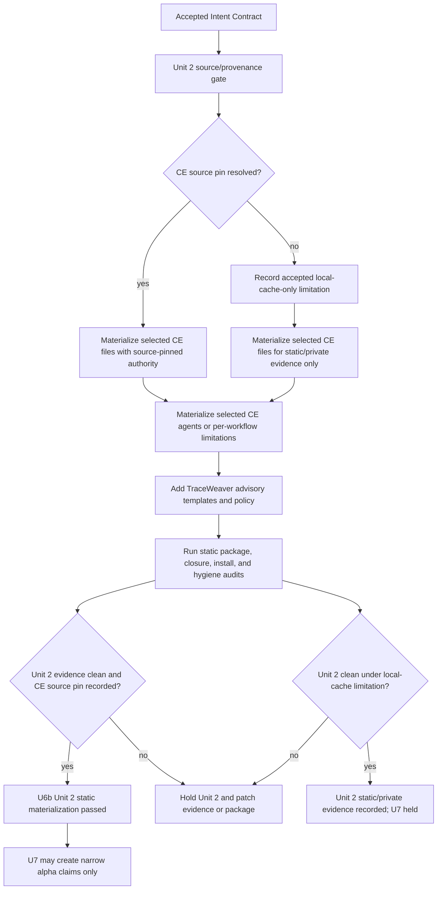

# U6b Unit 2 CE-Compatible TraceWeaver Materialization

## Problem Frame

U6b-alpha proved the small TraceWeaver plugin can install selected
authority-control skills. Unit 2 must now materialize the next static runtime
surface: a CE-compatible TraceWeaver plugin package that preserves selected CE
workflow skill names, carries TraceWeaver authority templates, records source
provenance, and keeps all unproven runtime claims held.

The authority baseline for this plan is `.traceweaver/intent-contract.yml`,
which cites `requirements.md` at
`REQ-BASELINE-2026-04-30-001`. The plan must preserve the core rule:

```text
No agent may implement, review, or modify meaningful behavior unless it can
cite stakeholder intent, approved authority, verification method, validation
question, and current baseline version.
```

This is not U7. U7 starts only after Unit 2 static materialization is executed,
evidenced, and reviewed.

## Requirements Trace

| Requirement | Planning implication |
| --- | --- |
| `REQ-TW-001` - `REQ-TW-004` | Materialize Intent Contract and task-capsule templates so agents work from controlled authority. |
| `REQ-TW-011` - `REQ-TW-012` | Keep runtime scope staged; Unit 2 may add only selected authority foundation and selected CE-compatible surfaces. |
| `REQ-TW-013` - `REQ-TW-014` | Preserve selected CE workflow names without redefining Core TraceWeaver rules or claiming clean replacement. |
| `REQ-TW-015` - `REQ-TW-016` | Public docs and install evidence must match the installed skill-only surface and use `--include-skills`. |
| `REQ-TW-017`, `REQ-TW-029` | Resolve CE upstream source pin before vendoring, or record an accepted local-cache-only limitation that keeps CE release claims held. |
| `REQ-TW-018` | Prove selected CE support-file closure for `references/`, `scripts/`, and `assets/`. |
| `REQ-TW-019` - `REQ-TW-020` | Keep U6b Unit 2 static; runtime invocation, dynamic discovery, release-ready, slash-command, and clean-replacement claims stay held. |
| `REQ-TW-021` | Run hygiene checks against plugin files and evidence. |
| `REQ-TW-023` | End task/evidence updates with next recommended steps. |
| `REQ-TW-027` - `REQ-TW-028` | Define static advisory policy and either materialize selected CE agents or record per-workflow limitations. |
| `REQ-TW-030` - `REQ-TW-032` | Keep alpha advisory by default and support a low-friction drift-check surface. |

## Intent Capsule

```yaml
task_id: U6B-UNIT2-MATERIALIZATION
baseline_id: REQ-BASELINE-2026-04-30-001
baseline_hash_sha256: 99d500e510048786fa3ac5eadf61caffd44ffb520bf61daf2a29688472033211
authorized_by:
  - REQ-TW-001
  - REQ-TW-011
  - REQ-TW-013
  - REQ-TW-017
  - REQ-TW-018
  - REQ-TW-027
  - REQ-TW-028
  - REQ-TW-031
intent_served:
  - INTENT-TW-001
  - INTENT-TW-003
  - INTENT-TW-004
  - INTENT-TW-005
verification_required:
  - package file-list audit
  - manifest parse
  - source provenance or accepted limitation review
  - CE support-file closure audit
  - isolated install smoke with --include-skills
  - hygiene scan
validation_question: Can TraceWeaver preserve CE workflow continuity as an advisory, static alpha package without overclaiming runtime replacement?
must_not_change:
  - Do not make enforcing mode the alpha default.
  - Do not advertise slash commands unless prompt/command files are installed and proven.
  - Do not copy CE files outside the selected inventory without a validation delta.
  - Do not claim clean CE replacement before U9 runtime proof.
open_assumptions: []
next_step: /ce:work this plan, then /ce-doc-review the updated U6b Unit 2 evidence.
```

## Scope Boundaries

- Do not expand the default TraceWeaver runtime to the full Core 11 suite.
- Do not rewrite selected CE skill semantics during materialization.
- Do not invent CE workflow files outside the CE runtime inventory.
- Do not treat local cache provenance as public release authority unless a
  complete accepted limitation records its claim boundary.
- Do not remove the existing CE plugin from user environments during Unit 2.
- Do not claim dynamic no-forced discovery, real runtime invocation, slash
  commands, agent-backed behavior, or clean CE replacement from static evidence.

## Output Structure

Expected package shape after Unit 2:

```text
plugins/traceweaver-core/
  .codex-plugin/plugin.json
  .claude-plugin/plugin.json
  .cursor-plugin/plugin.json
  AGENTS.md
  README.md
  agents/
    ce-*.agent.md
  references/
    authority-baseline-template.yml
    ce-upstream-source-inventory.md
    change-template.yml
    exception-template.yml
    gap-template.yml
    intent-contract-template.yml
    task-capsule-template.yml
    trace-record-template.yml
    traceweaver-runtime-policy.md
  skills/
    ce-brainstorm/
    ce-plan/
    ce-work/
    ce-code-review/
    ce-doc-review/
    ce-compound/
    ce-resolve-pr-feedback/
    ce-commit/
    ce-commit-push-pr/
    ce-compound-refresh/
    ce-sessions/
    ce-session-inventory/
    ce-session-extract/
    ce-test-browser/
    ce-test-xcode/
    ce-worktree/
    ce-setup/
    ce-debug/
    lfg/
    requirements-reviewer/
    systems-engineering-traceability/
    tw-authority-gate/
    tw-requirements-review/
    tw-traceability-check/
```

Evidence and helper outputs:

```text
docs/validation/traceweaver-core-11-u6b-plugin-runtime.md
docs/validation/traceweaver-core-11-ce-runtime-inventory.md
docs/validation/traceweaver-core-11-promotion-records.md
scripts/traceweaver-audit-ce-closure
scripts/traceweaver-audit-plugin-scope
```

## High-Level Technical Design

> *This illustrates the intended approach and is directional guidance for
> review, not implementation specification. The implementing agent should treat
> it as context, not code to reproduce.*



## Implementation Units

- [x] **Unit 1: Resolve CE Provenance Gate**

**Goal:** Establish the source authority for selected CE materialization before
copying CE runtime files.

**Requirements:** `REQ-TW-017`, `REQ-TW-021`, `REQ-TW-029`

**Dependencies:** Accepted `.traceweaver/intent-contract.yml`.

**Files:**
- Modify: `docs/validation/traceweaver-core-11-ce-runtime-inventory.md`
- Create: `plugins/traceweaver-core/references/ce-upstream-source-inventory.md`
- Modify: `docs/validation/traceweaver-core-11-u6b-plugin-runtime.md`

**Approach:**
- Preferred path: resolve the CE `3.3.2` source package to an upstream
  commit/tag and record source repository, observed version, license, capture
  date, aggregate fingerprint, and selected-file hashes.
- Fallback path: if the upstream pin cannot be resolved during Unit 2, create
  an accepted `local-cache-only-materialization` limitation with all fields
  required by `REQ-TW-029`.
- Make the fallback claim boundary explicit: local-cache materialization may
  support private static alpha testing, but CE vendoring/release and U7
  eligibility remain held until source pin or accepted release-quality
  provenance exists.
- Do not copy CE files before this unit records one of those two paths.

**Patterns to follow:**
- `docs/validation/traceweaver-core-11-ce-runtime-inventory.md`
- `.traceweaver/intent-contract.yml` held claim `EXC-TW-006`

**Test scenarios:**
- Happy path: upstream commit/tag is recorded, selected inventory remains
  unchanged, and source map points back to the validation record.
- Fallback path: limitation includes linked requirements, approver/decision
  source, observed version, install path class, capture date, hashes, copied
  file classes, public-claim restrictions, U7 effect, stale-reset trigger, close
  condition, and unproven scope.
- Error path: if neither upstream pin nor accepted limitation exists, Unit 2
  must remain blocked.

**Verification:**
- Reviewers can identify the CE source authority or accepted limitation before
  any CE files are treated as materialization authority.

- [x] **Unit 2: Materialize Selected CE Workflow Skills**

**Goal:** Copy only selected CE workflow skill directories and support files
from the inventory into `plugins/traceweaver-core/skills/`.

**Requirements:** `REQ-TW-011`, `REQ-TW-013`, `REQ-TW-014`, `REQ-TW-018`,
`REQ-TW-021`

**Dependencies:** Unit 1.

**Files:**
- Modify: `plugins/traceweaver-core/skills/`
- Create: `scripts/traceweaver-audit-plugin-scope`
- Modify: `docs/validation/traceweaver-core-11-u6b-plugin-runtime.md`

**Approach:**
- Use `docs/validation/traceweaver-core-11-ce-runtime-inventory.md` as the
  selected-file authority.
- Preserve original selected CE skill directory names such as `ce-brainstorm`,
  `ce-plan`, `ce-work`, `ce-code-review`, `ce-doc-review`, `ce-compound`, and
  other selected continuity skills.
- Keep existing TraceWeaver selected skills alongside CE skills.
- Add a scope audit that compares packaged CE files against selected inventory
  rows and flags any missing selected file or unselected CE file.
- Any CE file not present in the inventory requires a validation delta before
  Unit 2 can pass.

**Patterns to follow:**
- Current `plugins/traceweaver-core/skills/tw-*` adapter layout.
- CE selected skill rows in `docs/validation/traceweaver-core-11-ce-runtime-inventory.md`.

**Test scenarios:**
- Happy path: every selected CE skill/support file exists in the plugin package
  and maps to an inventory hash.
- Edge case: duplicate support files shared by CE skills remain byte-identical
  or are recorded once with clear path ownership.
- Error path: a packaged CE file outside the selected inventory fails the scope
  audit.

**Verification:**
- Static package audit reports selected CE files present, non-selected CE files
  absent, and hashes aligned or explicitly delta-recorded.

- [x] **Unit 3: Prove CE Support-File Closure**

**Goal:** Ensure selected CE skills do not install with dangling referenced
support files.

**Requirements:** `REQ-TW-018`, `REQ-TW-021`

**Dependencies:** Unit 2.

**Files:**
- Create: `scripts/traceweaver-audit-ce-closure`
- Modify: `docs/validation/traceweaver-core-11-u6b-plugin-runtime.md`

**Approach:**
- Add a static closure audit that scans selected CE `SKILL.md` files for
  relative references to `references/`, `scripts/`, and `assets/`.
- Confirm each referenced support path exists in the plugin package.
- Confirm each referenced support path has an inventory row or approved delta.
- Confirm each support path is present after isolated install when copied as
  part of a skill directory.

**Patterns to follow:**
- The prior U6b install evidence pattern that records installed selected paths.

**Test scenarios:**
- Happy path: all extracted CE support references resolve in package and
  installed tree.
- Edge case: a `SKILL.md` mentions a support directory generically; the audit
  should require explicit known files or record the limitation.
- Error path: a referenced support file is missing or lacks a hash row; Unit 2
  remains held.

**Verification:**
- Closure audit output is copied or summarized into U6b Unit 2 evidence with
  pass/fail result and stale-reset rule.

- [x] **Unit 4: Materialize CE Agents Or Record Per-Workflow Limitations**

**Goal:** Preserve CE agent continuity claims honestly by packaging selected
agents or classifying degraded behavior.

**Requirements:** `REQ-TW-014`, `REQ-TW-028`

**Dependencies:** Unit 1.

**Files:**
- Create/modify: `plugins/traceweaver-core/agents/`
- Modify: `plugins/traceweaver-core/.codex-plugin/plugin.json`
- Modify: `plugins/traceweaver-core/.claude-plugin/plugin.json`
- Modify: `plugins/traceweaver-core/.cursor-plugin/plugin.json`
- Modify: `docs/validation/traceweaver-core-11-u6b-plugin-runtime.md`

**Approach:**
- Package selected CE agent files from the CE runtime inventory if the plugin
  shape supports agent files.
- Record whether each target installer/runtime includes agents in the installed
  manifest or copied file tree.
- If agents are package-present but not installed/loaded by Codex, classify
  affected CE surfaces as `static_wrapper_available` or
  `agent_backed_unavailable`; do not claim runtime equivalence.
- For `ce-code-review`, `ce-doc-review`, `ce-compound`,
  `ce-resolve-pr-feedback`, `ce-plan`, and `ce-work`, record one of:
  `name_preserved_only`, `static_wrapper_available`,
  `agent_backed_unavailable`, or `runtime_equivalent_proven`.

**Patterns to follow:**
- Agent-dependent workflow map in
  `docs/validation/traceweaver-core-11-ce-runtime-inventory.md`.

**Test scenarios:**
- Happy path: selected agent files are package-present and listed in evidence.
- Edge case: installer records `agents: []`; evidence keeps agent-backed
  behavior held despite package-present files.
- Error path: README or evidence claims CE review equivalence without agent
  install/load proof.

**Verification:**
- Every affected CE workflow has an explicit claim class and no clean
  replacement claim is made.

- [x] **Unit 5: Add TraceWeaver Advisory Templates And Policy**

**Goal:** Package the file-based authority templates and advisory policy needed
for fast drift checks and future wrapper work.

**Requirements:** `REQ-TW-001` - `REQ-TW-004`, `REQ-TW-023`,
`REQ-TW-025`, `REQ-TW-027`, `REQ-TW-030` - `REQ-TW-032`

**Dependencies:** None, but should use the accepted Intent Contract as source.

**Files:**
- Create: `plugins/traceweaver-core/references/intent-contract-template.yml`
- Create: `plugins/traceweaver-core/references/authority-baseline-template.yml`
- Create: `plugins/traceweaver-core/references/task-capsule-template.yml`
- Create: `plugins/traceweaver-core/references/trace-record-template.yml`
- Create: `plugins/traceweaver-core/references/gap-template.yml`
- Create: `plugins/traceweaver-core/references/change-template.yml`
- Create: `plugins/traceweaver-core/references/exception-template.yml`
- Create: `plugins/traceweaver-core/references/traceweaver-runtime-policy.md`
- Modify: `plugins/traceweaver-core/AGENTS.md`
- Modify: `plugins/traceweaver-core/README.md`

**Approach:**
- Use `.traceweaver/intent-contract.yml` as the source shape, but convert
  project-specific values into placeholders for package templates.
- Materialize concrete gap, change, and exception templates as separate
  install-audited files. Policy docs may explain them, but Unit 2 does not pass
  unless those three template files exist and are listed in evidence.
- Document `traceweaver_mode: advisory` as the alpha default with valid values
  `off`, `advisory`, and `enforcing`.
- State that advisory mode records warnings, gaps, exceptions, and held claims;
  it does not silently rewrite CE behavior or prove enforcement.
- Include the next-step handoff rule in the package guidance.

**Patterns to follow:**
- `.traceweaver/intent-contract.yml`
- `requirements.md` Alpha Intent Contract Schema
- Root `AGENTS.md` TraceWeaver workflow guidance

**Test scenarios:**
- Happy path: a consuming repo can create `.traceweaver/intent-contract.yml`,
  a minimal task capsule, a trace record, and gap/change/exception records from
  templates without inventing required fields.
- Edge case: no approved requirement exists; template routes to gap/change/
  clarification rather than implementation.
- Error path: template implies enforcing behavior or clean replacement from
  static install evidence.

**Verification:**
- Template review and install evidence confirm baseline ID/hash,
  `authorized_by`, `intent_served`, verification, validation, assumptions,
  gaps, changes, exceptions, and next-step fields are present in concrete
  template files.

- [x] **Unit 6: Update Manifests, README, And Static Claims**

**Goal:** Align public package metadata and docs with the expanded static
surface without advertising uninstalled slash commands or unproven runtime
behavior.

**Requirements:** `REQ-TW-015`, `REQ-TW-016`, `REQ-TW-019`, `REQ-TW-020`,
`REQ-TW-021`, `REQ-TW-027`, `REQ-TW-030`

**Dependencies:** Units 2, 4, and 5.

**Files:**
- Modify: `plugins/traceweaver-core/.codex-plugin/plugin.json`
- Modify: `plugins/traceweaver-core/.claude-plugin/plugin.json`
- Modify: `plugins/traceweaver-core/.cursor-plugin/plugin.json`
- Modify: `plugins/traceweaver-core/README.md`
- Modify: `plugins/traceweaver-core/AGENTS.md`

**Approach:**
- Keep install docs on the exact command that materializes skills:
  `bun run src/index.ts install ./plugins/traceweaver-core --to codex --include-skills`.
- Keep public language at `alpha/advisory/static install`.
- Do not advertise slash commands unless prompt/command files are added and
  proven in install evidence.
- Document selected CE workflow skill names as static/package-present only
  until runtime proof proves otherwise.
- Reflect whether agents are package-present, installed, or held.

**Patterns to follow:**
- `docs/solutions/documentation-gaps/traceweaver-plugin-alpha-install-command-skills-2026-04-30.md`
- Current `plugins/traceweaver-core/README.md`

**Test scenarios:**
- Happy path: README command installs selected skills in isolated smoke.
- Error path: docs say slash commands are available while installed manifest
  still records `prompts: []`.
- Error path: docs claim clean CE replacement before U9 runtime proof.

**Verification:**
- Manifest parse passes and docs match installed manifest, installed paths, and
  held claims.

- [x] **Unit 7: Refresh U6b Unit 2 Evidence And Promotion State**

**Goal:** Record enough static evidence for reviewers to decide whether Unit 2
passed and whether U7 may start for narrow claims.

**Requirements:** `REQ-TW-016` - `REQ-TW-021`, `REQ-TW-023`, `REQ-TW-027` -
`REQ-TW-032`

**Dependencies:** Units 1 through 6.

**Files:**
- Modify: `docs/validation/traceweaver-core-11-u6b-plugin-runtime.md`
- Modify: `docs/validation/traceweaver-core-11-promotion-records.md`
- Modify: `docs/validation/traceweaver-core-11-ce-runtime-inventory.md`

**Approach:**
- Add a U6b Unit 2 section with materialized file list, selected CE files,
  selected agents or limitations, template list, manifest parse result,
  isolated install tree, support closure result, source provenance state,
  hygiene scan result, stale-reset rules, and held claims.
- Set `U6b_unit_2_ce_compatible_static_materialization` only if static package,
  install, source, closure, and hygiene evidence all pass.
- Set `U7_eligible_for_narrow_alpha_claims: true` only if CE source pin is
  recorded. If Unit 2 proceeds under a local-cache-only limitation, set U7 to
  `HELD_BY_LOCAL_CACHE_ONLY_LIMITATION` unless a later accepted baseline change
  explicitly changes that rule.
- Preserve held states for dynamic discovery, runtime invocation, slash
  commands, clean CE replacement, full Core 11 runtime, enforcing mode, R31,
  release-ready, and upstream-ready claims.

**Patterns to follow:**
- Existing U6b-alpha evidence checklist in
  `docs/validation/traceweaver-core-11-u6b-plugin-runtime.md`.
- Root `requirements.md` open-gap acceptance decisions.

**Test scenarios:**
- Happy path: all Unit 2 evidence checks pass and U7 is eligible only for
  narrow alpha/static/advisory claims.
- Edge case: CE files are materialized from local cache under accepted
  limitation; U7 eligibility remains held or narrowly bounded as recorded.
- Error path: evidence says Unit 2 passed while closure audit, source pin, or
  agent continuity is unresolved.

**Verification:**
- `/ce-doc-review` can review the updated U6b evidence without reopening known
  source pin, closure, agent continuity, install-command, or overclaim blockers.

## System-Wide Impact

- **Interaction graph:** Unit 2 expands the plugin package surface from
  TraceWeaver-only skills to selected CE-compatible skills, optional CE agents,
  and TraceWeaver authority templates.
- **Error propagation:** Static audits should fail closed into held claims or
  open gaps; they must not silently pass partial materialization.
- **State lifecycle risks:** Source pin, selected file hashes, installed paths,
  and hygiene deltas become stale-reset inputs for later U7/U9 records.
- **API surface parity:** CE skill names may become package-present, but runtime
  equivalence remains held until U9 proves invocation, agent behavior, and
  workflow continuity.
- **Integration coverage:** Isolated install smoke proves files materialize;
  runtime invocation proof remains later U6b-dynamic/U9 work.
- **Unchanged invariants:** TraceWeaver remains advisory by default; selected
  Core skills remain upstream-neutral; non-selected Core 11 skills stay held.

## Risks & Dependencies

| Risk | Mitigation |
| --- | --- |
| CE source pin cannot be resolved quickly. | Record a complete local-cache-only limitation and keep CE vendoring/release/U7 claims held as required by `REQ-TW-029`. |
| CE skill copies miss support files. | Run transitive closure audit before marking Unit 2 passed. |
| Agent-backed workflows appear available but agents do not install/load. | Package agents if possible and classify every affected workflow claim separately. |
| README overclaims slash commands or clean replacement. | Keep docs tied to installed manifest and held-claim table. |
| Unit 2 expands into full TraceWeaver Core or full CE plugin scope. | Scope audit compares package files to selected inventory and accepted baseline. |
| Hygiene redactions drift or private provenance leaks. | Run hygiene scan and reset U6b evidence to held on leakage. |

## Documentation / Operational Notes

- U6b Unit 2 is a static package/materialization unit. Runtime invocation,
  no-forced discovery, warning behavior, failure routing, clean CE replacement,
  and enforcing mode remain later U6b-dynamic/U9 evidence.
- Keep the user's existing CE plugin installed during Unit 2. This plan
  prepares the TraceWeaver package for a future clean swap; it does not perform
  the swap.
- Every Unit 2 evidence update must end with suggested next steps per
  `REQ-TW-023`.

## Sources & References

- **Authority contract:** `.traceweaver/intent-contract.yml`
- **Master baseline:** `requirements.md`
- **Existing swap plan:** `docs/plans/2026-04-30-001-feat-traceweaver-clean-ce-plugin-swap-plan.md`
- **U6b evidence:** `docs/validation/traceweaver-core-11-u6b-plugin-runtime.md`
- **CE runtime inventory:** `docs/validation/traceweaver-core-11-ce-runtime-inventory.md`
- **Install-command learning:** `docs/solutions/documentation-gaps/traceweaver-plugin-alpha-install-command-skills-2026-04-30.md`

## Suggested Next Steps

1. Run `/ce-doc-review docs/plans/2026-05-01-001-feat-u6b-unit2-materialization-plan.md`.
2. If clean, run `/ce:work docs/plans/2026-05-01-001-feat-u6b-unit2-materialization-plan.md`.
3. After execution, run `/ce-doc-review docs/validation/traceweaver-core-11-u6b-plugin-runtime.md` before starting U7.
