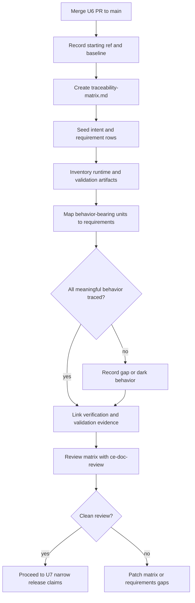

# TraceWeaver Project Traceability Matrix Adoption

## Overview

Create the first filled TraceWeaver project traceability matrix after the
current U6 branch merges to `main`. The matrix becomes the working audit surface
that connects stakeholder intent, approved requirements, runtime artifacts,
behavior-bearing units, verification evidence, validation questions, gaps, dark
behavior, and next-step gates.

This plan does not expand plugin runtime scope or create U7 release claims. It
prepares the evidence surface U7 should use.

## Problem Frame

TraceWeaver now has an accepted master requirements baseline and an active
Intent Contract, but it does not yet have a filled project traceability matrix.
That is the same drift problem TraceWeaver is meant to solve: the repo contains
requirements, plugin files, workflow skills, templates, and validation records,
but reviewers still need to manually reconstruct which artifact satisfies which
requirement and what evidence proves it.

The immediate goal is to make TraceWeaver self-host its authority model:

```text
stakeholder intent
-> approved requirement or exception
-> artifact / behavior-bearing unit
-> verification evidence
-> validation question
-> gap, exception, held claim, or next step
```

## Requirements Trace

| Requirement | Planning implication |
| --- | --- |
| `REQ-TW-001` | The matrix must cite the accepted Intent Contract and baseline. |
| `REQ-TW-002` | Behavior-bearing artifacts must cite approved authority or be marked as gaps/dark behavior. |
| `REQ-TW-005` | The matrix must preserve the full chain from intent through verification, validation, and change control. |
| `REQ-TW-006` | Untraced meaningful behavior must be classified as dark behavior. |
| `REQ-TW-007` | Verification evidence and validation evidence must be separated. |
| `REQ-TW-008` | The Markdown matrix is the authoritative audit record; diagrams are derived only. |
| `REQ-TW-011` | Matrix scope must reflect the staged U6b Unit 2 alpha runtime, not the full Core 11 suite. |
| `REQ-TW-014` | CE-compatible workflow surfaces must be traceable without claiming clean CE replacement. |
| `REQ-TW-019` | Static install/materialization evidence must remain separate from dynamic runtime proof. |
| `REQ-TW-020` | U7 claims must stay narrow and evidence-backed. |
| `REQ-TW-021` | Public hygiene evidence must remain linked to package artifacts. |
| `REQ-TW-023` | The resulting task summary and matrix handoff must name next recommended steps. |
| `REQ-TW-024` | Meaningful behavior classification must be conservative. |
| `REQ-TW-025` | Low-risk documentation/config rows may use minimal trace rows, but still need authority or gap disposition. |
| `REQ-TW-027` | Advisory policy must not be mistaken for proven runtime behavior. |
| `REQ-TW-028` | CE agent continuity claims must map to package/install evidence or held boundaries. |

## Scope Boundaries

- Do not start U7 release-claim records until this matrix exists and has been
  reviewed.
- Do not claim runtime invocation, dynamic no-forced discovery, enforcing mode,
  slash commands, full Core 11 runtime, or clean CE replacement.
- Do not require every tiny helper or line of text to have a separate trace row.
  Trace every meaningful behavior-bearing unit; small helpers may inherit the
  trace of their owning unit unless they add behavior, risk, authority, or
  testable logic.
- Do not make the matrix a generated-only artifact. Generated inventories may
  assist, but `traceability-matrix.md` is the controlled audit
  record.
- Do not merge unresolved dark behavior into U7 claims. Classify it as gap,
  exception candidate, held claim, or removal candidate first.

### Deferred To Separate Tasks

- U7 release-claim records: separate post-matrix plan or work item.
- U9 runtime testing: dynamic invocation, no-forced discovery, runtime routing,
  CE replacement behavior, and enforcing-mode proof.
- Automated trace extraction tooling: useful later, but not required for the
  first authoritative matrix.

## Context & Research

### Relevant Code And Patterns

- `requirements.md` is the accepted controlled baseline at
  `REQ-BASELINE-2026-04-30-001`.
- `.traceweaver/intent-contract.yml` is the active advisory authority contract.
- `plugins/traceweaver-core/references/traceability-matrix-template.md` provides
  the matrix structure and status model.
- `plugins/traceweaver-core/references/trace-record-template.yml` and
  `plugins/traceweaver-core/references/task-capsule-template.yml` provide the
  task and evidence record pattern.
- `docs/validation/traceweaver-core-11-u6b-plugin-runtime.md` is the main U6b
  static materialization evidence record.
- `plugins/traceweaver-core/skills/` currently contains selected TraceWeaver
  skills, adapter skills, selected CE-compatible workflow skills, and
  `using-agent-skills`.
- `plugins/traceweaver-core/agents/` currently contains selected CE agent source
  files materialized for static install evidence.

### Institutional Learnings

- The project memory records that TraceWeaver tasks should always end with a
  next-step handoff naming the next CE command, TraceWeaver gate, evidence
  record, or held condition.
- Prior review findings repeatedly came from stale wording and unsynchronized
  evidence records. The matrix must include stale-reset and review-status fields
  so future agents know which records still control.

### External References

No external research is needed for this plan. The work is governed by the
accepted TraceWeaver baseline, local Intent Contract, and local U6 validation
records.

## Key Technical Decisions

- Store the first project matrix at `traceability-matrix.md`.
  Rationale: TraceWeaver project-specific authority records already live under
  `.traceweaver/`, and the matrix should sit next to the Intent Contract rather
  than inside plugin package templates.
- Use `plugins/traceweaver-core/references/traceability-matrix-template.md` as
  the source template, then adapt IDs to TraceWeaver's accepted `INTENT-TW-*`
  and `REQ-TW-*` baseline.
- Treat skill directories, plugin manifests, template files, validation records,
  scripts, and public docs as meaningful when they affect instructions,
  workflow routing, installed artifacts, claims, provenance, or authority.
- Use status values that distinguish `Implemented`, `Verified`, `Validated`,
  `Gap`, `Deferred`, and `Held Claim`. U6 static evidence can verify
  materialization, but it cannot validate runtime behavior.
- Seed rows at the artifact and behavior-bearing-unit level first. Add
  function/method/class-level rows only where scripts or implementation code
  contain distinct behavior that needs separate verification.

## Open Questions

### Resolved During Planning

- Should every code block have a separate matrix row? No. Trace meaningful
  behavior-bearing units. Small code blocks and helper functions inherit the
  owning unit's trace unless they introduce independent behavior, risk, or
  authority.
- Should the matrix wait until U9? No. U9 proves runtime behavior, but the
  matrix should exist before U7 so release claims have a controlled evidence
  surface.
- Should this plan merge the U6 PR? No. It records merge as a prerequisite. The
  matrix should be created from `main` after the U6 branch lands.

### Deferred To Implementation

- Exact merge commit SHA for the matrix baseline: record after the PR merges.
- Exact inventory row count: compute from the merged `main` tree during Unit 2.
- Exact dark-behavior candidates: identify during artifact inventory and matrix
  seeding.

## Output Structure

```text
.traceweaver/
  intent-contract.yml
  traceability-matrix.md
  trace-records/
    TRACEWEAVER-MATRIX-SEED-2026-05-01.yml
  gaps/
    GAP-TW-*.yml
```

The `trace-records/` and `gaps/` files should be created only when the matrix
seeding pass finds concrete evidence records or unresolved gaps that need
separate lifecycle tracking. Otherwise the matrix may initially carry the gap
table inline.

## High-Level Technical Design

> *This illustrates the intended approach and is directional guidance for
> review, not implementation specification. The implementing agent should treat
> it as context, not code to reproduce.*



## Implementation Units

- [ ] **Unit 1: Merge U6 Baseline And Record Starting Ref**

**Goal:** Ensure the traceability matrix is created from the clean merged U6
state, not from a moving PR branch.

**Requirements:** `REQ-TW-001`, `REQ-TW-008`, `REQ-TW-019`, `REQ-TW-020`

**Dependencies:** Current U6 PR is approved and ready to merge.

**Files:**
- Reference: `traceability-matrix.md`
- Reference: `requirements.md`
- Reference: `.traceweaver/intent-contract.yml`

**Approach:**
- Merge the current U6 PR to `main` outside this plan's execution.
- Start matrix work from updated `main`.
- Record the merge commit or starting ref in the matrix System Context.
- If the matrix does not exist yet, carry the starting ref into Unit 2 and
  record it when the skeleton is created.
- Keep the accepted `baseline_id` and `baseline_hash_sha256` unchanged unless a
  separate requirements-baseline change is reviewed and accepted.

**Patterns to follow:**
- `requirements.md`
- `.traceweaver/intent-contract.yml`

**Test scenarios:**
- Inspection: matrix System Context names the starting ref, accepted baseline
  ID, accepted baseline hash, owner, mode, and status.
- Regression: no matrix row cites unmerged PR-only evidence after the branch is
  rebased onto `main`.

**Verification:**
- Reviewer can identify exactly which repository state the first matrix audits.

- [ ] **Unit 2: Create The Project Matrix Skeleton**

**Goal:** Create `traceability-matrix.md` from the TraceWeaver
template with project-specific fields and status vocabulary.

**Requirements:** `REQ-TW-005`, `REQ-TW-007`, `REQ-TW-008`, `REQ-TW-023`

**Dependencies:** Unit 1.

**Files:**
- Create: `traceability-matrix.md`
- Reference: `plugins/traceweaver-core/references/traceability-matrix-template.md`
- Reference: `plugins/traceweaver-core/references/trace-record-template.yml`

**Approach:**
- Copy the template structure conceptually, then adapt IDs to
  `INTENT-TW-*`, `REQ-TW-*`, `TRACE-TW-*`, `VER-TW-*`, `VAL-TW-*`,
  `GAP-TW-*`, and `TD-TW-*`.
- Include explicit sections for:
  - System Context
  - Stakeholder Intent
  - Requirements
  - Runtime Artifact Inventory
  - Traceability Matrix
  - Verification Evidence
  - Validation Evidence
  - Traceability Debt
  - Approved Traceability Gaps
  - Dark Behavior Candidates
  - Human Decisions Required
  - Stale Reset Rule
  - Suggested Next Steps
- State that diagrams are derived from the matrix and do not control when they
  disagree.

**Patterns to follow:**
- `plugins/traceweaver-core/references/traceability-matrix-template.md`
- `requirements.md` status language

**Test scenarios:**
- Happy path: matrix contains all required template sections needed for audit.
- Edge case: status values distinguish static verification from runtime
  validation and held claims.
- Integration: the Suggested Next Steps section names the next CE/TW command or
  evidence gate.

**Verification:**
- `/ce-doc-review traceability-matrix.md` can review the artifact
  without needing external context.

- [ ] **Unit 3: Seed Intent And Requirement Authority Rows**

**Goal:** Populate the matrix with the accepted stakeholder intents,
requirements, held requirements, exceptions, and baseline source evidence.

**Requirements:** `REQ-TW-001`, `REQ-TW-002`, `REQ-TW-005`, `REQ-TW-025`

**Dependencies:** Unit 2.

**Files:**
- Modify: `traceability-matrix.md`
- Reference: `requirements.md`
- Reference: `.traceweaver/intent-contract.yml`

**Approach:**
- Import all `INTENT-TW-*` summaries and validation questions from the accepted
  baseline.
- Import all approved requirements that govern the current U6/U7 path.
- Include held requirements such as R31/release-ready/runtime validation with
  status `Held` or `Deferred`, not `Approved for U7`.
- Include approved exceptions and limitations that affect authority, especially
  advisory mode, dynamic discovery, local-cache/source-pin boundaries, and held
  clean-replacement claims.
- Add a trace-debt row if any requirement in `requirements.md` is not represented
  in the matrix.

**Patterns to follow:**
- `.traceweaver/intent-contract.yml` approved requirements
- `requirements.md` open-gap acceptance decisions

**Test scenarios:**
- Happy path: each approved `REQ-TW-*` used by U6/U7 appears in the matrix.
- Edge case: held requirements appear as held/deferred, not as approved release
  evidence.
- Error path: any missing baseline requirement creates `TD-TW-*` rather than
  disappearing silently.

**Verification:**
- Requirements-to-matrix coverage can be checked by comparing `REQ-TW-*` IDs in
  `requirements.md` with IDs in `traceability-matrix.md`.

- [ ] **Unit 4: Inventory Runtime And Evidence Artifacts**

**Goal:** Record the actual repo artifacts that currently carry TraceWeaver
behavior, claims, tests, install evidence, and templates.

**Requirements:** `REQ-TW-011`, `REQ-TW-014`, `REQ-TW-019`, `REQ-TW-021`,
`REQ-TW-027`, `REQ-TW-028`

**Dependencies:** Unit 3.

**Files:**
- Modify: `traceability-matrix.md`
- Reference: `plugins/traceweaver-core/.codex-plugin/plugin.json`
- Reference: `plugins/traceweaver-core/.claude-plugin/plugin.json`
- Reference: `plugins/traceweaver-core/.cursor-plugin/plugin.json`
- Reference: `plugins/traceweaver-core/README.md`
- Reference: `plugins/traceweaver-core/AGENTS.md`
- Reference: `plugins/traceweaver-core/skills/`
- Reference: `plugins/traceweaver-core/agents/`
- Reference: `plugins/traceweaver-core/references/`
- Reference: `docs/validation/traceweaver-core-11-u6b-plugin-runtime.md`
- Reference: `docs/validation/traceweaver-core-11-ce-runtime-inventory.md`

**Approach:**
- Add artifact rows for plugin manifests, plugin README, plugin AGENTS,
  `tw-*` adapter skills, selected Core skills, selected CE-compatible skills,
  selected CE agents, templates, validation records, and audit scripts.
- For each row, classify the claim:
  - `static_package_materialized`
  - `install_smoke_verified`
  - `advisory_policy_documented`
  - `runtime_behavior_held`
  - `clean_replacement_held`
- Keep CE-compatible skill rows separate from TraceWeaver Core skill rows so the
  matrix does not imply the CE adapter redefines Core authority.

**Patterns to follow:**
- `docs/validation/traceweaver-core-11-u6b-plugin-runtime.md`
- `docs/validation/traceweaver-core-11-ce-runtime-inventory.md`

**Test scenarios:**
- Happy path: all currently selected plugin surfaces appear with an authority
  requirement and evidence status.
- Edge case: CE agent rows record static install identity only, with runtime
  behavior held.
- Error path: any selected artifact with no requirement link becomes dark
  behavior or traceability debt.

**Verification:**
- Running a file inventory against `plugins/traceweaver-core/` should not expose
  package artifacts that are absent from the matrix or a debt/gap table.

- [ ] **Unit 5: Map Behavior-Bearing Units To Authority And Tests**

**Goal:** Connect each meaningful behavior-bearing unit to the requirement,
verification method, validation question, and evidence that governs it.

**Requirements:** `REQ-TW-002`, `REQ-TW-006`, `REQ-TW-007`, `REQ-TW-024`

**Dependencies:** Unit 4.

**Files:**
- Modify: `traceability-matrix.md`
- Reference: `plugins/traceweaver-core/skills/tw-requirements-review/SKILL.md`
- Reference: `plugins/traceweaver-core/skills/tw-authority-gate/SKILL.md`
- Reference: `plugins/traceweaver-core/skills/tw-traceability-check/SKILL.md`
- Reference: `plugins/traceweaver-core/skills/requirements-reviewer/SKILL.md`
- Reference: `plugins/traceweaver-core/skills/systems-engineering-traceability/SKILL.md`
- Reference: `scripts/traceweaver-audit-ce-closure`
- Reference: `scripts/traceweaver-audit-plugin-scope`

**Approach:**
- Start at skill/workflow/module level:
  - Core skills: requirements quality and traceability rules.
  - Adapter skills: requirements review, authority gate, traceability check.
  - CE-compatible skills: static continuity surface.
  - Scripts: package-scope audit and CE support-closure audit.
- Add lower-level function or method rows only when a script or implementation
  file has independently testable behavior.
- Link verification evidence:
  - install smoke
  - manifest parse
  - support-closure audit
  - package-scope audit
  - hygiene scan
  - document review
- Link validation questions from `requirements.md` or the Intent Contract.

**Patterns to follow:**
- `plugins/traceweaver-core/references/trace-record-template.yml`
- `.traceweaver/intent-contract.yml` meaningful behavior threshold

**Test scenarios:**
- Happy path: each `tw-*` adapter row names the Core skill it routes to and the
  requirement authorizing the route.
- Edge case: CE-compatible skill rows do not claim runtime equivalence.
- Error path: a script with behavior but no verification evidence is marked
  `Gap` or `Dark Behavior Candidate`.

**Verification:**
- Reviewer can choose any meaningful plugin artifact and find its requirement,
  verification method, validation question, and held claim boundary.

- [ ] **Unit 6: Record Gaps, Dark Behavior, And Evidence Boundaries**

**Goal:** Prevent the matrix from becoming a false approval surface by making
missing links explicit.

**Requirements:** `REQ-TW-003`, `REQ-TW-006`, `REQ-TW-019`, `REQ-TW-020`,
`REQ-TW-025`

**Dependencies:** Unit 5.

**Files:**
- Modify: `traceability-matrix.md`
- Create: `.traceweaver/gaps/GAP-TW-*.yml` when a gap needs lifecycle tracking
- Create: `.traceweaver/trace-records/TRACEWEAVER-MATRIX-SEED-2026-05-01.yml`
  when the seeding pass needs a separate evidence record

**Approach:**
- Classify any missing or weak links as:
  - `Traceability Debt`
  - `Approved Traceability Gap`
  - `Dark Behavior Candidate`
  - `Held Claim`
  - `Human Decision Required`
- Do not approve gaps inside the matrix unless approval evidence, scope,
  owner, date/session, and review condition are present.
- Record held boundaries for U9 runtime proof, clean CE replacement, slash
  commands, enforcing mode, and full Core 11 scope.

**Patterns to follow:**
- `plugins/traceweaver-core/references/gap-template.yml`
- `plugins/traceweaver-core/references/exception-template.yml`
- `requirements.md` gap schema rules

**Test scenarios:**
- Happy path: known U6 held claims appear as held boundaries, not defects.
- Edge case: a missing requirement for a behavior creates a gap with nullable
  `linked_requirement` and either `proposed_requirement_id` or
  `clarification_question_id`.
- Error path: no dark behavior row is used as implementation or release
  authority.

**Verification:**
- Every unproven claim is either linked to evidence or explicitly held.

- [ ] **Unit 7: Review Matrix And Prepare U7 Handoff**

**Goal:** Validate the matrix and make it the input for U7 release-claim
planning.

**Requirements:** `REQ-TW-008`, `REQ-TW-020`, `REQ-TW-023`

**Dependencies:** Unit 6.

**Files:**
- Modify: `traceability-matrix.md`
- Reference: `docs/validation/traceweaver-core-11-u6b-plugin-runtime.md`
- Reference: `docs/validation/traceweaver-core-11-promotion-records.md`

**Approach:**
- Run `/ce-doc-review traceability-matrix.md`.
- Patch any findings before U7 starts.
- Add a final Suggested Next Steps section to the matrix:
  - proceed to U7 if review is clean;
  - otherwise patch requirement, evidence, or gap records first.
- U7 may create only narrow claims that the matrix marks as supported by
  accepted U6 evidence.

**Patterns to follow:**
- U6b U7 handoff in `docs/validation/traceweaver-core-11-u6b-plugin-runtime.md`
- `requirements.md` `REQ-TW-020`

**Test scenarios:**
- Happy path: clean document review allows U7 release-claim planning.
- Edge case: document review finds missing trace rows and U7 stays held.
- Error path: U7 claim attempts to cite held runtime behavior and the matrix
  blocks it as unsupported.

**Verification:**
- Matrix review has no blocking findings, or all blocking findings are converted
  into explicit held conditions before U7.

## System-Wide Impact

- **Interaction graph:** The matrix connects requirements, plugin files,
  selected CE-compatible workflow surfaces, selected agents, adapter skills,
  validation records, and future U7/U9 gates.
- **Error propagation:** Missing authority becomes a gap, traceability debt,
  dark behavior, or held claim instead of silently becoming implementation
  authority.
- **State lifecycle risks:** The matrix can go stale when plugin files,
  validation records, install commands, selected skill scope, or source hashes
  change. Include a stale-reset rule.
- **API surface parity:** Slash commands, runtime invocation, and clean CE
  replacement remain held unless later runtime proof adds evidence.
- **Integration coverage:** Static matrix coverage must not be confused with
  runtime proof. U9 still needs actual invocation and discovery transcripts.
- **Unchanged invariants:** `requirements.md` remains the accepted authority
  baseline. `.traceweaver/intent-contract.yml` remains the current runtime
  authority contract. The matrix audits those artifacts; it does not supersede
  them.

## Risks & Dependencies

| Risk | Mitigation |
| --- | --- |
| Matrix becomes another stale doc | Include starting ref, baseline hash, stale-reset triggers, and review date. |
| Matrix overclaims U6 static evidence as runtime proof | Separate verification from validation and mark runtime claims held. |
| Too much granularity makes the matrix unusable | Trace meaningful behavior-bearing units first; inherit trace for tiny helpers. |
| Too little granularity hides dark behavior | Require any independently testable behavior or authority-changing unit to have a row. |
| U7 starts before gaps are classified | Make clean matrix review a U7 prerequisite. |

## Documentation / Operational Notes

- The matrix should become the first place a contributor checks before asking
  "what should happen next?"
- For each completed task, the matrix should either gain evidence, close debt,
  or create a next-step gap/change/exception record.
- The next recommended command after matrix creation is
  `/ce-doc-review traceability-matrix.md`.

## Sources & References

- **Origin document:** `requirements.md`
- Intent Contract: `.traceweaver/intent-contract.yml`
- Matrix template: `plugins/traceweaver-core/references/traceability-matrix-template.md`
- Trace record template: `plugins/traceweaver-core/references/trace-record-template.yml`
- U6b evidence: `docs/validation/traceweaver-core-11-u6b-plugin-runtime.md`
- Unit 2 plan: `docs/plans/2026-05-01-001-feat-u6b-unit2-materialization-plan.md`
