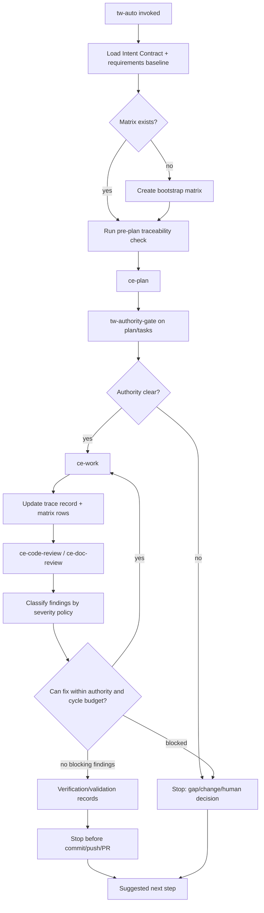

# TraceWeaver Controlled Autonomy

## Overview

Add the first TraceWeaver-controlled autonomous workflow surface, `tw-auto`,
without changing the packaged CE-compatible `lfg` behavior. `tw-auto` wraps the
selected CE loop with TraceWeaver authority gates, matrix bootstrap, bounded
review-fix cycles, severity stop policy, trace record updates, and next-step
handoffs.

This is an advisory alpha feature. It may continue automatically while authority
is clear, but it must stop when requirements, stakeholder intent, traceability,
verification, validation, or human authority decisions are missing.

## Problem Frame

TraceWeaver currently packages separate `tw-*` authority-control skills and
selected CE-compatible workflow skills. Users still need to know which
TraceWeaver gate belongs after each CE step. That creates the exact drift
TraceWeaver is meant to prevent: agents can plan, work, review, and iterate
without consistently updating authority and traceability records.

Compound Engineering already has `lfg` for full autonomous execution. The
TraceWeaver version should preserve that useful automation while adding the
Intent Contract model. The product rule is:

```text
automate while authority is clear
stop when authority must change
```

## Requirements Trace

| Requirement | Planning implication |
| --- | --- |
| R1-R7 | Integrate TraceWeaver handoffs into CE-compatible workflow guidance and preserve suggested next steps. |
| R8-R13 | Create an autonomous flow that composes plan, review, work, review-fix, and repeated review while authority remains clear. |
| R23 | Add `tw-auto` as the alpha invocation surface and keep packaged `lfg` behavior-compatible with CE. |
| R24 | Ensure `traceability-matrix.md` exists or create a bootstrap matrix before implementation starts. |
| R25 | Bound review-fix cycles with a default two-cycle limit and progress checks. |
| R14-R18 | Load the Intent Contract, cite the accepted baseline, trace behavior-bearing units, and require test evidence by default. |
| R19-R22, R26 | Keep alpha advisory, hold clean replacement, and stop before commit/push/PR on authority, verification, traceability, and severity gates. |

## Intent Capsule

```yaml
task_id: TW-TASK-CONTROLLED-AUTONOMY-ALPHA
baseline_id: REQ-BASELINE-2026-04-30-001
baseline_hash_sha256: 66356140d2b30d143e82d23fb316b04e4f443033c4469371b074c86206185271
authority_status: accepted_planning_capsule_runtime_held
authorized_by:
  - REQ-TW-033
  - REQ-TW-034
  - REQ-TW-035
  - REQ-TW-036
  - REQ-TW-037
  - REQ-TW-038
  - REQ-TW-039
  - REQ-TW-040
intent_served:
  - INTENT-TW-001
  - INTENT-TW-002
  - INTENT-TW-003
  - INTENT-TW-004
  - INTENT-TW-005
verification_required:
  - controlled-autonomy plan review before implementation
  - skill instruction review
  - template parse or structural inspection
  - package file inventory
  - install smoke with --include-skills
  - ce-doc-review and ce-code-review evidence
validation_question: Can TraceWeaver automate CE-style execution while stopping before agents turn missing authority into implementation?
must_not_change:
  - Do not modify packaged `lfg` semantics in this alpha.
  - Do not claim clean CE replacement.
  - Do not claim enforcing mode.
  - Do not skip matrix creation or traceability debt recording.
open_assumptions: []
next_step: /ce:work this plan; do not start runtime package edits until Unit 1 promotes authority into requirements.md and the Intent Contract.
```

## Scope Boundaries

- Do not make enforcing mode the default.
- Do not modify the packaged `lfg` skill semantics; create `tw-auto`.
- Do not claim clean CE replacement or runtime equivalence.
- Do not add slash-command or prompt claims unless command/prompt files are
  separately scoped, installed, and proven.
- Do not expand the full Core 11 runtime suite.
- Do not implement a database-backed traceability engine.
- Do not silently approve new requirements, exceptions, validation criteria, or
  release claims from automation.

### Deferred To Separate Tasks

- Runtime U9 proof that `tw-auto` works without the original CE plugin installed.
- Enforcing-mode behavior.
- Slash-command or prompt surfaces for `tw-auto`.
- Automated code/function/class trace extraction beyond the matrix and trace
  record files.

## Context & Research

### Relevant Code And Patterns

- `plugins/traceweaver-core/skills/lfg/SKILL.md` is the selected CE-compatible
  autonomous workflow. It runs plan, work, code review, review-fix persistence,
  residual handoff, browser tests, and PR creation.
- `plugins/traceweaver-core/skills/tw-authority-gate/SKILL.md` defines the
  pre-work authority gate.
- `plugins/traceweaver-core/skills/tw-traceability-check/SKILL.md` defines the
  plan/code/doc/release traceability gate.
- `plugins/traceweaver-core/references/traceability-matrix-template.md` is the
  controlled matrix template and states the matrix wins over diagrams.
- `plugins/traceweaver-core/references/task-capsule-template.yml` and
  `plugins/traceweaver-core/references/trace-record-template.yml` define the
  file-based authority and trace record shape.
- `plugins/traceweaver-core/references/traceweaver-runtime-policy.md` defines
  advisory mode and held enforcing/runtime claims.
- `plugins/traceweaver-core/.codex-plugin/plugin.json` currently advertises the
  existing `tw-*` skills in its default prompt.

### Institutional Learnings

- TraceWeaver task responses must end with a concrete next step.
- Recent review findings repeatedly came from stale authority wording. This plan
  keeps `lfg` and `tw-auto` claim boundaries separate to avoid another stale
  clean-replacement claim.

### External References

No external research is needed. The work is governed by the accepted
TraceWeaver baseline and the local CE-compatible `lfg` skill surface.

## Key Technical Decisions

- Create `plugins/traceweaver-core/skills/tw-auto/SKILL.md` as the new alpha
  entrypoint. Do not alter `plugins/traceweaver-core/skills/lfg/SKILL.md`
  semantics in this alpha.
- Add package-local reference guidance for controlled autonomy rather than
  embedding all logic in `tw-auto/SKILL.md`. This keeps the skill concise and
  makes policy reviewable.
- Use `traceability-matrix.md` as the project matrix path. If it
  does not exist, `tw-auto` must create a bootstrap matrix from `requirements.md`
  and `.traceweaver/intent-contract.yml` before implementation starts.
- Use direct Markdown matrix updates for the first alpha, with trace-record files
  as the durable per-cycle audit log. A later tool can roll trace records up
  into the matrix automatically.
- Record each autonomous loop in `.traceweaver/trace-records/` using a
  predictable file name such as `TW-AUTO-YYYY-MM-DD-NNN-trace.yml`.
- Default to two review-fix cycles per `tw-auto` run. Allow override only through
  reviewed project-local Intent Contract policy.
- Treat P0/P1 as always blocking; P2 blocks for authority, tests, traceability,
  validation, release claims, security, data integrity, or runtime safety; P3
  can be recorded as non-blocking debt only when authority is clear and
  verification passed.

## Open Questions

### Resolved During Planning

- **Should `tw-auto` replace `lfg`?** No. Alpha adds `tw-auto`; packaged `lfg`
  remains CE-compatible until runtime-equivalence proof.
- **Can `tw-auto` run without a matrix?** No. It must find or bootstrap
  `traceability-matrix.md` before implementation.
- **How many review-fix cycles are allowed?** Default two cycles per run, with
  reviewed Intent Contract override only.
- **Which review findings block commit/push/PR?** P0/P1 always; P2 when
  authority/test/traceability/validation/release/safety relevant; P3 may become
  owned non-blocking debt.

### Deferred To Implementation

- Exact format of the loop-state trace record fields after trying the first
  static implementation.
- Exact bootstrap matrix row grouping after inspecting the current merged
  `requirements.md` and Intent Contract state.
- Exact cross-link wording from the new validation file into U6b or promotion
  records, if implementation changes selected package scope.

## Output Structure

```text
plugins/traceweaver-core/
  skills/
    tw-auto/
      SKILL.md
  references/
    traceweaver-controlled-autonomy-policy.md
    automation-loop-state-template.yml
    traceability-matrix-bootstrap-template.md

traceability-matrix.md

.traceweaver/
  trace-records/
    TW-AUTO-YYYY-MM-DD-NNN-trace.yml

docs/validation/
  traceweaver-controlled-autonomy-alpha.md
```

## High-Level Technical Design

> *This illustrates the intended approach and is directional guidance for
> review, not implementation specification. The implementing agent should treat
> it as context, not code to reproduce.*



## Implementation Units

- [x] **Unit 1: Promote Controlled-Autonomy Authority**

**Goal:** Make the new controlled-autonomy requirements visible to the master
baseline and Intent Contract before runtime package work starts.

**Requirements:** R1-R26

**Dependencies:** Closed by `REQ-AMEND-2026-05-01-001` and review evidence
`CE-DOC-REVIEW-2026-05-01-CONTROLLED-AUTONOMY-REQ-CLEAN-001`.

**Files:**
- Modify: `requirements.md`
- Modify: `.traceweaver/intent-contract.yml`
- Modify: `traceability-matrix.md` if it exists
- Reference: `docs/brainstorms/2026-05-01-traceweaver-controlled-autonomy-requirements.md`

**Approach:**
- This unit is complete for authority promotion. Future implementation must
  cite REQ-TW-033 through REQ-TW-043, not the source brainstorm alone.
- Add a source-artifact row for the controlled-autonomy requirements document
  with content hash and review evidence.
- Add approved requirements or a clearly staged requirement group covering
  `tw-auto`, matrix bootstrap, review-fix loop bounds, severity policy, and held
  replacement/enforcement claims.
- Add corresponding Intent Contract authority entries and held-claim boundaries.
- If the project matrix already exists, add rows for the new requirements and
  mark implementation as planned. If it does not exist, record that Unit 3 will
  create the bootstrap matrix.

**Patterns to follow:**
- `requirements.md` Source Artifacts and Master Requirements sections.
- `.traceweaver/intent-contract.yml` approved requirement entries.

**Test scenarios:**
- Inspection: new requirements cite the source brainstorm and keep alpha
  advisory.
- Edge case: clean CE replacement and enforcing mode remain held.
- Error path: no implementation unit can cite only the candidate brainstorm
  after this unit; it must cite the promoted baseline or an accepted exception.

**Verification:**
- `/ce-doc-review requirements.md`
- `/ce-doc-review .traceweaver/intent-contract.yml`

- [x] **Unit 2: Add Controlled Autonomy Policy Templates**

**Goal:** Package reusable policy and state templates that `tw-auto` can cite
without bloating the skill body.

**Requirements:** R8-R18, R24-R26

**Dependencies:** Unit 1.

**Files:**
- Create: `plugins/traceweaver-core/references/traceweaver-controlled-autonomy-policy.md`
- Create: `plugins/traceweaver-core/references/automation-loop-state-template.yml`
- Create: `plugins/traceweaver-core/references/traceability-matrix-bootstrap-template.md`
- Modify: `plugins/traceweaver-core/references/traceweaver-runtime-policy.md`

**Approach:**
- Define the `tw-auto` loop states, stop reasons, progress checks, and severity
  policy in the policy reference.
- Define the loop-state template with fields for baseline ID/hash, matrix path,
  plan path, cycle count, findings IDs, trace updates, verification result,
  validation question, stop reason, and next step.
- Define a generic bootstrap matrix template that is compatible with the
  existing traceability matrix template and uses placeholders derived from the
  consuming project's accepted `requirements.md` and Intent Contract.
- Update runtime policy to mention `tw-auto` as advisory and evidence-bound.

**Patterns to follow:**
- `plugins/traceweaver-core/references/traceability-matrix-template.md`
- `plugins/traceweaver-core/references/trace-record-template.yml`
- `plugins/traceweaver-core/references/task-capsule-template.yml`

**Test scenarios:**
- Happy path: templates include all fields needed by R24-R26.
- Edge case: template supports matrix already present and matrix missing.
- Error path: templates do not allow non-blocking debt without owner and next
  step.

**Verification:**
- YAML templates parse or can be structurally inspected.
- `ce-doc-review` finds no blocking ambiguity in the policy reference.

- [x] **Unit 3: Implement The `tw-auto` Skill**

**Goal:** Add the TraceWeaver-controlled autonomous workflow entrypoint.

**Requirements:** R8-R13, R20, R23-R26

**Dependencies:** Unit 2.

**Files:**
- Create: `plugins/traceweaver-core/skills/tw-auto/SKILL.md`
- Modify: `traceability-matrix.md`
- Reference: `plugins/traceweaver-core/skills/lfg/SKILL.md`
- Reference: `plugins/traceweaver-core/skills/tw-requirements-review/SKILL.md`
- Reference: `plugins/traceweaver-core/skills/tw-authority-gate/SKILL.md`
- Reference: `plugins/traceweaver-core/skills/tw-traceability-check/SKILL.md`
- Reference: `plugins/traceweaver-core/references/traceweaver-controlled-autonomy-policy.md`

**Approach:**
- Make `tw-auto` a wrapper/orchestrator skill, not a copy of `lfg`.
- Start by loading the Intent Contract, baseline, and matrix.
- If the matrix is missing, create the bootstrap matrix before planning or work.
- Invoke the same CE-compatible workflow sequence conceptually used by `lfg`:
  plan, work, code/doc review, review-fix work, residual handling, and tests.
  Commit, push, and PR creation remain held for this static alpha.
- Insert TraceWeaver gates:
  - `tw-requirements-review` after requirements changes;
  - `tw-authority-gate` before implementation;
  - `tw-traceability-check` after work and before completion claims.
- Require trace record and matrix updates after each meaningful cycle.
- Add or update root `traceability-matrix.md` rows for the behavior-bearing
  `tw-auto` skill and controlled-autonomy policy surface before Unit 3 can
  close. Each row must cite approved authority, implementation path, and
  verification evidence.
- Always stop before commit/push/PR in this static alpha and emit the next
  required evidence or human action. Later runtime/U9 work may add
  commit/push/PR continuation after the gates are proven.
- End every path with suggested next steps.

**Patterns to follow:**
- `plugins/traceweaver-core/skills/lfg/SKILL.md` for CE automation sequence.
- `plugins/traceweaver-core/skills/tw-authority-gate/SKILL.md`
- `plugins/traceweaver-core/skills/tw-traceability-check/SKILL.md`

**Test scenarios:**
- Happy path: authority clear, matrix exists, plan/work/review cycle produces
  trace records and stops with commit/PR held plus a suggested next step.
- Edge case: matrix missing, bootstrap matrix is created before implementation.
- Edge case: P3 finding is recorded as non-blocking debt only with owner and
  next step.
- Error path: missing requirement stops before implementation.
- Error path: repeated blocking finding stops after the second review-fix cycle.
- Error path: failed verification twice stops before commit/push/PR.

**Verification:**
- Skill instruction inspection confirms `tw-auto` cannot skip matrix bootstrap,
  authority gate, trace update, severity classification, or next-step handoff.
- Matrix inspection confirms `tw-auto` and its policy surface have authority,
  implementation location, and verification evidence rows before work/review
  closes.

- [x] **Unit 4: Update Plugin Surface And Documentation**

**Goal:** Make the public alpha surface accurate and discoverable without
overclaiming runtime equivalence.

**Requirements:** R1-R7, R19-R23

**Dependencies:** Unit 3.

**Files:**
- Modify: `plugins/traceweaver-core/README.md`
- Modify: `plugins/traceweaver-core/AGENTS.md`
- Modify: `plugins/traceweaver-core/.codex-plugin/plugin.json`
- Modify: `plugins/traceweaver-core/.claude-plugin/plugin.json`
- Modify: `plugins/traceweaver-core/.cursor-plugin/plugin.json`
- Modify: `README.md`

**Approach:**
- Add `tw-auto` to the documented skill list.
- Explain that `tw-auto` is the TraceWeaver-controlled autonomous alpha surface.
- State that packaged `lfg` remains CE-compatible and is not claimed as
  TraceWeaver-controlled.
- Update default prompts/instructions to recommend `tw-auto` for autonomous
  TraceWeaver-controlled work and `lfg` only for CE-compatible behavior.
- Keep slash-command claims held.
- Include next-step guidance: after `tw-auto`, run review/evidence gates or stop
  for requirement changes when directed.

**Patterns to follow:**
- Existing `plugins/traceweaver-core/README.md` alpha-scope language.
- Existing root `README.md` CE workflow map.

**Test scenarios:**
- Happy path: docs tell users exactly which skill to invoke for controlled
  autonomy.
- Edge case: docs do not imply `lfg` is TraceWeaver-controlled.
- Error path: no slash command is advertised without command/prompt files.

**Verification:**
- Plugin manifest JSON parses.
- `ce-doc-review` finds no overclaim around clean CE replacement or enforcing
  mode.

- [x] **Unit 5: Add Static Validation Evidence**

**Goal:** Record alpha package evidence without claiming dynamic runtime
equivalence.

**Requirements:** R19-R22, R24-R26

**Dependencies:** Unit 4.

**Files:**
- Create: `docs/validation/traceweaver-controlled-autonomy-alpha.md`
- Modify: `docs/validation/traceweaver-core-11-u6b-plugin-runtime.md` only to
  add a cross-reference or stale-reset impact if selected package scope changes
- Modify: `docs/validation/traceweaver-core-11-promotion-records.md` if U7
  claim boundaries change

**Approach:**
- Record selected package files, hashes, and claim boundaries.
- Record that `tw-auto` is static/materialized only until runtime proof exists.
- Record held claims: runtime equivalence, clean CE replacement, enforcing mode,
  slash commands, and full Core 11 automation.
- Add stale-reset triggers for `tw-auto`, controlled-autonomy policy templates,
  matrix bootstrap template, loop-state template, plugin manifests, and docs.
- Keep the new validation file as the primary evidence record. If U6b evidence
  is cross-linked, make clear this is a later selected package-scope addition
  and not retroactive proof of U6b dynamic behavior.

**Patterns to follow:**
- `docs/validation/traceweaver-core-11-u6b-plugin-runtime.md`
- `docs/validation/traceweaver-core-11-promotion-records.md`

**Test scenarios:**
- Happy path: evidence proves package files and docs are present.
- Edge case: evidence keeps runtime behavior held.
- Error path: evidence does not mark `lfg` as replaced or runtime-equivalent.

**Verification:**
- Static file inventory matches recorded paths.
- Manifest parse succeeds.
- Hygiene scan has no private paths or unsupported release claims.

- [ ] **Unit 6: Install Smoke And Review Gates**

**Execution status:** static parse, hygiene, overclaim, and whitespace checks
passed for `tw-auto`. Isolated install smoke and review gates remain pending
before U7 claim updates.

**Goal:** Prove the new alpha surface materializes in an isolated install and is
reviewed before U7 claims.

**Requirements:** R19-R26

**Dependencies:** Unit 5.

**Files:**
- Modify: `docs/validation/traceweaver-controlled-autonomy-alpha.md`
- Reference: `plugins/traceweaver-core/skills/tw-auto/SKILL.md`
- Reference: `plugins/traceweaver-core/references/traceweaver-controlled-autonomy-policy.md`

**Approach:**
- Run the documented install command with `--include-skills`.
- Confirm installed skills include `tw-auto`, existing `tw-*` skills, selected
  CE-compatible skills, selected Core skills, and references.
- Confirm installed manifests still record `prompts: []` unless prompt files are
  added in a separate scope.
- Run document review on new requirements, plan, docs, and validation evidence.
- Run code review for `tw-auto`, controlled-autonomy policy/template changes,
  manifest/default-prompt changes, validation-scope changes, and matrix updates
  because these are behavior-bearing plugin surfaces.

**Patterns to follow:**
- U6b install-smoke evidence format.

**Test scenarios:**
- Happy path: isolated install includes `tw-auto/SKILL.md`.
- Edge case: install includes `lfg/SKILL.md` unchanged and `tw-auto/SKILL.md` as
  separate surface.
- Error path: install omits `tw-auto` or references and evidence stays held.

**Verification:**
- Install evidence proves selected skill materialization.
- Code review evidence covers the behavior-bearing `tw-auto` skill, policy,
  manifest/default-prompt, validation-scope, and matrix changes.
- Review evidence has no P0/P1 findings and no P2 authority/test/traceability
  blockers.

## System-Wide Impact

- **Interaction graph:** Adds `tw-auto` as a wrapper around selected CE-compatible
  planning/work/review automation and existing TraceWeaver gates.
- **Error propagation:** Missing authority, failed verification, failed matrix
  writes, repeated findings, or severity blockers stop automation before
  commit/push/PR.
- **State lifecycle risks:** Loop state and matrix rows can go stale when
  requirements, Intent Contract, plugin files, or review evidence change. Stale
  reset rules must be recorded.
- **API surface parity:** `lfg` remains present for CE compatibility; `tw-auto`
  is the TraceWeaver-controlled surface.
- **Integration coverage:** Static install evidence is not runtime equivalence.
  U9 still needs actual invocation transcripts.
- **Unchanged invariants:** Agents remain non-authoritative; requirements,
  approved exceptions, Intent Contract, and matrix control the work.

## Risks & Dependencies

| Risk | Mitigation |
| --- | --- |
| `tw-auto` accidentally forks CE `lfg` behavior | Keep `tw-auto` as wrapper guidance and leave `lfg/SKILL.md` unchanged. |
| Automation skips matrix updates | Make matrix bootstrap and trace update an explicit pre-work gate. |
| Infinite review loop | Default to two review-fix cycles and stop on repeated findings/status or failed verification. |
| Overclaiming clean CE replacement | Hold replacement claims until U9 runtime proof. |
| P2 findings get treated inconsistently | Encode severity policy in controlled-autonomy policy and docs. |
| Candidate requirements outrun accepted baseline | Start with requirements/Intent Contract promotion before package work. |

## Documentation / Operational Notes

- Public docs should describe `tw-auto` as advisory controlled autonomy, not
  enforcement.
- `tw-auto` outputs should always end with one next step:
  - continue automation;
  - run review fix within authority;
  - create requirement/change/gap/exception;
  - request human decision;
  - stop before commit/PR with the evidence needed to proceed later.
- U7 release claims may mention `tw-auto` only after static evidence and reviews
  pass, and only as package-present/advisory unless U9 runtime evidence exists.

## Sources & References

- **Origin document:** `docs/brainstorms/2026-05-01-traceweaver-controlled-autonomy-requirements.md`
- Existing CE-compatible automation: `plugins/traceweaver-core/skills/lfg/SKILL.md`
- Authority gate: `plugins/traceweaver-core/skills/tw-authority-gate/SKILL.md`
- Traceability check: `plugins/traceweaver-core/skills/tw-traceability-check/SKILL.md`
- Matrix template: `plugins/traceweaver-core/references/traceability-matrix-template.md`
- Runtime policy: `plugins/traceweaver-core/references/traceweaver-runtime-policy.md`
