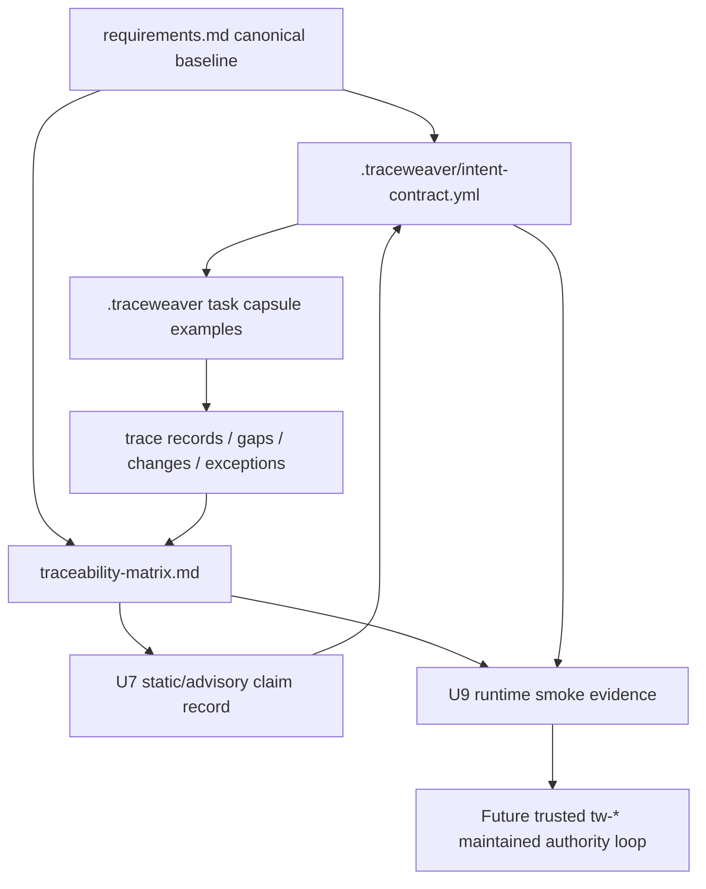

# feat: Make TraceWeaver authority loop ready for advisory use

## Overview

This plan closes the remaining authority and evidence gaps before agents can
reliably use the `tw-*` skills to maintain `traceability-matrix.md`, improve
`requirements.md`, and set up Intent Contract context for agent work. The work
does not make `tw-auto` runtime-proven automation. It makes the file-based
authority loop internally current, adds concrete examples for agents to follow,
and defines the U9 runtime proof needed before TraceWeaver can rely on those
skills as maintained workflow automation.

## Problem Frame

TraceWeaver can already be used manually in advisory mode, and U7 has accepted
narrow static/advisory claims for `tw-auto`, `lfg`, and the README install
command. The core authority artifacts have been refreshed to the canonical
requirements hash `89fb1dc59cf561302932cbc7658abc7cf3b333a9d5955f609f23efd091a87535`,
current matrix hash `8308c9ed45376bb2fd53faa1b9ec98f093d5da85bd4ba32cfff7b70191a3550a`,
current alpha evidence hash `a70eec2a81922e9b405c3a6c1df6a8f584d3a5f4b828860ee335f5e14566e78e`,
and current U7 record hash
`3a55ef86efc2ed998036f6123ae7fcd88b3342e46755a011b44484625d17c590`.
The remaining authority risk is that the refreshed state still needs current
review-evidence recording before it is used as U9 input, and the example record
layout is too thin for agents to update trace evidence without inventing
conventions. If agents use the files without that review evidence and examples,
they can overtrust a refreshed snapshot, miss held claims, or treat candidate
material as implementation authority.

## Requirements Trace

- R1. Record current review evidence for the already-refreshed
  `.traceweaver/intent-contract.yml` authority snapshot: canonical
  `requirements.md` baseline hash, current source artifact hashes, current
  matrix hash, and accepted narrow U7 static/advisory state.
- R2. Record current review evidence for the already-refreshed `requirements.md`
  Current Traceability Matrix section so it can be used consistently with root
  `traceability-matrix.md`.
- R3. Run `/ce-code-review` and `/ce-doc-review` on the U7 record plus matrix
  update before using U7 as input to U9/runtime work.
- R4. Add concrete `.traceweaver/` task, trace, gap, change, exception, and
  matrix-update examples that agents can copy as patterns.
- R5. Define and execute U9 runtime evidence for `tw-auto`,
  `tw-requirements-review`, `tw-authority-gate`, and
  `tw-traceability-check`.
- R6. Decide whether REQ-TW-048 is promoted or remains explicitly held as
  `tw-grill` source evidence only.

## Scope Boundaries

- Do not claim runtime-proven `tw-auto` automation in this plan's early units.
- Do not approve clean CE replacement, slash commands, enforcing mode, commit,
  push, PR, release, upstream-ready, package-ready, or U9 runtime claims until
  later evidence explicitly proves them.
- Do not promote REQ-TW-048 silently. Promotion requires requirements review and
  matrix/evidence updates.
- Do not let example `.traceweaver/` records become implementation authority by
  themselves; examples are patterns unless explicitly accepted as evidence.

### Deferred to Separate Tasks

- U9 implementation hardening beyond runtime proof scenarios belongs in a
  follow-up U9 execution plan if the smoke evidence reveals behavior gaps.
- Release-ready, upstream-ready, and R31 real-project validation remain later
  gates.

## Context & Research

### Relevant Files and Patterns

- `.traceweaver/intent-contract.yml` is the project-local authority contract and
  already cites the refreshed baseline, matrix, alpha evidence, and U7 state;
  it still needs the current review evidence recorded before U9 input use.
- `requirements.md` is the master controlled baseline and now contains a Current
  Traceability Matrix summary that agrees with root `traceability-matrix.md`;
  it still needs the current review evidence recorded for the refreshed
  `89fb1dc...` baseline.
- `traceability-matrix.md` is the authoritative audit surface and now records
  narrow U7 static/advisory acceptance while runtime/U9 claims remain held.
- `docs/validation/traceweaver-u7-static-advisory-claims.md` records clean U7
  doc review and accepted static/advisory claims for
  TW-CLAIM-U7-STATIC-001 through TW-CLAIM-U7-STATIC-003.
- `plugins/traceweaver-core/references/*-template.yml` provides initial shapes
  for task capsules, trace records, gaps, changes, and exceptions.
- `plugins/traceweaver-core/skills/tw-auto/SKILL.md` expects
  `.traceweaver/task-capsules/`, `.traceweaver/trace-records/`,
  `.traceweaver/gaps/`, changes, exceptions, and matrix updates.
- `plugins/traceweaver-core/skills/tw-requirements-review/SKILL.md`,
  `plugins/traceweaver-core/skills/tw-authority-gate/SKILL.md`, and
  `plugins/traceweaver-core/skills/tw-traceability-check/SKILL.md` are adapter
  surfaces that need runtime proof before being treated as reliable automation.

### Institutional Learnings

- No separate `docs/solutions/` learning was required for this plan. The current
  repo authority artifacts and validation records are the source of truth.

### External References

- None. This is a repo-internal authority and evidence alignment plan.

## Key Technical Decisions

- Keep this work file-based: update existing Markdown/YAML authority artifacts
  and add example records under `.traceweaver/`.
- Treat the root `traceability-matrix.md` as authoritative when embedded
  summaries disagree.
- Use review gates as completion criteria for authority changes, not just text
  edits.
- Separate U9 runtime proof from static/advisory acceptance so current claims
  remain narrow.
- Make the REQ-TW-048 decision explicit: either promote through requirements
  review or record a continued hold.

## Open Questions

### Resolved During Planning

- Should `tw-*` skills be usable immediately? Yes, manually in advisory mode,
  but not as trusted maintained automation until refreshed authority review
  evidence, examples, and U9 runtime proof are complete.
- Should U7 static/advisory acceptance be treated as runtime proof? No. U7 only
  accepts static/advisory claims; U9 remains required for runtime behavior.

### Deferred to Implementation

- Exact example record IDs: choose stable IDs during implementation based on the
  current issue/task naming and avoid colliding with existing records.
- Exact U9 transcript/evidence format: decide while implementing the U9 smoke
  harness, using existing validation record style.
- REQ-TW-048 disposition: implementation should either prepare promotion for
  review or record a continued hold, based on the chosen stakeholder decision.

## High-Level Technical Design

> *This illustrates the intended approach and is directional guidance for
> review, not implementation specification. The implementing agent should treat
> it as context, not code to reproduce.*

## Implementation Units

- [ ] **Unit 1: Record Refreshed Intent Contract Review State**

**Goal:** Record current review evidence for the already-refreshed
`.traceweaver/intent-contract.yml` authority snapshot before it is used as U9
input.

**Requirements:** R1, R3

**Dependencies:** Current U7 static/advisory record, root matrix state, and
canonical requirements hash refresh are already in place.

**Files:**
- Modify: `.traceweaver/intent-contract.yml`
- Modify: `traceability-matrix.md`
- Test: none - authority artifact update verified through hash checks and
  document review.

**Approach:**
- Verify `baseline_hash_sha256` matches the canonical hash from
  `requirements.md`.
- Verify source artifact hashes for changed authority files match current
  artifacts.
- Verify source/evidence references for
  `docs/validation/traceweaver-u7-static-advisory-claims.md` match the current
  U7 record.
- Add a current baseline-refresh review field or update the review reference
  after `/ce-doc-review` passes for the refreshed authority set.
- Preserve the boundary that U7 accepts only static/advisory claims while
  `tw-grill` authority, runtime behavior, release, clean replacement, slash
  commands, enforcing mode, autonomous publication, and U9 remain held.
- Update `traceability-matrix.md` only if review-evidence recording changes the
  accepted matrix state.

**Patterns to follow:**
- `.traceweaver/intent-contract.yml`
- `traceability-matrix.md`
- `docs/validation/traceweaver-u7-static-advisory-claims.md`

**Test scenarios:**
- Test expectation: none - no executable behavior changes.
- Verification scenario: recompute referenced file hashes and confirm the Intent
  Contract values match current artifacts.
- Review scenario: `/ce-doc-review` confirms the Intent Contract and matrix do
  not contradict U7 held-claim boundaries.

**Verification:**
- Intent Contract baseline hash matches `requirements.md`.
- Referenced matrix hash and U7 record state are current.
- Intent Contract names the review evidence that covers the refreshed authority
  snapshot.
- `/ce-doc-review` passes for the Intent Contract and affected matrix rows.

- [ ] **Unit 2: Record Refreshed Requirements Summary Review State**

**Goal:** Record current review evidence for the already-refreshed
`requirements.md` Current Traceability Matrix section so downstream agents can
use it consistently with the root matrix.

**Requirements:** R2, R3

**Dependencies:** Unit 1 if review-evidence recording changes the Intent
Contract or matrix hashes.

**Files:**
- Modify: `requirements.md`
- Modify: `traceability-matrix.md`
- Modify: `docs/validation/traceweaver-controlled-autonomy-alpha.md`
- Modify: `docs/validation/traceweaver-u7-static-advisory-claims.md`
- Test: none - canonical hash and review checks are the verification.

**Approach:**
- Verify the embedded Current Traceability Matrix rows for REQ-TW-019 through
  REQ-TW-023, REQ-TW-030, REQ-TW-032, and REQ-TW-033 through REQ-TW-047 already
  match the root matrix.
- Verify the rows record narrow U7 static/advisory acceptance and keep
  U9/runtime/release claims held.
- Recompute the canonical `requirements.md` hash using the documented
  placeholder procedure and confirm it remains
  `89fb1dc59cf561302932cbc7658abc7cf3b333a9d5955f609f23efd091a87535`.
- Add a 2026-05-02 amendment/review entry for this refreshed baseline after
  `/ce-doc-review` passes.
- Cascade only the new review/evidence ID and any resulting hash changes into
  the Intent Contract, root matrix, alpha evidence, and U7 evidence record.

**Patterns to follow:**
- `requirements.md` Canonical baseline hash procedure
- `traceability-matrix.md` U7 rows
- `docs/validation/traceweaver-controlled-autonomy-alpha.md` baseline block

**Test scenarios:**
- Test expectation: none - no executable behavior changes.
- Verification scenario: canonical hash recomputation produces the hash recorded
  in every downstream authority/evidence file.
- Review scenario: `/ce-doc-review requirements.md` finds no stale U7 or
  contradictory held-claim wording.

**Verification:**
- `requirements.md` embedded summary agrees with root `traceability-matrix.md`.
- All downstream baseline hash citations match the recomputed canonical hash.
- The refreshed baseline names current review evidence for the 2026-05-02
  authority-state refresh.
- `/ce-doc-review` passes on `requirements.md`, `.traceweaver/intent-contract.yml`,
  and `traceability-matrix.md`.

- [ ] **Unit 3: Add Golden TraceWeaver Record Examples**

**Goal:** Give agents concrete, repo-local examples for task capsules, trace
records, gaps, changes, exceptions, and a matrix update entry.

**Requirements:** R4

**Dependencies:** Unit 1 and Unit 2, so examples cite the current baseline and
matrix state.

**Files:**
- Create: `.traceweaver/task-capsules/example-authority-loop-task.yml`
- Create: `.traceweaver/trace-records/example-authority-loop-trace.yml`
- Create: `.traceweaver/gaps/example-missing-authority-gap.yml`
- Create: `.traceweaver/changes/example-requirements-change.yml`
- Create: `.traceweaver/exceptions/example-held-claim-exception.yml`
- Modify: `traceability-matrix.md`
- Test: none - schema/shape review and traceability review are the verification.

**Approach:**
- Base examples on packaged templates in `plugins/traceweaver-core/references/`.
- Use clearly marked `example_` IDs or `EXAMPLE-*` IDs so examples cannot be
  confused with live authority.
- Include baseline ID/hash, authority source, intent served, verification
  method, validation question, held claims, stale reset conditions, owner, and
  next step.
- Add a matrix entry or appendix note that records the examples as patterns, not
  authority.

**Patterns to follow:**
- `plugins/traceweaver-core/references/task-capsule-template.yml`
- `plugins/traceweaver-core/references/trace-record-template.yml`
- `plugins/traceweaver-core/references/gap-template.yml`
- `plugins/traceweaver-core/references/change-template.yml`
- `plugins/traceweaver-core/references/exception-template.yml`

**Test scenarios:**
- Test expectation: none - examples are non-executable YAML records.
- Verification scenario: parse the YAML examples and confirm required fields are
  present.
- Traceability scenario: run `tw-traceability-check` or `/ce-doc-review` to
  confirm examples are marked as examples and do not become authority.

**Verification:**
- Example records parse as YAML.
- Matrix makes their non-authority example status explicit.
- `/ce-doc-review` passes for examples and matrix references.

- [ ] **Unit 4: Decide REQ-TW-048 Disposition**

**Goal:** Either promote REQ-TW-048 through requirements review or explicitly
keep `tw-grill` candidate/source-evidence only.

**Requirements:** R6

**Dependencies:** Unit 2 if requirements hash changes are already in progress.

**Files:**
- Modify: `requirements.md`
- Modify: `traceability-matrix.md`
- Modify: `.traceweaver/intent-contract.yml`
- Modify: `docs/validation/traceweaver-u7-static-advisory-claims.md`
- Test: none - requirements review is the verification.

**Approach:**
- If promoting, run `tw-requirements-review` or `/ce-doc-review` on the
  REQ-TW-048 requirement text, update status from `candidate_for_review` to
  `approved`, and update every candidate-scoped matrix/evidence reference.
- If holding, update `requirements.md`, matrix rows, and Intent Contract notes
  to state clearly that `tw-grill` remains source evidence only and cannot
  authorize implementation.
- Recompute and cascade the requirements baseline hash if `requirements.md`
  changes.

**Patterns to follow:**
- `requirements.md` REQ-TW-048 row
- `traceability-matrix.md` candidate REQ-TW-048 rows
- `docs/validation/traceweaver-u7-static-advisory-claims.md`

**Test scenarios:**
- Test expectation: none - authority disposition is verified by review.
- Promotion scenario: `tw-grill` no longer appears as candidate-only after
  review, and all authority/evidence rows agree.
- Hold scenario: `tw-grill` remains candidate/source-evidence only everywhere,
  and no implementation authority claims cite it as approved.

**Verification:**
- `/ce-doc-review requirements.md` passes after the chosen disposition.
- Matrix and evidence records agree with the chosen disposition.

- [ ] **Unit 5: Plan and Record U9 Runtime Proof Scope**

**Goal:** Create a U9 runtime validation plan and evidence skeleton for proving
the `tw-*` skills maintain the authority loop in practice.

**Requirements:** R5

**Dependencies:** Units 1 through 4, because runtime proof must cite current
authority artifacts and REQ-TW-048 disposition.

**Files:**
- Create: `docs/plans/YYYY-MM-DD-NNN-feat-traceweaver-u9-runtime-proof-plan.md`
- Create: `docs/validation/traceweaver-u9-runtime-proof.md`
- Modify: `traceability-matrix.md`
- Test: future implementation tests or smoke scripts named by the U9 plan.

**Approach:**
- Define runtime scenarios for loading `requirements.md`,
  `traceability-matrix.md`, and `.traceweaver/intent-contract.yml`.
- Include missing-authority detection, matrix/trace-record update, weak
  requirement routing to `tw-requirements-review`, trace gap routing to
  `tw-traceability-check`, and stop-before-commit/push/PR behavior.
- Keep runtime evidence draft status held until the scenarios are actually
  executed and reviewed.
- Explicitly separate advisory runtime proof from enforcing-mode proof.

**Patterns to follow:**
- `docs/validation/traceweaver-u7-static-advisory-claims.md`
- `plugins/traceweaver-core/skills/tw-auto/SKILL.md`
- `plugins/traceweaver-core/skills/tw-authority-gate/SKILL.md`
- `plugins/traceweaver-core/skills/tw-requirements-review/SKILL.md`
- `plugins/traceweaver-core/skills/tw-traceability-check/SKILL.md`

**Test scenarios:**
- Happy path: `tw-auto` loads all authority files and records a trace update for
  a meaningful advisory task.
- Error path: missing approved requirement routes to a gap/proposed requirement
  and stops before implementation.
- Error path: weak requirement routes to `tw-requirements-review`.
- Error path: missing matrix link routes to `tw-traceability-check`.
- Safety path: unresolved authority or failed verification stops before commit,
  push, PR, release, or runtime/enforcing claims.

**Verification:**
- U9 plan and evidence skeleton pass `/ce-doc-review`.
- U9 remains held until runtime proof is executed and reviewed.

## System-Wide Impact

- **Interaction graph:** `requirements.md`, `.traceweaver/intent-contract.yml`,
  `traceability-matrix.md`, U7/U9 validation records, and `.traceweaver/`
  example records form the authority chain used by future agents.
- **Error propagation:** Stale hash, missing authority, or candidate-only
  authority should produce a held claim, gap, change, exception, accepted-risk
  candidate, or clarification, not implementation.
- **State lifecycle risks:** Updating `requirements.md` changes the canonical
  baseline hash and requires cascading updates. Treat this as an explicit unit,
  not incidental cleanup.
- **API surface parity:** Agent-facing instructions in `AGENTS.md` and
  `tw-auto` should remain aligned with the authority artifacts.
- **Integration coverage:** Document review and runtime smoke need to prove the
  authority loop across multiple files; a single artifact review is not enough.
- **Unchanged invariants:** U7 remains static/advisory only. Runtime,
  release-ready, clean replacement, slash commands, enforcing mode, autonomous
  publication, and U9 claims remain held until later proof.

## Risks & Dependencies

| Risk | Mitigation |
|------|------------|
| Updating `requirements.md` changes the canonical hash and creates cascading stale evidence. | Treat hash recomputation and downstream citation refresh as part of Unit 2 verification. |
| Example records are mistaken for live authority. | Use explicit example IDs and matrix notes saying they are patterns only. |
| U7 static/advisory acceptance is overread as runtime proof. | Keep held-claim language in the U7 record, matrix, requirements summary, and Intent Contract. |
| REQ-TW-048 is accidentally promoted by implication. | Make Unit 4 an explicit review decision with either promotion or continued hold. |
| U9 plan becomes too broad. | Limit U9 to runtime evidence for authority loading, routing, trace updates, and stop boundaries before broader release validation. |

## Documentation / Operational Notes

- Every completed unit should end with a suggested next step naming the next
  TraceWeaver gate or held condition.
- Use `/ce-doc-review` after authority artifact changes.
- Use `/ce-code-review` as well when the U9 runtime proof adds scripts,
  executable checks, or behavior-bearing skill changes.
- Do not stage, commit, push, or open PRs from `tw-auto` alpha evidence.

## Sources & References

- Project instructions: `AGENTS.md`
- Intent Contract: `.traceweaver/intent-contract.yml`
- Requirements baseline: `requirements.md`
- Traceability matrix: `traceability-matrix.md`
- U7 record: `docs/validation/traceweaver-u7-static-advisory-claims.md`
- Alpha evidence: `docs/validation/traceweaver-controlled-autonomy-alpha.md`
- TraceWeaver skill routing: `plugins/traceweaver-core/skills/tw-auto/SKILL.md`
- TraceWeaver adapters:
  `plugins/traceweaver-core/skills/tw-requirements-review/SKILL.md`,
  `plugins/traceweaver-core/skills/tw-authority-gate/SKILL.md`,
  `plugins/traceweaver-core/skills/tw-traceability-check/SKILL.md`
