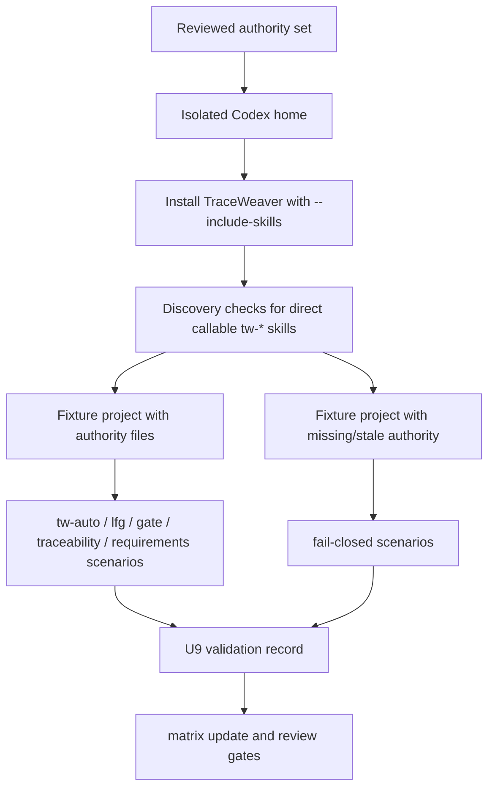

# feat: Prove TraceWeaver U9 Codex Runtime Discovery

## Overview

This plan defines the Codex-first U9 proof needed before TraceWeaver can claim
that the `tw-*` skill set works as runtime-discoverable workflow automation in
Codex. It starts from the reviewed authority state and proves only the Codex
runtime/discovery path. Claude Code packaging, broad CE wrapping, clean CE
replacement, slash commands, enforcing mode, commit/push/PR automation, and
release-ready claims remain out of scope.

The outcome is a validation record and smoke harness showing whether a fresh
Codex install exposes TraceWeaver-packaged skills as callable entries, whether
the core `tw-*` gates behave according to the Intent Contract, and whether held
claims remain held when runtime behavior is incomplete.

## Problem Frame

U7 accepts narrow static/advisory claims for `tw-auto`, the `lfg` alias, and the
README Codex install command. That prior authority snapshot was reviewed as:

- `.traceweaver/intent-contract.yml`
- `traceability-matrix.md`
- `docs/validation/traceweaver-controlled-autonomy-alpha.md`
- `docs/validation/traceweaver-u7-static-advisory-claims.md`

That proves static install and authority state, not trusted runtime use. The
current Unit 9 authority set is a review candidate until clean doc review passes
and the matching authority files are staged together without staged/unstaged
splits. U9 must prove the callable Codex runtime path before the project relies
on `tw-*` skills to maintain `requirements.md`, `traceability-matrix.md`, task
capsules, trace records, or runtime validation evidence.

## Requirements Trace

- R1. Prove a fresh isolated Codex install exposes TraceWeaver direct-callable
  skill directories for `tw-auto`, `lfg`, `tw-authority-gate`,
  `tw-traceability-check`, `tw-requirements-review`, and candidate-scoped
  `tw-grill`.
- R2. Prove the installed skill copies resolve to TraceWeaver-packaged files,
  not a globally installed raw CE plugin or stale local skill directory.
- R3. Prove `tw-auto` loads or detects `requirements.md`,
  `traceability-matrix.md`, and `.traceweaver/intent-contract.yml` before
  planning or implementation.
- R4. Prove missing or stale authority stops work and reports a gap, change,
  exception, accepted-risk candidate, clarification, or held claim instead of
  proceeding from assumptions.
- R5. Prove `tw-authority-gate` blocks unapproved meaningful behavior and
  returns allowed scope, missing evidence, and next action.
- R6. Prove `tw-traceability-check` detects missing matrix/evidence links and
  dark-behavior candidates.
- R7. Prove `tw-requirements-review` classifies weak, ambiguous, unverifiable,
  source-free, candidate, or unapproved requirements as not ready for
  implementation authority.
- R8. Prove `lfg` delegates to `tw-auto` and cannot run raw CE autopilot.
- R9. Prove reviewer subagent capacity/backpressure is reported as incomplete
  coverage and cannot close required review gates.
- R10. Prove `tw-auto`, `lfg`, and source-evidence-scoped `tw-grill` stop before
  commit, push, PR creation, release publication, enforcing behavior, slash
  commands, clean replacement, runtime-equivalence, or U9 runtime-claim closure
  unless later evidence explicitly authorizes those claims.
- R11. Record U9 evidence in the matrix and a dedicated validation record
  without promoting `tw-grill` implementation authority or runtime/release
  claims beyond what the proof actually demonstrates.

## Scope Boundaries

- Codex only. Claude Code plugin loading and discovery are a follow-up plan.
- Isolated Codex home first. Existing-user-home upgrade behavior stays held
  except for already-recorded unowned direct-callable conflict behavior.
- No commit, push, PR, release, or publication automation.
- No slash-command claim unless prompt/command files are separately added and
  proven.
- No enforcing-mode claim; `traceweaver_mode` remains advisory.
- No clean CE replacement or broad familiar `ce-*` wrapper claim.
- `tw-grill` is approved only for static/advisory source evidence; runtime
  behavior and implementation authority remain held.
- Do not mutate the real user Codex home during proof runs.

### Deferred to Separate Tasks

- Claude Code packaging/discovery proof.
- Full CE 3.4.1 method-family wrapper implementation.
- Existing-home upgrade/conflict matrix beyond direct callable unowned
  directory protection.
- R31 real-project validation and release/upstream readiness.
- Runtime proof or continued hold decision for `tw-grill` behavior.

## Context & Research

### Current Authority State

- `.traceweaver/intent-contract.yml` records baseline
  `REQ-BASELINE-2026-04-30-001`, canonical hash
  `6934da7234fe4b59057baebb3cd1ff8a6570b533776185e9a9e3572b617768ba`,
  prior review evidence `CE-DOC-REVIEW-2026-05-02-AUTHORITY-STATE-CLEAN-001`,
  Unit 1 through Unit 8 reviewed/held evidence, and `u9_input_status` ending in
  `unit9_registry_shape_auth_boundary_patch_code_reviewed_doc_reviewed_held_runtime_claims_held`.
  Unit 1 evidence is reviewed only as isolated install/discovery planning input.
  Unit 2 fixture smoke is reviewed only as fixture classification and
  temporary-copy trace-write input for later U9 units. Unit 3 deterministic
  gate-behavior smoke is reviewed only as fixture-scoped gate-behavior input.
  Unit 4 deterministic `lfg`, publication-stop, and reviewer-backpressure
  boundary smoke is reviewed only as deterministic boundary input after clean
  `/ce-code-review` and `/ce-doc-review`. Active host-registry discovery, real `tw-*` invocation,
  project-level runtime write behavior, live reviewer-subagent backpressure,
  and runtime claims remain held. Unit 5 host-home filesystem probe is reviewed
  only as held evidence that the current Codex host is missing the required
  TraceWeaver-native direct callable `tw-*` entries. Unit 7 host install
  attempt evidence passed authority-set doc review and is accepted only as
  held current-host install-conflict limitation evidence; it keeps successful
  host install in the active host, fresh reload proof, active host-registry
  discovery, and real `tw-*` runtime invocation held. Unit 8 separate-home
  install passed, but the fresh `codex exec` visible-skill list excluded
  `tw-authority-gate`. Unit 8 behavior-code review passed after replacing an
  asserted registry-loading cause with a neutral held observation; authority
  doc review passed after the next-route repair. Unit 8 is accepted only as
  reviewed-held limitation evidence. Unit 9 removed the duplicate active
  namespaced skill surface, moved packaged/provenance copies to
  `.codex/traceweaver-core/skills`, proved prompt-input visibility for required
  `tw-*`, `lfg`, and wrapped CE skills, then added a live-auth-copy boundary
  hold after the fresh exec probe reached the exact skill-hash sentinel.
  Refreshed Unit 9 behavior-code review passed as
  `CE-CODE-REVIEW-2026-05-04-U9-UNIT9-AUTH-BOUNDARY-HARNESS-CLEAN-001`;
  authority doc review passed as
  `CE-DOC-REVIEW-2026-05-04-U9-UNIT9-AUTHORITY-CLEAN-001`. Unit 9 is accepted
  only as reviewed-held registry-shape/auth-boundary evidence; real runtime
  invocation and release claims stay held.
- `traceability-matrix.md` records U7 static/advisory acceptance while keeping
  U9/runtime, release, clean-replacement, enforcing, slash-command, autonomous
  publication, and `tw-grill` implementation-authority claims held.
- `docs/validation/traceweaver-controlled-autonomy-alpha.md` records isolated
  install smoke and exact hashes for current `tw-auto`, `lfg`, `tw-grill`, and
  direct callable copies.
- `docs/validation/traceweaver-u7-static-advisory-claims.md` accepts only
  TW-CLAIM-U7-STATIC-001 through TW-CLAIM-U7-STATIC-003 as static/advisory
  claims.

### Relevant Files and Patterns

- `src/index.ts` implements the self-contained Codex installer. It installs
  packaged/provenance skill copies under `.codex/traceweaver-core/skills/`,
  direct callable skill copies under `.codex/skills/`, selected agent TOML files
  under `.codex/agents/traceweaver-core/`, and an install manifest under
  `.codex/traceweaver-core/install-manifest.json`.
- `plugins/traceweaver-core/skills/tw-auto/SKILL.md` defines runtime
  expectations, skill resolution, reviewer capacity/backpressure handling,
  authority bootstrap, trace updates, and stop-before-publication behavior.
- `plugins/traceweaver-core/skills/tw-authority-gate/SKILL.md`,
  `plugins/traceweaver-core/skills/tw-traceability-check/SKILL.md`, and
  `plugins/traceweaver-core/skills/tw-requirements-review/SKILL.md` are adapter
  surfaces that route to requirements and traceability reviewers.
- `plugins/traceweaver-core/skills/lfg/SKILL.md` is the compatibility alias
  that must delegate to `tw-auto`.
- `plugins/traceweaver-core/skills/tw-grill/SKILL.md` is approved only for
  installed/static source evidence.
- `plugins/traceweaver-core/references/*-template.yml` and
  `plugins/traceweaver-core/skills/tw-auto/references/` provide authority,
  matrix, task capsule, trace record, gap, change, exception, and loop-state
  templates.
- `traceability-matrix.md` VER-TW-017 already names the U9 scenarios to prove.

### External References

No external research is required. This proof depends on repo-local installer
behavior, Codex skill directory materialization, and TraceWeaver's own authority
records.

## Key Technical Decisions

- Use an isolated temporary Codex home for all proof runs.
- Treat file-level installed skill discovery as necessary but not sufficient:
  the proof must also exercise TraceWeaver skill instructions against controlled
  fixture projects.
- Add a repo-local smoke harness instead of relying only on transcript prose.
  The harness should produce deterministic outputs that can be cited from the
  validation record.
- Keep runtime proof scenarios read-only or confined to throwaway fixture
  workspaces.
- Make negative tests first-class: missing authority, stale authority, direct
  CE fallback, reviewer capacity backpressure, and publication attempts should
  fail closed.
- Record partial proof honestly. If a scenario cannot be automated in Codex
  without harness support, record the limitation and keep that claim held.

## Open Questions

### Resolved During Planning

- Should this prove Claude Code too? No. Scope is Codex-first.
- Should this promote runtime claims automatically if the smoke passes? No.
  Runtime claims require the U9 evidence record, matrix update, and clean
  review.
- Should `tw-grill` be treated as implementation authority during U9? No.
  REQ-TW-048 approves static/advisory source evidence only; implementation
  authority remains held.

### Deferred to Implementation

- Exact harness implementation language. Prefer TypeScript/Bun if it can reuse
  `src/index.ts` conventions; use shell/Ruby only for simple file/hash checks.
- Exact fixture names and IDs for task capsules, trace records, gaps, changes,
  and exceptions.
- Whether to add a lightweight local skill-runner shim for deterministic
  instruction-path tests, or record that full host-level skill invocation needs
  in-app/manual transcript evidence.

## High-Level Technical Design

> This is directional guidance for reviewers and implementers. It is not
> step-by-step implementation code.

## Implementation Units

- [x] **Unit 1: Build Codex Install And Discovery Smoke**

  Completion note: 2026-05-02 Unit 1 isolated install/discovery smoke evidence
  is recorded in
  `docs/validation/traceweaver-u9-codex-runtime-discovery.md`. Active Codex
  host-registry discovery remains held until fresh session/reload evidence
  exists.

**Goal:** Prove a fresh isolated Codex home receives the expected
TraceWeaver-packaged callable skill surface and references.

**Requirements:** R1, R2

**Dependencies:** Reviewed U7 static/advisory authority set is staged.

**Files:**
- Create: `scripts/traceweaver-smoke-codex-discovery`
- Create: `docs/validation/traceweaver-u9-codex-runtime-discovery.md`
- Modify: `traceability-matrix.md`
- Test: `scripts/traceweaver-smoke-codex-discovery`

**Approach:**
- Create a temporary Codex home.
- Run the documented installer through `bun run src/index.ts install
  ./plugins/traceweaver-core --to codex --include-skills --codexHome
  <TEMP_CODEX_HOME>`.
- Verify direct callable skill directories exist for `tw-auto`, `lfg`,
  `tw-authority-gate`, `tw-traceability-check`, `tw-requirements-review`,
  `tw-grill`, and every `tw-auto` required dependency: `ce-plan`, `ce-work`,
  `ce-code-review`, and `ce-doc-review`.
- Verify packaged TraceWeaver copies exist under
  `.codex/traceweaver-core/skills/`, outside the active Codex skill scan path.
- Verify direct callable copies contain `.traceweaver-core-install.json` and
  that source hashes match the TraceWeaver-packaged copies, not a raw external CE
  install or stale global skill directory.
- Verify install manifest lists expected skills, callable skills, selected
  agents, references, and zero prompts.
- Verify no non-TraceWeaver global callable skill is overwritten.
- Add a host-level Codex discovery checkpoint after install. A fresh Codex
  session, host reload, or equivalent Codex-supported discovery path must show
  `tw-auto`, `lfg`, `tw-authority-gate`, `tw-traceability-check`,
  `tw-requirements-review`, `tw-grill`, `ce-plan`, `ce-work`,
  `ce-code-review`, and `ce-doc-review` as callable TraceWeaver-packaged
  entries. If this cannot be automated, capture manual Codex transcript
  evidence and keep runtime-discoverable claims held until that evidence exists.

**Patterns to follow:**
- `src/index.ts`
- `docs/validation/traceweaver-controlled-autonomy-alpha.md`
- `scripts/traceweaver-smoke-no-publication`

**Test scenarios:**
- Happy path: all expected `tw-*`, `lfg`, and required CE-compatible dependency
  direct callable directories are present.
- Identity path: direct callable files match source hashes for the selected
  `tw-*`, `lfg`, `ce-plan`, `ce-work`, `ce-code-review`, and `ce-doc-review`
  skills.
- Host discovery path: fresh Codex session/reload evidence shows the installed
  skills are callable as TraceWeaver-packaged entries; otherwise
  runtime-discoverable claims remain held.
- Isolation path: proof modifies only `<TEMP_CODEX_HOME>`.
- Conflict path: existing unowned direct callable skill directory fails closed.
- Prompt path: manifest still records zero prompts and no prompt files.

**Verification:**
- Smoke script exits zero for the happy path.
- Smoke script exits nonzero for the unowned-conflict negative path.
- Validation record skeleton is created and captures exact paths, counts,
  hashes, host-discovery evidence or limitation, and held prompt/slash claim
  state.

- [x] **Unit 2: Add Controlled U9 Fixture Workspaces**

**Goal:** Create throwaway fixture projects that exercise authority-present,
missing-authority, stale-authority, weak-requirement, and trace-gap cases
without mutating the real repository authority files.

**Requirements:** R3, R4, R5, R6, R7, R11

**Dependencies:** Unit 1 discovery smoke.

**Files:**
- Create: `fixtures/u9-codex/authority-present/requirements.md`
- Create: `fixtures/u9-codex/authority-present/traceability-matrix.md`
- Create:
  `fixtures/u9-codex/authority-present/.traceweaver/intent-contract.yml`
- Create: `fixtures/u9-codex/missing-authority/README.md`
- Create: `fixtures/u9-codex/stale-authority/requirements.md`
- Create: `fixtures/u9-codex/weak-requirement/requirements.md`
- Create: `fixtures/u9-codex/trace-gap/traceability-matrix.md`
- Create: `fixtures/u9-codex/trace-write/.traceweaver/task-capsules/example.yml`
- Create: `fixtures/u9-codex/trace-write/.traceweaver/trace-records/README.md`
- Create: `fixtures/u9-codex/trace-write/.traceweaver/gaps/README.md`
- Create: `fixtures/u9-codex/trace-write/.traceweaver/changes/README.md`
- Create: `fixtures/u9-codex/trace-write/.traceweaver/exceptions/README.md`
- Create: `fixtures/u9-codex/trace-write/traceability-matrix.md`
- Create: `fixtures/u9-codex/README.md`
- Modify: `docs/validation/traceweaver-u9-codex-runtime-discovery.md`
- Modify: `traceability-matrix.md`
- Create: `scripts/traceweaver-smoke-u9-fixtures`
- Test: `scripts/traceweaver-smoke-codex-discovery`
- Test: `scripts/traceweaver-smoke-u9-fixtures`

**Approach:**
- Keep fixtures minimal and obviously synthetic.
- Include a valid baseline/Intent Contract/matrix fixture that allows
  read-only gate checks.
- Include a missing-authority fixture with no root requirements or Intent
  Contract.
- Include a stale-authority fixture where hashes intentionally disagree.
- Include a weak-requirement fixture with ambiguous and unverifiable candidate
  requirements.
- Include a trace-gap fixture where behavior exists without a matrix/evidence
  link.
- Include a trace-write fixture where `tw-auto` or a deterministic harness can
  write a trace record, gap/change/exception candidate, and matrix update inside
  a throwaway fixture workspace without mutating the real repository authority
  files.
- Ensure fixture docs cannot be mistaken for accepted project authority.

**Patterns to follow:**
- `plugins/traceweaver-core/references/requirements-baseline-template.md`
- `plugins/traceweaver-core/references/intent-contract-template.yml`
- `plugins/traceweaver-core/references/traceability-matrix-bootstrap-template.md`
- `plugins/traceweaver-core/references/task-capsule-template.yml`
- `plugins/traceweaver-core/references/trace-record-template.yml`

**Test scenarios:**
- Authority-present fixture: required files exist and hashes match.
- Missing-authority fixture: missing files are detected before work.
- Stale-authority fixture: hash mismatch is detected before work.
- Weak-requirement fixture: weak requirement is classified as not
  implementation-ready.
- Trace-gap fixture: missing implementation/evidence link is flagged.
- Trace-write fixture: allowed fixture writes create or update
  `.traceweaver/trace-records`, one gap/change/exception candidate path, and the
  fixture matrix while leaving the real repo authority files unchanged.

**Verification:**
- Fixture scan output classifies each fixture correctly.
- Validation record cites fixture paths and expected outcomes.
- Trace-write fixture output proves whether matrix/trace maintenance runtime
  behavior is supported; if not supported, matrix/trace maintenance remains
  held.

**Completion note (2026-05-03):**
- Created fixture-only workspaces under `fixtures/u9-codex/`.
- Added deterministic fixture scan harness
  `scripts/traceweaver-smoke-u9-fixtures`.
- Recorded Unit 2 evidence in
  `docs/validation/traceweaver-u9-codex-runtime-discovery.md` and
  `traceability-matrix.md`.
- Claims remain limited to fixture-level classification and temporary-copy
  trace-write proof. Active Codex host-registry discovery, real `tw-*` runtime
  invocation, and project-level trace/matrix/gap/change/exception runtime
  maintenance remain held pending later U9 units and review.

- [x] **Unit 3: Prove Core TraceWeaver Gate Behavior**

**Goal:** Exercise the core gate/check skills against fixtures and record
whether they produce the required pass/block/held classifications.

**Requirements:** R3, R4, R5, R6, R7, R11

**Dependencies:** Unit 2 fixtures.

**Files:**
- Modify: `scripts/traceweaver-smoke-u9-fixtures`
- Modify: `docs/validation/traceweaver-u9-codex-runtime-discovery.md`
- Modify: `.traceweaver/intent-contract.yml`
- Modify: `traceability-matrix.md`
- Modify: `docs/validation/traceweaver-controlled-autonomy-alpha.md`
- Test: `scripts/traceweaver-smoke-u9-fixtures`

**Approach:**
- For `tw-authority-gate`, test approved-authority and missing-authority
  fixtures.
- For `tw-traceability-check`, test complete-trace and trace-gap fixtures.
- For `tw-requirements-review`, test approved and weak requirement fixtures.
- For `tw-auto`, test authority-file loading and fail-closed behavior where
  required authority files or TraceWeaver-packaged skill resolution are missing.
- For matrix and trace maintenance, test the trace-write fixture. The accepted
  proof must show a trace record, gap/change/exception candidate, and fixture
  matrix update, or explicitly keep runtime matrix/trace write behavior held.
- If host-level skill invocation cannot be automated from a shell script, record
  the limitation and split the scenario into deterministic file/instruction
  checks plus manual Codex transcript evidence. Do not mark host-level runtime
  invocation as fully proven without that transcript or an equivalent runner.

**Patterns to follow:**
- `plugins/traceweaver-core/skills/tw-auto/SKILL.md`
- `plugins/traceweaver-core/skills/tw-authority-gate/SKILL.md`
- `plugins/traceweaver-core/skills/tw-traceability-check/SKILL.md`
- `plugins/traceweaver-core/skills/tw-requirements-review/SKILL.md`

**Test scenarios:**
- `tw-authority-gate` returns proceed only for approved authority.
- `tw-authority-gate` returns blocked or revise for missing/unapproved
  authority.
- `tw-traceability-check` returns pass only when need, requirement,
  implementation, verification, and validation path are linked.
- `tw-traceability-check` flags a dark-behavior candidate for an untraced
  behavior-bearing unit.
- `tw-requirements-review` blocks ambiguous/unverifiable/source-free
  requirements from becoming authority.
- `tw-auto` reports missing skill resolution as an install/package gap instead
  of using raw external CE skills.
- `tw-auto` or the deterministic harness writes fixture-local trace evidence and
  matrix updates only inside the trace-write fixture, or records that the
  maintenance behavior remains held.

**Verification:**
- Smoke output includes explicit `pass`, `blocked`, `needs_revision`, or
  `held` classifications for each scenario.
- Smoke output includes explicit fixture-write results for trace record,
  gap/change/exception candidate, and matrix update behavior.
- Validation record preserves any manual/degraded coverage limitations.

**Completion note (2026-05-03):**
- Extended `scripts/traceweaver-smoke-u9-fixtures` with deterministic Unit 3
  gate-behavior checks for `tw-authority-gate`, `tw-traceability-check`,
  `tw-requirements-review`, and `tw-auto` authority/missing-skill handling.
- Recorded Unit 3 evidence in
  `docs/validation/traceweaver-u9-codex-runtime-discovery.md`,
  `.traceweaver/intent-contract.yml`, and `traceability-matrix.md`.
- Unit 3 passed `/ce-doc-review` as fixture-scoped gate-behavior evidence.
  A behavior-bearing `/ce-code-review` finding found that the
  missing-skill-resolution fixture omitted TraceWeaver-native dependency
  coverage; the harness now covers missing `tw-traceability-check` and
  `ce-work`, and the code-review rerun passed with no findings.
  Active Codex host-registry discovery, real `tw-*` invocation, project-level
  trace/matrix/gap/change/exception runtime writes, enforcing behavior, and
  runtime claims remain held.

- [x] **Unit 4: Prove `lfg`, Publication Stops, And Reviewer Backpressure**

**Goal:** Prove the `lfg` alias and high-risk runtime boundaries fail closed:
no raw CE autopilot, no publication, and no clean review claim when reviewer
capacity is incomplete.

**Requirements:** R8, R9, R10, R11

**Dependencies:** Unit 3 gate behavior checks.

**Files:**
- Modify: `scripts/traceweaver-smoke-codex-discovery`
- Modify: `scripts/traceweaver-smoke-no-publication`
- Modify: `docs/validation/traceweaver-u9-codex-runtime-discovery.md`
- Modify: `traceability-matrix.md`
- Test: `scripts/traceweaver-smoke-codex-discovery`
- Test: `scripts/traceweaver-smoke-no-publication`

**Approach:**
- Verify installed `lfg/SKILL.md` delegates to `tw-auto` and does not name raw
  CE autopilot as its execution path.
- Add or reuse negative publication checks for commit, push, PR creation, PR
  feedback replies, and release-publication wording.
- Add deterministic review-backpressure fixture/output that simulates a
  reviewer capacity failure and verifies the expected classification:
  incomplete coverage, pending reviewers listed, no gate closure.
- If actual subagent capacity cannot be controlled from a shell smoke, record
  the simulated proof as policy/harness proof and keep live host backpressure
  behavior held until manual or host-supported runtime evidence exists.

**Patterns to follow:**
- `plugins/traceweaver-core/skills/lfg/SKILL.md`
- `plugins/traceweaver-core/skills/tw-auto/SKILL.md`
- `scripts/traceweaver-smoke-no-publication`

**Test scenarios:**
- `lfg` direct callable copy delegates to `tw-auto`.
- `lfg` does not call raw `ce-plan`, `ce-work`, `ce-code-review`,
  `ce-commit`, `ce-commit-push-pr`, or raw CE autopilot directly.
- Publication commands are blocked before external mutation.
- Reviewer capacity failure does not become `review passed`.
- Human acceptance of degraded review creates a limitation/held condition, not
  gate closure.

**Verification:**
- Smoke output records `lfg_delegation=pass`.
- Smoke output records publication negative checks as blocked.
- Validation record keeps live reviewer-capacity runtime behavior held unless
  actual host evidence is captured.

**Completion note (2026-05-03):**
- Extended `scripts/traceweaver-smoke-codex-discovery` to verify the installed
  direct callable `lfg` copy delegates to `tw-auto` and does not fall back to
  raw CE autopilot.
- Extended `scripts/traceweaver-smoke-no-publication` to verify source `lfg`
  delegation, PR helper publication stops before external `gh` mutation,
  broader publication-route static stop markers, and a deterministic
  event-derived reviewer-capacity backpressure fixture where incomplete
  reviewer coverage cannot close required gates.
- Recorded Unit 4 evidence in
  `docs/validation/traceweaver-u9-codex-runtime-discovery.md` and
  `traceability-matrix.md` as reviewed deterministic boundary input. Active Codex host-registry
  discovery, real skill invocation, live reviewer-subagent backpressure,
  enforcing behavior, clean replacement, autonomous publication, and release
  claims remain held.

- [x] **Unit 5: Probe Current Codex Host Registry Filesystem**

**Goal:** Check whether the current Codex host skill home already exposes the
required TraceWeaver direct callable skill files without mutating the user's
Codex home.

**Requirements:** R1, R2, R11

**Dependencies:** Units 1 through 4.

**Files:**
- Create: `scripts/traceweaver-smoke-codex-host-registry`
- Modify: `docs/validation/traceweaver-u9-codex-runtime-discovery.md`
- Modify: `traceability-matrix.md`
- Modify: `.traceweaver/intent-contract.yml`
- Modify: `docs/validation/traceweaver-controlled-autonomy-alpha.md`
- Test: `scripts/traceweaver-smoke-codex-host-registry`

**Approach:**
- Inspect `${CODEX_HOME:-$HOME/.codex}/skills` read-only.
- Check direct callable files for `tw-auto`, `lfg`, `tw-authority-gate`,
  `tw-traceability-check`, `tw-requirements-review`, `tw-grill`, `ce-plan`,
  `ce-work`, `ce-code-review`, and `ce-doc-review`.
- Require TraceWeaver install markers and source hash matches before treating
  a host file as trusted TraceWeaver-packaged runtime-discovery input.
- Exit successfully with an explicit held classification when the host is
  missing or has untrusted direct callable entries; do not claim active Codex
  registry exposure without a fresh-session/reload transcript or supported host
  runner.

**Test scenarios:**
- Current host has all required direct callable files with TraceWeaver markers
  and matching source hashes: record filesystem probe passed but active
  registry still held until callable transcript exists.
- Current host is missing TraceWeaver-native `tw-*` files or has unmarked/stale
  continuity files: record host-registry/runtime held.

**Verification:**
- Smoke output records present, missing, unmarked, and stale skill sets.
- Validation record preserves held runtime claims.

**Completion note (2026-05-03):**
- Added `scripts/traceweaver-smoke-codex-host-registry`.
- The current host probe found `lfg`, `ce-plan`, `ce-work`, `ce-code-review`,
  and `ce-doc-review`, but not `tw-auto`, `tw-authority-gate`,
  `tw-traceability-check`, `tw-requirements-review`, or `tw-grill`.
- The present host entries were unmarked and stale relative to the
  TraceWeaver-packaged source surface, so host-registry discovery and real
  runtime invocation remain held.

- [x] **Unit 6: Record U9 Evidence And Update Authority Records**

**Goal:** Record the Codex U9 proof without overstating it, then update the
matrix and authority records to expose exactly what passed and what remains
held.

**Requirements:** R11

**Dependencies:** Units 1 through 5.

**Files:**
- Modify: `docs/validation/traceweaver-u9-codex-runtime-discovery.md`
- Modify: `traceability-matrix.md`
- Modify: `.traceweaver/intent-contract.yml`
- Modify: `docs/validation/traceweaver-controlled-autonomy-alpha.md`
- Modify: `docs/validation/traceweaver-u7-static-advisory-claims.md`
- Test: `scripts/traceweaver-smoke-codex-discovery`
- Test: `scripts/traceweaver-smoke-codex-host-registry`
- Test: `scripts/traceweaver-smoke-no-publication`

**Approach:**
- Record procedure, fixture set, commands, outputs, expected outcomes, actual
  outcomes, limitations, and stale-reset triggers.
- Update the matrix with U9 verification rows for discovery, authority gate,
  traceability check, requirements review, `tw-auto` authority loading,
  `lfg` delegation, publication stops, and reviewer backpressure.
- Update Intent Contract source artifact hashes and U9 state only after the
  validation record and matrix are current.
- Keep runtime claims narrowly scoped to what the smoke proves.
- Keep clean CE replacement, enforcing mode, slash commands, release-ready,
  autonomous publication, broad CE wrappers, and REQ-TW-048 implementation
  authority held unless explicitly proven and reviewed.

**Patterns to follow:**
- `docs/validation/traceweaver-controlled-autonomy-alpha.md`
- `docs/validation/traceweaver-u7-static-advisory-claims.md`
- `traceability-matrix.md`
- `.traceweaver/intent-contract.yml`

**Test scenarios:**
- Validation record cites every smoke result.
- Matrix rows link each proved runtime/discovery behavior to requirements,
  validation questions, evidence, and held claims.
- Intent Contract hashes match current matrix and U9 record.
- No U9 evidence text claims release-ready, clean replacement, enforcing mode,
  slash-command availability, or autonomous publication.

**Verification:**
- Hash consistency script passes for Intent Contract source artifacts.
- `git diff --check` passes.
- `/ce-code-review` passed for Unit 4 smoke harness changes as
  `CE-CODE-REVIEW-2026-05-03-U9-UNIT4-HARNESS-CLEAN-001`.
- `/ce-doc-review` passed for U9 evidence, matrix, Intent Contract, alpha
  evidence, plan, and Unit 4 smoke scripts as
  `CE-DOC-REVIEW-2026-05-03-U9-UNIT4-AUTHORITY-CLEAN-001`.
- Unit 5 host-registry filesystem probe evidence, reviewed-held result, source
  artifact hashes, matrix rows, Intent Contract fields, alpha evidence, and
  plan state were recorded in the staged authority set. `/ce-code-review`
  passed for `scripts/traceweaver-smoke-codex-host-registry` as
  `CE-CODE-REVIEW-2026-05-03-U9-UNIT5-HOST-REGISTRY-HARNESS-CLEAN-001`, and
  `/ce-doc-review` passed for the Unit 5 authority set as
  `CE-DOC-REVIEW-2026-05-03-U9-UNIT5-AUTHORITY-CLEAN-001`.
- Unit 6 is complete only through the reviewed-held Unit 5 authority state.
  Active host-registry discovery, real `tw-*` runtime invocation, and runtime
  authority claims remain held until a host install plus fresh Codex
  session/reload transcript or supported automated host runner proves callable
  TraceWeaver-packaged entries.

- [x] **Unit 7: Attempt Current Host Install And Preserve Runtime Hold**

**Goal:** Attempt the documented installer against the current Codex host home
without forcing overwrite, then record whether host install can proceed to a
fresh reload proof.

**Requirements:** R1, R2, R10, R11

**Dependencies:** Units 1 through 6.

**Files:**
- Modify: `docs/validation/traceweaver-u9-codex-runtime-discovery.md`
- Modify: `traceability-matrix.md`
- Modify: `.traceweaver/intent-contract.yml`
- Modify: `docs/validation/traceweaver-controlled-autonomy-alpha.md`
- Modify: `docs/plans/2026-05-02-003-feat-u9-codex-runtime-discovery-proof-plan.md`

**Approach:**
- Run the documented installer against the default current Codex home.
- Do not remove, rename, or overwrite existing user/global callable skill
  directories.
- Treat a conflict failure as a held safety result, not as runtime discovery.
- Do not attempt a fresh Codex reload or real `tw-*` invocation unless the host
  install succeeds with TraceWeaver-marked direct callable entries.

**Test scenarios:**
- Current host has unowned direct callable skill directories: installer exits
  nonzero before overwrite and runtime claims remain held.
- Current host has only TraceWeaver-marked direct callable entries: later proof
  may proceed to fresh Codex session/reload transcript.

**Verification:**
- Host install attempt output records exit code, conflict paths, held install
  classification, and held runtime claims.
- Authority records mark Unit 7 as held until clean `/ce-doc-review` accepts
  the held result.

**Completion note (2026-05-03):**
- Ran `bun run src/index.ts install ./plugins/traceweaver-core --to codex
  --include-skills` against the default current Codex home.
- The installer exited with code 1 before writing because existing global
  callable skill directories were unowned by TraceWeaver:
  `ce-brainstorm`, `ce-code-review`, `ce-compound`, `ce-compound-refresh`,
  `ce-debug`, `ce-doc-review`, `ce-plan`, `ce-sessions`, `ce-setup`,
  `ce-work`, and `lfg`.
- Recorded the result as a reviewed held install-conflict limitation after
  clean `/ce-doc-review`
  `CE-DOC-REVIEW-2026-05-03-U9-UNIT7-AUTHORITY-CLEAN-001`.
  Active host-registry discovery, real `tw-*` runtime invocation, successful
  host install in the active host, and fresh reload proof remain held.

- [x] **Unit 8: Separate-Home Install And Fresh Exec Registry Probe**

**Goal:** Use a separate Codex home to avoid current-host callable conflicts,
then launch a fresh Codex exec session from that home to test whether installed
TraceWeaver skills are visible to the runtime registry.

**Requirements:** R1, R2, R10, R11

**Dependencies:** Units 1 through 7.

**Files:**
- Create: `scripts/traceweaver-smoke-codex-separate-home-runtime`
- Modify: `docs/validation/traceweaver-u9-codex-runtime-discovery.md`
- Modify: `traceability-matrix.md`
- Modify: `.traceweaver/intent-contract.yml`
- Modify: `docs/validation/traceweaver-controlled-autonomy-alpha.md`
- Modify: `docs/plans/2026-05-02-003-feat-u9-codex-runtime-discovery-proof-plan.md`

**Approach:**
- Create a temporary separate Codex home and copy only Codex auth into it.
- Install TraceWeaver with the repo-local installer and `--codexHome`.
- Launch `codex exec` with `CODEX_HOME` pointed at the isolated home,
  `--ignore-user-config`, and read-only sandboxing.
- Ask the fresh session to load `tw-authority-gate` without shell fallback.
- Classify a missing skill-registry result as held evidence, not runtime
  acceptance.

**Completion note (2026-05-03):**
- `scripts/traceweaver-smoke-codex-separate-home-runtime` installed into a
  temporary separate Codex home successfully.
- Fresh `codex exec` exited 0, but the captured visible-skill list excluded
  `tw-authority-gate`.
- Recorded Unit 8 as code-reviewed / authority-doc-reviewed held
  evidence:
  `fresh_codex_reload_probe=held_skill_registry_visible_list_excludes_tw_authority_gate`
  and
  `fresh_codex_registry_loading_observation=held_tw_authority_gate_not_in_visible_skill_list`.
- Patched `scripts/traceweaver-smoke-codex-separate-home-runtime` to remove
  copied Codex auth from the retained temporary home before emitting evidence
  paths and to require an exact `TRACEWEAVER_SKILL_LOADED=tw-authority-gate`
  sentinel before accepting runtime discovery.
- Behavior-bearing code review passed with no findings after the neutral
  held-observation patch as
  `CE-CODE-REVIEW-2026-05-04-U9-SEPARATE-HOME-HARNESS-CLEAN-002`;
- Authority doc review passed with no findings as
  `CE-DOC-REVIEW-2026-05-04-U9-UNIT8-AUTHORITY-CLEAN-002`.
- Unit 8 is accepted only as reviewed-held separate-home install/fresh-exec
  registry limitation evidence.
  Active host-registry discovery, real `tw-*` runtime invocation, and runtime
  claims remain held.

- [x] **Unit 9: Registry-Shape Repair And Prompt-Input Visibility Proof**

**Goal:** Remove the duplicate active Codex skill surface that kept the `tw-*`
adapters out of the visible skill registry, then prove the repaired install
shape in an isolated Codex home.

**Requirements:** R1, R2, R10, R11

**Dependencies:** Units 1 through 8.

**Files:**
- Modify: `src/index.ts`
- Modify: `scripts/traceweaver-smoke-codex-discovery`
- Modify: `scripts/traceweaver-smoke-codex-separate-home-runtime`
- Modify: `docs/validation/traceweaver-u9-codex-runtime-discovery.md`
- Modify: `traceability-matrix.md`

**Approach:**
- Keep direct callable skills under `.codex/skills/<skill>` as the only active
  Codex skill surface.
- Move the packaged/provenance copy outside the active skill scan path under
  `.codex/traceweaver-core/skills/<skill>`.
- Remove the legacy active `.codex/skills/traceweaver-core` surface during
  upgrade only when the existing TraceWeaver install manifest proves ownership.
- Fail closed without removal when the legacy active namespaced surface is
  unowned or missing ownership proof.
- Extend the discovery smoke to fail if `.codex/skills/traceweaver-core`
  exists.
- Require `codex debug prompt-input` to expose `tw-auto`, `lfg`,
  `tw-authority-gate`, `tw-traceability-check`, `tw-requirements-review`,
  `tw-grill`, and the wrapped CE dependencies.
- Keep real runtime invocation held unless the fresh `codex exec` transcript
  returns the exact skill-hash sentinel.

**Completion note (2026-05-04, review pending):**
- `scripts/traceweaver-smoke-codex-discovery` passed with
  `active_namespaced_skill_surface=absent` and all required `tw-*`, `lfg`, and
  wrapped CE skills visible in prompt-input.
- The discovery smoke also proved
  `owned_legacy_active_skill_surface=removed_on_upgrade` and
  `unowned_legacy_active_skill_surface=blocked_before_removal`.
- `scripts/traceweaver-smoke-codex-separate-home-runtime` recorded
  `fresh_codex_required_skills_visible=true` and reached the exact skill-hash
  sentinel, but held runtime acceptance because the probe used a copied live
  Codex auth file during read-only exec.
- Registry-shape and legacy-upgrade code review passed with no findings as
  `CE-CODE-REVIEW-2026-05-04-U9-UNIT9-INSTALLER-HARNESS-CLEAN-001`; refreshed
  behavior-code review for the auth-boundary patch passed as
  `CE-CODE-REVIEW-2026-05-04-U9-UNIT9-AUTH-BOUNDARY-HARNESS-CLEAN-001`;
  authority doc review passed as
  `CE-DOC-REVIEW-2026-05-04-U9-UNIT9-AUTHORITY-CLEAN-001`. Unit 9 is accepted
  only as reviewed-held registry-shape/auth-boundary evidence; runtime
  invocation remains held.

## Risks And Mitigations

| Risk | Mitigation |
| --- | --- |
| File-level discovery is mistaken for runtime invocation proof. | Separate discovery, deterministic scenario checks, and host-level invocation evidence in the validation record. |
| A shell smoke cannot invoke Codex skills the same way the host does. | Record shell checks as deterministic support only; require manual Codex transcript or host runner evidence for full host-level invocation claims. |
| U9 proof accidentally promotes `tw-grill` implementation authority. | Treat REQ-TW-048 as approved static/advisory source evidence only in fixtures and matrix rows unless a later requirements review and runtime evidence explicitly authorize implementation authority. |
| Negative publication checks miss a new route. | Reuse `scripts/traceweaver-smoke-no-publication` and add stale-reset triggers for any changed publication-related skill/script. |
| Reviewer backpressure cannot be forced deterministically. | Simulate policy classification first and keep live capacity behavior held until actual host evidence is captured. |
| Existing user Codex home differs from isolated install. | Scope this plan to isolated install; record existing-home behavior as held except for direct-callable conflict protection. |

## Review And Acceptance Gates

- `/ce-code-review` on:
  - `scripts/traceweaver-smoke-codex-discovery`
  - `scripts/traceweaver-smoke-codex-host-registry`
  - `scripts/traceweaver-smoke-codex-separate-home-runtime`
  - `scripts/traceweaver-smoke-no-publication`
  - any changed `plugins/traceweaver-core/skills/**/SKILL.md`
  - any changed installer code
- `/ce-doc-review` on:
  - `docs/validation/traceweaver-u9-codex-runtime-discovery.md`
  - `traceability-matrix.md`
  - `.traceweaver/intent-contract.yml`
  - `docs/plans/2026-05-02-003-feat-u9-codex-runtime-discovery-proof-plan.md`
  - any changed U7/alpha evidence records
- Do not use U9 evidence as runtime authority until both code and doc review
  gates pass and the reviewed authority/evidence files are staged together as
  one matching set.

## Suggested Next Step

Proceed to an auth-safe fresh exec/runtime proof before any real `tw-*`
invocation claim. Keep release/runtime claims held until a passing fresh exec
transcript exists without the copied-auth boundary or an accepted limitation
explicitly holds that boundary.
