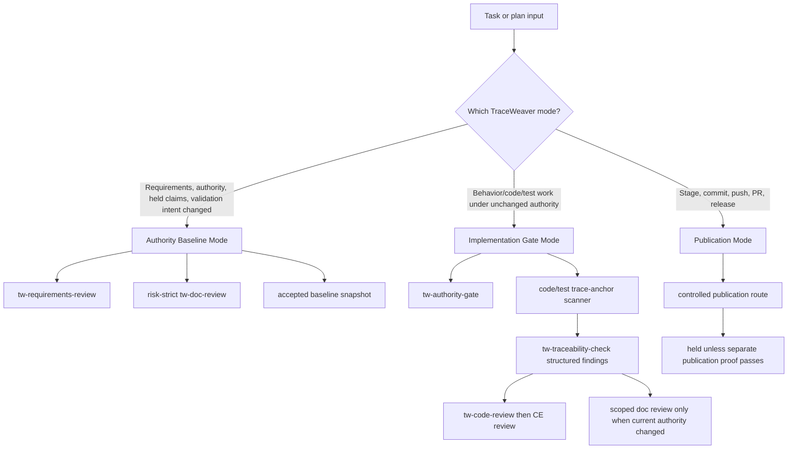

# feat: Add TraceWeaver operating modes and code traceability

## Summary

This plan changes TraceWeaver from a broad authority-record polishing loop into a risk-scoped systems-engineering workflow. It introduces operating modes for authority baselines, implementation gates, and publication gates, then adds active code/test trace-anchor scanning so normal coding work can move forward with requirement-linked code and validating tests.

---

## Problem Frame

TraceWeaver currently protects authority claims, but the current workflow lets small wording or hash updates cascade through the Intent Contract, matrix, alpha evidence, and validation records. That creates repeated review-record churn and blocks the product goal: a usable plugin that guides implementation from requirements through code, tests, traceability, and validation.

The systems-engineering purpose is not to maximize record edits. The purpose is to preserve stakeholder intent, expose unauthorized or unverified behavior, and prove useful product work with code and tests.

---

## Requirements

- R1. TraceWeaver must distinguish authority-baseline work, normal implementation work, and publication work so each path runs only the gates needed for its risk.
- R2. Normal implementation work must not trigger broad historical authority-doc review unless requirements, accepted scope, held claims, validation intent, or publication policy materially change.
- R3. Authority-doc review must stay strict when a change can over-authorize runtime, publication, clean replacement, release, or implementation authority.
- R4. Behavior-bearing code, scripts, skills, fixtures, and tests must carry visible trace anchors at the file, public entrypoint, high-level function, or verification artifact level without requiring line-by-line annotations.
- R5. `tw-traceability-check` must actively detect missing anchors, stale requirement IDs, missing matrix paths, tests linked to removed requirements, and unsupported done/release claims, then emit structured findings.
- R6. `tw-code-review` must run the traceability/code-anchor preflight before CE code review and must preserve structured TraceWeaver findings before CE findings.
- R7. `tw-doc-review` must become risk-scoped: requirement-quality and current-gate authority consistency are required, but historical wording drift is non-blocking unless it changes accepted scope, pending gate, or held/runtime/publication claims.
- R8. `tw-auto` must own the task/plan closure loop for implementation work, while pausing for user clarification when requirements are unclear, contradictory, incomplete, missing, or need material authority changes.
- R9. Implementation-gate code-anchor scanning must default to changed behavior-bearing files plus linked tests, fixtures, and smokes. Whole-repo scanning is audit/baseline behavior, and pre-existing anchor gaps remain baseline debt unless touched or explicitly promoted into the active gate.
- R10. TraceWeaver must prove the new behavior with deterministic fixtures before accepting runtime, project-write, publication, clean replacement, or release claims.
- R11. Any scanner, anchor contract, or operating-mode policy required by `tw-traceability-check`, `tw-code-review`, `tw-doc-review`, or `tw-auto` must be packaged inside the TraceWeaver plugin skill surface and proven present after install. Repo-root helper scripts may exercise or wrap the scanner, but installed Codex skills must not depend on unpackaged repository scripts or plugin-level references that are not resolvable from the callable skill.

---

## Scope Boundaries

- This plan does not claim clean CE plugin replacement, full CE 3.5.0 parity, release readiness, upstream readiness, R31 validation, or publication support.
- This plan does not accept active-host `tw-code-review` or `tw-doc-review` runtime CE delegation without a separate proof.
- This plan does not require line-by-line trace comments in source files.
- This plan does not rewrite all historical authority records for wording consistency.
- This plan does not let `tw-auto` create, broaden, or reinterpret requirements without human approval.

### Deferred to Follow-Up Work

- Full standalone-plugin replacement proof remains in the CE-surface classification and packaging work.
- Controlled publication route proof remains in the REQ-TW-053 path.
- Vestro dogfood remains a follow-up validation after TraceWeaver proves the scanner and mode behavior on its own repo.
- Metrics dashboard and automatic Mermaid generation remain separate product gaps unless later pulled into this plan by reviewed requirements.

---

## Context & Research

### Relevant Code and Patterns

- `requirements.md` already records REQ-TW-054 for code/test trace anchors, REQ-TW-055 for structured traceability findings, and REQ-TW-056 for the `tw-auto` closure loop.
- `traceability-matrix.md` already records the related candidate/planning rows, including VER-TW-036 through VER-TW-040.
- `plugins/traceweaver-core/skills/tw-traceability-check/SKILL.md` defines structured traceability checks but does not yet implement active code/test anchor scanning.
- `plugins/traceweaver-core/skills/tw-code-review/SKILL.md` and `plugins/traceweaver-core/skills/tw-doc-review/SKILL.md` currently express wrapper sequencing as skill instructions.
- `plugins/traceweaver-core/skills/tw-auto/SKILL.md` records the desired closure loop but still treats it as planned behavior until deterministic fixtures and runtime proof exist.
- `scripts/traceweaver-smoke-structured-findings` is the closest existing deterministic fixture model for structured findings.
- `scripts/traceweaver-smoke-tw-skill-behavior` is the current wrapper/closure-loop behavior harness.
- `src/index.ts` is the current installer implementation and should only be touched if the new scanner or skill references need packaging.

### Institutional Learnings

- Static/doc/code review closure is not runtime readiness. Runtime, publication, clean replacement, and release claims must remain held until their own proof exists.
- The recent review-cycle regression shows that hash/status hygiene must be scoped to the current gate. Otherwise each record repair creates new review surface without improving product behavior.

### External References

- No external research is needed for this plan. The current issue is a local TraceWeaver operating-model and implementation problem, and the repository already contains the relevant systems-engineering source-basis materials and fixtures.

---

## Key Technical Decisions

- Introduce an explicit TraceWeaver operating-mode policy instead of trying to solve review churn by softer reviewer wording. This gives `tw-auto`, `tw-doc-review`, and `tw-code-review` a shared rule for when broad authority review is required.
- Treat authority hashes as acceptance-boundary snapshots, not as a reason to re-review every historical sentence after every evidence edit. Run logs and interim observations should be append-only or private evidence unless accepted into a baseline.
- Implement code/test traceability as deterministic repository scanning before relying on model judgment. Model review can explain findings, but the scanner should provide repeatable blocker/held evidence.
- Scope code/test scanning by operating mode. Implementation gates scan changed behavior-bearing files plus linked verification artifacts; authority/audit mode may scan the whole repo and record pre-existing gaps as baseline debt.
- Package the scanner, code-anchor contract, and operating-mode policy with the callable skills that depend on them instead of treating them as repository-only or plugin-level-only artifacts. Repo-root smokes can call the packaged scanner during development, but install/discovery proof must show the same scanner, contract, and policy references are available in the installed skill surface.
- Keep trace anchors coarse and navigable: file-level anchors, selected entrypoint/function anchors, and explicit test/fixture/smoke anchors. Do not annotate every line.
- Make `tw-doc-review` risk-scoped rather than weaker. It remains strict for current authority and claim safety, but historical wording debt becomes non-blocking unless it changes the active gate.
- Make `tw-auto` responsible for closure-loop orchestration after fixtures pass, but keep requirement changes human-controlled.

---

## Open Questions

### Resolved During Planning

- Should TraceWeaver keep strict authority review? Yes, but only in Authority Baseline Mode or when the current work changes authority, accepted scope, held claims, validation intent, or publication policy.
- Should the next product step be more doc review or active code traceability? Active code/test traceability is the next product step.
- Should `tw-auto` be allowed to fix unclear requirements by itself? No. It must pause and ask for human clarification or route to requirements review.

### Deferred to Implementation

- Exact trace-anchor comment spelling is deferred until the scanner implementation. The plan requires a stable format, but the implementing agent should choose the smallest readable syntax that works across Markdown, shell, TypeScript, and skill files.
- Exact matrix code-anchor table shape is deferred until implementation, but it must link requirement IDs, artifact paths, anchor IDs, verification IDs, and exception IDs when present.
- Exact fixture file names may be adjusted if implementation shows a clearer fixture grouping.

---

## Output Structure

    scripts/
      traceweaver-smoke-code-traceability
    fixtures/
      code-traceability/
        complete-anchor-chain/
        missing-file-anchor/
        missing-function-anchor/
        missing-test-verification/
        stale-requirement-id/
        dead-tdd/
        generated-file-exception/
    plugins/traceweaver-core/
      skills/
        tw-traceability-check/
          scripts/
            traceweaver-check-code-anchors
          references/
            code-trace-anchor-contract.md
            traceweaver-operating-modes.md
        tw-code-review/
          references/
            traceweaver-operating-modes.md
        tw-doc-review/
          references/
            traceweaver-operating-modes.md
        tw-auto/
          references/
            traceweaver-operating-modes.md

---

## High-Level Technical Design

> *This illustrates the intended approach and is directional guidance for review, not implementation specification. The implementing agent should treat it as context, not code to reproduce.*

---

## Implementation Units

- U1. **Record operating modes as authority**

**Goal:** Add a reviewed requirement and policy boundary for Authority Baseline Mode, Implementation Gate Mode, and Publication Mode.

**Requirements:** R1, R2, R3, R7, R8

**Dependencies:** None

**Files:**
- Modify: `requirements.md`
- Modify: `traceability-matrix.md`
- Modify: `.traceweaver/intent-contract.yml`
- Modify: `docs/validation/traceweaver-skill-behavior-audit.md`
- Modify: `docs/validation/traceweaver-controlled-autonomy-alpha.md`
- Create: `plugins/traceweaver-core/skills/tw-traceability-check/references/traceweaver-operating-modes.md`
- Create: `plugins/traceweaver-core/skills/tw-code-review/references/traceweaver-operating-modes.md`
- Create: `plugins/traceweaver-core/skills/tw-doc-review/references/traceweaver-operating-modes.md`
- Create: `plugins/traceweaver-core/skills/tw-auto/references/traceweaver-operating-modes.md`
- Modify: `scripts/traceweaver-smoke-codex-discovery`
- Modify: `scripts/traceweaver-smoke-codex-host-registry`
- Test: `scripts/traceweaver-smoke-tw-skill-behavior`
- Test: `scripts/traceweaver-smoke-codex-discovery`
- Test: `scripts/traceweaver-smoke-codex-host-registry`

**Approach:**
- Add the operating-mode requirement as a new stable `REQ-TW-*` entry instead of overloading REQ-TW-054 through REQ-TW-056.
- Define which changes trigger broad authority doc review and which changes are handled by scoped implementation gates.
- Record that stale historical wording is review debt unless it changes current accepted scope, pending gate, held/runtime/publication claims, or authority identity.
- Keep the operating-mode policy skill-local for every dependent callable skill so direct-callable and installed skill copies do not rely on plugin-level reference resolution.
- Extend install/discovery smokes to prove `tw-traceability-check`, `tw-code-review`, `tw-doc-review`, and `tw-auto` each have a resolvable operating-mode policy reference after install.
- Keep runtime, publication, clean replacement, release, and R31 claims explicitly held.

**Patterns to follow:**
- REQ-TW-053 through REQ-TW-056 for candidate requirement wording and held-claim discipline.
- `plugins/traceweaver-core/skills/tw-auto/references/traceweaver-controlled-autonomy-policy.md` for policy-style guidance.

**Test scenarios:**
- Happy path: a normal code task with unchanged requirements is classified as Implementation Gate Mode and does not require broad authority-doc review.
- Edge case: a change to held runtime claims is classified as Authority Baseline Mode.
- Error path: a publication request without publication-route proof remains blocked.
- Regression: operating-mode status is updated in both the skill-behavior evidence and alpha evidence records so the authority set does not split.
- Integration: `tw-auto` and `tw-doc-review` both reference the same operating-mode policy.
- Installation: after a fresh TraceWeaver install, discovery smoke finds the operating-mode policy under each dependent installed skill reference path.

**Verification:**
- The new requirement, policy reference, matrix row, and validation evidence are linked and reviewed.
- Install/discovery smoke output proves every dependent callable skill can resolve its skill-local operating-mode policy reference.
- The current staged-set review loop no longer treats unrelated historical wording as part of the active implementation gate.

---

- U2. **Define the code/test trace-anchor contract**

**Goal:** Create the public contract for coarse trace anchors in code, scripts, skills, tests, fixtures, and smokes.

**Requirements:** R4, R5

**Dependencies:** U1

**Files:**
- Create: `plugins/traceweaver-core/skills/tw-traceability-check/references/code-trace-anchor-contract.md`
- Modify: `plugins/traceweaver-core/skills/tw-traceability-check/SKILL.md`
- Modify: `plugins/traceweaver-core/skills/tw-code-review/SKILL.md`
- Modify: `requirements.md`
- Modify: `traceability-matrix.md`
- Modify: `scripts/traceweaver-smoke-codex-discovery`
- Modify: `scripts/traceweaver-smoke-codex-host-registry`
- Test: `scripts/traceweaver-smoke-code-traceability`
- Test: `scripts/traceweaver-smoke-codex-discovery`
- Test: `scripts/traceweaver-smoke-codex-host-registry`

**Approach:**
- Define required anchor levels: file role, selected high-level entrypoint/function, and test/fixture/smoke verification anchor.
- Define allowed omissions for generated, vendored, purely cosmetic, mechanical, or externally owned files when recorded in the matrix or an approved exception.
- Define stale requirement and dead-TDD classification rules.
- Keep the contract language implementation-neutral enough to work in Markdown, shell, TypeScript, and skill files.
- Keep the contract skill-local under `tw-traceability-check/references/` so packaged and direct-callable skill copies can resolve it without relying on plugin-level reference paths.
- Extend install/discovery smokes to prove the contract is copied with the installed `tw-traceability-check` skill.

**Patterns to follow:**
- REQ-TW-054 for anchor scope.
- `plugins/traceweaver-core/skills/tw-traceability-check/references/structured-findings.md` for structured finding fields.

**Test scenarios:**
- Happy path: a behavior-bearing source file and its test both carry valid requirement and verification anchors.
- Edge case: a generated file without anchors is accepted only when the fixture includes an approved exception.
- Error path: a test references a missing requirement and is classified as a dead-TDD candidate.
- Error path: a source file references a requirement ID that is absent from `requirements.md`.
- Installation: after a fresh TraceWeaver install, discovery smoke finds the contract under the installed `tw-traceability-check` references path.

**Verification:**
- The contract is specific enough for scanner fixtures without forcing line-by-line annotations.
- Install/discovery smoke output proves the contract is present beside the installed scanner.

---

- U3. **Implement deterministic code-anchor scanning**

**Goal:** Add a scanner that finds code/test traceability gaps before review claims pass.

**Requirements:** R4, R5, R9, R10, R11

**Dependencies:** U2

**Files:**
- Create: `plugins/traceweaver-core/skills/tw-traceability-check/scripts/traceweaver-check-code-anchors`
- Create: `scripts/traceweaver-smoke-code-traceability`
- Create: `fixtures/code-traceability/complete-anchor-chain/`
- Create: `fixtures/code-traceability/missing-file-anchor/`
- Create: `fixtures/code-traceability/missing-function-anchor/`
- Create: `fixtures/code-traceability/missing-test-verification/`
- Create: `fixtures/code-traceability/stale-requirement-id/`
- Create: `fixtures/code-traceability/dead-tdd/`
- Create: `fixtures/code-traceability/generated-file-exception/`
- Modify: `traceability-matrix.md`
- Modify: `scripts/traceweaver-smoke-codex-discovery`
- Modify: `scripts/traceweaver-smoke-codex-host-registry`
- Test: `scripts/traceweaver-smoke-code-traceability`
- Test: `scripts/traceweaver-smoke-codex-discovery`
- Test: `scripts/traceweaver-smoke-codex-host-registry`

**Approach:**
- Build the scanner as a deterministic skill-local script under `tw-traceability-check`, matching the existing smoke-script style.
- Keep `scripts/traceweaver-smoke-code-traceability` as a repository smoke harness that invokes the packaged scanner path, not as the canonical scanner implementation.
- Read `requirements.md`, `traceability-matrix.md`, and `.traceweaver/intent-contract.yml` as authority inputs.
- Default implementation-gate scans to changed behavior-bearing files plus linked tests, fixtures, and smoke scripts.
- Provide an explicit audit/baseline mode for whole-repo scans so historical unanchored files become baseline debt, not blockers for unrelated implementation tasks.
- Extend install/discovery smokes to prove the scanner and code-anchor contract are copied with `tw-traceability-check` in packaged and direct-callable skill roots.
- Emit machine-readable findings and a concise text summary.
- Classify blockers separately from held/future behavior so the scanner itself does not overclaim runtime or publication status.

**Execution note:** Implement fixture-first so every scanner rule has a deterministic positive and negative control before integration into TW review wrappers.

**Patterns to follow:**
- `scripts/traceweaver-smoke-structured-findings`
- `fixtures/structured-traceability-findings/`

**Test scenarios:**
- Happy path: complete fixture links requirement, code anchor, test anchor, matrix row, verification ID, and validation question.
- Error path: missing file-level anchor emits a structured P1 or P2 finding according to the contract.
- Error path: missing high-level entrypoint anchor emits a finding with a file/line anchor when available.
- Error path: test without verification ID blocks engineering-complete claims.
- Error path: stale requirement ID blocks accepted traceability.
- Error path: dead-TDD fixture emits a removal/debt finding rather than passing silently.
- Edge case: generated-file exception is accepted only when explicitly recorded.
- Regression: an unrelated pre-existing missing anchor outside the changed-file scope is reported as baseline debt and does not block the implementation gate.
- Audit: whole-repo mode reports the same pre-existing missing anchor as an audit finding.
- Installation: after a fresh TraceWeaver install, discovery smoke finds the scanner under the installed `tw-traceability-check` skill path.

**Verification:**
- Smoke output proves the complete control passes and each negative fixture emits the expected structured finding.
- Install/discovery smoke output proves the scanner and code-anchor contract are present in the packaged TraceWeaver skill surface.
- The scanner leaves the real repository unchanged.

---

- U4. **Add matrix code-anchor evidence support**

**Goal:** Extend the traceability matrix so code and test anchors are visible as first-class evidence without bloating the main requirement rows.

**Requirements:** R4, R5, R9, R10, R11

**Dependencies:** U3

**Files:**
- Modify: `traceability-matrix.md`
- Modify: `.traceweaver/intent-contract.yml`
- Modify: `docs/validation/traceweaver-skill-behavior-audit.md`
- Modify: `plugins/traceweaver-core/skills/tw-traceability-check/scripts/traceweaver-check-code-anchors`
- Test: `scripts/traceweaver-smoke-code-traceability`

**Approach:**
- Add or update a dedicated code-anchor table that links requirement IDs, artifact paths, anchor roles, verification IDs, validation paths, and exceptions.
- Keep the matrix concise: record high-value anchors, not every line or private run artifact.
- Separate active implementation anchors from baseline/audit debt so the matrix does not force every historical gap into the current gate.
- Ensure scanner output can compare repository anchors to matrix entries and flag missing or stale links.

**Patterns to follow:**
- Existing Document Chain Links and VER-TW rows in `traceability-matrix.md`.
- Existing held-claim wording in the matrix for runtime and publication gates.

**Test scenarios:**
- Happy path: matrix code-anchor table matches scanner-discovered anchors.
- Error path: code anchor exists but no matrix entry records it.
- Error path: matrix entry references a file that no longer exists.
- Edge case: exception entry covers a generated or mechanical file without anchors.
- Regression: baseline debt entries are visible but do not block an unrelated changed-file implementation gate.

**Verification:**
- Reviewers can navigate from requirement to behavior-bearing file to validating test or fixture using matrix rows.

---

- U5. **Integrate code-anchor scanning into `tw-traceability-check` and `tw-code-review`**

**Goal:** Make the scanner part of the TraceWeaver code review path before CE code review can count as accepted input.

**Requirements:** R5, R6, R9, R10, R11

**Dependencies:** U3, U4

**Files:**
- Modify: `plugins/traceweaver-core/skills/tw-traceability-check/SKILL.md`
- Modify: `plugins/traceweaver-core/skills/tw-code-review/SKILL.md`
- Modify: `plugins/traceweaver-core/skills/tw-traceability-check/references/traceweaver-operating-modes.md`
- Modify: `plugins/traceweaver-core/skills/tw-code-review/references/traceweaver-operating-modes.md`
- Modify: `plugins/traceweaver-core/skills/tw-traceability-check/scripts/traceweaver-check-code-anchors`
- Modify: `scripts/traceweaver-smoke-tw-skill-behavior`
- Modify: `fixtures/tw-skill-behavior/tw-code-review-blocked-trace/traceability-result.txt`
- Modify: `fixtures/tw-skill-behavior/tw-code-review-clean-delegation/traceability-result.txt`
- Test: `scripts/traceweaver-smoke-tw-skill-behavior`
- Test: `scripts/traceweaver-smoke-code-traceability`

**Approach:**
- Update `tw-traceability-check` so code/test anchor scanning is an explicit preflight for behavior-bearing code.
- Invoke the skill-local packaged scanner path from `tw-traceability-check` and wrapper fixtures so installed plugin behavior matches repository smoke behavior.
- Update `tw-code-review` so accepted code review requires a passable traceability result or an explicit reviewed held condition.
- Resolve operating-mode policy from the same skill-local reference path used by the installed `tw-traceability-check` and `tw-code-review` skill copies.
- Pass the changed-file implementation scope to the scanner by default, and reserve whole-repo scanner output for audit/baseline review.
- Preserve structured TraceWeaver findings before CE code-review findings.
- Keep runtime CE delegation held unless separately proven.

**Patterns to follow:**
- Existing `tw-code-review` ordering checks in `scripts/traceweaver-smoke-tw-skill-behavior`.
- Structured finding fixture outputs from `scripts/traceweaver-smoke-structured-findings`.

**Test scenarios:**
- Happy path: clean anchor scan allows delegation to TraceWeaver-packaged `ce-code-review` in no-publication mode.
- Error path: missing code anchor blocks CE review closure and returns structured TraceWeaver findings first.
- Error path: dead-TDD candidate blocks engineering-complete claims.
- Regression: a missing anchor in an untouched historical file does not block CE review closure for an unrelated scoped code change.
- Integration: `tw-code-review` fixture preserves both TraceWeaver structured findings and CE review surface evidence.

**Verification:**
- `scripts/traceweaver-smoke-tw-skill-behavior` proves clean delegation fixtures and blocked trace fixtures with the scanner integrated.

---

- U6. **Risk-scope `tw-doc-review` to the active gate**

**Goal:** Stop broad authority-polishing loops by making `tw-doc-review` strict about the current gate instead of all historical wording.

**Requirements:** R1, R2, R3, R7

**Dependencies:** U1

**Files:**
- Modify: `plugins/traceweaver-core/skills/tw-doc-review/SKILL.md`
- Modify: `plugins/traceweaver-core/skills/tw-auto/SKILL.md`
- Modify: `plugins/traceweaver-core/skills/tw-doc-review/references/traceweaver-operating-modes.md`
- Modify: `plugins/traceweaver-core/skills/tw-auto/references/traceweaver-operating-modes.md`
- Modify: `scripts/traceweaver-smoke-tw-skill-behavior`
- Create: `fixtures/tw-skill-behavior/tw-doc-review-scoped-gate/`
- Test: `scripts/traceweaver-smoke-tw-skill-behavior`

**Approach:**
- Teach `tw-doc-review` to classify findings as active-gate blockers, held-claim blockers, authority-baseline blockers, or non-blocking historical wording debt.
- Resolve the operating-mode policy from the skill-local reference path in both `tw-doc-review` and `tw-auto` so installed callable skill copies use the same scoped-review rules as repo smokes.
- Keep P1/P2 findings blocking when they affect current accepted scope, pending gate, held claims, runtime/publication claims, or artifact identity.
- Stop forcing repeated hash/status cascade review when the current implementation gate is unchanged.

**Patterns to follow:**
- The user's scoped-review request: review only the clean CE delegation fixture gate and ignore historical wording unless it contradicts accepted scope, pending gate, or held runtime/publication claims.
- Current `tw-doc-review` structured output requirements.

**Test scenarios:**
- Happy path: current-gate doc review passes while unrelated historical wording debt is reported as non-blocking debt.
- Error path: wording that over-authorizes runtime remains blocking.
- Error path: staged/index hash mismatch remains blocking.
- Integration: `tw-auto` can call scoped doc review without restarting the whole authority-polish cycle.

**Verification:**
- Fixture output demonstrates that scoped doc review blocks safety issues but does not loop on unrelated history.

---

- U7. **Implement `tw-auto` closure-loop mode selection**

**Goal:** Let `tw-auto` run a task/plan through the right TW gates without requiring the user to manually drive every work/review/fix/review step.

**Requirements:** R1, R2, R6, R7, R8, R9, R10, R11

**Dependencies:** U5, U6

**Files:**
- Modify: `plugins/traceweaver-core/skills/tw-auto/SKILL.md`
- Modify: `plugins/traceweaver-core/skills/tw-auto/references/automation-loop-state-template.yml`
- Modify: `plugins/traceweaver-core/skills/tw-auto/references/traceweaver-operating-modes.md`
- Modify: `scripts/traceweaver-smoke-tw-skill-behavior`
- Create: `fixtures/tw-skill-behavior/tw-auto-implementation-mode-clean/`
- Create: `fixtures/tw-skill-behavior/tw-auto-authority-change-pause/`
- Create: `fixtures/tw-skill-behavior/tw-auto-review-debt-nonblocking/`
- Test: `scripts/traceweaver-smoke-tw-skill-behavior`

**Approach:**
- Add mode selection to `tw-auto`: Authority Baseline Mode, Implementation Gate Mode, Publication Mode.
- In Implementation Gate Mode, route through authority gate, work, scoped trace-anchor scanner, traceability check, TW code/doc wrappers, bounded repair, and clean/held stop state.
- Resolve the operating-mode policy from `tw-auto`'s skill-local references before selecting a mode.
- Resolve the scanner through the TraceWeaver-packaged `tw-traceability-check` skill surface before running the closure loop.
- Pause for user clarification when requirements are unclear, contradictory, incomplete, missing, or require material authority changes.
- Keep publication route blocked unless the separate REQ-TW-053 proof passes.

**Patterns to follow:**
- Existing `tw-auto` stop conditions and planned closure-loop section.
- Existing fixture cases for unclear and contradictory requirements.

**Test scenarios:**
- Happy path: unchanged-authority code task reaches clean accepted static fixture state.
- Error path: unclear requirement pauses for user input before implementation.
- Error path: contradictory requirement routes to requirements review.
- Edge case: historical doc wording debt is recorded but does not block implementation if current gate is safe.
- Edge case: historical code-anchor debt outside the changed-file scope is recorded but does not block implementation if current gate is safe.
- Integration: code changes with missing anchors route back through scanner findings before CE review.

**Verification:**
- Smoke output proves mode selection, pause behavior, scanner integration, and bounded stop classification without claiming autonomous runtime parity.

---

- U8. **Dogfood the new mode and scanner on TraceWeaver**

**Goal:** Validate that the new workflow reduces churn and improves code/test traceability on this repository before trying Vestro.

**Requirements:** R1, R2, R4, R5, R6, R7, R8, R9, R10, R11

**Dependencies:** U7

**Files:**
- Modify: `docs/validation/traceweaver-skill-behavior-audit.md`
- Modify: `docs/validation/traceweaver-dogfood-audit.md`
- Modify: `traceability-matrix.md`
- Modify: `.traceweaver/intent-contract.yml`
- Test: `scripts/traceweaver-smoke-code-traceability`
- Test: `scripts/traceweaver-smoke-tw-skill-behavior`
- Test: `scripts/traceweaver-smoke-structured-findings`
- Test: `scripts/traceweaver-smoke-codex-discovery`
- Test: `scripts/traceweaver-smoke-codex-host-registry`

**Approach:**
- Run the scanner over selected TraceWeaver files and add only the high-value anchors needed for this plan's touched surfaces.
- Reinstall or run discovery smokes so dogfood evidence proves the scanner is available from the installed TraceWeaver skill surface, not only from the source checkout.
- Record unresolved gaps as held findings or follow-up work, not as broad blocking churn.
- Measure whether a normal implementation-gate pass avoids broad authority-doc review when no material authority changes occur.

**Patterns to follow:**
- `docs/validation/traceweaver-dogfood-audit.md`
- Current private audit-run convention for non-authoritative raw logs.

**Test scenarios:**
- Happy path: selected behavior-bearing TraceWeaver files and tests have navigable anchors.
- Error path: known missing-anchor fixture produces structured findings.
- Integration: `tw-code-review` path uses scanner output before CE code review.
- Regression: unchanged-authority implementation task does not require broad historical doc-review churn.
- Installation: installed TraceWeaver skill discovery reports the packaged code-anchor scanner present.

**Verification:**
- Dogfood evidence shows code/test traceability improved and record churn reduced without overclaiming runtime or publication behavior.

---

## System-Wide Impact

- **Interaction graph:** `tw-auto` becomes the orchestrator that chooses the TW mode, `tw-traceability-check` becomes the scanner-backed preflight, and `tw-code-review`/`tw-doc-review` become risk-scoped wrappers around CE review behavior.
- **Error propagation:** Scanner findings must propagate as structured TraceWeaver findings before CE review results, so clean CE review cannot hide missing authority or missing verification.
- **State lifecycle risks:** Authority hashes remain acceptance snapshots. Interim run logs should not automatically force baseline hash updates unless accepted into authority.
- **API surface parity:** This plan strengthens TW surfaces only. It does not finish CE 3.5.0 full-surface wrapping.
- **Integration coverage:** Deterministic fixtures must prove scanner behavior, wrapper sequencing, scoped doc review, and `tw-auto` mode selection before runtime claims.
- **Unchanged invariants:** Runtime, publication, clean replacement, release, upstream, and R31 claims remain held until their separate evidence gates pass.

---

## Risks & Dependencies

| Risk | Mitigation |
|------|------------|
| Operating modes become another documentation layer without changing behavior. | U3 through U7 require deterministic scanner and wrapper fixtures, not just wording. |
| Scanner becomes too noisy and blocks useful work. | Use coarse anchors, explicit exception rules, and severity classification between blocker, held condition, and non-blocking debt. |
| Scanner or policy works in the repository but not in installed Codex projects. | Package the scanner under `tw-traceability-check/scripts/`, package the anchor contract under `tw-traceability-check/references/`, package operating-mode policy references under every dependent callable skill, and require install/discovery smoke coverage before wrapper integration is accepted. |
| Scoped doc review hides real authority drift. | Keep strict blockers for current accepted scope, pending gate, held claims, runtime/publication claims, staged/index identity, and material authority changes. |
| `tw-auto` silently changes requirements to finish work. | U7 requires human-decision pause fixtures for unclear, contradictory, incomplete, missing, or materially changed requirements. |
| Evidence churn returns through hash updates. | Treat hashes as acceptance-boundary snapshots and keep raw/interim run logs outside accepted authority unless deliberately promoted. |
| Runtime behavior is overclaimed from static fixtures. | Every unit keeps runtime, publication, clean replacement, and release claims held unless a separate proof accepts them. |

---

## Documentation / Operational Notes

- Public-facing docs should describe TraceWeaver as a systems-engineering workflow that guides implementation, not as a record-keeping system.
- `tw-auto` docs should explain when the user will be paused for requirements clarification.
- Review instructions should name the current gate explicitly to avoid broad doc-review loops.
- Any raw dogfood run output should stay in private or ignored audit paths unless intentionally promoted to authority evidence.

---

## Sources & References

- User regression report and confirmed brainstorm direction from 2026-05-06.
- Requirements: `requirements.md`
- Matrix: `traceability-matrix.md`
- Intent Contract: `.traceweaver/intent-contract.yml`
- TW skill behavior evidence: `docs/validation/traceweaver-skill-behavior-audit.md`
- Dogfood evidence: `docs/validation/traceweaver-dogfood-audit.md`
- Existing structured findings plan: `docs/plans/2026-05-05-003-feat-structured-traceability-findings-plan.md`
- Existing skill behavior plan: `docs/plans/2026-05-05-002-feat-tw-skill-behavior-audit-plan.md`
- Scanner-adjacent smoke: `scripts/traceweaver-smoke-structured-findings`
- Wrapper behavior smoke: `scripts/traceweaver-smoke-tw-skill-behavior`
