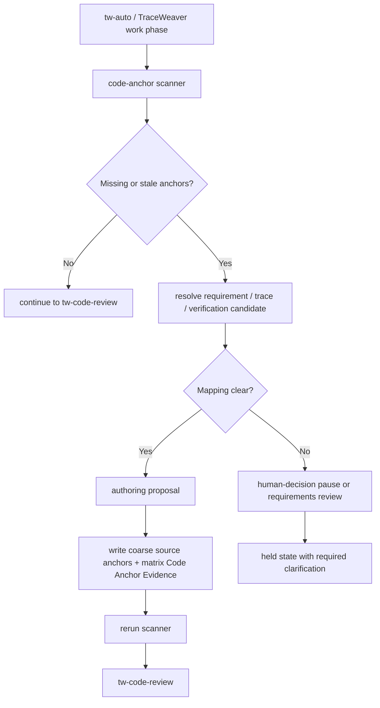

# core: Define TraceWeaver code trace anchor hierarchy

## Summary

This plan corrects a core TraceWeaver traceability gap: implementation artifacts need an intentional code-trace hierarchy, not just after-the-fact review records. TraceWeaver should mark modules/files with the accepted requirement premises they exist to satisfy, mark requirement-bearing entrypoints where behavior materially lives, mark verification artifacts with the evidence they prove, update matrix code-anchor evidence, and pause for human input when requirement or verification mapping is unclear. The authoring path should be part of the TraceWeaver work loop, not a new public skill users must remember.

Authority review: scoped `/ce-doc-review` passed with no findings as `CE-DOC-REVIEW-2026-05-06-REQ-TW-054-HIERARCHY-CLEAN-001`. This accepts the hierarchy correction as planning input for deterministic authoring contract and fixture work only. Deterministic authoring contract/helper fixtures now pass in fixture/temp workspaces; scoped `tw-code-review` passed as `TW-CODE-REVIEW-2026-05-06-TRACE-ANCHOR-AUTHORING-CLEAN-001`; scoped `tw-doc-review` passed as `TW-DOC-REVIEW-2026-05-06-REQ-TW-054-AUTHORING-ALLOWANCE-CLEAN-001`; and the narrow TraceWeaver project-write allowance is open only for unambiguous coarse anchors plus matching Code Anchor Evidence. Active-host behavior, publication, Vestro, clean replacement, and release claims remain held.

---

## Problem Frame

TraceWeaver can now detect missing code/test trace anchors, but detection alone still leaves users doing manual trace plumbing. That is not a new product feature; it is part of what traceability means. Normal implementation work should produce anchored code and linked validation evidence while preserving the core systems-engineering rule: agents may not invent, reinterpret, or change requirements to make code look traceable.

---

## Requirements

- R1. TraceWeaver must define code trace anchors as a core traceability requirement, not as optional feature metadata.
- R2. TraceWeaver must provide a trace-anchor authoring path for changed behavior-bearing implementation and verification artifacts.
- R3. The authoring path must use approved requirements, intent premises, trace IDs, verification IDs, validation questions, and matrix evidence as authority; it must not create or reinterpret requirements on its own.
- R4. Trace anchors must follow a logical hierarchy: module/file anchors identify why the artifact exists and which accepted premise or requirement set it serves; behavior-entrypoint anchors identify functions/classes/commands that materially implement requirement behavior; verification anchors identify tests, fixtures, or smokes that prove the linked verification.
- R5. TraceWeaver must not force anchors onto every helper, private subfunction, data shuffle, or incidental implementation detail unless that unit independently carries requirement-level behavior or a structured reviewer/user-approved navigability finding shows module/file and behavior-entrypoint anchors are insufficient.
- R6. Before deterministic authoring helper, fixture, review, and current operating-mode gates explicitly authorize a narrow project-write allowance, TraceWeaver may only propose anchor and matrix evidence changes for real project files. After those gates pass, when a changed artifact maps unambiguously to accepted authority and verification, TraceWeaver may add or refresh coarse module/file, behavior-entrypoint, and verification anchors.
- R7. When mapping is ambiguous, contradictory, incomplete, missing, or implies a material authority change, TraceWeaver must pause for user clarification or route to requirements/authority review instead of writing anchors.
- R8. Matrix Code Anchor Evidence must be proposed or updated alongside authored code anchors, according to the active write mode, so reviewers can navigate from requirement to artifact to verification.
- R9. `tw-code-review` must stay non-mutating: it may report missing anchors and point to the authoring path, but it must not rewrite source files during review.
- R10. `tw-auto` and the TraceWeaver-controlled work phase must own trace authoring during implementation so users do not have to run a separate manual trace-fix loop.
- R11. Authoring must be fixture-proven and reviewed before any narrow project-write allowance is recorded, and that allowance must stay separate from active-host runtime behavior, Vestro dogfood, publication, clean replacement, or release readiness.

---

## Scope Boundaries

- This plan does not create a new public `tw-tracer` skill in the first slice.
- This plan does not let `tw-traceability-check` mutate files during a review-only invocation.
- This plan does not auto-create requirements, trace IDs, verification IDs, validation questions, or release claims.
- This plan does not annotate every line, helper, private subfunction, or incidental implementation detail.
- This plan does not claim active-host `tw-auto` runtime behavior, publication support, clean CE replacement, full CE parity, package-ready, release-ready, upstream-ready, R31, or Vestro readiness.

### Deferred to Follow-Up Work

- A public `tw-work` or `tw-tracer` facade can be introduced later if dogfood shows users need a direct command.
- Vestro dogfood waits until TraceWeaver proves authoring fixtures, install/discovery, and active-host behavior in this repository.
- Whole-repo baseline anchor migration remains audit/baseline debt, not part of the first authoring path.
- Publication-route integration remains under the separate REQ-TW-053 proof path.

---

## Context & Research

### Relevant Code and Patterns

- `requirements.md` already records REQ-TW-054 for code/test trace anchors and REQ-TW-057 for operating modes.
- `traceability-matrix.md` already contains a Code Anchor Evidence table and the current TRACE/VER chain for scanner proof.
- `plugins/traceweaver-core/skills/tw-traceability-check/scripts/traceweaver-check-code-anchors` is the deterministic scanner that identifies changed behavior-bearing targets and missing anchors.
- `plugins/traceweaver-core/skills/tw-traceability-check/references/code-trace-anchor-contract.md` defines the current anchor shape.
- `plugins/traceweaver-core/skills/tw-auto/SKILL.md` is the intended orchestration surface for work/review/fix closure.
- `plugins/traceweaver-core/skills/tw-code-review/SKILL.md` is the non-mutating review wrapper and should remain a gate, not an editor.
- `scripts/traceweaver-smoke-code-traceability` and `scripts/traceweaver-smoke-tw-skill-behavior` are the closest fixture/smoke patterns to extend.

### Institutional Learnings

- Static fixture proof is not runtime readiness; authoring must remain held until its own fixture, review, install/discovery, and active-host gates pass.
- Broad authority-record polishing created churn. The authoring path must default to changed files and linked verification artifacts, while treating unrelated missing anchors as baseline debt.
- TraceWeaver should guide real implementation progress. Record keeping supports that goal, but should not become the product's main activity.
- Code traceability needs a density rule. Anchors should be high enough in the artifact hierarchy to explain intent and support review, but not so low-level that every helper becomes a requirements database.

### External References

- No external research is needed. This is a local TraceWeaver workflow and plugin-surface design problem using existing repo patterns.

---

## Key Technical Decisions

- Implement trace authoring as a TraceWeaver-controlled work-phase capability, not as a new public command first. This matches the user's preference that the work loop should own trace closure instead of forcing another manual tool call.
- Keep the first slice on the existing packaged worker path: `tw-auto` orchestrates TraceWeaver-controlled work, and packaged `ce-work` receives the authoring rules as the worker implementation surface. A public `tw-work` facade is deferred until the behavior earns it.
- Put the deterministic authoring helper under the callable `tw-traceability-check` skill surface so installed projects can use the same packaged contract and scanner context.
- Keep mutation behind `tw-auto` or TraceWeaver-controlled `ce-work` guidance. `tw-traceability-check` remains a checker by default, and `tw-code-review` remains non-mutating.
- Require a proposal step before writes. Even when mapping is unambiguous, the helper should be able to show the planned anchors and matrix rows before applying them in fixtures and runtime paths.
- Treat ambiguous mappings as human-decision pauses, not as low-confidence auto-writes.
- Prefer module/file-level anchors and behavior-entrypoint anchors over deep helper annotation. Helper/subfunction anchors are exceptions for independently requirement-bearing behavior, not the default.
- Update matrix Code Anchor Evidence in the same authoring transaction as source anchors to avoid anchors that cannot be navigated from authority.

---

## Open Questions

### Resolved During Planning

- Should this be a new `tw-tracer` skill? Not for the first slice. The first implementation should add a skill-local helper and route it through `tw-auto`/TraceWeaver work so users do not have another command to remember.
- Should `tw-code-review` write missing anchors? No. Review stays non-mutating and should point to the authoring path.
- Should `tw-traceability-check` own the helper? Yes, as a packaged skill-local script/reference surface, but default invocation remains check-only unless called by the work loop in authoring mode.

### Deferred to Implementation

- Exact CLI flag names for propose/apply modes are deferred to implementation, but the behavior must distinguish non-mutating proposal from file-writing apply.
- Exact matrix row formatting can follow the existing Code Anchor Evidence table, with implementation allowed to preserve local table style.
- Exact anchor syntax is deferred to implementation, but the placement hierarchy is not: module/file anchors first, behavior-entrypoint anchors where behavior materially implements requirements, verification anchors for tests/smokes, helper/subfunction anchors only by exception.

---

## Output Structure

    plugins/traceweaver-core/
      skills/
        tw-traceability-check/
          scripts/
            traceweaver-check-code-anchors
            traceweaver-author-code-anchors
          references/
            code-trace-anchor-contract.md
            trace-anchor-authoring.md
        tw-auto/
          references/
            traceweaver-operating-modes.md
            trace-anchor-authoring.md
    fixtures/
      code-trace-authoring/
        unambiguous-code-anchor/
        unambiguous-test-anchor/
        ambiguous-requirement-pause/
        missing-verification-pause/
        contradictory-authority-pause/
        matrix-update/
        generated-exception/
    scripts/
      traceweaver-smoke-code-trace-authoring

---

## High-Level Technical Design

> *This illustrates the intended approach and is directional guidance for review, not implementation specification. The implementing agent should treat it as context, not code to reproduce.*

---

## Implementation Units

- U1. **Correct code traceability authority**

**Goal:** Correct the requirements and Intent Contract so code trace anchors are treated as a core TraceWeaver traceability capability with an explicit anchor hierarchy, without accepting runtime/project-write behavior yet.

**Requirements:** R1, R3, R4, R5, R7, R8, R10, R11

**Dependencies:** None

**Files:**
- Modify: `requirements.md`
- Modify: `traceability-matrix.md`
- Modify: `.traceweaver/intent-contract.yml`
- Modify: `docs/validation/traceweaver-skill-behavior-audit.md`
- Modify: `docs/validation/traceweaver-controlled-autonomy-alpha.md`

**Approach:**
- Amend the code traceability requirements, likely by extending REQ-TW-054 or adding the next linked `REQ-TW-*`, to state that code anchors are part of the core traceability model.
- Record the anchor hierarchy: module/file premise anchors, behavior-entrypoint anchors, verification anchors, and helper/subfunction anchors only by exception.
- Record held scope explicitly: no project writes, runtime authoring, publication, Vestro use, or release claims until fixtures and reviews pass.
- Add the planned ART/TRACE/ATP/RESULT/VER chain for deterministic authoring proof.

**Patterns to follow:**
- REQ-TW-054 and REQ-TW-057 rows in `requirements.md`.
- TRACE-TW-032 / VER-TW-041 scanner proof rows in `traceability-matrix.md`.

**Test scenarios:**
- Test expectation: none -- this unit records authority only and should be reviewed by `tw-doc-review`.
- Review expectation: authority records must not describe this as a discretionary new feature.

**Verification:**
- Requirements, matrix, Intent Contract, and evidence records agree on accepted planning scope and held runtime/project-write scope.

---

- U2. **Define the code trace anchor hierarchy contract**

**Goal:** Define where anchors belong in code, when TraceWeaver may propose/write them, and when it must pause.

**Requirements:** R1, R2, R3, R4, R5, R6, R7, R8, R9, R10

**Dependencies:** U1

**Files:**
- Create: `plugins/traceweaver-core/skills/tw-traceability-check/references/trace-anchor-authoring.md`
- Create: `plugins/traceweaver-core/skills/tw-auto/references/trace-anchor-authoring.md`
- Modify: `plugins/traceweaver-core/skills/tw-traceability-check/references/code-trace-anchor-contract.md`
- Modify: `plugins/traceweaver-core/skills/tw-traceability-check/SKILL.md`
- Modify: `plugins/traceweaver-core/skills/tw-auto/SKILL.md`
- Modify: `plugins/traceweaver-core/skills/tw-code-review/SKILL.md`
- Test: `scripts/traceweaver-smoke-codex-discovery`
- Test: `scripts/traceweaver-smoke-codex-host-registry`

**Approach:**
- Define authoring modes: propose-only, apply-under-work-loop, and pause.
- Define anchor levels: module/file premise anchor, behavior-entrypoint anchor, verification anchor, and rare helper/subfunction anchor by exception.
- Define unambiguous mapping criteria: current requirement exists, trace row exists or is being updated from approved authority, verification ID already exists in reviewed matrix/ATP/VER authority or was introduced by a separate reviewed authority update, validation path exists, and only one candidate requirement/verification path fits the changed file.
- Define pause criteria: multiple candidate requirements, missing verification, changed validation question, stale authority, requirement wording change, missing matrix chain, conflicting anchors, or unclear file role.
- Define density rules: do not annotate every helper, do not duplicate the same requirement anchor on every nested function, and do not treat code-anchor volume as proof quality.
- Mirror the reference under `tw-auto` so direct callable installs do not depend on plugin-level paths.
- Update `tw-code-review` to say missing anchors should route back to authoring, not be silently fixed during review.

**Patterns to follow:**
- `plugins/traceweaver-core/skills/tw-traceability-check/references/code-trace-anchor-contract.md`
- `plugins/traceweaver-core/skills/*/references/traceweaver-operating-modes.md`

**Test scenarios:**
- Happy path: install/discovery smoke proves the authoring contract is present beside installed `tw-traceability-check` and `tw-auto`.
- Error path: `tw-code-review` contract still blocks mutation during review-only use.
- Error path: contract says unclear requirement mapping pauses instead of writing.
- Error path: helper/subfunction-level annotation is refused unless the fixture marks it as independently requirement-bearing.

**Verification:**
- The contract is readable as a skill-local packaged reference and does not require another public skill to use.

---

- U3. **Implement deterministic authoring helper**

**Goal:** Add a packaged helper that can produce anchor proposals and apply them to fixture copies when mapping is unambiguous.

**Requirements:** R2, R3, R4, R5, R6, R7, R8, R11

**Dependencies:** U2

**Files:**
- Create: `plugins/traceweaver-core/skills/tw-traceability-check/scripts/traceweaver-author-code-anchors`
- Create: `scripts/traceweaver-smoke-code-trace-authoring`
- Create: `fixtures/code-trace-authoring/unambiguous-code-anchor/`
- Create: `fixtures/code-trace-authoring/unambiguous-test-anchor/`
- Create: `fixtures/code-trace-authoring/ambiguous-requirement-pause/`
- Create: `fixtures/code-trace-authoring/missing-verification-pause/`
- Create: `fixtures/code-trace-authoring/contradictory-authority-pause/`
- Create: `fixtures/code-trace-authoring/generated-exception/`
- Modify: `plugins/traceweaver-core/skills/tw-traceability-check/scripts/traceweaver-check-code-anchors`
- Test: `scripts/traceweaver-smoke-code-trace-authoring`
- Test: `scripts/traceweaver-smoke-code-traceability`

**Approach:**
- Build the helper as a skill-local deterministic script, not as a repo-root-only utility.
- Support non-mutating proposal output first: target file, proposed anchor role, requirement ID, trace ID, verification ID, matrix row update, and reason.
- Support apply mode only for unambiguous cases and fixture/temp workspaces in the first proof.
- Implement density-aware placement: module/file anchors near file headers or module docs, behavior-entrypoint anchors near exported/public commands or core classes/functions, verification anchors near test/smoke entrypoints, and helper anchors only when explicitly justified.
- Preserve existing file style where possible: shell comments for scripts, Markdown comments for Markdown, line comments for TypeScript/JavaScript.
- Require the scanner to pass after apply mode; failed recheck means the authoring result is not accepted.
- Never write to real repository authority files in fixture smoke except through intentional temp copies.

**Execution note:** Implement fixture-first, with a proposal-only assertion before apply-mode assertions.

**Patterns to follow:**
- `plugins/traceweaver-core/skills/tw-traceability-check/scripts/traceweaver-check-code-anchors`
- `scripts/traceweaver-smoke-code-traceability`
- `scripts/traceweaver-smoke-structured-findings`

**Test scenarios:**
- Happy path: changed behavior file missing a file-level anchor receives one valid file-role anchor and scanner passes afterward.
- Happy path: changed module with a clear accepted premise receives a module/file premise anchor without annotating every helper.
- Happy path: changed requirement-bearing entrypoint receives a behavior-entrypoint anchor.
- Happy path: changed smoke/test missing a verification anchor receives one `verifies=` anchor and scanner passes afterward.
- Error path: two candidate requirements match the file and helper emits a human-decision pause with no file changes.
- Error path: requirement exists but no verification path exists and helper pauses with no file changes.
- Error path: existing anchor conflicts with the proposed requirement and helper pauses with no file changes.
- Edge case: generated-file exception is proposed only when a matching matrix exception exists or is part of an approved authority update.
- Regression: helper/subfunction-only annotation is not produced when the module/file and behavior-entrypoint anchors already explain the requirement trace.
- Regression: proposal mode produces no file changes.
- Regression: apply mode is refused outside explicit authoring/work-loop context.

**Verification:**
- Smoke output proves proposal/apply/pause behavior and shows the real repository is unchanged during fixture proof.

---

- U4. **Author matrix Code Anchor Evidence updates**

**Goal:** Update matrix evidence in the same authoring path as source anchors.

**Requirements:** R3, R4, R5, R6, R8, R11

**Dependencies:** U3

**Files:**
- Create: `fixtures/code-trace-authoring/matrix-update/`
- Modify: `plugins/traceweaver-core/skills/tw-traceability-check/scripts/traceweaver-author-code-anchors`
- Modify: `scripts/traceweaver-smoke-code-trace-authoring`
- Create/modify fixture-local `traceability-matrix.md` copies under `fixtures/code-trace-authoring/matrix-update/`
- Test: `scripts/traceweaver-smoke-code-trace-authoring`
- Test: `scripts/traceweaver-smoke-code-traceability`

**Approach:**
- Make matrix update a first-class part of the authoring proposal, not an afterthought.
- Add Code Anchor Evidence rows only for high-value behavior-bearing files, entrypoints, tests, fixtures, and smokes.
- Preserve existing matrix table structure and avoid rewriting unrelated authority sections.
- In fixture proof, write matrix changes only inside fixture/temp workspaces until the behavior is code/doc reviewed. Real `traceability-matrix.md` authoring for changed project files is deferred to the accepted work-loop/dogfood units.

**Patterns to follow:**
- Code Anchor Evidence table in `traceability-matrix.md`.
- Matrix unchanged guards in existing smoke scripts.

**Test scenarios:**
- Happy path: authoring a source anchor also proposes/updates the matching Code Anchor Evidence row.
- Happy path: authoring a verification anchor links the test/smoke path to the same verification ID.
- Happy path: matrix row describes the artifact-level role without requiring every helper/subfunction to appear as a row.
- Error path: matrix has a conflicting row and helper pauses without changing source or matrix.
- Regression: unrelated matrix sections are unchanged after fixture apply.

**Verification:**
- Scanner passes against the fixture after both source anchors and matrix evidence are applied.

---

- U5. **Integrate authoring into the TraceWeaver work loop**

**Goal:** Let `tw-auto` and TraceWeaver-controlled work run trace authoring before review without creating a separate user-facing command.

**Requirements:** R4, R5, R7, R8, R9, R10, R11

**Dependencies:** U3, U4

**Files:**
- Modify: `plugins/traceweaver-core/skills/tw-auto/SKILL.md`
- Create: `plugins/traceweaver-core/skills/tw-work/SKILL.md`
- Create: `plugins/traceweaver-core/skills/tw-work/references/trace-anchor-authoring.md`
- Create: `plugins/traceweaver-core/skills/tw-work/references/traceweaver-operating-modes.md`
- Modify: `plugins/traceweaver-core/skills/ce-work/SKILL.md`
- Modify: `plugins/traceweaver-core/skills/tw-code-review/SKILL.md`
- Modify: `plugins/traceweaver-core/skills/tw-auto/references/traceweaver-operating-modes.md`
- Modify: `scripts/traceweaver-smoke-tw-skill-behavior`
- Create: `fixtures/tw-skill-behavior/tw-auto-trace-authoring-clean/`
- Create: `fixtures/tw-skill-behavior/tw-auto-trace-authoring-pause/`
- Test: `scripts/traceweaver-smoke-tw-skill-behavior`
- Test: `scripts/traceweaver-smoke-code-trace-authoring`

**Approach:**
- Update `tw-auto` Implementation Gate Mode to route implementation through `tw-work`, which runs scan -> propose authoring -> apply only clear mappings -> rerun scan -> continue to `tw-code-review`.
- Keep TraceWeaver-packaged `ce-work` as the underlying coding engine, but make `tw-work` own anchors, matrix rows, verification handoff, and no-publication return to `tw-auto` when authority is unchanged and mapping is unambiguous.
- Keep `tw-code-review` review-only and non-mutating; it reports missing anchors and routes to the work loop.
- Add fixture states for clean authoring and human-decision pause.

**Patterns to follow:**
- Current `tw-auto` closure-loop instructions and `tw-work` worker facade.
- `scripts/traceweaver-smoke-tw-skill-behavior` clean/blocked fixture style.

**Test scenarios:**
- Happy path: clean implementation-mode fixture runs authoring before review and reaches passable scanner state.
- Error path: ambiguous mapping pauses with a human-decision output and does not call CE review as accepted closure.
- Error path: changed authority routes to requirements/authority review, not anchor authoring.
- Error path: work loop refuses to spread anchors into low-level helpers when the accepted hierarchy already gives adequate trace navigation.
- Regression: `tw-code-review` remains non-mutating and only reports the missing-anchor path.
- Integration: work-loop fixture preserves traceability findings before CE review findings.

**Verification:**
- Smoke output proves `tw-auto`/`tw-work` work-loop authoring behavior as deterministic fixture evidence only, with runtime and project-write claims held until separately accepted.

---

- U6. **Install/discovery proof for authoring surfaces**

**Goal:** Prove the authoring helper and references exist in installed callable skill roots.

**Requirements:** R1, R7, R8

**Dependencies:** U2, U3, U5

**Files:**
- Modify: `scripts/traceweaver-smoke-codex-discovery`
- Modify: `scripts/traceweaver-smoke-codex-host-registry`
- Modify: `.traceweaver/intent-contract.yml`
- Modify: `docs/validation/traceweaver-controlled-autonomy-alpha.md`
- Modify: `docs/validation/traceweaver-skill-behavior-audit.md`
- Test: `scripts/traceweaver-smoke-codex-discovery`
- Test: `scripts/traceweaver-smoke-codex-host-registry`

**Approach:**
- Extend isolated install/discovery to assert `traceweaver-author-code-anchors` and `trace-anchor-authoring.md` are present under packaged and direct-callable skill roots.
- Extend host registry smoke to report presence but keep active-host runtime held until a separate runtime proof.
- Record source hashes and fixture aggregate hashes without accepting real project writes yet.

**Patterns to follow:**
- Existing scanner/contract install checks in `scripts/traceweaver-smoke-codex-discovery`.
- Existing active-host held reporting in `scripts/traceweaver-smoke-codex-host-registry`.

**Test scenarios:**
- Happy path: isolated install includes authoring helper and references under `tw-traceability-check`.
- Happy path: isolated install includes `tw-auto` authoring reference.
- Error path: missing authoring helper fails discovery smoke.
- Regression: active-host smoke reports held/stale state instead of claiming runtime behavior when installed copies do not match.

**Verification:**
- Installed skill surface can resolve the checker, scanner, authoring helper, and authoring contract from callable paths.

---

- U7. **Dogfood trace authoring on TraceWeaver**

**Goal:** Use the authoring path on a narrow TraceWeaver slice before attempting Vestro.

**Requirements:** R1, R2, R3, R4, R5, R7, R8

**Dependencies:** U6

**Precondition:** U3-U6 authoring helper behavior, deterministic fixtures, matrix-update behavior, work-loop integration, and install/discovery evidence must pass required code review and scoped authority doc review before U7 modifies real TraceWeaver files. The authority records must also explicitly open a narrow TraceWeaver dogfood/project-write allowance for the named slice. That allowance must not accept broad runtime/project-write support, Vestro support, publication, clean replacement, or release readiness.

**Files:**
- Modify: selected behavior-bearing files already touched by this branch
- Modify: `traceability-matrix.md`
- Modify: `.traceweaver/intent-contract.yml`
- Modify: `docs/validation/traceweaver-dogfood-audit.md`
- Test: `scripts/traceweaver-smoke-code-trace-authoring`
- Test: `scripts/traceweaver-smoke-code-traceability`
- Test: `scripts/traceweaver-smoke-tw-skill-behavior`

**Approach:**
- Pick a narrow set of changed behavior-bearing files from the current branch, not the whole repository.
- Use proposal mode first, inspect proposed anchors, then apply only unambiguous anchors.
- Record ambiguous mappings as held dogfood findings instead of forcing anchors.
- Update Code Anchor Evidence for only the authored surfaces.
- Keep Vestro deferred until this dogfood proves the flow improves traceability without restarting authority churn.

**Patterns to follow:**
- `docs/validation/traceweaver-dogfood-audit.md`
- Current Code Anchor Evidence table in `traceability-matrix.md`.

**Test scenarios:**
- Happy path: at least one changed TraceWeaver script or skill gets a navigable source anchor and matching matrix row.
- Happy path: at least one smoke/fixture verification anchor links to the matching VER row.
- Error path: ambiguous authority mapping is recorded as a held dogfood finding and pauses.
- Regression: scanner passes for authored changed-file scope after authoring.
- Regression: unrelated baseline debt does not block the dogfood slice.

**Verification:**
- Dogfood evidence shows trace authoring reduces missing-anchor findings on changed files without claiming broad runtime/project-write support.

---

## System-Wide Impact

- **Interaction graph:** `tw-auto` and `tw-work` become the mutation path; `tw-traceability-check` provides scanner and authoring helper surfaces; `tw-code-review` remains the non-mutating review gate.
- **Error propagation:** Ambiguous mapping must produce a human-decision pause that blocks accepted closure until clarified.
- **State lifecycle risks:** Source anchors and matrix Code Anchor Evidence must be updated together or neither accepted.
- **API surface parity:** This plan strengthens TraceWeaver implementation gates only; it does not add full CE parity or final publication behavior.
- **Integration coverage:** Fixture coverage must prove scanner -> authoring proposal -> apply -> scanner pass -> wrapper review sequence.
- **Unchanged invariants:** Requirements changes remain human-controlled; runtime, publication, clean replacement, package/release/upstream, and Vestro claims remain held.

---

## Risks & Dependencies

| Risk | Mitigation |
|------|------------|
| Authoring writes plausible but wrong anchors. | Require unambiguous authority mapping and pause on multiple or missing candidates. |
| A new public `tw-tracer` command increases workflow burden. | Keep first slice inside `tw-auto`/`tw-work` TraceWeaver work and make review wrappers route back to that path. |
| Matrix rows drift from source anchors. | Apply source and matrix updates in one authoring transaction, then rerun scanner. |
| Review tools mutate files unexpectedly. | Keep `tw-code-review` and default `tw-traceability-check` invocations non-mutating. |
| Authoring works in repo but not installed projects. | Package helper and references under skill-local callable paths and prove install/discovery. |
| The first dogfood slice restarts broad churn. | Scope dogfood to changed files and linked verification artifacts only; record unrelated gaps as baseline debt. |

---

## Documentation / Operational Notes

- `tw-auto` docs should describe trace authoring as part of implementation closure, not as a separate record-keeping step.
- `tw-code-review` docs should say missing anchors route back to the work loop.
- The authoring contract should explain that anchors are evidence pointers, not requirement authority.
- Any Vestro instructions should wait until TraceWeaver dogfood passes and should start with bootstrap/authority checks in Vestro, not copying skill code into Vestro.

---

## Sources & References

- Current requirements: `requirements.md`
- Existing operating-mode/code-traceability plan: `docs/plans/2026-05-06-001-feat-traceweaver-operating-modes-code-traceability-plan.md`
- Traceability scanner: `plugins/traceweaver-core/skills/tw-traceability-check/scripts/traceweaver-check-code-anchors`
- Code anchor contract: `plugins/traceweaver-core/skills/tw-traceability-check/references/code-trace-anchor-contract.md`
- TraceWeaver work loop: `plugins/traceweaver-core/skills/tw-auto/SKILL.md`
- Code review wrapper: `plugins/traceweaver-core/skills/tw-code-review/SKILL.md`
- Skill behavior evidence: `docs/validation/traceweaver-skill-behavior-audit.md`
