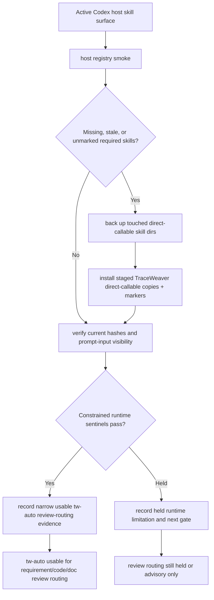

# feat: Reconcile active host TraceWeaver workflow skills

## Summary

This plan makes the staged TraceWeaver workflow surface usable in the active Codex host by reconciling the installed direct-callable skills, proving prompt-visible registry state, and recording a narrow evidence update. The target outcome is that `tw-auto` is safe to use as the normal TraceWeaver entrypoint for requirement, code, and document review routing in this project, while full autonomous implementation closure, publication, clean replacement, and Vestro use remain held.

---

## Problem Frame

TraceWeaver now has the intended staged skill shape: `tw-auto` routes implementation through `tw-work`, code review through `tw-code-review`, document review through `tw-doc-review`, and traceability through `tw-traceability-check`. The active Codex host has not caught up: the host probe reports missing `tw-work` and `lfg`, stale installed skills, missing skill-local references, and prompt-input visibility gaps. That leaves users able to see the planned product direction but not reliably use it from the actual Codex skill surface.

---

## Requirements

- R1. The active Codex host must expose the current staged `tw-auto`, `tw-work`, `tw-code-review`, `tw-doc-review`, `tw-traceability-check`, `tw-requirements-review`, `tw-authority-gate`, `tw-grill`, `lfg`, and selected CE continuity skills as direct-callable TraceWeaver-owned skill copies.
- R2. Reconciliation must not blindly overwrite unowned user skill directories; it must back up or refuse before replacing active host skill surfaces.
- R3. Installed direct-callable skill copies must include TraceWeaver ownership markers and source-matching `SKILL.md` hashes.
- R4. Installed skill-local references and scripts required by the current staged workflow must be present and source-matching in callable skill roots.
- R5. Host proof must include both filesystem trust and `codex debug prompt-input` visibility for the required skill list.
- R6. Runtime proof may accept constrained hash-sentinel/file-access evidence only for the surfaces it actually proves; it must not overclaim full autonomous closure-loop behavior.
- R7. Evidence updates must record a narrow allowed-use state: `tw-auto` usable for requirement/code/doc review routing in this repo after host reconciliation, with implementation/project writes, publication, Vestro dogfood, and clean replacement still held unless separately proven.
- R8. Active-host mutation must be preceded by deterministic reconciliation proof in a temporary Codex home that covers missing, stale, unmarked, current, backup, and refusal cases without touching the real host.

**Origin trace:** R1, R5, R6, and R7 carry forward the controlled-autonomy requirements for workflow composition, `tw-auto`, held runtime claims, and suggested next-step handoff from `docs/brainstorms/2026-05-01-traceweaver-controlled-autonomy-requirements.md`.

---

## Scope Boundaries

- This plan does not implement full `tw-auto` autonomous task closure.
- This plan does not approve project-write trace-anchor authoring beyond fixture/static evidence already recorded elsewhere.
- This plan does not publish, commit, push, or open PRs.
- This plan does not claim clean CE replacement or uninstall the CE plugin beyond the current controlled host configuration.
- This plan does not make Vestro ready for TraceWeaver dogfood.
- This plan does not broaden requirements or change the controlled-autonomy product contract.

### Deferred to Follow-Up Work

- Full active-host `tw-auto` task/plan closure-loop runtime proof remains under REQ-TW-056.
- Active project-write trace-anchor authoring remains under REQ-TW-054.
- Controlled publication route proof remains under REQ-TW-053.
- Vestro dogfood waits until this host reconciliation and the relevant runtime proofs are recorded cleanly.

---

## Context & Research

### Relevant Code and Patterns

- `src/index.ts` is the existing Codex installer. It installs packaged skills outside `.codex/skills`, direct-callable copies under `.codex/skills`, selected agent TOML files, plugin references, install manifests, and `.traceweaver-core-install.json` markers.
- `scripts/traceweaver-smoke-codex-discovery` proves isolated install/direct-callable visibility and currently expects `tw-work`.
- `scripts/traceweaver-smoke-codex-host-registry` probes the active Codex host, direct-callable markers, source hashes, skill-local files, `codex debug prompt-input`, and constrained `codex exec` runtime sentinel behavior.
- `scripts/traceweaver-smoke-tw-skill-behavior` proves static/fixture review routing and currently reports active-host wrapper/runtime states as held when installed hashes are stale.
- `plugins/traceweaver-core/skills/tw-auto/SKILL.md` is the intended user entrypoint for TraceWeaver-controlled workflow routing.
- `plugins/traceweaver-core/skills/tw-work/SKILL.md` is the renamed implementation worker facade and must be installed before `tw-auto` can route implementation work without falling back to raw `ce-work`.

### Institutional Learnings

- Static fixture proof and active-host usability are separate gates.
- The installer intentionally fails closed on unmarked direct-callable skill conflicts, so active-host reconciliation needs an explicit backup/refusal path rather than silent overwrites.
- Broad authority-record polishing created churn; this plan records only the narrow evidence needed to make current-host `tw-auto` review routing usable.
- Prompt visibility must be checked with `codex debug prompt-input`, not inferred from files alone.

### External References

- No external research is needed. This is a local TraceWeaver host-install and skill-surface reconciliation problem using existing repo scripts and validation patterns.

---

## Key Technical Decisions

- Add an explicit active-host reconciliation path instead of weakening the existing installer fail-closed behavior. The regular installer should remain conservative; the reconciliation path can handle the known active-host migration with backup and marker checks.
- Reconcile the whole required TraceWeaver direct-callable set, not only the five newly stale skills. `tw-auto` usability depends on `lfg`, wrapper skills, TraceWeaver-native gates, and selected CE continuity skills being coherent together.
- Preserve unrelated host skill directories. The reconciliation path should only touch the required TraceWeaver-owned or backed-up direct-callable names.
- Treat active-host runtime as staged proof levels. Filesystem plus prompt-input visibility can approve "usable review-routing entrypoint"; wrapper file-access sentinels can approve limited runtime observations; full autonomous task closure remains held.
- Keep the evidence update narrow. The accepted claim after this plan should be "the current host exposes the required TraceWeaver workflow skills and `tw-auto` may be used for requirement/code/doc review routing in this repo," not "TraceWeaver is fully autonomous."

---

## Open Questions

### Resolved During Planning

- Should this be a manual copy? No. Manual copy risks silent overwrite and stale evidence; use an explicit reconciliation path with backup and smoke proof.
- Should the existing installer be made permissive? No. Keep fail-closed install behavior and add a deliberate host-reconciliation path for active host migration.
- Should this prove full `tw-auto` closure? No. It proves the entrypoint is installed/current/visible and can route review workflows. Closure-loop runtime proof remains a separate gate.

### Deferred to Implementation

- Exact backup directory naming is deferred to implementation, but backups must be discoverable from TraceWeaver host reconciliation evidence.
- Whether reconciliation is a new script or a guarded installer mode is deferred to implementation. The behavior boundary is fixed: backup/refuse before replacing unowned direct-callable skills.
- Exact runtime sentinel prompts can follow existing smoke style, but they must not claim more than the prompt proves.

---

## High-Level Technical Design

> *This illustrates the intended approach and is directional guidance for review, not implementation specification. The implementing agent should treat it as context, not code to reproduce.*

---

## Implementation Units

- U1. **Define active-host reconciliation safety contract**

**Goal:** Establish the exact allowed host mutation boundary before changing the active Codex skill surface.

**Requirements:** R1, R2, R3, R4, R7

**Dependencies:** None

**Files:**
- Modify: `docs/validation/traceweaver-u9-codex-runtime-discovery.md`
- Modify: `docs/validation/traceweaver-controlled-autonomy-alpha.md`
- Modify: `.traceweaver/intent-contract.yml`
- Modify: `traceability-matrix.md`

**Approach:**
- Record that the next active-host action is a reconciliation of required direct-callable TraceWeaver skills, not broad authority/product behavior.
- Name the touched skill set and the held claims before any host mutation evidence is accepted.
- Keep the safety rule explicit: replace only required direct-callable skill names after backing up or proving ownership; preserve unrelated host skills.
- Avoid requirements churn unless implementation discovers a genuine new authority gap.

**Patterns to follow:**
- U9 Unit 11 active-host reconciliation evidence in `docs/validation/traceweaver-u9-codex-runtime-discovery.md`.
- Existing held-claim wording in `traceability-matrix.md` VER-TW-041 and VER-TW-044.

**Test scenarios:**
- Test expectation: none -- this unit records authority/evidence scope and is reviewed through document review.

**Verification:**
- Evidence records distinguish host-reconciliation permission from runtime, publication, Vestro, and clean-replacement claims.

---

- U2. **Add guarded active-host reconciliation behavior**

**Goal:** Provide a repeatable way to reconcile the active Codex host skill surface from the staged TraceWeaver plugin without blind overwrite.

**Requirements:** R1, R2, R3, R4

**Dependencies:** U1

**Files:**
- Create or modify: `scripts/traceweaver-reconcile-codex-host-skills`
- Create: `scripts/traceweaver-smoke-codex-host-reconciliation`
- Modify: `src/index.ts`
- Test: `scripts/traceweaver-smoke-codex-host-reconciliation`
- Test: `scripts/traceweaver-smoke-codex-discovery`
- Test: `scripts/traceweaver-smoke-codex-host-registry`

**Approach:**
- Either add a dedicated reconciliation script or a guarded installer mode that can handle existing unmarked/stale active skill directories.
- Back up each touched required direct-callable directory before replacement when it is not already a current TraceWeaver-marked copy.
- Copy current staged plugin skills into both packaged and direct-callable target roots, preserving the existing registry-shape separation.
- Write or refresh `.traceweaver-core-install.json` direct-callable markers for each installed skill.
- Fail closed when a required target cannot be backed up, copied, marked, or hash-verified.
- Leave unrelated host skill directories untouched.
- Prove the reconciliation behavior first in a temporary `CODEX_HOME` fixture that simulates missing, stale marked, stale unmarked, already-current, and unreadable/refusal cases.

**Patterns to follow:**
- `src/index.ts` direct-callable marker and manifest behavior.
- Prior host backup pattern recorded in U9 evidence.

**Test scenarios:**
- Happy path: active host with missing `tw-work` and stale TraceWeaver-required skills -> touched skills are backed up, current copies are installed, markers are written, and source hashes match.
- Edge case: already-current TraceWeaver-marked skill -> reconciliation refreshes or leaves it current without creating an unnecessary conflict.
- Edge case: temporary host contains unrelated skills outside the required TraceWeaver direct-callable set -> reconciliation leaves those directories untouched.
- Error path: required target exists but cannot be read, copied, backed up, or marked -> reconciliation fails before partial success is recorded.
- Error path: source plugin skill is missing or hash verification fails after copy -> reconciliation fails and reports the affected skill.
- Integration: deterministic host-reconciliation smoke proves backup and refusal behavior in a temporary Codex home before U4 mutates the active host.
- Integration: isolated temporary `CODEX_HOME` run still passes the existing discovery smoke and does not regress normal installer behavior.

**Verification:**
- Reconciliation can make a previously stale/missing host surface filesystem-current without weakening the existing fail-closed installer path.

---

- U3. **Strengthen active-host registry proof for `tw-auto` review routing**

**Goal:** Prove the active host sees the current `tw-auto` review-routing surface and its required direct-callable dependencies.

**Requirements:** R1, R3, R4, R5, R6, R7

**Dependencies:** U2

**Files:**
- Modify: `scripts/traceweaver-smoke-codex-host-registry`
- Modify: `scripts/traceweaver-smoke-tw-skill-behavior`
- Test: `scripts/traceweaver-smoke-codex-host-registry`
- Test: `scripts/traceweaver-smoke-tw-skill-behavior`

**Approach:**
- Keep the host registry filesystem checks for required direct-callable skills, markers, source hashes, and skill-local files.
- Keep `codex debug prompt-input` as the prompt-visible registry proof.
- Add or refine constrained runtime sentinel checks for the current `tw-auto` and `tw-work` skill files when useful, without claiming the model executed a full autonomous closure loop.
- Ensure `tw-code-review`, `tw-doc-review`, and `tw-traceability-check` remain part of the runtime proof boundary for review routing.
- Emit explicit held states when a runtime sentinel is prompt-satisfied file-access only or when closure-loop behavior remains unproven.

**Patterns to follow:**
- Existing hash-sentinel pattern in `scripts/traceweaver-smoke-codex-host-registry`.
- Existing active-host held/pass output style in `scripts/traceweaver-smoke-tw-skill-behavior`.

**Test scenarios:**
- Happy path: all required direct-callable skills are present, marked, source-current, and visible in prompt-input -> host registry proof passes.
- Edge case: filesystem is current but prompt-input omits a required skill -> filesystem pass remains separate and registry discovery stays held.
- Error path: `tw-work` or `lfg` missing -> smoke emits held missing-skill state and does not claim `tw-auto` usability.
- Error path: wrapper skill hash is stale -> smoke emits held stale-skill state and keeps review-routing runtime held.
- Integration: constrained runtime sentinel for `tw-auto`/`tw-work` records only installed file access or explicit held status, not autonomous task completion.

**Verification:**
- Smokes show whether `tw-auto` is usable for review routing and clearly separate that from full autonomous runtime closure.

---

- U4. **Run active-host reconciliation and capture evidence**

**Goal:** Apply the guarded reconciliation to the active Codex host and capture the before/after proof needed to use `tw-auto` in this project.

**Requirements:** R1, R2, R3, R4, R5, R6, R7

**Dependencies:** U2, U3

**Files:**
- Modify: `docs/validation/traceweaver-u9-codex-runtime-discovery.md`
- Modify: `docs/validation/traceweaver-controlled-autonomy-alpha.md`
- Modify: `.traceweaver/intent-contract.yml`
- Modify: `traceability-matrix.md`
- Test: `scripts/traceweaver-smoke-codex-host-reconciliation`

**Approach:**
- Capture the pre-reconciliation held state from the host registry smoke.
- Run the deterministic host-reconciliation smoke in a temporary Codex home and require it to pass before touching the active Codex host.
- Run the guarded active-host reconciliation.
- Capture the post-reconciliation host registry smoke and TW skill behavior smoke.
- Record exact allowed use:
  - allowed: `tw-auto` as current-host entrypoint for requirement/code/doc review routing in this TraceWeaver repo;
  - held: full task closure, project-write authoring, publication, Vestro dogfood, clean replacement, and release claims.
- Keep raw temp paths or private host details out of public-facing claims unless already consistent with existing validation evidence style.

**Patterns to follow:**
- `docs/validation/traceweaver-u9-codex-runtime-discovery.md` Unit 11 evidence wording.
- `docs/validation/traceweaver-controlled-autonomy-alpha.md` Materialized Files and Allowed Use sections.

**Test scenarios:**
- Test expectation: none -- this unit records operational evidence. Verification is the before/after smoke output and scoped document review.

**Verification:**
- The evidence records cite the post-reconciliation smoke outputs and do not overclaim runtime behavior beyond what those smokes prove.

---

- U5. **Install-readiness review and handoff**

**Goal:** Close the plan with review and a direct next-step recommendation for using `tw-auto` safely.

**Requirements:** R5, R6, R7

**Dependencies:** U4

**Files:**
- Modify: `docs/validation/traceweaver-u9-codex-runtime-discovery.md`
- Modify: `docs/validation/traceweaver-controlled-autonomy-alpha.md`
- Modify: `.traceweaver/intent-contract.yml`
- Modify: `traceability-matrix.md`
- Test: `scripts/traceweaver-smoke-codex-host-registry`
- Test: `scripts/traceweaver-smoke-tw-skill-behavior`

**Approach:**
- Run scoped review on the reconciliation behavior and evidence updates.
- Address only findings that affect active-host usability, ownership/backups, prompt visibility, stale hashes, or held-claim boundaries.
- Name the next safe TraceWeaver command in the final evidence: use `tw-auto` for requirement/code/doc review routing on this repo, with publication and full closure still held.

**Patterns to follow:**
- Existing "next CE/TW step" requirement in `requirements.md`.
- Scoped review posture introduced by REQ-TW-057 to avoid broad churn.

**Test scenarios:**
- Happy path: final reviewed evidence names `tw-auto` as usable for review routing and names the remaining held gates.
- Error path: review finds stale/missing skill evidence -> final state remains held and names the exact next reconciliation step.

**Verification:**
- Code review and scoped document review pass for the reconciliation behavior/evidence, or the final evidence records the remaining held blocker.

---

## System-Wide Impact

- **Interaction graph:** `tw-auto` becomes the user-facing entrypoint; `tw-work`, `tw-code-review`, `tw-doc-review`, `tw-traceability-check`, `tw-requirements-review`, `tw-authority-gate`, `lfg`, and selected CE continuity skills must all be installed coherently for that entrypoint to be usable.
- **Error propagation:** Reconciliation errors must fail before claiming install success. Host smoke held states remain valid outputs when prompt visibility or runtime sentinels do not pass.
- **State lifecycle risks:** Active host skill replacement touches user-level Codex state. Backups and markers are required before replacing existing direct-callable directories.
- **API surface parity:** Isolated install, active-host install, prompt-input registry, and runtime sentinel evidence must agree on the required skill list.
- **Integration coverage:** Filesystem checks alone are insufficient; prompt-input visibility is required before saying the user can invoke the skills.
- **Global host impact:** The active Codex skill surface is user-level, not repo-local. Evidence may approve TraceWeaver use in this repo only, but the mutation can affect prompt-visible skills in other repos; the plan therefore preserves unrelated skills and keeps Vestro/clean-replacement claims held.
- **Unchanged invariants:** `tw-code-review` and `tw-doc-review` remain review wrappers, `tw-work` remains non-publishing, and `tw-auto` may not publish or approve requirement changes without separate gates.

---

## Risks & Dependencies

| Risk | Mitigation |
|------|------------|
| Reconciliation overwrites a user-owned skill directory. | Back up or refuse before replacement; touch only the required TraceWeaver direct-callable names; preserve unrelated host skills. |
| The first proof of backup/refusal happens on the real host. | Add a temporary-host reconciliation smoke and require it to pass before active-host mutation. |
| Files are current but Codex prompt registry is stale. | Keep `codex debug prompt-input` as a separate proof gate and record held state until visible. |
| Runtime sentinel is mistaken for full autonomous behavior. | Use narrow output labels and evidence wording: review-routing usable, closure-loop runtime held. |
| Evidence update restarts broad authority churn. | Restrict edits to host reconciliation evidence, hashes, and held/allowed-use statements that directly affect this gate. |
| Active host is changed but not reproducible. | Add or use a repeatable reconciliation command/script and record backup/evidence locations in validation records. |

---

## Documentation / Operational Notes

- The final user-facing guidance should be simple: after reconciliation proof passes, use `tw-auto` for requirement/code/doc review routing in this repo.
- The final evidence must still warn that full `tw-auto` implementation closure, project-write authoring, publication, Vestro use, and clean replacement are held.
- Any host backup location should be recorded in validation evidence but not treated as product authority.

---

## Sources & References

- **Origin document:** [docs/brainstorms/2026-05-01-traceweaver-controlled-autonomy-requirements.md](../brainstorms/2026-05-01-traceweaver-controlled-autonomy-requirements.md)
- Related requirements: `requirements.md`
- Related matrix: `traceability-matrix.md`
- Current installer: `src/index.ts`
- Isolated install smoke: `scripts/traceweaver-smoke-codex-discovery`
- Active host smoke: `scripts/traceweaver-smoke-codex-host-registry`
- TW behavior smoke: `scripts/traceweaver-smoke-tw-skill-behavior`
- Workflow entrypoint: `plugins/traceweaver-core/skills/tw-auto/SKILL.md`
- Implementation worker: `plugins/traceweaver-core/skills/tw-work/SKILL.md`
