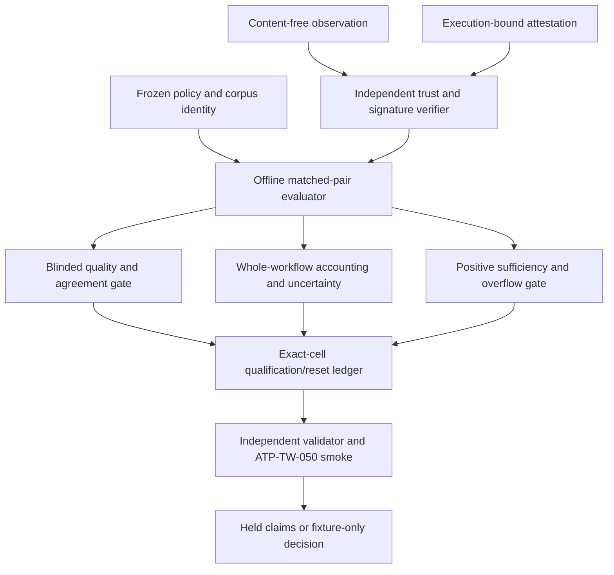

# Deterministic Offline Metric-Routing Harness - Plan

## Goal Capsule

Build the deterministic, offline-only portion of `ART-TW-080` and its complete `ATP-TW-050` acceptance package. The artifact verifies evidence-envelope integrity, policy and matched-pair controls, quality and accounting gates, positive-scenario sufficiency, exact-cell qualification/reset logic, and held-claim behavior without contacting a provider, host, or external service.

The controlling authority is the promoted `REQ-BASELINE-2026-04-30-001` at `aecd891d455f71a1dbe71a8e10acd11803d88a9cd7dce6714f0bb44454bda0b5`, accepted envelope `TW-METRIC-ROUTING-ENVELOPE-2026-08-22-001` at document-set digest `879962081cb01ba9846b4f81ecb74de6892423cd5ba5817daf32558c4ed66409`, and accepted scoped-review identity `sha256:ae7fec240a034d09942785ca4454ab903d5127bc22924674930af8730e827a8e`. `docs/traceability/metric-routing.md` remains source evidence: its historical Proposed/Draft labels do not control this plan.

The frozen L3 profile is `.traceweaver/metric-routing-harness-workflow-profile.yml` revision 1, hash `sha256:de1b8121909d9f7c2fdedaa637e6f812ed83b8a88459dc886e627df5cc5bbeef`. Stop if the baseline, envelope digest, review identity, profile hash, frozen policy, or offline boundary drifts.

Tail ownership remains with Oxiom Systems: `RESULT-TW-050`, `VER-TW-093`, and every cell-specific `VAL-TW-041` outcome require their later gates. This plan neither supplies those outcomes nor authorizes provider replay, host collection, external spend, qualification claims, publication, release, deployment, or active cutover.

---

## Product Contract

### Summary

Implement one deterministic Ruby/stdlib harness that accepts only privacy-preserving, independently signed offline fixtures and turns them into exact-cell evidence decisions or explicit holds.

### Problem Frame

TraceWeaver 0.5.0 established shadow-only structural eligibility, not actual measured sufficiency, quality equivalence, or savings. The metric-routing allocation must make the evidence chain auditable before any live measurement can be considered: a fixture may test the decision machinery, but it must never masquerade as a provider, host, or qualification result.

### Requirements

**Evidence integrity**

- R1. `REQ-TW-124` requires a canonical `IF-TW-006` observation and an independently signed, execution-bound attestation outside the evaluated compiler or agent. The offline harness permits only counts, enums, digests, and repository-contained locators; it rejects unsigned, self-attested, replayed, incomplete, tampered, or content-bearing evidence from qualification.

**Frozen comparison and quality**

- R2. `REQ-TW-125` freezes the policy, exact cell, corpus, one-axis matched pairs, pilot separation, sample/stopping/exclusion rules, quality thresholds, aggregation, expiry, and reset behavior before any synthetic fixture is evaluated. A different policy identity cannot mix evidence.
- R3. `REQ-TW-126` makes hard invariants, absolute floors, blinded independent dual scoring, agreement, and paired non-inferiority conjunctive gates. A token or latency result cannot compensate for any quality failure.

**Accounting, sufficiency, and state**

- R4. `REQ-TW-127` derives whole-workflow input, output, cached-input, total-token, and monotonic-latency summaries only from valid signed matched pairs, with exact-cell uncertainty and coverage. Pilot, partial, invalid, or underpowered fixture sets produce held claims.
- R5. `REQ-TW-128` marks fixture-only observed sufficiency only for declared successful positive scenarios with complete attributed delivery cost. Negative safe holds, hidden promotion, lossy behavior, prohibited truncation/deletion/downgrade, and unbounded retry cannot satisfy a positive sample.
- R6. `REQ-TW-129` binds promotion, expiry, and reset to the exact route, attestation, risk effort, budget/delivery strategy, map, profile, SEC, source oracle, capability, tokenizer, policy, corpus, and validation identity. The offline state machine proves only its logic; it cannot make a real cell qualified or active.

### Scope Boundaries

**In scope**

- `ART-TW-080` schemas, canonical identity checks, trust boundary, frozen policy/corpus and synthetic paired evaluation, qualification/reset ledger, deterministic positive and adversarial fixtures, `ATP-TW-050` smoke, and preimplementation evidence definitions.
- A deterministic `RESULT-TW-050` output template and `VER-TW-093`/`VAL-TW-041` record shapes that preserve pending, held, pass, fail, partial, and deferred distinctions without fabricating an observed result.

**Out of scope and held**

- Provider replay, host metric collection or instrumentation, external calls or spend, live/host evidence, served-model evidence, quantitative savings/latency/quality claims, observed real-world sufficiency, real route qualification, publication, release, deployment, consumer mutation, and active cutover.
- Changes to the promoted authority roots, 0.5.0 predecessor behavior, the released model-governance profile, existing validation records, or the current staged authority-promotion files.

---

## Planning Contract

### Key Technical Decisions

- KTD-1. The harness is deterministic and offline-first, using synthetic signed fixtures and no network or provider adapters. `(session-settled: user-directed — chosen over provider replay or host collection: those effects remain held by EXC-TW-016 and require a later bounded authorization.)`
- KTD-2. `IF-TW-006` uses recursively key-sorted JSON with array order preserved and the record's own identity excluded. The evaluator and validator independently recompute identities, mirroring `traceweaver-compile-model-context-route`, `traceweaver-validate-model-context-receipt`, and `traceweaver-route-native-child` rather than trusting a fixture-supplied digest.
- KTD-3. The harness uses one frozen policy/corpus manifest and one frozen case manifest. The policy binds cell identity before scoring; the case manifest is append-only for new cases and rejects removal, rename, weakening, omission, or unexpected skip of an `ATP-TW-050` case.
- KTD-4. `DEC-TW-010` thresholds are exact and conjunctive: three valid pairs are pilot-only; qualification needs one-sided `alpha <= 0.05`, power `>= 0.80`, at least ten valid positive pairs per exact cell, replacement capped at the lower of one pair or 10%, 100% hard invariants, every applicable 0--4 dimension `>= 3`, at least two blinded independent evaluators, weighted Cohen's kappa `>= 0.80`, one-sided 95% quality-difference lower bound `>= -0.25`, 95% paired-median whole-workflow token-reduction lower bound `>= 20%`, 95% paired-median monotonic-latency-ratio upper bound `<= 1.20`, and cell-specific validation. The first supported frozen method suite is `tw-metric-exact-paired/1`. For each policy-bound claim family, the exact one-sided sign design uses null favorable-pair probability `1/2`, a preregistered alternative probability `p1 > 1/2`, cutoff `c(n)=min{k: sum(j=k..n, C(n,j)/2^n) <= alpha}`, and `power(n,p1)=sum(j=c(n)..n, C(n,j)*p1^j*(1-p1)^(n-j))`; the powered minimum is the smallest `n >= 10` meeting target power, and the cell uses the maximum powered minimum across applicable claim families. Stopping is fixed at that preregistered count, subject to an explicit maximum and immediate hard-stop rules. For `n` valid paired values sorted ascending, the one-sided distribution-free order-statistic rank is `r=max{k in 1..n: sum(j=0..k-1, C(n,j)/2^n) <= alpha}`; no bound is available when that set is empty, the lower bound is value `r`, and the upper bound is value `n-r+1`. Per-dimension agreement is the minimum pairwise quadratic-weighted Cohen's kappa across all independent blinded rater pairs. The policy binds every method ID, favorable predicate, `p1`, alpha/power target, fixed minimum/maximum, and stopping/exclusion parameter before use. Missing scores are never imputed, observed ties remain in the ordered sample, zero-variance kappa is held as undefined, every threshold comparison is inclusive, and exact integer/rational arithmetic controls decisions before a six-decimal half-even presentation value is produced. No normal approximation, bootstrap randomness, adaptive peeking, observed-effect power substitution, or fixture result may relax, pool, or compensate for another gate.
- KTD-5. Result, verification, and validation output shapes carry evidence provenance and claim state separately. A synthetic positive may exercise a transition only when labeled fixture-only; it never creates a current `RESULT-TW-050`, `VER-TW-093`, `VAL-TW-041`, qualified-route, or efficiency claim.
- KTD-6. The first trust suite is `rsa-sha256-pkcs1-v1_5` with RSA public keys of at least 2048 bits and exponent at least 65537. The exact trust-registry byte digest, immutable collector identity, SHA-256 SubjectPublicKeyInfo fingerprint, signature suite, and signed-payload schema are bound into observation, policy, and exact-cell identities; changing any of them creates a different identity and resets prior fixture state. Only public fixture trust material and signatures may be committed—never a private key. The signed canonical payload excludes only the signature field. All fixture/trust/corpus/policy/case locators pass one pre-read rule: non-empty repository-relative paths only, no absolute or `.`/`..` components, lexical and realpath containment beneath the selected repository/test root, no symlink in any component, regular files only, and a one-MiB per-file ceiling before parsing. YAML uses safe loading with aliases/classes disabled; JSON rejects duplicate keys and non-schema numeric forms. Evaluator output is stdout-only; any replay ledger is confined to a caller-created, non-symlink temporary state directory and is never evidence input.

### High-Level Technical Design

The evaluator consumes only a frozen policy, corpus, and local fixtures. The validator replays canonicalization, signature/trust, pair eligibility, arithmetic, threshold, state, and claim checks from the produced envelope. A result is eligible for fixture-only decision only when all gates agree; every failed or missing prerequisite produces a named hold and leaves real-world claims pending.

### Assumptions

- The smallest maintainable structure is a canonical reference plus byte-identical skill-local mirror, two executable Ruby scripts, a root acceptance smoke, and fixture/data records. This follows the current model-context compiler/validator/smoke layout and avoids an external dependency.
- Fixture keys, test case identifiers, and evidence-template filenames below are implementation targets, not newly approved authority. Any derived obligation, dependency, or schema field absent from `REQ-TW-124..129`, `IF-TW-006`, or `DEC-TW-010` is a gap for review rather than silent scope expansion.
- Documentation generated during the build defines evidence shapes only. Current result and validation records stay pending until an exact candidate, independent evidence, and owner/rater action exist.

### System-Wide Impact

The harness crosses the canonical reference, packaged mirror, `tw-auto` script boundary, root test fixture boundary, and TraceWeaver evidence-document boundary. It must preserve the v1 model-context compiler and 0.5.0 profile unchanged, never load an arbitrary trust store or evidence file outside the repository test workspace, and retain the existing advisory/no-publication posture.

### Risks And Dependencies

- `RISK-TW-012`: pooled, estimated, incomplete, underpowered, or stale evidence can create false qualification. The frozen policy identity, exact-cell keys, valid-pair ledger, replacement cap, threshold checks, and deterministic reset fixtures are the controls.
- `RISK-TW-013`: an instrument can leak content or fabricate/double-count data. The schema allowlist, independent trust root, signature/execution binding, replay ledger, separated harness overhead, and content-leak negatives are the controls.
- The known dependency is the accepted v0.5.0 governance profile at `sha256:c3c12581d6f3700f56a66061037e9820f2502042dc469d76ae39743e5b6b9814`. Its source-map/profile/SEC identities remain input bindings; this plan must not rewrite them.

---

## Pre-Builder V&V Gate

Before any production builder dispatch, `/tw-vv-define` must create and obtain one integrated review pass for the full L3 capsule at `docs/validation/traceweaver-2026-08-23-metric-routing-vv-capsule.json`. The capsule binds all six requirements to `TRACE-TW-073`, `VER-TW-093`, `VAL-TW-041`, this accepted plan, the frozen workflow profile, one shared executable `scripts/traceweaver-smoke-metric-routing-harness`, the complete immutable `fixtures/metric-routing-harness/acceptance-cases.yml`, the verification and validation definitions, and observed RED evidence.

The pre-builder smoke must first validate case-ID uniqueness, exact `REQ-TW-124..129` coverage, expected outcomes, safe locators, and independent golden boundary values, then exit nonzero for named missing production surfaces. That relevant failure is recorded in `docs/validation/traceweaver-2026-08-23-metric-routing-red-evidence.md`. After this gate passes, the builder may add production scripts and referenced fixture data, but must not remove, rename, skip, or weaken a frozen case or change a golden expected value. The authority gate and `tw-work` preflight consume the reviewed capsule; U1 cannot begin without it.

---

## Implementation Units

### U1. Frozen Metric-Routing Contract And Offline Evaluator

- **Goal:** Establish the canonical, versioned `ART-TW-080` contract and evaluate deterministic synthetic packets against only a frozen policy, corpus, and exact-cell identity.
- **Requirements:** R1, R2, R4, R6; `IF-TW-006`; `DEC-TW-010`; `RISK-TW-012`; `RISK-TW-013`.
- **Dependencies:** Accepted authority roots, `.traceweaver/metric-routing-harness-workflow-profile.yml`, and the reviewed pre-builder L3 V&V capsule with relevant RED evidence.
- **Files:** Create `plugins/traceweaver-core/references/metric-routing-harness.yml`, `plugins/traceweaver-core/skills/tw-auto/references/metric-routing-harness.yml`, `plugins/traceweaver-core/skills/tw-auto/scripts/traceweaver-evaluate-metric-routing`, `fixtures/metric-routing-harness/policy-valid.yml`, `fixtures/metric-routing-harness/corpus-valid.json`, and `fixtures/metric-routing-harness/matched-pairs-valid.json`; satisfy without weakening the already-frozen `fixtures/metric-routing-harness/acceptance-cases.yml` and `scripts/traceweaver-smoke-metric-routing-harness`.
- **Approach:** Define the observation, qualification, frozen-policy, corpus, pair, result-template, and claim-hold contracts in one canonical reference and a byte-identical packaged mirror. The evaluator applies the KTD-6 safe-path/parser rule before reading any input; recomputes recursively sorted JSON identities; binds every pair to one policy, corpus, route/cell, control/candidate definition, trust/key identity, and single changed axis; and records pilot, invalid, excluded, and valid-pair ledgers separately. The policy names `tw-metric-exact-paired/1`, its null/alternative favorable-pair probabilities, alpha/power targets, fixed powered minimum and maximum, stopping/exclusion rule, order-statistic interval method, quadratic-kappa rule, exact arithmetic, and presentation rounding. The evaluator independently recomputes the exact powered minimum and refuses a supplied minimum that disagrees.
- **Patterns to follow:** `plugins/traceweaver-core/skills/tw-auto/scripts/traceweaver-compile-model-context-route`, `plugins/traceweaver-core/skills/tw-auto/scripts/traceweaver-validate-model-context-receipt`, `fixtures/model-context-routing/acceptance-cases.yml`, and `scripts/traceweaver-smoke-model-context-routing`.
- **Test scenarios:** The smoke verifies canonical/mirror byte equality and canonical identity recomputation; a valid frozen policy admits only exact compatible pairs; policy, corpus, route, model, budget/delivery, trust/key, or changed-axis drift holds; three valid pairs are recorded as pilot-only; exact binomial design-power boundary fixtures recompute the powered minimum; a policy change creates a non-mixable identity; post-hoc exclusion, adaptive stopping, invalid-pair over-replacement, duplicate pair identity, and unexpected case skip fail deterministically.
- **Verification:** `fixtures/metric-routing-harness/acceptance-cases.yml` covers every `REQ-TW-124..129` and names expected results for `scripts/traceweaver-smoke-metric-routing-harness` and its `--case` mode.

### U2. Independent Measurement Attestation And Privacy Boundary

- **Goal:** Reject evidence that is not content-free, independently trusted, signed, execution-bound, complete, canonical, and single-use.
- **Requirements:** R1; `IF-TW-006`; `RISK-TW-013`.
- **Dependencies:** U1.
- **Files:** Modify `plugins/traceweaver-core/skills/tw-auto/scripts/traceweaver-evaluate-metric-routing` and `scripts/traceweaver-smoke-metric-routing-harness`; create `plugins/traceweaver-core/skills/tw-auto/scripts/traceweaver-validate-metric-routing-evidence`, `fixtures/metric-routing-harness/collector-trust.yml`, `fixtures/metric-routing-harness/observation-valid.json`, `fixtures/metric-routing-harness/attestation-valid.json`, `fixtures/metric-routing-harness/attestation-replay.jsonl`, `fixtures/metric-routing-harness/observation-content-leak.json`, and `fixtures/metric-routing-harness/attestation-tampered.json`.
- **Approach:** Mirror the existing native-child attestation boundary and KTD-6 exactly: a fixture trust root names a non-evaluated immutable collector and RSA public-key fingerprint; the policy and observation bind the exact trust-registry digest and `rsa-sha256-pkcs1-v1_5` suite; the signed payload excludes only the signature field; and the attestation binds request/response identities, served-model evidence, accounting, clock, topology, outcome, overflow, and the exact observation/execution identity. Maintain a replay-consumption ledger only inside the smoke's fresh temporary state directory and reject self-attested, untrusted, malformed, tampered, replayed, cross-cell, missing, estimated, or incompletely bound inputs. Enforce a closed field/type allowlist so prompt, tool-result, secret, and source-content bytes cannot enter either envelope. No fixture private key enters Git or runtime input.
- **Patterns to follow:** signature and trust-root validation in `plugins/traceweaver-core/skills/tw-auto/scripts/traceweaver-route-native-child` and its OpenSSL fixtures in `scripts/traceweaver-smoke-terra-routing`.
- **Test scenarios:** A trusted signed observation verifies; changing one bound field invalidates it; key substitution, trust-digest drift, trust-root rotation, weak/small/wrong signature suite, an untrusted key, self-reporting collector, missing execution binding, duplicate execution identity, cross-cell reuse, replay, unsigned value, estimate flag, noncanonical duplicate, and content-bearing payload each returns the exact held/reset outcome. Absolute, traversal, symlink-component, symlink-target, non-regular, oversized, and realpath-escaping locators fail before read for every input class; counts, enums, SHA-256 digests, and safe contained locators remain admissible.
- **Verification:** `scripts/traceweaver-smoke-metric-routing-harness --case MR124_VALID_TRUSTED_ATTESTATION` is the focused positive control; the full smoke retains the trust, signature, privacy, provenance, canonical-identity, and replay negatives without network access.

### U3. Quality, Agreement, And Non-Inferiority Gate

- **Goal:** Turn blinded synthetic score packets into a quality decision only when every hard and statistical quality condition holds.
- **Requirements:** R2, R3; `DEC-TW-010`; `RISK-TW-012`.
- **Dependencies:** U1 and U2.
- **Files:** Modify `plugins/traceweaver-core/skills/tw-auto/scripts/traceweaver-evaluate-metric-routing`, `plugins/traceweaver-core/skills/tw-auto/scripts/traceweaver-validate-metric-routing-evidence`, `fixtures/metric-routing-harness/acceptance-cases.yml`, and `scripts/traceweaver-smoke-metric-routing-harness`; create `fixtures/metric-routing-harness/quality-scores-valid.json`, `fixtures/metric-routing-harness/quality-floor-fail.json`, `fixtures/metric-routing-harness/quality-agreement-fail.json`, and `fixtures/metric-routing-harness/quality-non-inferiority-fail.json`.
- **Approach:** Require blinded control/candidate labels, complete integer 0--4 scores, and at least two independent evaluator identities before scores can enter the result. For every judgment-bearing dimension, compute quadratic-weighted Cohen's kappa for every unordered rater pair using disagreement weight `(i-j)^2/16`, each scenario exactly once, and require the minimum pairwise value to meet 0.80; missing ratings, identity overlap, or zero expected disagreement hold without imputation or a fabricated perfect score. Compute the exact one-sided distribution-free lower order-statistic bound for each paired candidate-minus-control dimension and require it to meet `-1/4`. Keep hard-invariant, absolute-floor, agreement, and non-inferiority failure reasons distinct. Exact rationals decide; six-decimal half-even values are display only. The evaluator treats DEC-TW-010 values and method IDs as immutable policy data, never input defaults.
- **Test scenarios:** Passing synthetic scores meet every 0--4 floor, kappa, and bound; a hard authority/source/evidence/safety/terminal regression fails despite apparent efficiency; each score below 3, fewer than two evaluators, an unblinded or non-independent evaluator, kappa below 0.80, or a lower bound below -0.25 holds quality; no token or latency result can override any of those failures.
- **Verification:** `scripts/traceweaver-smoke-metric-routing-harness --case MR126_QUALITY_CONJUNCTION` is the focused conjunction control; the full smoke exercises hard invariants, blinded dual scoring, agreement, confidence boundaries, and compensation prohibition.

### U4. Whole-Workflow Accounting And Positive Sufficiency Controls

- **Goal:** Compute exact per-cell token/context/latency summaries and ensure only successful declared positive scenarios can establish fixture-only sufficiency.
- **Requirements:** R2, R4, R5; `DEC-TW-010`; `RISK-TW-012`; `RISK-TW-013`.
- **Dependencies:** U1 through U3.
- **Files:** Modify `plugins/traceweaver-core/skills/tw-auto/scripts/traceweaver-evaluate-metric-routing`, `plugins/traceweaver-core/skills/tw-auto/scripts/traceweaver-validate-metric-routing-evidence`, `fixtures/metric-routing-harness/acceptance-cases.yml`, and `scripts/traceweaver-smoke-metric-routing-harness`; create `fixtures/metric-routing-harness/accounting-valid.json`, `fixtures/metric-routing-harness/accounting-cached-input.json`, `fixtures/metric-routing-harness/accounting-underpowered.json`, `fixtures/metric-routing-harness/positive-sufficiency-valid.json`, `fixtures/metric-routing-harness/negative-safe-hold.json`, and `fixtures/metric-routing-harness/overflow-prohibited.json`.
- **Approach:** Attribute input, output, cached-input, total tokens, monotonic latency, attempts, children, retries, continuations, shards, declared locator/re-isolation cost, and separated harness overhead once per execution and then only across valid pairs in the exact cell. Produce absolute values, percentages, valid/invalid counts, exclusions, distribution summaries, and exact one-sided order-statistic intervals. Per pair, token reduction is `(control_total-candidate_total)/control_total` and latency ratio is `candidate_monotonic_latency/control_monotonic_latency`, with positive denominators required. Using the same policy-bound order-statistic rank, require the token-reduction lower bound to meet `1/5` and the latency-ratio upper bound to meet `6/5`; ties remain and exact rationals control inclusive boundaries. These are fixture claim predicates only, so every real savings/latency claim remains held. Keep positive intended-task completion separate from safe negative controls and reject truncation, deletion, downgrade, lossy compaction, unbounded retry, or undeclared promotion.
- **Patterns to follow:** packet/assembled/workflow accounting and overflow ordering in `plugins/traceweaver-core/skills/tw-auto/scripts/traceweaver-compile-model-context-route`, plus cached-input and overflow fixtures under `fixtures/model-context-routing/`.
- **Test scenarios:** Whole-workflow arithmetic includes children/retries/shards without cached-input double count; invalid and partial pairs never enter an interval; pilot and fewer-than-ten-positive-pair cells hold; exact lower/equal/above 20% token and upper/equal/above 1.20 latency boundaries behave deterministically; declared locator/shard/re-isolation cost is included; a successful positive scenario can satisfy only the fixture state, while a safe negative hold cannot; prohibited overflow and hidden promotion fail.
- **Verification:** `scripts/traceweaver-smoke-metric-routing-harness --case MR127_VALID_ACCOUNTING_INTERVAL` and `scripts/traceweaver-smoke-metric-routing-harness --case MR128_NEGATIVE_DOES_NOT_SUFFICE` are focused controls; the full smoke proves accounting, uncertainty, positive/negative separation, overflow, and claim-hold boundaries.

### U5. Exact-Cell Qualification, Reset, And Claim Ledger

- **Goal:** Implement the advisory exact-cell state machine with deterministic promotion and reset while preserving every real-world claim hold.
- **Requirements:** R1 through R6; `DEC-TW-010`; `IF-TW-006`; `RISK-TW-012`; `RISK-TW-013`.
- **Dependencies:** U1 through U4.
- **Files:** Modify `plugins/traceweaver-core/skills/tw-auto/scripts/traceweaver-evaluate-metric-routing`, `plugins/traceweaver-core/skills/tw-auto/scripts/traceweaver-validate-metric-routing-evidence`, `fixtures/metric-routing-harness/acceptance-cases.yml`, and `scripts/traceweaver-smoke-metric-routing-harness`; create `fixtures/metric-routing-harness/qualification-valid.json`, `fixtures/metric-routing-harness/qualification-missing-validation.json`, `fixtures/metric-routing-harness/qualification-alias-inheritance.json`, `fixtures/metric-routing-harness/qualification-identity-drift.json`, and `fixtures/metric-routing-harness/claim-hold-boundary.json`.
- **Approach:** Form the cell identity from every REQ-TW-129 and IF-TW-006 binding: route, served-model and attestation, risk effort, budget/delivery, map, profile, SEC, source oracle, capability, tokenizer, evaluation policy/method suite, corpus, immutable collector/key identity, trust-registry digest, signature suite, and cell-validation identity. Permit the evaluator to simulate a fully complete fixture transition only as `fixture_qualification_predicate_passed`, never `qualified`; independently validate the complete binding. Any expired or changed evidence—including trust-root/key rotation—resets to `structurally_eligible` only when structural checks remain current, otherwise `unqualified`. Aggregate, parent, alias, sibling, historic, mechanism-only, incomplete-verification, or incomplete-validation evidence cannot transfer state.
- **Test scenarios:** An exact synthetic cell with all bindings passes the state-machine predicate; missing `VAL-TW-041` evidence, one changed identity, stale policy/corpus, capability/tokenizer drift, expiry, alias/parent/sibling inheritance, cross-cell reuse, and missing verification reset or hold as required; coverage reports exact cells only; all outputs retain provider replay, observed sufficiency, savings, quality equivalence, qualified route, publication, release, and cutover as held claims.
- **Verification:** `scripts/traceweaver-smoke-metric-routing-harness --case MR129_EXACT_CELL_RESET` is the focused state control; the full smoke proves exact-cell isolation, reset behavior, coverage, and no-active-cutover/no-claim leakage.

### U6. GREEN Evidence And Evidence-Record Shapes

- **Goal:** Preserve the already accepted ATP/RED inventory, record its GREEN execution, and make future `RESULT-TW-050`/`VER-TW-093`/`VAL-TW-041` evidence shapes reviewable without recording a false provider execution or validation result.
- **Requirements:** R1 through R6; `ART-TW-080`; `TRACE-TW-073`; `ATP-TW-050`; `RESULT-TW-050`; `VER-TW-093`; `VAL-TW-041`.
- **Dependencies:** The accepted pre-builder V&V capsule and U1 through U5.
- **Files:** Preserve `fixtures/metric-routing-harness/acceptance-cases.yml`, `scripts/traceweaver-smoke-metric-routing-harness`, `docs/validation/traceweaver-2026-08-23-metric-routing-verification-definition.md`, `docs/validation/traceweaver-2026-08-23-metric-routing-validation-definition.md`, `docs/validation/traceweaver-2026-08-23-metric-routing-red-evidence.md`, and `docs/validation/traceweaver-2026-08-23-metric-routing-vv-capsule.json`; create `fixtures/metric-routing-harness/result-tw-050-template.json`, `fixtures/metric-routing-harness/ver-tw-093-template.yml`, `fixtures/metric-routing-harness/val-tw-041-template.yml`, `docs/validation/traceweaver-2026-08-23-metric-routing-verification-result.md`, and the CI invocation in `.github/workflows/smoke-tests.yml`.
- **Approach:** Run the unchanged frozen ATP manifest and store exact command/outcome/candidate identity in the deterministic component of `VER-TW-093`, explicitly holding its provider/host portion. Define `RESULT-TW-050` as a tested-ref, policy/corpus/cell-bound future record with raw observation locators, valid/invalid pairs, exclusions, quality/accounting/sufficiency/state summaries, uncertainty, claim disposition, and explicit offline-fixture boundary. Define `VER-TW-093` with requirement, method, setup, command, tested ref, expected/actual outcome, and evidence path. Define `VAL-TW-041` with Oxiom Systems or an approved independent proxy, relationship/independence, representative scenario, cell-specific acceptance signal, and evidence path; mechanism review cannot qualify another cell. Add the full deterministic ATP to CI without enabling provider replay or live collection.
- **Test scenarios:** The ATP manifest has unique IDs, full six-requirement coverage, no untracked fixture, and no unexpected skip; the recorded initial smoke fails with named missing groups before implementation; the final unchanged smoke rejects a removed/renamed/weakened case; each output template requires exact candidate/policy/corpus/cell/trust/method bindings and distinguishes synthetic test data from current evidence; no test result is accepted as stakeholder validation.
- **Verification:** Run the full smoke and the required regression checks from the Verification Contract on one candidate. Preserve every failing, partial, blocked, or deferred outcome in an evidence record and route it to the controlled hold/change path rather than silently omitting it.

---

## Verification Contract

`ATP-TW-050` is the frozen, executable source of truth for the deterministic offline package. The primary method is test; the secondary methods are inspection for canonical/mirror parity and analysis for canonical identity, threshold, uncertainty, and claim-state calculations. The target environment is the repository-local Ruby standard library and synthetic fixtures only; its equivalence statement is deliberately narrow: it proves deterministic artifact behavior and adversarial handling, never provider, host, runtime, spend, served-model, or stakeholder evidence.

| Scope | Command | Expected result | Evidence boundary |
| --- | --- | --- | --- |
| Full offline ATP | `scripts/traceweaver-smoke-metric-routing-harness` | Every frozen `ATP-TW-050` case passes; no required case is skipped. | Deterministic local fixture evidence only. |
| Evidence integrity | `scripts/traceweaver-smoke-metric-routing-harness --case MR124_VALID_TRUSTED_ATTESTATION` | The focused trusted attestation passes; the full ATP retains all unsafe-input negatives. | No collector or host is contacted. |
| Policy and quality | `scripts/traceweaver-smoke-metric-routing-harness --case MR125_PILOT_NONQUALIFYING` and `scripts/traceweaver-smoke-metric-routing-harness --case MR126_QUALITY_CONJUNCTION` | Frozen matched-pair, pilot, score, agreement, and non-inferiority gates retain exact thresholds. | Synthetic score packets are not quality-equivalence evidence. |
| Accounting and sufficiency | `scripts/traceweaver-smoke-metric-routing-harness --case MR127_VALID_ACCOUNTING_INTERVAL` and `scripts/traceweaver-smoke-metric-routing-harness --case MR128_NEGATIVE_DOES_NOT_SUFFICE` | Exact arithmetic, uncertainty, positive-only sufficiency, overflow, and claim holds pass. | No measured cost, latency, or sufficiency claim is created. |
| State control | `scripts/traceweaver-smoke-metric-routing-harness --case MR129_EXACT_CELL_RESET` | Exact-cell transition/reset and no-inheritance controls pass. | Fixture state is not a qualified route. |
| Ruby syntax | `ruby -c plugins/traceweaver-core/skills/tw-auto/scripts/traceweaver-evaluate-metric-routing` and `ruby -c plugins/traceweaver-core/skills/tw-auto/scripts/traceweaver-validate-metric-routing-evidence` | Both scripts parse before the smoke runs. | Local static verification. |
| Regression and authority coherence | `scripts/traceweaver-smoke-model-context-routing`, `scripts/traceweaver-smoke-workflow-profile`, and `scripts/traceweaver-smoke-verify` | Existing 0.5.0 model-context behavior, workflow profile checks, and root consistency remain green. | No staged authority-root edit is changed by this work. |
| CI wiring | Inspect `.github/workflows/smoke-tests.yml` and execute the same full offline ATP locally | The deterministic metric-routing smoke is a required CI step and contains no provider, host, credential, or network adapter. | Publication and external execution remain held. |

Every eventual `VER-TW-093` execution record must name the requirement, method, setup, command, tested ref, expected result, actual result, outcome, deviations, and evidence path. A failed, partial, blocked, or deferred run remains an explicit hold. The harness is not equivalent to a target provider or host, so it cannot satisfy the independent host-evidence portion of `VER-TW-093` or `VAL-TW-041`.

---

## Definition of Done

- The canonical and skill-local metric-routing reference are byte-identical, use the expected schemas, and validate their own recursively sorted identities.
- The evaluator and independent validator accept only safe repository-local fixtures and deterministically reject every frozen adversarial case for `REQ-TW-124..129`.
- `fixtures/metric-routing-harness/acceptance-cases.yml` fully covers `ATP-TW-050`; no frozen case is removed, renamed, weakened, or skipped.
- The exact `DEC-TW-010` pilot, power, replacement, quality, agreement, non-inferiority, token, latency, and exact-cell rules are test-covered without compensating one failed gate with another result.
- The frozen policy identifies `tw-metric-exact-paired/1`, recomputes its exact powered minimum, binds trust/key/signature/path controls, uses exact rational decisions, and passes independently calculated boundary fixtures; drift in any method, trust, or key identity resets or holds the exact cell.
- Synthetic positive fixtures prove only algorithm behavior; all provider replay, host collection, external spend, quantitative savings, quality equivalence, observed sufficiency, qualified-route, publication, release, and active-cutover claims remain held in generated output and documentation.
- `RESULT-TW-050`, `VER-TW-093`, and `VAL-TW-041` templates preserve candidate, policy, corpus, cell, reviewer/rater, method, and evidence-path bindings without creating a result, verification pass, or validation acceptance.
- The focused smoke, syntax checks, CI invocation, and named regressions pass on one candidate; reviewed RED evidence and the full L3 V&V capsule precede the first builder dispatch and the frozen ATP is not weakened during implementation.
- Only task-specific unstaged harness, fixture, plan, V&V, and trace edits are reversible. Rollback preserves the pre-existing staged metric-authority promotion and makes no runtime or external-state change.
