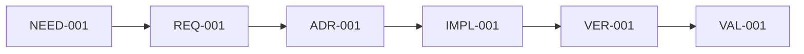

# Spec: Systems Engineering Traceability Skill for Agent Skills

Status: Draft v3
Date: 2026-04-25
Target repository: https://github.com/addyosmani/agent-skills
Recommended skill path: `skills/systems-engineering-traceability/SKILL.md`
Recommended requirements-reviewer path: `skills/requirements-reviewer/SKILL.md`
Recommended operating model path: `references/systems-engineering-traceability-operating-model.md`
Recommended matrix template path: `references/traceability-matrix-template.md`
Recommended requirements/V&V guide path: `references/requirements-and-vv-guide.md`
Recommended risk/gap/change-control guide path: `references/risk-gap-and-change-control-guide.md`
Companion requirements doc: `docs/brainstorms/2026-04-25-systems-engineering-traceability-skill-requirements.md`

## Objective

Add a lightweight systems engineering traceability skill to Agent Skills.

The skill should manage the systems engineering flow for agent-generated software work. It should make AI coding agents preserve the chain from idea or intent to stakeholder need, requirement, design decision, implementation, verification evidence, validation evidence, and change control. Its purpose is to prevent dark code: meaningful implementation that exists without a clear reason, requirement, test, validation path, owner, or safe-change story.

TraceWeaver separates three layers:

| Layer | Purpose | Names |
|---|---|---|
| Core skills | Portable capabilities that can run in any agentic workflow | `requirements-reviewer`, `systems-engineering-traceability` |
| Core lifecycle guidance | Explains how the core skills work together across the lifecycle | `traceweaver-operating-model`, matrix template, requirements/V&V guide, risk/gap/change-control guide |
| Compound Engineering adapter | Wires the core capabilities into CE commands, prompts, reviewers, and delegation | TraceWeaver CE, `ce-traceability`, `ce-traceability-reviewer`, CE hooks |

`requirements-reviewer` and `systems-engineering-traceability` are Core skills,
not Compound Engineering adapters. CE-specific wrappers may invoke them, but
must not redefine their source rules.

The skill should also teach agents how to set up and maintain the traceability artifacts that make the flow usable: a Markdown traceability matrix as the audit record, stable IDs as cross-artifact links, Mermaid diagrams as visual relationship maps, and explicit links from requirements docs to plans, acceptance test plans/procedures, and results.

Requirements quality is a companion gate to traceability. A requirement,
success criterion, or acceptance criterion is not implementation authority just
because it exists. Before it can authorize meaningful behavior, it must pass
requirements-reviewer or be converted into an approved exception with recorded
owner, approver, date/session, allowed use, review condition, and rationale.
Requirements-quality routing is cumulative with traceability routing: a
requirements-related prompt still needs requirements-reviewer even when the same
work also matches systems-engineering-traceability.

The upstream MVP should include an original, distilled, agent-facing operating model as a separate top-level reference. That file should explain the lifecycle chain, authority rules, candidate-vs-approved status, review-findings-as-provenance rule, verification/validation distinction, and source hierarchy in concise project-specific language. It must not reproduce protected standards or handbook text.

Local source material used to create the distilled operating model belongs in the ignored `.source-materials/` cache in this planning workspace. The cache may contain licensed standards provided by the user, public downloads, extraction notes, source inventories, and checksums. Committed project artifacts should cite official or public source pages where possible and should use original writing.

The skill must be practical for normal software teams. It should raise engineering discipline without turning every change into heavyweight waterfall.

## End-State Goal

After this project succeeds, Agent Skills should have a dedicated skill that manages traceability and systems engineering flow across the existing lifecycle.

The skill should not merely produce a traceability matrix. It should guide the agent's behavior during specification, planning, implementation, testing, review, and shipping so the engineering record stays connected as work evolves.

The matrix remains the source of truth. Diagrams are generated or maintained views for understanding. IDs connect requirements, design decisions, tasks, implementation, tests, ATPs, result records, validation evidence, gaps, and human decisions across the repository.

End-state behavior:

- During ideation or brainstorming, the agent preserves ideas as candidate needs,
  assumptions, risks, success and failure signals, open decisions, and
  not-doing boundaries. Ideas do not create implementation authority.
- During `/spec`, the agent captures stakeholder needs, testable requirements, assumptions, success signals, and requirement IDs.
- During `/plan`, the agent links tasks, dependencies, risks, acceptance criteria, and the plan artifact back to requirement IDs.
- During `/build`, the agent stops when new meaningful behavior does not trace
  to valid approved authority.
- During `/test`, the agent records ATP entries and verification evidence against requirements, not just generic test output.
- During `/review`, the agent challenges untraceable behavior and flags dark-code candidates.
- During `/ship`, the agent checks result records, validation evidence, or an approved validation path before treating stakeholder-facing work as engineering-complete.
- During setup and maintenance, the agent creates or updates `docs/traceability/[scope].md`, keeps the matrix authoritative, and updates any Mermaid view from the same IDs.

The core managed flow is:

`Idea / Intent -> Need -> Requirement -> Design -> Implementation -> Verification -> Validation -> Change Control`

The document traceability chain is:

`requirements.md -> plan.md -> traceability matrix -> ATP -> results`

Use ATP to mean acceptance test plan/procedure. Use result records to mean acceptance test results, verification output, or acceptance test report artifacts that prove what happened.

The intended result is an agent skill that makes software explainable, verifiable, validatable, changeable, and ownable.

Valid approved authority means an approved requirement, approved ADR/design
decision, first-class approved risk control, approved gap, or task that closes
directly to one of those approved authorities. A task by itself is not
authority. A stakeholder need by itself is not authority. A draft or inferred
requirement is not authority.

## Upstream Fit Review

The upstream `agent-skills` repository already has a strong lifecycle:

`/spec -> /plan -> /build -> /test -> /review -> /ship`

Its skills follow a consistent anatomy:

- YAML frontmatter with `name` and `description`
- `Overview`
- `When to Use`
- step-by-step process
- `Common Rationalizations`
- `Red Flags`
- `Verification`

Contribution constraints that matter for this proposal:

- Skill descriptions must clearly say what the skill does and when to use it.
- `SKILL.md` should be workflow-oriented, not a long essay.
- Supporting references belong in top-level `references/`, not inside the skill directory.
- Existing skills should reference each other instead of duplicating workflow text.
- The quality bar is specific, verifiable, battle-tested, and minimal.

Implication: the original draft has the right engineering idea, but the upstreamable version should be smaller and split into phases. We should frame this as a lightweight traceability workflow for agent-generated behavior, not as a full systems engineering framework.

## Upstream Adoption Strategy

There is a realistic path to getting this accepted upstream, but the packaging matters.

Estimated acceptance odds:

- Big PR with the full systems engineering vision: 10-20%.
- Focused PR with one clean skill: 40-60%.
- Issue or RFC first, tested fork, then small PR: 60-75%.

The recommended path is to open an issue first, test the skill in a fork, and submit a focused PR only after there is evidence that the workflow works on real projects.

### Framing

Avoid this framing:

```text
The repo is missing systems engineering. Here is a full systems engineering framework with traceability, /trace, personas, matrix templates, and patches across many skills.
```

Use this framing:

```text
This extends the existing spec/plan/build/test/review/ship lifecycle with a lightweight traceability workflow for agent-generated behavior.
```

Strong pitch:

```text
Agentic coding makes it easy to generate working code that nobody can explain. This skill adds a lightweight traceability gate so agents preserve the engineering chain from requirement to implementation to verification and validation.
```

### Evidence Before PR

Run the skill in a fork before opening the PR. Use at least one new feature, one unclear existing module, and one low-risk change where Lite mode should avoid over-process. Capture concrete results:

```text
Found 12 dark-code candidates.
Found 5 missing validation paths.
Found 3 tests not linked to requirements.
Found 2 unclear design decisions.
Recorded false positives and confusing guidance.
Recorded process overhead and reviewer confidence.
```

These numbers are examples of the kind of evidence to collect, not claims about current results.

### PR Packaging Rules

TraceWeaver Core MVP should include:

- `skills/requirements-reviewer/SKILL.md`
- `skills/systems-engineering-traceability/SKILL.md`
- `references/systems-engineering-traceability-operating-model.md`
- `references/traceability-matrix-template.md`
- `references/requirements-and-vv-guide.md`
- `references/risk-gap-and-change-control-guide.md`
- Minimal README/index update only if required

The upstream `agent-skills` PR is a separate acceptance surface. It may be
packaged smaller than TraceWeaver Core if maintainers require it, but that
reduction must be recorded as a scope decision. The matrix template and
operating model remain required for a usable traceability MVP.

First PR should not include:

- `/trace`
- Systems engineer persona
- Broad patches across existing skills
- Metrics automation
- High-assurance variants
- Full systems engineering theory

The `/trace` command and persona should be follow-up PRs after maintainers accept or discuss the core skill.

### Upstream Signals

The contribution guide invites new skills under `skills/`, requires `SKILL.md`, and sets the quality bar as specific, verifiable, battle-tested, and minimal:

https://github.com/addyosmani/agent-skills/blob/main/CONTRIBUTING.md

The README describes skills as workflows, quality gates, and best practices that agents follow across Define, Plan, Build, Verify, Review, and Ship:

https://github.com/addyosmani/agent-skills

PR #59 is the cautionary example. A contributor bundled an observability skill, cross-references, and persona integration. Review feedback said the skill and persona wiring were independent concerns and should be split. The author closed it in favor of focused PRs:

https://github.com/addyosmani/agent-skills/pull/59

## Problem Statement

AI agents can generate implementation faster than teams can preserve the engineering record. That creates a new form of technical debt: code that runs, but cannot be explained.

Dark code is any meaningful system behavior, public interface, data flow, configuration, script, or automation where the team cannot answer:

- Why does this exist?
- Which stakeholder need or requirement does it satisfy?
- Which design decision explains it?
- Where is it verified?
- How is it validated against the original need?
- Who owns it?
- What breaks if it changes or is removed?

This is not just documentation debt. It is unmanaged system complexity. When traceability is missing, review, testing, refactoring, deprecation, incident response, and future agent work all become guesswork.

## Desired Outcome

After this skill exists, an agent working on a meaningful behavior change should be able to show:

`Stakeholder need -> requirement -> design decision -> implementation artifact -> verification evidence -> validation evidence or approved validation path`

For small changes, this may be a single row and a short note. For larger changes, it may be a traceability matrix with multiple linked requirements, tests, ADRs, and validation scenarios.

The desired outcome is not merely documentation after implementation. The skill should actively manage the engineering approach and flow while the work is happening:

- clarify need before requirement,
- make requirements testable before planning,
- connect tasks to requirements before implementation,
- connect code changes to requirements during implementation,
- separate verification evidence from validation evidence,
- identify impact before changing traced requirements, interfaces, or design decisions,
- surface gaps for human decision instead of hiding them.

## Non-Goals

- Do not build a full MBSE, SysML, DOORS, or requirements database workflow in v1.
- Do not require every private helper function to map directly to a top-level requirement.
- Do not block formatting-only, typo-only, or comment-only changes.
- Do not duplicate existing skill content for specs, planning, testing, ADRs, or shipping.
- Do not let agents invent traceability after the fact and mark it approved.
- Do not require completed stakeholder validation before every internal PR. A documented and approved validation path is acceptable when validation must happen later.

## Core Principle

Trace meaningful behavior, not every line of code.

A helper function can inherit traceability through the feature, module, interface, or behavior it supports. But every externally meaningful behavior, public API, data flow, risk control, design decision, task, test, and shipped user-facing change must have a reason to exist.

Practical rule:

If a reviewer asks "Why does this exist?", the agent must be able to point to a requirement, design decision, risk control, verification result, validation outcome, or explicitly approved gap.

## Recommended Naming

Use:

`systems-engineering-traceability`

Why:

- Clear and explicit.
- Matches the systems engineering framing.
- Searchable by people looking for traceability, requirements, V&V, or dark-code controls.

Alternatives:

- `requirements-traceability`
- `traceability-and-validation`
- `dark-code-detection`

The alternatives are narrower. The recommended name better captures the cross-cutting engineering flow.

## MVP Scope

TraceWeaver Core MVP scope:

```text
agent-skills/
+-- skills/
|   +-- requirements-reviewer/
|       +-- SKILL.md
|   +-- systems-engineering-traceability/
|       +-- SKILL.md
+-- references/
|   +-- systems-engineering-traceability-operating-model.md
|   +-- traceability-matrix-template.md
|   +-- requirements-and-vv-guide.md
|   +-- risk-gap-and-change-control-guide.md
+-- README.md
```

MVP acceptance criteria:

- New skill follows upstream skill anatomy.
- `SKILL.md` is concise and workflow-oriented.
- The skill has clear trigger conditions and exclusions.
- The workflow covers context, requirement IDs, trace matrix updates, implementation links, verification, validation, dark-code detection, impact analysis, and completion gate.
- The operating-model reference provides the original distilled lifecycle chain, authority rules, source hierarchy, and provisional-distillation boundary.
- The matrix reference template provides the required audit-record shape, longer examples, table formats, and optional Mermaid relationship view.
- The requirements/V&V guide provides mandatory runtime guidance for idea/need separation, inferred requirements, ATPs, result records, verification, and validation.
- The risk/gap/change-control guide provides mandatory runtime guidance for first-class risk controls, approved gaps, traceability debt, dark-code classification, and impact analysis.
- Requirements or success criteria that authorize implementation are reviewed
  for quality before approval or converted into approved exceptions.
- Original stakeholder wording is preserved beside any agent reframe before the
  reframe can become authority.
- Requirements-reviewer and systems-engineering-traceability are both selected
  when a lifecycle task includes requirements or success criteria and also
  affects meaningful behavior or implementation authority.
- The skill makes clear that the Markdown matrix is authoritative and Mermaid is a derived visual map.
- README lists the skill without restructuring the whole repo.

### Source and Copyright Boundary

The operating model should use an explicit source hierarchy:

```text
ISO/INCOSE = authority and provenance for systems-engineering alignment.
NASA public material = practical implementation examples.
Project Markdown = original agent-facing distillation.
```

Do not copy protected standard or handbook text into the skill, reference files, README, issue, or PR description. Store raw source material and extraction notes only in `.source-materials/`, which is ignored by git in the local planning workspace.

Until licensed ground-truth sources are available, draft operating-model guidance may be provisional and based on public knowledge plus public references. Provisional guidance must not claim standards compliance and should be reviewed against ground-truth sources before being treated as final.

Defer these to follow-up PRs:

- Patching every existing skill.
- Adding `/trace`.
- Adding a systems engineer persona.
- Adding metrics or automation.
- Adding executable diagram generation.
- Adding high-assurance or regulated-environment variants.

## Full Scope Roadmap

### Phase 1: Add the Skill

Create:

```text
skills/requirements-reviewer/SKILL.md
skills/systems-engineering-traceability/SKILL.md
references/systems-engineering-traceability-operating-model.md
references/traceability-matrix-template.md
references/requirements-and-vv-guide.md
references/risk-gap-and-change-control-guide.md
```

Patch:

```text
README.md
```

### Phase 2: Integrate with Existing Skills

Patch only short references into:

- `spec-driven-development`
- `planning-and-task-breakdown`
- `incremental-implementation`
- `test-driven-development`
- `code-review-and-quality`
- `documentation-and-adrs`
- `deprecation-and-migration`
- `shipping-and-launch`

Do not duplicate the traceability workflow in each skill. Add short gates that point to `systems-engineering-traceability`.

### Phase 3: Add `/trace`

Create:

```text
.claude/commands/trace.md
```

The command should directly invoke the traceability skill. It should not be a meta-orchestrator.

### Phase 4: Add Systems Engineer Persona

Create:

```text
agents/systems-engineer.md
```

The persona should be a direct review/audit perspective, not an orchestrator. It can be used by humans directly and may later be included in a shipping fan-out if the upstream maintainers want that pattern.

### Phase 5: Evaluate on Real Projects

Run the skill against:

- A new feature from vague idea to implementation.
- An existing module with unclear ownership.
- An AI-generated PR with likely overbuild.
- A refactor or simplification task.
- A deprecation/removal task.

Measure:

- Traceability gaps found.
- Dark-code candidates found.
- Missing tests found.
- Missing validation scenarios found.
- Added process time.
- Rework avoided.
- Human reviewer confidence.

## Operating Modes

The skill should support three levels of strictness.

### Lite Mode

Use by default for ordinary feature and bug work with obvious scope.

Required output:

- Reason for change.
- Requirement or existing issue/spec link.
- Verification evidence.
- Validation path if user-facing.

### Standard Mode

Use for ambiguous behavior changes, interfaces, modules, workflows, integrations, data-flow changes, or multi-file behavior changes.

Required output:

- System context.
- Requirement IDs.
- Traceability matrix row or section.
- Task links.
- Implementation links.
- Verification evidence.
- Validation evidence or validation plan.
- Impact analysis for meaningful changes.

### Audit Mode

Use when reviewing a PR, module, legacy area, or agent-generated change.

Required output:

- Complete trace chains found.
- Traceability gaps.
- Dark-code candidates and classification.
- Impact risks.
- Recommended fixes.
- Human decisions required.

High-assurance mode is a future extension, not v1.

Mode-selection rules should be explicit in the skill. Agents should avoid the skill for formatting-only, typo-only, comment-only, or mechanically obvious changes with existing traceability and test coverage.

## Trace Object Model

Default lightweight IDs:

```text
NEED-001  Stakeholder need
REQ-001   Testable requirement
ADR-001   Architecture/design decision
TASK-001  Implementation task
IMPL-001  Implementation reference
VER-001   Verification evidence
VAL-001   Validation evidence
ATP-001   Acceptance test plan/procedure entry
ATR-001   Acceptance test result or report
RISK-001  Risk or constraint
GAP-001   Traceability gap or unresolved assumption
DEC-001   Human decision
```

Requirement rows should include a type:

```text
User | System | Interface | Risk Control | Operational | Compliance
```

For higher-assurance projects, teams may use more formal prefixes:

```text
UREQ-001  User requirement
SREQ-001  System requirement
IF-001    Interface requirement
RISK-001  Risk control
```

Default recommendation: start with `NEED`, `REQ`, `ADR`, `VER`, `VAL`, and `GAP`. Split into `UREQ`, `SREQ`, `IF`, and `RISK` only when the project needs that granularity.

For feature-scoped work, use readable prefixes that keep related items grouped:

```text
NEED-AUTH-001
UREQ-AUTH-001
SREQ-AUTH-001
ADR-AUTH-001
TASK-AUTH-001
IMPL-AUTH-001
VER-AUTH-001
VAL-AUTH-001
GAP-AUTH-001
DEC-AUTH-001
```

The skill should not force every namespace on every project. It should give agents a stable linking scheme and let smaller projects use the shorter form.

## Trace Statuses

Use statuses that distinguish engineering progress from evidence quality:

```text
Draft
Human-approved
Allocated
Implemented
Verified
Validation planned
Validated
Gap approved
Deprecated
Removed
```

Rules:

- Inferred requirements start as `Draft`.
- Agent-inferred requirements cannot become `Human-approved` without human confirmation.
- A feature can be implementation-complete but not engineering-complete if verification, validation, or approved gaps are missing.
- A planned validation path is acceptable before merge when validation depends on later stakeholder review, staged rollout, telemetry, or production use.

## Required Artifact

Recommended location:

```text
docs/traceability/[feature-or-scope].md
```

For repositories that already keep specs elsewhere, the trace matrix may live beside the spec if it is clearly linked.

The Markdown traceability matrix is authoritative. Mermaid diagrams are visual views generated or maintained from the same IDs. If the table and diagram disagree, the table wins and the diagram must be updated. When separate documents exist, the matrix should also preserve the chain from requirements doc to plan doc to ATP and result records.

Minimum table:

```markdown
# Traceability Matrix: [Feature or Scope]

| ID | Type | Need | Requirement | Plan / Task | Design / ADR | Implementation | ATP | Verification / Results | Validation | Owner | Status | Gaps |
|---|---|---|---|---|---|---|---|---|---|---|---|---|
| REQ-001 | System | NEED-001 | [Testable requirement] | TASK-001 / `docs/plans/[scope]-plan.md` | ADR-001 or design note | `src/path/file.ts` | ATP-001 | VER-001 / ATR-001 | VAL-001 or planned | [owner] | Verified | None |
```

Optional Mermaid view:

````markdown
## Traceability Diagram


````

For larger systems, split into sections:

- System context
- Stakeholder needs
- Requirements
- Design allocations
- Interfaces and data flows
- Risks and mitigations
- Implementation links
- Verification evidence
- Validation evidence
- Traceability gaps
- Dark-code candidates
- Impact analysis
- Human decisions required

## Traceability Setup and Maintenance Tooling

The first PR should express tooling as an agent-executable workflow and reference template, not as executable automation.

The skill should teach agents to:

- Set up a traceability artifact before planning or implementation when meaningful behavior is being introduced or changed.
- Choose a short ID prefix for the feature or scope when it improves readability.
- Add initial need, requirement, and matrix rows before implementation.
- Maintain matrix links as requirements docs, plan docs, tasks, implementation artifacts, ATP entries, result records, validation paths, gaps, and human decisions change.
- Keep Mermaid diagrams compact and derived from the matrix.
- Treat missing links as explicit gaps instead of silently inventing traceability.

Executable tooling such as `/trace`, automatic Mermaid generation, metrics calculation, or CI enforcement should remain follow-up work unless maintainers request it.

## Workflow

### 1. Select Scope and Mode

Determine whether the work needs Lite, Standard, or Audit mode.

Use Standard mode when the change affects:

- User-visible behavior.
- External or public APIs.
- Data models or data flows.
- Security, privacy, compliance, or operations.
- Infrastructure or deployment behavior.
- More than one subsystem.
- A feature, task, or PR generated by an AI agent.

### 2. Establish System Context

Capture the boundary before implementation:

```markdown
## System Context

System:
Subsystem:
Stakeholders:
Need:
In scope:
Out of scope:
Success signal:
Failure signal:
Assumptions:
```

If context is unclear, ask the human or record a `GAP` rather than silently inventing intent.

### 3. Create or Reuse Requirement IDs

Before implementation, identify the relevant needs and requirements.

Each requirement must be:

- Testable.
- Linked to a source need or explicit human request.
- Small enough to verify.
- Not contradicted by another requirement.

If a requirement is inferred by the agent:

- Mark it as `Draft`.
- Record the assumption.
- Ask for human approval before treating it as accepted scope.

### 4. Allocate Requirements to Design and Tasks

For each meaningful requirement, identify:

- Owning component or subsystem.
- Affected interface or data flow.
- Design decision or ADR if the approach is non-obvious or expensive to reverse.
- Implementation task.
- Verification method.
- Validation path.
- Source requirements doc and planning doc when they exist.
- ATP entry and expected result artifact when acceptance testing is needed.

Task trace block:

```markdown
Requirement IDs: REQ-001, REQ-002
Design / ADR: ADR-001 or [design note]
Verification: [test command or evidence to produce]
Validation: [scenario, demo, UAT, telemetry, or planned review]
Trace update required: Yes
```

Document chain block:

```markdown
Requirement source: docs/requirements/[scope].md#REQ-001
Plan source: docs/plans/[scope]-plan.md#TASK-001
Trace row: docs/traceability/[scope].md#REQ-001
ATP: docs/testing/[scope]-atp.md#ATP-001
Results: docs/testing/results/[scope]-results.md#ATR-001
```

If the repo uses different paths, link to those instead. The important rule is that a reviewer can move from requirement to plan to traceability row to ATP and result without guessing.

### 5. Link Implementation Artifacts

When code changes are made, update the matrix with implementation references:

- Source files.
- Public functions or classes.
- API routes.
- Schemas and migrations.
- Configuration and infrastructure files.
- Tests.
- PRs or commits when available.

Do not trace every helper. Trace the behavior, interface, module, or component the helper supports.

Stop and update the authority, exception, or traceability debt list if
implementation introduces meaningful behavior not already covered by valid
approved authority.

### 6. Record Verification Evidence

Verification asks: did we build it right?

Evidence may include:

- Unit test output.
- Integration or end-to-end test output.
- Acceptance test plan/procedure entry and result record.
- Build, typecheck, lint, or static analysis output.
- Security scan.
- Performance measurement.
- Manual inspection result.
- Runtime screenshot or browser/devtools evidence.

Record:

```markdown
VER-001
Requirement: REQ-001
ATP: ATP-001 or not applicable
Method:
Command:
Result:
Evidence path:
Date/session:
Notes:
```

### 7. Record Validation Evidence or Plan

Validation asks: did we build the right thing?

Evidence may include:

- Stakeholder review.
- User acceptance scenario.
- Demo notes.
- Operational dry run.
- Scenario walkthrough.
- Staged rollout telemetry.
- Production feedback.
- Simulation result.

Record:

```markdown
VAL-001
Need: NEED-001
Scenario:
ATP:
Results:
Result:
Evidence path:
Reviewer/stakeholder:
Status: Validated | Validation planned | Gap approved
```

If validation cannot happen yet, record the plan and owner. Do not pretend tests are validation when they only verify technical behavior.

### 8. Detect Dark Code

During review or audit, flag meaningful artifacts with missing trace links.

Classify each candidate:

```text
Keep and document  Useful, but traceability is missing.
Test and verify    Useful, but evidence is missing.
Validate           Technically correct, but stakeholder fit is unclear.
Deprecate          No longer tied to a current requirement.
Remove             Dead, harmful, or obsolete with no valid system role.
Escalate           Risky or ambiguous; human decision required.
```

Dark-code finding format:

```markdown
GAP-001
Artifact:
Missing link: requirement | design | verification | validation | owner | impact
Why it matters:
Classification:
Recommended action:
Human decision required:
```

Also flag document-chain gaps, such as:

- Requirement exists but no linked plan task.
- Plan task exists without a requirement ID.
- ATP entry exists without a requirement ID.
- Result record cannot be traced to an ATP entry or requirement.
- Matrix row and ATP/result status disagree.

### 9. Perform Change Impact Analysis

Run impact analysis when linked requirements, interfaces, architecture, data flows, risk controls, or externally observable behavior change.

For ordinary implementation changes that do not affect those triggers, update the trace row or verification note instead of forcing a full impact analysis.

Template:

```markdown
## Change Impact Analysis

Change:
Affected needs:
Affected requirements:
Affected design decisions:
Affected interfaces/data flows:
Affected implementation:
Affected verification:
Affected validation:
Affected ATP/results:
Risks introduced:
Docs to update:
Human decision required:
```

### 10. Apply Completion Gate

Before claiming the work is engineering-complete, answer:

- Does every meaningful behavior trace to valid approved authority: approved
  requirement, approved ADR/design decision, first-class approved risk control,
  approved gap, or task that closes directly to one of those authorities?
- Has every requirement or success criterion that authorizes implementation
  passed requirements-reviewer, or been converted into an approved exception?
- Is the original stakeholder wording preserved beside any agent-reframed
  requirement or success criterion?
- Does every changed requirement have implementation coverage?
- Does every implemented behavior have verification evidence?
- Does every stakeholder need have validation evidence or an approved validation path?
- Do requirements docs, plan docs, traceability rows, ATP entries, and result records link to the same requirement IDs where those artifacts exist?
- Are untraced artifacts listed as gaps?
- Has the human approved inferred requirements and remaining gaps?
- Are weak accepted requirements recorded as approved gaps, accepted risks,
  design decisions, validation gaps, or change-control exceptions rather than
  approved requirements?

If not, the work may be code-complete, but it is not engineering-complete.

## Integration With Existing Skills

Patch existing skills minimally.

### `spec-driven-development`

Add a traceability section to the spec template:

```markdown
## Stakeholder Needs
| ID | Need | Stakeholder | Success signal |
|---|---|---|---|

## Requirements
| ID | Type | Requirement | Source need | Verification method | Validation method |
|---|---|---|---|---|---|

## Traceability
| Requirement | Plan / Task | Design / ADR | Implementation | ATP | Verification / Results | Validation | Status |
|---|---|---|---|---|---|---|---|
```

Add rule:

Do not proceed from spec to plan for meaningful behavior changes until requirements have IDs and testable success criteria.

### `planning-and-task-breakdown`

Add to task template:

```markdown
Requirement IDs:
Requirement source:
Validation path:
ATP / results path:
Traceability update required: Yes | No
```

### `incremental-implementation`

Add implementation rule:

If implementation introduces meaningful behavior not covered by valid approved authority, stop and update the spec, trace matrix, approved gap, risk-control record, design decision, or change-control exception before continuing.

### `test-driven-development`

Add test guidance:

Where useful, name or annotate tests so they can be mapped to requirement IDs. Verification tests should prove the requirement, not merely exercise implementation details.

When acceptance testing is used, link ATP entries and result records to requirement IDs. Do not leave acceptance results as generic logs that cannot be traced back to the requirement or plan task.

### `code-review-and-quality`

Add an intent/traceability gate before the five-axis review:

```text
Can the reviewer identify why each meaningful behavior exists and which requirement, design decision, test, or validation outcome supports it?
```

Do not rewrite the five-axis model into a six-axis model in the first PR. Keep the upstream review framing stable.

### `documentation-and-adrs`

Add ADR guidance:

ADRs should reference affected requirement IDs, constraints, and validation assumptions when they explain a meaningful design decision.

### `deprecation-and-migration`

Add dark-code guidance:

Before removing unclear code, determine whether it is truly dead or whether traceability has been lost. Useful behavior with missing traceability should be documented, re-required, or explicitly deprecated before deletion.

### `shipping-and-launch`

Add launch gate:

Stakeholder-facing launches require verification evidence and validation evidence or an approved validation path. Passing tests alone is not enough.

Launch notes should identify the relevant traceability artifact, ATP entries, and result records when those artifacts exist.

## Optional `/trace` Command

Purpose:

Audit or build traceability for a feature, PR, module, or existing code area.

Recommended command path:

```text
.claude/commands/trace.md
```

Command behavior:

1. Invoke `agent-skills:systems-engineering-traceability`.
2. Identify scope.
3. Read relevant specs, plans, ADRs, tests, and changed source files.
4. Build or update the traceability matrix.
5. Flag missing links.
6. Classify dark-code candidates.
7. Produce recommended fixes and human decisions required.

Expected output:

```markdown
# Traceability Audit: [scope]

## Summary
[Scope, confidence, and major gaps]

## Complete traces
[Need -> requirement -> design -> implementation -> verification -> validation]

## Traceability gaps
[Missing links]

## Dark-code candidates
[Artifacts with unclear reason/evidence]

## Impact analysis
[Affected needs, requirements, interfaces, tests, validation scenarios]

## Human decisions required
[Approval or clarification needed]

## Recommended changes
[Spec, test, ADR, cleanup, validation, or removal actions]
```

## Optional Systems Engineer Persona

Recommended path:

```text
agents/systems-engineer.md
```

Role:

Systems Engineer / Traceability Auditor

Persona text:

```markdown
You are a systems engineer reviewing agent-generated software work. Your job is to ensure meaningful behavior traces from stakeholder need to requirement, design decision, implementation, verification evidence, and validation evidence. You distinguish verification from validation, flag dark code, challenge inferred requirements, and identify change impact. You are not reviewing only code style; you are reviewing whether the team can explain, verify, validate, and own the system.
```

Rules:

- The persona should not invoke other personas.
- The persona should use the `systems-engineering-traceability` skill.
- The persona should produce traceability findings, not general code review findings unless they affect traceability.

## Candidate Skill Frontmatter

```yaml
---
name: systems-engineering-traceability
description: Maintains traceability from stakeholder needs through requirements, design decisions, implementation, verification, and validation evidence. Use when starting or changing meaningful behavior, reviewing agent-generated code, auditing unclear code, performing impact analysis, preparing release evidence, or when code lacks an obvious requirement, test, validation path, or owner.
---
```

## Candidate `SKILL.md` Outline

The final `SKILL.md` should be shorter than this spec and should avoid long examples.

```markdown
# Systems Engineering Traceability

## Overview
[Two sentences on need -> requirement -> design -> implementation -> verification -> validation.]

## When to Use
[Trigger list and exclusions.]

## Core Model
[Short summary of the meaningful behavior rule, V&V distinction, matrix-as-source-of-truth rule, Mermaid-as-view rule, and ID scheme. Link to the operating model for the full lifecycle chain and authority rules.]

## Process
1. Select scope and mode.
2. Establish system context.
3. Create or reuse requirement IDs.
4. Set up or update the traceability artifact.
5. Allocate requirements to design and tasks.
6. Link implementation artifacts.
7. Link requirements docs, plan docs, ATP entries, and result records where they exist.
8. Record verification evidence.
9. Record validation evidence or plan.
10. Update the Mermaid view when useful.
11. Detect dark code.
12. Perform impact analysis.
13. Apply completion gate.

## Common Rationalizations
[Short table.]

## Red Flags
[Short list.]

## Verification
[Checklist.]

## See Also
For the agent-facing operating model, use `references/systems-engineering-traceability-operating-model.md`.
For templates, use `references/traceability-matrix-template.md`.
```

## Common Rationalizations to Include

| Rationalization | Reality |
|---|---|
| "The code works, so traceability is unnecessary." | Working code proves execution, not that the right requirement was satisfied. |
| "The tests are enough." | Tests usually support verification. They do not automatically validate stakeholder fit. |
| "This is too small to trace." | Small behavior changes still need a reason. Use Lite mode, not no traceability. |
| "The requirement is obvious." | Obvious assumptions become invisible assumptions. Invisible assumptions create dark code. |
| "The agent inferred the requirement." | Inferred requirements are drafts until a human approves them. |
| "Documentation can come later." | Later documentation often describes what was built, not why it should exist. |
| "Traceability is waterfall." | Traceability is ownership of intent, evidence, and change impact. It can be lightweight and iterative. |

## Red Flags to Include

- Meaningful code exists but nobody can explain why.
- A PR adds behavior not present in the spec, plan, issue, or requirement list.
- Requirements have no IDs.
- Tests verify implementation details but not requirements.
- ATP or result records exist without requirement IDs.
- Interfaces change without interface requirements or design notes.
- A change touches multiple subsystems with no impact analysis.
- Agent says "I inferred" without recording the assumption.
- Validation is claimed solely from tests.
- Code is removed without checking whether traceability was lost.
- Review focuses on style but not intent, evidence, or impact.

## Verification Checklist for the Skill

- [ ] System context is captured or intentionally marked out of scope.
- [ ] Stakeholder need or source request is identified.
- [ ] Requirements have stable IDs.
- [ ] Requirements are testable and linked to needs.
- [ ] Design decisions or ADRs are linked where needed.
- [ ] Implementation artifacts are linked at behavior/module/interface level.
- [ ] Requirements docs, plan docs, ATP entries, and result records are linked when those artifacts exist.
- [ ] Verification evidence is recorded.
- [ ] Validation evidence or approved validation path is recorded.
- [ ] Dark-code candidates are listed and classified when auditing or reviewing unclear code.
- [ ] Impact analysis is completed for meaningful requirement, interface, architecture, or data-flow changes.
- [ ] Inferred requirements and unresolved gaps are marked for human review.

## Research Questions

Recommended answers for v1:

| Question | Recommendation |
|---|---|
| Trace granularity | Feature, module, public API, interface, data flow, risk control, and externally meaningful behavior. Avoid function-level tracing unless the function is itself a public behavior or safety control. |
| Artifact format | Markdown matrix first as the audit record. Mermaid diagrams are optional generated or maintained views for comprehension. |
| Enforcement | Before merge for meaningful behavior changes; Lite mode during small changes; Audit mode for legacy areas. |
| Dark-code detection | Start with LLM-assisted review across specs, plans, ADRs, tests, source files, and git context. Static analysis can come later. |
| Fake traceability prevention | Inferred requirements are `Draft` until human-approved. Evidence rows must point to actual files, commands, logs, reviews, or planned validation owners. |
| ADR relationship | Requirements say what must be true. ADRs explain why a design approach was chosen. Tests verify. Validation proves stakeholder fit. |
| Regulated environments | Future extension. Keep v1 lightweight but do not block stricter ID schemes. |
| Source basis | Use original distilled project language. Keep raw standards, handbook PDFs, and extraction notes in `.source-materials/`, not committed docs. Mark provisional guidance until reviewed against ground-truth sources. |
| Tooling | The MVP should provide setup and maintenance workflow plus an operating-model reference and matrix template. Executable `/trace`, diagram generation, metrics, or CI checks are follow-up work. |
| Metrics | Future extension: percent requirements verified, percent validated, open gaps, dark-code candidates by module. |

## Suggested PR Summary

Title:

`Add systems engineering traceability skill`

Description:

```markdown
This PR adds a `systems-engineering-traceability` skill for maintaining a visible chain from stakeholder need through requirement, design decision, implementation, verification evidence, and validation evidence.

The goal is to prevent dark code: meaningful implementation that exists without a clear requirement, design rationale, test evidence, validation path, or owner.

The skill is intentionally lightweight. It manages the systems engineering flow across specification, planning, implementation, testing, review, and shipping by tracing meaningful behavior, interfaces, data flows, risk controls, design decisions, tasks, tests, ATP entries, result records, and validation scenarios rather than every line of code. It adds setup and maintenance guidance for a Markdown traceability matrix, treats Mermaid diagrams as visual views, preserves links from requirements docs to plans to ATP/results where those artifacts exist, and defines a completion gate that distinguishes code-complete work from engineering-complete work.

The PR also adds an original, copyright-safe operating model reference that distills systems-engineering traceability rules for agent workflows and points to official or public source pages for provenance. It does not reproduce ISO, IEEE, INCOSE, or other protected standards text.
```

## Recommended Next Step

Do not start with a large PR. Follow the adoption strategy:

1. Open an issue/RFC proposing a lightweight traceability skill for agent-generated behavior.
2. Fork the repo and create the MVP locally:
   - `skills/requirements-reviewer/SKILL.md`
   - `skills/systems-engineering-traceability/SKILL.md`
   - `references/systems-engineering-traceability-operating-model.md`
   - `references/traceability-matrix-template.md`
   - `references/requirements-and-vv-guide.md`
   - `references/risk-gap-and-change-control-guide.md`
   - one README/index update if required
3. Test the skill on one real feature, one unclear existing module, and one low-risk change where Lite mode should avoid over-process.
4. Collect concrete findings: dark-code candidates, missing validation paths, missing requirement links, unclear design decisions, false positives, confusing guidance, overhead, and reviewer confidence.
5. Submit the small PR only after the issue discussion or fork evidence supports it.

Patch the rest of the lifecycle skills, add `/trace`, and add a systems engineer persona only after the core skill has been accepted or maintainers have asked for those follow-ups.
