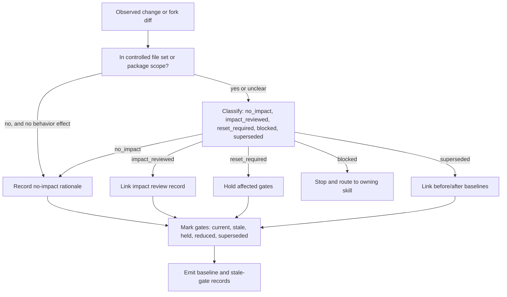

# Baseline Control Operating Model

This is the core TraceWeaver operating model for baseline identity and
configuration control. It is written for agents deciding whether evidence,
gates, and claims still apply to the candidate under review.

## Primary Question

What is the controlled baseline, and did anything change after evidence was
generated?

## What Is A Baseline?

A baseline is a named, controlled set of files, refs, records, and evidence.
A usable baseline record lets another person or agent:

- name the baseline and its type (final candidate, release, runtime package,
  controlled document set)
- resolve one controlling candidate ref: commit, branch, tag, package
  version, or artifact hash
- enumerate the controlled file set and the package inclusion/exclusion rules
- find every evidence record and the tested ref each one claims
- see who owns the baseline and what status it holds

## What Is Not A Baseline?

| Item | Why It Is Not A Baseline | What It Needs |
|---|---|---|
| A task or ticket | Work to do, not controlled identity | Close to a baseline-changing record |
| A branch | Moving pointer with no controlled scope | Ref pinned and scope recorded as controlled authority |
| A local workspace | Unrecorded, unreproducible state | Commit, hash, and controlled file set |
| "Latest" or "current" | Resolves differently over time | A pinned ref recorded in the baseline record |
| A passing CI run | Evidence about one ref, not an identity | A baseline record the run's ref ties to |

## Decision Rules

- A baseline is a named, controlled set of files, refs, records, and evidence.
- Evidence is valid only for the tested ref, artifact, configuration, and
  scope it records.
- A final candidate must have one controlling ref for gates, package scope,
  and release evidence.
- Runtime or package-controlled changes after evidence make affected gates
  stale unless an explicit impact review records why the evidence still
  applies.
- A fork diff must be classified before it may be dismissed.
- A task, branch, or local workspace state is not a baseline unless recorded
  as controlled authority.
- A controlled change must link to the affected items across needs,
  requirements, design, implementation, verification, validation, risks,
  gaps, and release gates; "no items affected" in a category is a recorded
  rationale, not silence.

## Diff Classes

| Class | Meaning | Action |
|---|---|---|
| `no_impact` | Change cannot affect controlled behavior or evidence | Record rationale |
| `impact_reviewed` | Change affects scope but evidence remains acceptable | Link review record |
| `reset_required` | Change invalidates one or more gates | Hold affected gates |
| `blocked` | Change lacks authority or impact analysis | Stop and route |
| `superseded` | Older baseline replaced by approved newer baseline | Link before/after |

Classification rules:

- Exactly one class per changed file or change set.
- `no_impact` requires a recorded rationale, not an assertion.
- `impact_reviewed` requires a linkable review record.
- `blocked` stops the gate and routes to the owning skill; it is never a
  silent default for "we did not look".

## Gate Currency States

| State | Meaning |
|---|---|
| `current` | Evidence ties to the candidate ref and no post-evidence change affects it |
| `stale` | A post-evidence change affects the gate and no impact review exists |
| `held` | The gate must not be relied on until reset, rerun, or impact-reviewed |
| `reduced` | The gate remains valid for an explicitly reduced scope only |
| `superseded` | A newer approved baseline replaced the gate's target |

A stale gate must not remain marked passed. Reset moves the gate to `held`
until evidence is regenerated or an impact review keeps it.

## Handoff Rules

| Finding | Next Skill |
|---|---|
| Behavior not in baseline | `systems-engineering-traceability` |
| Weak requirement authority | `requirements-reviewer` |
| Requirement changed | `risk-gap-change-control` |
| Evidence stale or missing | `verification-planner` / `validation-planner` |
| Readiness decision needed | `technical-review-and-audit-gate` |

## Mermaid View

