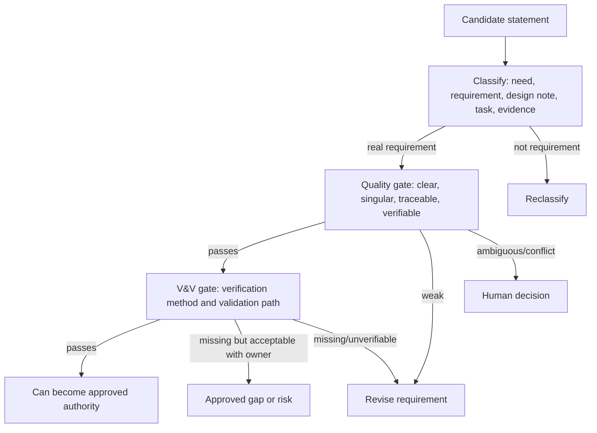

# Requirements Quality Operating Model

This is the core TraceWeaver operating model for requirement quality review.
It is written for agents deciding whether a requirement can become approved
implementation authority.

## What Is A Requirement?

A requirement is an approved statement of what must be true for a system,
component, interface, operation, or quality attribute. It constrains
implementation because satisfying it is necessary for the product, workflow, or
system to be accepted.

A good requirement has enough information for another person or agent to:

- understand the required behavior or property
- know where it came from
- know who owns it
- decide whether the system satisfies it
- verify it with evidence
- validate it against a user, stakeholder, or operational need
- trace implementation work back to it

## What Is Not A Requirement?

Do not approve these as requirements without reclassification or rewrite:

| Item | Why It Is Not A Requirement | Better Home |
|---|---|---|
| Idea | It proposes a direction but does not define authority | Idea note or candidate need |
| Goal | It states intent but may lack measurable obligation | Need, objective, or requirement after refinement |
| Assumption | It may be true but has not been accepted as obligation | Assumption log or risk register |
| Design note | It says how to build, not what must be true | ADR, design decision, or implementation note |
| Task | It is work to do, not system authority | Plan or backlog item |
| Test case | It checks behavior, but does not itself define the required behavior | ATP, verification evidence |
| Observation | It records a fact, not a future obligation | Analysis note or evidence |

## Good Requirement Characteristics

Use these as operational checks:

| Characteristic | Agent Question |
|---|---|
| Necessary | Is this needed to satisfy a parent need, source, constraint, or risk control? |
| Singular | Does it express one obligation, behavior, quality, or constraint? |
| Unambiguous | Would reasonable implementers interpret it the same way? |
| Complete enough | Does it include actor/system, condition, and expected outcome when needed? |
| Feasible | Is there a plausible way to satisfy it within known constraints? |
| Verifiable | Can objective evidence show pass/fail, compliance, or satisfaction? |
| Correct | Does it match the source need and known domain facts? |
| Consistent | Does it avoid conflict with peer requirements and constraints? |
| Traceable | Does it link to a parent need, source, risk, regulation, or approved decision? |
| Implementation-neutral | Does it avoid prescribing design unless the design is an approved constraint? |
| Right abstraction | Is it at the correct level for user, system, software, interface, or quality authority? |

## Bad Requirement Classes

| Class | Meaning | Default Action |
|---|---|---|
| Weak | Intent is visible but language or metadata is not approval-ready | Revise |
| Ambiguous | Multiple reasonable interpretations exist | Human decision |
| Unverifiable | No objective verification method or pass/fail condition | Block or accept as explicit gap/risk |
| Untraceable | No parent/source/need/rationale | Block approval |
| Compound | Multiple obligations in one statement | Split |
| Design-biased | Prescribes implementation without approved constraint rationale | Reclassify or rewrite |
| Conflicting | Contradicts another requirement or constraint | Block until resolved |
| Misleveled | Uses the wrong abstraction level | Reclassify |

## Approval Gate

TraceWeaver approval rule:

```text
A weak requirement must not become approved authority for implementation.
```

Approval-ready means:

- requirement has stable ID
- type is known
- text is mandatory and clear
- parent/source is known
- owner is known
- status/approval state is explicit
- verification method and expected evidence are defined
- validation path is defined or explicitly deferred with approval
- known risks, assumptions, and gaps are visible

## Human Decision Gate

Ask for human clarification when:

- the actor, source need, or intended outcome is unclear
- multiple plausible rewrites would change scope
- requirement conflicts with another approved item
- a design constraint may be intentional but lacks rationale
- validation can only be judged by a stakeholder
- accepting an unverifiable item as a risk/gap changes delivery risk

Do not invent authority to keep work moving.

## Reclassification Gate

If the text is useful but not a requirement, reclassify it:

| Original Text Looks Like | Reclassify As |
|---|---|
| "We could..." | idea |
| "Assume..." | assumption |
| "Use PostgreSQL..." | design decision or constraint |
| "Make it nice..." | candidate quality requirement requiring measurable criteria |
| "Run test X..." | verification procedure |
| "Users want..." | stakeholder need or user requirement candidate |

## Mermaid View


