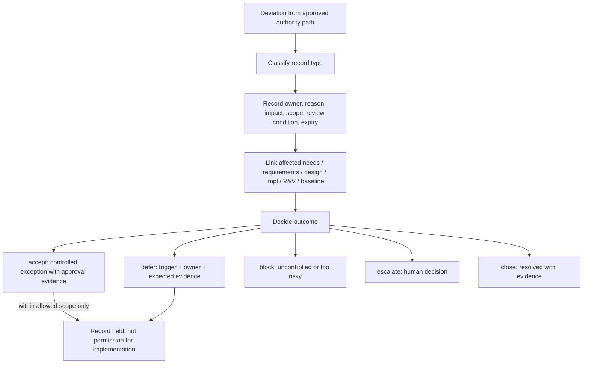

# Risk Gap Change Operating Model

This is the core TraceWeaver operating model for controlling deviations from
the approved authority path. It is written for agents deciding how an
exception, risk, gap, or change must be recorded before any work relies on it.

## Primary Question

How do we handle approved gaps, accepted risks, weak requirements, and
requirement changes?

## Definitions

| Term | TraceWeaver Meaning |
|---|---|
| Gap | A known missing or weak trace, requirement, evidence, validation, or authority item |
| Risk | An uncertain future harm with likelihood/impact or exposure |
| Traceability debt | Incomplete engineering record-keeping that must be resolved, accepted, or retired |
| Weak requirement exception | Recorded permission to proceed under controlled risk; it does not make the requirement good |
| Requirement change | A proposed or approved modification to existing authority that requires impact analysis |
| Deferred verification | Verification evidence postponed with owner, trigger, expected evidence, and accepted risk |
| Deferred validation | Validation evidence postponed with owner, trigger, expected evidence, and accepted risk; never permanently acceptable |
| Baseline delta | A difference between current state and an approved baseline that needs disposition |

## Decision Rules

- A gap is a known missing or weak trace, requirement, evidence, validation,
  or authority item.
- A risk is an uncertain future harm with likelihood/impact or exposure.
- Traceability debt is incomplete engineering record-keeping that must be
  resolved, accepted, or retired.
- A weak requirement exception does not make the requirement good. It records
  permission to proceed under controlled risk.
- A requirement change must identify affected needs, downstream requirements,
  design decisions, implementation, verification, validation, risks, and
  baseline.
- Deferred verification or validation requires owner, trigger, expected
  evidence, and accepted risk.
- Every exception needs a review condition and an expiry or closure trigger.
- Unowned exceptions are not approved.
- A recorded gap is a held condition, not permission: it must not be cited as
  implementation authority until promoted to an approved requirement or
  approved exception.
- An approved exception is valid authority only inside its recorded allowed
  scope and review condition; outside that scope, or after expiry, it is not
  authority.

## Exception Types

Classify each deviation as exactly one of:

- approved gap
- accepted risk
- weak requirement exception
- deferred verification
- deferred validation
- requirement change
- traceability debt
- baseline delta

If a deviation seems to be two types at once, split it into two records so
each carries its own owner, scope, and trigger.

## Outcomes

| Outcome | Meaning |
|---|---|
| `accept` | Controlled exception approved with owner and review condition |
| `revise` | Requirement, trace, or evidence needs correction |
| `defer` | Allowed later with trigger, owner, and expected evidence |
| `block` | Too risky or uncontrolled |
| `escalate` | Human decision required |
| `close` | Debt/gap resolved with evidence |

`accept` requires recorded human or project decision evidence. `defer`
without a trigger and expected evidence is not `defer`; it is an uncontrolled
gap and must be revised, blocked, or escalated.

## Human Decision Gate

Escalate to a human decision when:

- accepting a risk or gap changes delivery, safety, or compliance exposure
- the allowed scope of an exception cannot be bounded from known context
- a requirement change conflicts with another approved item
- expiry of an approved gap arrives with work still depending on it
- deferred validation has no plausible future evidence path

Do not invent authority to keep work moving.

## Mermaid View

Original TraceWeaver semantic view of how a deviation becomes a controlled
record:

