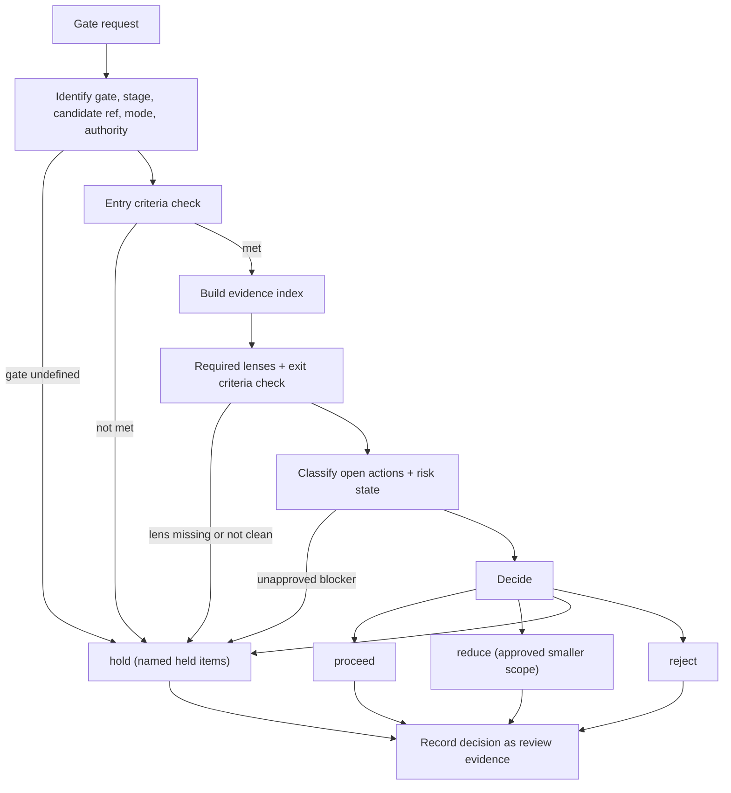

# Review And Audit Gate Operating Model

This is the core TraceWeaver operating model for lifecycle gate decisions. It
is written for agents deciding whether work may proceed through a gate based
on recorded evidence rather than approval impressions.

## Primary Question

```text
Is this work ready to proceed through the next gate?
```

## What Is A Gate?

A gate is a recorded decision point between lifecycle stages. It has:

- a name and ID
- a lifecycle stage it protects (implementation, merge, release, runtime
  promotion, baseline update, closure, audit)
- a candidate baseline or ref under review
- entry criteria that decide whether review can start
- exit criteria that decide whether work can proceed
- a required review lens set, defined by the gate, not by the reviewer
- a decision authority who may accept the outcome

A review without these properties is a discussion, not a gate.

## Review Modes

Review mode must be explicit. TraceWeaver defines three modes:

| Mode | Meaning | Expectations |
|---|---|---|
| `lite` | Narrow, scoped check of one gate question on a small candidate | Reduced lens set allowed only when the skipped lenses are explicitly recorded as out of scope; conclusions are limited to the checked scope |
| `normal` | Standard gate over the full required lens set | All required lenses checked; evidence index built from current records; default mode when none is stated by the gate definition |
| `audit` | Independent re-derivation of gate status from records | Status is recomputed from the recorded artifacts themselves, not from prior claims or summaries; stale or unsupported claims are findings |

A `lite` review cannot issue audit-grade conclusions. If the requester needs
claims about the whole candidate, the mode is `normal` or `audit`.

## Decision Rules

- Reviews are event-driven: run the gate when entry criteria are satisfied,
  not merely because work wants to proceed.
- Entry criteria decide whether review can start.
- Exit criteria decide whether work can proceed.
- Missing evidence is a hold unless an approved exception scopes it out.
- Open actions must be classified as blocker, accepted exception, follow-up,
  or not relevant.
- Review mode must be explicit: `lite`, `normal`, or `audit`.
- The required lens set comes from the gate definition supplied as input; an
  unknown lens set is itself a hold.
- A clean result from one lens does not clear other required lenses.
- No response is not approval.

## Gate Decisions

| Decision | Meaning |
|---|---|
| `proceed` | Criteria met and evidence supports the next step |
| `hold` | Work cannot proceed until blockers or missing evidence are resolved |
| `reduce` | A smaller approved scope may proceed; the held scope stays held |
| `reject` | Candidate is not acceptable for this gate |

`reduce` requires an approved exception, gap, or scope decision that names
what proceeds and what stays held. A `reduce` without a record is a `hold`.

## Decision And Status Mapping

The gate decision vocabulary (`proceed`, `hold`, `reduce`, `reject`) belongs
to `gate_readiness_report.decision`. The shared TraceWeaver status vocabulary
(`held`, `reduced`, `approved`, `rejected`, ...) belongs to the top-level
`decision` field and to per-criterion status fields. Map them explicitly:

| Gate decision | Top-level status |
|---|---|
| `proceed` | `approved` |
| `hold` | `held` |
| `reduce` | `reduced` |
| `reject` | `rejected` |

See `review-audit-gate-output-schema.md` for field-by-field vocabulary.

## Entry Versus Exit Criteria

Entry criteria protect review effort: they confirm the candidate is defined,
the baseline is consistent, and required inputs exist. Exit criteria protect
the next lifecycle stage: they confirm the work and its evidence are
sufficient to proceed. Never trade one for the other - strong exit findings
do not repair unmet entry criteria, and met entry criteria promise nothing
about exit.

## Review Lenses

A lens is a distinct review concern that must independently be clean:
examples in TraceWeaver use include traceability, requirement quality,
verification, validation, baseline integrity, risk posture, and product
coherence. The gate definition states which lenses are required. Lens results
are recorded per lens; "the review was fine" is not a lens result.

## Evidence Index

The evidence index is the list of recorded artifacts the decision stands on:

- baseline and configuration records for the candidate ref
- traceability records (requirements, matrix rows, code/test anchors)
- verification records and results
- validation and acceptance records
- prior review records
- risk, gap, change, and exception records

Rules:

- Index entries point at recorded artifacts, not recollections.
- Evidence that predates the candidate ref is stale unless the artifact is
  explicitly version-independent.
- An exit criterion with an empty evidence entry is held, not assumed.

## Action Item Classification

Every open action item gets exactly one classification:

| Classification | Meaning | Gate effect |
|---|---|---|
| blocker | Must be resolved before the gate can pass | Forces `hold` or `reject` |
| accepted exception | Approved risk/gap/change record scopes it out | Allows `proceed` or `reduce` within the exception's scope |
| follow-up | Real work, approved to complete after the gate | Does not block, must carry owner and trigger |
| not relevant | Out of this gate's scope | Recorded with the reason |

Moving an item from blocker to any other class is a decision of the gate's
decision authority, recorded with rationale - never a reviewer convenience.

## Risk Readiness

Risk readiness is "known" when:

- current open-risk, accepted-risk, and unresolved-gap lists exist for the
  candidate;
- every entry has a disposition; and
- each disposition traces to a risk, gap, or change record.

Unknown risk, gap, or stale-evidence state is a hold condition, not a
footnote.

## Human Decision Gate

Escalate to the decision authority instead of deciding when:

- a blocker is asked to become a follow-up or exception
- evidence conflicts and the candidate's true state cannot be derived from
  records
- the required lens set or entry criteria are disputed
- a `reduce` scope boundary would change what users or downstream systems
  receive
- accepting stale evidence would change delivery risk

Do not invent approval to keep work moving.

## Mermaid View


