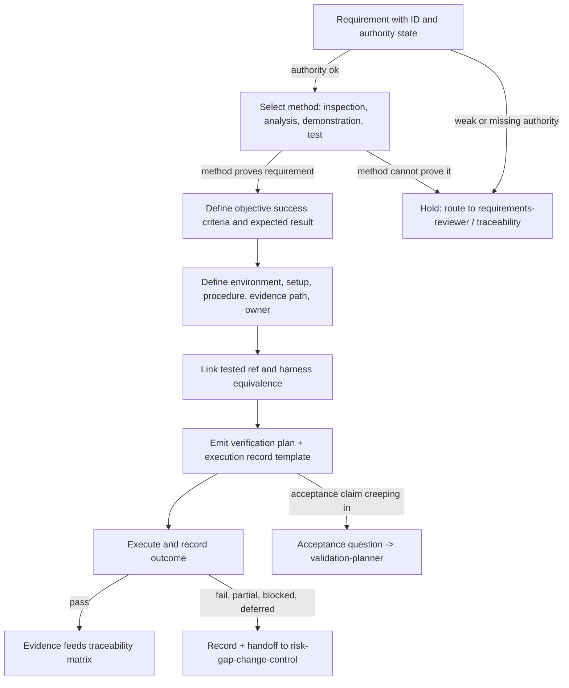

# Verification Planning Operating Model

This is the core TraceWeaver operating model for verification planning. It is
written for agents deciding how built behavior will be proven against approved
requirements, and whether claimed evidence actually proves anything.

## Primary Question

```text
How will we prove we built it right?
```

## What Verification Is

Verification checks implementation or artifact behavior against requirements.
It answers whether the thing that was built matches what the approved
authority says must be true, under an identified configuration, with objective
evidence a reviewer can rerun or re-inspect.

Verification is not validation. Validation asks whether the right thing was
built for the stakeholder need; that question belongs to `validation-planner`.
A verification plan that drifts into acceptance claims is a hold condition.

## Decision Rules

- Verification checks implementation or artifact behavior against
  requirements.
- Verification planning starts before implementation whenever the work is
  meaningful behavior under TraceWeaver authority controls.
- Verification methods are `inspection`, `analysis`, `demonstration`, or
  `test`; each requirement gets one primary method that can actually prove it.
- A test command is not enough; evidence needs requirement ID, method, setup,
  tested ref, expected result, actual result, outcome, and record path.
- A local harness can support evidence only when its equivalence to the target
  runtime is stated.
- Failed, partial, blocked, or deferred verification creates a record and a
  handoff, not silence.

## Method Selection

| Method | Proves | Typical TraceWeaver Use | Cannot Prove |
|---|---|---|---|
| `inspection` | Static properties of an artifact | Package file layout, anchor comments present, manifest fields, reference files packaged | Runtime behavior |
| `analysis` | A reasoned or computed property | Count checks, coverage ratios, grep-derived invariants, schema consistency | Behavior the reasoning does not model |
| `demonstration` | Observable behavior without full instrumentation | A skill visibly loading and responding in a live harness session | Thresholds or properties needing measured comparison |
| `test` | Behavior under a controlled, comparable procedure | Smoke scripts, runtime discovery runs, automated suites with expected results | Stakeholder acceptance (that is validation) |

If the selected method cannot prove the requirement's obligation, the plan is
not ready: revise the method or route the requirement to
`requirements-reviewer` for a verifiability finding.

## TraceWeaver Verification Targets

Recurring things TraceWeaver must prove about its own outputs:

- target runtime discovery
- skill loading
- metadata parsing
- reference loading
- routing behavior
- package inclusion and file layout
- harness equivalence
- documented command/procedure result

## Evidence Minimum

An execution record is evidence only when it carries all of:

| Field | Why |
|---|---|
| requirement ID | Binds the run to authority |
| method | Says what kind of proof this is |
| setup / environment | Makes the run reproducible |
| command or procedure | Lets a reviewer rerun it |
| tested ref | Identifies exactly what was tested |
| expected result | Written before the run, so pass/fail is honest |
| actual result | What happened |
| outcome | `pass`, `fail`, `partial`, `blocked`, or `deferred` |
| evidence path | Where the record and artifacts live |

Anything missing from this list downgrades the run from evidence to activity.

## Harness Equivalence

When the execution environment differs from the target runtime, the plan must
state the equivalence argument: which behaviors the harness faithfully
reproduces, which it does not, and why the difference does not invalidate the
proof. Without that statement, harness results are exploratory observations,
not runtime evidence.

## Hold Conditions

Hold the verification plan when:

- the requirement is not approved or explicitly accepted for verification
  planning
- success criteria lack an objective pass/fail condition, threshold, or
  inspectable artifact
- the method cannot prove the requirement
- the procedure lacks setup, command/steps, expected result, or evidence path
- evidence cannot be tied to a baseline or candidate ref
- the target runtime differs from the harness and no equivalence note exists
- verification is being used as validation

## Handoff Rules

| Verification Issue | Next Skill |
|---|---|
| Requirement unverifiable or quality-weak | `requirements-reviewer` |
| Missing authority or trace link | `systems-engineering-traceability` |
| Deferred or failed result | `risk-gap-change-control` |
| Candidate ref mismatch or stale baseline | `baseline-configuration-control` |
| Stakeholder acceptance needed | `validation-planner` |
| Evidence package needed for a milestone or audit gate | `technical-review-and-audit-gate` |

## Mermaid View


