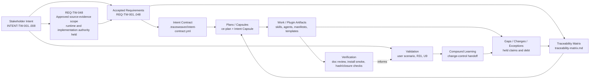

# Traceability: TraceWeaver Core

## System Context

System: TraceWeaver Core
Subsystem: project authority, plugin alpha, CE-compatible workflow surface
Scope: accepted baseline `REQ-BASELINE-2026-04-30-001`
Owner: Oxiom Systems
Mode: Standard / Advisory alpha
Status: accepted_traceability_matrix_with_refreshed_state_code_review_passed_u9_unit1_authority_doc_review_passed_u9_unit2_fixture_smoke_doc_review_passed_u9_unit3_gate_behavior_smoke_code_review_passed_doc_review_passed_u9_unit4_boundary_smoke_code_review_passed_doc_review_passed_u9_unit5_host_registry_filesystem_probe_code_review_passed_doc_review_passed_u9_unit7_host_install_attempt_doc_review_passed_u9_unit8_separate_home_install_passed_fresh_exec_registry_reviewed_held_code_review_passed_authority_doc_review_passed_u9_unit9_registry_shape_repair_auth_boundary_patch_code_review_passed_authority_doc_review_passed_u9_unit10_auth_safe_fresh_exec_and_active_host_runtime_probes_code_review_passed_authority_doc_review_passed_reviewed_held_u9_unit11_active_host_reconciled_runtime_pass_code_review_passed_authority_doc_review_passed_constrained_runtime_accepted_dogfood_classifier_code_review_passed_authority_doc_review_passed_skill_behavior_audit_unit1_behavior_contracts_authority_doc_review_passed_runtime_held_wrapper_direct_callable_expansion_code_review_passed_authority_doc_review_passed_runtime_held_review_wrapper_skills_recorded_authority_doc_review_passed_runtime_held_ce_350_skill_surface_inventory_source_refreshed_authority_doc_review_passed_parity_held_tw_wrapper_backlog_reviewed_against_ce_350_authority_doc_review_passed_per_wrapper_proof_pending_controlled_publication_gate_recorded_authority_doc_review_passed_behavior_held_controlled_publication_route_fixture_smoke_passed_code_review_pending_authority_doc_review_pending_code_test_trace_anchor_requirement_recorded_authority_doc_review_passed_scanner_held_structured_traceability_findings_fixture_smoke_patch_code_review_passed_authority_doc_review_passed_runtime_held_tw_auto_closure_loop_requirement_recorded_authority_doc_review_passed_tw_auto_code_review_passed_behavior_held_tw_skill_behavior_fixture_active_host_tw_traceability_check_structured_runtime_passed_authority_doc_review_passed_clean_ce_delegation_fixture_recorded_code_review_passed_authority_doc_review_passed_code_traceability_scanner_code_review_passed_authority_doc_review_passed_trace_anchor_authoring_fixture_smoke_passed_code_review_passed_narrow_traceweaver_project_write_allowance_open_authority_doc_review_passed_trace_anchor_explicit_mapping_active_host_code_review_passed_authority_doc_review_passed_trace_anchor_tdd_chain_code_review_passed_status_hash_doc_review_pending_req_tw_058_non_blocking_trace_anchor_ambiguity_requirements_review_passed_authority_doc_review_passed_fixture_smoke_passed_code_review_passed_status_hash_doc_review_passed_runtime_held_active_host_tw_auto_reconciliation_rerun_passed_review_routing_surface_current_nested_skill_backup_code_review_passed_status_hash_doc_review_passed_active_session_prompt_registry_passed_constrained_runtime_invocation_passed_status_hash_doc_review_passed_full_runtime_driver_held_tw_auto_runtime_driver_boundary_code_review_passed_status_hash_doc_review_passed_tw_debug_wrapper_static_fixture_code_review_passed_authority_doc_review_passed_anchor_alias_clarity_code_review_passed_status_hash_doc_review_passed_tw_auto_runtime_driver_fixture_smoke_passed_code_review_passed_status_hash_doc_review_passed_boundary_code_review_passed_status_hash_doc_review_passed_runtime_exec_disabled_publication_held_tw_auto_review_staging_closure_loop_fixture_smoke_passed_code_review_passed_status_hash_doc_review_passed_runtime_held_tw_auto_post_work_review_closure_fixture_smoke_passed_active_host_currentness_refreshed_code_review_passed_status_hash_doc_review_passed_prompt_registry_runtime_invocation_passed_status_hash_doc_review_passed_full_runtime_driver_held_broader_runtime_claims_held_req_tw_059_imported_ce_component_boundary_requirements_review_passed_authority_doc_review_passed_behavior_held_req_tw_060_model_default_policy_requirements_review_passed_authority_doc_review_passed_implementation_code_review_passed_status_hash_doc_review_passed_runtime_enforcement_held_req_tw_061_063_systems_engineering_audit_closure_fixture_smoke_passed_code_review_passed_status_hash_doc_review_passed_active_host_currentness_passed_status_hash_doc_review_passed_runtime_held_tw_auto_runtime_harness_validator_publication_boundary_code_review_passed_status_hash_doc_review_passed_runtime_trace_record_decision_binding_code_review_passed_status_hash_doc_review_passed_driver_invocation_held_standalone_packaging_surface_code_review_passed_status_hash_doc_review_passed_readme_boundary_code_review_passed_status_hash_doc_review_passed_wrapper_handoff_discipline_code_review_passed_status_hash_doc_review_passed_active_host_currentness_code_review_passed_status_hash_doc_review_passed_runtime_held_req_tw_064_strategy_ideation_wrapper_static_implementation_added_smokes_passed_code_review_passed_status_hash_doc_review_passed_active_host_currentness_passed_status_hash_doc_review_passed_runtime_held_req_tw_065_static_implementation_added_smokes_passed_code_review_passed_status_hash_doc_review_passed_fixture_smoke_passed_code_review_passed_status_hash_doc_review_passed_runtime_publication_held
Last updated: 2026-05-19
Current scoped gate: REQ-TW-065 test-first client workflow fixture proof passed as `TW-CODE-REVIEW-2026-05-19-REQ-TW-065-TEST-FIRST-FIXTURE-CLEAN-001`; scoped status/hash doc review passed as `TW-DOC-REVIEW-2026-05-19-REQ-TW-065-TEST-FIRST-FIXTURE-STATUS-HASH-CLEAN-001`. The scoped status/hash update records `req_tw_065_static_implementation_added_smokes_passed_code_review_passed_status_hash_doc_review_passed_fixture_smoke_passed_code_review_passed_status_hash_doc_review_passed_runtime_publication_held`, keeps active-host currentness, Vestro/R31 dogfood, runtime enforcement, publication, package/release/upstream readiness, clean replacement, and unconstrained-host support held.
Effective review evidence: prior authority-state review `CE-DOC-REVIEW-2026-05-02-AUTHORITY-STATE-CLEAN-001`; current U9 Unit 1 authority-set review `CE-DOC-REVIEW-2026-05-03-U9-UNIT1-AUTHORITY-CLEAN-001` passed with no findings for ART-TW-024, VER-TW-019, TRACE-TW-010, U9 evidence, plan, and smoke-script scope. U9 Unit 2 authority-set review `CE-DOC-REVIEW-2026-05-03-U9-UNIT2-AUTHORITY-CLEAN-001` passed with no findings for ART-TW-025, VER-TW-020, TRACE-TW-011, fixture workspaces, U9 evidence, plan, matrix, Intent Contract, alpha evidence, and fixture-smoke scope. U9 Unit 3 authority-set review `CE-DOC-REVIEW-2026-05-03-U9-UNIT3-AUTHORITY-CLEAN-001` passed with no findings for ART-TW-026, VER-TW-021, TRACE-TW-012, fixture smoke harness, U9 evidence, plan, matrix, Intent Contract, and alpha evidence. The behavior-bearing harness `/ce-code-review` first returned P1 missing `tw-auto` dependency-resolution coverage; the harness was patched and rerun clean as `CE-CODE-REVIEW-2026-05-03-U9-UNIT3-HARNESS-CLEAN-001`. U9 Unit 4 boundary smoke is recorded as ART-TW-027, VER-TW-022, and TRACE-TW-013; behavior-bearing code review passed as `CE-CODE-REVIEW-2026-05-03-U9-UNIT4-HARNESS-CLEAN-001`, and authority-set doc review passed as `CE-DOC-REVIEW-2026-05-03-U9-UNIT4-AUTHORITY-CLEAN-001`. U9 Unit 5 host-registry filesystem probe is recorded as ART-TW-028, VER-TW-023, and TRACE-TW-014; behavior-bearing code review passed as `CE-CODE-REVIEW-2026-05-03-U9-UNIT5-HOST-REGISTRY-HARNESS-CLEAN-001`, and authority-set doc review passed as `CE-DOC-REVIEW-2026-05-03-U9-UNIT5-AUTHORITY-CLEAN-001`. U9 Unit 7 host install attempt is recorded as ART-TW-029, VER-TW-024, and TRACE-TW-015; authority-set doc review passed as `CE-DOC-REVIEW-2026-05-03-U9-UNIT7-AUTHORITY-CLEAN-001`. Unit 7 is accepted only as held install-conflict limitation evidence. U9 Unit 8 separate-home install/fresh exec registry probe is recorded as ART-TW-030, VER-TW-025, and TRACE-TW-016; refreshed behavior-bearing code review passed as `CE-CODE-REVIEW-2026-05-04-U9-SEPARATE-HOME-HARNESS-CLEAN-002` after replacing an asserted blocker cause with a neutral held observation, authority-set doc review passed as `CE-DOC-REVIEW-2026-05-04-U9-UNIT8-AUTHORITY-CLEAN-002`, and Unit 8 is accepted only as reviewed-held limitation evidence. U9 Unit 9 registry-shape/auth-boundary repair is recorded as ART-TW-031, VER-TW-026, and TRACE-TW-017; registry-shape and legacy-upgrade code review passed as `CE-CODE-REVIEW-2026-05-04-U9-UNIT9-INSTALLER-HARNESS-CLEAN-001`, refreshed auth-boundary behavior-code review passed as `CE-CODE-REVIEW-2026-05-04-U9-UNIT9-AUTH-BOUNDARY-HARNESS-CLEAN-001`, authority doc review passed as `CE-DOC-REVIEW-2026-05-04-U9-UNIT9-AUTHORITY-CLEAN-001`, and Unit 9 is accepted only as reviewed-held registry-shape/auth-boundary evidence. U9 Unit 10 auth-safe no-copy fresh exec and active-host runtime probes are recorded as ART-TW-032, VER-TW-027, and TRACE-TW-018; separate-home behavior-code review passed as `CE-CODE-REVIEW-2026-05-05-U9-UNIT10-AUTH-SAFE-HARNESS-CLEAN-001`, active-host harness code review passed as `CE-CODE-REVIEW-2026-05-05-U9-UNIT10-ACTIVE-HOST-HARNESS-CLEAN-001`, authority doc review passed as `CE-DOC-REVIEW-2026-05-05-U9-UNIT10-AUTHORITY-CLEAN-001`, and Unit 10 is accepted only as reviewed-held auth-safe/runtime-limitation evidence while runtime claims remain held. U9 Unit 11 active-host reconciled runtime pass is recorded as ART-TW-034, VER-TW-029, and TRACE-TW-020; the active host produced the exact `tw-authority-gate` skill-hash sentinel with required skills visible only after the host skill surface was reduced and the external CE plugin was disabled. Code review passed as `CE-CODE-REVIEW-2026-05-05-U9-UNIT11-HOST-REGISTRY-HARNESS-CLEAN-001`, authority doc review passed as `CE-DOC-REVIEW-2026-05-05-U9-UNIT11-AUTHORITY-CLEAN-001`, and Unit 11 is accepted only as constrained active-host `tw-authority-gate` runtime invocation proof while broader runtime, replacement, publication, release, and unconstrained-host claims remain held. Dogfood audit evidence is recorded as ART-TW-033, VER-TW-028, and TRACE-TW-019; classifier behavior code review passed as `CE-CODE-REVIEW-2026-05-05-DOGFOOD-CLASSIFIER-CLEAN-001`, authority doc review passed as `CE-DOC-REVIEW-2026-05-05-DOGFOOD-AUTHORITY-CLEAN-001`, and dogfood audit accepted use is limited to reviewed manual/advisory input while broader runtime claims remain held. Skill behavior audit Unit 1 is recorded as ART-TW-035, VER-TW-030, and TRACE-TW-021 with authority doc review passed as `CE-DOC-REVIEW-2026-05-05-SKILL-BEHAVIOR-AUTHORITY-CLEAN-001`; accepted use is reviewed static behavior-contract and planning input only while runtime, project-write, and publication claims remain held. Wrapper direct-callable expansion for `ce-debug`, `ce-commit`, and `ce-commit-push-pr` is recorded as ART-TW-036, VER-TW-031, and TRACE-TW-022 with behavior code review passed as `CE-CODE-REVIEW-2026-05-05-WRAPPER-DIRECT-CALLABLE-CLEAN-001` and authority doc review passed; commit/push/PR behavior remains held. Candidate `tw-code-review`/`tw-doc-review` wrapper visibility and routing is recorded as ART-TW-037, VER-TW-032, and TRACE-TW-023 with authority doc review passed; CE review delegation and runtime behavior remain held until fixture/runtime proof. CE 3.5.0 full-surface inventory is refreshed from `/Users/hanneszietsman/CrypotAI/compound-engineering-plugin-main-3.5.0` at upstream commit `1f3c6466e4eb4e1b584c658953dfb1ca98dd3335` and recorded as ART-TW-038, VER-TW-033, and TRACE-TW-024 with authority doc review passed; the wrapper backlog is reviewed against that source surface as ART-TW-039, VER-TW-034, and TRACE-TW-025. Controlled publication-route candidate wording is recorded as ART-TW-040, VER-TW-035, and TRACE-TW-026 with authority doc review passed; publication behavior remains held. Code/test trace-anchor candidate wording is recorded as ART-TW-041, VER-TW-036, and TRACE-TW-027 with authority doc review passed; scanner behavior, matrix code-anchor table behavior, `tw-code-review` enforcement, and dead-TDD classification remain held until planned, implemented, reviewed, and proven. Structured traceability-finding candidate wording is recorded as ART-TW-042, VER-TW-037, and TRACE-TW-028 with authority doc review passed. Structured finding fixture evidence is recorded as ART-TW-043, VER-TW-038, and TRACE-TW-029: deterministic smoke now verifies the complete-trace positive control as one linked row, guards the real repository authority file set, passes with 6 P1 blocked findings, 2 P2 held findings, and JSONL/Markdown evidence output; prior behavior code review returned P1 harness findings, findings are patched, clean behavior code-review passed as CE-CODE-REVIEW-2026-05-06-STRUCTURED-FINDINGS-HARNESS-CLEAN-001; authority doc-review passed as CE-DOC-REVIEW-2026-05-06-SKILL-BEHAVIOR-STAGED-AUTHORITY-CLEAN-001, and constrained active-host tw-traceability-check structured runtime is recorded in VER-TW-040 with authority doc review passed. Candidate `tw-auto` closure-loop wording is recorded as ART-TW-044, VER-TW-039, and TRACE-TW-030 with authority doc review passed and `tw-auto` skill code review passed as `CE-CODE-REVIEW-2026-05-05-TW-AUTO-CLOSURE-LOOP-CLEAN-001`; autonomous closure-loop behavior remains held. Clean CE delegation fixtures and REQ-TW-057 code-traceability scanner/static install-discovery evidence are accepted only as reviewed static input after scoped authority doc review `CE-DOC-REVIEW-2026-05-06-SCOPED-STATUS-HASH-AUTHORITY-CLEAN-001`. Controlled publication-route deterministic fixture evidence is recorded as ART-TW-047, VER-TW-042, and TRACE-TW-033 with smoke pass for stale authority, missing trace, failed tests, review findings, dirty/untracked authority, target mismatch, credential/remote uncertainty, and clean no-real-remote dry-run allow; code review and authority doc review are pending, and real publication remains held. Trace-anchor authoring fixture evidence is recorded as ART-TW-049, VER-TW-044, and TRACE-TW-035 with smoke pass for proposal-only mode, work-loop-gated apply, outside-root write refusal, unambiguous code/test anchors, canonical Code Anchor Evidence table writes with malformed-section repair, pause cases, generated exception approval, helper-density guard, and real-repo unchanged guard; scoped code review passed as `TW-CODE-REVIEW-2026-05-06-TRACE-ANCHOR-AUTHORING-CLEAN-001`, narrow TraceWeaver project-write allowance is open for unambiguous coarse anchors plus matching Code Anchor Evidence, and authority doc review remains pending. Runtime CE delegation, active-host scanner reload, wrapper enforcement, Vestro writes, publication, clean replacement, and full CE parity remain held.
Effective gate: behavior-bearing unit traceability gate active for new or
changed meaningful behavior after this record.

Success signal: every meaningful artifact and behavior claim traces to
stakeholder intent, approved requirement or approved exception, verification
method, validation question, baseline version, and next-step handoff.

Failure signal: a plugin file, skill behavior, validation claim, workflow route,
or release statement exists without approved authority, verification evidence,
or a recorded gap/held claim.

Baseline or starting ref:

- baseline ID: `REQ-BASELINE-2026-04-30-001`
- baseline hash:
  `9e94f5a1f2aa4f43562a505c40c9ecdc84a624d27723613b17b8062558bc36f3`
- requirements authority: `requirements.md`
- Intent Contract: `.traceweaver/intent-contract.yml`

This matrix is the accepted initial audit record for TraceWeaver Core. It is
seeded from `requirements.md` and `.traceweaver/intent-contract.yml`. It does
not promote candidate brainstorms, active plans, review findings, traceability
debt, or agent assumptions into implementation authority.

## Stakeholder Needs

| ID | Intent ID | Need | Stakeholder / Source | Success Signal | Status |
| --- | --- | --- | --- | --- | --- |
| NEED-TW-001 | INTENT-TW-001 | Preserve stakeholder intent through agentic planning, implementation, review, and release decisions. | `requirements.md`; `.traceweaver/intent-contract.yml` | Meaningful behavior changes trace back to what the stakeholder wanted. | Approved |
| NEED-TW-002 | INTENT-TW-002 | Prevent agents from silently converting assumptions into implementation authority. | `requirements.md`; `.traceweaver/intent-contract.yml` | Assumptions become questions, proposed requirements, exceptions, risks, or rejected assumptions. | Approved |
| NEED-TW-003 | INTENT-TW-003 | Provide a lightweight systems-engineering workflow usable by coding agents without a heavyweight database. | `requirements.md`; `.traceweaver/intent-contract.yml` | File-based authority artifacts are enough to control requirements, traceability, evidence, and changes. | Approved |
| NEED-TW-004 | INTENT-TW-004 | Preserve the Compound Engineering workflow while adding TraceWeaver authority controls. | `requirements.md`; `.traceweaver/intent-contract.yml`; `README.md` | CE planning, work, review, and compound workflows continue while TraceWeaver records warnings and held claims. | Approved |
| NEED-TW-005 | INTENT-TW-005 | Ship only claims with evidence and keep unproven claims explicitly held. | `requirements.md`; `.traceweaver/intent-contract.yml` | Static, dynamic, release, upstream, and clean-replacement claims are separated. | Approved |
| NEED-TW-006 | INTENT-TW-006 | Keep public artifacts clean of private provenance, protected source text, and unsupported compliance claims. | `requirements.md`; `.traceweaver/intent-contract.yml` | Public files pass hygiene checks before package or release claims. | Approved |
| NEED-TW-007 | INTENT-TW-007 | Provide a standalone TraceWeaver plugin based on the selected CE workflow surface, with TraceWeaver authority and traceability as the default control layer. | `requirements.md`; plugin README; `tw-auto`; `lfg` alias | Installing TraceWeaver gives users a TraceWeaver-controlled path instead of raw CE autopilot. | Approved |
| NEED-TW-008 | INTENT-TW-008 | Repackage the Compound Engineering method with systems-engineering authority while preserving the simple CE workflow steps. | `requirements.md`; README; plugin README; wrapped CE/TW skills | Users can move from idea to requirements to implementation and learning without dark code, duplicate behavior, hidden assumptions, or missing requirements becoming product behavior. | Approved |

## Requirements

| ID | Type | Requirement Summary | Source Need / Parent | Verification Method | Validation Path | Owner | Status |
| --- | --- | --- | --- | --- | --- | --- | --- |
| REQ-TW-001 | System | Define an Intent Contract as the controlled authority baseline for agent work. | NEED-TW-001; NEED-TW-002 | Inspection | VAL-TW-001 | Oxiom Systems | Approved |
| REQ-TW-002 | Constraint | Meaningful work must cite intent, approved authority, verification, validation question, and baseline version. | NEED-TW-001; NEED-TW-002 | Inspection | VAL-TW-001 | Oxiom Systems | Approved |
| REQ-TW-003 | Constraint | Agent assumptions must become explicit questions, requirements, exceptions, risks, or rejected assumptions. | NEED-TW-002 | Inspection | VAL-TW-002 | Oxiom Systems | Approved |
| REQ-TW-004 | Workflow | Every meaningful task must have an Intent Capsule or equivalent bounded work package. | NEED-TW-001; NEED-TW-002 | Inspection | VAL-TW-001 | Oxiom Systems | Approved |
| REQ-TW-005 | System | Maintain the controlled chain from intent to requirements, authority, implementation, verification, validation, and change control. | NEED-TW-001; NEED-TW-003 | Inspection | VAL-TW-001 | Oxiom Systems | Approved |
| REQ-TW-006 | Review | Classify meaningful behavior without approved trace as dark behavior. | NEED-TW-001; NEED-TW-002 | Inspection / review | VAL-TW-002 | Oxiom Systems | Approved |
| REQ-TW-007 | V&V | Keep verification evidence separate from validation evidence and carry validation questions with tasks. | NEED-TW-001; NEED-TW-003 | Inspection | VAL-TW-001 | Oxiom Systems | Approved |
| REQ-TW-008 | Audit | Use the Markdown traceability matrix as the authoritative audit record. | NEED-TW-003 | Inspection | VAL-TW-003 | Oxiom Systems | Approved |
| REQ-TW-009 | Architecture | Target the eleven-skill Core suite in controlled promotion increments. | NEED-TW-003; NEED-TW-005 | Inspection | VAL-TW-004 | Oxiom Systems | Approved |
| REQ-TW-010 | Architecture | Keep `requirements-reviewer` and `systems-engineering-traceability` upstream-neutral. | NEED-TW-003; NEED-TW-004 | Inspection | VAL-TW-005 | Oxiom Systems | Approved |
| REQ-TW-011 | Scope | U6b Unit 2 alpha includes only selected authority foundation and selected CE-compatible surfaces. | NEED-TW-001; NEED-TW-003 | Inspection | VAL-TW-004 | Oxiom Systems | Approved |
| REQ-TW-012 | Scope | Runtime scope stays staged until later accepted scope decisions approve more. | NEED-TW-005 | Inspection | VAL-TW-004 | Oxiom Systems | Approved |
| REQ-TW-013 | Adapter | CE wrappers invoke Core skills without redefining Core semantics. | NEED-TW-004 | Inspection | VAL-TW-005 | Oxiom Systems | Approved |
| REQ-TW-014 | Adapter | Preserve selected CE workflow skill names while clean replacement remains held. | NEED-TW-004; NEED-TW-005 | Install smoke / runtime proof | VAL-TW-006 | Oxiom Systems | Approved |
| REQ-TW-015 | Packaging | Plugin README and manifests must accurately describe alpha skill invocation and avoid unproven slash-command claims. | NEED-TW-005 | Inspection | VAL-TW-006 | Oxiom Systems | Approved |
| REQ-TW-016 | Packaging | Documented Codex install command must materialize selected skills using `--include-skills`. | NEED-TW-004; NEED-TW-005 | Install smoke | VAL-TW-006 | Oxiom Systems | Approved |
| REQ-TW-017 | Provenance | Resolve CE upstream source pin or record accepted local-cache-only limitation before vendoring/release claims. | NEED-TW-005; NEED-TW-006 | Inspection | VAL-TW-007 | Oxiom Systems | Approved |
| REQ-TW-018 | Packaging | Prove transitive closure for selected CE support files. | NEED-TW-004; NEED-TW-005 | Static closure audit | VAL-TW-006 | Oxiom Systems | Approved |
| REQ-TW-019 | Claims | Limit U6b-alpha to package/install/static materialization evidence. | NEED-TW-005 | Inspection | VAL-TW-006 | Oxiom Systems | Approved |
| REQ-TW-020 | Claims | U7 release claims must stay narrow and keep unproven claims held. | NEED-TW-005 | Inspection | VAL-TW-008 | Oxiom Systems | Approved |
| REQ-TW-021 | Hygiene | Public artifacts must avoid private paths, protected source names, raw standards text, copied source material, and unsupported compliance claims. | NEED-TW-006 | Hygiene scan | VAL-TW-009 | Oxiom Systems | Approved |
| REQ-TW-022 | Validation | R31 real-project validation remains required before release-ready or upstream-ready claims. | NEED-TW-005 | Real-project validation review | VAL-TW-010 | Oxiom Systems | Held |
| REQ-TW-023 | Workflow | Completed TraceWeaver tasks must end with suggested next steps. | NEED-TW-003; NEED-TW-005 | Inspection | VAL-TW-011 | Oxiom Systems | Approved |
| REQ-TW-024 | Authority | Classify authority-chain, installed-artifact, validation-claim, public-doc, and user-visible changes as meaningful by default. | NEED-TW-001; NEED-TW-002 | Inspection | VAL-TW-001 | Oxiom Systems | Approved |
| REQ-TW-025 | Workflow | Advisory alpha supports minimal capsules for low-risk work without bypassing authority. | NEED-TW-003; NEED-TW-005 | Inspection | VAL-TW-011 | Oxiom Systems | Approved |
| REQ-TW-026 | Scope | Needs capture and risk/gap/change-control runtime materialization remain future or separately scoped. | NEED-TW-003; NEED-TW-005 | Inspection | VAL-TW-004 | Oxiom Systems | Approved |
| REQ-TW-027 | Policy | U6b Unit 2 defines static advisory policy only; runtime warning/gap-routing remains held. | NEED-TW-004; NEED-TW-005 | Inspection | VAL-TW-006 | Oxiom Systems | Approved |
| REQ-TW-028 | CE Compatibility | Materialize selected CE agents or record explicit per-workflow limitations and claim classes. | NEED-TW-004; NEED-TW-005 | Package file list / install smoke | VAL-TW-006 | Oxiom Systems | Approved |
| REQ-TW-029 | Provenance | Local-cache-only CE source limitations must record provenance, hashes, claim restrictions, stale reset, and unproven scope. | NEED-TW-005; NEED-TW-006 | Inspection | VAL-TW-007 | Oxiom Systems | Approved |
| REQ-TW-030 | Mode | Alpha defaults to advisory mode through a controlled policy contract. | NEED-TW-004; NEED-TW-005 | Inspection / install smoke | VAL-TW-011 | Oxiom Systems | Approved |
| REQ-TW-031 | Templates | Unit 2 must materialize Intent Contract, task capsule, trace record, gap, change, and exception templates. | NEED-TW-001; NEED-TW-003 | Inspection / install smoke | VAL-TW-006 | Oxiom Systems | Approved |
| REQ-TW-032 | Drift Check | Alpha must provide a low-friction advisory drift check for plans, reviews, or task capsules. | NEED-TW-001; NEED-TW-003; NEED-TW-004 | Inspection | VAL-TW-011 | Oxiom Systems | Approved |
| REQ-TW-033 | Workflow | TraceWeaver-controlled workflow composition must group authority-control steps with CE-compatible workflow stages once wrapper sequencing is implemented and proven. | NEED-TW-001; NEED-TW-004 | Inspection | VAL-TW-011 | Oxiom Systems | Approved |
| REQ-TW-034 | Automation | The first TraceWeaver-controlled autonomous alpha surface must be `tw-auto`, and packaged `lfg` must delegate to `tw-auto` instead of running raw CE autopilot. | NEED-TW-004; NEED-TW-005; NEED-TW-007 | Inspection / install smoke | VAL-TW-011 | Oxiom Systems | Approved |
| REQ-TW-035 | Automation | Controlled automation may continue only while authority remains clear and must stop for missing or changed authority, unresolved dark behavior, or human authority decisions. | NEED-TW-001; NEED-TW-002; NEED-TW-005 | Inspection | VAL-TW-011 | Oxiom Systems | Approved |
| REQ-TW-036 | Traceability | `tw-auto` must find or bootstrap `traceability-matrix.md` before implementation starts. | NEED-TW-001; NEED-TW-003 | Inspection / smoke test | VAL-TW-003; VAL-TW-011 | Oxiom Systems | Approved |
| REQ-TW-037 | Automation | The autonomous review-fix loop must be bounded by progress checks and default to at most two review-fix cycles per run unless reviewed configuration says otherwise. | NEED-TW-003; NEED-TW-005 | Inspection | VAL-TW-011 | Oxiom Systems | Approved |
| REQ-TW-038 | Verification | Behavior-bearing code changes made by controlled automation must link test evidence to the matrix by default unless approved authority permits non-test verification. | NEED-TW-001; NEED-TW-003 | Inspection / test evidence | VAL-TW-001; VAL-TW-003 | Oxiom Systems | Approved |
| REQ-TW-039 | Automation | `tw-auto` must stop before commit, push, or PR while authority, verification, review, traceability, dark-behavior, stale-evidence, or gap/change/exception write blockers remain. | NEED-TW-002; NEED-TW-005 | Inspection | VAL-TW-011 | Oxiom Systems | Approved |
| REQ-TW-040 | Review | `tw-auto` must define review severity policy before running automation. | NEED-TW-003; NEED-TW-005 | Inspection | VAL-TW-011 | Oxiom Systems | Approved |
| REQ-TW-041 | Standalone Plugin | TraceWeaver must be productized as a standalone CE-based plugin where familiar workflow entrypoints route through TraceWeaver authority controls or are marked legacy/manual-continuity only. | NEED-TW-004; NEED-TW-007 | Inspection | VAL-TW-011 | Oxiom Systems | Approved |
| REQ-TW-042 | Bootstrap | Fresh installs must provide an authority bootstrap path for `requirements.md`, `traceability-matrix.md`, and `.traceweaver/intent-contract.yml` before implementation. | NEED-TW-001; NEED-TW-003; NEED-TW-007 | Inspection / smoke test | VAL-TW-001; VAL-TW-011 | Oxiom Systems | Approved |
| REQ-TW-043 | Workflow Boundary | Direct selected CE-compatible skills are packaged implementation components; direct CE invocation does not satisfy TraceWeaver closure unless TraceWeaver authority, traceability, verification, and validation records are also updated. | NEED-TW-004; NEED-TW-005; NEED-TW-007 | Inspection | VAL-TW-011 | Oxiom Systems | Approved |
| REQ-TW-044 | Wrapper Method | Selected CE method steps must be wrapped or repackaged with TraceWeaver systems-engineering controls instead of leaving TraceWeaver as adjacent skills. | NEED-TW-004; NEED-TW-008 | Inspection / runtime proof | VAL-TW-011 | Oxiom Systems | Approved |
| REQ-TW-045 | Baseline Bootstrap | Idea and brainstorm flows must create or update root `requirements.md`, root `traceability-matrix.md`, `.traceweaver/intent-contract.yml`, and gap/change/exception records before implementation authority exists. | NEED-TW-001; NEED-TW-003; NEED-TW-008 | Inspection / smoke test | VAL-TW-001; VAL-TW-003 | Oxiom Systems | Approved |
| REQ-TW-046 | Dark Behavior Detection | Traceability checks must flag untraced, duplicate, unnecessary, or logical-but-uncaptured behavior-bearing units as dark behavior, proposed requirements, gaps, changes, exceptions, or removal candidates. | NEED-TW-001; NEED-TW-002; NEED-TW-008 | Review evidence / matrix inspection | VAL-TW-002; VAL-TW-003 | Oxiom Systems | Approved |
| REQ-TW-047 | Systems Engineering Source Hygiene | TraceWeaver may operationalize IEEE 15288/INCOSE-style principles in original wording, but must not copy protected standards text or overclaim formal conformance. | NEED-TW-006; NEED-TW-008 | Hygiene scan / doc review | VAL-TW-009 | Oxiom Systems | Approved |
| REQ-TW-048 | Intent Deepening | Optional `tw-grill` runs after an ideation source and before `ce-brainstorm`, supports bootstrap mode when no authority exists and delta/gap mode when partial authority exists, inventories existing authority before broad questioning, classifies coverage gaps, focuses questions on missing/weak/stale/contradictory/dark-behavior items, routes outcomes to source-evidence authority deltas, credits the `grill-with-docs` inspiration, and outputs source evidence only. `ce:ideate` remains optional external CE context until separately selected for packaging. | NEED-TW-001; NEED-TW-003; NEED-TW-008 | Inspection / install smoke | VAL-TW-011 | Oxiom Systems | Approved |
| REQ-TW-049 | Review Wrapper | `tw-code-review` must run or require `tw-traceability-check` before delegating to TraceWeaver-packaged `ce-code-review`, and must keep staging, commit, push, PR, publication, clean replacement, release, and broader runtime claims held until separate gates pass. | NEED-TW-001; NEED-TW-004; NEED-TW-008 | Inspection / future fixture smoke | VAL-TW-011 | Oxiom Systems | Candidate for review |
| REQ-TW-050 | Review Wrapper | `tw-doc-review` must run or require `tw-requirements-review` for requirements or authority text, require trace/hash/status consistency checks for authority records, and delegate to TraceWeaver-packaged `ce-doc-review` only after preflights are passable or explicitly held. | NEED-TW-001; NEED-TW-003; NEED-TW-004; NEED-TW-008 | Inspection / future fixture smoke | VAL-TW-011 | Oxiom Systems | Candidate for review |
| REQ-TW-051 | CE Surface Inventory | TraceWeaver must compare the active CE source skill surface against packaged/routed TraceWeaver skills and classify each missing or unwrapped CE skill before claiming full standalone-plugin parity or clean CE replacement. | NEED-TW-004; NEED-TW-005; NEED-TW-007; NEED-TW-008 | Source inventory diff / inspection | VAL-TW-011 | Oxiom Systems | Candidate for review |
| REQ-TW-052 | TW Wrapper Backlog | TraceWeaver must maintain a wrapper backlog for every CE-derived skill users may expect after replacing CE, naming the TW route or held/out-of-scope decision plus authority, traceability, verification, validation, allowed-output, blocked-output, and publication boundaries for each selected wrapper. | NEED-TW-001; NEED-TW-003; NEED-TW-004; NEED-TW-005; NEED-TW-007; NEED-TW-008 | Backlog inspection / future fixture smoke | VAL-TW-011 | Oxiom Systems | Candidate for review |
| REQ-TW-053 | Controlled Publication Route | `tw-auto` must support normal verified code publication without a new requirements gate when approved authority is unchanged, and must distinguish review-staging from publication. `tw-work` may stage only explicit completed work/evidence files for review identity; commit, push, PR, release, remote mutation, and publication-wrapper delegation remain publication actions. Requirement, authority, validation-intent, release-claim, or publication-policy changes route back through requirements/authority review before publication. | NEED-TW-001; NEED-TW-002; NEED-TW-003; NEED-TW-004; NEED-TW-005; NEED-TW-007; NEED-TW-008 | Requirements review / future publication-route fixture smoke / review-staging scope check | VAL-TW-011 | Oxiom Systems | Candidate for review |
| REQ-TW-054 | Code/Test Trace Anchors | TraceWeaver must maintain code/test trace anchors as a core part of requirements traceability with a hierarchical model: module/file premise anchors, behavior-entrypoint anchors, verification anchors, and helper/subfunction anchors only by exception when needed. The narrow TraceWeaver project-write allowance is open only for unambiguous module/file premise anchors, behavior-entrypoint anchors, tests/fixtures/smokes with verification IDs, and matching matrix Code Anchor Evidence; unclear task authority or material authority changes still pause, but per-artifact ambiguous anchor mappings are skipped and surfaced through `tw-traceability-check` structured findings. | NEED-TW-001; NEED-TW-003; NEED-TW-008 | Code-trace anchor hierarchy contract / deterministic authoring fixtures / scoped code review / scoped authority doc review / future non-blocking ambiguity fixtures | VAL-TW-011 | Oxiom Systems | Prior hierarchy/authoring allowance reviewed / non-blocking ambiguity correction requirements review and authority doc review passed |
| REQ-TW-055 | Structured Traceability Findings | `tw-traceability-check` must emit reviewer-style structured findings for traceability failures, including severity, status, title, evidence, affected IDs, file/line anchors when available, claim impact, and concrete remediation. | NEED-TW-001; NEED-TW-003; NEED-TW-008 | Fixture smoke / future implementation review | VAL-TW-011 | Oxiom Systems | Candidate for review |
| REQ-TW-056 | Auto Closure Loop | `tw-auto` must accept a task or plan and orchestrate the full TraceWeaver work/review/fix/review closure loop internally, including scoped review-staging for completed unchanged-authority work when needed for review identity. It pauses for unclear task authority, but non-blocking per-artifact anchor ambiguity is skipped by `tw-work`, reported by `tw-traceability-check`, and blocks traceability-complete/review/publication claims until resolved or held. | NEED-TW-001; NEED-TW-003; NEED-TW-004; NEED-TW-005; NEED-TW-008 | Closure-loop fixtures / review-staging scope fixture / non-blocking ambiguity fixtures / human-decision pause fixtures / future runtime proof | VAL-TW-011 | Oxiom Systems | Prior candidate reviewed / non-blocking ambiguity correction requirements review and authority doc review passed |
| REQ-TW-058 | Non-Blocking Anchor Ambiguity | `tw-auto` must own non-blocking trace-anchor authoring: `tw-work` applies unambiguous anchors, skips only ambiguous per-artifact anchor mutations without guessing, records unresolved mapping candidates, and `tw-traceability-check` emits structured findings that block incomplete traceability claims. | NEED-TW-001; NEED-TW-003; NEED-TW-005; NEED-TW-008 | Requirements review / deterministic skip-and-find fixture / `tw-auto` loop fixture / review-wrapper preflight | VAL-TW-011 | Oxiom Systems | Requirements review and authority doc review passed / planning input only / behavior held |
| REQ-TW-059 | Imported CE Component Boundary | Packaged CE-derived skills must be imported implementation components only; user-facing workflow must enter through TraceWeaver-owned wrappers or approved aliases, and CE-derived component bodies must not be edited except through a reviewed overlay/fork record with upstream identity, scope, hashes, regression proof, and refresh/removal condition. | NEED-TW-004; NEED-TW-005; NEED-TW-007; NEED-TW-008 | Requirements review / source inventory diff / overlay record inspection / upstream refresh dry run / wrapper fixture proof | VAL-TW-011 | Oxiom Systems | Requirements review passed / authority doc review passed / behavior held |
| REQ-TW-060 | Model Default Policy | TraceWeaver-owned packaging, installer, manifest, wrapper policy, or documentation must define platform model defaults: Codex defaults to `gpt-5.5` with `medium` reasoning, Claude defaults to Sonnet where the supported platform surface can express it, and imported CE-derived component bodies are not edited for model defaults. | NEED-TW-004; NEED-TW-005; NEED-TW-007; NEED-TW-008 | Requirements review / manifest and installer policy inspection / CE-body drift guard / install-discovery smoke / runtime-disabled model-default smoke | VAL-TW-011 | Oxiom Systems | Requirements review passed / authority doc review passed / implementation code review passed / status-hash doc review passed / runtime enforcement held |
| REQ-TW-061 | Skill Prompt And Knowledge Contract | Every user-facing `tw-*` skill must carry a task-scoped start prompt, required authority inputs, and access to distilled systems-engineering knowledge either skill-local or through an explicitly packaged internal delegated skill. | NEED-TW-001; NEED-TW-003; NEED-TW-004; NEED-TW-008 | Direct-callable `tw-*` skill inventory / prompt-knowledge contract fixture / install-discovery smoke | VAL-TW-011 | Oxiom Systems | Requirements review passed / plan doc review passed / status-hash doc review passed / deterministic fixture smoke passed / code review passed / status-hash doc review passed / runtime held |
| REQ-TW-062 | Requirement Closure Contract | Every requirement closure claim must include implementation trace, verification implementation, exact verification procedure, and validation procedure/evidence, or an explicit reviewed held-validation record with owner, evidence location, and closure boundary. | NEED-TW-001; NEED-TW-003; NEED-TW-005; NEED-TW-008 | Requirement closure contract / matrix proof rows / closure fixtures / verification and validation evidence inspection | VAL-TW-001; VAL-TW-011 | Oxiom Systems | Requirements review passed / plan doc review passed / status-hash doc review passed / deterministic fixture smoke passed / code review passed / status-hash doc review passed / runtime held |
| REQ-TW-063 | Semantic Audit Mode | `tw-traceability-check` audit mode must emit structured, evidence-backed candidate findings for dark, obsolete, orphaned, duplicate, and similar behavior over explicitly supported artifact classes, with detector evidence source, confidence, supported scope, and limitations. | NEED-TW-001; NEED-TW-002; NEED-TW-003; NEED-TW-008 | Semantic audit-mode fixtures / structured findings / README usage docs / real-project dogfood validation after fixture proof | VAL-TW-002; VAL-TW-003; VAL-TW-011 | Oxiom Systems | Requirements review passed / plan doc review passed / status-hash doc review passed / deterministic fixture smoke passed / code review passed / status-hash doc review passed / runtime held |
| REQ-TW-064 | Strategy And Ideation Source Evidence Wrappers | TraceWeaver-owned `tw-strategy` and `tw-ideate` wrappers must keep strategy and ideation as source evidence only; `tw-auto` may route upstream-of-requirements requests to them before `tw-brainstorm`, but implementation authority remains controlled requirements, approved exceptions, the Intent Contract, and reviewed traceability evidence. | NEED-TW-001; NEED-TW-003; NEED-TW-004; NEED-TW-008 | Requirements review / plan doc review / wrapper fixture and install-discovery proof | VAL-TW-011 | Oxiom Systems | Requirements review passed / authority doc review passed / static implementation and smokes added / code review passed / status-hash doc review passed / active-host currentness passed / runtime held |
| REQ-TW-065 | Test-First Client Workflow | TraceWeaver-controlled client implementation workflows must require requirement-linked test-first evidence for behavior-bearing changes by default, then prove the same verification passes after implementation, unless approved authority records non-test, post-implementation-only, or not-applicable scope. | NEED-TW-001; NEED-TW-003; NEED-TW-004; NEED-TW-008 | Requirements review / wrapper inspection / traceability and code-review preflight / deterministic fixture proof / client dogfood | VAL-TW-001; VAL-TW-003; VAL-TW-011 | Oxiom Systems | Candidate requirement recorded / static wrapper implementation added / fixture smoke passed / code review passed / status-hash doc review passed / runtime and publication held |

## Artifact Inventory

| Artifact ID | Artifact | Linked Requirements | Role | Current Coverage | Status |
| --- | --- | --- | --- | --- | --- |
| ART-TW-001 | `requirements.md` | REQ-TW-001 - REQ-TW-065 | Accepted master requirements baseline plus authority-doc-reviewed candidate wrapper, CE-surface inventory, TW-wrapper backlog, controlled publication-route, code/test trace-anchor, structured traceability-finding, `tw-auto` closure-loop, operating-mode, non-blocking trace-anchor ambiguity requirements, imported CE component boundary requirement, model-default policy requirement, systems-engineering audit closure requirements, strategy/ideation source-evidence wrapper requirement, and test-first client workflow requirement as planning/implementation input; the latest REQ-TW-054 code-trace anchor hierarchy correction also passed scoped authority doc review. | Baseline accepted by `CE-DOC-REVIEW-2026-04-30-REQ-MASTER-CLEAN-001`, amended by `REQ-AMEND-2026-05-01-001` for controlled-autonomy requirements and standalone plugin intent, amended by `REQ-AMEND-2026-05-03-001` for approved `tw-grill` source-evidence intent deepening, and now records REQ-TW-049/050 as candidate review-wrapper requirements, REQ-TW-051 as a candidate CE full-surface classification requirement, REQ-TW-052 as a candidate TW-wrapper backlog requirement, REQ-TW-053 as a candidate controlled publication-route requirement, REQ-TW-054 as a reviewed core code/test trace-anchor hierarchy requirement with revised authoring/pause language, REQ-TW-055 as a candidate structured traceability-finding requirement, REQ-TW-056 as a candidate `tw-auto` closure-loop requirement, REQ-TW-057 as an implementation-mode scanner/operating-mode requirement, REQ-TW-058 as a reviewed non-blocking trace-anchor ambiguity requirement, REQ-TW-059 as a candidate imported CE component boundary requirement, REQ-TW-060 as a candidate model-default policy requirement, REQ-TW-061 through REQ-TW-063 as requirements-review-passed, plan-doc-review-passed, and status-hash-doc-review-passed systems-engineering audit closure requirements, REQ-TW-064 as a strategy/ideation source-evidence wrapper requirement with static implementation added and code review passed / status-hash doc review passed, and REQ-TW-065 as a candidate test-first client workflow requirement with deterministic fixture smoke and scoped code/status-hash doc review passed. | Approved baseline through REQ-TW-048 / REQ-TW-049-058 prior authority doc review passed as candidate/planning input / REQ-TW-059 requirements review passed with authority doc review passed / REQ-TW-060 requirements review passed with authority doc review passed / REQ-TW-061-063 requirements review, plan doc review, and status-hash doc review passed / REQ-TW-064 requirements review and authority doc review passed with static implementation added and code review passed / status-hash doc review passed / REQ-TW-065 candidate recorded with static implementation and fixture proof passed / runtime/publication/code-anchor/structured-finding/closure-loop/model-default/audit/TDD runtime enforcement held |
| ART-TW-002 | `.traceweaver/intent-contract.yml` | REQ-TW-001 - REQ-TW-004; REQ-TW-024; REQ-TW-025; REQ-TW-030 | Project authority contract. | Exists and cites accepted baseline/hash. | Approved for matrix use |
| ART-TW-003 | `traceability-matrix.md` | REQ-TW-005 - REQ-TW-008; REQ-TW-023 | This audit matrix. | Accepted initial matrix by `CE-DOC-REVIEW-2026-05-01-TRACEABILITY-MATRIX-P2-CLOSURE-001`; behavior-bearing unit gate is active for new/changed meaningful behavior. | Approved |
| ART-TW-004 | `plugins/traceweaver-core/.codex-plugin/plugin.json` and peer manifests | REQ-TW-014 - REQ-TW-016; REQ-TW-019 - REQ-TW-021 | Installable plugin manifest surface. | Covered by U6b alpha static materialization evidence; dynamic runtime, slash-command, enforcing-mode, and clean-replacement claims remain held. | Static accepted / runtime held |
| ART-TW-005 | `plugins/traceweaver-core/skills/tw-requirements-review/SKILL.md` | REQ-TW-001 - REQ-TW-005; REQ-TW-013; REQ-TW-032 | TraceWeaver adapter for requirements review. | Static package present; runtime proof held. | Partial |
| ART-TW-006 | `plugins/traceweaver-core/skills/tw-authority-gate/SKILL.md` | REQ-TW-002 - REQ-TW-006; REQ-TW-013; REQ-TW-030 | Advisory authority gate adapter. | Static package present; runtime proof held. | Partial |
| ART-TW-007 | `plugins/traceweaver-core/skills/tw-traceability-check/SKILL.md` | REQ-TW-005 - REQ-TW-008; REQ-TW-013; REQ-TW-032 | Traceability and dark-behavior adapter. | Static package present; runtime proof held. | Partial |
| ART-TW-008 | `plugins/traceweaver-core/skills/requirements-reviewer/SKILL.md` | REQ-TW-010 - REQ-TW-012 | Selected upstream-neutral requirements-quality skill. | Static package present. | Partial |
| ART-TW-009 | `plugins/traceweaver-core/skills/systems-engineering-traceability/SKILL.md` | REQ-TW-005 - REQ-TW-012 | Selected upstream-neutral traceability skill. | Static package present. | Partial |
| ART-TW-010 | Selected CE-compatible skill directories recorded by `docs/validation/traceweaver-core-11-ce-runtime-inventory.md`: `ce-brainstorm`, `ce-code-review`, `ce-commit`, `ce-commit-push-pr`, `ce-compound`, `ce-compound-refresh`, `ce-debug`, `ce-doc-review`, `ce-plan`, `ce-resolve-pr-feedback`, `ce-session-extract`, `ce-session-inventory`, `ce-sessions`, `ce-setup`, `ce-test-browser`, `ce-test-xcode`, `ce-work`, `ce-worktree`, and TraceWeaver-packaged `lfg` alias. | REQ-TW-014; REQ-TW-017; REQ-TW-018; REQ-TW-027 - REQ-TW-029; REQ-TW-041; REQ-TW-043; REQ-TW-044 | Selected CE-compatible implementation component surface plus `lfg` compatibility alias. | Static files, source pin, support-closure audit, and U6b stale-reset coverage are accepted for Unit 2 static materialization. `lfg` now delegates to `tw-auto`; direct `ce-*` invocation remains manual-continuity only and does not satisfy TraceWeaver closure by itself. `ce-plan` and `ce-work` include TraceWeaver package-boundary primers, but they are not runtime-proven wrappers. Future wrapper work must embed TraceWeaver controls into the CE method steps. | Static accepted / runtime held |
| ART-TW-011 | Selected CE agent files recorded by `docs/validation/traceweaver-core-11-ce-runtime-inventory.md` and installed under `plugins/traceweaver-core/agents/`. | REQ-TW-014; REQ-TW-028 | Selected CE agent file materialization only. | Installed identity/hash proof is accepted in U6b evidence. This row does not authorize unlisted CE agents or agent-backed runtime behavior. | Static accepted / runtime held |
| ART-TW-012 | `plugins/traceweaver-core/references/*template*.yml` and `traceweaver-runtime-policy.md` | REQ-TW-001 - REQ-TW-004; REQ-TW-024; REQ-TW-025; REQ-TW-030; REQ-TW-031 | Template and advisory policy surface. | Static template and policy materialization is accepted for Unit 2. Runtime warning/gap-routing behavior remains held until later runtime proof. | Static accepted / runtime held |
| ART-TW-013 | `docs/validation/traceweaver-core-11-u6b-plugin-runtime.md` | REQ-TW-014 - REQ-TW-021; REQ-TW-027 - REQ-TW-031 | U6b alpha and Unit 2 validation evidence. | U6b alpha and Unit 2 static materialization evidence is accepted for selected skills, references, CE-compatible skill files, selected agents, templates, source pin, support closure, and stale-reset coverage. Dynamic runtime invocation, automatic wrapper sequencing, slash commands, enforcing mode, and clean CE replacement remain held. | Static accepted / runtime held |
| ART-TW-014 | `docs/brainstorms/2026-05-01-traceweaver-controlled-autonomy-requirements.md` | REQ-TW-032 - REQ-TW-040 | Controlled-autonomy requirements source. | Promoted into `requirements.md` by `REQ-AMEND-2026-05-01-001`; authorizes planning/static materialization only, not runtime claims. | Promoted source / runtime held |
| ART-TW-015 | `docs/plans/2026-05-01-003-feat-traceweaver-controlled-autonomy-plan.md` | REQ-TW-032 - REQ-TW-040 | Controlled autonomy implementation plan. | Plan review passed before static materialization; authorizes static `tw-auto` package surface only, not runtime or publication claims. | Reviewed plan / runtime held |
| ART-TW-016 | `README.md`; `plugins/traceweaver-core/README.md` | REQ-TW-004; REQ-TW-013; REQ-TW-014; REQ-TW-027; REQ-TW-030; REQ-TW-033 - REQ-TW-048; REQ-TW-052; REQ-TW-059; REQ-TW-060 | User-facing workflow and installed-surface documentation. | Describes root `requirements.md` and `traceability-matrix.md` authority files; selected CE-derived skills as internal implementation components; TraceWeaver-owned `tw-*` wrappers and `lfg` as user-facing entrypoints; `tw-auto` as advisory controlled automation; and the core product intent to repackage the CE method with TraceWeaver systems-engineering authority at each handoff. | Static updated / package-release README boundary code review passed / status-hash doc review passed |
| ART-TW-017 | `plugins/traceweaver-core/skills/tw-auto/SKILL.md`; `plugins/traceweaver-core/skills/tw-auto/references/`; `plugins/traceweaver-core/skills/lfg/SKILL.md` | REQ-TW-033 - REQ-TW-050; REQ-TW-056 | TraceWeaver-controlled autonomous alpha skill, `lfg` compatibility alias, plus skill-local policy/templates required by include-skills installs; `tw-grill` source-evidence boundary is referenced as approved static/advisory scope and review-wrapper/closure-loop routing is candidate authority-doc-reviewed planning input. | Static skill and skill-local references materialized; requires or bootstraps authority files, requires Intent Contract, root matrix, authority gate, trace update, severity policy, bounded review-fix cycles, reviewer subagent queue/backpressure/close handling, stop-before-commit boundary, candidate review handoffs through `tw-code-review`/`tw-doc-review`, and candidate REQ-TW-056 task/plan closure-loop design note. Runtime invocation proof remains held; `tw-grill` output remains source evidence only; REQ-TW-049/050/056 are accepted only as reviewed planning input until fixture/runtime proof passes. | Static materialized / candidate wrapper and closure-loop routing recorded / runtime held |
| ART-TW-018 | `plugins/traceweaver-core/references/requirements-baseline-template.md`; `plugins/traceweaver-core/references/intent-contract-template.yml`; `plugins/traceweaver-core/references/traceweaver-controlled-autonomy-policy.md`; `plugins/traceweaver-core/references/automation-loop-state-template.yml`; `plugins/traceweaver-core/references/traceability-matrix-bootstrap-template.md`; `plugins/traceweaver-core/skills/tw-auto/references/requirements-baseline-template.md`; `plugins/traceweaver-core/skills/tw-auto/references/intent-contract-template.yml`; `plugins/traceweaver-core/skills/tw-auto/references/traceweaver-controlled-autonomy-policy.md`; `plugins/traceweaver-core/skills/tw-auto/references/automation-loop-state-template.yml`; `plugins/traceweaver-core/skills/tw-auto/references/traceability-matrix-bootstrap-template.md`; `plugins/traceweaver-core/references/traceweaver-runtime-policy.md` | REQ-TW-033 - REQ-TW-048 | Controlled-autonomy policy and templates. | Static policy/templates materialized at plugin level and skill-local `tw-auto` level; policy covers requirements baseline bootstrap, Intent Contract bootstrap, authority bootstrap, and `lfg` compatibility alias; YAML parse/static inspection passed; isolated install smoke proved skill-local `tw-auto` templates materialize with `--include-skills`; code review and doc review passed after tracked blocker repairs. | Static checks/install smoke passed / code review passed / doc review passed / runtime held |
| ART-TW-019 | `docs/validation/traceweaver-controlled-autonomy-alpha.md` | REQ-TW-019 - REQ-TW-023; REQ-TW-033 - REQ-TW-048 | Controlled-autonomy alpha evidence. | Evidence record created for static `tw-auto` package-scope addition, `lfg` alias, and approved static/advisory `tw-grill` source-evidence skill; static checks and refreshed isolated install smoke passed for the current `tw-auto` and `tw-grill` hashes; current reviewer-capacity/authority-state code review passed, prior doc review passed before the REQ-TW-048 two-mode amendment, and REQ-TW-048 amendment doc review passed. | Static checks/install smoke passed / current hashes installed / code review passed / REQ-TW-048 doc review passed / runtime held |
| ART-TW-020 | `plugins/traceweaver-core/skills/tw-grill/SKILL.md`; `plugins/traceweaver-core/skills/tw-grill/references/upstream-notice.md` | REQ-TW-048 | Optional post-ideation intent-deepening skill plus upstream attribution. | Static skill and notice materialized; install smoke proves both are copied by `--include-skills`; requires selected idea, uses bootstrap only when no controlled authority set exists, uses delta/gap whenever any controlled authority artifact exists, inventories existing authority for delta/gap mode, classifies coverage gaps, interrogates unresolved decision branches, inspects repo/domain docs, challenges terminology, provides recommended answers, credits the upstream inspiration, and records source evidence only. Runtime invocation proof and implementation-authority claims remain held. | Static materialized / install smoke passed / requirement approved / runtime held |
| ART-TW-021 | `src/index.ts` | REQ-TW-016; REQ-TW-041; REQ-TW-043 | Repository-local installer for the documented README command. | Self-contained Codex alpha installer materializes TraceWeaver skill directories and selected CE agent TOML files with `--include-skills`, writes an install manifest, and fails closed when skill materialization is omitted, a non-Codex target is requested, or a direct callable install would overwrite an existing unowned global skill directory. | Static materialized / install smoke refreshed |
| ART-TW-022 | Historical upstream CE 3.4.1 skill surface | REQ-TW-041; REQ-TW-044 | Superseded future full-surface wrapping scope. | The historical CE 3.4.1 comparison remains U6b planning evidence only. Current wrapper-backlog decisions now use the CE 3.5.0 source surface recorded in ART-TW-038/039, so agents must not use this row to claim current CE-surface coverage or clean replacement. | Historical / superseded for current source-surface decisions |
| ART-TW-023 | `docs/validation/traceweaver-u7-static-advisory-claims.md` | REQ-TW-019 - REQ-TW-022; REQ-TW-033 - REQ-TW-048 | U7 static/advisory claim record for `tw-auto`, `lfg`, the README install command, and `tw-grill` source-evidence behavior. | Tracked authority artifact refreshed against non-stale controlled-autonomy alpha evidence and matrix; prior `/ce-doc-review` passed with no findings for the earlier U7 static/advisory scope; current reviewer-capacity/authority refresh has code review passed and refreshed install smoke passed for current `tw-auto`/`tw-grill` hashes; accepts TW-CLAIM-U7-STATIC-001 through TW-CLAIM-U7-STATIC-004 as static/advisory claims; keeps runtime, release, clean-replacement, slash-command, enforcing, dynamic-discovery, autonomous-publication, and U9 claims held. | Static/advisory accepted / current hashes installed / code review passed / REQ-TW-048 approved / runtime held |
| ART-TW-024 | `scripts/traceweaver-smoke-codex-discovery`; `docs/validation/traceweaver-u9-codex-runtime-discovery.md` | REQ-TW-014; REQ-TW-016; REQ-TW-033 - REQ-TW-048 | U9 Unit 1 isolated Codex install and discovery smoke harness plus evidence record. | Proves isolated `--codexHome` install materializes 27 packaged TraceWeaver skill directories outside the active Codex skill scan path, 27 direct callable skill directories, 49 selected agent TOML files, 17 references, zero prompts, source-identical required `tw-*`/`lfg`/CE-compatible dependency copies, direct callable marker files, and fail-closed handling for an unowned direct callable conflict. Host-level active Codex registry discovery remains held until fresh session/reload evidence exists. | Isolated install/discovery smoke passed / host registry discovery held |
| ART-TW-025 | `fixtures/u9-codex/`; `scripts/traceweaver-smoke-u9-fixtures`; `docs/validation/traceweaver-u9-codex-runtime-discovery.md` | REQ-TW-035; REQ-TW-036; REQ-TW-038; REQ-TW-039; REQ-TW-042; REQ-TW-045; REQ-TW-046; REQ-TW-047; REQ-TW-048 | U9 Unit 2 controlled fixture workspaces and deterministic fixture scan. | Creates synthetic authority-present, missing-authority, stale-authority, weak-requirement, trace-gap, and trace-write fixtures. The smoke harness classifies the negative fixtures as blocked, verifies matching fixture authority hashes, and writes trace/gap/change/exception/matrix outputs only in a temporary copy while source fixture files remain unchanged. Fixtures are not project authority and do not prove active host-registry discovery or real `tw-*` runtime invocation. REQ-TW-048 is approved only for static/advisory source-evidence scope here. | Fixture classification smoke passed / doc review passed / runtime claims held |
| ART-TW-026 | `scripts/traceweaver-smoke-u9-fixtures`; `docs/validation/traceweaver-u9-codex-runtime-discovery.md` | REQ-TW-035; REQ-TW-036; REQ-TW-038; REQ-TW-039; REQ-TW-042; REQ-TW-045; REQ-TW-046; REQ-TW-047; REQ-TW-048 | U9 Unit 3 deterministic core gate-behavior smoke. | Extends the fixture harness to classify authority-present/missing/stale authority gate behavior, complete/trace-gap traceability behavior, approved/weak requirements-review behavior, `tw-auto` authority loading, missing authority, missing TraceWeaver-packaged skill resolution, and temporary-copy-only trace-write containment. The missing-skill-resolution fixture now covers a missing TraceWeaver-native dependency and a missing CE-compatible dependency. Host-level active Codex registry discovery, real `tw-*` runtime invocation, enforcing behavior, and project-level authority-file mutation remain held. REQ-TW-048 is approved only for static/advisory source-evidence scope here. | Gate-behavior smoke passed / code review passed / doc review passed / host-registry and runtime claims held |
| ART-TW-027 | `scripts/traceweaver-smoke-codex-discovery`; `scripts/traceweaver-smoke-no-publication`; `docs/validation/traceweaver-u9-codex-runtime-discovery.md` | REQ-TW-034; REQ-TW-039; REQ-TW-040; REQ-TW-041; REQ-TW-043; REQ-TW-044; REQ-TW-048 | U9 Unit 4 deterministic `lfg`, PR-helper publication-stop, and reviewer backpressure boundary smoke. | Verifies installed and source `lfg` delegates to `tw-auto`, blocks raw CE autopilot fallback, and does not directly run raw CE workflow steps. Verifies PR helper scripts stop before `gh`, including bypass-like env input, while broader commit/push/release paths remain static marker checks. Verifies event-derived reviewer capacity backpressure is incomplete coverage with pending reviewers and cannot close required review, U9, runtime, or release gates. Active Codex host registry, real skill invocation, live reviewer-capacity behavior, and runtime claims remain held. REQ-TW-048 is approved only for static/advisory source-evidence scope here. | Boundary smoke passed / code review passed / doc review passed / runtime claims held |
| ART-TW-028 | `scripts/traceweaver-smoke-codex-host-registry`; `docs/validation/traceweaver-u9-codex-runtime-discovery.md` | REQ-TW-014; REQ-TW-016; REQ-TW-033 - REQ-TW-048 | U9 Unit 5 current Codex host-home filesystem registry probe, extended by Unit 10 active-host runtime probe. | Read-only probe of `${CODEX_HOME:-$HOME/.codex}/skills` found current direct callable host entries for `lfg`, `ce-plan`, `ce-work`, `ce-code-review`, and `ce-doc-review`, but not `tw-auto`, `tw-authority-gate`, `tw-traceability-check`, `tw-requirements-review`, or `tw-grill`; present entries were unmarked and stale relative to TraceWeaver-packaged source hashes. Unit 10 extends this harness to record prompt-input visibility and read-only host `codex exec`; current host prompt-input omits required skills and host exec returns `TRACEWEAVER_SKILL_HELD=not_available`. Active Codex host registry, real skill invocation, and runtime claims remain held. | Host active-runtime probe recorded / active-host code review passed / authority doc review passed / reviewed-held limitation evidence only / missing TraceWeaver-native callable files / runtime claims held |
| ART-TW-029 | `src/index.ts`; `docs/validation/traceweaver-u9-codex-runtime-discovery.md` | REQ-TW-014; REQ-TW-016; REQ-TW-041; REQ-TW-043; REQ-TW-033 - REQ-TW-048 | U9 Unit 7 current Codex host install attempt. | Running the documented installer against the default current Codex home exited with code 1 before overwrite because existing global callable skill directories were not TraceWeaver-marked direct callable copies: `ce-brainstorm`, `ce-code-review`, `ce-compound`, `ce-compound-refresh`, `ce-debug`, `ce-doc-review`, `ce-plan`, `ce-sessions`, `ce-setup`, `ce-work`, and `lfg`. No fresh reload or real `tw-*` invocation was attempted. Doc review passed, but only for held install-conflict limitation evidence. | Host install attempt reviewed held / install blocked by unowned callable conflicts / runtime claims held |
| ART-TW-030 | `scripts/traceweaver-smoke-codex-separate-home-runtime`; `docs/validation/traceweaver-u9-codex-runtime-discovery.md` | REQ-TW-014; REQ-TW-016; REQ-TW-041; REQ-TW-043; REQ-TW-033 - REQ-TW-048 | U9 Unit 8 separate Codex home install and fresh exec registry probe. | Running the isolated-home harness installed TraceWeaver successfully into a temporary separate Codex home, then launched `codex exec` with both `HOME` and `CODEX_HOME` pointed at the isolated home. The fresh exec session exited 0, but the captured visible-skill list excluded `tw-authority-gate`; the harness now emits `fresh_codex_registry_loading_observation=held_tw_authority_gate_not_in_visible_skill_list` instead of asserting a registry-loading cause. | Separate-home install passed / fresh exec registry held / code review passed / authority doc review passed / reviewed-held limitation evidence only / runtime claims held |
| ART-TW-031 | `src/index.ts`; `scripts/traceweaver-smoke-codex-discovery`; `scripts/traceweaver-smoke-codex-separate-home-runtime`; `docs/validation/traceweaver-u9-codex-runtime-discovery.md` | REQ-TW-014; REQ-TW-016; REQ-TW-041; REQ-TW-043; REQ-TW-033 - REQ-TW-048 | U9 Unit 9 Codex registry-shape and auth-boundary repair. | Installer now writes only direct callable skills under `.codex/skills` and moves packaged/provenance skill copies to `.codex/traceweaver-core/skills`, outside the active skill scan path. Discovery smoke passed with all required `tw-*`, `lfg`, and wrapped CE skills visible in `codex debug prompt-input`; it also proved owned legacy `.codex/skills/traceweaver-core` cleanup and fail-closed handling for unowned legacy active skill surfaces. Separate-home fresh exec recorded required skills visible and the exact skill-hash sentinel, but runtime acceptance remains held because a copied live Codex auth file was available to the read-only exec environment. | Registry-shape/auth-boundary repair reviewed held / code review passed / doc review passed / real runtime invocation held |
| ART-TW-032 | `scripts/traceweaver-smoke-codex-separate-home-runtime`; `scripts/traceweaver-smoke-codex-host-registry`; `docs/validation/traceweaver-u9-codex-runtime-discovery.md` | REQ-TW-014; REQ-TW-016; REQ-TW-041; REQ-TW-043; REQ-TW-033 - REQ-TW-048 | U9 Unit 10 auth-safe separate-home fresh exec and active-host runtime probes. | Separate-home harness now defaults to no auth copy, proves required `tw-*`, `lfg`, and wrapped CE skills are visible in the isolated prompt-input registry, verifies no auth copy is retained, and records that isolated `codex exec` exits with auth required when no credential is copied into the isolated `CODEX_HOME`. Current-host harness uses normal host auth without copying credentials, but prompt-input omits required skills and host `codex exec` returns `TRACEWEAVER_SKILL_HELD=not_available`. | Auth-safe and active-host runtime probes recorded / code review passed / authority doc review passed / reviewed-held limitation evidence only / runtime invocation held |
| ART-TW-033 | `docs/plans/2026-05-05-001-feat-traceweaver-dogfood-audit-plan.md`; `docs/validation/traceweaver-dogfood-audit.md`; `scripts/traceweaver-smoke-ce-replacement-classifier`; `scripts/traceweaver-classify-ce-replacement` | REQ-TW-002; REQ-TW-005; REQ-TW-008; REQ-TW-014; REQ-TW-016; REQ-TW-021; REQ-TW-022; REQ-TW-035 - REQ-TW-048 | Dogfood audit plan, evidence record, and locale-safe CE replacement classifier fix. | Dogfood smokes passed or emitted explicit held observations. The audit found and patched a Ruby locale bug in the CE replacement classifier, recorded skill-by-skill output observations, and identified requirements gaps around code-level annotations, consolidated metrics, automatic Mermaid generation, project-level trace writes, and active host/runtime invocation. Classifier behavior code review passed as `CE-CODE-REVIEW-2026-05-05-DOGFOOD-CLASSIFIER-CLEAN-001`; authority doc review passed as `CE-DOC-REVIEW-2026-05-05-DOGFOOD-AUTHORITY-CLEAN-001`. | Dogfood classifier code review passed / authority doc review passed / runtime claims held |
| ART-TW-034 | `scripts/traceweaver-smoke-codex-host-registry`; `docs/validation/traceweaver-u9-codex-runtime-discovery.md` | REQ-TW-014; REQ-TW-016; REQ-TW-041; REQ-TW-043; REQ-TW-033 - REQ-TW-048 | U9 Unit 11 active-host reconciled runtime pass. | The active host skill surface was backed up and reduced to `.system` plus the ten TraceWeaver-required direct callable entries; the external CE plugin was disabled in host config; wrapped `lfg` and `ce-*` entries were installed as TraceWeaver-marked copies. The host smoke recorded all required skills visible and `codex exec` returned the exact `tw-authority-gate` hash sentinel. Code review passed as `CE-CODE-REVIEW-2026-05-05-U9-UNIT11-HOST-REGISTRY-HARNESS-CLEAN-001`; authority doc review passed as `CE-DOC-REVIEW-2026-05-05-U9-UNIT11-AUTHORITY-CLEAN-001`. | Constrained active-host runtime proof accepted / clean replacement held / unconstrained host support held |
| ART-TW-035 | `docs/plans/2026-05-05-002-feat-tw-skill-behavior-audit-plan.md`; `docs/validation/traceweaver-skill-behavior-audit.md`; selected `plugins/traceweaver-core/skills/tw-*/SKILL.md`; `plugins/traceweaver-core/skills/lfg/SKILL.md`; selected wrapped CE continuity skills | REQ-TW-001; REQ-TW-002; REQ-TW-005; REQ-TW-008; REQ-TW-014; REQ-TW-021; REQ-TW-033 - REQ-TW-050 | TraceWeaver skill behavior audit Unit 1 behavior contracts. | Defines expected inputs, allowed outputs, blocked outputs, fail-closed conditions, evidence expectations, and held claims for `tw-requirements-review`, `tw-authority-gate`, `tw-traceability-check`, `tw-code-review`, `tw-doc-review`, `tw-grill`, `tw-auto`, `lfg`, `ce-debug`, `ce-commit`, and `ce-commit-push-pr`. Uses the private source-oracle only as internal quality context and records public-safe TraceWeaver wording. | Behavior contracts recorded / authority doc review passed / no runtime or publication claims accepted |
| ART-TW-036 | `scripts/traceweaver-smoke-codex-discovery`; `scripts/traceweaver-smoke-codex-host-registry`; `scripts/traceweaver-smoke-codex-separate-home-runtime`; `docs/validation/traceweaver-u9-codex-runtime-discovery.md` | REQ-TW-014; REQ-TW-016; REQ-TW-039 - REQ-TW-044 | Wrapped CE continuity direct-callable expansion for `ce-debug`, `ce-commit`, and `ce-commit-push-pr`. | Prior CE-wrapper expansion evidence only: it extended required direct-callable visibility to include three TraceWeaver-packaged CE continuity wrappers. Isolated install/discovery smoke passed, active host was expanded from 11 to 14 active directories with a fresh backup, host prompt-input saw the prior 13 required direct callables, and the existing constrained `tw-authority-gate` sentinel still passed. The later candidate `tw-code-review`/`tw-doc-review` expansion supersedes active-host expectations and is held in ART-TW-037 until installed/reviewed. Behavior code review passed; wrapper runtime behavior, commit, push, PR, publication, clean replacement, and broad runtime claims remain held until authority doc review and later behavior proof. | Prior wrapper visibility recorded / behavior code review passed / authority doc review passed / publication held |
| ART-TW-037 | `plugins/traceweaver-core/skills/tw-code-review/SKILL.md`; `plugins/traceweaver-core/skills/tw-doc-review/SKILL.md`; `plugins/traceweaver-core/skills/tw-auto/SKILL.md`; `scripts/traceweaver-smoke-codex-discovery`; `scripts/traceweaver-smoke-codex-host-registry`; `scripts/traceweaver-smoke-codex-separate-home-runtime` | REQ-TW-049; REQ-TW-050 | Candidate TraceWeaver review-wrapper skill surface for code and document reviews. | Adds `tw-code-review` and `tw-doc-review` direct-callable skill files, updates `tw-auto` review routing to use them before raw CE review, and extends discovery/host/separate-home required-skill lists. These are candidate behavior-bearing skills with authority doc review passed as static planning input: runtime wrapper behavior, CE delegation behavior, and TraceWeaver closure remain held until deterministic fixture/runtime proof passes. | Candidate wrapper skills recorded / authority doc review passed / runtime held |
| ART-TW-038 | CE 3.5.0 source worktree comparison against `plugins/traceweaver-core/skills/` | REQ-TW-051 | Candidate CE full-surface classification inventory. | Source surface is `/Users/hanneszietsman/CrypotAI/compound-engineering-plugin-main-3.5.0` at upstream commit `1f3c6466e4eb4e1b584c658953dfb1ca98dd3335`, package version `3.5.0`, with 38 `ce-*` skill directories plus upstream `lfg`. `ce-strategy` and `ce-ideate` are now selected packaged internal implementation components under REQ-TW-064. The remaining CE 3.5.0 skill directories not packaged or not routed in TraceWeaver are `ce-agent-native-architecture`, `ce-agent-native-audit`, `ce-clean-gone-branches`, `ce-demo-reel`, `ce-dhh-rails-style`, `ce-frontend-design`, `ce-gemini-imagegen`, `ce-optimize`, `ce-polish-beta`, `ce-product-pulse`, `ce-proof`, `ce-release-notes`, `ce-report-bug`, `ce-riffrec-feedback-analysis`, `ce-simplify-code`, `ce-slack-research`, `ce-update`, and `ce-work-beta`. Each requires a reviewed classification before TraceWeaver can claim full CE surface parity. | Candidate inventory source refreshed / strategy and ideation selected internal components added / broader parity and clean replacement held |
| ART-TW-039 | Candidate TW-wrapper backlog reviewed against CE 3.5.0 | REQ-TW-052 | Candidate wrapper-route inventory for familiar CE surfaces. | Backlog scope includes packaged/manual-continuity CE surfaces (`ce-brainstorm`, `ce-plan`, `ce-work`, `ce-debug`, `ce-commit`, `ce-commit-push-pr`, `ce-compound`, `ce-compound-refresh`, `ce-resolve-pr-feedback`, `ce-session-extract`, `ce-session-inventory`, `ce-sessions`, `ce-setup`, `ce-test-browser`, `ce-test-xcode`, and `ce-worktree`), the TraceWeaver `lfg` alias route to `tw-auto`, the selected internal `ce-strategy`/`ce-ideate` engines routed through `tw-strategy`/`tw-ideate`, and all remaining REQ-TW-051 missing CE 3.5.0 surfaces including `ce-riffrec-feedback-analysis`. No additional wrapper behavior is accepted until each route has reviewed authority, behavior contracts, and proof. | Candidate backlog source refreshed / strategy and ideation wrappers implemented with code review passed / status-hash doc review passed / other wrapper behavior held |
| ART-TW-040 | `plugins/traceweaver-core/skills/tw-auto/SKILL.md`; `plugins/traceweaver-core/skills/ce-work/SKILL.md`; future publication wrapper route | REQ-TW-039; REQ-TW-040; REQ-TW-041; REQ-TW-052; REQ-TW-053 | Candidate controlled publication-route wording for `tw-auto` and `tw-work`, with TraceWeaver-packaged `ce-work` as its underlying implementation engine. | Replaces blanket no-publication wording with publication-gated wording: implementation remains non-publishing by default, but staging, commit, push, or PR may proceed later through the controlled TraceWeaver publication route after normal code verification/review gates pass. Requirements review is only required when requirements, authority, validation intent, release claims, or publication policy change. No publication wrapper behavior is accepted until publication-wrapper code review and deterministic fixture/runtime proof pass. | Candidate publication route recorded / authority doc review passed / publication behavior held |
| ART-TW-041 | Code/test trace-anchor requirement and scanner authority | REQ-TW-038; REQ-TW-046; REQ-TW-049; REQ-TW-054; REQ-TW-057 | Code/test trace-anchor authority. | Records the requirement that behavior-bearing files, selected high-level functions, tests, fixtures, and smoke scripts carry `REQ-TW-*` and verification anchors at useful granularity. The scanner fixture and isolated install/discovery proof are reviewed static evidence under TRACE-TW-032/VER-TW-041; the later hierarchy correction is reviewed under ART-TW-048/TRACE-TW-034/VER-TW-043; wrapper enforcement, authoring behavior, active-host scanner reload, project writes, and runtime acceptance remain held until their own proof passes. | Trace-anchor requirement recorded / scanner fixture reviewed / authoring hierarchy correction reviewed / runtime and enforcement held |
| ART-TW-042 | Candidate structured traceability-finding requirement and `tw-traceability-check` skill notes | REQ-TW-005; REQ-TW-008; REQ-TW-046; REQ-TW-049; REQ-TW-050; REQ-TW-054; REQ-TW-055 | Candidate structured traceability-finding authority. | Records the requirement and skill-note contract that `tw-traceability-check` must emit actionable reviewer-style findings for traceability failures, with severity, status, evidence, affected IDs, file/line anchors when available, claim impact, and remediation. No runtime structured-finding behavior, Codex `::code-comment` output, wrapper integration, or automated enforcement is accepted until planned, implemented, reviewed, and proven. | Candidate structured-finding requirement recorded / authority doc review passed / behavior held |
| ART-TW-043 | `scripts/traceweaver-smoke-structured-findings`; `fixtures/structured-traceability-findings/`; `plugins/traceweaver-core/skills/tw-traceability-check/references/structured-findings.md`; updated review-wrapper skill notes | REQ-TW-005; REQ-TW-008; REQ-TW-046; REQ-TW-049; REQ-TW-050; REQ-TW-054; REQ-TW-055 | Structured traceability-finding deterministic fixture proof. | Implements the structured-finding contract and a deterministic fixture smoke for complete trace, missing authority, stale hash, missing matrix row, missing verification, missing validation, unsupported release claim, missing code/test anchor, and dead-TDD candidate cases. The smoke emitted 6 P1 blocked findings, 2 P2 held findings, preserved JSONL/Markdown evidence artifacts under a temporary directory, verified the real repository authority file set was unchanged, and was patched after P1 behavior code-review findings. | Fixture proof patched / clean code review passed / authority doc review passed / constrained active-host runtime recorded separately in ART-TW-045 |
| ART-TW-044 | `requirements.md`; `plugins/traceweaver-core/skills/tw-auto/SKILL.md`; future closure-loop fixtures | REQ-TW-033; REQ-TW-035; REQ-TW-037; REQ-TW-039; REQ-TW-049; REQ-TW-050; REQ-TW-053; REQ-TW-055; REQ-TW-056 | Candidate `tw-auto` task/plan closure-loop authority. | Records the requirement and skill-note contract that `tw-auto` must accept a task or plan and internally orchestrate authority gate, `tw-work`, TraceWeaver-packaged `ce-work` as its underlying implementation engine, trace/matrix/evidence updates, traceability check, code/doc review, bounded finding repair, human-decision pauses for unclear/contradictory/missing requirements, and clean or held stop classification. No autonomous closure-loop behavior, human-decision pause behavior, project-level trace writes, publication, clean replacement, or runtime parity is accepted until planned, implemented, reviewed, and proven. | Candidate closure-loop requirement recorded / authority doc review passed / tw-auto code review passed / behavior held |
| ART-TW-045 | `scripts/traceweaver-smoke-tw-skill-behavior`; `fixtures/tw-skill-behavior/` | REQ-TW-049; REQ-TW-050; REQ-TW-055; REQ-TW-056 | Deterministic TW skill behavior fixture proof plus constrained active-host runtime recording. | The smoke verifies that `tw-code-review` requires `tw-traceability-check` before `ce-code-review`, preserves structured findings, and blocks CE closure on a traceability blocker, and verifies a passable traceability fixture delegates to TraceWeaver-packaged `ce-code-review` under no-publication constraints; verifies that `tw-doc-review` requires requirements plus trace/hash/status preflights before `ce-doc-review`, preserves structured findings, and blocks CE closure on stale authority, and verifies passable requirements/trace/hash/status fixtures delegate to TraceWeaver-packaged `ce-doc-review` under no-publication constraints; verifies `tw-auto` routes through TW review wrappers, records bounded closure-loop behavior, and pauses for unclear or contradictory requirements without changing requirements; verifies the structured-finding contract is loaded. After host reconciliation, the active-host structured runtime branch returned the expected `tw-traceability-check` hash sentinel, structured-reference hash sentinel, and P1 blocked finding fields. | Fixture smoke passed / behavior code review passed / authority doc review passed / constrained active-host runtime recording authority-doc-review passed |
| ART-TW-047 | `scripts/traceweaver-smoke-controlled-publication`; `fixtures/controlled-publication-route/` | REQ-TW-053 | Deterministic controlled publication-route fixture proof. | Adds fixture-only coverage for stale authority, missing trace, failed tests, review findings, dirty/untracked authority, target mismatch, credential/remote uncertainty, and clean verified no-real-remote dry-run publication. The smoke uses fake `git` and `gh` commands and asserts no external mutation marker is written. | Fixture smoke passed / code review passed / status-hash doc review passed / authority doc review pending / real publication held |
| ART-TW-048 | `docs/plans/2026-05-06-002-core-code-trace-anchor-hierarchy-plan.md`; `requirements.md`; `.traceweaver/intent-contract.yml`; `traceability-matrix.md`; `docs/validation/traceweaver-skill-behavior-audit.md`; `docs/validation/traceweaver-controlled-autonomy-alpha.md` | REQ-TW-054; REQ-TW-056; REQ-TW-057 | Core code-trace anchor hierarchy authority correction. | Records that code anchors are part of TraceWeaver's core traceability model, not a discretionary new feature: module/file premise anchors, behavior-entrypoint anchors, verification anchors, helper/subfunction anchors by exception, work-loop authoring only when mapping is unambiguous, and human-decision pauses when authority is unclear, contradictory, incomplete, missing, stale, or materially changed. Scoped doc review passed as `CE-DOC-REVIEW-2026-05-06-REQ-TW-054-HIERARCHY-CLEAN-001`. | Authority doc review passed / planning input only / fixture, project-write, runtime, publication, and Vestro claims held |
| ART-TW-049 | `plugins/traceweaver-core/skills/tw-traceability-check/references/trace-anchor-authoring.md`; skill-local `trace-anchor-authoring.md` copies for `tw-auto`, `tw-code-review`, and `tw-doc-review`; `plugins/traceweaver-core/skills/tw-traceability-check/scripts/traceweaver-author-code-anchors`; `scripts/traceweaver-smoke-code-trace-authoring`; `fixtures/code-trace-authoring/` | REQ-TW-054; REQ-TW-056; REQ-TW-057 | Deterministic trace-anchor authoring contract and fixture proof. | Adds a skill-local authoring contract, review-surface references, and a deterministic helper/smoke covering proposal-only mode, apply refusal outside the TraceWeaver work loop, outside-root write refusal, unambiguous code anchors, unambiguous test anchors, ambiguous authority pause, missing verification pause, missing trace pause, conflicting-anchor pause, generated exception with authority-backed approval, helper-density pause, canonical Code Anchor Evidence table writes with malformed-section repair, and real-repository authority unchanged guard. | Fixture smoke passed / code review passed as `TW-CODE-REVIEW-2026-05-06-TRACE-ANCHOR-AUTHORING-CLEAN-001` / narrow TraceWeaver project-write allowance open / authority doc review passed as `TW-DOC-REVIEW-2026-05-06-REQ-TW-054-AUTHORING-ALLOWANCE-CLEAN-001` |
| ART-TW-052 | `plugins/traceweaver-core/skills/tw-auto/SKILL.md`; `plugins/traceweaver-core/skills/tw-work/SKILL.md`; `plugins/traceweaver-core/skills/tw-traceability-check/SKILL.md`; `plugins/traceweaver-core/skills/tw-code-review/SKILL.md`; skill-local trace-anchor authoring references; `plugins/traceweaver-core/skills/tw-traceability-check/scripts/traceweaver-author-code-anchors`; `plugins/traceweaver-core/skills/tw-traceability-check/scripts/traceweaver-check-code-anchors`; `scripts/traceweaver-smoke-code-traceability`; `scripts/traceweaver-smoke-code-trace-authoring`; `scripts/traceweaver-smoke-tw-skill-behavior`; `fixtures/code-traceability/unresolved-anchor-mapping/`; `fixtures/code-trace-authoring/non-blocking-ambiguous-anchor/`; `fixtures/tw-skill-behavior/tw-auto-non-blocking-anchor-ambiguity/`; `fixtures/tw-skill-behavior/tw-work-trace-authoring-skip-ambiguous/`; `fixtures/tw-skill-behavior/tw-auto-authority-ambiguity-pause/` | REQ-TW-054; REQ-TW-055; REQ-TW-056; REQ-TW-057; REQ-TW-058 | Deterministic non-blocking trace-anchor ambiguity implementation and fixture proof. | Wires the accepted REQ-TW-058 behavior through `tw-auto`, `tw-work`, `tw-traceability-check`, and `tw-code-review`: unambiguous anchor mappings are applied, per-artifact ambiguous mappings are skipped and recorded as unresolved JSONL, `tw-traceability-check` emits `CTA-UNRESOLVED-ANCHOR-MAPPING`, and review/done/publication claims stay blocked while authority ambiguity still pauses. The status-aware trace-authority repair rejects prose-only and held/stale rows before source or matrix mutation. | Fixture smoke passed / code review passed as `TW-CODE-REVIEW-2026-05-07-TRACE-AUTHORITY-STATUS-AWARE-CLEAN-001` / status-hash doc review passed as `TW-DOC-REVIEW-2026-05-07-REQ-TW-058-IMPLEMENTATION-STATUS-HASH-CLEAN-001` / active-host runtime and publication held |
| ART-TW-053 | `scripts/traceweaver-smoke-tw-auto-runtime-driver`; `fixtures/tw-auto-runtime-driver/`; `docs/plans/2026-05-07-003-feat-tw-auto-runtime-driver-proof-plan.md` | REQ-TW-054; REQ-TW-055; REQ-TW-056; REQ-TW-057; REQ-TW-058 | Controlled `tw-auto` runtime-driver proof harness. | Adds a deterministic default harness and fixture manifests for `tw-auto -> tw-authority-gate -> tw-work -> trace-anchor authoring -> tw-traceability-check -> tw-code-review/tw-doc-review` handoff. The default smoke creates a temporary fixture repo, applies clear source/test anchors, skips an ambiguous per-artifact anchor into unresolved JSONL, verifies scanner pass/blocker behavior, proves no publication marker was written, narrows fake `git remote` read-only allowance to exact non-mutating forms, and keeps live `codex exec` runtime proof opt-in. | Fixture smoke implementation added / code review passed as `TW-CODE-REVIEW-2026-05-08-TW-AUTO-RUNTIME-DRIVER-FIXTURE-CLEAN-001` / status-hash doc review passed as `TW-DOC-REVIEW-2026-05-08-TW-AUTO-RUNTIME-DRIVER-STATUS-HASH-CLEAN-001` / fake git remote boundary code review passed as `TW-CODE-REVIEW-2026-05-13-TW-AUTO-RUNTIME-DRIVER-BOUNDARY-CLEAN-001` / status-hash doc review passed as `TW-DOC-REVIEW-2026-05-13-TW-AUTO-RUNTIME-DRIVER-BOUNDARY-STATUS-HASH-CLEAN-001` / tw-worktree/runtime-harness scoped code review passed as `TW-CODE-REVIEW-2026-05-13-TW-WORKTREE-RUNTIME-HARNESS-CLEAN-001` with status/hash doc review passed as `TW-DOC-REVIEW-2026-05-13-TW-WORKTREE-RUNTIME-HARNESS-STATUS-HASH-CLEAN-001` / runtime held unless opt-in runtime branch passes |
| ART-TW-054 | `requirements.md`; `.traceweaver/intent-contract.yml`; `traceability-matrix.md`; `docs/validation/traceweaver-skill-behavior-audit.md`; `docs/validation/traceweaver-controlled-autonomy-alpha.md` | REQ-TW-041; REQ-TW-043; REQ-TW-051; REQ-TW-052; REQ-TW-059 | Imported CE component boundary requirement update. | Records the requirement that packaged CE-derived skills are imported implementation components only, user-facing workflow enters through TraceWeaver-owned wrappers or approved aliases, and direct CE component body edits require reviewed overlay/fork records with upstream source identity, reason, scope, hashes, regression proof, and refresh/removal condition. | Requirements review passed / authority doc review passed / no CE body edits performed |
| ART-TW-055 | `docs/plans/2026-05-08-001-fix-traceweaver-skill-anchor-and-alias-clarity-plan.md`; `plugins/traceweaver-core/skills/tw-authority-gate/SKILL.md`; `plugins/traceweaver-core/skills/tw-requirements-review/SKILL.md`; `plugins/traceweaver-core/skills/tw-grill/SKILL.md`; `plugins/traceweaver-core/skills/tw-auto/SKILL.md`; `plugins/traceweaver-core/skills/lfg/SKILL.md`; `plugins/traceweaver-core/skills/requirements-reviewer/SKILL.md`; `plugins/traceweaver-core/skills/systems-engineering-traceability/SKILL.md`; `scripts/traceweaver-smoke-tw-skill-behavior` | REQ-TW-010; REQ-TW-011; REQ-TW-034; REQ-TW-041; REQ-TW-048; REQ-TW-050; REQ-TW-052; REQ-TW-059 | TraceWeaver-owned skill anchor and alias clarity proof. | Adds coarse file-role anchors to TraceWeaver-owned or TraceWeaver-facing non-`ce-*` skill surfaces, records matching Code Anchor Evidence rows, and extends the deterministic TW skill behavior smoke with skill-count, anchor-count, imported CE inline-anchor hold, and `lfg` alias-to-`tw-auto` classification output. | Implemented / code review passed / status-hash doc review passed / REQ-TW-059 CE body edit gate remains held |
| ART-TW-056 | `docs/plans/2026-05-08-002-feat-tw-auto-review-staging-closure-loop-plan.md`; `plugins/traceweaver-core/skills/tw-auto/SKILL.md`; `plugins/traceweaver-core/skills/tw-work/SKILL.md`; `scripts/traceweaver-smoke-tw-skill-behavior`; `fixtures/tw-skill-behavior/tw-auto-review-staging-*/loop-state.txt` | REQ-TW-053; REQ-TW-054; REQ-TW-055; REQ-TW-056; REQ-TW-057; REQ-TW-058 | Deterministic `tw-auto` review-staging closure-loop proof. | Adds static skill instructions and fixtures for split review identity detection, exact-scope `tw-work` review-staging, code/doc review routing, clean review recording once, one-pass housekeeping repair, and real-blocker stop behavior. | Implemented deterministic fixture/smoke input / code review passed as `TW-CODE-REVIEW-2026-05-08-TW-AUTO-REVIEW-STAGING-CLOSURE-LOOP-CLEAN-001` / status-hash doc review passed as `TW-DOC-REVIEW-2026-05-08-TW-AUTO-REVIEW-STAGING-CLOSURE-LOOP-STATUS-HASH-CLEAN-001` / runtime and publication held |
| ART-TW-057 | `docs/plans/2026-05-12-001-feat-traceweaver-model-default-policy-plan.md`; `requirements.md`; `.traceweaver/intent-contract.yml`; `traceability-matrix.md`; `docs/validation/traceweaver-controlled-autonomy-alpha.md`; `docs/validation/traceweaver-skill-behavior-audit.md`; `plugins/traceweaver-core/references/traceweaver-model-defaults.md`; `plugins/traceweaver-core/.codex-plugin/plugin.json`; `plugins/traceweaver-core/.claude-plugin/plugin.json`; `src/index.ts`; `scripts/traceweaver-smoke-codex-discovery`; `scripts/traceweaver-smoke-codex-host-registry`; `scripts/traceweaver-smoke-codex-separate-home-runtime` | REQ-TW-041; REQ-TW-043; REQ-TW-052; REQ-TW-059; REQ-TW-060 | Model-default policy authority update and implementation. | Records the requirement and TraceWeaver-owned implementation that Codex model defaults are `gpt-5.5` with `medium` reasoning, Claude defaults are Sonnet where supported by the packaging surface, imported CE-derived skill bodies are not edited for model-default policy, and active-host/reference proof remains static/runtime-disabled. | Requirements review passed / authority doc review passed / implementation code review passed / status-hash doc review passed / runtime enforcement, package, and release claims held |
| ART-TW-058 | `docs/plans/2026-05-12-002-feat-traceweaver-systems-engineering-audit-closure-plan.md`; `requirements.md`; `.traceweaver/intent-contract.yml`; `traceability-matrix.md`; `docs/validation/traceweaver-controlled-autonomy-alpha.md`; `docs/validation/traceweaver-skill-behavior-audit.md` | REQ-TW-061; REQ-TW-062; REQ-TW-063 | Systems-engineering audit closure requirement and plan authority update. | Records the requirements-review-passed, plan-doc-review-passed, and status-hash-doc-review-passed scope for task-scoped `tw-*` skill prompt/knowledge access, requirement closure with verification and validation procedure/evidence, and semantic audit-mode candidate findings for dark/obsolete/orphaned/duplicate/similar behavior. | Requirements review passed / plan doc review passed / status-hash doc review passed / deterministic fixture smoke passed; scoped code review passed as `TW-CODE-REVIEW-2026-05-12-REQ-TW-061-063-SYSTEMS-ENGINEERING-AUDIT-CLOSURE-IMPLEMENTATION-CLEAN-001`; status/hash doc review passed as `TW-DOC-REVIEW-2026-05-12-REQ-TW-061-063-SYSTEMS-ENGINEERING-AUDIT-CLOSURE-IMPLEMENTATION-STATUS-HASH-CLEAN-001`; runtime, Vestro, publication, package, semantic-completeness, and automatic cleanup claims held |
| ART-TW-059 | `docs/plans/2026-05-12-003-feat-tw-auto-post-work-review-closure-plan.md`; `plugins/traceweaver-core/skills/tw-auto/SKILL.md`; `plugins/traceweaver-core/skills/tw-auto/references/traceweaver-operating-modes.md`; `plugins/traceweaver-core/skills/tw-auto/references/traceweaver-wrapper-handoff-discipline.md`; `plugins/traceweaver-core/skills/tw-auto/references/traceweaver-controlled-autonomy-policy.md`; `plugins/traceweaver-core/skills/tw-traceability-check/scripts/traceweaver-author-code-anchors`; `scripts/traceweaver-smoke-tw-skill-behavior`; `fixtures/tw-skill-behavior/tw-auto-post-work-*/loop-state.txt` | REQ-TW-035; REQ-TW-037; REQ-TW-038; REQ-TW-039; REQ-TW-049; REQ-TW-053; REQ-TW-054; REQ-TW-055; REQ-TW-056; REQ-TW-057; REQ-TW-058 | `tw-auto` post-work review closure deterministic fixture proof. | Adds static skill instructions and fixtures proving that `tw-auto` treats successful `tw-work` as a transition into `tw-traceability-check`, scoped `tw-code-review`, bounded repair, clean review recording, and scoped `tw-doc-review` only when authority/status/hash docs changed; includes the staged authoring helper in this review only to keep active-host skill-local currentness artifact identity coherent; explicit stop after `tw-work`, the Vestro-style manual-handoff regression, and real authority blockers remain held stops. 2026-05-18 tightening records the ZTEK managed-entry authority-clarification transcript shape: manual `/tw-code-review` after successful `tw-work`, and manual `/tw-doc-review` after clean code review when scoped doc review is already required, are regressions unless a concrete stop condition blocks `tw-auto` continuation. | Implemented deterministic fixture/smoke input / code review passed as `TW-CODE-REVIEW-2026-05-12-TW-AUTO-POST-WORK-CLOSURE-CLEAN-001` / status-hash doc review passed as `TW-DOC-REVIEW-2026-05-12-TW-AUTO-POST-WORK-CLOSURE-STATUS-HASH-CLEAN-001` / 2026-05-18 fixture refresh smoke passed, active-host `tw-auto` hash current, scoped code review passed as `TW-CODE-REVIEW-2026-05-18-TW-AUTO-ZTEK-HANDOFF-CLOSURE-CLEAN-001`, and status/hash doc review passed as `TW-DOC-REVIEW-2026-05-18-TW-AUTO-ZTEK-HANDOFF-CLOSURE-STATUS-HASH-CLEAN-001` / runtime, publication, Vestro behavior, clean replacement, and release claims held |
| ART-TW-060 | `docs/plans/2026-05-16-001-feat-traceweaver-wrapper-handoff-discipline-plan.md`; `plugins/traceweaver-core/skills/tw-auto/SKILL.md`; `plugins/traceweaver-core/skills/tw-auto/references/traceweaver-wrapper-handoff-discipline.md`; `plugins/traceweaver-core/skills/tw-plan/SKILL.md`; `plugins/traceweaver-core/skills/tw-work/SKILL.md`; `plugins/traceweaver-core/skills/tw-code-review/SKILL.md`; `plugins/traceweaver-core/skills/tw-doc-review/SKILL.md`; `plugins/traceweaver-core/skills/tw-debug/SKILL.md`; `plugins/traceweaver-core/skills/tw-requirements-review/SKILL.md`; `plugins/traceweaver-core/skills/tw-authority-gate/SKILL.md`; `plugins/traceweaver-core/skills/tw-traceability-check/SKILL.md`; `scripts/traceweaver-smoke-tw-skill-behavior`; `fixtures/tw-skill-behavior/wrapper-handoff-*/next-step.txt` | REQ-TW-052; REQ-TW-056; REQ-TW-057; REQ-TW-061 | TraceWeaver wrapper handoff discipline static fixture and active-host currentness proof. | Adds a shared handoff policy, embeds highest-level next-wrapper output discipline into user-facing workflow/review/debug/requirements/authority/traceability surfaces, extends deterministic skill-behavior smoke fixtures, and records active-host filesystem/hash currentness after the 2026-05-16 reconciliation. | Implemented deterministic static fixture input / code review passed as `TW-CODE-REVIEW-2026-05-16-WRAPPER-HANDOFF-DISCIPLINE-CLEAN-001` / status-hash doc review passed as `TW-DOC-REVIEW-2026-05-16-WRAPPER-HANDOFF-DISCIPLINE-STATUS-HASH-CLEAN-001` / active-host currentness code review passed as `TW-CODE-REVIEW-2026-05-16-WRAPPER-HANDOFF-ACTIVE-HOST-CURRENTNESS-CLEAN-001` / active-host currentness status-hash doc review passed as `TW-DOC-REVIEW-2026-05-16-WRAPPER-HANDOFF-ACTIVE-HOST-CURRENTNESS-STATUS-HASH-CLEAN-001` / runtime, publication, Vestro, release, package, and clean replacement claims held |
| ART-TW-061 | `docs/plans/2026-05-17-001-feat-traceweaver-strategy-ideate-wrappers-plan.md`; `plugins/traceweaver-core/skills/tw-strategy/SKILL.md`; `plugins/traceweaver-core/skills/tw-ideate/SKILL.md`; packaged internal `plugins/traceweaver-core/skills/ce-strategy/` and `plugins/traceweaver-core/skills/ce-ideate/`; `plugins/traceweaver-core/skills/tw-auto/SKILL.md`; `plugins/traceweaver-core/skills/using-agent-skills/SKILL.md`; plugin/root README and Codex manifest updates; strategy/ideation fixtures and discovery/host smokes | REQ-TW-064; REQ-TW-041; REQ-TW-043; REQ-TW-045; REQ-TW-048; REQ-TW-051; REQ-TW-052; REQ-TW-056; REQ-TW-059; REQ-TW-061 | Strategy and ideation source-evidence wrapper implementation. | Adds TraceWeaver-owned `tw-strategy` and `tw-ideate` wrappers, packages unchanged internal `ce-strategy` and `ce-ideate` engines, wires `tw-auto` and the skill router to treat upstream strategy/idea requests as source evidence before brainstorm, updates README/manifest surfaces, and extends deterministic smokes and fixtures while keeping strategy/ideation outside implementation authority. | Static implementation added / deterministic smokes passed / Code Anchor Evidence updated / code review passed as `TW-CODE-REVIEW-2026-05-18-REQ-TW-064-STRATEGY-IDEATION-WRAPPERS-CLEAN-001` / status-hash doc review passed / active-host filesystem/hash currentness and prompt-input registry visibility passed with currentness status/hash doc review passed as `TW-DOC-REVIEW-2026-05-18-REQ-TW-064-ACTIVE-HOST-CURRENTNESS-STATUS-HASH-CLEAN-001` / runtime, publication, release/package/upstream readiness, clean replacement, Vestro/R31 dogfood, unconstrained-host support, and CE body edits held |
| ART-TW-062 | `requirements.md`; `traceability-matrix.md`; `README.md`; `plugins/traceweaver-core/README.md`; `plugins/traceweaver-core/skills/tw-auto/SKILL.md`; `plugins/traceweaver-core/skills/tw-work/SKILL.md`; `plugins/traceweaver-core/skills/tw-code-review/SKILL.md`; `plugins/traceweaver-core/skills/tw-traceability-check/SKILL.md`; `scripts/traceweaver-smoke-tw-skill-behavior`; `fixtures/tw-skill-behavior/tw-work-test-first-*`; `fixtures/tw-skill-behavior/tw-auto-test-first-closure/loop-state.txt` | REQ-TW-065; REQ-TW-038; REQ-TW-054; REQ-TW-055; REQ-TW-056; REQ-TW-057; REQ-TW-062 | Test-first client workflow authority, static wrapper implementation, and deterministic fixture proof. | Records the requirement that TraceWeaver-controlled client implementation must establish requirement-linked failing/current-failing test-first evidence before behavior mutation, make that verification pass after implementation, and block missing TDD evidence unless approved authority records a not-applicable or exception path. | Candidate requirement recorded / static wrapper and README implementation added / deterministic fixture smoke passed / code review passed / status-hash doc review passed / runtime enforcement, active-host currentness, Vestro dogfood, publication, release/package/upstream readiness, clean replacement, and unconstrained-host claims held |

## Traceability Matrix

| Trace ID | Owner | Need | Requirement | Authority | Design / ADR | Risk Control | Plan / Task | Implementation | Verification | Validation | Status | Gap / Debt |
| --- | --- | --- | --- | --- | --- | --- | --- | --- | --- | --- | --- | --- |
| TRACE-TW-001 | Oxiom Systems | NEED-TW-001; NEED-TW-002 | REQ-TW-001; REQ-TW-002; REQ-TW-003; REQ-TW-004; REQ-TW-024; REQ-TW-025 | Accepted baseline + Intent Contract | README Intent Contract model; `.traceweaver/intent-contract.yml` | ASM-TW-004 | U6b Unit 2 plan; current matrix creation task | ART-TW-001; ART-TW-002; ART-TW-012 | VER-TW-001; VER-TW-002; VER-TW-011 | VAL-TW-001; VAL-TW-002 | Partial | TD-TW-001 |
| TRACE-TW-002 | Oxiom Systems | NEED-TW-001; NEED-TW-003 | REQ-TW-005; REQ-TW-006; REQ-TW-007; REQ-TW-008; REQ-TW-023 | Accepted baseline | Traceability matrix template; README workflow map | ASM-TW-004 | Traceability matrix adoption plan | ART-TW-003; ART-TW-007; ART-TW-009 | VER-TW-003; VER-TW-011 | VAL-TW-003 | Accepted initial matrix | Closed by `CE-DOC-REVIEW-2026-05-01-TRACEABILITY-MATRIX-P2-CLOSURE-001` |
| TRACE-TW-003 | Oxiom Systems | NEED-TW-003; NEED-TW-005 | REQ-TW-009; REQ-TW-010; REQ-TW-011; REQ-TW-012; REQ-TW-026 | Accepted staged runtime scope | Core 11 taxonomy; U5.5/U6a runtime scope records | ASM-TW-005 | U6b Unit 2 plan | ART-TW-008; ART-TW-009; selected held Core folders | VER-TW-004; VER-TW-005 | VAL-TW-004; VAL-TW-005 | Partial | TD-TW-003 |
| TRACE-TW-004 | Oxiom Systems | NEED-TW-004; NEED-TW-005 | REQ-TW-013; REQ-TW-014; REQ-TW-015; REQ-TW-016; REQ-TW-027; REQ-TW-028; REQ-TW-030 | Accepted baseline + held clean-replacement claims | CE-compatible adapter model; README CE workflow map | EXC-TW-002; EXC-TW-003 | U6b Unit 2 materialization plan | ART-TW-004; ART-TW-005; ART-TW-006; ART-TW-007; ART-TW-010; ART-TW-011; ART-TW-012 | VER-TW-006; VER-TW-007; VER-TW-008; VER-TW-011 | VAL-TW-006; VAL-TW-011 | Static materialization accepted; runtime held | Runtime equivalence remains held by DARK-TW-002 and U9. |
| TRACE-TW-005 | Oxiom Systems | NEED-TW-005; NEED-TW-006 | REQ-TW-017; REQ-TW-018; REQ-TW-021; REQ-TW-029 | Accepted baseline + provenance limits | CE source inventory and local-cache limitation policy | EXC-TW-006 | U6b Unit 2 source-pin and closure audit tasks | ART-TW-010; ART-TW-011; ART-TW-013 | VER-TW-009; VER-TW-010 | VAL-TW-007; VAL-TW-009 | Static provenance and closure accepted | Release/upstream claims remain held by U7/U9/R31 gates. |
| TRACE-TW-006 | Oxiom Systems | NEED-TW-005 | REQ-TW-019; REQ-TW-020; REQ-TW-022 | Accepted baseline + held runtime/release claims | U6a/U6b/U7/U9 gate split | EXC-TW-001; EXC-TW-004 | U6b alpha evidence; U7 static/advisory claim record; future U9 | ART-TW-013; ART-TW-023 | VER-TW-006; VER-TW-012 | VAL-TW-008; VAL-TW-010 | Narrow U7 static/advisory accepted; runtime/U9 held | TD-TW-008 |
| TRACE-TW-007 | Oxiom Systems | NEED-TW-001; NEED-TW-003; NEED-TW-004; NEED-TW-007; NEED-TW-008 | REQ-TW-032 - REQ-TW-048 | Accepted baseline amendment for advisory drift check, controlled autonomy, standalone plugin intent, CE-method repackaging intent, and approved post-ideation intent deepening | Fast advisory drift-check, `tw-grill`, `tw-auto`, authority bootstrap, `lfg` alias, and wrapped CE handoff concept | ASM-TW-001; ASM-TW-004 | Controlled-autonomy requirements and plan | ART-TW-014; ART-TW-015; ART-TW-016; ART-TW-020 | VER-TW-013; VER-TW-014; VER-TW-018 | VAL-TW-011 | Core controlled-autonomy requirements and `tw-grill` source-evidence scope promoted; runtime held | TD-TW-009 |
| TRACE-TW-008 | Oxiom Systems | NEED-TW-003; NEED-TW-005 | REQ-TW-031 | Accepted baseline | Template materialization model | Runtime behavior held, not static template gap | U6b Unit 2 template materialization | ART-TW-012 | VER-TW-011 | VAL-TW-006 | Static accepted / runtime held | Closed static evidence; runtime warning/gap-routing held |
| TRACE-TW-009 | Oxiom Systems | NEED-TW-001; NEED-TW-002; NEED-TW-003; NEED-TW-004; NEED-TW-005; NEED-TW-007; NEED-TW-008 | REQ-TW-033; REQ-TW-034; REQ-TW-035; REQ-TW-036; REQ-TW-037; REQ-TW-038; REQ-TW-039; REQ-TW-040; REQ-TW-041; REQ-TW-042; REQ-TW-043; REQ-TW-044; REQ-TW-045; REQ-TW-046; REQ-TW-047; REQ-TW-048 | Accepted baseline + Intent Contract + behavior-bearing unit gate for REQ-TW-033 through REQ-TW-048; approved source-evidence scope for REQ-TW-048 | `tw-auto` controlled-autonomy plan, policy, `lfg` alias, `tw-grill` post-ideation source-evidence step, CE-method wrapping rule, and dark-behavior rule | EXC-TW-002; EXC-TW-003; EXC-TW-007; EXC-TW-008 | `docs/plans/2026-05-01-003-feat-traceweaver-controlled-autonomy-plan.md` | ART-TW-017; ART-TW-018; ART-TW-019; ART-TW-020; ART-TW-004; ART-TW-016; ART-TW-010 | VER-TW-014; VER-TW-015; VER-TW-016; VER-TW-017; VER-TW-018 | VAL-TW-011 | Static materialized for approved requirements; `tw-grill` source-evidence scope recorded; behavior runtime held | TD-TW-010 |
| TRACE-TW-010 | Oxiom Systems | NEED-TW-004; NEED-TW-005; NEED-TW-007 | REQ-TW-016; REQ-TW-041; REQ-TW-043; REQ-TW-014; REQ-TW-033 - REQ-TW-048 | Accepted baseline + static alpha install evidence + U9 Unit 1 evidence with host-registry discovery held | Repo-local installer shim boundary; isolated Codex install/discovery boundary | EXC-TW-002; EXC-TW-008; EXC-TW-001 | Controlled-autonomy alpha evidence patch; U9 Unit 1 isolated Codex install/discovery smoke | ART-TW-021; ART-TW-016; ART-TW-019; ART-TW-024 | VER-TW-006; VER-TW-015; VER-TW-019 | VAL-TW-006; VAL-TW-011 | Static install wrapper materialized; isolated U9 install/discovery smoke passed; host registry discovery held | Native TraceWeaver installer, active Codex host-registry discovery, runtime invocation, and full CE replacement remain held |
| TRACE-TW-011 | Oxiom Systems | NEED-TW-001; NEED-TW-002; NEED-TW-003; NEED-TW-005; NEED-TW-008 | REQ-TW-035; REQ-TW-036; REQ-TW-038; REQ-TW-039; REQ-TW-042; REQ-TW-045; REQ-TW-046; REQ-TW-047; REQ-TW-048 | Accepted baseline + reviewed U9 Unit 2 fixture-only evidence with runtime claims held | Controlled fixture workspace model for authority-present, missing-authority, stale-authority, weak-requirement, trace-gap, and trace-write cases | EXC-TW-008; EXC-TW-007 | U9 Unit 2 controlled fixture workspaces | ART-TW-025 | VER-TW-020 | VAL-TW-001; VAL-TW-002; VAL-TW-003; VAL-TW-011 | Fixture classification smoke passed; doc review passed; host-registry/runtime claims held; REQ-TW-048 source-evidence scope approved | Project-level matrix/trace/gap/change/exception runtime maintenance remains held |
| TRACE-TW-012 | Oxiom Systems | NEED-TW-001; NEED-TW-002; NEED-TW-003; NEED-TW-005; NEED-TW-008 | REQ-TW-035; REQ-TW-036; REQ-TW-038; REQ-TW-039; REQ-TW-042; REQ-TW-045; REQ-TW-046; REQ-TW-047; REQ-TW-048 | Accepted baseline + reviewed U9 Unit 3 deterministic gate-behavior evidence with runtime claims held | Core TraceWeaver gate-behavior fixture model for authority gate, traceability check, requirements review, and `tw-auto` fail-closed skill resolution | EXC-TW-008; EXC-TW-007 | U9 Unit 3 core gate-behavior proof | ART-TW-026 | VER-TW-021 | VAL-TW-001; VAL-TW-002; VAL-TW-003; VAL-TW-011 | Gate-behavior smoke passed; code review passed; doc review passed; host-registry/runtime claims held; REQ-TW-048 source-evidence scope approved | Active host-registry discovery, real skill runtime invocation, enforcing behavior, and project-level trace/matrix/gap/change/exception runtime writes remain held |
| TRACE-TW-013 | Oxiom Systems | NEED-TW-004; NEED-TW-005; NEED-TW-007; NEED-TW-008 | REQ-TW-034; REQ-TW-039; REQ-TW-040; REQ-TW-041; REQ-TW-043; REQ-TW-044; REQ-TW-048 | Accepted baseline + reviewed U9 Unit 4 boundary evidence with approved REQ-TW-048 source-evidence scope | `lfg` compatibility alias boundary, publication-stop boundary, reviewer backpressure policy boundary | EXC-TW-007; EXC-TW-008 | U9 Unit 4 boundary proof | ART-TW-027 | VER-TW-022 | VAL-TW-011 | Boundary smoke passed; code review passed; doc review passed; runtime claims held | Active host-registry discovery, real skill runtime invocation, live reviewer backpressure behavior, autonomous publication, enforcing behavior, clean replacement, and release claims remain held |
| TRACE-TW-014 | Oxiom Systems | NEED-TW-004; NEED-TW-005; NEED-TW-007 | REQ-TW-014; REQ-TW-016; REQ-TW-033 - REQ-TW-048 | Accepted baseline + U9 Unit 5 host-home filesystem probe with runtime held | Current Codex host skill-home readiness boundary | EXC-TW-001; EXC-TW-002; EXC-TW-008 | U9 Unit 5 host-registry filesystem probe | ART-TW-028 | VER-TW-023 | VAL-TW-011 | Host filesystem probe reviewed held; code/doc review passed; runtime claims held | Active host-registry discovery still requires host install plus fresh session/reload transcript or supported automated host runner; real `tw-*` invocation remains held |
| TRACE-TW-015 | Oxiom Systems | NEED-TW-004; NEED-TW-005; NEED-TW-007 | REQ-TW-014; REQ-TW-016; REQ-TW-041; REQ-TW-043; REQ-TW-033 - REQ-TW-048 | Reviewed U9 Unit 7 host install attempt with runtime held | Current Codex host install conflict boundary | EXC-TW-001; EXC-TW-002; EXC-TW-008 | U9 Unit 7 host install attempt | ART-TW-029 | VER-TW-024 | VAL-TW-011 | Host install blocked before overwrite; doc review passed; runtime claims held | Unit 8 separate-home proof recorded reviewed-held registry limitation evidence; real `tw-*` invocation remains held |
| TRACE-TW-016 | Oxiom Systems | NEED-TW-004; NEED-TW-005; NEED-TW-007 | REQ-TW-014; REQ-TW-016; REQ-TW-041; REQ-TW-043; REQ-TW-033 - REQ-TW-048 | U9 Unit 8 separate-home install and fresh exec registry probe with runtime held | Isolated Codex home install/reload boundary | EXC-TW-001; EXC-TW-002; EXC-TW-008 | U9 Unit 8 separate-home runtime probe | ART-TW-030 | VER-TW-025 | VAL-TW-011 | Separate-home install passed; visible-skill registry list excluded `tw-authority-gate`; refreshed harness code review passed; authority doc review passed; reviewed-held limitation evidence only; runtime claims held | Investigate Codex skill-registry loading before any runtime-discoverable claim; real `tw-*` invocation remains held |
| TRACE-TW-017 | Oxiom Systems | NEED-TW-004; NEED-TW-005; NEED-TW-007 | REQ-TW-014; REQ-TW-016; REQ-TW-041; REQ-TW-043; REQ-TW-033 - REQ-TW-048 | U9 Unit 9 registry-shape/auth-boundary repair with runtime held | Single active Codex skill surface boundary plus live-auth-copy runtime limitation | EXC-TW-001; EXC-TW-002; EXC-TW-008 | U9 Unit 9 registry-shape/auth-boundary repair | ART-TW-031 | VER-TW-026 | VAL-TW-011 | Prompt-input registry visibility passed; exact sentinel observed with copied-auth boundary; refreshed code review passed; doc review passed; reviewed-held registry-shape/auth-boundary evidence only; real runtime invocation held | Superseded by reviewed-held Unit 10 auth-safe no-copy and active-host probes; reconcile host home or provide supported auth-safe credential path before claiming real runtime invocation |
| TRACE-TW-018 | Oxiom Systems | NEED-TW-004; NEED-TW-005; NEED-TW-007 | REQ-TW-014; REQ-TW-016; REQ-TW-041; REQ-TW-043; REQ-TW-033 - REQ-TW-048 | U9 Unit 10 auth-safe no-copy fresh exec and active-host runtime probes with runtime held | Auth-safe isolated Codex execution boundary plus current-host runtime availability boundary | EXC-TW-001; EXC-TW-002; EXC-TW-008 | U9 Unit 10 auth-safe fresh exec and active-host runtime proof | ART-TW-032 | VER-TW-027 | VAL-TW-011 | Isolated required skills visible in prompt-input without auth copy; isolated `codex exec` exits auth-required; current host prompt-input omits required skills; host `codex exec` reports skill unavailable; code review passed; authority doc review passed; reviewed-held limitation evidence only; runtime invocation held | Reconcile host home or provide supported auth-safe credential path before claiming real runtime invocation |
| TRACE-TW-019 | Oxiom Systems | NEED-TW-001; NEED-TW-002; NEED-TW-003; NEED-TW-004; NEED-TW-005; NEED-TW-007; NEED-TW-008 | REQ-TW-002; REQ-TW-005; REQ-TW-008; REQ-TW-014; REQ-TW-016; REQ-TW-021; REQ-TW-022; REQ-TW-035 - REQ-TW-048 | Dogfood audit of current TraceWeaver repository with runtime claims held | Manual/advisory TraceWeaver use boundary, metrics visibility, Mermaid-derived-view boundary, and requirements-gap routing | EXC-TW-001; EXC-TW-002; EXC-TW-004; EXC-TW-008 | Dogfood audit plan | ART-TW-033 | VER-TW-028 | VAL-TW-011 | Smokes passed or emitted held observations; classifier locale bug patched; classifier code review passed; authority doc review passed; skill outputs audited from packaged instructions; active host/runtime invocation held; code-level annotation and automatic Mermaid generation are proposed gaps, not current requirements | Use reviewed dogfood evidence as manual/advisory input for the next scoped gap decision; keep runtime and automation claims held |
| TRACE-TW-020 | Oxiom Systems | NEED-TW-004; NEED-TW-005; NEED-TW-007 | REQ-TW-014; REQ-TW-016; REQ-TW-041; REQ-TW-043; REQ-TW-033 - REQ-TW-048 | U9 Unit 11 active-host reconciled runtime pass accepted for constrained host only | Constrained active host skill-surface boundary plus external CE plugin disablement | EXC-TW-002; EXC-TW-008 | U9 Unit 11 active host reconciliation proof | ART-TW-034 | VER-TW-029 | VAL-TW-011 | Required skills visible and exact `tw-authority-gate` hash sentinel returned under reconciled host setup; code/doc review passed; constrained runtime invocation accepted | Use as constrained Codex host proof for `tw-authority-gate` invocation only; clean replacement, project-level trace writes, publication, release/package/upstream, R31, and unconstrained host support remain held |
| TRACE-TW-021 | Oxiom Systems | NEED-TW-001; NEED-TW-002; NEED-TW-003; NEED-TW-004; NEED-TW-005; NEED-TW-007; NEED-TW-008 | REQ-TW-001; REQ-TW-002; REQ-TW-005; REQ-TW-008; REQ-TW-014; REQ-TW-021; REQ-TW-033 - REQ-TW-050 | Skill behavior audit Unit 1 reviewed static authority | Public-safe behavior-contract boundary for TW skills, `lfg`, and selected wrapped CE continuity skills | EXC-TW-001; EXC-TW-002; EXC-TW-004; EXC-TW-008 | TraceWeaver skill behavior audit plan | ART-TW-035; ART-TW-037 | VER-TW-030; VER-TW-032 | VAL-TW-011 | Behavior contracts recorded for `tw-requirements-review`, `tw-authority-gate`, `tw-traceability-check`, `tw-code-review`, `tw-doc-review`, `tw-grill`, `tw-auto`, `lfg`, `ce-debug`, `ce-commit`, and `ce-commit-push-pr`; authority doc review passed; runtime, project-write, and publication claims held | Reviewed static behavior-contract and planning input only; proceed to deterministic fixtures while runtime claims remain held |
| TRACE-TW-022 | Oxiom Systems | NEED-TW-004; NEED-TW-005; NEED-TW-007 | REQ-TW-014; REQ-TW-016; REQ-TW-039 - REQ-TW-044 | Wrapper direct-callable expansion reviewed static authority | Constrained active host skill-surface boundary plus held publication wrappers | EXC-TW-002; EXC-TW-008 | TraceWeaver wrapper active-surface expansion | ART-TW-036 | VER-TW-031 | VAL-TW-011 | `ce-debug`, `ce-commit`, and `ce-commit-push-pr` are now required TraceWeaver-marked active direct callables in isolated and host visibility smokes; existing `tw-authority-gate` sentinel still passes; behavior code review passed; authority doc review passed | Do not treat wrapper runtime behavior or publication as accepted until later wrapper behavior proof passes |
| TRACE-TW-023 | Oxiom Systems | NEED-TW-001; NEED-TW-003; NEED-TW-004; NEED-TW-008 | REQ-TW-049; REQ-TW-050 | Candidate review-wrapper authority only | `tw-code-review` and `tw-doc-review` route CE review through TW preflights | EXC-TW-002; EXC-TW-007; EXC-TW-008 | TraceWeaver review-wrapper expansion | ART-TW-037 | VER-TW-032 | VAL-TW-011 | Candidate requirements and static skill files recorded; authority doc review passed; deterministic fixture/runtime behavior proof pending | Do not use `tw-code-review`/`tw-doc-review` as accepted TraceWeaver closure until fixture/runtime evidence passes |
| TRACE-TW-024 | Oxiom Systems | NEED-TW-004; NEED-TW-005; NEED-TW-007; NEED-TW-008 | REQ-TW-051 | Candidate CE full-surface classification authority only | CE 3.5.0 source-worktree comparison before full standalone plugin parity claim | EXC-TW-002; EXC-TW-008 | CE 3.5.0 skill-surface comparison from commit `1f3c6466e4eb4e1b584c658953dfb1ca98dd3335` | ART-TW-038 | VER-TW-033 | VAL-TW-011 | `ce-strategy` and `ce-ideate` are selected hidden/internal implementation components under REQ-TW-064; remaining missing/unclassified CE 3.5.0 skills are still named in requirements and must be classified as wrap, manual continuity, alias, hidden, held, or out-of-scope before clean replacement or full parity claims | Do not claim full CE plugin replacement or support for unlisted CE skills until classification and proof pass |
| TRACE-TW-025 | Oxiom Systems | NEED-TW-001; NEED-TW-003; NEED-TW-004; NEED-TW-005; NEED-TW-007; NEED-TW-008 | REQ-TW-052 | Candidate TW-wrapper backlog authority only | Wrapper-route inventory reviewed against CE 3.5.0 before creating additional TW wrappers | EXC-TW-002; EXC-TW-007; EXC-TW-008 | TW wrapper backlog against CE 3.5.0 source surface | ART-TW-039 | VER-TW-034 | VAL-TW-011 | Packaged/manual-continuity, upstream `lfg`, and missing CE-derived skills are named as needing a TW route, alias, manual-continuity decision, hidden/internal decision, held future-surface decision, or out-of-scope decision | Do not implement or claim additional TW wrappers until the backlog and per-wrapper behavior contracts are reviewed |
| TRACE-TW-026 | Oxiom Systems | NEED-TW-001; NEED-TW-002; NEED-TW-003; NEED-TW-004; NEED-TW-005; NEED-TW-007; NEED-TW-008 | REQ-TW-039; REQ-TW-040; REQ-TW-041; REQ-TW-052; REQ-TW-053 | Candidate controlled publication-route authority only | `tw-auto` publication route that can eventually automate stage/commit/push/PR after verified code work without bypassing TW controls | EXC-TW-002; EXC-TW-004; EXC-TW-007; EXC-TW-008 | Controlled publication-route requirement and skill wording | ART-TW-040 | VER-TW-035 | VAL-TW-011 | Candidate requirement and skill wording recorded; authority doc review passed; publication defaults to blocked until route proof passes; requirements review is required when requirements/authority change; negative publication smoke, credential/remote boundary proof, and human/override policy pending | Do not claim automated publication support until publication-route behavior proof passes |
| TRACE-TW-027 | Oxiom Systems | NEED-TW-001; NEED-TW-003; NEED-TW-008 | REQ-TW-038; REQ-TW-046; REQ-TW-049; REQ-TW-054 | Candidate code/test trace-anchor authority only | File/function/test anchor model for requirement-to-code-to-verification navigation and dead-TDD detection | EXC-TW-007; EXC-TW-008 | Code/test trace-anchor requirement | ART-TW-041 | VER-TW-036 | VAL-TW-011 | Candidate requirement recorded; authority doc review passed; implementation scanner, matrix code-anchor table, fixture cases, and `tw-code-review` enforcement remain pending | Do not require or claim code-level trace-anchor enforcement until scanner/fixture proof passes |
| TRACE-TW-028 | Oxiom Systems | NEED-TW-001; NEED-TW-003; NEED-TW-008 | REQ-TW-005; REQ-TW-008; REQ-TW-046; REQ-TW-049; REQ-TW-050; REQ-TW-054; REQ-TW-055 | Candidate structured traceability-finding authority only | Reviewer-style traceability findings for missing authority, missing matrix links, stale evidence, missing verification/validation, dark behavior, missing anchors, dead-TDD candidates, and unsupported done/release claims | EXC-TW-007; EXC-TW-008 | Structured traceability-finding requirement and skill notes | ART-TW-042 | VER-TW-037 | VAL-TW-011 | Candidate requirement recorded; authority doc review passed; implementation, severity mapping, file/line anchoring, Codex `::code-comment` output, fixture cases, and wrapper integration remain pending | Do not claim `tw-traceability-check` emits reviewer-style findings until fixture/runtime proof passes |
| TRACE-TW-029 | Oxiom Systems | NEED-TW-001; NEED-TW-003; NEED-TW-008 | REQ-TW-005; REQ-TW-008; REQ-TW-046; REQ-TW-049; REQ-TW-050; REQ-TW-054; REQ-TW-055 | Structured finding fixture proof reviewed static authority only | Deterministic fixture-derived structured findings for traceability blocker and held-anchor/dead-TDD cases | EXC-TW-007; EXC-TW-008 | Structured traceability findings plan U1-U3 | ART-TW-043 | VER-TW-038 | VAL-TW-011 | Fixture smoke patched to strengthen the positive control and real-authority unchanged guard; clean behavior code-review passed as CE-CODE-REVIEW-2026-05-06-STRUCTURED-FINDINGS-HARNESS-CLEAN-001; authority doc-review passed as CE-DOC-REVIEW-2026-05-06-SKILL-BEHAVIOR-STAGED-AUTHORITY-CLEAN-001; active-host runtime proof held | Do not claim accepted runtime `tw-traceability-check` structured findings until later constrained runtime proof passes |
| TRACE-TW-030 | Oxiom Systems | NEED-TW-001; NEED-TW-003; NEED-TW-004; NEED-TW-005; NEED-TW-008 | REQ-TW-033; REQ-TW-035; REQ-TW-037; REQ-TW-039; REQ-TW-049; REQ-TW-050; REQ-TW-053; REQ-TW-055; REQ-TW-056 | Candidate `tw-auto` closure-loop authority only | Task/plan closure loop that runs authority gate, work, trace updates, traceability check, code/doc review, bounded finding repair, human-decision pause for unclear/contradictory/missing requirements, and clean/held stop classification | EXC-TW-007; EXC-TW-008 | Candidate `tw-auto` closure-loop requirement and skill note | ART-TW-044 | VER-TW-039 | VAL-TW-011 | Candidate requirement recorded; authority doc review and `tw-auto` code review passed; deterministic loop fixtures, human-decision pause fixtures, project-level writes, runtime transcript, and publication-route proof remain pending | Do not claim `tw-auto` closes work automatically or handles unclear authority correctly until fixture/runtime proof passes |
| TRACE-TW-031 | Oxiom Systems | NEED-TW-001; NEED-TW-003; NEED-TW-004; NEED-TW-005; NEED-TW-008 | REQ-TW-049; REQ-TW-050; REQ-TW-055; REQ-TW-056 | TW skill behavior fixture proof and constrained active-host runtime recording | Deterministic fixture coverage for TW review-wrapper ordering, structured finding preservation, stale/blocked authority stops, `tw-auto` wrapper routing, closure-loop stop classification, human-decision pauses, and constrained active-host `tw-traceability-check` structured finding invocation | EXC-TW-007; EXC-TW-008 | TW skill behavior fixture smoke | ART-TW-045 | VER-TW-040 | VAL-TW-011 | Deterministic smoke passed; behavior code review passed as CE-CODE-REVIEW-2026-05-06-TW-SKILL-BEHAVIOR-HARNESS-CLEAN-001; authority doc review passed as CE-DOC-REVIEW-2026-05-06-TW-SKILL-BEHAVIOR-STAGED-AUTHORITY-CLEAN-001; after host reconciliation the active-host branch returned `pass_constrained_fixture_structured_finding` with matching installed `tw-traceability-check` skill and structured-reference hashes; constrained active-host `tw-traceability-check` structured runtime authority doc review passed; wrapper file-access observations are reviewed limitation evidence with authority doc review passed as CE-DOC-REVIEW-2026-05-06-TW-SKILL-BEHAVIOR-WRAPPER-OBSERVATION-AUTHORITY-CLEAN-001; clean CE delegation fixture extension code review passed as CE-CODE-REVIEW-2026-05-06-TW-SKILL-BEHAVIOR-CLEAN-DELEGATION-CLEAN-001 with scoped authority doc review passed as CE-DOC-REVIEW-2026-05-06-SCOPED-STATUS-HASH-AUTHORITY-CLEAN-001 | Do not accept wrapper runtime behavior, autonomous closure-loop behavior, human-decision pause behavior, project-level writes, publication, clean replacement, or broader active-host structured findings until their separate proof gates pass |
| TRACE-TW-032 | Oxiom Systems | NEED-TW-001; NEED-TW-003; NEED-TW-004; NEED-TW-005; NEED-TW-008 | REQ-TW-054; REQ-TW-057 | Operating-mode policy and deterministic code-anchor scanner fixture proof | Skill-local operating-mode policy references, skill-local code-anchor contract, packaged scanner, changed-file implementation scope, audit/baseline scope, and deterministic code-traceability fixture harness | EXC-TW-007; EXC-TW-008 | Operating-mode and code-traceability implementation plan U1-U3 | ART-TW-046 | VER-TW-041 | VAL-TW-011 | Code-traceability smoke passes for complete chain, missing file anchor, missing entrypoint anchor, missing test verification, stale requirement, dead-TDD, generated exception, changed-file scope, audit debt, JSONL/Markdown artifacts, and real-repo unchanged guard; isolated install/discovery proves packaged/direct-callable skill-local policy, contract, and scanner presence; code review passed as CE-CODE-REVIEW-2026-05-06-CODE-TRACEABILITY-SCANNER-CLEAN-001; scoped authority doc review passed as CE-DOC-REVIEW-2026-05-06-SCOPED-STATUS-HASH-AUTHORITY-CLEAN-001; active-host reload and wrapper/runtime integration remain held | Use as reviewed static scanner/policy evidence only; runtime CE delegation, publication, full `tw-auto` closure-loop behavior, and release claims remain held |
| TRACE-TW-033 | Oxiom Systems | NEED-TW-001; NEED-TW-002; NEED-TW-003; NEED-TW-004; NEED-TW-005; NEED-TW-007; NEED-TW-008 | REQ-TW-053 | Controlled publication-route deterministic fixture proof | Fixture-only publication decision matrix for blocked and clean no-real-remote paths | EXC-TW-002; EXC-TW-004; EXC-TW-007; EXC-TW-008 | Controlled publication route fixture smoke | ART-TW-047 | VER-TW-042 | VAL-TW-011 | Fixture smoke passed for stale authority, missing trace, failed tests, review findings, dirty/untracked authority, target mismatch, credential/remote uncertainty, and clean verified no-real-remote dry-run allow; code review and authority doc review pending | Do not claim real staging, commit, push, PR, remote mutation, or runtime publication until reviewed route proof and active-host publication proof pass |
| TRACE-TW-034 | Oxiom Systems | NEED-TW-001; NEED-TW-003; NEED-TW-008 | REQ-TW-054; REQ-TW-056; REQ-TW-057 | Core code-trace anchor hierarchy authority correction | Module/file premise anchors, behavior-entrypoint anchors, verification anchors, helper/subfunction anchors by exception, and TraceWeaver work-loop authoring boundary | EXC-TW-007; EXC-TW-008 | Code trace anchor hierarchy plan U1 | ART-TW-048 | VER-TW-043 | VAL-TW-011 | Requirements, matrix, Intent Contract, and evidence record code-anchor hierarchy as reviewed core traceability planning authority; no authoring helper, project-write, runtime, publication, clean replacement, or Vestro claim is accepted | Proceed to deterministic authoring fixtures before opening any narrow project-write allowance |
| TRACE-TW-035 | Oxiom Systems | NEED-TW-001; NEED-TW-003; NEED-TW-008 | REQ-TW-054; REQ-TW-056; REQ-TW-057 | Deterministic trace-anchor authoring contract and fixture proof | Skill-local authoring contract, helper, fixture-local Code Anchor Evidence writes, and pause/refusal controls | EXC-TW-007; EXC-TW-008 | Code trace anchor hierarchy plan U2-U4 | ART-TW-049 | VER-TW-044 | VAL-TW-011 | Authoring fixture smoke passed for proposal-only mode, work-loop-gated apply, outside-root write refusal, unambiguous code/test anchors, canonical Code Anchor Evidence table writes with malformed-section repair, ambiguous authority pause, missing verification pause, conflicting-anchor pause, generated exception approval, helper-density pause, scanner pass on authored fixture anchors, isolated install/discovery proof, and real-repo unchanged guard; code review passed as `TW-CODE-REVIEW-2026-05-06-TRACE-ANCHOR-AUTHORING-CLEAN-001`; scoped authority doc review passed as `TW-DOC-REVIEW-2026-05-06-REQ-TW-054-AUTHORING-ALLOWANCE-CLEAN-001`; narrow TraceWeaver project-write allowance open for unambiguous coarse anchors | Use for TraceWeaver repo anchor writes only when mapping is unambiguous and anchors are module/file premise, behavior entrypoint, or tests/fixtures/smokes with verification IDs; active-host behavior, Vestro dogfood, publication, and release claims remain held |
| TRACE-TW-038 | Oxiom Systems | NEED-TW-001; NEED-TW-003; NEED-TW-005; NEED-TW-008 | REQ-TW-054; REQ-TW-055; REQ-TW-056; REQ-TW-057; REQ-TW-058 | Non-blocking ambiguous trace-anchor implementation proof | `tw-auto` routing, `tw-work` authoring loop, unresolved-mapping JSONL handoff, `tw-traceability-check` structured finding, and `tw-code-review` blocker semantics | EXC-TW-007; EXC-TW-008 | Non-blocking trace-anchor loop plan U1-U6 | ART-TW-052 | VER-TW-050 | VAL-TW-011 | Deterministic smokes pass for scanner unresolved-mapping blockers, authoring clear-anchor apply plus ambiguous skip, status-aware trace-authority held/stale rejection, and static `tw-auto`/`tw-work` route fixtures; code review passed as `TW-CODE-REVIEW-2026-05-07-TRACE-AUTHORITY-STATUS-AWARE-CLEAN-001`; status/hash doc review passed as `TW-DOC-REVIEW-2026-05-07-REQ-TW-058-IMPLEMENTATION-STATUS-HASH-CLEAN-001` | Use as fixture-only implementation evidence after code and status/hash doc review; active-host runtime invocation, Vestro dogfood, publication, clean replacement, release/package/upstream readiness, R31, and unconstrained-host claims remain held |
| TRACE-TW-039 | Oxiom Systems | NEED-TW-001; NEED-TW-003; NEED-TW-005; NEED-TW-008 | REQ-TW-054; REQ-TW-055; REQ-TW-056; REQ-TW-057; REQ-TW-058 | Controlled `tw-auto` runtime-driver proof | Active-host skill identity control, temporary fixture authoring, unresolved-mapping blocker handoff, review-route selection, and no-publication marker proof | EXC-TW-007; EXC-TW-008 | Runtime driver proof plan U1-U4 | ART-TW-053 | VER-TW-051 | VAL-TW-011 | Deterministic default smoke implementation added; code review passed as `TW-CODE-REVIEW-2026-05-08-TW-AUTO-RUNTIME-DRIVER-FIXTURE-CLEAN-001`; status/hash doc review passed as `TW-DOC-REVIEW-2026-05-08-TW-AUTO-RUNTIME-DRIVER-STATUS-HASH-CLEAN-001`; fake git remote boundary code review passed as `TW-CODE-REVIEW-2026-05-13-TW-AUTO-RUNTIME-DRIVER-BOUNDARY-CLEAN-001`; boundary status/hash doc review passed as `TW-DOC-REVIEW-2026-05-13-TW-AUTO-RUNTIME-DRIVER-BOUNDARY-STATUS-HASH-CLEAN-001`; tw-worktree/runtime-harness scoped code review passed as `TW-CODE-REVIEW-2026-05-13-TW-WORKTREE-RUNTIME-HARNESS-CLEAN-001`; status/hash doc review passed as `TW-DOC-REVIEW-2026-05-13-TW-WORKTREE-RUNTIME-HARNESS-STATUS-HASH-CLEAN-001`; opt-in runtime branch remains pending | Use as planned controlled fixture evidence only; no broad runtime parity, Vestro, publication, clean replacement, release/package/upstream, R31, or unconstrained-host claim is accepted |
| TRACE-TW-040 | Oxiom Systems | NEED-TW-004; NEED-TW-005; NEED-TW-007; NEED-TW-008 | REQ-TW-041; REQ-TW-043; REQ-TW-051; REQ-TW-052; REQ-TW-059 | Imported CE component boundary | CE-derived components remain upstream-aligned imported engines; user-facing control routes through TW wrappers/aliases; CE body drift requires reviewed overlay/fork records | EXC-TW-002; EXC-TW-007; EXC-TW-008 | REQ-TW-059 authority update | ART-TW-054 | VER-TW-052 | VAL-TW-011 | Requirements review passed; authority doc review passed | Use as reviewed static authority input for the imported CE component boundary only; no CE body edit, clean replacement, or upstream-ready claim is accepted |
| TRACE-TW-041 | Oxiom Systems | NEED-TW-001; NEED-TW-003; NEED-TW-004; NEED-TW-007; NEED-TW-008 | REQ-TW-010; REQ-TW-011; REQ-TW-034; REQ-TW-041; REQ-TW-048; REQ-TW-050; REQ-TW-052; REQ-TW-059 | TraceWeaver-owned skill anchor and alias clarity | TraceWeaver-facing skill files carry coarse file-role anchors; `lfg` is classified as an alias to `tw-auto`; imported CE inline-anchor gaps are held instead of treated as missing TraceWeaver-owned anchors | EXC-TW-002; EXC-TW-007; EXC-TW-008 | Anchor/alias clarity plan and inventory smoke | ART-TW-055 | VER-TW-053 | VAL-TW-011 | Implemented; code review passed; status-hash doc review passed as `TW-DOC-REVIEW-2026-05-08-ANCHOR-ALIAS-STATUS-HASH-CLEAN-001` | Use as scoped static inventory and anchor evidence only; runtime, CE body edits, replacement, publication, and upstream claims remain held |
| TRACE-TW-042 | Oxiom Systems | NEED-TW-001; NEED-TW-003; NEED-TW-004; NEED-TW-008 | REQ-TW-053; REQ-TW-054; REQ-TW-055; REQ-TW-056; REQ-TW-057; REQ-TW-058 | `tw-auto` review-staging closure loop | `tw-auto` owns split artifact identity repair through exact-scope `tw-work` review-staging, correct review rerun, clean-result recording, bounded housekeeping repair, and blocker stops without publication | EXC-TW-002; EXC-TW-007; EXC-TW-008 | Review-staging closure-loop plan U1-U5 | ART-TW-056 | VER-TW-054 | VAL-TW-011 | Deterministic fixtures and smoke implementation added; code review passed; status/hash doc review passed as `TW-DOC-REVIEW-2026-05-08-TW-AUTO-REVIEW-STAGING-CLOSURE-LOOP-STATUS-HASH-CLEAN-001`; runtime held | Use as reviewed static fixture implementation evidence only; runtime, Vestro, publication, clean replacement, release/package/upstream readiness, R31, and unconstrained-host claims remain held |
| TRACE-TW-043 | Oxiom Systems | NEED-TW-004; NEED-TW-005; NEED-TW-007; NEED-TW-008 | REQ-TW-041; REQ-TW-043; REQ-TW-052; REQ-TW-059; REQ-TW-060 | TraceWeaver model-default policy | Model defaults are defined by TraceWeaver-owned packaging/installer/manifest/wrapper policy, not by editing imported CE-derived component bodies | EXC-TW-002; EXC-TW-004; EXC-TW-007; EXC-TW-008 | Model-default policy plan and implementation smokes | ART-TW-057 | VER-TW-055 | VAL-TW-011 | Requirements review passed; authority doc review passed; implementation code review passed | Use as reviewed static authority and code-review-passed implementation input after status/hash doc review passed; runtime enforcement, host global config mutation, Claude enforcement, package/release claims, and CE body edits remain held |
| TRACE-TW-044 | Oxiom Systems | NEED-TW-001; NEED-TW-002; NEED-TW-003; NEED-TW-005; NEED-TW-008 | REQ-TW-061; REQ-TW-062; REQ-TW-063 | TraceWeaver systems-engineering audit closure | User-facing skills must expose task-scoped systems-engineering guidance, requirements must close through verification and validation procedure/evidence, and audit mode must report bounded semantic candidate findings without overclaiming automatic cleanup authority | EXC-TW-004; EXC-TW-007; EXC-TW-008 | Systems-engineering audit closure plan and future implementation fixtures | ART-TW-058 | VER-TW-056 | VAL-TW-011 | Requirements review passed; plan doc review passed; status-hash doc review passed; deterministic fixture smoke passed; code review passed; status/hash doc review passed as `TW-DOC-REVIEW-2026-05-12-REQ-TW-061-063-SYSTEMS-ENGINEERING-AUDIT-CLOSURE-IMPLEMENTATION-STATUS-HASH-CLEAN-001` | Use as deterministic static implementation input only; runtime, Vestro dogfood, package/release, semantic-completeness, and automatic removal/merge/deprecation claims remain held |
| TRACE-TW-045 | Oxiom Systems | NEED-TW-001; NEED-TW-003; NEED-TW-004; NEED-TW-005; NEED-TW-008 | REQ-TW-035; REQ-TW-037; REQ-TW-038; REQ-TW-039; REQ-TW-049; REQ-TW-053; REQ-TW-054; REQ-TW-055; REQ-TW-056; REQ-TW-057; REQ-TW-058 | `tw-auto` post-work review closure | `tw-auto` continues after successful `tw-work` into traceability check, scoped code review, bounded repair, clean review recording, and scoped doc review only when authority/status/hash docs changed, while explicit stop and real blockers remain held stops | EXC-TW-002; EXC-TW-004; EXC-TW-007; EXC-TW-008 | Post-work review closure plan and deterministic fixtures | ART-TW-059 | VER-TW-057 | VAL-TW-011 | Deterministic fixture implementation added; code review passed as `TW-CODE-REVIEW-2026-05-12-TW-AUTO-POST-WORK-CLOSURE-CLEAN-001`; status/hash doc review passed as `TW-DOC-REVIEW-2026-05-12-TW-AUTO-POST-WORK-CLOSURE-STATUS-HASH-CLEAN-001`; 2026-05-18 ZTEK/manual-lower-review tightening scoped code review passed as `TW-CODE-REVIEW-2026-05-18-TW-AUTO-ZTEK-HANDOFF-CLOSURE-CLEAN-001`; scoped status/hash doc review passed as `TW-DOC-REVIEW-2026-05-18-TW-AUTO-ZTEK-HANDOFF-CLOSURE-STATUS-HASH-CLEAN-001` | Use as reviewed static implementation input; runtime, Vestro behavior, publication, package/release, clean replacement, and active-session runtime claims remain held |
| TRACE-TW-046 | Oxiom Systems | NEED-TW-001; NEED-TW-003; NEED-TW-004; NEED-TW-008 | REQ-TW-052; REQ-TW-056; REQ-TW-057; REQ-TW-061 | TraceWeaver wrapper handoff discipline | User-facing TraceWeaver skill outputs recommend the highest-level executable wrapper for the workflow while lower gates remain embedded by default and standalone only for explicit diagnostics, audit, or baseline-authority review | EXC-TW-002; EXC-TW-004; EXC-TW-007; EXC-TW-008 | Wrapper handoff discipline plan, deterministic fixtures, and active-host currentness evidence | ART-TW-060 | VER-TW-059 | VAL-TW-011 | Plan doc review passed; deterministic static implementation added; code review passed as `TW-CODE-REVIEW-2026-05-16-WRAPPER-HANDOFF-DISCIPLINE-CLEAN-001`; status/hash doc review passed as `TW-DOC-REVIEW-2026-05-16-WRAPPER-HANDOFF-DISCIPLINE-STATUS-HASH-CLEAN-001`; active-host currentness code review passed as `TW-CODE-REVIEW-2026-05-16-WRAPPER-HANDOFF-ACTIVE-HOST-CURRENTNESS-CLEAN-001`; status/hash doc review passed as `TW-DOC-REVIEW-2026-05-16-WRAPPER-HANDOFF-ACTIVE-HOST-CURRENTNESS-STATUS-HASH-CLEAN-001` | Use as reviewed static implementation and active-host filesystem/hash currentness input; runtime, Vestro, publication, package/release, clean replacement, and full autonomous runtime-driver claims remain held |
| TRACE-TW-047 | Oxiom Systems | NEED-TW-001; NEED-TW-003; NEED-TW-004; NEED-TW-008 | REQ-TW-064; REQ-TW-041; REQ-TW-043; REQ-TW-045; REQ-TW-048; REQ-TW-051; REQ-TW-052; REQ-TW-056; REQ-TW-059; REQ-TW-061 | TraceWeaver strategy and ideation source-evidence wrappers | `tw-strategy` and `tw-ideate` are user-facing TraceWeaver wrappers for source-evidence strategy and ideation; `tw-auto` may route to them before brainstorm while implementation authority remains controlled requirements, approved exceptions, the Intent Contract, and reviewed traceability evidence | EXC-TW-002; EXC-TW-004; EXC-TW-007; EXC-TW-008 | Strategy/ideation wrapper plan, deterministic source-evidence fixtures, install/discovery smokes, README/manifest routing updates, and imported CE component boundary scanner change | ART-TW-061 | VER-TW-060 | VAL-TW-011 | Static implementation and deterministic smokes passed; code review passed / status-hash doc review passed; active-host filesystem/hash currentness and prompt-input registry visibility passed with currentness status/hash doc review passed as `TW-DOC-REVIEW-2026-05-18-REQ-TW-064-ACTIVE-HOST-CURRENTNESS-STATUS-HASH-CLEAN-001`; runtime held | Strategy/ideation output remains source evidence and cannot approve requirements, validation, implementation, publication, release/package, Vestro, clean replacement, or CE body edits |
| TRACE-TW-048 | Oxiom Systems | NEED-TW-001; NEED-TW-003; NEED-TW-004; NEED-TW-008 | REQ-TW-065; REQ-TW-038; REQ-TW-054; REQ-TW-055; REQ-TW-056; REQ-TW-057; REQ-TW-062 | Test-first client workflow | `tw-auto`, `tw-work`, `tw-code-review`, and `tw-traceability-check` require test-first evidence before behavior-bearing client implementation can close, while exceptions and not-applicable cases must be explicit and reviewed | EXC-TW-002; EXC-TW-004; EXC-TW-007; EXC-TW-008 | User correction 2026-05-18, requirement update, wrapper instruction updates, README/plugin README wording, deterministic fixture smoke, and future client dogfood proof | ART-TW-062 | VER-TW-061 | VAL-TW-011 | Candidate requirement recorded, static wrapper wording added, deterministic fixture smoke passed, and scoped code/status-hash doc review passed | Runtime enforcement, active-host currentness, Vestro/R31 dogfood, publication, release/package/upstream readiness, clean replacement, and unconstrained-host support remain held |

## Document Chain Links

| Requirement | Requirements Doc | Plan / Task Doc | ATP Entry | Result Record | Status |
| --- | --- | --- | --- | --- | --- |
| REQ-TW-001 - REQ-TW-004; REQ-TW-024; REQ-TW-025; REQ-TW-031 | `requirements.md` | `docs/plans/2026-05-01-001-feat-u6b-unit2-materialization-plan.md` | ATP-TW-001 | RESULT-TW-001 | Partial |
| REQ-TW-005 - REQ-TW-008; REQ-TW-023 | `requirements.md` | `docs/plans/2026-05-01-002-feat-traceability-matrix-adoption-plan.md` | ATP-TW-002 | RESULT-TW-002 | Accepted initial matrix |
| REQ-TW-009 - REQ-TW-012; REQ-TW-026 | `requirements.md` | `docs/plans/2026-04-30-001-feat-traceweaver-clean-ce-plugin-swap-plan.md`; `docs/plans/2026-05-01-001-feat-u6b-unit2-materialization-plan.md` | ATP-TW-003 | RESULT-TW-003 | Partial |
| REQ-TW-013 - REQ-TW-018; REQ-TW-027 - REQ-TW-030 | `requirements.md` | `docs/plans/2026-05-01-001-feat-u6b-unit2-materialization-plan.md` | ATP-TW-004 | RESULT-TW-004 | Static materialization accepted; runtime held |
| REQ-TW-019 - REQ-TW-022 | `requirements.md` | `docs/validation/traceweaver-u7-static-advisory-claims.md`; future U9 validation plans | ATP-TW-005 | RESULT-TW-005 | Narrow U7 static/advisory accepted; U9/runtime/release held |
| REQ-TW-032 - REQ-TW-048 | `requirements.md`; `docs/brainstorms/2026-05-01-traceweaver-controlled-autonomy-requirements.md`; `docs/brainstorms/2026-05-01-traceweaver-ce-method-authority-correction.md`; `docs/brainstorms/2026-05-01-traceweaver-grill-intent-deepening-requirements.md` | `docs/plans/2026-05-01-003-feat-traceweaver-controlled-autonomy-plan.md`; `plugins/traceweaver-core/skills/tw-auto/SKILL.md`; `plugins/traceweaver-core/skills/lfg/SKILL.md`; `plugins/traceweaver-core/skills/tw-grill/SKILL.md`; `plugins/traceweaver-core/skills/tw-auto/references/`; `docs/validation/traceweaver-controlled-autonomy-alpha.md` | ATP-TW-006 | RESULT-TW-006 | Static materialized for approved requirements; approved `tw-grill` source-evidence scope recorded; install/review and runtime behavior held |
| REQ-TW-049 - REQ-TW-050 | `requirements.md`; user workflow feedback on 2026-05-05; `docs/validation/traceweaver-skill-behavior-audit.md` | `plugins/traceweaver-core/skills/tw-code-review/SKILL.md`; `plugins/traceweaver-core/skills/tw-doc-review/SKILL.md`; `plugins/traceweaver-core/skills/tw-auto/SKILL.md`; `scripts/traceweaver-smoke-tw-skill-behavior` | ATP-TW-007; ATP-TW-015 | RESULT-TW-007; RESULT-TW-015 | Candidate review-wrapper requirements recorded; authority doc review passed for static planning input; deterministic fixture smoke passed code review and authority doc review as reviewed static fixture input; runtime behavior remains held |
| REQ-TW-051 | `requirements.md`; CE 3.5.0 source worktree at upstream commit `1f3c6466e4eb4e1b584c658953dfb1ca98dd3335` compared on 2026-05-05 | CE full-surface classification inventory; selected wrappers or out-of-scope/held records | ATP-TW-008 | RESULT-TW-008 | Candidate inventory now selects `ce-strategy` and `ce-ideate` as hidden/internal implementation components under REQ-TW-064; remaining missing/unclassified CE skills stay held; broader classification proof pending |
| REQ-TW-052 | `requirements.md`; packaged/manual-continuity CE skill list; upstream `lfg`; REQ-TW-051 missing CE 3.5.0 surface list | Candidate TW-wrapper backlog; future per-skill wrapper contracts and proof | ATP-TW-009 | RESULT-TW-009 | Candidate backlog names packaged and missing CE surfaces that need TW routes; authority doc review passed; per-wrapper proof pending |
| REQ-TW-053 | `requirements.md`; user workflow feedback on 2026-05-05 and review-staging correction on 2026-05-06; `plugins/traceweaver-core/skills/tw-auto/SKILL.md`; `plugins/traceweaver-core/skills/tw-work/SKILL.md`; `plugins/traceweaver-core/skills/ce-work/SKILL.md` | Candidate controlled publication-route wording plus review-staging boundary and deterministic publication-route fixtures | ATP-TW-010; ATP-TW-017 | RESULT-TW-010; RESULT-TW-017 | Candidate publication route recorded; review-staging correction recorded as scoped implementation handoff; authority doc review passed for prior wording; fixture smoke passed with code review and authority doc review pending; real publication behavior held |
| REQ-TW-054 | `requirements.md`; user workflow feedback on 2026-05-05, 2026-05-06, and 2026-05-07; dogfood audit code-anchor gap | Core code/test trace-anchor hierarchy requirement; reviewed scanner proof; planned authoring hierarchy/fixture path; non-blocking ambiguity correction | ATP-TW-011; ATP-TW-016; ATP-TW-018; ATP-TW-019; ATP-TW-022 | RESULT-TW-011; RESULT-TW-016; RESULT-TW-018; RESULT-TW-019; RESULT-TW-022 | Prior code/test trace-anchor requirement, scanner proof, and latest hierarchy/authoring authority correction reviewed; authoring fixture smoke passed with clean code review recorded as `TW-CODE-REVIEW-2026-05-06-TRACE-ANCHOR-AUTHORING-CLEAN-001`; scoped authority doc review passed as `TW-DOC-REVIEW-2026-05-06-REQ-TW-054-AUTHORING-ALLOWANCE-CLEAN-001`; narrow TraceWeaver project-write allowance open for unambiguous coarse anchors; non-blocking per-artifact ambiguity fixture smoke passed; code review and status/hash doc review passed as `TW-DOC-REVIEW-2026-05-07-REQ-TW-058-IMPLEMENTATION-STATUS-HASH-CLEAN-001`; wrapper enforcement, active-host behavior, and Vestro behavior held |
| REQ-TW-055 | `requirements.md`; user workflow feedback on 2026-05-05; `plugins/traceweaver-core/skills/tw-traceability-check/SKILL.md`; `plugins/traceweaver-core/skills/tw-traceability-check/references/structured-findings.md` | Structured traceability-finding requirement and fixture proof; `docs/plans/2026-05-05-003-feat-structured-traceability-findings-plan.md`; `scripts/traceweaver-smoke-structured-findings`; `scripts/traceweaver-smoke-tw-skill-behavior` | ATP-TW-012; ATP-TW-013; ATP-TW-015 | RESULT-TW-012; RESULT-TW-013; RESULT-TW-015 | Candidate structured-finding requirement and deterministic fixture smoke patched after P1 code-review findings; clean behavior code-review passed as CE-CODE-REVIEW-2026-05-06-STRUCTURED-FINDINGS-HARNESS-CLEAN-001; authority doc-review passed as CE-DOC-REVIEW-2026-05-06-SKILL-BEHAVIOR-STAGED-AUTHORITY-CLEAN-001; wrapper/active-host structured fixture smoke passed code review and authority doc review as reviewed static fixture input; constrained active-host runtime proof passed and authority doc review passed |
| REQ-TW-056 | `requirements.md`; user workflow feedback on 2026-05-05, review-staging correction on 2026-05-06, and non-blocking ambiguity correction on 2026-05-07; `plugins/traceweaver-core/skills/tw-auto/SKILL.md`; `plugins/traceweaver-core/skills/tw-work/SKILL.md` | Candidate `tw-auto` closure-loop requirement; review-staging handoff for coherent review identity; deterministic fixture cases for clean closure, non-blocking ambiguous anchor skips, and human-decision pauses; future runtime proof | ATP-TW-014; ATP-TW-015; ATP-TW-022 | RESULT-TW-014; RESULT-TW-015; RESULT-TW-022 | Candidate closure-loop requirement recorded; review-staging correction recorded; authority doc review and `tw-auto` code review passed for prior wording; deterministic fixture smoke passed code review and authority doc review as reviewed static fixture input; non-blocking ambiguity fixture smoke passed; code review and status/hash doc review passed as `TW-DOC-REVIEW-2026-05-07-REQ-TW-058-IMPLEMENTATION-STATUS-HASH-CLEAN-001`; project-write proof, runtime proof, and publication-route proof pending |
| REQ-TW-057 | `requirements.md`; user regression report and review-staging correction on 2026-05-06; non-blocking ambiguity correction on 2026-05-07; `docs/plans/2026-05-06-001-feat-traceweaver-operating-modes-code-traceability-plan.md`; `plugins/traceweaver-core/skills/tw-work/SKILL.md` | Operating-mode policy including Review-Staging Mode, code-anchor contract, packaged scanner, fixture proof, install/discovery proof, and non-blocking ambiguity routing | ATP-TW-016; ATP-TW-022 | RESULT-TW-016; RESULT-TW-022 | Operating-mode/code-traceability implementation smoke and isolated install/discovery proof passed; review-staging correction recorded; code review and scoped authority doc review passed for prior operating-mode wording; non-blocking ambiguity fixture smoke passed; code review and status/hash doc review passed as `TW-DOC-REVIEW-2026-05-07-REQ-TW-058-IMPLEMENTATION-STATUS-HASH-CLEAN-001`; wrapper integration, `tw-auto` mode-selection fixtures, active-host reload, runtime proof, and publication proof remain held |
| REQ-TW-058 | `requirements.md`; user correction on 2026-05-07; `tw-auto`, `tw-work`, `tw-traceability-check`, authoring-helper, scanner, and fixture updates | Non-blocking trace-anchor authoring requirement for `tw-auto` closure loop | ATP-TW-022 | RESULT-TW-022 | Requirement recorded; requirements review and authority doc review passed as `TW-DOC-REVIEW-2026-05-07-REQ-TW-058-NON-BLOCKING-TRACE-ANCHOR-AUTHORITY-CLEAN-001`; deterministic fixtures passed; code review passed as `TW-CODE-REVIEW-2026-05-07-TRACE-AUTHORITY-STATUS-AWARE-CLEAN-001`; status/hash doc review passed as `TW-DOC-REVIEW-2026-05-07-REQ-TW-058-IMPLEMENTATION-STATUS-HASH-CLEAN-001`; runtime proof pending |
| REQ-TW-059 | `requirements.md`; user upstream-merge/no-unwrapped-CE correction on 2026-05-08; CE source inventory; wrapper backlog and active plugin skill surface | Imported CE component boundary requirement for upstream refresh and clean replacement safety | ATP-TW-024 | RESULT-TW-024 | Requirement quality review passed; authority doc review passed; no CE-derived component bodies changed in this update; implementation must later add CE drift/overlay inventory checks and upstream refresh proof |
| REQ-TW-052; REQ-TW-059 | `docs/plans/2026-05-08-001-fix-traceweaver-skill-anchor-and-alias-clarity-plan.md`; TraceWeaver-owned and TraceWeaver-facing skill files; `scripts/traceweaver-smoke-tw-skill-behavior`; Code Anchor Evidence rows | TraceWeaver-owned skill anchor and `lfg` alias clarity proof while imported CE body edits remain held | ATP-TW-025 | RESULT-TW-025 | Static implementation added; code review passed as `TW-CODE-REVIEW-2026-05-08-ANCHOR-ALIAS-CURRENTNESS-CLEAN-001`; scoped status/hash doc review passed as `TW-DOC-REVIEW-2026-05-08-ANCHOR-ALIAS-STATUS-HASH-CLEAN-001`; runtime, publication, replacement, and CE-derived body edit claims held |
| REQ-TW-056; REQ-TW-057; REQ-TW-058 | `docs/plans/2026-05-08-002-feat-tw-auto-review-staging-closure-loop-plan.md`; `tw-auto`; `tw-work`; `scripts/traceweaver-smoke-tw-skill-behavior`; review-staging fixtures; Code Anchor Evidence rows | `tw-auto` review-staging closure loop for split review identity, exact-scope staging, review rerun, clean recording, housekeeping repair, and real-blocker stop behavior | ATP-TW-026 | RESULT-TW-026 | Deterministic fixture implementation added; code review passed as `TW-CODE-REVIEW-2026-05-08-TW-AUTO-REVIEW-STAGING-CLOSURE-LOOP-CLEAN-001`; status/hash doc review passed as `TW-DOC-REVIEW-2026-05-08-TW-AUTO-REVIEW-STAGING-CLOSURE-LOOP-STATUS-HASH-CLEAN-001`; runtime, publication, Vestro, and replacement claims held |
| REQ-TW-060 | `docs/plans/2026-05-12-001-feat-traceweaver-model-default-policy-plan.md`; requirements review result; Intent Contract; validation evidence; model-default policy reference; plugin manifests; installer; model-default smokes | Model-default policy requirement for Codex `gpt-5.5` medium, Claude Sonnet, and no CE body edits for model defaults | ATP-TW-027 | RESULT-TW-027 | Requirement quality review passed; authority doc review passed; implementation code review passed as `TW-CODE-REVIEW-2026-05-12-REQ-TW-060-MODEL-DEFAULT-IMPLEMENTATION-CLEAN-001`; status/hash doc review passed as `TW-DOC-REVIEW-2026-05-12-REQ-TW-060-MODEL-DEFAULT-IMPLEMENTATION-STATUS-HASH-CLEAN-001` |
| REQ-TW-061 - REQ-TW-063 | `docs/plans/2026-05-12-002-feat-traceweaver-systems-engineering-audit-closure-plan.md`; requirements review result; Intent Contract; validation evidence; prompt/knowledge, requirement-closure, and semantic-audit fixtures | Systems-engineering audit closure requirements for skill prompt/knowledge access, requirement closure with verification/validation procedure/evidence, and bounded semantic audit mode | ATP-TW-028 | RESULT-TW-028 | Requirements quality review passed as `TW-REQ-REVIEW-2026-05-12-REQ-TW-061-063-SYSTEMS-ENGINEERING-AUDIT-CLEAN-001`; plan doc review passed as `TW-DOC-REVIEW-2026-05-12-REQ-TW-061-063-SYSTEMS-ENGINEERING-AUDIT-PLAN-CLEAN-001`; status/hash doc review passed as `TW-DOC-REVIEW-2026-05-12-REQ-TW-061-063-SYSTEMS-ENGINEERING-AUDIT-STATUS-HASH-CLEAN-001`; deterministic fixture smoke passed; code review passed as `TW-CODE-REVIEW-2026-05-12-REQ-TW-061-063-SYSTEMS-ENGINEERING-AUDIT-CLOSURE-IMPLEMENTATION-CLEAN-001`; status/hash doc review passed as `TW-DOC-REVIEW-2026-05-12-REQ-TW-061-063-SYSTEMS-ENGINEERING-AUDIT-CLOSURE-IMPLEMENTATION-STATUS-HASH-CLEAN-001`; runtime held |
| REQ-TW-056 | `docs/plans/2026-05-12-003-feat-tw-auto-post-work-review-closure-plan.md`; `tw-auto`; post-work closure fixtures; TW skill behavior smoke; Code Anchor Evidence rows | `tw-auto` post-work review closure for continuing from `tw-work` into traceability check, scoped code review, bounded repair, clean recording, and scoped doc review when authority/status/hash files changed | ATP-TW-029 | RESULT-TW-029 | Deterministic fixture implementation added; scoped code review passed as `TW-CODE-REVIEW-2026-05-12-TW-AUTO-POST-WORK-CLOSURE-CLEAN-001`; status/hash doc review passed as `TW-DOC-REVIEW-2026-05-12-TW-AUTO-POST-WORK-CLOSURE-STATUS-HASH-CLEAN-001`; runtime, publication, Vestro, package/release, and clean replacement claims held |
| REQ-TW-052; REQ-TW-056; REQ-TW-057; REQ-TW-061 | `docs/plans/2026-05-16-001-feat-traceweaver-wrapper-handoff-discipline-plan.md`; `tw-auto`; `tw-plan`; `tw-work`; `tw-code-review`; `tw-doc-review`; `tw-debug`; lower diagnostic gate wrappers; wrapper handoff policy; deterministic handoff fixtures; TW skill behavior smoke; Code Anchor Evidence rows | TraceWeaver wrapper handoff discipline for highest-level next wrapper output and lower-gate exception cases plus active-host filesystem/hash currentness | ATP-TW-030 | RESULT-TW-030 | Plan doc review passed; deterministic static implementation added; code review passed as `TW-CODE-REVIEW-2026-05-16-WRAPPER-HANDOFF-DISCIPLINE-CLEAN-001`; status/hash doc review passed as `TW-DOC-REVIEW-2026-05-16-WRAPPER-HANDOFF-DISCIPLINE-STATUS-HASH-CLEAN-001`; active-host currentness code review passed as `TW-CODE-REVIEW-2026-05-16-WRAPPER-HANDOFF-ACTIVE-HOST-CURRENTNESS-CLEAN-001`; status/hash doc review passed as `TW-DOC-REVIEW-2026-05-16-WRAPPER-HANDOFF-ACTIVE-HOST-CURRENTNESS-STATUS-HASH-CLEAN-001`; runtime, publication, Vestro, package/release, and clean replacement claims held |
| REQ-TW-064; REQ-TW-041; REQ-TW-043; REQ-TW-045; REQ-TW-048; REQ-TW-051; REQ-TW-052; REQ-TW-056; REQ-TW-059; REQ-TW-061 | `docs/plans/2026-05-17-001-feat-traceweaver-strategy-ideate-wrappers-plan.md`; `tw-strategy`; `tw-ideate`; packaged internal `ce-strategy`/`ce-ideate`; `tw-auto` pre-brainstorm routing fixtures; install/discovery/host smokes | Strategy and ideation source-evidence wrappers with `tw-auto` pre-brainstorm routing and authority held at requirements/Intent Contract boundary | ATP-TW-031 | RESULT-TW-031 | Requirements review passed as `TW-REQ-REVIEW-2026-05-17-REQ-TW-064-STRATEGY-IDEATE-WRAPPERS-CLEAN-001`; authority/status doc review passed as `TW-DOC-REVIEW-2026-05-17-REQ-TW-064-STRATEGY-IDEATION-WRAPPER-AUTHORITY-STATUS-CLEAN-001`; static implementation and deterministic smokes passed; scoped code review passed as `TW-CODE-REVIEW-2026-05-18-REQ-TW-064-STRATEGY-IDEATION-WRAPPERS-CLEAN-001` with status/hash doc review passed as `TW-DOC-REVIEW-2026-05-18-REQ-TW-064-STRATEGY-IDEATION-WRAPPERS-STATUS-HASH-CLEAN-001`; active-host filesystem/hash currentness and prompt-input registry visibility passed with currentness status/hash doc review passed as `TW-DOC-REVIEW-2026-05-18-REQ-TW-064-ACTIVE-HOST-CURRENTNESS-STATUS-HASH-CLEAN-001`; runtime, publication, Vestro, package/release, and clean replacement claims held |
| REQ-TW-065; REQ-TW-038; REQ-TW-054; REQ-TW-055; REQ-TW-056; REQ-TW-057; REQ-TW-062 | `requirements.md`; `traceability-matrix.md`; `README.md`; `plugins/traceweaver-core/README.md`; `tw-auto`; `tw-work`; `tw-code-review`; `tw-traceability-check`; `scripts/traceweaver-smoke-tw-skill-behavior`; `fixtures/tw-skill-behavior/tw-work-test-first-*`; `fixtures/tw-skill-behavior/tw-auto-test-first-closure/loop-state.txt` | Test-first client implementation workflow requiring failing/current-failing verification evidence before behavior mutation and passing evidence after implementation | ATP-TW-032 | RESULT-TW-032 | Candidate requirement recorded; static wrapper/README implementation added; deterministic fixture smoke passed; code review and status-hash doc review passed; active-host currentness, Vestro dogfood, runtime, publication, release/package, and clean replacement claims held |

## ATP Entries

ATP means acceptance test plan or acceptance test procedure.

| ID | Requirement | Procedure / Scenario | Setup / Context | Expected Result | Owner | Status |
| --- | --- | --- | --- | --- | --- | --- |
| ATP-TW-001 | REQ-TW-001 - REQ-TW-004; REQ-TW-024; REQ-TW-025; REQ-TW-031 | Inspect Intent Contract, task capsule, trace record, gap, change, and exception schema/template coverage. | Accepted baseline and plugin reference templates. | Each required field and artifact path exists or has a recorded gap. | Oxiom Systems | Partial |
| ATP-TW-002 | REQ-TW-005 - REQ-TW-008; REQ-TW-023 | Review this matrix for requirement, artifact, evidence, gap, dark behavior, and next-step trace coverage. | `traceability-matrix.md` after creation. | `/ce-doc-review` reports no blocking matrix findings after P2 closure. | Oxiom Systems | Closed |
| ATP-TW-003 | REQ-TW-009 - REQ-TW-012; REQ-TW-026 | Inspect runtime-scope records and plugin file list for staged scope and held Core 11 skills. | U5.5, U6a, U6b records and plugin paths. | Included skills match selected scope; non-selected skills remain held. | Oxiom Systems | Partial |
| ATP-TW-004 | REQ-TW-013 - REQ-TW-018; REQ-TW-027 - REQ-TW-030 | Install plugin with documented command and inspect selected skills, references, agents, manifests, policies, source pin, and support closure. | Isolated install using README command. | Installed tree contains selected artifacts and evidence proves exact identity where claimed. | Oxiom Systems | Closed for static materialization |
| ATP-TW-005 | REQ-TW-019 - REQ-TW-022 | Review U7/U9 claim records and R31 evidence boundaries. | `docs/validation/traceweaver-u7-static-advisory-claims.md`; future U9 work. | Narrow approved claims match evidence; release-ready/clean replacement/enforcing claims stay held until proven. | Oxiom Systems | Narrow U7 static/advisory accepted; U9 held |
| ATP-TW-006 | REQ-TW-032 - REQ-TW-048 | Inspect static `tw-auto` skill, `lfg` alias, approved source-evidence `tw-grill` skill, controlled-autonomy policy/templates, docs, manifests, matrix rows, and install materialization; later test happy path, fresh-authority bootstrap, missing-matrix bootstrap, missing authority stop, failed verification stop, repeated finding stop, P3 debt handling, CE-method wrapper sequencing, logical-but-uncaptured behavior routing, duplicate behavior routing, and dark-behavior matrix/gap updates at runtime. | Static package files first; runtime invocation later. | Static files encode requirements baseline bootstrap, authority bootstrap, matrix bootstrap, `lfg` to `tw-auto` delegation, `tw-grill` as source evidence only, severity, cycle-limit, trace-update, and stop-before-commit policy; runtime tests remain held. | Oxiom Systems | Static inspection in progress / runtime test held |
| ATP-TW-007 | REQ-TW-049 - REQ-TW-050 | Inspect `tw-code-review`, `tw-doc-review`, `tw-auto` routing, install/discovery required-skill lists, and later deterministic review-wrapper fixture behavior. | Candidate review-wrapper skill files and smoke harnesses. | Code review routes through `tw-traceability-check` before CE code review; doc review routes through requirements/traceability preflights before CE doc review; publication and authority-acceptance claims remain held until evidence closes. | Oxiom Systems | Candidate / authority doc review passed / proof pending |
| ATP-TW-008 | REQ-TW-051 | Compare active CE source skill directories with TraceWeaver-packaged skill directories, then classify every missing or unwrapped CE skill. | CE 3.5.0 source worktree `/Users/hanneszietsman/CrypotAI/compound-engineering-plugin-main-3.5.0` at commit `1f3c6466e4eb4e1b584c658953dfb1ca98dd3335` and `plugins/traceweaver-core/skills/`. | Every CE skill has a reviewed status: wrapped now, selected manual continuity, aliased to TW, hidden internal component, held future surface, or out of scope. | Oxiom Systems | Candidate / authority doc review passed / proof pending |
| ATP-TW-009 | REQ-TW-052 | Inspect the TW-wrapper backlog and verify every packaged/manual-continuity CE surface and every REQ-TW-051 missing surface has a named TraceWeaver route or held/out-of-scope decision. | `requirements.md`, wrapper backlog record, `plugins/traceweaver-core/skills/`, and future wrapper skill files. | Each selected wrapper defines authority preflight, requirements-quality check when applicable, traceability check, verification evidence, validation question, allowed outputs, blocked outputs, publication boundary, and held claims before implementation starts. | Oxiom Systems | Candidate / authority doc review passed / proof pending |
| ATP-TW-010 | REQ-TW-053 | Inspect controlled publication-route wording and later run deterministic publication-route fixture cases. | `requirements.md`, `tw-auto`, TraceWeaver-packaged `ce-work`, future publication wrappers, staged-tree fixture, fake remote/credential boundary fixture, and authority records. | Normal code publication can proceed after implementation, verification, traceability, and review gates pass when approved authority is unchanged. Requirement/authority/validation-intent/release-claim/publication-policy changes force requirements or authority review before mutation. Negative cases stop before mutation. | Oxiom Systems | Candidate / authority doc review passed / proof pending |
| ATP-TW-011 | REQ-TW-054 | Inspect code/test trace-anchor requirement with `tw-requirements-review`, inspect the trace chain with `tw-traceability-check`, run `tw-authority-gate` before scanner implementation, and later run scanner fixture cases for valid anchors, missing file anchors, missing high-level function anchors, stale requirement IDs, tests without verification IDs, and tests linked to superseded or missing requirements. | `requirements.md`, matrix code-anchor rows, future scanner, future fixture files, and `tw-code-review` preflight. | Behavior-bearing code and verification artifacts can be navigated by requirement and verification ID without line-by-line annotation; stale or orphan tests become dead-TDD candidates. | Oxiom Systems | Candidate / TW preflight passed for candidate chain / implementation held |
| ATP-TW-012 | REQ-TW-055 | Inspect structured traceability-finding requirement with `tw-requirements-review`, inspect the candidate chain with `tw-traceability-check`, run `tw-authority-gate` before implementation, and later run fixture cases for missing authority, missing matrix row, stale hash, missing verification, missing validation, unsupported release claim, missing code/test anchor, dead-TDD candidate, and clean complete trace. | `requirements.md`, `plugins/traceweaver-core/skills/tw-traceability-check/SKILL.md`, future fixture files, `tw-code-review`/`tw-doc-review` integration, and Codex output checks. | Traceability gaps produce actionable structured findings with severity, affected IDs, file/line anchors when available, claim impact, and remediation; clean traces can pass without false blockers. | Oxiom Systems | Candidate / authority doc review passed / implementation held |
| ATP-TW-013 | REQ-TW-055 | Run `scripts/traceweaver-smoke-structured-findings` against deterministic fixtures for complete trace, missing authority, stale hash, missing matrix row, missing verification, missing validation, unsupported release claim, missing code/test anchor, and dead-TDD candidate. | `fixtures/structured-traceability-findings/`, `scripts/traceweaver-smoke-structured-findings`, `plugins/traceweaver-core/skills/tw-traceability-check/references/structured-findings.md`, `tw-code-review`, and `tw-doc-review`. | The harness emits required structured findings, blocks P1 trace failures, holds unproven code-anchor/dead-TDD behavior, preserves JSONL/Markdown finding artifacts, and leaves real repository authority files unchanged. | Oxiom Systems | Fixture smoke patched / clean code review passed / authority doc review passed / runtime held |
| ATP-TW-014 | REQ-TW-056 | Inspect the candidate `tw-auto` closure-loop requirement and skill note, then later run deterministic loop fixtures for clean task, scoped review-staging handoff, code-review finding repair, doc-review finding repair, unclear requirement pause, contradictory requirement pause, missing authority pause, stale hash block, untracked evidence block, trace-write failure, repeated no-progress block, held runtime claim, and publication request routed to the controlled publication gate. | `requirements.md`, `plugins/traceweaver-core/skills/tw-auto/SKILL.md`, `plugins/traceweaver-core/skills/tw-work/SKILL.md`, future closure-loop fixture files, `tw-code-review`, `tw-doc-review`, `tw-traceability-check`, `tw-requirements-review`, and `tw-work`, with TraceWeaver-packaged `ce-work` as its underlying implementation engine. | A user can give `tw-auto` a task or plan and receive either a clean accepted work package with coherent review-staged identity when appropriate, an explicit held/blocked state, or a human-decision pause for unclear/contradictory/missing requirements without manually driving each work/review/fix/review step. | Oxiom Systems | Candidate / implementation held |
| ATP-TW-015 | REQ-TW-043; REQ-TW-049; REQ-TW-050; REQ-TW-052; REQ-TW-055; REQ-TW-056 | Run `scripts/traceweaver-smoke-tw-skill-behavior` against deterministic TW skill behavior fixtures and the reconciled active host. | `fixtures/tw-skill-behavior/`, `tw-code-review`, `tw-doc-review`, `tw-debug`, `tw-auto`, `tw-traceability-check`, and the active host `~/.codex/skills/tw-traceability-check` copy when present. | The harness proves wrapper preflight ordering, structured finding preservation, stale/blocked authority stops, packaged CE review skill availability, clean CE delegation fixture routing, TW wrapper routing from `tw-auto`, `tw-debug` static CE-delegation fixture routing, clean CE delegation fixtures, clean/held/human-decision closure-loop classifications, static structured-finding contract loading, and constrained active-host `tw-traceability-check` structured runtime only when the installed skill and structured-reference hashes match. | Oxiom Systems | Fixture smoke passed / behavior code review passed / authority doc review passed / constrained active-host runtime recording authority-doc-review passed / `tw-debug` wrapper static fixture code review and authority doc review passed |
| ATP-TW-016 | REQ-TW-054; REQ-TW-057 | Run `scripts/traceweaver-smoke-code-traceability` against deterministic code-anchor fixtures and run install/discovery smokes for skill-local operating-mode policy, anchor contract, and scanner presence. | `plugins/traceweaver-core/skills/tw-traceability-check/scripts/traceweaver-check-code-anchors`, `plugins/traceweaver-core/skills/*/references/traceweaver-operating-modes.md`, `plugins/traceweaver-core/skills/tw-traceability-check/references/code-trace-anchor-contract.md`, `fixtures/code-traceability/`, `scripts/traceweaver-smoke-codex-discovery`, and `scripts/traceweaver-smoke-codex-host-registry`. | Changed-file implementation scans pass clean fixtures, block missing anchors/stale requirements/missing verification, classify dead-TDD, allow approved generated exceptions, ignore untouched historical debt in implementation mode, report it in audit mode, leave real authority files unchanged, and prove packaged/direct-callable skill-local files install. | Oxiom Systems | Implementation smoke passed / isolated install-discovery passed / active-host reload held / code review passed / authority doc review passed |
| ATP-TW-017 | REQ-TW-053 | Run `scripts/traceweaver-smoke-controlled-publication` against deterministic publication-route fixtures. | `fixtures/controlled-publication-route/`; fake local `git` and `gh` commands; no-real-remote dry-run clean case. | Block stale authority, missing trace, failed tests, review findings, dirty/untracked authority, target mismatch, and credential/remote uncertainty before mutation; allow only the clean verified no-real-remote dry-run fixture; prove no fake external mutation marker is written. | Oxiom Systems | Fixture smoke passed / code review passed / status-hash doc review passed / authority doc review pending / real publication held |
| ATP-TW-018 | REQ-TW-054; REQ-TW-056; REQ-TW-057 | Scoped authority review over the code trace anchor hierarchy correction before implementing authoring behavior. | `docs/plans/2026-05-06-002-core-code-trace-anchor-hierarchy-plan.md`; `requirements.md`; `.traceweaver/intent-contract.yml`; `traceability-matrix.md`; `docs/validation/traceweaver-skill-behavior-audit.md`; `docs/validation/traceweaver-controlled-autonomy-alpha.md` | Confirm the authority set treats code anchors as core traceability, defines module/file and behavior-entrypoint hierarchy, avoids helper/subfunction sprawl, preserves human-decision pauses for unclear authority, and keeps runtime/project-write/publication/Vestro claims held. | Oxiom Systems | Passed as `CE-DOC-REVIEW-2026-05-06-REQ-TW-054-HIERARCHY-CLEAN-001` |
| ATP-TW-019 | REQ-TW-054; REQ-TW-056; REQ-TW-057 | Run `scripts/traceweaver-smoke-code-trace-authoring` against deterministic authoring fixtures and run adjacent scanner/discovery smokes for skill-local authoring contract/helper packaging. | `plugins/traceweaver-core/skills/tw-traceability-check/references/trace-anchor-authoring.md`; skill-local `trace-anchor-authoring.md` copies for review wrappers and `tw-auto`; `plugins/traceweaver-core/skills/tw-traceability-check/scripts/traceweaver-author-code-anchors`; `fixtures/code-trace-authoring/`; `scripts/traceweaver-smoke-code-trace-authoring`; `scripts/traceweaver-smoke-code-traceability`; `scripts/traceweaver-smoke-codex-discovery`; `scripts/traceweaver-smoke-codex-host-registry`; `scripts/traceweaver-smoke-tw-skill-behavior`. | Proposal-only mode does not mutate files; apply mode refuses outside the TraceWeaver work loop; outside-root target or matrix paths are rejected before mutation; unambiguous code and test anchors write fixture-local source anchors plus canonical Code Anchor Evidence table rows, creating the canonical table when the section is malformed; unclear, missing, contradictory, or helper-density cases pause; generated exceptions require matrix-backed approval; real repository authority files remain unchanged; packaged/direct-callable install proof includes the authoring contract and helper. | Oxiom Systems | Fixture smoke passed / isolated install-discovery passed / active-host reload held / code review passed / scoped authority doc review passed / narrow TraceWeaver project-write allowance open |
| ATP-TW-022 | REQ-TW-054; REQ-TW-055; REQ-TW-056; REQ-TW-057; REQ-TW-058 | Run deterministic smokes for non-blocking ambiguous trace-anchor handling through scanner, authoring helper, `tw-work`, `tw-auto`, and `tw-code-review` preflight semantics. | `plugins/traceweaver-core/skills/tw-auto/SKILL.md`; `plugins/traceweaver-core/skills/tw-work/SKILL.md`; `plugins/traceweaver-core/skills/tw-traceability-check/SKILL.md`; `plugins/traceweaver-core/skills/tw-code-review/SKILL.md`; skill-local trace-anchor authoring references; authoring helper; scanner; `fixtures/code-traceability/unresolved-anchor-mapping/`; `fixtures/code-trace-authoring/non-blocking-ambiguous-anchor/`; `fixtures/tw-skill-behavior/tw-auto-non-blocking-anchor-ambiguity/`; `fixtures/tw-skill-behavior/tw-work-trace-authoring-skip-ambiguous/`; `fixtures/tw-skill-behavior/tw-auto-authority-ambiguity-pause/`; `scripts/traceweaver-smoke-code-traceability`; `scripts/traceweaver-smoke-code-trace-authoring`; `scripts/traceweaver-smoke-tw-skill-behavior`. | Unambiguous anchors are applied with matching matrix evidence, per-artifact ambiguous mappings are skipped and recorded as unresolved mapping JSONL without mutating that target, held/stale authority rows are rejected before anchor writes, `tw-traceability-check` emits `CTA-UNRESOLVED-ANCHOR-MAPPING`, `tw-code-review` treats that finding as blocking, `tw-auto` continues unambiguous work but blocks done/review/publication claims, and unclear task authority still pauses. | Oxiom Systems | Fixture smoke passed / code review passed as `TW-CODE-REVIEW-2026-05-07-TRACE-AUTHORITY-STATUS-AWARE-CLEAN-001` / status-hash doc review passed as `TW-DOC-REVIEW-2026-05-07-REQ-TW-058-IMPLEMENTATION-STATUS-HASH-CLEAN-001` / runtime held |
| ATP-TW-023 | REQ-TW-054; REQ-TW-055; REQ-TW-056; REQ-TW-057; REQ-TW-058 | Run `scripts/traceweaver-smoke-tw-auto-runtime-driver` in default deterministic mode, and run the opt-in `TRACEWEAVER_TW_AUTO_DRIVER_RUNTIME=1` branch only when active-host runtime proof is intentionally requested. | `scripts/traceweaver-smoke-tw-auto-runtime-driver`; `fixtures/tw-auto-runtime-driver/`; temporary runtime-driver fixture repo; active `tw-auto/SKILL.md` identity control; trace-anchor authoring helper; code-anchor scanner; fake `git`/`gh` publication boundary. | Default mode creates a temporary fixture repo, proves clear source/test anchors and Code Anchor Evidence rows are authored together, proves ambiguous per-artifact mapping is skipped into unresolved JSONL, proves `tw-traceability-check` blocks unresolved mappings as `CTA-UNRESOLVED-ANCHOR-MAPPING`, verifies the fixture test, proves only exact non-mutating `git remote -v` and `git remote get-url` forms bypass the fake publication marker, leaves real authority files unchanged, and records live runtime as held unless explicitly enabled. | Oxiom Systems | Fixture smoke implementation added / code review passed as `TW-CODE-REVIEW-2026-05-08-TW-AUTO-RUNTIME-DRIVER-FIXTURE-CLEAN-001` / status-hash doc review passed as `TW-DOC-REVIEW-2026-05-08-TW-AUTO-RUNTIME-DRIVER-STATUS-HASH-CLEAN-001` / fake git remote boundary code review passed as `TW-CODE-REVIEW-2026-05-13-TW-AUTO-RUNTIME-DRIVER-BOUNDARY-CLEAN-001` / boundary status-hash doc review passed as `TW-DOC-REVIEW-2026-05-13-TW-AUTO-RUNTIME-DRIVER-BOUNDARY-STATUS-HASH-CLEAN-001` / opt-in runtime held |
| ATP-TW-024 | REQ-TW-059 | Inspect the requirements, Intent Contract, matrix, wrapper backlog, CE source inventory, and active plugin skill surface for the imported CE component boundary requirement. Future implementation proof must add a CE drift/overlay inventory check and upstream refresh dry run. | `requirements.md`; `.traceweaver/intent-contract.yml`; `traceability-matrix.md`; `docs/validation/traceweaver-skill-behavior-audit.md`; `docs/validation/traceweaver-controlled-autonomy-alpha.md`; future CE drift/overlay inventory smoke. | REQ-TW-059 is present with verification and validation path; CE-derived component body edits are not performed in this authority update; future CE body drift must require overlay/fork records before acceptance. | Oxiom Systems | Requirements review passed / authority doc review passed / implementation proof pending |
| ATP-TW-025 | REQ-TW-010; REQ-TW-011; REQ-TW-034; REQ-TW-041; REQ-TW-048; REQ-TW-050; REQ-TW-052; REQ-TW-059 | Inspect packaged `SKILL.md` files and deterministic smoke output for TraceWeaver-owned anchor coverage, `lfg` alias identity, and imported CE inline-anchor hold classification. | `plugins/traceweaver-core/skills/*/SKILL.md`; `scripts/traceweaver-smoke-tw-skill-behavior`; Code Anchor Evidence rows. | The smoke reports 41 packaged skill files, 38 anchored skill files, `traceweaver_owned_anchor_status=pass`, `traceweaver_imported_ce_inline_anchor_status=held_imported_components`, and `traceweaver_lfg_alias_classification=alias_to_tw_auto`; no `ce-*` body edit is required for this proof. | Oxiom Systems | Implemented / code review passed / status-hash doc review passed |
| ATP-TW-026 | REQ-TW-053; REQ-TW-054; REQ-TW-055; REQ-TW-056; REQ-TW-057; REQ-TW-058 | Run `TRACEWEAVER_TW_SKILL_BEHAVIOR_RUNTIME=0 scripts/traceweaver-smoke-tw-skill-behavior` and implementation-mode code-anchor scanner over the changed `tw-auto`, `tw-work`, smoke, and review-staging fixture files. | `plugins/traceweaver-core/skills/tw-auto/SKILL.md`; `plugins/traceweaver-core/skills/tw-work/SKILL.md`; `scripts/traceweaver-smoke-tw-skill-behavior`; `fixtures/tw-skill-behavior/tw-auto-review-staging-split-scope/`; `fixtures/tw-skill-behavior/tw-auto-review-staging-untracked-plan/`; `fixtures/tw-skill-behavior/tw-auto-review-staging-clean-record/`; `fixtures/tw-skill-behavior/tw-auto-review-staging-housekeeping-repair/`; `fixtures/tw-skill-behavior/tw-auto-review-staging-real-blocker-stop/`; Code Anchor Evidence rows. | `tw-auto` detects split scoped review identity, routes exact-scope staging to `tw-work`, reruns the relevant review wrapper, records clean review once, repairs housekeeping once, and stops without review-staging on unclear authority, runtime/publication overclaim, failed verification, unsafe code, or unresolved traceability blockers. | Oxiom Systems | Implemented deterministic fixture input / smoke passed / code review passed as `TW-CODE-REVIEW-2026-05-08-TW-AUTO-REVIEW-STAGING-CLOSURE-LOOP-CLEAN-001` / status-hash doc review passed as `TW-DOC-REVIEW-2026-05-08-TW-AUTO-REVIEW-STAGING-CLOSURE-LOOP-STATUS-HASH-CLEAN-001` |
| ATP-TW-027 | REQ-TW-060 | Inspect TraceWeaver-owned packaging, installer, manifest, wrapper policy, and smoke outputs for model-default policy while confirming imported CE-derived component bodies are not edited for model defaults. | `docs/plans/2026-05-12-001-feat-traceweaver-model-default-policy-plan.md`; `requirements.md`; `.traceweaver/intent-contract.yml`; `traceability-matrix.md`; validation evidence; model-default policy reference; plugin manifests; installer; install/discovery and runtime-disabled model-default smokes. | REQ-TW-060 is present with Codex `gpt-5.5`/`medium` and Claude Sonnet defaults, a CE-body drift guard, source/host policy-reference hash proof, and held runtime-enforcement claims until supported policy fields and smoke evidence prove them. | Oxiom Systems | Requirements review passed / authority doc review passed / implementation code review passed / status-hash doc review passed |
| ATP-TW-028 | REQ-TW-061; REQ-TW-062; REQ-TW-063 | Inspect the systems-engineering audit closure requirements, plan, Intent Contract, matrix, and validation evidence, then run deterministic fixtures for user-facing skill prompt/knowledge contracts, requirement closure chains, and semantic audit-mode candidate findings. | `docs/plans/2026-05-12-002-feat-traceweaver-systems-engineering-audit-closure-plan.md`; `requirements.md`; `.traceweaver/intent-contract.yml`; `traceability-matrix.md`; validation evidence; `plugins/traceweaver-core/references/traceweaver-systems-engineering-audit-closure.md`; `scripts/traceweaver-smoke-systems-engineering-audit-closure`; scanner and skill prompt updates. | Deterministic fixture smoke proves task-scoped skill knowledge, closure evidence, and bounded audit-mode findings without overclaiming runtime or cleanup authority. | Oxiom Systems | Requirements review passed / plan doc review passed / status-hash doc review passed / deterministic fixture smoke passed / code review passed / status-hash doc review passed / runtime held |
| ATP-TW-029 | REQ-TW-056 | Run `TRACEWEAVER_TW_SKILL_BEHAVIOR_RUNTIME=0 scripts/traceweaver-smoke-tw-skill-behavior` and implementation-mode code-anchor scanner over changed `tw-auto`, operating-mode policy, smoke, post-work fixture files, the staged authoring helper currentness artifact, and Code Anchor Evidence rows. | `plugins/traceweaver-core/skills/tw-auto/SKILL.md`; `plugins/traceweaver-core/skills/tw-auto/references/traceweaver-operating-modes.md`; `plugins/traceweaver-core/skills/tw-traceability-check/scripts/traceweaver-author-code-anchors`; `scripts/traceweaver-smoke-tw-skill-behavior`; `fixtures/tw-skill-behavior/tw-auto-post-work-*/loop-state.txt`; Code Anchor Evidence rows. | `tw-auto` treats `tw-work` completion as a transition into traceability check and review closure, honors explicit stop after work, routes authority/status/hash changes to scoped doc review, repairs review findings once, stops before review-staging on real authority blockers, and records active-host helper currentness only against the staged helper artifact. | Oxiom Systems | Deterministic fixture input implemented / smoke passed / code review passed as `TW-CODE-REVIEW-2026-05-12-TW-AUTO-POST-WORK-CLOSURE-CLEAN-001` / status-hash doc review passed as `TW-DOC-REVIEW-2026-05-12-TW-AUTO-POST-WORK-CLOSURE-STATUS-HASH-CLEAN-001` |
| ATP-TW-030 | REQ-TW-052; REQ-TW-056; REQ-TW-057; REQ-TW-061 | Run `TRACEWEAVER_TW_SKILL_BEHAVIOR_RUNTIME=0 scripts/traceweaver-smoke-tw-skill-behavior` and implementation-mode code-anchor scanner over changed wrapper skill files, handoff policy, fixture files, and smoke rows. | `plugins/traceweaver-core/skills/tw-auto/SKILL.md`; `plugins/traceweaver-core/skills/tw-auto/references/traceweaver-wrapper-handoff-discipline.md`; `plugins/traceweaver-core/skills/tw-plan/SKILL.md`; `plugins/traceweaver-core/skills/tw-work/SKILL.md`; `plugins/traceweaver-core/skills/tw-code-review/SKILL.md`; `plugins/traceweaver-core/skills/tw-doc-review/SKILL.md`; `plugins/traceweaver-core/skills/tw-debug/SKILL.md`; `plugins/traceweaver-core/skills/tw-requirements-review/SKILL.md`; `plugins/traceweaver-core/skills/tw-authority-gate/SKILL.md`; `plugins/traceweaver-core/skills/tw-traceability-check/SKILL.md`; `scripts/traceweaver-smoke-tw-skill-behavior`; `fixtures/tw-skill-behavior/wrapper-handoff-*/next-step.txt`; Code Anchor Evidence rows. | Normal wrapper outputs recommend the highest-level executable wrapper, lower-gate next steps are forbidden in normal flows, standalone lower gates are allowed only for explicit diagnostics/audit/baseline-authority cases, and every stop reports the exact blocker or human decision. | Oxiom Systems | Static implementation added / code review passed / status-hash doc review passed / runtime held |
| ATP-TW-031 | REQ-TW-064 | Inspect `tw-strategy`, `tw-ideate`, `tw-auto` route policy, packaged CE-derived internal engine classification, discovery/host registry smokes, and deterministic source-evidence fixtures. | `docs/plans/2026-05-17-001-feat-traceweaver-strategy-ideate-wrappers-plan.md`; `tw-strategy`/`tw-ideate` skill files; strategy/ideation fixtures; install/discovery/host smokes; Code Anchor Evidence rows. | Strategy and ideation wrappers exist only as TraceWeaver-owned source-evidence surfaces, raw CE strategy/ideate engines remain internal, `tw-auto` routes upstream requests before brainstorm without promoting source evidence to implementation authority, and blocked outputs remain held. | Oxiom Systems | Static implementation added / deterministic smokes passed / code review passed / status-hash doc review passed / runtime held |
| ATP-TW-032 | REQ-TW-065 | Inspect the test-first client workflow requirement and wrapper instructions, then run deterministic fixture proof for missing test-first evidence, valid not-applicable decisions, approved exceptions, and passing post-implementation verification. | `requirements.md`; `traceability-matrix.md`; `README.md`; `plugins/traceweaver-core/README.md`; `tw-auto`; `tw-work`; `tw-code-review`; `tw-traceability-check`; `scripts/traceweaver-smoke-tw-skill-behavior`; deterministic test-first fixtures. | Behavior-bearing client implementation cannot close without requirement-linked failing/current-failing verification evidence before mutation and passing evidence after implementation, unless an explicit approved exception or not-applicable record applies. | Oxiom Systems | Candidate / static implementation added / deterministic fixture smoke passed / code review passed / status-hash doc review passed / runtime and publication held |

## Result Records

| ID | Requirement / Need | ATP / Method | Tested Ref / Context | Evidence Artifact | Result | Date / Session |
| --- | --- | --- | --- | --- | --- | --- |
| RESULT-TW-001 | REQ-TW-001 - REQ-TW-004; REQ-TW-024; REQ-TW-025; REQ-TW-031 | Inspection | Accepted baseline and Intent Contract | `requirements.md`; `.traceweaver/intent-contract.yml` | Partial | 2026-05-01 |
| RESULT-TW-002 | REQ-TW-005 - REQ-TW-008; REQ-TW-023 | Inspection | Initial matrix creation and P2 closure | `traceability-matrix.md` | Accepted initial matrix; behavior-bearing unit gate active | 2026-05-01 |
| RESULT-TW-003 | REQ-TW-009 - REQ-TW-012; REQ-TW-026 | Inspection | Static runtime-scope evidence | `docs/validation/traceweaver-core-11-u5-u55-runtime-subset.md`; `docs/validation/traceweaver-core-11-u6a-runtime-scope.md` | Partial | 2026-05-01 |
| RESULT-TW-004 | REQ-TW-013 - REQ-TW-018; REQ-TW-027 - REQ-TW-030 | Install smoke / inspection | U6b Unit 2 evidence | `docs/validation/traceweaver-core-11-u6b-plugin-runtime.md` | Accepted for static materialization; runtime claims held | 2026-05-01 |
| RESULT-TW-005 | REQ-TW-019 - REQ-TW-022; REQ-TW-048 | Review / validation | U7 static/advisory claim boundary | `docs/validation/traceweaver-u7-static-advisory-claims.md` | TW-CLAIM-U7-STATIC-001 through TW-CLAIM-U7-STATIC-004 accepted as static/advisory only after clean review evidence; `tw-grill` output remains source evidence only, while U9/runtime/R31, release-ready, clean-replacement, enforcing, slash-command, dynamic-discovery, implementation-authority, and autonomous-publication claims remain held | 2026-05-04 |
| RESULT-TW-006 | REQ-TW-032 - REQ-TW-048 | Requirements promotion and static materialization | Controlled-autonomy source, CE-method correction source, `tw-grill` intent-deepening source, and static package files | `requirements.md`; `docs/brainstorms/2026-05-01-traceweaver-controlled-autonomy-requirements.md`; `docs/brainstorms/2026-05-01-traceweaver-ce-method-authority-correction.md`; `docs/brainstorms/2026-05-01-traceweaver-grill-intent-deepening-requirements.md`; `.traceweaver/intent-contract.yml`; `plugins/traceweaver-core/skills/tw-auto/SKILL.md`; `plugins/traceweaver-core/skills/lfg/SKILL.md`; `plugins/traceweaver-core/skills/tw-grill/SKILL.md`; `plugins/traceweaver-core/skills/tw-auto/references/`; `docs/validation/traceweaver-controlled-autonomy-alpha.md` | REQ-TW-032 through REQ-TW-048 promoted; static `tw-auto` materialization, `lfg` alias, approved `tw-grill` source-evidence skill, skill-local references, and requirements baseline template recorded; runtime invocation, implementation-authority use of `tw-grill` output, and commit/push/PR automation held | 2026-05-04 |
| RESULT-TW-007 | REQ-TW-049 - REQ-TW-050 | Candidate review-wrapper static inspection | `tw-code-review`, `tw-doc-review`, `tw-auto` review routing, and updated discovery harnesses | `plugins/traceweaver-core/skills/tw-code-review/SKILL.md`; `plugins/traceweaver-core/skills/tw-doc-review/SKILL.md`; `plugins/traceweaver-core/skills/tw-auto/SKILL.md`; `docs/validation/traceweaver-skill-behavior-audit.md` | Candidate requirements and skill files recorded; authority doc review passed; deterministic fixture proof and runtime behavior proof pending | 2026-05-05 |
| RESULT-TW-008 | REQ-TW-051 | Candidate CE surface comparison | CE 3.5.0 source worktree skill directory list compared to TraceWeaver packaged skill directory list | `requirements.md`; `traceability-matrix.md`; `docs/validation/traceweaver-skill-behavior-audit.md`; source worktree at commit `1f3c6466e4eb4e1b584c658953dfb1ca98dd3335` | `ce-strategy` and `ce-ideate` selected as packaged internal implementation components under REQ-TW-064; remaining missing CE 3.5.0 skill directories stay named and held; source provenance refreshed; authority doc review passed; per-surface classification/proof pending | 2026-05-05 |
| RESULT-TW-009 | REQ-TW-052 | Candidate TW-wrapper backlog recording | Packaged/manual-continuity CE surfaces, upstream `lfg`, and missing CE 3.5.0 surfaces | `requirements.md`; `traceability-matrix.md`; `docs/validation/traceweaver-skill-behavior-audit.md` | Candidate backlog scope reviewed against CE 3.5.0; authority doc review passed; per-skill route classification, behavior contracts, install/discovery smoke, and runtime/fixture proof pending | 2026-05-05 |
| RESULT-TW-010 | REQ-TW-053 | Candidate controlled publication-route recording | User request to remove the blanket no-publication ceiling while preserving TraceWeaver systems-engineering controls and treating requirements review as a change-authority gate, not a normal PR gate | `requirements.md`; `traceability-matrix.md`; `plugins/traceweaver-core/skills/tw-auto/SKILL.md`; `plugins/traceweaver-core/skills/ce-work/SKILL.md` | Candidate publication-route requirement and wording recorded; authority doc review passed; actual staging, commit, push, PR, release, and publication behavior remain held until negative publication smoke, credential/remote boundary proof, and human/override policy pass | 2026-05-05 |
| RESULT-TW-011 | REQ-TW-054 | Candidate code/test trace-anchor recording plus manual TW preflight | User request for visible requirement anchors in files, high-level functions, and TDD/verification code | `requirements.md`; `traceability-matrix.md`; `docs/validation/traceweaver-skill-behavior-audit.md` | Candidate trace-anchor requirement recorded. Manual `tw-requirements-review` found REQ-TW-054 acceptable as a candidate after narrowing to behavior-bearing files, selected high-level functions, tests, fixtures, smoke scripts, explicit exceptions, scanner behavior, and dead-TDD candidate detection. Manual `tw-traceability-check` found the candidate chain complete through ART-TW-041, TRACE-TW-027, ATP-TW-011, RESULT-TW-011, and VER-TW-036. Manual `tw-authority-gate` result is reduce-scope/blocked for scanner implementation until scanner/fixture proof passes. Authority doc review passed. | 2026-05-05 |
| RESULT-TW-012 | REQ-TW-055 | Candidate structured traceability-finding recording plus manual TW preflight | User request that `tw-traceability-check` produce actionable issues like code/doc review | `requirements.md`; `traceability-matrix.md`; `plugins/traceweaver-core/skills/tw-traceability-check/SKILL.md`; `docs/validation/traceweaver-skill-behavior-audit.md` | Candidate structured-finding requirement recorded; authority doc review passed. Manual `tw-requirements-review` accepted candidate quality. Manual `tw-traceability-check` links REQ-TW-055 to ART-TW-042, TRACE-TW-028, ATP-TW-012, RESULT-TW-012, and VER-TW-037. Runtime behavior, file/line anchoring beyond deterministic fixtures, Codex `::code-comment` output, and `tw-code-review`/`tw-doc-review` integration remain held. | 2026-05-05 |
| RESULT-TW-013 | REQ-TW-055 | Structured finding deterministic fixture smoke | `scripts/traceweaver-smoke-structured-findings` | `fixtures/structured-traceability-findings/`; `scripts/traceweaver-smoke-structured-findings`; `plugins/traceweaver-core/skills/tw-traceability-check/references/structured-findings.md`; `plugins/traceweaver-core/skills/tw-code-review/SKILL.md`; `plugins/traceweaver-core/skills/tw-doc-review/SKILL.md` | Fixture smoke patched and passed. It verifies the complete-trace positive control as one linked row, guards the real repository authority file set, emits `structured_findings_smoke=pass`, 8 structured findings, 6 P1 blocked findings, 2 P2 held findings, preserves JSONL/Markdown artifacts, and emits `structured_findings_real_repo_unchanged=pass`. Prior behavior code review returned P1 harness findings; findings are patched, clean behavior code-review passed as CE-CODE-REVIEW-2026-05-06-STRUCTURED-FINDINGS-HARNESS-CLEAN-001; authority doc-review passed as CE-DOC-REVIEW-2026-05-06-SKILL-BEHAVIOR-STAGED-AUTHORITY-CLEAN-001, and constrained active-host runtime proof remains held. | 2026-05-06 |
| RESULT-TW-014 | REQ-TW-056 | Candidate `tw-auto` closure-loop recording | User request that `tw-auto` absorb the manual work/code-review/doc-review/fix cycle while pausing for user input when requirements are unclear, contradictory, or lacking | `requirements.md`; `traceability-matrix.md`; `plugins/traceweaver-core/skills/tw-auto/SKILL.md`; `docs/validation/traceweaver-skill-behavior-audit.md` | Candidate closure-loop requirement and skill note recorded; authority doc review and `tw-auto` code review passed. Implementation, deterministic fixtures, human-decision pause behavior, project-level trace/matrix/evidence writes, review-wrapper runtime integration, publication routing, and clean replacement claims remain held until proof. | 2026-05-05 |
| RESULT-TW-015 | REQ-TW-043; REQ-TW-049; REQ-TW-050; REQ-TW-052; REQ-TW-055; REQ-TW-056 | TW skill behavior deterministic fixture smoke and constrained active-host runtime branch | `scripts/traceweaver-smoke-tw-skill-behavior` | `fixtures/tw-skill-behavior/`; `plugins/traceweaver-core/skills/tw-code-review/SKILL.md`; `plugins/traceweaver-core/skills/tw-doc-review/SKILL.md`; `plugins/traceweaver-core/skills/tw-debug/SKILL.md`; `plugins/traceweaver-core/skills/tw-auto/SKILL.md`; `plugins/traceweaver-core/skills/tw-traceability-check/SKILL.md` | Prior fixture smoke passed as reviewed static fixture evidence. Current output includes the previously reviewed `tw_code_review_traceability_preflight=pass`, `tw_code_review_structured_finding_preservation=pass`, `tw_code_review_blocked_trace_fixture=pass`, `tw_doc_review_requirements_preflight=pass`, `tw_doc_review_trace_hash_status_preflight=pass`, `tw_doc_review_stale_authority_fixture=pass`, `tw_auto_review_routing=pass`, `tw_auto_closure_loop_contract=pass`, `tw_auto_human_decision_pause_fixtures=pass`, and `tw_traceability_check_structured_contract_static=pass`, packaged CE surface outputs, clean CE delegation fixture outputs `tw_code_review_clean_ce_delegation_fixture=pass` and `tw_doc_review_clean_ce_delegation_fixture=pass`, `tw_debug_ce_delegation_fixture=pass`, `tw_commit_publication_wrapper_static=pass`, `tw_commit_push_pr_publication_wrapper_static=pass`, constrained active-host `tw-traceability-check` structured runtime, held `tw-code-review`/`tw-doc-review` file-access observations, and active-host hashes current for `tw-auto`, `tw-plan`, `tw-authority-gate`, `tw-work`, packaged CE plan/work/review engines, `tw-debug`, `tw-commit`, `tw-commit-push-pr`, `tw-traceability-check`, scanner/authoring helper, `tw-code-review`, and `tw-doc-review`, plus stale `tw-authority-gate` dependency control. Behavior code review passed as CE-CODE-REVIEW-2026-05-06-TW-SKILL-BEHAVIOR-HARNESS-CLEAN-001; narrowed wrapper-observation code review passed as CE-CODE-REVIEW-2026-05-06-TW-SKILL-BEHAVIOR-WRAPPER-OBSERVATION-CLEAN-001; authority doc review passed as CE-DOC-REVIEW-2026-05-06-TW-SKILL-BEHAVIOR-WRAPPER-OBSERVATION-AUTHORITY-CLEAN-001. The clean CE delegation fixture extension code review passed as CE-CODE-REVIEW-2026-05-06-TW-SKILL-BEHAVIOR-CLEAN-DELEGATION-CLEAN-001 and scoped authority doc review passed as CE-DOC-REVIEW-2026-05-06-SCOPED-STATUS-HASH-AUTHORITY-CLEAN-001. The `tw-debug` wrapper/static fixture and active-surface hash scope passed scoped code review as TW-CODE-REVIEW-2026-05-06-TW-DEBUG-WRAPPER-CLEAN-001; scoped authority doc review passed as `TW-DOC-REVIEW-2026-05-06-TW-DEBUG-STATUS-HASH-CLEAN-001`; runtime CE debug delegation remains held. | 2026-05-06 |
| RESULT-TW-016 | REQ-TW-054; REQ-TW-057 | Code-traceability scanner and operating-mode policy implementation | `scripts/traceweaver-smoke-code-traceability`; `scripts/traceweaver-smoke-codex-discovery`; `scripts/traceweaver-smoke-codex-host-registry` | `plugins/traceweaver-core/skills/tw-traceability-check/scripts/traceweaver-check-code-anchors`; `plugins/traceweaver-core/skills/tw-traceability-check/references/code-trace-anchor-contract.md`; skill-local `traceweaver-operating-modes.md` references; `fixtures/code-traceability/` | Code-traceability smoke passed. It proves a complete anchor chain, blocks missing file anchors, blocks missing entrypoint anchors, blocks missing test verification anchors, blocks stale requirement IDs, classifies dead-TDD, allows approved generated-file exceptions, blocks unapproved generated-file exceptions, passes changed-file implementation scope while ignoring untouched baseline debt, reports the same debt in audit mode, emits JSONL/Markdown artifacts, and leaves real authority files unchanged. Isolated install/discovery proof passed for packaged and direct-callable skill-local policy/contract/scanner files. Scoped code review passed as CE-CODE-REVIEW-2026-05-06-CODE-TRACEABILITY-SCANNER-CLEAN-001 and scoped authority doc review passed as CE-DOC-REVIEW-2026-05-06-SCOPED-STATUS-HASH-AUTHORITY-CLEAN-001. Active-host registry proof, wrapper integration, and runtime enforcement remain held until install/reload. | 2026-05-06 |
| RESULT-TW-017 | REQ-TW-053 | Controlled publication route deterministic fixture smoke | `scripts/traceweaver-smoke-controlled-publication` | `fixtures/controlled-publication-route/` | Smoke passed. It emits blocked results for stale authority, missing trace, failed tests, review findings, dirty/untracked authority, target mismatch, and credential/remote uncertainty; emits allowed `no_real_remote_dry_run` for the clean verified fixture; and emits `controlled_publication_no_external_mutation=pass`. Code review and authority doc review are pending. Real stage, commit, push, PR, credential, remote, and active-host publication behavior remain held. | 2026-05-06 |
| RESULT-TW-018 | REQ-TW-054; REQ-TW-056; REQ-TW-057 | Core code trace anchor hierarchy authority correction | User correction that code anchors are a core traceability requirement, not a new feature | `docs/plans/2026-05-06-002-core-code-trace-anchor-hierarchy-plan.md`; `requirements.md`; `.traceweaver/intent-contract.yml`; `traceability-matrix.md`; `docs/validation/traceweaver-skill-behavior-audit.md`; `docs/validation/traceweaver-controlled-autonomy-alpha.md` | Authority records define module/file premise anchors, behavior-entrypoint anchors, verification anchors, helper/subfunction anchors by exception only, work-loop authoring only when mapping is unambiguous, and human-decision pauses for unclear/contradictory/incomplete/missing authority. Scoped authority doc review passed as `CE-DOC-REVIEW-2026-05-06-REQ-TW-054-HIERARCHY-CLEAN-001`. No authoring helper, project-write, runtime, publication, clean replacement, or Vestro claim is accepted. | 2026-05-06 |
| RESULT-TW-019 | REQ-TW-054; REQ-TW-056; REQ-TW-057 | Deterministic trace-anchor authoring contract and fixture proof | User correction that TraceWeaver must author useful code anchors without helper-level sprawl and must pause when requirements are unclear | `plugins/traceweaver-core/skills/tw-traceability-check/references/trace-anchor-authoring.md`; skill-local review-wrapper and `tw-auto` authoring references; `plugins/traceweaver-core/skills/tw-traceability-check/scripts/traceweaver-author-code-anchors`; `scripts/traceweaver-smoke-code-trace-authoring`; `fixtures/code-trace-authoring/` | The authoring helper/smoke passed deterministic fixtures for proposal-only mode, work-loop-gated apply, outside-root write refusal, unambiguous code/test anchor writes, canonical Code Anchor Evidence table writes with malformed-section repair, ambiguous authority pause, missing verification pause, missing trace pause, conflicting-anchor pause, generated exception approval, helper-density pause, scanner pass on authored fixture anchors, and real repository authority unchanged guard. Isolated install/discovery passed for packaged and direct-callable authoring files. Scoped `tw-code-review` passed with no findings as `TW-CODE-REVIEW-2026-05-06-TRACE-ANCHOR-AUTHORING-CLEAN-001` after traceability preflight passed with zero findings. Scoped `tw-doc-review` passed with no findings as `TW-DOC-REVIEW-2026-05-06-REQ-TW-054-AUTHORING-ALLOWANCE-CLEAN-001`. Narrow TraceWeaver project-write allowance is open for unambiguous module/file premise anchors, behavior-entrypoint anchors, and tests/fixtures/smokes with verification IDs; current host registry remains held until install/reload. | 2026-05-06 |
| RESULT-TW-022 | REQ-TW-054; REQ-TW-055; REQ-TW-056; REQ-TW-057; REQ-TW-058 | ATP-TW-022 | REQ-TW-058 non-blocking trace-anchor ambiguity implementation and deterministic fixtures | `plugins/traceweaver-core/skills/tw-auto/SKILL.md`; `plugins/traceweaver-core/skills/tw-work/SKILL.md`; `plugins/traceweaver-core/skills/tw-traceability-check/SKILL.md`; `plugins/traceweaver-core/skills/tw-code-review/SKILL.md`; `plugins/traceweaver-core/skills/tw-traceability-check/scripts/traceweaver-author-code-anchors`; `plugins/traceweaver-core/skills/tw-traceability-check/scripts/traceweaver-check-code-anchors`; `scripts/traceweaver-smoke-code-traceability`; `scripts/traceweaver-smoke-code-trace-authoring`; `scripts/traceweaver-smoke-tw-skill-behavior`; non-blocking ambiguity fixtures | Scanner smoke passed with `code_traceability_unresolved_anchor_mapping=blocked`, `CTA-UNRESOLVED-ANCHOR-MAPPING`, and unsafe changed-file path rejection; authoring smoke passed with `trace_anchor_authoring_non_blocking_ambiguous=pass`, clear anchor application, ambiguous-target skip, unresolved JSONL recording, scanner blocker output, symlinked unresolved-output write refusal, missing trace authority pause, prose-only TRACE/VER non-authority pause, held/stale authority row pause, status-aware row-based reviewed authority validation, YAML anchor comments that preserve parseability, and JSON target pause without mutation; TW skill behavior smoke passed with `tw_auto_non_blocking_anchor_ambiguity_fixture=pass`, `tw_work_trace_authoring_worker=pass`, and active-host runtime branches held/stale after source changes. Scoped code review passed as `TW-CODE-REVIEW-2026-05-07-TRACE-AUTHORITY-STATUS-AWARE-CLEAN-001`; scoped status/hash doc review passed as `TW-DOC-REVIEW-2026-05-07-REQ-TW-058-IMPLEMENTATION-STATUS-HASH-CLEAN-001`. Runtime invocation, Vestro writes, publication, clean replacement, release/package/upstream readiness, R31, and unconstrained-host support remain held. | 2026-05-07 |
| RESULT-TW-023 | REQ-TW-054; REQ-TW-055; REQ-TW-056; REQ-TW-057; REQ-TW-058 | ATP-TW-023 | `tw-auto` runtime-driver proof harness implementation | `scripts/traceweaver-smoke-tw-auto-runtime-driver`; `fixtures/tw-auto-runtime-driver/`; generated temporary fixture repo | Default deterministic smoke implementation added. Expected default proof: clear source/test anchors are applied through the authoring helper, Code Anchor Evidence rows are written in the same temporary fixture, ambiguous per-artifact mapping is skipped into unresolved JSONL, scanner pass/blocker branches run, fake publication marker remains absent except for blocked mutating publication forms, and live `codex exec` runtime proof remains opt-in/held until explicitly enabled. Scoped code review passed as `TW-CODE-REVIEW-2026-05-08-TW-AUTO-RUNTIME-DRIVER-FIXTURE-CLEAN-001`; status/hash doc review passed as `TW-DOC-REVIEW-2026-05-08-TW-AUTO-RUNTIME-DRIVER-STATUS-HASH-CLEAN-001`; fake git remote boundary repair code review passed as `TW-CODE-REVIEW-2026-05-13-TW-AUTO-RUNTIME-DRIVER-BOUNDARY-CLEAN-001`; boundary status/hash doc review passed as `TW-DOC-REVIEW-2026-05-13-TW-AUTO-RUNTIME-DRIVER-BOUNDARY-STATUS-HASH-CLEAN-001`; tw-worktree/runtime-harness scoped code review passed as `TW-CODE-REVIEW-2026-05-13-TW-WORKTREE-RUNTIME-HARNESS-CLEAN-001` with status/hash doc review passed as `TW-DOC-REVIEW-2026-05-13-TW-WORKTREE-RUNTIME-HARNESS-STATUS-HASH-CLEAN-001`. | 2026-05-13 |
| RESULT-TW-024 | REQ-TW-059 | ATP-TW-024 | REQ-TW-059 imported CE component boundary requirement update | `requirements.md`; `.traceweaver/intent-contract.yml`; `traceability-matrix.md`; validation evidence records | Requirement quality review passed and scoped authority doc review passed as `TW-DOC-REVIEW-2026-05-08-REQ-TW-059-IMPORTED-CE-COMPONENT-BOUNDARY-CLEAN-001`. Authority records identify packaged CE-derived skills as imported implementation components, with user-facing workflow through TraceWeaver wrappers or approved aliases and CE body edits requiring reviewed overlay/fork records. Implementation proof remains pending. | 2026-05-08 |
| RESULT-TW-025 | REQ-TW-010; REQ-TW-011; REQ-TW-034; REQ-TW-041; REQ-TW-048; REQ-TW-050; REQ-TW-052; REQ-TW-059 | ATP-TW-025 | TraceWeaver-owned skill anchor and alias clarity implementation | `docs/plans/2026-05-08-001-fix-traceweaver-skill-anchor-and-alias-clarity-plan.md`; in-scope skill files; `scripts/traceweaver-smoke-tw-skill-behavior`; Code Anchor Evidence rows | Coarse anchors were added or refreshed for TraceWeaver-owned and TraceWeaver-facing non-`ce-*` skill surfaces; deterministic smoke inventory and alias classification output were added. Scoped code review passed as `TW-CODE-REVIEW-2026-05-08-ANCHOR-ALIAS-CURRENTNESS-CLEAN-001`; scoped status/hash doc review passed as `TW-DOC-REVIEW-2026-05-08-ANCHOR-ALIAS-STATUS-HASH-CLEAN-001`; REQ-TW-059 imported CE body edits remain held. | 2026-05-08 |
| RESULT-TW-026 | REQ-TW-053; REQ-TW-054; REQ-TW-055; REQ-TW-056; REQ-TW-057; REQ-TW-058 | ATP-TW-026 | `tw-auto` review-staging closure-loop deterministic fixtures | `plugins/traceweaver-core/skills/tw-auto/SKILL.md`; `plugins/traceweaver-core/skills/tw-work/SKILL.md`; `scripts/traceweaver-smoke-tw-skill-behavior`; review-staging fixtures | Static implementation added for exact-scope review-staging handoff, review rerun, single clean-result recording, one-pass housekeeping repair, and real-blocker stop behavior. Runtime invocation, Vestro dogfood, publication, clean replacement, release/package/upstream readiness, R31, and unconstrained-host support remain held. | 2026-05-08 |
| RESULT-TW-027 | REQ-TW-060 | ATP-TW-027 | REQ-TW-060 model-default policy authority update and implementation | `requirements.md`; `.traceweaver/intent-contract.yml`; `traceability-matrix.md`; validation evidence records; model-default policy plan; model-default policy reference; plugin manifests; installer; install/discovery and runtime-disabled model-default smokes | Requirement quality review passed as `TW-REQ-REVIEW-2026-05-12-REQ-TW-060-MODEL-DEFAULT-POLICY-CLEAN-001`. Authority doc review passed as `TW-DOC-REVIEW-2026-05-12-REQ-TW-060-MODEL-DEFAULT-POLICY-STATUS-HASH-CLEAN-001`. Implementation code review passed as `TW-CODE-REVIEW-2026-05-12-REQ-TW-060-MODEL-DEFAULT-IMPLEMENTATION-CLEAN-001`; status/hash doc review passed as `TW-DOC-REVIEW-2026-05-12-REQ-TW-060-MODEL-DEFAULT-IMPLEMENTATION-STATUS-HASH-CLEAN-001`, and runtime-enforcement claims remain held. | 2026-05-12 |
| RESULT-TW-028 | REQ-TW-061; REQ-TW-062; REQ-TW-063 | ATP-TW-028 | Systems-engineering audit closure deterministic fixture implementation | `plugins/traceweaver-core/references/traceweaver-systems-engineering-audit-closure.md`; `scripts/traceweaver-smoke-systems-engineering-audit-closure`; `plugins/traceweaver-core/skills/tw-traceability-check/scripts/traceweaver-check-code-anchors`; updated `tw-*` skill prompt surfaces; Code Anchor Evidence rows | Requirements quality review passed as `TW-REQ-REVIEW-2026-05-12-REQ-TW-061-063-SYSTEMS-ENGINEERING-AUDIT-CLEAN-001`. Plan doc review passed as `TW-DOC-REVIEW-2026-05-12-REQ-TW-061-063-SYSTEMS-ENGINEERING-AUDIT-PLAN-CLEAN-001`. Status/hash doc review passed as `TW-DOC-REVIEW-2026-05-12-REQ-TW-061-063-SYSTEMS-ENGINEERING-AUDIT-STATUS-HASH-CLEAN-001`. Deterministic fixture smoke passed for prompt/knowledge contracts, closure evidence, semantic audit findings, and finding metadata; scoped code review passed as `TW-CODE-REVIEW-2026-05-12-REQ-TW-061-063-SYSTEMS-ENGINEERING-AUDIT-CLOSURE-IMPLEMENTATION-CLEAN-001`; status/hash doc review passed as `TW-DOC-REVIEW-2026-05-12-REQ-TW-061-063-SYSTEMS-ENGINEERING-AUDIT-CLOSURE-IMPLEMENTATION-STATUS-HASH-CLEAN-001`; runtime, Vestro dogfood, publication, semantic completeness, automatic cleanup authority, and package/release claims remain held. | 2026-05-12 |
| RESULT-TW-029 | REQ-TW-056 | ATP-TW-029 | `tw-auto` post-work review closure deterministic fixtures | `plugins/traceweaver-core/skills/tw-auto/SKILL.md`; `plugins/traceweaver-core/skills/tw-auto/references/traceweaver-operating-modes.md`; `scripts/traceweaver-smoke-tw-skill-behavior`; post-work closure fixtures | Static implementation added for continuing after `tw-work` into traceability/code-review closure, scoped doc-review routing when authority/status/hash files changed, explicit stop-after-work behavior, bounded repair, and authority-blocker stops. Scoped code review passed as `TW-CODE-REVIEW-2026-05-12-TW-AUTO-POST-WORK-CLOSURE-CLEAN-001`; status/hash doc review passed as `TW-DOC-REVIEW-2026-05-12-TW-AUTO-POST-WORK-CLOSURE-STATUS-HASH-CLEAN-001`. Runtime invocation, Vestro dogfood, publication, clean replacement, release/package/upstream readiness, R31, and unconstrained-host support remain held. | 2026-05-12 |
| RESULT-TW-030 | REQ-TW-052; REQ-TW-056; REQ-TW-057; REQ-TW-061 | ATP-TW-030 | TraceWeaver wrapper handoff discipline deterministic fixtures and active-host currentness proof | `plugins/traceweaver-core/skills/tw-auto/SKILL.md`; `plugins/traceweaver-core/skills/tw-auto/references/traceweaver-wrapper-handoff-discipline.md`; `tw-plan`; `tw-work`; `tw-code-review`; `tw-doc-review`; `tw-debug`; `tw-requirements-review`; `tw-authority-gate`; `tw-traceability-check`; `scripts/traceweaver-smoke-tw-skill-behavior`; wrapper-handoff fixtures | Static implementation added for highest-level next wrapper discipline, embedded lower-gate output boundaries, and explicit diagnostic/audit/baseline lower-gate exceptions. Scoped code review passed as `TW-CODE-REVIEW-2026-05-16-WRAPPER-HANDOFF-DISCIPLINE-CLEAN-001`; status/hash doc review passed as `TW-DOC-REVIEW-2026-05-16-WRAPPER-HANDOFF-DISCIPLINE-STATUS-HASH-CLEAN-001`. The 2026-05-16 active-host reconciliation backed up stale wrapper surfaces to `/Users/hanneszietsman/.codex/traceweaver-core/host-reconciliation-backups/20260516T123256Z`; host registry smoke passed with external CE plugin disabled and no direct CE-derived callable surfaces; TW skill behavior smoke passed after repairing packaged CE-engine host-path checks. Scoped currentness code review passed as `TW-CODE-REVIEW-2026-05-16-WRAPPER-HANDOFF-ACTIVE-HOST-CURRENTNESS-CLEAN-001`; status/hash doc review passed as `TW-DOC-REVIEW-2026-05-16-WRAPPER-HANDOFF-ACTIVE-HOST-CURRENTNESS-STATUS-HASH-CLEAN-001`. Runtime invocation, Vestro dogfood, publication, clean replacement, release/package/upstream readiness, R31, and unconstrained-host support remain held. | 2026-05-16 |
| RESULT-TW-031 | REQ-TW-064 | ATP-TW-031 | Strategy/ideation source-evidence wrapper implementation | `docs/plans/2026-05-17-001-feat-traceweaver-strategy-ideate-wrappers-plan.md`; `tw-strategy`; `tw-ideate`; packaged internal `ce-strategy`/`ce-ideate`; `tw-auto`; `using-agent-skills`; README/manifest updates; strategy/ideation fixtures; discovery/host smokes | Candidate requirement reviewed clean and recorded as authority-doc-reviewed planning input; static implementation added; deterministic TW skill behavior smoke passed; install/discovery and separate-home smokes passed; scoped code review passed as `TW-CODE-REVIEW-2026-05-18-REQ-TW-064-STRATEGY-IDEATION-WRAPPERS-CLEAN-001` with status/hash doc review passed as `TW-DOC-REVIEW-2026-05-18-REQ-TW-064-STRATEGY-IDEATION-WRAPPERS-STATUS-HASH-CLEAN-001`; active-host filesystem/hash currentness and prompt-input registry visibility passed after 2026-05-18 reconciliation, with currentness status/hash doc review passed as `TW-DOC-REVIEW-2026-05-18-REQ-TW-064-ACTIVE-HOST-CURRENTNESS-STATUS-HASH-CLEAN-001`; runtime invocation, publication, package/release, Vestro/R31, clean replacement, and CE body edits remain held. | 2026-05-18 |
| RESULT-TW-032 | REQ-TW-065 | ATP-TW-032 | Test-first client workflow authority, static wrapper wording, and deterministic fixture proof | `requirements.md`; `traceability-matrix.md`; `README.md`; `plugins/traceweaver-core/README.md`; `tw-auto`; `tw-work`; `tw-code-review`; `tw-traceability-check`; `scripts/traceweaver-smoke-tw-skill-behavior`; `fixtures/tw-skill-behavior/tw-work-test-first-*`; `fixtures/tw-skill-behavior/tw-auto-test-first-closure/loop-state.txt` | Candidate requirement recorded from the 2026-05-18 user correction; static wrapper and README wording require test-first evidence before behavior-bearing client mutation, passing verification after implementation, and explicit exception/not-applicable handling. Deterministic fixture smoke, scoped code review, and status-hash doc review passed; active-host currentness, Vestro/R31 dogfood, runtime, publication, release/package, and clean replacement remain held. | 2026-05-19 |

## Verification Evidence

| ID | Requirement | Method | Procedure / Command | Tested Ref | Result | Evidence Path | Date / Session | Notes |
| --- | --- | --- | --- | --- | --- | --- | --- | --- |
| VER-TW-001 | REQ-TW-001 - REQ-TW-004 | Document review | `/ce-doc-review requirements.md` | `REQ-BASELINE-2026-04-30-001` | Pass recorded in baseline | `requirements.md` | 2026-04-30 | Baseline acceptance evidence ID `CE-DOC-REVIEW-2026-04-30-REQ-MASTER-CLEAN-001`. |
| VER-TW-002 | REQ-TW-001 - REQ-TW-004; REQ-TW-024; REQ-TW-025 | Inspection | Inspect Intent Contract fields against accepted schema. | `.traceweaver/intent-contract.yml` | Accepted for matrix linkage | `.traceweaver/intent-contract.yml` | 2026-05-01 | Contract exists and cites baseline. |
| VER-TW-003 | REQ-TW-005 - REQ-TW-008 | Inspection | Seed matrix from accepted baseline and Intent Contract, then close P2 effective-state finding. | `traceability-matrix.md` | Pass | `traceability-matrix.md` | 2026-05-01 | Review evidence `CE-DOC-REVIEW-2026-05-01-TRACEABILITY-MATRIX-P2-CLOSURE-001`. |
| VER-TW-004 | REQ-TW-009 - REQ-TW-012; REQ-TW-026 | Inspection | Review U5.5/U6a static runtime scope. | selected runtime records | Partial | `docs/validation/traceweaver-core-11-u5-u55-runtime-subset.md`; `docs/validation/traceweaver-core-11-u6a-runtime-scope.md` | 2026-05-01 | Static scope is reduced; dynamic proof held. |
| VER-TW-005 | REQ-TW-010 | Inspection | Confirm selected Core skills remain upstream-neutral. | selected `SKILL.md` files | Partial | `plugins/traceweaver-core/skills/requirements-reviewer/SKILL.md`; `plugins/traceweaver-core/skills/systems-engineering-traceability/SKILL.md` | 2026-05-01 | Runtime invocation not proven. |
| VER-TW-006 | REQ-TW-014 - REQ-TW-016; REQ-TW-019; REQ-TW-027; REQ-TW-030 | Install smoke | Documented install command with `--include-skills`. | plugin alpha install | Pass for static materialization | `docs/validation/traceweaver-core-11-u6b-plugin-runtime.md` | 2026-05-01 | Runtime invocation and dynamic discovery remain held. |
| VER-TW-007 | REQ-TW-028 | Package file list | Prove selected CE agents installed by exact identity/hash. | `plugins/traceweaver-core/agents/` | Pass for static identity | `docs/validation/traceweaver-core-11-u6b-plugin-runtime.md` | 2026-05-01 | Source-agent-to-installed-TOML identity/hash table recorded; agent-backed runtime behavior remains held. |
| VER-TW-008 | REQ-TW-013; REQ-TW-014; REQ-TW-027 | Inspection | Verify selected CE-compatible static-continuity skills do not claim automatic TraceWeaver gate sequencing, runtime equivalence, enforcement, or unmaterialized TraceWeaver entry points. | Selected CE-compatible skills from `docs/validation/traceweaver-core-11-ce-runtime-inventory.md`; README | Pass for docs boundary | `README.md`; `plugins/traceweaver-core/README.md`; selected skills | 2026-05-01 | Review `CE-DOC-REVIEW-2026-05-01-README-PLUGIN-MATRIX-CLEAN-001` found no issues. Runtime equivalence held; unlisted CE skills are out of scope; CE skills require manual TW gate sequencing in alpha; authority-baseline, verification, and validation are alpha records unless later materialized as skills. |
| VER-TW-009 | REQ-TW-017; REQ-TW-029 | Inspection | Record CE source pin or accepted local-cache-only limitation. | CE source inventory | Pass for source-pinned static materialization | `docs/validation/traceweaver-core-11-ce-runtime-inventory.md`; `plugins/traceweaver-core/references/ce-upstream-source-inventory.md`; `docs/validation/traceweaver-core-11-u6b-plugin-runtime.md` | 2026-05-01 | Source repository, version, tags, commit, license, and aggregate fingerprint recorded. |
| VER-TW-010 | REQ-TW-018 | Static closure audit | Parse selected CE `SKILL.md` references/scripts/assets and confirm installed path/hash closure. | selected CE skills | Pass for static closure | `docs/plans/2026-05-01-001-feat-u6b-unit2-materialization-plan.md`; `docs/validation/traceweaver-core-11-u6b-plugin-runtime.md` | 2026-05-01 | Closure audit records `missing=none` and `untracked=none`. |
| VER-TW-011 | REQ-TW-023; REQ-TW-030; REQ-TW-031; REQ-TW-032 | Inspection | Review templates, policy, task summaries, and next-step handoffs. | TraceWeaver docs and plugin references | Pass for static template materialization; repeated-use evidence pending | `plugins/traceweaver-core/references/`; README | 2026-05-01 | Runtime warning/gap-routing and repeated task-closeout use remain later proof work. |
| VER-TW-012 | REQ-TW-020; REQ-TW-022 | Release / validation review | Review U7 static/advisory claim record after alpha evidence gates pass; create U9 runtime records later. | `docs/validation/traceweaver-u7-static-advisory-claims.md`; future U9 records | Pass for narrow U7 static/advisory only / REQ-TW-048 amendment doc review passed / runtime held | U7 static/advisory evidence | 2026-05-02 | Prior `/ce-doc-review` passed on the refreshed authority records before the REQ-TW-048 two-mode amendment; `CE-DOC-REVIEW-2026-05-04-REQ-TW-048-AMENDMENT-CLEAN-001` promoted REQ-TW-048 for static/advisory source-evidence behavior. Release-ready/upstream-ready, clean replacement, enforcing mode, slash commands, dynamic discovery, runtime behavior, U9, and R31 claims remain held. |
| VER-TW-013 | REQ-TW-032 - REQ-TW-048 | Document review / requirements promotion | `/ce-doc-review docs/brainstorms/2026-05-01-traceweaver-controlled-autonomy-requirements.md`, promotion into `requirements.md`, pinned CE-method authority correction review, and REQ-TW-048 amendment review | controlled-autonomy, standalone plugin, and `tw-grill` intent-deepening requirements | Pass for REQ-TW-032 through REQ-TW-048 promotion and pinned CE-method authority correction | `requirements.md`; `docs/brainstorms/2026-05-01-traceweaver-controlled-autonomy-requirements.md`; `docs/brainstorms/2026-05-01-traceweaver-ce-method-authority-correction.md`; `docs/brainstorms/2026-05-01-traceweaver-grill-intent-deepening-requirements.md` | 2026-05-04 | Review evidence `CE-DOC-REVIEW-2026-05-01-CONTROLLED-AUTONOMY-REQ-CLEAN-001`, `CE-DOC-REVIEW-2026-05-01-TW-AUTHORITY-BOOTSTRAP-CLEAN-001`, and `CE-DOC-REVIEW-2026-05-04-REQ-TW-048-AMENDMENT-CLEAN-001`; runtime behavior and implementation-authority claims remain held. |
| VER-TW-014 | REQ-TW-033 - REQ-TW-048 | Plan review | `/ce-doc-review docs/plans/2026-05-01-003-feat-traceweaver-controlled-autonomy-plan.md` | controlled-autonomy plan | Pass for approved static materialization scope; source-evidence scope recorded for `tw-grill` | `docs/plans/2026-05-01-003-feat-traceweaver-controlled-autonomy-plan.md` | 2026-05-01 | Review findings were patched before `tw-auto` static work; `tw-grill` remains source evidence and does not authorize implementation by itself. |
| VER-TW-015 | REQ-TW-033 - REQ-TW-048 | Static inspection / parse, install checks, and no-publication script smoke | JSON manifest parse with `python3 -m json.tool`; YAML template parse with Ruby for plugin-level and skill-local loop-state plus plugin-level and skill-local Intent Contract templates; generated Codex agent TOML parse; `test -f src/index.ts`; `scripts/traceweaver-audit-plugin-scope`; `scripts/traceweaver-audit-ce-closure`; `scripts/traceweaver-smoke-no-publication`; static text scan for held-claim boundaries; `git diff --check`; isolated `--include-skills` Codex install smoke using `bun run src/index.ts install ./plugins/traceweaver-core --to codex --include-skills --codexHome <TEMP_CODEX_HOME>`; direct callable conflict smoke with an existing unowned `.codex/skills/ce-work` directory | `tw-auto` skill, `lfg` alias, approved source-evidence `tw-grill` skill, skill-local references, selected CE agent TOML files, policy/templates, manifests, README, repo-local installer shim, matrix | Pass for static checks and refreshed current-hash isolated install smoke under approved/runtime-held split; full runtime invocation remains held | `docs/validation/traceweaver-controlled-autonomy-alpha.md` | 2026-05-04 | Refreshed isolated install smoke through the repo-local README command with `--codexHome <TEMP_CODEX_HOME>` proved current `tw-auto` hash `a65199ab5d447bd750bfae03251bc755452d35b424e6ba428f926e143f766de3`, `lfg`, and current `tw-grill` hash `666420213f2a9df5b44d7212efeb621943413ace61c3b74c86f89b2c43e79c90` materialize under packaged TraceWeaver directories such as `<TEMP_CODEX_HOME>/.codex/traceweaver-core/skills/tw-grill/SKILL.md` and direct callable directories such as `<TEMP_CODEX_HOME>/.codex/skills/tw-grill/SKILL.md`; selected agents materialize under `<TEMP_CODEX_HOME>/.codex/agents/traceweaver-core/ce-correctness-reviewer.toml`; install manifest records 27 packaged skill copies, 27 direct callable skill copies, 49 selected agent TOML files, 17 reference files, and zero prompts. Existing-home upgrade/conflict behavior is held except for the direct-callable unowned-directory conflict smoke. `tw-grill` is installed/static source-evidence support for idea/brainstorm flow; runtime and implementation-authority claims remain held. |
| VER-TW-016 | REQ-TW-033 - REQ-TW-048 | Required review gates | `/ce-code-review` for behavior-bearing skill/policy/manifest/matrix changes; `/ce-doc-review` for docs/evidence | controlled-autonomy alpha diff plus refreshed reviewer-capacity/authority-state updates | Code review passed on current behavior-bearing diff / REQ-TW-048 amendment doc review passed / runtime held | `docs/validation/traceweaver-controlled-autonomy-alpha.md`; current `tw-auto`, Intent Contract, matrix, and U7 record diff | 2026-05-04 | Current `/ce-code-review` passed with no findings for `tw-auto`, Intent Contract, and matrix. Prior `/ce-doc-review` passed with no findings for `.traceweaver/intent-contract.yml`, `traceability-matrix.md`, `docs/validation/traceweaver-controlled-autonomy-alpha.md`, and `docs/validation/traceweaver-u7-static-advisory-claims.md` before the REQ-TW-048 two-mode amendment; `CE-DOC-REVIEW-2026-05-04-REQ-TW-048-AMENDMENT-CLEAN-001` closed the amendment review. Runtime behavior remains held; `tw-grill` output remains source evidence only. |
| VER-TW-017 | REQ-TW-035 - REQ-TW-048 | Behavior-level runtime verification gap | Future isolated `tw-auto`/`lfg`/`tw-grill` runtime smoke must exercise requirements baseline bootstrap, Intent Contract bootstrap, matrix bootstrap, missing-authority stop, bounded review-fix stop, reviewer subagent capacity/backpressure handling, stop-before-commit, failed-verification stop, severity-policy classification, CE-method wrapper sequencing, `tw-grill` bootstrap mode, `tw-grill` delta/gap mode authority inventory, coverage classification, source-evidence boundary, logical-but-uncaptured behavior routing, duplicate behavior routing, and dark-behavior matrix/gap updates. | `tw-auto` runtime behavior; `lfg` alias behavior; `tw-grill` runtime behavior; CE-method wrapper behavior; dark-behavior routing | Approved verification gap for static alpha; runtime proof held; `tw-grill` output remains source evidence only | EXC-TW-008; future U9/runtime evidence | 2026-05-04 | Static materialization may close with review/install evidence, but `tw-auto`, `lfg`, `tw-grill`, wrapper sequencing, reviewer capacity management, dark-behavior detection, and release claims remain held until these scenarios pass. |
| VER-TW-018 | REQ-TW-048 | Static inspection / install smoke | Inspect `tw-grill` skill, skill-local upstream notice, README/plugin README workflow placement, manifest default prompt, source evidence, bootstrap-mode instructions, delta/gap authority inventory, coverage classification, routing outputs, and isolated `--include-skills` install materialization. | `plugins/traceweaver-core/skills/tw-grill/SKILL.md`; `plugins/traceweaver-core/skills/tw-grill/references/upstream-notice.md`; `docs/brainstorms/2026-05-01-traceweaver-grill-intent-deepening-requirements.md` | Static materialization and REQ-TW-048 amendment review passed; runtime held | `docs/validation/traceweaver-controlled-autonomy-alpha.md`; this matrix amendment | 2026-05-04 | `tw-grill` is source evidence only; runtime behavior proof remains held; it does not authorize implementation claims. |
| VER-TW-019 | REQ-TW-014; REQ-TW-016; REQ-TW-033 - REQ-TW-048 | Isolated Codex install/discovery smoke | `scripts/traceweaver-smoke-codex-discovery` | Isolated `--codexHome` install; direct callable skill surface; packaged TraceWeaver copies; selected agent TOML files; references; install manifest; unowned direct callable conflict path | Pass for isolated install/direct callable identity and conflict fail-closed behavior; active Codex host-registry discovery held | `docs/validation/traceweaver-u9-codex-runtime-discovery.md` | 2026-05-02 | Smoke proved 27 packaged skill directories outside `.codex/skills`, 27 direct callable skill directories, 49 selected agent TOML files, 17 reference files, zero prompts, zero prompt files, source-identical required `tw-*`/`lfg`/CE-compatible dependency `SKILL.md` copies, direct callable `.traceweaver-core-install.json` markers, and fail-closed handling before overwriting an unowned `.codex/skills/ce-work` directory. It records runtime invocation held until the exact fresh Codex exec skill-hash sentinel is captured. |
| VER-TW-020 | REQ-TW-035; REQ-TW-036; REQ-TW-038; REQ-TW-039; REQ-TW-042; REQ-TW-045; REQ-TW-046; REQ-TW-047; REQ-TW-048 | Fixture classification and temporary-copy write smoke | `scripts/traceweaver-smoke-u9-fixtures` | Synthetic fixture workspaces under `fixtures/u9-codex/` | Pass for deterministic fixture classification and temporary-copy trace/gap/change/exception/matrix writes; active host-registry discovery, real skill invocation, and project-level runtime write behavior held | `docs/validation/traceweaver-u9-codex-runtime-discovery.md`; `fixtures/u9-codex/`; `scripts/traceweaver-smoke-u9-fixtures` | 2026-05-03 | Output recorded `u9_fixture_authority_present=pass`, missing/stale/weak/trace-gap fixtures blocked, and `u9_fixture_trace_write=temp_write_pass_real_repo_unchanged`. Review `CE-DOC-REVIEW-2026-05-03-U9-UNIT2-AUTHORITY-CLEAN-001` passed with no findings before using Unit 2 as fixture-scoped U9 input. REQ-TW-048 is approved only for static/advisory source-evidence scope here. |
| VER-TW-021 | REQ-TW-035; REQ-TW-036; REQ-TW-038; REQ-TW-039; REQ-TW-042; REQ-TW-045; REQ-TW-046; REQ-TW-047; REQ-TW-048 | Deterministic gate-behavior smoke | `scripts/traceweaver-smoke-u9-fixtures` | Synthetic fixture workspaces under `fixtures/u9-codex/`; `tw-auto` skill-resolution fallback rule | Pass for fixture-level authority-gate, traceability-check, requirements-review, `tw-auto` missing authority, missing TraceWeaver-native and CE-compatible skill resolution, and temp-copy trace-write classifications; code review passed; doc review passed; host-registry discovery and real skill runtime invocation held | `docs/validation/traceweaver-u9-codex-runtime-discovery.md`; `scripts/traceweaver-smoke-u9-fixtures` | 2026-05-03 | Output recorded `tw_authority_gate_authority_present=pass`, missing/stale authority blocked, complete trace passed, trace gap blocked as dark-behavior candidate, approved requirement passed, weak requirement blocked, `tw_auto_missing_skill_resolution=held_install_package_gap_no_external_ce_fallback missing=tw-traceability-check,ce-work`, and host/runtime held markers. Doc review `CE-DOC-REVIEW-2026-05-03-U9-UNIT3-AUTHORITY-CLEAN-001` passed with no findings; behavior-bearing code review `CE-CODE-REVIEW-2026-05-03-U9-UNIT3-HARNESS-CLEAN-001` passed with no findings. REQ-TW-048 is approved only for static/advisory source-evidence scope here. |
| VER-TW-022 | REQ-TW-034; REQ-TW-039; REQ-TW-040; REQ-TW-041; REQ-TW-043; REQ-TW-044; REQ-TW-048 | Deterministic boundary smoke | `scripts/traceweaver-smoke-codex-discovery`; `scripts/traceweaver-smoke-no-publication` | Installed direct callable `lfg` copy; source `lfg`; PR helper scripts with fake `gh`; `tw-auto` reviewer-capacity policy | Pass for installed/source `lfg` delegation and no raw CE autopilot, PR helper publication stop before external mutation, static publication-stop markers for broader routes, and event-derived reviewer backpressure classified as incomplete coverage; code review passed; doc review passed; host-registry discovery and real runtime invocation held | `docs/validation/traceweaver-u9-codex-runtime-discovery.md`; `scripts/traceweaver-smoke-codex-discovery`; `scripts/traceweaver-smoke-no-publication` | 2026-05-03 | Output recorded `installed_lfg_delegation=pass`, `installed_lfg_no_raw_ce_autopilot=pass`, `pr_helper_publication_stop_before_external_mutation=pass`, `publication_stop_static_markers=present`, `reviewer_backpressure=incomplete_coverage_no_gate_closure` with dispatch/capacity/complete/close/retry events, `degraded_review_acceptance=held_condition_not_gate_closure`, and `unit4_boundary_smoke=pass`. Code review passed as `CE-CODE-REVIEW-2026-05-03-U9-UNIT4-HARNESS-CLEAN-001`; doc review passed as `CE-DOC-REVIEW-2026-05-03-U9-UNIT4-AUTHORITY-CLEAN-001`. REQ-TW-048 is approved only for static/advisory source-evidence scope here. |
| VER-TW-023 | REQ-TW-014; REQ-TW-016; REQ-TW-033 - REQ-TW-048 | Current Codex host-home filesystem registry probe | `scripts/traceweaver-smoke-codex-host-registry` | `${CODEX_HOME:-$HOME/.codex}/skills` direct callable skill files | Reviewed held evidence for active host-registry/runtime claims; current host is missing TraceWeaver-native direct callable files and has unmarked/stale continuity entries; code/doc review passed | `docs/validation/traceweaver-u9-codex-runtime-discovery.md`; `scripts/traceweaver-smoke-codex-host-registry` | 2026-05-03 | Output recorded `codex_host_present_skills=lfg ce-plan ce-work ce-code-review ce-doc-review`, `codex_host_missing_skills=tw-auto tw-authority-gate tw-traceability-check tw-requirements-review tw-grill`, `codex_host_registry_filesystem_probe=held_missing_or_untrusted_direct_callable_files`, and `real_tw_skill_runtime_invocation=held_no_host_transcript_or_runner`. Code review passed as `CE-CODE-REVIEW-2026-05-03-U9-UNIT5-HOST-REGISTRY-HARNESS-CLEAN-001`; doc review passed as `CE-DOC-REVIEW-2026-05-03-U9-UNIT5-AUTHORITY-CLEAN-001`. |
| VER-TW-024 | REQ-TW-014; REQ-TW-016; REQ-TW-041; REQ-TW-043; REQ-TW-033 - REQ-TW-048 | Current Codex host install attempt | `bun run src/index.ts install ./plugins/traceweaver-core --to codex --include-skills` | Default current Codex home direct callable skill directories | Reviewed held evidence; installer blocked before overwrite because existing callable skill directories are unowned by TraceWeaver; active host-registry discovery and real runtime invocation held | `docs/validation/traceweaver-u9-codex-runtime-discovery.md`; `src/index.ts` | 2026-05-03 | Output recorded `host_install_exit_code=1`, conflict paths for `ce-brainstorm`, `ce-code-review`, `ce-compound`, `ce-compound-refresh`, `ce-debug`, `ce-doc-review`, `ce-plan`, `ce-sessions`, `ce-setup`, `ce-work`, and `lfg`, plus `host_codex_registry_discovery=held_install_blocked_existing_unowned_callable_skills` and `real_tw_skill_runtime_invocation=held_no_successful_host_install_or_fresh_reload_transcript`. Doc review passed as `CE-DOC-REVIEW-2026-05-03-U9-UNIT7-AUTHORITY-CLEAN-001`; accepted scope is held install-conflict limitation evidence only. |
| VER-TW-025 | REQ-TW-014; REQ-TW-016; REQ-TW-041; REQ-TW-043; REQ-TW-033 - REQ-TW-048 | Separate-home fresh exec registry probe | `scripts/traceweaver-smoke-codex-separate-home-runtime` | Isolated temporary Codex home plus fresh `codex exec` with `HOME` and `CODEX_HOME` pointed at that home | Reviewed-held limitation evidence; separate-home install passed, but the visible-skill registry list excluded `tw-authority-gate`; runtime invocation held | `docs/validation/traceweaver-u9-codex-runtime-discovery.md`; `scripts/traceweaver-smoke-codex-separate-home-runtime` | 2026-05-04 | Output recorded `separate_home_install_result=pass`, `separate_home_runtime_home_isolated=true`, `fresh_codex_exec_exit_code=0`, `fresh_codex_tw_authority_gate_visible=false`, `fresh_codex_reload_probe=held_skill_registry_visible_list_excludes_tw_authority_gate`, `fresh_codex_runtime_skill_invocation=held_skill_registry_visible_list_excludes_tw_authority_gate`, and `fresh_codex_registry_loading_observation=held_tw_authority_gate_not_in_visible_skill_list`. Harness patch replaced the asserted registry-loading cause with a neutral held observation; code review passed as `CE-CODE-REVIEW-2026-05-04-U9-SEPARATE-HOME-HARNESS-CLEAN-002`. Authority doc review passed as `CE-DOC-REVIEW-2026-05-04-U9-UNIT8-AUTHORITY-CLEAN-002`. Host-registry discovery and real runtime invocation remain held. |
| VER-TW-026 | REQ-TW-014; REQ-TW-016; REQ-TW-041; REQ-TW-043; REQ-TW-033 - REQ-TW-048 | Registry-shape repair smoke and separate-home prompt-input/auth-boundary probe | `scripts/traceweaver-smoke-codex-discovery`; `scripts/traceweaver-smoke-codex-separate-home-runtime` | Isolated temporary Codex home with direct callable active skill surface and packaged copy outside `.codex/skills`; owned and unowned legacy active namespaced-surface fixtures; copied-auth runtime boundary | Discovery smoke passed, active namespaced skill surface absent, owned legacy active surface removed on upgrade, unowned legacy active surface blocked before removal, required `tw-*`/`lfg`/wrapped CE skills visible in prompt-input, separate-home required skills visible, and exact skill-hash sentinel observed only with copied-auth boundary; refreshed behavior-code review and authority doc review passed for reviewed-held registry-shape/auth-boundary evidence | `docs/validation/traceweaver-u9-codex-runtime-discovery.md`; `src/index.ts`; `scripts/traceweaver-smoke-codex-discovery`; `scripts/traceweaver-smoke-codex-separate-home-runtime` | 2026-05-04 | Output recorded `codex_discovery_smoke=pass`, `active_namespaced_skill_surface=absent`, `owned_legacy_active_skill_surface=removed_on_upgrade`, `unowned_legacy_active_skill_surface=blocked_before_removal`, `codex_prompt_input_visible_required_skills=tw-auto lfg tw-authority-gate tw-traceability-check tw-requirements-review tw-grill ce-plan ce-work ce-code-review ce-doc-review`, `fresh_codex_required_skills_visible=true`, `fresh_codex_auth_boundary=held_live_auth_copy_available_to_read_only_exec_until_tokenless_probe_exists`, `fresh_codex_exec_exit_code=0`, and `fresh_codex_runtime_skill_invocation=held_live_auth_copy_boundary`. Prior registry-shape code review passed as `CE-CODE-REVIEW-2026-05-04-U9-UNIT9-INSTALLER-HARNESS-CLEAN-001`; refreshed auth-boundary behavior-code review passed as `CE-CODE-REVIEW-2026-05-04-U9-UNIT9-AUTH-BOUNDARY-HARNESS-CLEAN-001`; authority doc review passed as `CE-DOC-REVIEW-2026-05-04-U9-UNIT9-AUTHORITY-CLEAN-001`. |
| VER-TW-027 | REQ-TW-014; REQ-TW-016; REQ-TW-041; REQ-TW-043; REQ-TW-033 - REQ-TW-048 | Auth-safe separate-home fresh exec and active-host runtime probes | `scripts/traceweaver-smoke-codex-separate-home-runtime`; `scripts/traceweaver-smoke-codex-host-registry` | Isolated temporary Codex home with no copied auth file; current host home with normal auth but no credential copy; prompt-input registry; fresh `codex exec` held paths | Reviewed-held limitation evidence; isolated required skills are visible and no auth copy is used or retained, but isolated `codex exec` exits auth-required; current host prompt-input omits required skills and host `codex exec` reports `tw-authority-gate` unavailable | `docs/validation/traceweaver-u9-codex-runtime-discovery.md`; `scripts/traceweaver-smoke-codex-separate-home-runtime`; `scripts/traceweaver-smoke-codex-host-registry` | 2026-05-05 | Output recorded `fresh_codex_auth_mode=none`, `fresh_codex_auth_boundary=pass_no_auth_copy_used`, `fresh_codex_retained_auth_copy_present=false`, `fresh_codex_required_skills_visible=true`, `fresh_codex_exec_exit_code=1`, `fresh_codex_runtime_skill_invocation=held_no_runtime_invocation_without_auth_in_isolated_codex_home`, `codex_host_prompt_input_registry_probe=held_required_skills_not_visible`, `codex_host_exec_exit_code=0`, and `real_tw_skill_runtime_invocation=held_host_exec_skill_not_available`. Separate-home behavior-code review passed as `CE-CODE-REVIEW-2026-05-05-U9-UNIT10-AUTH-SAFE-HARNESS-CLEAN-001`; active-host code review passed as `CE-CODE-REVIEW-2026-05-05-U9-UNIT10-ACTIVE-HOST-HARNESS-CLEAN-001`; authority doc review passed as `CE-DOC-REVIEW-2026-05-05-U9-UNIT10-AUTHORITY-CLEAN-001`; runtime invocation remains held. |
| VER-TW-028 | REQ-TW-002; REQ-TW-005; REQ-TW-008; REQ-TW-014; REQ-TW-016; REQ-TW-021; REQ-TW-022; REQ-TW-035 - REQ-TW-048 | Dogfood audit smoke run and manual skill-output audit | `scripts/traceweaver-smoke-codex-discovery`; `scripts/traceweaver-smoke-u9-fixtures`; `scripts/traceweaver-smoke-no-publication`; `scripts/traceweaver-smoke-codex-host-registry`; `scripts/traceweaver-smoke-codex-separate-home-runtime`; `scripts/traceweaver-smoke-ce-replacement-classifier` | Private raw logs summarized by `docs/validation/traceweaver-dogfood-audit.md` | Dogfood classifier code review passed; dogfood authority doc review passed; smokes passed or emitted explicit held observations; CE replacement classifier locale bug fixed and covered by a `LC_ALL=C LANG=C` smoke path | `docs/validation/traceweaver-dogfood-audit.md`; private audit run label `2026-05-05-tw-dogfood` | 2026-05-05 | Dogfood audit records isolated install/discovery pass, fixture classification pass, no-publication pass, current-host registry held, auth-safe runtime invocation held, classifier static readiness pass, and requirements gaps for code-level annotations, consolidated metrics, automatic Mermaid generation, project-level trace writes, and active host/runtime invocation. Classifier code review passed as `CE-CODE-REVIEW-2026-05-05-DOGFOOD-CLASSIFIER-CLEAN-001`; authority doc review passed as `CE-DOC-REVIEW-2026-05-05-DOGFOOD-AUTHORITY-CLEAN-001`; accepted use is reviewed manual/advisory dogfood input only. |
| VER-TW-029 | REQ-TW-014; REQ-TW-016; REQ-TW-041; REQ-TW-043; REQ-TW-033 - REQ-TW-048 | Active-host reconciled runtime invocation proof | `scripts/traceweaver-smoke-codex-host-registry` | Active Codex host with 11 active skill directories, external CE plugin disabled, TraceWeaver-marked required direct callable skills, and normal host auth | Constrained runtime pass accepted; all required skills visible and `codex exec` returned exact `tw-authority-gate` hash sentinel; code/doc review passed | `docs/validation/traceweaver-u9-codex-runtime-discovery.md`; host backup `/Users/hanneszietsman/.codex/traceweaver-core/host-reconciliation-backups/20260505T102358Z-active-surface` | 2026-05-05 | Output recorded `codex_host_active_skill_directory_count=11`, `codex_host_compound_engineering_plugin_enabled=false`, `codex_host_prompt_input_registry_probe=pass_required_skills_visible`, `codex_host_registry_visibility_condition=pass_required_skills_visible_with_external_ce_plugin_disabled`, `host_codex_registry_discovery=pass_prompt_input_registry_required_skills_visible`, and `real_tw_skill_runtime_invocation=pass_host_tw_authority_gate_skill_file_read`. Code review passed as `CE-CODE-REVIEW-2026-05-05-U9-UNIT11-HOST-REGISTRY-HARNESS-CLEAN-001`; authority doc review passed as `CE-DOC-REVIEW-2026-05-05-U9-UNIT11-AUTHORITY-CLEAN-001`. Acceptance is limited to constrained active-host `tw-authority-gate` invocation; broader runtime and replacement claims remain held. |
| VER-TW-030 | REQ-TW-001; REQ-TW-002; REQ-TW-005; REQ-TW-008; REQ-TW-014; REQ-TW-021; REQ-TW-033 - REQ-TW-048 | Skill behavior-contract inspection | `docs/validation/traceweaver-skill-behavior-audit.md`; selected `tw-*`, `lfg`, and wrapped CE continuity skill files | Public-safe behavior contract table checked against accepted requirements, Intent Contract state, dogfood audit findings, and packaged skill instructions | Authority doc review passed; reviewed static behavior-contract planning input only; contracts name required inputs, allowed outputs, blocked outputs, fail-closed conditions, evidence expectations, and held claims | `docs/validation/traceweaver-skill-behavior-audit.md` | 2026-05-05 | Unit 1 records expected behavior for requirements review, authority gate, traceability check, intent deepening, controlled automation, `lfg` aliasing, debug continuity, and held commit/PR publication continuity. Authority doc review passed as `CE-DOC-REVIEW-2026-05-05-SKILL-BEHAVIOR-AUTHORITY-CLEAN-001`; runtime, project-write, and publication claims remain held. |
| VER-TW-031 | REQ-TW-014; REQ-TW-016; REQ-TW-039 - REQ-TW-044 | Wrapped CE active-surface visibility smoke | `scripts/traceweaver-smoke-codex-discovery`; `scripts/traceweaver-smoke-codex-host-registry`; `scripts/traceweaver-smoke-codex-separate-home-runtime` | Isolated temporary Codex home plus active host skill surface with external CE plugin disabled | Reviewed static CE-wrapper visibility evidence only; isolated install/discovery listed the prior 13 required direct callables, current host had 14 active directories including `.system`, the prior required direct callables were present/marked/current, prompt-input visibility passed, the constrained `tw-authority-gate` sentinel still passed, and behavior code review passed. Current `tw-code-review`/`tw-doc-review` active-host expectations are tracked separately in VER-TW-032 and remain held. | `docs/validation/traceweaver-u9-codex-runtime-discovery.md`; host backup `/Users/hanneszietsman/.codex/traceweaver-core/host-reconciliation-backups/20260505T132921Z-wrapper-expansion` | 2026-05-05 | Output recorded `direct_callable_required_skills=tw-auto lfg tw-authority-gate tw-traceability-check tw-requirements-review tw-grill ce-plan ce-work ce-code-review ce-doc-review ce-debug ce-commit ce-commit-push-pr`, `codex_host_active_skill_directory_count=14`, `codex_host_present_skills=... ce-debug ce-commit ce-commit-push-pr`, `host_codex_registry_discovery=pass_prompt_input_registry_required_skills_visible`, and `real_tw_skill_runtime_invocation=pass_host_tw_authority_gate_skill_file_read`. Behavior code review passed as `CE-CODE-REVIEW-2026-05-05-WRAPPER-DIRECT-CALLABLE-CLEAN-001`; authority doc review passed as `CE-DOC-REVIEW-2026-05-05-SKILL-BEHAVIOR-AUTHORITY-CLEAN-001`; wrapper runtime behavior and publication claims remain held. |
| VER-TW-032 | REQ-TW-049; REQ-TW-050 | Candidate review-wrapper static inspection and visibility smoke | `plugins/traceweaver-core/skills/tw-code-review/SKILL.md`; `plugins/traceweaver-core/skills/tw-doc-review/SKILL.md`; `plugins/traceweaver-core/skills/tw-auto/SKILL.md`; `scripts/traceweaver-smoke-codex-discovery`; `scripts/traceweaver-smoke-codex-host-registry`; `scripts/traceweaver-smoke-codex-separate-home-runtime` | Source skill files plus isolated/host required direct-callable lists | Authority doc review passed; reviewed static wrapper routing evidence only; `tw-code-review` requires `tw-traceability-check` before `ce-code-review`, `tw-doc-review` requires requirements/traceability preflights before `ce-doc-review`, and `tw-auto` routes review handoffs through the TW wrappers. Deterministic behavior fixture and real runtime behavior proof remain pending. | `docs/validation/traceweaver-skill-behavior-audit.md`; `docs/validation/traceweaver-u9-codex-runtime-discovery.md` | 2026-05-05 | Candidate wrapper skills created and discovery lists updated; not accepted as TraceWeaver closure until review gates and behavior proof pass. |
| VER-TW-033 | REQ-TW-051 | Candidate CE full-surface inventory diff | CE 3.5.0 source worktree skill directories compared to TraceWeaver packaged skill directories | Source worktree `/Users/hanneszietsman/CrypotAI/compound-engineering-plugin-main-3.5.0`, upstream commit `1f3c6466e4eb4e1b584c658953dfb1ca98dd3335`, and repository `plugins/traceweaver-core/skills/` | Authority doc review passed; `ce-strategy` and `ce-ideate` are selected packaged internal implementation components under REQ-TW-064; remaining missing/unclassified skills are named but not accepted as wrapped, supported, or out-of-scope until per-surface classification/proof passes. | `requirements.md`; `traceability-matrix.md`; `docs/validation/traceweaver-skill-behavior-audit.md` | 2026-05-05 | Candidate inventory updated for strategy/ideation; full CE parity, clean replacement, and support for remaining held skills remain held. |
| VER-TW-034 | REQ-TW-052 | Candidate TW-wrapper backlog inspection | Packaged/manual-continuity CE skill list, upstream `lfg`, selected `ce-strategy`/`ce-ideate`, and remaining REQ-TW-051 missing CE 3.5.0 list | Requirements, matrix candidate rows, and CE 3.5.0 backlog review table | Authority doc review passed; wrapper backlog scope is named. `tw-debug` now has a static wrapper fixture and active-surface hash proof with scoped `tw-code-review` passed as `TW-CODE-REVIEW-2026-05-06-TW-DEBUG-WRAPPER-CLEAN-001` and scoped authority doc review passed as `TW-DOC-REVIEW-2026-05-06-TW-DEBUG-STATUS-HASH-CLEAN-001`; strategy/ideation wrappers are implemented with code review passed / status-hash doc review passed; runtime debug/strategy/ideation delegation, publication, and replacement claims remain held. Other additional wrappers still require per-wrapper requirements review, code review, install/discovery smoke, and fixture/runtime proof. | `requirements.md`; `traceability-matrix.md`; `docs/validation/traceweaver-skill-behavior-audit.md` | 2026-05-05 | Candidate wrapper backlog recorded; `tw-debug` static wrapper fixture code review passed; strategy/ideation implementation code review passed / status-hash doc review passed; other additional TW wrappers, clean replacement, publication, full CE parity, and runtime behavior remain held. |
| VER-TW-035 | REQ-TW-053 | Candidate controlled publication-route inspection | Static inspection of `requirements.md`, `tw-auto`, and TraceWeaver-packaged `ce-work` wording plus manual `tw-requirements-review`/`tw-traceability-check` pass | Candidate requirement and skill wording only | Authority doc review passed; blanket no-publication wording is replaced with controlled publication-route wording, requirements review is scoped to changed authority/intent/policy, and normal verified code publication does not require a new requirements gate when authority is unchanged. Publication behavior is not accepted until fixture/runtime proof and reviews pass. | `requirements.md`; `traceability-matrix.md`; `plugins/traceweaver-core/skills/tw-auto/SKILL.md`; `plugins/traceweaver-core/skills/ce-work/SKILL.md` | 2026-05-05 | Publication remains blocked by default and may proceed only through a future reviewed route with authority, traceability, verification, review closure, staged-tree, target, credential/remote, and human/override proof. |
| VER-TW-036 | REQ-TW-054 | Candidate code/test trace-anchor inspection with manual TW preflight | Static inspection of proposed requirement and matrix rows; manual `tw-requirements-review`, `tw-traceability-check`, and `tw-authority-gate`; future scanner fixture proof | Candidate requirement and trace rows only | Authority doc review passed; manual TW preflights support candidate quality and candidate trace completeness, but no code-anchor scanner, fixture behavior, matrix code-anchor table, or `tw-code-review` enforcement is accepted yet. | `requirements.md`; `traceability-matrix.md`; `docs/validation/traceweaver-skill-behavior-audit.md` | 2026-05-05 | Candidate trace-anchor behavior recorded; `tw-authority-gate` keeps scanner implementation blocked until later scanner/fixture proof; dead-TDD detection and code-level enforcement remain held. |
| VER-TW-037 | REQ-TW-055 | Candidate structured traceability-finding inspection with manual TW preflight | Static inspection of proposed requirement, `tw-traceability-check` skill notes, and matrix rows; future structured-finding fixture proof | Candidate requirement and skill notes only | Authority doc review passed; manual TW preflights support candidate quality and candidate trace completeness, but no structured-finding runtime behavior, severity mapping, file/line anchoring, Codex `::code-comment` output, or wrapper integration is accepted yet. | `requirements.md`; `traceability-matrix.md`; `plugins/traceweaver-core/skills/tw-traceability-check/SKILL.md`; `docs/validation/traceweaver-skill-behavior-audit.md` | 2026-05-05 | Candidate structured-finding behavior recorded; `tw-authority-gate` keeps implementation blocked until later fixture/runtime proof pass. |
| VER-TW-038 | REQ-TW-055 | Deterministic structured finding fixture smoke | `scripts/traceweaver-smoke-structured-findings` | Structured finding fixture set and smoke harness | Authority doc review passed after the harness patch. The smoke now verifies the complete-trace positive control as one linked row, guards the real repository authority file set, passes, produces expected P1 blockers for missing authority/stale hash/missing matrix/missing verification/missing validation/unsupported release, produces P2 held findings for missing code anchor and dead-TDD candidate, and generates JSONL/Markdown finding artifacts. | `fixtures/structured-traceability-findings/`; `scripts/traceweaver-smoke-structured-findings`; temporary artifact directory printed by smoke | 2026-05-06 | Clean behavior code-review passed as CE-CODE-REVIEW-2026-05-06-STRUCTURED-FINDINGS-HARNESS-CLEAN-001; authority doc-review passed as CE-DOC-REVIEW-2026-05-06-SKILL-BEHAVIOR-STAGED-AUTHORITY-CLEAN-001; constrained active-host `tw-traceability-check` structured finding runtime is recorded in VER-TW-040 with authority doc review passed. |
| VER-TW-039 | REQ-TW-056 | Candidate `tw-auto` closure-loop inspection | Static inspection of proposed requirement, `tw-auto` skill note, review-staging correction, and matrix rows; future deterministic closure-loop, review-staging, and human-decision pause fixture proof | Candidate requirement and skill note only | Authority doc review passed and `tw-auto` code review passed for prior closure-loop wording; review-staging correction is recorded for scoped review handoff. No autonomous task/plan closure, automatic review-fix repair, unclear/contradictory requirement pause behavior, project-level trace writes beyond reviewed allowances, publication, runtime parity, or clean replacement behavior is accepted yet. | `requirements.md`; `traceability-matrix.md`; `plugins/traceweaver-core/skills/tw-auto/SKILL.md`; `plugins/traceweaver-core/skills/tw-work/SKILL.md`; `docs/validation/traceweaver-skill-behavior-audit.md` | 2026-05-05 | Candidate closure-loop behavior recorded; `tw-auto` must keep manual/held reporting until later fixture/runtime proof pass. |
| VER-TW-040 | REQ-TW-043; REQ-TW-049; REQ-TW-050; REQ-TW-052; REQ-TW-055; REQ-TW-056 | TW skill behavior deterministic fixture smoke plus constrained active-host runtime observations | `scripts/traceweaver-smoke-tw-skill-behavior` | TW review-wrapper, `tw-debug`, structured-finding, and `tw-auto` closure-loop fixture set; reconciled active-host `tw-auto`, `tw-plan`, `tw-authority-gate`, `tw-work`, packaged CE plan/work/review engines, `tw-debug`, `tw-commit`, `tw-commit-push-pr`, `tw-traceability-check`, structured reference, scanner/authoring helper, `tw-code-review`, and `tw-doc-review` | Fixture smoke passed, proving deterministic static/fixture behavior for wrapper sequencing, structured finding preservation, stale/blocked authority stops, review routing, publication wrapper static presence, `tw-debug` CE-delegation fixture routing, and human-decision pause fixture classification. Behavior code review passed as CE-CODE-REVIEW-2026-05-06-TW-SKILL-BEHAVIOR-HARNESS-CLEAN-001; authority doc review passed as CE-DOC-REVIEW-2026-05-06-TW-SKILL-BEHAVIOR-STAGED-AUTHORITY-CLEAN-001. Held wrapper file-access observations passed clean code and authority review as limitation evidence. The clean CE code/doc review delegation fixture extension passed code review as CE-CODE-REVIEW-2026-05-06-TW-SKILL-BEHAVIOR-CLEAN-DELEGATION-CLEAN-001 and scoped authority doc review as CE-DOC-REVIEW-2026-05-06-SCOPED-STATUS-HASH-AUTHORITY-CLEAN-001. The `tw-debug` wrapper/static fixture and active-surface hash scope passed scoped `tw-code-review` as `TW-CODE-REVIEW-2026-05-06-TW-DEBUG-WRAPPER-CLEAN-001`; scoped authority doc review passed as `TW-DOC-REVIEW-2026-05-06-TW-DEBUG-STATUS-HASH-CLEAN-001`. Runtime CE delegation remains held. | `fixtures/tw-skill-behavior/`; `scripts/traceweaver-smoke-tw-skill-behavior`; temporary artifact directory printed by smoke | 2026-05-06 | Constrained active-host `tw-traceability-check` structured runtime recording is authority-doc-review passed. Active-host `tw-code-review`/`tw-doc-review` prompt-satisfied file-access observations are reviewed limitation evidence with code review and authority doc review passed. Clean CE delegation fixture extension is reviewed static fixture evidence only. `tw-debug` static fixture code review and scoped authority doc review are clean, while runtime debug delegation remains held; runtime CE review/debug delegation on clean wrapper inputs, autonomous closure-loop behavior, human-decision pause runtime behavior, project-level writes, publication, and clean replacement remain held. |
| VER-TW-041 | REQ-TW-054; REQ-TW-057 | Deterministic code-anchor scanner smoke plus install/discovery proof | `scripts/traceweaver-smoke-code-traceability`; `scripts/traceweaver-smoke-codex-discovery`; `TRACEWEAVER_HOST_RUNTIME_EXEC=0 scripts/traceweaver-smoke-codex-host-registry` | Code-traceability fixture set, skill-local scanner, skill-local operating-mode policies, and skill-local code-anchor contract | Smoke passed for complete chain, missing file anchor, missing entrypoint anchor, missing test verification, stale requirement, dead-TDD, generated exception, changed-file implementation scope, audit debt reporting, JSONL/Markdown artifact emission, and real-repository unchanged guard. Isolated install/discovery passed for packaged and direct-callable skill-local policy/contract/scanner files. Scoped code review passed as CE-CODE-REVIEW-2026-05-06-CODE-TRACEABILITY-SCANNER-CLEAN-001 and scoped authority doc review passed as CE-DOC-REVIEW-2026-05-06-SCOPED-STATUS-HASH-AUTHORITY-CLEAN-001. | `fixtures/code-traceability/`; `scripts/traceweaver-smoke-code-traceability`; `scripts/traceweaver-smoke-codex-discovery`; `scripts/traceweaver-smoke-codex-host-registry`; `plugins/traceweaver-core/skills/tw-traceability-check/scripts/traceweaver-check-code-anchors`; temporary artifact directory printed by smoke | 2026-05-06 | Static fixture and isolated install/discovery proof only; wrapper integration, active-host runtime behavior, publication, and clean replacement remain held. |
| VER-TW-042 | REQ-TW-053 | Controlled publication route deterministic fixture smoke | `scripts/traceweaver-smoke-controlled-publication` | Publication-route fixtures and fake local `git`/`gh` mutation controls | Smoke passed for `controlled_publication_stale_authority=blocked`, `controlled_publication_missing_trace=blocked`, `controlled_publication_failed_tests=blocked`, `controlled_publication_review_findings=blocked`, `controlled_publication_dirty_untracked_authority=blocked`, `controlled_publication_target_mismatch=blocked`, `controlled_publication_credential_remote_uncertainty=blocked`, `controlled_publication_clean_no_real_remote=allowed`, `controlled_publication_no_external_mutation=pass`, and `controlled_publication_route_smoke=pass`. | `fixtures/controlled-publication-route/`; `scripts/traceweaver-smoke-controlled-publication` | 2026-05-06 | Fixture-only proof with code review and authority doc review pending; real publication, remote, credential, push, PR, and active-host runtime publication remain held. |
| VER-TW-043 | REQ-TW-054; REQ-TW-056; REQ-TW-057 | Scoped authority review for code trace anchor hierarchy | `/ce-doc-review` scoped to the staged REQ-TW-054 hierarchy correction | Requirements, Intent Contract, matrix, and validation evidence | Passed with no findings as `CE-DOC-REVIEW-2026-05-06-REQ-TW-054-HIERARCHY-CLEAN-001`. | `requirements.md`; `.traceweaver/intent-contract.yml`; `traceability-matrix.md`; `docs/validation/traceweaver-skill-behavior-audit.md`; `docs/validation/traceweaver-controlled-autonomy-alpha.md`; `docs/plans/2026-05-06-002-core-code-trace-anchor-hierarchy-plan.md` | 2026-05-06 | Authority correction reviewed as planning input; authoring fixtures and project writes were still held at this hierarchy gate and are advanced separately in VER-TW-044. Active-host behavior, publication, clean replacement, Vestro, and release claims remain held. |
| VER-TW-044 | REQ-TW-054; REQ-TW-056; REQ-TW-057 | Deterministic trace-anchor authoring fixture smoke | `scripts/traceweaver-smoke-code-trace-authoring`; `scripts/traceweaver-smoke-code-traceability`; `scripts/traceweaver-smoke-codex-discovery`; `TRACEWEAVER_HOST_RUNTIME_EXEC=0 scripts/traceweaver-smoke-codex-host-registry`; `scripts/traceweaver-smoke-tw-skill-behavior` | Authoring fixture set, skill-local authoring contract/helper, scanner, install/discovery smoke, and active-host skill-surface probe | Authoring smoke passed for proposal-only mode, work-loop-gated apply refusal, outside-root write refusal, unambiguous code/test anchors, explicit verification anchors on files with existing older anchors, canonical Code Anchor Evidence table writes with malformed-section repair, ambiguous authority pause, missing verification pause, missing trace pause, conflicting-anchor pause, generated exception approval, helper-density pause, scanner pass on authored fixtures, and real-repo unchanged guard. Scanner and TW skill behavior smokes passed. Isolated install/discovery proved packaged/direct-callable authoring contract/helper presence. Scoped `tw-code-review` passed with no findings as `TW-CODE-REVIEW-2026-05-06-TRACE-ANCHOR-AUTHORING-CLEAN-001`; traceability preflight passed with zero findings. Scoped `tw-doc-review` passed with no findings as `TW-DOC-REVIEW-2026-05-06-REQ-TW-054-AUTHORING-ALLOWANCE-CLEAN-001`. The explicit-mapping helper patch plus wrapper-completion smoke anchors and active-host helper currentness passed scoped `tw-code-review` as `TW-CODE-REVIEW-2026-05-07-TRACE-ANCHOR-EXPLICIT-MAPPING-ACTIVE-HOST-CLEAN-001`; status/hash doc review passed as `TW-DOC-REVIEW-2026-05-07-TRACE-ANCHOR-EXPLICIT-MAPPING-ACTIVE-HOST-STATUS-HASH-CLEAN-001`. The active host skill surface is reconciled separately in VER-TW-045; narrow TraceWeaver project-write allowance is open only for unambiguous coarse anchors and matching Code Anchor Evidence. | `fixtures/code-trace-authoring/`; `scripts/traceweaver-smoke-code-trace-authoring`; `plugins/traceweaver-core/skills/tw-traceability-check/references/trace-anchor-authoring.md`; `plugins/traceweaver-core/skills/tw-traceability-check/scripts/traceweaver-author-code-anchors`; temporary artifact directory printed by smoke | 2026-05-06 | Reviewed static fixture proof with code review and authority doc review passed; explicit-mapping/currentness code review passed with scoped authority doc review passed as `TW-DOC-REVIEW-2026-05-07-TRACE-ANCHOR-EXPLICIT-MAPPING-ACTIVE-HOST-STATUS-HASH-CLEAN-001`; active-host runtime authoring behavior, wrapper enforcement, Vestro dogfood, publication, clean replacement, and release claims remain held. |
| VER-TW-045 | REQ-TW-014; REQ-TW-016; REQ-TW-049; REQ-TW-050; REQ-TW-054; REQ-TW-055; REQ-TW-056; REQ-TW-057 | Active-host TraceWeaver workflow skill reconciliation proof | `scripts/traceweaver-smoke-codex-host-reconciliation`; `scripts/traceweaver-reconcile-codex-host-skills`; `scripts/traceweaver-smoke-codex-host-registry`; `scripts/traceweaver-smoke-tw-skill-behavior` | Temporary Codex home reconciliation fixture plus active host direct-callable skill surface | Temporary-host reconciliation smoke passed for missing, stale marked backup, stale nested marked backup, stale unmarked backup, already-current, unrelated-preserved, backup, refusal, and installer-failure rollback cases. Active-host reconciliation reran for the 2026-05-08 anchor/alias skill-surface changes, backed up stale direct-callable `lfg`, `requirements-reviewer`, `systems-engineering-traceability`, `tw-authority-gate`, `tw-auto`, `tw-grill`, and `tw-requirements-review` under `/Users/hanneszietsman/.codex/traceweaver-core/host-reconciliation-backups/20260508T071905Z`, then backed up a later stale `systems-engineering-traceability` surface under `/Users/hanneszietsman/.codex/traceweaver-core/host-reconciliation-backups/20260508T072200Z`. Review-staging closure-loop reconciliation later backed up stale `tw-auto` and `tw-work` under `/Users/hanneszietsman/.codex/traceweaver-core/host-reconciliation-backups/20260508T080656Z`, and the verification-ID example repair backed up stale `systems-engineering-traceability` under `/Users/hanneszietsman/.codex/traceweaver-core/host-reconciliation-backups/20260508T082634Z`. Those reconciliations remain evidence for their reviewed source sets. The 2026-05-12 `tw-auto` dogfood reconciliation refreshed the REQ-TW-061 through REQ-TW-063 source set, backed up stale `ce-debug`, `tw-authority-gate`, `tw-grill`, `tw-requirements-review`, and `tw-traceability-check` under `/Users/hanneszietsman/.codex/traceweaver-core/host-reconciliation-backups/20260512T162740Z`. The 2026-05-12 ART-TW-059 post-work closure reconciliation then backed up stale `tw-auto` under `/Users/hanneszietsman/.codex/traceweaver-core/host-reconciliation-backups/20260512T204814Z`, and fresh host registry/skill behavior smokes report no missing, unmarked, stale, or stale skill-local files with `active_host_tw_auto_review_routing_surface=pass_host_review_routing_skill_hashes_current` and matching repo/host `tw-auto` hash `b22798f3edaa2bb9d3efa43f29bd9e107d324372a11ef7d67dee7200f09039d4`. After the Codex CLI `0.130.0` upgrade, the host registry smoke also reports required prompt-input skills visible, `gpt-5.5` medium runtime defaults, and constrained `tw-authority-gate` runtime invocation passed with scoped status/hash doc review passed as `TW-DOC-REVIEW-2026-05-12-ART-TW-059-ACTIVE-HOST-PROMPT-REGISTRY-RUNTIME-STATUS-HASH-CLEAN-001`. | `docs/validation/traceweaver-u9-codex-runtime-discovery.md`; `docs/validation/traceweaver-controlled-autonomy-alpha.md`; `docs/validation/traceweaver-skill-behavior-audit.md`; `docs/plans/2026-05-06-003-feat-active-host-tw-auto-reconciliation-plan.md` | 2026-05-08 | Active-host direct-callable filesystem/hash currentness and review-routing surface currentness are recorded as evidence for the prior reconciled source sets plus the ART-TW-059 currentness refresh. Scoped code review passed as `TW-CODE-REVIEW-2026-05-07-ACTIVE-HOST-RECONCILIATION-CLEAN-001`; routing-surface dependency-control code review passed as `TW-CODE-REVIEW-2026-05-07-TW-PLAN-ROUTING-SURFACE-CLEAN-001`; routing-surface status/hash authority doc review passed as `TW-DOC-REVIEW-2026-05-07-TW-PLAN-ROUTING-SURFACE-STATUS-HASH-CLEAN-001`; and trace-anchor explicit-mapping/helper currentness code review passed as `TW-CODE-REVIEW-2026-05-07-TRACE-ANCHOR-EXPLICIT-MAPPING-ACTIVE-HOST-CLEAN-001` with scoped authority doc review passed as `TW-DOC-REVIEW-2026-05-07-TRACE-ANCHOR-EXPLICIT-MAPPING-ACTIVE-HOST-STATUS-HASH-CLEAN-001`; nested skill-local backup repair code review passed as `TW-CODE-REVIEW-2026-05-08-ACTIVE-HOST-NESTED-SKILL-BACKUP-CLEAN-001`; status/hash doc review passed as `TW-DOC-REVIEW-2026-05-08-ACTIVE-HOST-NESTED-SKILL-BACKUP-STATUS-HASH-CLEAN-001`. Active-host filesystem/hash currentness for this source change passed; ART-TW-059 scoped code review passed as `TW-CODE-REVIEW-2026-05-12-TW-AUTO-POST-WORK-CLOSURE-CLEAN-001`; status/hash doc review passed as `TW-DOC-REVIEW-2026-05-12-TW-AUTO-POST-WORK-CLOSURE-STATUS-HASH-CLEAN-001`; active-session prompt-registry completeness and constrained `tw-authority-gate` runtime invocation passed with status/hash doc review passed as `TW-DOC-REVIEW-2026-05-12-ART-TW-059-ACTIVE-HOST-PROMPT-REGISTRY-RUNTIME-STATUS-HASH-CLEAN-001`; full autonomous closure-loop runtime behavior, project writes beyond reviewed allowances, Vestro dogfood, publication, clean replacement, release, package, upstream, and unconstrained-host claims remain held. |
| VER-TW-054 | REQ-TW-053; REQ-TW-054; REQ-TW-055; REQ-TW-056; REQ-TW-057; REQ-TW-058 | Deterministic `tw-auto` review-staging closure-loop fixture proof | `TRACEWEAVER_TW_SKILL_BEHAVIOR_RUNTIME=0 scripts/traceweaver-smoke-tw-skill-behavior`; implementation-mode code-anchor scanner over changed behavior-bearing files | `tw-auto`, `tw-work`, TW skill behavior smoke, review-staging fixtures, and Code Anchor Evidence rows | Static implementation added. The smoke asserts split review identity routes to `tw-work` Review-Staging Mode with an exact scoped file list, untracked reviewed plans are staged before review acceptance, clean reviews are recorded once without rerun churn, housekeeping-only findings are repaired once and rerun once, and real authority/verification/traceability/runtime/publication blockers stop without staging around them. Traceability preflight passed with `code_traceability_status=pass` and `code_traceability_findings=0`; scoped code review passed as `TW-CODE-REVIEW-2026-05-08-TW-AUTO-REVIEW-STAGING-CLOSURE-LOOP-CLEAN-001`; status/hash doc review passed as `TW-DOC-REVIEW-2026-05-08-TW-AUTO-REVIEW-STAGING-CLOSURE-LOOP-STATUS-HASH-CLEAN-001`. | `plugins/traceweaver-core/skills/tw-auto/SKILL.md`; `plugins/traceweaver-core/skills/tw-work/SKILL.md`; `scripts/traceweaver-smoke-tw-skill-behavior`; `fixtures/tw-skill-behavior/tw-auto-review-staging-*/loop-state.txt` | 2026-05-08 | Reviewed static fixture input only; runtime invocation, Vestro dogfood, publication, clean replacement, release/package/upstream readiness, R31, and unconstrained-host support remain held. |
| VER-TW-048 | REQ-TW-054; REQ-TW-056; REQ-TW-057 | Scoped trace-anchor/TDD chain code review | `/tw-requirements-review`; `/tw-authority-gate`; `/tw-traceability-check`; `/tw-code-review` | Changed behavior-bearing source files, tests, fixtures, smokes, and `traceability-matrix.md` Code Anchor Evidence rows | Requirements review accepted the scoped REQ-TW-054/REQ-TW-056/REQ-TW-057 authority mapping, the authority gate allowed the narrow TraceWeaver worktree scope, the implementation-mode scanner checked 53 changed behavior-bearing targets with `code_traceability_status=pass` and `code_traceability_findings=0`, and scoped `tw-code-review` passed with no findings as `TW-CODE-REVIEW-2026-05-07-TRACE-ANCHOR-TDD-CHAIN-CLEAN-001`. | Changed source files, tests/fixtures/smokes, Code Anchor Evidence rows, and staged authority records | 2026-05-07 | Status/hash authority doc review pending; active-session prompt-registry completeness, runtime CE delegation, runtime trace-authoring invocation, active-host wrapper enforcement, Vestro dogfood, publication, clean replacement, release/package/upstream readiness, R31, and unconstrained host support remain held. |
| VER-TW-049 | REQ-TW-054; REQ-TW-055; REQ-TW-056; REQ-TW-057; REQ-TW-058 | Candidate non-blocking trace-anchor authoring authority update | Requirements and matrix inspection; future `/tw-requirements-review`, `/tw-doc-review`, fixture smoke, and `/tw-code-review` | `requirements.md`, `.traceweaver/intent-contract.yml`, `traceability-matrix.md`, future `tw-auto`/`tw-work`/`tw-traceability-check` behavior files and fixtures | Candidate authority separates task-authority ambiguity, which still pauses, from per-artifact trace-anchor mapping ambiguity, which must be skipped and surfaced by `tw-traceability-check` as a structured finding. | Requirements, Intent Contract, matrix rows, and future deterministic fixtures | 2026-05-07 | Requirements review and authority doc review passed as `TW-DOC-REVIEW-2026-05-07-REQ-TW-058-NON-BLOCKING-TRACE-ANCHOR-AUTHORITY-CLEAN-001`; implementation, scanner/finding fixtures, runtime closure-loop behavior, Vestro dogfood, publication, clean replacement, release/package/upstream readiness, R31, and unconstrained host support remain held. |
| VER-TW-050 | REQ-TW-054; REQ-TW-055; REQ-TW-056; REQ-TW-057; REQ-TW-058 | Deterministic non-blocking trace-anchor loop fixture proof | `scripts/traceweaver-smoke-code-traceability`; `scripts/traceweaver-smoke-code-trace-authoring`; `TRACEWEAVER_TW_SKILL_BEHAVIOR_RUNTIME=0 scripts/traceweaver-smoke-tw-skill-behavior`; implementation-mode scanner over changed behavior-bearing skill/script files | `tw-auto`, `tw-work`, `tw-traceability-check`, `tw-code-review`, authoring helper, scanner, non-blocking ambiguity fixtures, and changed smokes | Passed. The scanner blocks unresolved per-artifact ambiguity as `CTA-UNRESOLVED-ANCHOR-MAPPING` and rejects unsafe changed-file paths; the authoring helper applies clear anchors, skips ambiguous mappings into unresolved JSONL without mutating the ambiguous target, refuses symlinked unresolved-output writes outside root, rejects explicit trace IDs absent from reviewed matrix authority rows, rejects prose-only TRACE/VER mentions, rejects held/stale matrix authority rows, writes YAML anchors with valid YAML comments, pauses on JSON targets instead of corrupting commentless JSON, and reruns scanner to produce the blocking structured finding; `tw-auto` and `tw-work` static fixtures route the condition as continue-clear-work-but-block-done/review/publication; authority ambiguity remains a pause. | Modified skill files, helper scripts, smoke scripts, fixtures, and Code Anchor Evidence/proof-chain rows | 2026-05-07 | Fixture/static proof with code review passed as `TW-CODE-REVIEW-2026-05-07-TRACE-AUTHORITY-STATUS-AWARE-CLEAN-001`; status/hash doc review passed as `TW-DOC-REVIEW-2026-05-07-REQ-TW-058-IMPLEMENTATION-STATUS-HASH-CLEAN-001`; active-host runtime invocation, Vestro dogfood, publication, clean replacement, release/package/upstream readiness, R31, and unconstrained-host support remain held. |
| VER-TW-051 | REQ-TW-054; REQ-TW-055; REQ-TW-056; REQ-TW-057; REQ-TW-058 | Controlled `tw-auto` runtime-driver proof harness | `TRACEWEAVER_TW_AUTO_DRIVER_RUNTIME=0 scripts/traceweaver-smoke-tw-auto-runtime-driver`; optional `TRACEWEAVER_TW_AUTO_DRIVER_RUNTIME=1 scripts/traceweaver-smoke-tw-auto-runtime-driver` | Runtime-driver smoke, fixture manifests, generated temporary fixture repo, active `tw-auto` skill identity control, authoring helper, scanner, fake publication boundary | Default deterministic branch implemented; code review passed as `TW-CODE-REVIEW-2026-05-08-TW-AUTO-RUNTIME-DRIVER-FIXTURE-CLEAN-001`; status/hash doc review passed as `TW-DOC-REVIEW-2026-05-08-TW-AUTO-RUNTIME-DRIVER-STATUS-HASH-CLEAN-001`. Fake git remote boundary repair passed scoped code review as `TW-CODE-REVIEW-2026-05-13-TW-AUTO-RUNTIME-DRIVER-BOUNDARY-CLEAN-001` with status/hash doc review passed as `TW-DOC-REVIEW-2026-05-13-TW-AUTO-RUNTIME-DRIVER-BOUNDARY-STATUS-HASH-CLEAN-001`. Tw-worktree/runtime-harness scoped review passed as `TW-CODE-REVIEW-2026-05-13-TW-WORKTREE-RUNTIME-HARNESS-CLEAN-001` with status/hash doc review passed as `TW-DOC-REVIEW-2026-05-13-TW-WORKTREE-RUNTIME-HARNESS-STATUS-HASH-CLEAN-001`. Runtime harness validator/publication-boundary repair passed scoped code review as `TW-CODE-REVIEW-2026-05-14-TW-AUTO-RUNTIME-HARNESS-VALIDATOR-PUBLICATION-BOUNDARY-CLEAN-001`; scoped status/hash doc review passed as `TW-DOC-REVIEW-2026-05-18-TW-AUTO-RUNTIME-HARNESS-VALIDATOR-PUBLICATION-BOUNDARY-STATUS-HASH-CLEAN-001`; latest opt-in runtime observation reached prompt-registry and codex exec but remains held with `tw_auto_runtime_driver_runtime_artifact_evidence=pass_completed_runtime_artifacts`. Trace-record decision-binding harness patch passed scoped code review as `TW-CODE-REVIEW-2026-05-18-TW-AUTO-RUNTIME-TRACE-RECORD-DECISION-BINDING-CLEAN-001`; scoped status/hash doc review passed as `TW-DOC-REVIEW-2026-05-18-TW-AUTO-RUNTIME-TRACE-RECORD-DECISION-BINDING-STATUS-HASH-CLEAN-001`. | `scripts/traceweaver-smoke-tw-auto-runtime-driver`; `fixtures/tw-auto-runtime-driver/`; `docs/plans/2026-05-07-003-feat-tw-auto-runtime-driver-proof-plan.md`; `plugins/traceweaver-core/skills/tw-worktree/SKILL.md`; `plugins/traceweaver-core/skills/ce-worktree/SKILL.md`; `fixtures/tw-skill-behavior/tw-worktree-local-only/worktree-result.txt` | 2026-05-14 | Runtime harness validator/publication-boundary code review passed; scoped status/hash doc review passed as `TW-DOC-REVIEW-2026-05-18-TW-AUTO-RUNTIME-HARNESS-VALIDATOR-PUBLICATION-BOUNDARY-STATUS-HASH-CLEAN-001`; latest opt-in runtime observation is held as `held_runtime_driver_invocation_not_proven` after completed runtime artifacts. Trace-record decision-binding harness patch passed scoped code review as `TW-CODE-REVIEW-2026-05-18-TW-AUTO-RUNTIME-TRACE-RECORD-DECISION-BINDING-CLEAN-001`; scoped status/hash doc review passed as `TW-DOC-REVIEW-2026-05-18-TW-AUTO-RUNTIME-TRACE-RECORD-DECISION-BINDING-STATUS-HASH-CLEAN-001`. Active-host runtime driver decision binding, Vestro dogfood, publication, clean replacement, release/package/upstream readiness, R31, and unconstrained-host support remain held. |
| VER-TW-052 | REQ-TW-059 | Imported CE component boundary requirement update | `/tw-requirements-review` scoped to REQ-TW-059; scoped `/tw-doc-review` | Requirements row, Intent Contract candidate entry, matrix proof-chain rows, evidence records, future CE drift/overlay inventory proof | Requirements quality review passed; scoped authority doc review passed. No CE-derived component body was edited as part of this authority update. | `requirements.md`; `.traceweaver/intent-contract.yml`; `traceability-matrix.md`; `docs/validation/traceweaver-skill-behavior-audit.md`; `docs/validation/traceweaver-controlled-autonomy-alpha.md` | 2026-05-08 | Use as reviewed static authority input for the imported CE component boundary only; CE drift/overlay inventory proof, upstream refresh dry run, wrapper fixture proof, clean replacement, and publication remain held. |
| VER-TW-053 | REQ-TW-010; REQ-TW-011; REQ-TW-034; REQ-TW-041; REQ-TW-048; REQ-TW-050; REQ-TW-052; REQ-TW-059 | TraceWeaver-owned skill anchor and alias clarity smoke | `TRACEWEAVER_TW_SKILL_BEHAVIOR_RUNTIME=0 scripts/traceweaver-smoke-tw-skill-behavior`; implementation-mode code-anchor scanner over scoped changed files; scoped `tw-code-review` | In-scope skill anchors, inventory count, Code Anchor Evidence rows, `lfg` alias classification, and active-host currentness evidence | Implemented static smoke output for 41 packaged skill files, 38 anchored skill files, held imported CE inline-anchor gaps, and `lfg` alias-to-`tw-auto` classification. Scoped code review passed as `TW-CODE-REVIEW-2026-05-08-ANCHOR-ALIAS-CURRENTNESS-CLEAN-001` after active-host reconciliation evidence refresh and verification-ID example repair. | `plugins/traceweaver-core/skills/tw-authority-gate/SKILL.md`; `plugins/traceweaver-core/skills/tw-requirements-review/SKILL.md`; `plugins/traceweaver-core/skills/tw-grill/SKILL.md`; `plugins/traceweaver-core/skills/tw-auto/SKILL.md`; `plugins/traceweaver-core/skills/lfg/SKILL.md`; `plugins/traceweaver-core/skills/requirements-reviewer/SKILL.md`; `plugins/traceweaver-core/skills/systems-engineering-traceability/SKILL.md`; `scripts/traceweaver-smoke-tw-skill-behavior` | 2026-05-08 | Status/hash doc review passed as `TW-DOC-REVIEW-2026-05-08-ANCHOR-ALIAS-STATUS-HASH-CLEAN-001`; runtime invocation, CE body edits, clean replacement, publication, package-ready, release-ready, upstream-ready, Vestro, and R31 remain held. |
| VER-TW-055 | REQ-TW-060 | Model-default policy authority update and packaging implementation | `/tw-requirements-review` scoped to REQ-TW-060; scoped `/tw-doc-review`; installer/discovery and runtime-disabled model-default smoke; scoped `/tw-code-review` | Requirements row, Intent Contract candidate entry, matrix proof-chain rows, evidence records, model-default policy plan, TraceWeaver-owned plugin manifests, installer manifest output, model-default policy reference, install/discovery smoke, host-registry smoke, and separate-home runtime-disabled smoke | Requirements quality review passed. Scoped authority doc review passed as `TW-DOC-REVIEW-2026-05-12-REQ-TW-060-MODEL-DEFAULT-POLICY-STATUS-HASH-CLEAN-001`. Implementation records Codex `gpt-5.5` with `medium` reasoning, Claude Sonnet where supported, user override environment variables, and no TraceWeaver model-default edits to imported CE-derived bodies in TraceWeaver-owned policy/manifest/install/smoke surfaces. Isolated install/discovery passed with the model-default reference present and CE-body drift guard passed; active-host reconciliation reran at `20260512T083952Z` and host registry reports source/host model-default policy reference hash current with runtime exec disabled and prompt-registry completeness still held. Scoped code review passed as `TW-CODE-REVIEW-2026-05-12-REQ-TW-060-MODEL-DEFAULT-IMPLEMENTATION-CLEAN-001`. | `requirements.md`; `.traceweaver/intent-contract.yml`; `traceability-matrix.md`; `docs/validation/traceweaver-skill-behavior-audit.md`; `docs/validation/traceweaver-controlled-autonomy-alpha.md`; `docs/plans/2026-05-12-001-feat-traceweaver-model-default-policy-plan.md`; `plugins/traceweaver-core/references/traceweaver-model-defaults.md`; `plugins/traceweaver-core/.codex-plugin/plugin.json`; `plugins/traceweaver-core/.claude-plugin/plugin.json`; `src/index.ts`; `scripts/traceweaver-smoke-codex-discovery`; `scripts/traceweaver-smoke-codex-host-registry`; `scripts/traceweaver-smoke-codex-separate-home-runtime` | 2026-05-12 | Code review passed; scoped status/hash doc review passed as `TW-DOC-REVIEW-2026-05-12-REQ-TW-060-MODEL-DEFAULT-IMPLEMENTATION-STATUS-HASH-CLEAN-001`. Runtime-enforcement, publication, package/release, clean replacement, and CE-body edit claims remain held. |
| VER-TW-058 | REQ-TW-041; REQ-TW-052; REQ-TW-059; REQ-TW-060 | Standalone TraceWeaver packaging surface with TW-only direct callable install | Fresh CE-absent install/discovery smoke; active-host registry smoke with external CE disabled; separate-home runtime-disabled smoke; scoped `/tw-code-review` | `src/index.ts`, active-host reconciliation script, install/discovery smoke, host registry smoke, separate-home smoke, root and plugin READMEs, fresh CE-absent install proof, active-host TW-only direct-callable proof, and held full runtime-driver boundary | The standalone installer packages CE-derived components internally, exposes only TraceWeaver-owned `tw-*` plus `lfg` user-facing skills, rejects unowned direct `ce-*` skill surfaces before install writes, preserves the external `ce-work` conflict fixture, and records no external CE plugin dependency. Fresh CE-absent discovery passed, active host reports no direct CE-derived callables, separate-home smoke passes with runtime invocation held at the auth boundary, runtime-driver smoke passes with runtime exec disabled, implementation-mode traceability check passed with zero findings, and package/release README boundary cleanup keeps user-facing workflow on `tw-*` wrappers while CE-derived skills remain internal components. | `src/index.ts`; `scripts/traceweaver-reconcile-codex-host-skills`; `scripts/traceweaver-smoke-codex-discovery`; `scripts/traceweaver-smoke-codex-host-registry`; `scripts/traceweaver-smoke-codex-separate-home-runtime`; `README.md`; `plugins/traceweaver-core/README.md`; `.claude-plugin/marketplace.json`; `.traceweaver/intent-contract.yml`; `traceability-matrix.md`; `docs/validation/traceweaver-controlled-autonomy-alpha.md`; `docs/validation/traceweaver-skill-behavior-audit.md` | 2026-05-16 | Standalone packaging surface scoped code review passed as `TW-CODE-REVIEW-2026-05-14-STANDALONE-PACKAGING-SURFACE-CLEAN-001` and status/hash doc review passed as `TW-DOC-REVIEW-2026-05-14-STANDALONE-PACKAGING-SURFACE-STATUS-HASH-CLEAN-001`. Package/release README boundary cleanup passed scoped code review as `TW-CODE-REVIEW-2026-05-16-PACKAGE-RELEASE-README-BOUNDARY-CLEAN-001`; scoped status/hash doc review passed as `TW-DOC-REVIEW-2026-05-16-PACKAGE-RELEASE-README-BOUNDARY-STATUS-HASH-CLEAN-001`. Full runtime-driver decision binding, publication, Vestro dogfood, release/package/upstream readiness, clean replacement, R31, unconstrained-host support, and CE body edits without reviewed overlay/fork records remain held. |
| VER-TW-059 | REQ-TW-052; REQ-TW-056; REQ-TW-057; REQ-TW-061 | TraceWeaver wrapper handoff discipline deterministic fixture proof and active-host currentness proof | `TRACEWEAVER_TW_SKILL_BEHAVIOR_RUNTIME=0 scripts/traceweaver-smoke-tw-skill-behavior`; `TRACEWEAVER_HOST_RUNTIME_EXEC=0 scripts/traceweaver-smoke-codex-host-registry`; implementation-mode code-anchor scanner over changed behavior-bearing files; scoped `tw-code-review` | Wrapper handoff policy, changed user-facing wrapper skill outputs, TW skill behavior smoke, handoff fixtures, active-host filesystem/hash currentness, and Code Anchor Evidence rows | Static implementation added. The smoke asserts that normal wrapper flows recommend a highest-level next wrapper, not standalone lower gates, asserts executable next-command fixture fields, and keeps standalone `tw-requirements-review`, `tw-authority-gate`, and `tw-traceability-check` allowed only for explicit baseline-authority review, diagnostics, or audit cases. Scoped static code review passed as `TW-CODE-REVIEW-2026-05-16-WRAPPER-HANDOFF-DISCIPLINE-CLEAN-001`. Active-host reconciliation reran on 2026-05-16 with backup `/Users/hanneszietsman/.codex/traceweaver-core/host-reconciliation-backups/20260516T123256Z`; host registry smoke passed with `codex_host_missing_skills=none`, `codex_host_stale_skills=none`, no direct CE-derived callable surfaces, prompt-input registry visibility passed, `gpt-5.5` medium model-default output, and runtime exec disabled; TW skill behavior smoke passed with `active_host_tw_auto_review_routing_surface=pass_host_review_routing_skill_hashes_current`, publication wrapper surface current, packaged CE plan/work/review engine hashes current, and wrapper runtime branches held. | `plugins/traceweaver-core/skills/tw-auto/SKILL.md`; `plugins/traceweaver-core/skills/tw-auto/references/traceweaver-wrapper-handoff-discipline.md`; `plugins/traceweaver-core/skills/tw-plan/SKILL.md`; `plugins/traceweaver-core/skills/tw-work/SKILL.md`; `plugins/traceweaver-core/skills/tw-code-review/SKILL.md`; `plugins/traceweaver-core/skills/tw-doc-review/SKILL.md`; `plugins/traceweaver-core/skills/tw-debug/SKILL.md`; `plugins/traceweaver-core/skills/tw-requirements-review/SKILL.md`; `plugins/traceweaver-core/skills/tw-authority-gate/SKILL.md`; `plugins/traceweaver-core/skills/tw-traceability-check/SKILL.md`; `scripts/traceweaver-smoke-tw-skill-behavior`; `fixtures/tw-skill-behavior/wrapper-handoff-*/next-step.txt` | 2026-05-16 | Deterministic static fixture input and active-host filesystem/hash currentness passed; code review passed as `TW-CODE-REVIEW-2026-05-16-WRAPPER-HANDOFF-ACTIVE-HOST-CURRENTNESS-CLEAN-001`; status/hash doc review passed as `TW-DOC-REVIEW-2026-05-16-WRAPPER-HANDOFF-ACTIVE-HOST-CURRENTNESS-STATUS-HASH-CLEAN-001`; runtime-driver decision binding, Vestro dogfood, publication, clean replacement, release/package/upstream readiness, R31, and unconstrained-host support remain held. |
| VER-TW-060 | REQ-TW-064 | Strategy/ideation source-evidence wrapper implementation fixture and install-discovery proof | `/tw-requirements-review scoped to REQ-TW-064 strategy/ideation source-evidence wrappers`; scoped `/tw-doc-review` recorded as `TW-DOC-REVIEW-2026-05-17-REQ-TW-064-STRATEGY-IDEATION-WRAPPER-AUTHORITY-STATUS-CLEAN-001`; `TRACEWEAVER_TW_SKILL_BEHAVIOR_RUNTIME=0 scripts/traceweaver-smoke-tw-skill-behavior`; `scripts/traceweaver-smoke-codex-discovery`; `TRACEWEAVER_HOST_RUNTIME_EXEC=0 scripts/traceweaver-smoke-codex-host-registry`; `TRACEWEAVER_CODEX_EXEC_TIMEOUT_SECONDS=10 scripts/traceweaver-smoke-codex-separate-home-runtime`; `scripts/traceweaver-smoke-codex-host-reconciliation`; implementation-mode code-anchor scanner | Strategy/ideation wrappers, packaged internal CE-derived strategy/ideation engines, `tw-auto` routing, using-agent-skills routing, README/manifest updates, fixtures, smokes, and Code Anchor Evidence rows | Requirements-quality review passed with no findings and classified REQ-TW-064 as approved-quality baseline input; authority doc review passed before implementation; deterministic static implementation now verifies source-evidence boundaries, no raw CE direct surface, no publication fixture, and `tw-auto` pre-brainstorm route behavior. Active-host registry probe passed after 2026-05-18 reconciliation: missing, stale, unmarked, stale skill-local, and direct CE-derived callable surfaces are none; prompt-input registry visibility passed with external CE disabled; runtime exec remains disabled. | `docs/plans/2026-05-17-001-feat-traceweaver-strategy-ideate-wrappers-plan.md`; `plugins/traceweaver-core/skills/tw-strategy/SKILL.md`; `plugins/traceweaver-core/skills/tw-ideate/SKILL.md`; packaged `ce-strategy`/`ce-ideate`; `plugins/traceweaver-core/skills/tw-auto/SKILL.md`; `plugins/traceweaver-core/skills/using-agent-skills/SKILL.md`; README/manifest updates; smokes and fixtures | 2026-05-17 | Static implementation and deterministic smokes passed; scoped code review passed as `TW-CODE-REVIEW-2026-05-18-REQ-TW-064-STRATEGY-IDEATION-WRAPPERS-CLEAN-001` with status/hash doc review passed as `TW-DOC-REVIEW-2026-05-18-REQ-TW-064-STRATEGY-IDEATION-WRAPPERS-STATUS-HASH-CLEAN-001`; active-host filesystem/hash currentness and prompt-input registry visibility passed with currentness status/hash doc review passed as `TW-DOC-REVIEW-2026-05-18-REQ-TW-064-ACTIVE-HOST-CURRENTNESS-STATUS-HASH-CLEAN-001`; runtime, publication, package/release/upstream, Vestro/R31, clean replacement, unconstrained-host support, and CE body edits remain held. |
| VER-TW-061 | REQ-TW-065 | Test-first client workflow deterministic fixture proof | Requirements/matrix inspection; wrapper instruction inspection; `TRACEWEAVER_TW_SKILL_BEHAVIOR_RUNTIME=0 scripts/traceweaver-smoke-tw-skill-behavior`; `scripts/traceweaver-smoke-code-traceability`; implementation-mode code-anchor scan; scoped code/doc review | Test-first requirement row, `tw-auto`, `tw-work`, `tw-code-review`, `tw-traceability-check`, root README, plugin README, TDD fixtures, skill behavior smoke, and Code Anchor Evidence rows | Candidate requirement and static wrapper/README implementation added; deterministic fixture smoke now asserts missing TDD evidence blocks mutation as `CTA-MISSING-TEST-FIRST-EVIDENCE`, valid failing/current-failing evidence continues through implementation/review, not-applicable decisions are scoped, approved exceptions carry owner/scope/reason/review/next-step evidence, and `tw-auto` passes the gate to `tw-work`. YAML parsing, diff check, implementation-mode code-anchor scan, TW skill behavior smoke, and code-traceability smoke passed. | `requirements.md`; `traceability-matrix.md`; `README.md`; `plugins/traceweaver-core/README.md`; `plugins/traceweaver-core/skills/tw-auto/SKILL.md`; `plugins/traceweaver-core/skills/tw-work/SKILL.md`; `plugins/traceweaver-core/skills/tw-code-review/SKILL.md`; `plugins/traceweaver-core/skills/tw-traceability-check/SKILL.md`; `scripts/traceweaver-smoke-tw-skill-behavior`; `fixtures/tw-skill-behavior/tw-work-test-first-*`; `fixtures/tw-skill-behavior/tw-auto-test-first-closure/loop-state.txt` | 2026-05-19 | Requirements-quality/static inspection, deterministic fixture smoke, scoped code review, and status-hash doc review passed; active-host currentness, Vestro/R31 dogfood, runtime enforcement, publication, package/release/upstream readiness, clean replacement, and unconstrained-host support remain held. |
| VER-TW-056 | REQ-TW-061; REQ-TW-062; REQ-TW-063 | Systems-engineering audit closure deterministic fixture implementation | `scripts/traceweaver-smoke-systems-engineering-audit-closure`; `scripts/traceweaver-smoke-code-traceability`; `TRACEWEAVER_TW_SKILL_BEHAVIOR_RUNTIME=0 scripts/traceweaver-smoke-tw-skill-behavior`; `scripts/traceweaver-smoke-codex-discovery`; implementation-mode code-anchor scanner over scoped changed files | Prompt/knowledge contract reference, all direct `tw-*` skill prompt surfaces, closure fixtures, semantic audit-mode structured findings, finding metadata, Code Anchor Evidence rows, and install/discovery packaging | Deterministic fixture smoke passed for prompt/knowledge, negative missing-knowledge, clean closure, semantic audit findings for dark/obsolete/orphaned/duplicate/similar/anchor-only/missing procedure cases, and metadata. Code traceability smoke passed; TW skill behavior smoke passed with active-host runtime held/stale after source changes; isolated discovery smoke passed. | `plugins/traceweaver-core/references/traceweaver-systems-engineering-audit-closure.md`; `scripts/traceweaver-smoke-systems-engineering-audit-closure`; `plugins/traceweaver-core/skills/tw-traceability-check/scripts/traceweaver-check-code-anchors`; changed `tw-*` skill surfaces; `scripts/traceweaver-smoke-codex-discovery`; `traceability-matrix.md` | 2026-05-12 | Scoped code review passed as `TW-CODE-REVIEW-2026-05-12-REQ-TW-061-063-SYSTEMS-ENGINEERING-AUDIT-CLOSURE-IMPLEMENTATION-CLEAN-001`; status/hash doc review passed as `TW-DOC-REVIEW-2026-05-12-REQ-TW-061-063-SYSTEMS-ENGINEERING-AUDIT-CLOSURE-IMPLEMENTATION-STATUS-HASH-CLEAN-001`; runtime invocation, active-session prompt-registry completeness, Vestro dogfood, semantic completeness, automatic removal/merge/deprecation authority, publication, package/release, clean replacement, and unsupported-surface clean claims remain held; active-host filesystem/hash currentness passed in the 2026-05-12 `tw-auto` dogfood reconciliation with status/hash doc review passed as `TW-DOC-REVIEW-2026-05-12-REQ-TW-061-063-ACTIVE-HOST-CURRENTNESS-STATUS-HASH-CLEAN-001`. |
| VER-TW-057 | REQ-TW-056 | `tw-auto` post-work review closure deterministic fixture proof | `TRACEWEAVER_TW_SKILL_BEHAVIOR_RUNTIME=0 scripts/traceweaver-smoke-tw-skill-behavior`; implementation-mode code-anchor scanner over changed behavior-bearing files | `tw-auto`, operating-mode policy, wrapper handoff policy, controlled-autonomy policy, staged authoring helper currentness artifact, TW skill behavior smoke, post-work closure fixtures, and Code Anchor Evidence rows | Static implementation added. The smoke asserts that `tw-auto` continues after `tw-work` into `tw-traceability-check` and `tw-code-review`, routes authority/status/hash changes into scoped `tw-doc-review`, honors explicit stop-after-work as review-held, performs bounded repair for repairable code-review findings, and stops before review-staging when authority is blocked. 2026-05-18 fixture refresh adds explicit assertions that the ZTEK/Vestro-style manual lower-review handoff is forbidden in `tw-auto`-owned runs and that scoped doc review continues internally after clean code review when already required. | `plugins/traceweaver-core/skills/tw-auto/SKILL.md`; `plugins/traceweaver-core/skills/tw-auto/references/traceweaver-operating-modes.md`; `plugins/traceweaver-core/skills/tw-auto/references/traceweaver-wrapper-handoff-discipline.md`; `plugins/traceweaver-core/skills/tw-auto/references/traceweaver-controlled-autonomy-policy.md`; `plugins/traceweaver-core/skills/tw-traceability-check/scripts/traceweaver-author-code-anchors`; `scripts/traceweaver-smoke-tw-skill-behavior`; `fixtures/tw-skill-behavior/tw-auto-post-work-*/loop-state.txt` | 2026-05-18 | Deterministic static fixture input only; active-host filesystem/hash currentness refreshed on 2026-05-18 for `tw-auto` and changed skill-local references; `TRACEWEAVER_TW_SKILL_BEHAVIOR_RUNTIME=0 scripts/traceweaver-smoke-tw-skill-behavior` passed with `active_host_tw_auto_review_routing_surface=pass_host_review_routing_skill_hashes_current`; code traceability scanner over scoped changed behavior-bearing files passed with `code_traceability_findings=0`; scoped code review passed as `TW-CODE-REVIEW-2026-05-18-TW-AUTO-ZTEK-HANDOFF-CLOSURE-CLEAN-001`; scoped status/hash doc review passed as `TW-DOC-REVIEW-2026-05-18-TW-AUTO-ZTEK-HANDOFF-CLOSURE-STATUS-HASH-CLEAN-001`; full `tw-auto` runtime-driver behavior, Vestro dogfood, publication, clean replacement, release/package/upstream readiness, R31, and unconstrained-host support remain held. |

## Code Anchor Evidence

| Artifact Path | Requirement | Trace | Verification | Anchor Type | Role |
| --- | --- | --- | --- | --- | --- |
| scripts/traceweaver-smoke-tw-skill-behavior | REQ-TW-052 | TRACE-TW-037 | VER-TW-047 | verifies | skill-behavior-smoke |
| scripts/traceweaver-smoke-codex-discovery | REQ-TW-052 | TRACE-TW-037 | VER-TW-047 | verifies | install-discovery-smoke |
| scripts/traceweaver-smoke-codex-host-registry | REQ-TW-052 | TRACE-TW-037 | VER-TW-047 | verifies | host-registry-smoke |
| scripts/traceweaver-smoke-codex-separate-home-runtime | REQ-TW-016 | TRACE-TW-016 | VER-TW-025 | file-role; verifies | separate-home-runtime-smoke |
| scripts/traceweaver-smoke-codex-host-reconciliation | REQ-TW-052 | TRACE-TW-037 | VER-TW-047 | verifies | host-reconciliation-smoke |
| plugins/traceweaver-core/references/traceweaver-systems-engineering-audit-closure.md | REQ-TW-061; REQ-TW-062; REQ-TW-063 | TRACE-TW-044 | VER-TW-056 | file-role | systems-engineering-audit-closure-contract |
| scripts/traceweaver-smoke-systems-engineering-audit-closure | REQ-TW-061; REQ-TW-062; REQ-TW-063 | TRACE-TW-044 | VER-TW-056 | file-role; verifies | systems-engineering-audit-closure-smoke |
| plugins/traceweaver-core/skills/tw-traceability-check/scripts/traceweaver-check-code-anchors | REQ-TW-063 | TRACE-TW-044 | VER-TW-056 | file-role | semantic-audit-scanner |
| plugins/traceweaver-core/skills/tw-traceability-check/SKILL.md | REQ-TW-063 | TRACE-TW-044 | VER-TW-056 | file-role | semantic-audit-traceability-skill |
| plugins/traceweaver-core/skills/tw-authority-gate/SKILL.md | REQ-TW-061 | TRACE-TW-044 | VER-TW-056 | file-role | systems-engineering-prompt-contract-skill |
| plugins/traceweaver-core/skills/tw-grill/SKILL.md | REQ-TW-061 | TRACE-TW-044 | VER-TW-056 | file-role | systems-engineering-prompt-contract-skill |
| plugins/traceweaver-core/skills/tw-requirements-review/SKILL.md | REQ-TW-061 | TRACE-TW-044 | VER-TW-056 | file-role | systems-engineering-prompt-contract-skill |
| scripts/traceweaver-smoke-codex-discovery | REQ-TW-061 | TRACE-TW-044 | VER-TW-056 | file-role; verifies | systems-engineering-audit-install-discovery-smoke |
| scripts/traceweaver-smoke-tw-auto-runtime-driver | REQ-TW-056 | TRACE-TW-039 | VER-TW-051 | file-role | runtime-driver-smoke |
| scripts/traceweaver-smoke-tw-auto-runtime-driver | REQ-TW-056 | TRACE-TW-039 | VER-TW-051 | verifies | runtime-driver-smoke |
| fixtures/tw-auto-runtime-driver/clean-implementation/manifest.txt | REQ-TW-056 | TRACE-TW-039 | VER-TW-051 | fixture | runtime-driver-clean-fixture |
| fixtures/tw-auto-runtime-driver/ambiguous-per-artifact-anchor/manifest.txt | REQ-TW-058 | TRACE-TW-039 | VER-TW-051 | fixture | runtime-driver-ambiguous-fixture |
| fixtures/tw-auto-runtime-driver/stale-missing-authority/manifest.txt | REQ-TW-056 | TRACE-TW-039 | VER-TW-051 | fixture | runtime-driver-stale-authority-fixture |
| fixtures/tw-auto-runtime-driver/fake-publication-boundary/manifest.txt | REQ-TW-053 | TRACE-TW-039 | VER-TW-051 | fixture | runtime-driver-publication-boundary-fixture |
| src/index.ts | REQ-TW-016 | TRACE-TW-010 | VER-TW-019 | file-role | codex-installer |
| src/index.ts | REQ-TW-016 | TRACE-TW-010 | VER-TW-019 | entrypoint | installCodexSkills |
| plugins/traceweaver-core/references/traceweaver-model-defaults.md | REQ-TW-060 | TRACE-TW-043 | VER-TW-055 | file-role | model-default-policy-reference |
| plugins/traceweaver-core/.codex-plugin/plugin.json | REQ-TW-060 | TRACE-TW-043 | VER-TW-055 | file-role | model-default-codex-plugin-manifest |
| plugins/traceweaver-core/.claude-plugin/plugin.json | REQ-TW-060 | TRACE-TW-043 | VER-TW-055 | file-role | model-default-claude-plugin-manifest |
| .claude-plugin/marketplace.json | REQ-TW-041 | TRACE-TW-038 | VER-TW-058 | file-role | standalone-plugin-marketplace-manifest |
| src/index.ts | REQ-TW-060 | TRACE-TW-043 | VER-TW-055 | file-role; entrypoint | model-default-installer-policy |
| scripts/traceweaver-smoke-codex-discovery | REQ-TW-060 | TRACE-TW-043 | VER-TW-055 | file-role; verifies | model-default-install-discovery-smoke |
| scripts/traceweaver-smoke-codex-host-registry | REQ-TW-060 | TRACE-TW-043 | VER-TW-055 | file-role; verifies | model-default-host-registry-smoke |
| scripts/traceweaver-smoke-codex-separate-home-runtime | REQ-TW-060 | TRACE-TW-043 | VER-TW-055 | file-role; verifies | model-default-separate-home-runtime-smoke |
| plugins/traceweaver-core/skills/tw-requirements-review/SKILL.md | REQ-TW-050 | TRACE-TW-021 | VER-TW-030 | file-role | requirements-review-wrapper-skill |
| plugins/traceweaver-core/skills/tw-authority-gate/SKILL.md | REQ-TW-041 | TRACE-TW-020 | VER-TW-029 | file-role | authority-gate-wrapper-skill |
| plugins/traceweaver-core/skills/tw-grill/SKILL.md | REQ-TW-048 | TRACE-TW-009 | VER-TW-018 | file-role | intent-deepening-source-evidence-skill |
| plugins/traceweaver-core/skills/tw-auto/SKILL.md | REQ-TW-056 | TRACE-TW-031 | VER-TW-040 | file-role | workflow-skill |
| plugins/traceweaver-core/skills/lfg/SKILL.md | REQ-TW-034 | TRACE-TW-021 | VER-TW-030 | file-role | tw-auto-compatibility-alias-skill |
| plugins/traceweaver-core/skills/requirements-reviewer/SKILL.md | REQ-TW-010 | TRACE-TW-041 | VER-TW-053 | file-role | core-requirements-quality-skill |
| plugins/traceweaver-core/skills/systems-engineering-traceability/SKILL.md | REQ-TW-010 | TRACE-TW-041 | VER-TW-053 | file-role | core-traceability-method-skill |
| plugins/traceweaver-core/skills/tw-auto/SKILL.md | REQ-TW-056 | TRACE-TW-042 | VER-TW-054 | file-role | review-staging-closure-loop-workflow |
| plugins/traceweaver-core/skills/tw-work/SKILL.md | REQ-TW-057 | TRACE-TW-042 | VER-TW-054 | file-role | review-staging-implementation-worker |
| scripts/traceweaver-smoke-tw-skill-behavior | REQ-TW-056 | TRACE-TW-042 | VER-TW-054 | verifies | review-staging-closure-loop-smoke |
| fixtures/tw-skill-behavior/tw-auto-review-staging-split-scope/loop-state.txt | REQ-TW-056 | TRACE-TW-042 | VER-TW-054 | fixture; verifies | split-review-scope-fixture |
| fixtures/tw-skill-behavior/tw-auto-review-staging-untracked-plan/loop-state.txt | REQ-TW-056 | TRACE-TW-042 | VER-TW-054 | fixture; verifies | untracked-review-plan-fixture |
| fixtures/tw-skill-behavior/tw-auto-review-staging-clean-record/loop-state.txt | REQ-TW-056 | TRACE-TW-042 | VER-TW-054 | fixture; verifies | clean-review-record-fixture |
| fixtures/tw-skill-behavior/tw-auto-review-staging-housekeeping-repair/loop-state.txt | REQ-TW-056 | TRACE-TW-042 | VER-TW-054 | fixture; verifies | housekeeping-repair-fixture |
| fixtures/tw-skill-behavior/tw-auto-review-staging-real-blocker-stop/loop-state.txt | REQ-TW-056 | TRACE-TW-042 | VER-TW-054 | fixture; verifies | real-blocker-stop-fixture |
| plugins/traceweaver-core/skills/tw-auto/SKILL.md | REQ-TW-056 | TRACE-TW-045 | VER-TW-057 | file-role | post-work-review-closure-workflow |
| plugins/traceweaver-core/skills/tw-auto/references/traceweaver-operating-modes.md | REQ-TW-056 | TRACE-TW-045 | VER-TW-057 | file-role | post-work-review-closure-operating-mode |
| plugins/traceweaver-core/skills/tw-auto/references/traceweaver-wrapper-handoff-discipline.md | REQ-TW-056 | TRACE-TW-045 | VER-TW-057 | file-role | post-work-review-internal-continuation-policy |
| plugins/traceweaver-core/skills/tw-auto/references/traceweaver-controlled-autonomy-policy.md | REQ-TW-056 | TRACE-TW-045 | VER-TW-057 | file-role | post-work-review-next-step-policy |
| scripts/traceweaver-smoke-tw-skill-behavior | REQ-TW-056 | TRACE-TW-045 | VER-TW-057 | verifies | post-work-review-closure-smoke |
| fixtures/tw-skill-behavior/tw-auto-post-work-code-review-continue/loop-state.txt | REQ-TW-056 | TRACE-TW-045 | VER-TW-057 | fixture; verifies | post-work-code-review-continue-fixture |
| fixtures/tw-skill-behavior/tw-auto-post-work-doc-review-needed/loop-state.txt | REQ-TW-056 | TRACE-TW-045 | VER-TW-057 | fixture; verifies | post-work-doc-review-needed-fixture |
| fixtures/tw-skill-behavior/tw-auto-post-work-explicit-stop/loop-state.txt | REQ-TW-056 | TRACE-TW-045 | VER-TW-057 | fixture; verifies | post-work-explicit-stop-fixture |
| fixtures/tw-skill-behavior/tw-auto-post-work-code-review-finding-repair/loop-state.txt | REQ-TW-056 | TRACE-TW-045 | VER-TW-057 | fixture; verifies | post-work-code-review-finding-repair-fixture |
| fixtures/tw-skill-behavior/tw-auto-post-work-authority-blocker-stop/loop-state.txt | REQ-TW-056 | TRACE-TW-045 | VER-TW-057 | fixture; verifies | post-work-authority-blocker-stop-fixture |
| fixtures/tw-skill-behavior/tw-auto-post-work-vestro-transcript/loop-state.txt | REQ-TW-056 | TRACE-TW-045 | VER-TW-057 | fixture; verifies | post-work-vestro-regression-fixture |
| docs/plans/2026-05-16-001-feat-traceweaver-wrapper-handoff-discipline-plan.md | REQ-TW-052; REQ-TW-056; REQ-TW-057; REQ-TW-061 | TRACE-TW-046 | VER-TW-059 | file-role | wrapper-handoff-discipline-plan |
| docs/plans/2026-05-17-001-feat-traceweaver-strategy-ideate-wrappers-plan.md | REQ-TW-051; REQ-TW-052; REQ-TW-064 | TRACE-TW-047 | VER-TW-060 | file-role | strategy-ideate-wrapper-plan |
| plugins/traceweaver-core/skills/tw-strategy/SKILL.md | REQ-TW-064 | TRACE-TW-047 | VER-TW-060 | file-role | strategy-source-evidence-wrapper-skill |
| plugins/traceweaver-core/skills/tw-strategy/references/traceweaver-operating-modes.md | REQ-TW-064 | TRACE-TW-047 | VER-TW-060 | file-role | strategy-operating-mode-policy |
| plugins/traceweaver-core/skills/tw-ideate/SKILL.md | REQ-TW-064 | TRACE-TW-047 | VER-TW-060 | file-role | ideation-source-evidence-wrapper-skill |
| plugins/traceweaver-core/skills/tw-ideate/references/traceweaver-operating-modes.md | REQ-TW-064 | TRACE-TW-047 | VER-TW-060 | file-role | ideation-operating-mode-policy |
| plugins/traceweaver-core/skills/tw-auto/SKILL.md | REQ-TW-064 | TRACE-TW-047 | VER-TW-060 | file-role | strategy-ideation-orchestrator |
| plugins/traceweaver-core/skills/using-agent-skills/SKILL.md | REQ-TW-064 | TRACE-TW-047 | VER-TW-060 | file-role | strategy-ideation-routing-surface |
| plugins/traceweaver-core/README.md | REQ-TW-064 | TRACE-TW-047 | VER-TW-060 | file-role | strategy-ideation-plugin-readme |
| plugins/traceweaver-core/.codex-plugin/plugin.json | REQ-TW-064 | TRACE-TW-047 | VER-TW-060 | file-role | strategy-ideation-codex-plugin-prompt |
| scripts/traceweaver-smoke-tw-skill-behavior | REQ-TW-064 | TRACE-TW-047 | VER-TW-060 | file-role; verifies | strategy-ideation-wrapper-smoke |
| scripts/traceweaver-smoke-codex-discovery | REQ-TW-064 | TRACE-TW-047 | VER-TW-060 | verifies | strategy-ideation-install-discovery-smoke |
| scripts/traceweaver-smoke-codex-host-registry | REQ-TW-064 | TRACE-TW-047 | VER-TW-060 | verifies | strategy-ideation-host-registry-smoke |
| scripts/traceweaver-smoke-codex-separate-home-runtime | REQ-TW-064 | TRACE-TW-047 | VER-TW-060 | verifies | strategy-ideation-separate-home-smoke |
| scripts/traceweaver-smoke-codex-host-reconciliation | REQ-TW-064 | TRACE-TW-047 | VER-TW-060 | verifies | strategy-ideation-host-reconciliation-smoke |
| fixtures/tw-skill-behavior/tw-strategy-bootstrap-source-evidence/strategy-result.txt | REQ-TW-064 | TRACE-TW-047 | VER-TW-060 | fixture; verifies | strategy-bootstrap-source-evidence-fixture |
| fixtures/tw-skill-behavior/tw-strategy-conflict-candidate-change/strategy-result.txt | REQ-TW-064 | TRACE-TW-047 | VER-TW-060 | fixture; verifies | strategy-conflict-candidate-change-fixture |
| fixtures/tw-skill-behavior/tw-ideate-ranked-source-evidence/ideate-result.txt | REQ-TW-064 | TRACE-TW-047 | VER-TW-060 | fixture; verifies | ideate-ranked-source-evidence-fixture |
| fixtures/tw-skill-behavior/tw-ideate-requirements-conflict/ideate-result.txt | REQ-TW-064 | TRACE-TW-047 | VER-TW-060 | fixture; verifies | ideate-requirements-conflict-fixture |
| fixtures/tw-skill-behavior/tw-auto-strategy-ideation-routing/loop-state.txt | REQ-TW-064 | TRACE-TW-047 | VER-TW-060 | fixture; verifies | tw-auto-strategy-ideation-routing-fixture |
| fixtures/tw-skill-behavior/tw-strategy-ideate-no-publication/publication-result.txt | REQ-TW-064 | TRACE-TW-047 | VER-TW-060 | fixture; verifies | strategy-ideate-no-publication-fixture |
| README.md | REQ-TW-065 | TRACE-TW-048 | VER-TW-061 | file-role | test-first-client-workflow-root-readme |
| plugins/traceweaver-core/README.md | REQ-TW-065 | TRACE-TW-048 | VER-TW-061 | file-role | test-first-client-workflow-plugin-readme |
| plugins/traceweaver-core/skills/tw-auto/SKILL.md | REQ-TW-065 | TRACE-TW-048 | VER-TW-061 | file-role | test-first-client-workflow-orchestrator |
| plugins/traceweaver-core/skills/tw-work/SKILL.md | REQ-TW-065 | TRACE-TW-048 | VER-TW-061 | file-role | test-first-client-workflow-worker |
| plugins/traceweaver-core/skills/tw-code-review/SKILL.md | REQ-TW-065 | TRACE-TW-048 | VER-TW-061 | file-role | test-first-client-workflow-code-review-gate |
| plugins/traceweaver-core/skills/tw-traceability-check/SKILL.md | REQ-TW-065 | TRACE-TW-048 | VER-TW-061 | file-role | test-first-client-workflow-traceability-gate |
| scripts/traceweaver-smoke-tw-skill-behavior | REQ-TW-065 | TRACE-TW-048 | VER-TW-061 | file-role; verifies | test-first-client-workflow-smoke |
| fixtures/tw-skill-behavior/tw-work-test-first-missing/worker-result.txt | REQ-TW-065 | TRACE-TW-048 | VER-TW-061 | fixture; verifies | test-first-missing-block-fixture |
| fixtures/tw-skill-behavior/tw-work-test-first-pass/worker-result.txt | REQ-TW-065 | TRACE-TW-048 | VER-TW-061 | fixture; verifies | test-first-pass-fixture |
| fixtures/tw-skill-behavior/tw-work-test-first-not-applicable/worker-result.txt | REQ-TW-065 | TRACE-TW-048 | VER-TW-061 | fixture; verifies | test-first-not-applicable-fixture |
| fixtures/tw-skill-behavior/tw-work-test-first-approved-exception/worker-result.txt | REQ-TW-065 | TRACE-TW-048 | VER-TW-061 | fixture; verifies | test-first-approved-exception-fixture |
| fixtures/tw-skill-behavior/tw-auto-test-first-closure/loop-state.txt | REQ-TW-065 | TRACE-TW-048 | VER-TW-061 | fixture; verifies | test-first-auto-closure-fixture |
| plugins/traceweaver-core/skills/tw-traceability-check/scripts/traceweaver-check-code-anchors | REQ-TW-059 | TRACE-TW-040 | VER-TW-052 | file-role | imported-ce-component-boundary-scanner |
| plugins/traceweaver-core/skills/tw-auto/SKILL.md | REQ-TW-056 | TRACE-TW-046 | VER-TW-059 | file-role | wrapper-handoff-discipline-orchestrator |
| plugins/traceweaver-core/skills/tw-auto/references/traceweaver-wrapper-handoff-discipline.md | REQ-TW-052; REQ-TW-056; REQ-TW-057; REQ-TW-061 | TRACE-TW-046 | VER-TW-059 | file-role | wrapper-handoff-discipline-policy |
| plugins/traceweaver-core/skills/tw-plan/SKILL.md | REQ-TW-052 | TRACE-TW-046 | VER-TW-059 | file-role | wrapper-handoff-planning-skill |
| plugins/traceweaver-core/skills/tw-work/SKILL.md | REQ-TW-056; REQ-TW-057 | TRACE-TW-046 | VER-TW-059 | file-role | wrapper-handoff-implementation-skill |
| plugins/traceweaver-core/skills/tw-code-review/SKILL.md | REQ-TW-052; REQ-TW-057 | TRACE-TW-046 | VER-TW-059 | file-role | wrapper-handoff-code-review-skill |
| plugins/traceweaver-core/skills/tw-doc-review/SKILL.md | REQ-TW-052; REQ-TW-057 | TRACE-TW-046 | VER-TW-059 | file-role | wrapper-handoff-doc-review-skill |
| plugins/traceweaver-core/skills/tw-debug/SKILL.md | REQ-TW-052 | TRACE-TW-046 | VER-TW-059 | file-role | wrapper-handoff-debug-skill |
| plugins/traceweaver-core/skills/tw-requirements-review/SKILL.md | REQ-TW-052; REQ-TW-061 | TRACE-TW-046 | VER-TW-059 | file-role | wrapper-handoff-requirements-review-skill |
| plugins/traceweaver-core/skills/tw-authority-gate/SKILL.md | REQ-TW-052; REQ-TW-061 | TRACE-TW-046 | VER-TW-059 | file-role | wrapper-handoff-authority-gate-skill |
| plugins/traceweaver-core/skills/tw-traceability-check/SKILL.md | REQ-TW-052; REQ-TW-061 | TRACE-TW-046 | VER-TW-059 | file-role | wrapper-handoff-traceability-check-skill |
| scripts/traceweaver-smoke-tw-skill-behavior | REQ-TW-056 | TRACE-TW-046 | VER-TW-059 | file-role; verifies | wrapper-handoff-discipline-smoke |
| fixtures/tw-skill-behavior/wrapper-handoff-debug-fix/next-step.txt | REQ-TW-052 | TRACE-TW-046 | VER-TW-059 | fixture; verifies | wrapper-handoff-debug-fix-fixture |
| fixtures/tw-skill-behavior/wrapper-handoff-plan-accepted/next-step.txt | REQ-TW-052 | TRACE-TW-046 | VER-TW-059 | fixture; verifies | wrapper-handoff-plan-accepted-fixture |
| fixtures/tw-skill-behavior/wrapper-handoff-work-complete/next-step.txt | REQ-TW-056; REQ-TW-057 | TRACE-TW-046 | VER-TW-059 | fixture; verifies | wrapper-handoff-work-complete-fixture |
| fixtures/tw-skill-behavior/wrapper-handoff-code-review-clean/next-step.txt | REQ-TW-052; REQ-TW-057 | TRACE-TW-046 | VER-TW-059 | fixture; verifies | wrapper-handoff-code-review-clean-fixture |
| fixtures/tw-skill-behavior/wrapper-handoff-doc-review-clean/next-step.txt | REQ-TW-052; REQ-TW-057 | TRACE-TW-046 | VER-TW-059 | fixture; verifies | wrapper-handoff-doc-review-clean-fixture |
| fixtures/tw-skill-behavior/wrapper-handoff-standalone-exceptions/next-step.txt | REQ-TW-052; REQ-TW-057 | TRACE-TW-046 | VER-TW-059 | fixture; verifies | wrapper-handoff-standalone-exceptions-fixture |

| Artifact Path | Requirement | Trace | Verification | Anchor Type | Status |
| --- | --- | --- | --- | --- | --- |
| `scripts/traceweaver-smoke-code-traceability` | REQ-TW-054; REQ-TW-057 | TRACE-TW-032 | VER-TW-041 | file-role; entrypoint; verifies | Current implementation-gate anchor for scanner smoke |
| `plugins/traceweaver-core/skills/tw-traceability-check/scripts/traceweaver-check-code-anchors` | REQ-TW-054; REQ-TW-057 | TRACE-TW-032 | VER-TW-041 | file-role; entrypoint | Current implementation-gate anchor for skill-local scanner |
| `plugins/traceweaver-core/skills/tw-traceability-check/references/code-trace-anchor-contract.md` | REQ-TW-054; REQ-TW-057 | TRACE-TW-032 | VER-TW-041 | file-role | Current implementation-gate anchor for skill-local contract |
| `plugins/traceweaver-core/skills/tw-traceability-check/references/traceweaver-operating-modes.md` | REQ-TW-057 | TRACE-TW-032 | VER-TW-041 | file-role | Current implementation-gate anchor for traceability-check policy copy |
| `plugins/traceweaver-core/skills/tw-code-review/references/traceweaver-operating-modes.md` | REQ-TW-057 | TRACE-TW-032 | VER-TW-041 | file-role | Current implementation-gate anchor for code-review policy copy |
| `plugins/traceweaver-core/skills/tw-doc-review/references/traceweaver-operating-modes.md` | REQ-TW-057 | TRACE-TW-032 | VER-TW-041 | file-role | Current implementation-gate anchor for doc-review policy copy |
| `plugins/traceweaver-core/skills/tw-auto/references/traceweaver-operating-modes.md` | REQ-TW-057 | TRACE-TW-032 | VER-TW-041 | file-role | Current implementation-gate anchor for tw-auto policy copy |
| `plugins/traceweaver-core/skills/tw-plan/SKILL.md` | REQ-TW-052; REQ-TW-056; REQ-TW-057 | TRACE-TW-036 | VER-TW-046 | file-role | Current implementation-gate anchor for TraceWeaver planning wrapper facade |
| `plugins/traceweaver-core/skills/tw-plan/references/traceweaver-operating-modes.md` | REQ-TW-057 | TRACE-TW-036 | VER-TW-046 | file-role | Current implementation-gate anchor for tw-plan operating-mode policy copy |
| `plugins/traceweaver-core/skills/ce-plan/SKILL.md` | REQ-TW-052 | TRACE-TW-036 | VER-TW-046 | file-role | Current implementation-gate anchor for TraceWeaver-packaged CE planning engine under tw-plan |
| `plugins/traceweaver-core/README.md` | REQ-TW-052; REQ-TW-056; REQ-TW-057 | TRACE-TW-036 | VER-TW-046 | file-role | Current implementation-gate anchor for plugin entrypoint documentation naming tw-plan |
| `scripts/traceweaver-smoke-codex-discovery` | REQ-TW-057 | TRACE-TW-032 | VER-TW-041 | file-role; verifies | Current implementation-gate anchor for isolated install/discovery smoke |
| `scripts/traceweaver-smoke-codex-host-registry` | REQ-TW-057 | TRACE-TW-032 | VER-TW-041 | file-role; verifies | Current implementation-gate anchor for active-host registry smoke |
| `scripts/traceweaver-reconcile-codex-host-skills` | REQ-TW-057 | TRACE-TW-032 | VER-TW-045 | file-role; entrypoint | Current implementation-gate anchor for guarded active-host reconciliation script |
| `scripts/traceweaver-smoke-codex-host-reconciliation` | REQ-TW-057 | TRACE-TW-032 | VER-TW-045 | file-role; entrypoint; verifies | Current implementation-gate anchor for deterministic temporary-host reconciliation smoke |
| `scripts/traceweaver-smoke-controlled-publication` | REQ-TW-053 | TRACE-TW-033 | VER-TW-042 | file-role; entrypoint; verifies | Current implementation-gate anchor for controlled publication route fixture smoke |
| `scripts/traceweaver-smoke-code-trace-authoring` | REQ-TW-054; REQ-TW-056; REQ-TW-057 | TRACE-TW-035 | VER-TW-044 | file-role; entrypoint; verifies | Current implementation-gate anchor for trace-anchor authoring fixture smoke |
| `plugins/traceweaver-core/skills/tw-traceability-check/scripts/traceweaver-author-code-anchors` | REQ-TW-054; REQ-TW-056; REQ-TW-057 | TRACE-TW-035 | VER-TW-044 | file-role; entrypoint | Current implementation-gate anchor for skill-local trace-anchor authoring helper |
| `plugins/traceweaver-core/skills/tw-traceability-check/references/trace-anchor-authoring.md` | REQ-TW-054; REQ-TW-056; REQ-TW-057 | TRACE-TW-035 | VER-TW-044 | file-role | Current implementation-gate anchor for traceability-check authoring contract |
| `plugins/traceweaver-core/skills/tw-code-review/references/trace-anchor-authoring.md` | REQ-TW-054; REQ-TW-056; REQ-TW-057 | TRACE-TW-035 | VER-TW-044 | file-role | Current implementation-gate anchor for code-review authoring contract copy |
| `plugins/traceweaver-core/skills/tw-doc-review/references/trace-anchor-authoring.md` | REQ-TW-054; REQ-TW-056; REQ-TW-057 | TRACE-TW-035 | VER-TW-044 | file-role | Current implementation-gate anchor for doc-review authoring contract copy |
| `plugins/traceweaver-core/skills/tw-auto/references/trace-anchor-authoring.md` | REQ-TW-054; REQ-TW-056; REQ-TW-057 | TRACE-TW-035 | VER-TW-044 | file-role | Current implementation-gate anchor for tw-auto authoring contract copy |
| `plugins/traceweaver-core/skills/tw-work/SKILL.md` | REQ-TW-054; REQ-TW-056; REQ-TW-057 | TRACE-TW-035 | VER-TW-044 | file-role | Current implementation-gate anchor for TraceWeaver implementation worker facade |
| `plugins/traceweaver-core/skills/tw-commit/SKILL.md` | REQ-TW-039; REQ-TW-043; REQ-TW-053 | TRACE-TW-033 | VER-TW-042 | file-role | Current implementation-gate anchor for TraceWeaver commit publication wrapper surface |
| `plugins/traceweaver-core/skills/tw-commit-push-pr/SKILL.md` | REQ-TW-039; REQ-TW-043; REQ-TW-053 | TRACE-TW-033 | VER-TW-042 | file-role | Current implementation-gate anchor for TraceWeaver commit/push/PR publication wrapper surface |
| `plugins/traceweaver-core/skills/tw-debug/SKILL.md` | REQ-TW-043; REQ-TW-052 | TRACE-TW-025 | VER-TW-034 | file-role | Current implementation-gate anchor for TraceWeaver debug wrapper surface |
| `fixtures/tw-skill-behavior/tw-debug-delegation/debug-result.txt` | REQ-TW-043; REQ-TW-052 | TRACE-TW-031 | VER-TW-040 | fixture | Current implementation-gate anchor for deterministic `tw-debug` CE-delegation fixture |
| `plugins/traceweaver-core/skills/using-agent-skills/SKILL.md` | REQ-TW-043; REQ-TW-053 | TRACE-TW-033 | VER-TW-042 | file-role | Current implementation-gate anchor for TraceWeaver-first skill routing including publication wrappers |
| `plugins/traceweaver-core/skills/tw-work/references/trace-anchor-authoring.md` | REQ-TW-054; REQ-TW-056; REQ-TW-057 | TRACE-TW-035 | VER-TW-044 | file-role | Current implementation-gate anchor for tw-work authoring contract copy |
| `plugins/traceweaver-core/skills/tw-work/references/traceweaver-operating-modes.md` | REQ-TW-057 | TRACE-TW-032 | VER-TW-041 | file-role | Current implementation-gate anchor for tw-work operating-mode policy copy |
| `plugins/traceweaver-core/skills/ce-work/SKILL.md` | REQ-TW-054; REQ-TW-056; REQ-TW-057 | TRACE-TW-035 | VER-TW-044 | file-role | Current implementation-gate anchor for TraceWeaver-packaged CE work engine under tw-work |
| `plugins/traceweaver-core/skills/tw-brainstorm/SKILL.md` | REQ-TW-052 | TRACE-TW-037 | VER-TW-047 | file-role | Current implementation-gate anchor for TraceWeaver brainstorm wrapper surface |
| `plugins/traceweaver-core/skills/tw-brainstorm/references/traceweaver-operating-modes.md` | REQ-TW-057 | TRACE-TW-037 | VER-TW-047 | file-role | Current implementation-gate anchor for brainstorm wrapper operating-mode policy |
| `plugins/traceweaver-core/skills/tw-compound/SKILL.md` | REQ-TW-052 | TRACE-TW-037 | VER-TW-047 | file-role | Current implementation-gate anchor for TraceWeaver learning-capture wrapper surface |
| `plugins/traceweaver-core/skills/tw-compound/references/traceweaver-operating-modes.md` | REQ-TW-057 | TRACE-TW-037 | VER-TW-047 | file-role | Current implementation-gate anchor for compound wrapper operating-mode policy |
| `plugins/traceweaver-core/skills/tw-compound-refresh/SKILL.md` | REQ-TW-052 | TRACE-TW-037 | VER-TW-047 | file-role | Current implementation-gate anchor for TraceWeaver learning-refresh wrapper surface |
| `plugins/traceweaver-core/skills/tw-compound-refresh/references/traceweaver-operating-modes.md` | REQ-TW-057 | TRACE-TW-037 | VER-TW-047 | file-role | Current implementation-gate anchor for compound-refresh wrapper operating-mode policy |
| `plugins/traceweaver-core/skills/tw-resolve-pr-feedback/SKILL.md` | REQ-TW-052; REQ-TW-053 | TRACE-TW-037 | VER-TW-047 | file-role | Current implementation-gate anchor for TraceWeaver PR-feedback wrapper surface |
| `plugins/traceweaver-core/skills/tw-resolve-pr-feedback/references/traceweaver-operating-modes.md` | REQ-TW-057 | TRACE-TW-037 | VER-TW-047 | file-role | Current implementation-gate anchor for PR-feedback wrapper operating-mode policy |
| `plugins/traceweaver-core/skills/tw-sessions/SKILL.md` | REQ-TW-052 | TRACE-TW-037 | VER-TW-047 | file-role | Current implementation-gate anchor for TraceWeaver sessions wrapper surface with hidden CE session helpers |
| `plugins/traceweaver-core/skills/tw-sessions/references/traceweaver-operating-modes.md` | REQ-TW-057 | TRACE-TW-037 | VER-TW-047 | file-role | Current implementation-gate anchor for sessions wrapper operating-mode policy |
| `plugins/traceweaver-core/skills/tw-test-browser/SKILL.md` | REQ-TW-052 | TRACE-TW-037 | VER-TW-047 | file-role | Current implementation-gate anchor for TraceWeaver browser-verification wrapper surface |
| `plugins/traceweaver-core/skills/tw-test-browser/references/traceweaver-operating-modes.md` | REQ-TW-057 | TRACE-TW-037 | VER-TW-047 | file-role | Current implementation-gate anchor for browser-test wrapper operating-mode policy |
| `plugins/traceweaver-core/skills/tw-test-xcode/SKILL.md` | REQ-TW-052 | TRACE-TW-037 | VER-TW-047 | file-role | Current implementation-gate anchor for TraceWeaver Xcode-verification wrapper surface |
| `plugins/traceweaver-core/skills/tw-test-xcode/references/traceweaver-operating-modes.md` | REQ-TW-057 | TRACE-TW-037 | VER-TW-047 | file-role | Current implementation-gate anchor for Xcode-test wrapper operating-mode policy |
| `plugins/traceweaver-core/skills/tw-setup/SKILL.md` | REQ-TW-052 | TRACE-TW-037 | VER-TW-047 | file-role | Current implementation-gate anchor for TraceWeaver setup wrapper surface |
| `plugins/traceweaver-core/skills/tw-setup/references/traceweaver-operating-modes.md` | REQ-TW-057 | TRACE-TW-037 | VER-TW-047 | file-role | Current implementation-gate anchor for setup wrapper operating-mode policy |
| `plugins/traceweaver-core/skills/tw-worktree/SKILL.md` | REQ-TW-052 | TRACE-TW-037 | VER-TW-047 | file-role | Current implementation-gate anchor for TraceWeaver worktree wrapper surface |
| `plugins/traceweaver-core/skills/tw-worktree/references/traceweaver-operating-modes.md` | REQ-TW-057 | TRACE-TW-037 | VER-TW-047 | file-role | Current implementation-gate anchor for worktree wrapper operating-mode policy |
| `fixtures/tw-skill-behavior/tw-brainstorm-source-evidence/brainstorm-result.txt` | REQ-TW-052 | TRACE-TW-037 | VER-TW-047 | fixture; verifies | Current implementation-gate anchor for deterministic `tw-brainstorm` delegation fixture |
| `fixtures/tw-skill-behavior/tw-compound-source-evidence/compound-result.txt` | REQ-TW-052 | TRACE-TW-037 | VER-TW-047 | fixture; verifies | Current implementation-gate anchor for deterministic `tw-compound` delegation fixture |
| `fixtures/tw-skill-behavior/tw-compound-refresh-held-authority/refresh-result.txt` | REQ-TW-052 | TRACE-TW-037 | VER-TW-047 | fixture; verifies | Current implementation-gate anchor for deterministic `tw-compound-refresh` delegation fixture |
| `fixtures/tw-skill-behavior/tw-resolve-pr-feedback-local-repair/feedback-result.txt` | REQ-TW-052; REQ-TW-053 | TRACE-TW-037 | VER-TW-047 | fixture; verifies | Current implementation-gate anchor for deterministic `tw-resolve-pr-feedback` delegation fixture |
| `fixtures/tw-skill-behavior/tw-sessions-source-evidence/session-result.txt` | REQ-TW-052 | TRACE-TW-037 | VER-TW-047 | fixture; verifies | Current implementation-gate anchor for deterministic `tw-sessions` delegation fixture |
| `fixtures/tw-skill-behavior/tw-sessions-hidden-helpers/helper-result.txt` | REQ-TW-052 | TRACE-TW-037 | VER-TW-047 | fixture; verifies | Current implementation-gate anchor for deterministic hidden session helper fixture |
| `fixtures/tw-skill-behavior/tw-test-browser-verification-evidence/browser-result.txt` | REQ-TW-052 | TRACE-TW-037 | VER-TW-047 | fixture; verifies | Current implementation-gate anchor for deterministic `tw-test-browser` verification fixture |
| `fixtures/tw-skill-behavior/tw-test-xcode-verification-evidence/xcode-result.txt` | REQ-TW-052 | TRACE-TW-037 | VER-TW-047 | fixture; verifies | Current implementation-gate anchor for deterministic `tw-test-xcode` verification fixture |
| `fixtures/tw-skill-behavior/tw-setup-local-diagnostic/setup-result.txt` | REQ-TW-052 | TRACE-TW-037 | VER-TW-047 | fixture; verifies | Current implementation-gate anchor for deterministic `tw-setup` delegation fixture |
| `fixtures/tw-skill-behavior/tw-worktree-local-only/worktree-result.txt` | REQ-TW-052 | TRACE-TW-037 | VER-TW-047 | fixture; verifies | Current implementation-gate anchor for deterministic `tw-worktree` delegation fixture |

## Validation Evidence

| ID | Source Need | Scenario / Intended Use | Stakeholder / Representative | Acceptance Signal | Evidence Path | Result | Owner | Deferred Trigger / Notes |
| --- | --- | --- | --- | --- | --- | --- | --- | --- |
| VAL-TW-001 | NEED-TW-001 | Agent handoff preserves intent, requirement authority, verification method, validation question, and baseline version. | Oxiom Systems | Reviewer can follow a meaningful change from intent to evidence. | `.traceweaver/intent-contract.yml`; this matrix | Planned / partial | Oxiom Systems | Needs real task use after matrix review. |
| VAL-TW-002 | NEED-TW-002 | Agent assumption is recorded as gap/change/exception/risk/question instead of implementation authority. | Oxiom Systems | No silent assumption becomes code or claim authority. | `.traceweaver/gaps/`; `.traceweaver/changes/`; `.traceweaver/exceptions/` | Planned | Oxiom Systems | Needs first real gap/change use. |
| VAL-TW-003 | NEED-TW-003 | File-based matrix works as audit record without database. | Oxiom Systems | Matrix rows expose requirements, artifacts, evidence, debt, next steps, and active behavior-bearing unit gate. | `traceability-matrix.md` | Accepted initial matrix | Oxiom Systems | Expand in staged adoption for selected skill/file and later behavior-bearing section/function/method/class rows. |
| VAL-TW-004 | NEED-TW-003; NEED-TW-005 | Staged Core scope avoids claiming full 11-skill runtime readiness. | Oxiom Systems | Non-selected skills remain held. | U5.5/U6a/U6b validation records | Partial | Oxiom Systems | Needs stale-review cleanup. |
| VAL-TW-005 | NEED-TW-003; NEED-TW-004 | Core skills remain usable outside CE. | Oxiom Systems | Core skills do not depend on CE wrapper semantics. | selected Core skill files | Partial | Oxiom Systems | Runtime use not proven. |
| VAL-TW-006 | NEED-TW-004; NEED-TW-005 | Installable alpha materializes selected skills, references, agents, and templates. | Oxiom Systems | README command installs the actual usable surface. | U6b evidence record | Accepted for static install/materialization | Oxiom Systems | Runtime invocation, dynamic discovery, and clean replacement remain held. |
| VAL-TW-007 | NEED-TW-005; NEED-TW-006 | CE-compatible materialization preserves provenance discipline. | Oxiom Systems | Source pin or complete accepted local-cache limitation exists. | CE inventory and source map | Accepted for source-pinned static materialization | Oxiom Systems | Release/upstream claims still require U7/U8/U9/R31 gates. |
| VAL-TW-008 | NEED-TW-005 | U7 claim records approve only proven alpha/static/advisory claims. | Oxiom Systems | Clean replacement, dynamic discovery, slash commands, full Core 11, implementation-authority use of source evidence, and release-ready claims remain held. | `docs/validation/traceweaver-u7-static-advisory-claims.md` | Pass for narrow static/advisory claims | Oxiom Systems | U7 accepts static/advisory `tw-auto`, `lfg`, README install-command, and `tw-grill` source-evidence claims; keep U9/runtime/R31, release-ready, clean-replacement, enforcing, slash-command, dynamic-discovery, implementation-authority, and autonomous-publication claims held. |
| VAL-TW-009 | NEED-TW-006 | Public-safe artifacts contain no private/protected leakage. | Oxiom Systems | Hygiene scan passes. | validation evidence and scans | Partial | Oxiom Systems | Re-run before release/PR. |
| VAL-TW-010 | NEED-TW-005 | R31 real-project validation proves value on real feature, unclear module, and low-risk Lite scenarios. | Oxiom Systems | R31 evidence passes. | future R31 record | Held | Oxiom Systems | Required before release-ready/upstream-ready claims. |
| VAL-TW-011 | NEED-TW-003; NEED-TW-004; NEED-TW-005 | Contributors can see the next CE/TW step at task end and use advisory drift checks. | Oxiom Systems | Task closeouts name next command/gate/evidence/held condition. | task summaries; `tw-auto` static skill | Partial | Oxiom Systems | Needs install/review evidence and later runtime use. |

## Traceability Diagram

If this diagram and the matrix rows disagree, update the diagram from the
matrix. The matrix wins.

## Traceability Debt

| Debt ID | Description | Affected IDs | Risk | Owner | Action | Status |
| --- | --- | --- | --- | --- | --- | --- |
| TD-TW-001 | Runtime warning/gap-routing behavior and repeated real-use examples remain future proof work; U6b Unit 2 static template materialization is accepted. | REQ-TW-001 - REQ-TW-004; REQ-TW-024; REQ-TW-025; REQ-TW-031 | Static template evidence could be mistaken for runtime warning/gap-routing behavior. | Oxiom Systems | Keep static materialization accepted and prove runtime warning/gap-routing behavior in U9 or later runtime validation. | Runtime held |
| TD-TW-002 | Initial matrix review/effective-state gap. | REQ-TW-005 - REQ-TW-008; REQ-TW-023 | Matrix errors could become false authority. | Oxiom Systems | Closed by `CE-DOC-REVIEW-2026-05-01-TRACEABILITY-MATRIX-P2-CLOSURE-001`; behavior-bearing unit gate is now active for new/changed meaningful behavior. | Closed |
| TD-TW-003 | Non-selected Core 11 runtime materialization remains held. | REQ-TW-009; REQ-TW-012; REQ-TW-026 | Public skill-folder presence may be mistaken for runtime readiness. | Oxiom Systems | Keep held claims visible until separate scope decisions approve more skills. | Deferred |
| TD-TW-004 | U6b stale-reset Unit 2 input coverage. | REQ-TW-014 - REQ-TW-021; REQ-TW-027 - REQ-TW-031 | U6b Unit 2 could remain passed after source, inventory, closure, agent/template, or package-scope drift. | Oxiom Systems | Closed by `docs/validation/traceweaver-core-11-u6b-plugin-runtime.md`: stale reset now covers CE source pin drift, inventory/hash drift, support-closure audit failure, installed CE agent/template drift, and selected CE package-scope changes. | Closed |
| TD-TW-005 | Exact installed CE agent identity proof. | REQ-TW-014; REQ-TW-028 | A count of installed agents could hide wrong files. | Oxiom Systems | Closed by source-agent-to-installed-TOML manifest, source hashes, and `agent_identity_check installed=49 source=49 missing=none extra=none` in U6b evidence. | Closed |
| TD-TW-006 | U6b Unit 2 U7 handoff claim boundary. | REQ-TW-020; REQ-TW-027; REQ-TW-028; REQ-TW-031 | U7 could create underspecified release claims. | Oxiom Systems | Closed by `TW-CLAIM-PLUGIN-ALPHA-STATIC-MATERIALIZATION` handoff boundary in U6b evidence. | Closed |
| TD-TW-007 | CE source pin or accepted local-cache limitation. | REQ-TW-017; REQ-TW-029 | Public vendoring or release claims may lack source authority. | Oxiom Systems | Closed for static materialization by source repository, version, tags, commit, license, and aggregate fingerprint in U6b evidence. | Closed |
| TD-TW-008 | U7 static/advisory is accepted narrowly; U9 release and runtime validation records are not started as accepted authority. | REQ-TW-019 - REQ-TW-022 | Static alpha evidence could be mistaken for release-ready runtime proof. | Oxiom Systems | Keep U7 acceptance limited to TW-CLAIM-U7-STATIC-001 through TW-CLAIM-U7-STATIC-004; keep U9 held until runtime validation. | U7 static/advisory accepted / U9 held |
| TD-TW-009 | Controlled-autonomy requirements promotion and plan review are complete for static `tw-auto` materialization, standalone plugin intent, and static/advisory `tw-grill` source-evidence behavior. Runtime behavior remains held separately. | REQ-TW-032 - REQ-TW-048 | Static materialization could be mistaken for runtime approval or `tw-grill` implementation authority if not separated from TD-TW-010 and EXC-TW-008. | Oxiom Systems | Keep static `tw-auto`/`lfg`/`tw-grill` materialization recorded; keep runtime and implementation-authority claims held until later proof. | Static materialization recorded / REQ-TW-048 approved / runtime held |
| TD-TW-010 | `tw-auto` static package surface, `lfg` alias, approved source-evidence `tw-grill`, and skill-local references are materialized; static checks and install smoke passed, but behavior-level runtime proof is not complete. | REQ-TW-033 - REQ-TW-048 | Static instructions could be mistaken for proven autonomous runtime behavior, complete CE replacement, or `tw-grill` implementation authority. | Oxiom Systems | Keep U7 acceptance limited to reviewed static/advisory claims; keep `tw-grill` output as source evidence only; run later behavior-level runtime smoke for requirements baseline bootstrap, Intent Contract bootstrap, matrix bootstrap, missing-authority stop, bounded-loop stop, reviewer subagent capacity/backpressure handling, stop-before-commit, failed-verification stop, severity-policy classification, `lfg` to `tw-auto` delegation, `tw-grill` bootstrap mode, `tw-grill` delta/gap mode, source-evidence boundary, CE-method wrapper sequencing, logical-but-uncaptured behavior routing, duplicate behavior routing, and dark-behavior matrix/gap updates before U9 runtime claims. | Static/advisory accepted / REQ-TW-048 approved / runtime behavior held |

## Approved Traceability Gaps And Held Claims

| Gap / Claim ID | Description | Affected IDs | Owner | Allowed Use / Scope | Approval ID | Approved By | Approval Date / Session | Review / Expiry Condition | Status |
| --- | --- | --- | --- | --- | --- | --- | --- | --- | --- |
| EXC-TW-001 | Dynamic no-forced discovery may remain held after U6b-alpha. | REQ-TW-019 | Oxiom Systems | Allows U6b-alpha static install/materialization without dynamic discovery proof. | requirements baseline | Oxiom Systems | 2026-04-30 | Close only with U6b-dynamic/U9 runtime discovery evidence or superseding limitation. | Approved limitation |
| EXC-TW-002 | Clean CE replacement is not approved by static materialization alone. | REQ-TW-014 | Oxiom Systems | Allows CE-compatible static work while replacement claims stay held. | requirements baseline | Oxiom Systems | 2026-04-30 | Close only when U9 proves CE workflow continuity without installed CE dependency. | Held claim |
| EXC-TW-003 | Slash-command availability is held because alpha installs skills, not prompts/commands. | REQ-TW-015 | Oxiom Systems | Allows skill-only alpha docs if docs do not advertise slash commands. | requirements baseline | Oxiom Systems | 2026-04-30 | Close when prompt/command files and install/runtime evidence exist. | Held claim |
| EXC-TW-004 | Release-ready and upstream-ready claims are held until R31 and later release gates pass. | REQ-TW-022 | Oxiom Systems | Allows alpha/static claims only. | requirements baseline | Oxiom Systems | 2026-04-30 | Close when R31 real-project validation and release records pass. | Held claim |
| EXC-TW-006 | Local-cache-only CE source use is not accepted until a complete limitation record exists. | REQ-TW-017; REQ-TW-029 | Oxiom Systems | Does not authorize public release/vendoring claims until complete. | requirements baseline | Oxiom Systems | 2026-04-30 | Close with upstream source pin or complete accepted local-cache limitation. | Held limitation option |
| EXC-TW-007 | `tw-auto`, `tw-grill`, and the `lfg` alias alpha must stop before commit, push, PR creation, release publication, enforcing behavior, slash commands, and runtime-equivalence claims. | REQ-TW-034; REQ-TW-039; REQ-TW-040; REQ-TW-041; REQ-TW-043; REQ-TW-044; REQ-TW-048 | Oxiom Systems | Allows static/advisory controlled-autonomy and source-evidence skill materialization while publication and runtime claims remain held. | controlled-autonomy baseline amendment | Oxiom Systems | 2026-05-01 | Close only with later runtime/U9 evidence and approved claim records. | Held claim |
| EXC-TW-008 | Behavior-level `tw-auto`, `lfg` alias, `tw-grill` interview execution, CE-method wrapper sequencing, fresh-baseline bootstrap, reviewer subagent capacity/backpressure handling, and dark-behavior detection runtime verification are held for static alpha. | REQ-TW-035; REQ-TW-036; REQ-TW-037; REQ-TW-038; REQ-TW-039; REQ-TW-040; REQ-TW-041; REQ-TW-042; REQ-TW-043; REQ-TW-044; REQ-TW-045; REQ-TW-046; REQ-TW-047; REQ-TW-048 | Oxiom Systems | Allows static materialization and review/install evidence to proceed while runtime behavior tests are deferred. Narrow U7 static/advisory claims may proceed after accepted static checks, install smoke, code review, and doc review. Runtime, autonomous, clean-replacement, enforcing, slash-command, and release-ready claims remain held until later runtime/U9 evidence closes this gap. | controlled-autonomy matrix update | Oxiom Systems | 2026-05-01 | Close only when isolated runtime smoke proves requirements baseline bootstrap, Intent Contract bootstrap, matrix bootstrap, missing-authority stop, bounded-loop stop, reviewer subagent capacity/backpressure handling, stop-before-commit, failed-verification stop, severity-policy classification, `lfg` to `tw-auto` delegation, `tw-grill` bootstrap mode, `tw-grill` delta/gap mode authority inventory and coverage classification, source-evidence boundary, CE-method wrapper sequencing, logical-but-uncaptured behavior routing, duplicate behavior routing, and dark-behavior matrix/gap updates. | Approved verification gap / runtime held; REQ-TW-048 source-evidence scope approved |

Open traceability debt is not authority. It becomes authority only when
explicitly approved as a gap or exception with allowed scope, approval evidence,
and review/expiry condition.

## Behavior-Bearing Unit Traceability Gate

Effective from `CE-DOC-REVIEW-2026-05-01-TRACEABILITY-MATRIX-P2-CLOSURE-001`,
every new or changed meaningful behavior-bearing unit must update this matrix
before the associated work, review, or release task can close.

A behavior-bearing unit includes any skill instruction, workflow wrapper,
command, script, function, method, class, validation claim, installed artifact
route, or user-visible behavior that can affect what an agent or user does.

Minimum required trace for each changed behavior-bearing unit:

- approved requirement or approved exception;
- stakeholder intent ID;
- implementation location, such as file path plus section, function, method,
  class, command, or skill name where applicable;
- verification evidence or approved verification gap;
- validation question or validation evidence path;
- status and any open debt, gap, or held claim.

Existing artifacts are allowed to enter through staged adoption instead of a
single blocking retrofit. The next adoption pass starts at selected skill/file
level, then expands to section/function/method/class-level rows when a unit
contains behavior-bearing logic or when later U9/runtime evidence depends on
that finer trace.

## Dark-Behavior Candidates

| Candidate | Location | Why Flagged | Suggested Action | Owner | Status |
| --- | --- | --- | --- | --- | --- |
| DARK-TW-001 | `plugins/traceweaver-core/skills/tw-auto/SKILL.md`; `plugins/traceweaver-core/skills/lfg/SKILL.md`; `plugins/traceweaver-core/skills/tw-grill/SKILL.md`; `plugins/traceweaver-core/skills/tw-auto/references/` | `tw-auto`, `tw-grill`, and the `lfg` compatibility alias are behavior-bearing workflow skills; static checks and install smoke are recorded, but runtime behavior is not proven. The amended `tw-grill` bootstrap and delta/gap modes are approved static/advisory source-evidence behavior only. | Keep runtime claims held by EXC-TW-008 until behavior-level runtime smoke passes. | Oxiom Systems | Static/advisory accepted / REQ-TW-048 approved / U9 reviewed-held evidence recorded / runtime held |
| DARK-TW-002 | Selected CE-compatible skills listed in ART-TW-010 | Static CE-compatible files exist, but clean replacement/runtime equivalence is not proven. | Keep claims static/advisory and defer runtime equivalence to U9. | Oxiom Systems | Runtime held |
| DARK-TW-003 | Selected CE agent files listed in ART-TW-011 | Agent identity is proven for static install, but agent-backed workflow behavior is not runtime-proven. | Keep static identity accepted and defer agent-backed behavior parity to U9. | Oxiom Systems | Runtime held |
| DARK-TW-004 | Any behavior-bearing code, function, method, class, skill instruction, command, script, workflow wrapper, or validation claim not listed in this matrix after matrix acceptance | No behavior-bearing-unit trace exists. | Add a matrix row with approved authority, implementation location, and verification evidence before the work/review task can close, or record an approved gap/held claim. | Oxiom Systems | Open |

## Human Decisions Required

| ID | Question | Options | Recommendation | Status |
| --- | --- | --- | --- | --- |
| DEC-TW-001 | Should `tw-auto` be implemented before or after controlled-autonomy plan review? | Implement only after plan review passes; or defer to U7/U9. | Resolved: plan review was patched clean before static `tw-auto` materialization; runtime claims remain held. | Closed |
| DEC-TW-002 | Is the first matrix acceptable as grouped requirement traces, or should the next pass expand to one trace row per requirement and per skill file? | Grouped now, expanded later; or exhaustive now. | Use grouped rows now to unblock advisory practice, then expand during U9/function-level trace adoption. | Open |
| DEC-TW-003 | What is the minimum function/class-level trace depth for a docs-and-skills repo? | Skill-level only; file-level; section/function-level for behavior-bearing scripts/code. | Resolved by the behavior-bearing unit gate: start at selected skill/file level for existing artifacts, and require section/function/method/class trace when a changed unit contains behavior-bearing logic or runtime evidence depends on it. | Closed |

## Change Impact Analysis

Change: create `traceability-matrix.md` as the initial seeded
TraceWeaver audit matrix and add behavior-bearing trace rows for the static
`tw-auto` controlled-autonomy alpha surface, packaged `lfg`
compatibility alias, and optional `tw-grill` post-ideation source-evidence skill.

Affected needs: NEED-TW-001 through NEED-TW-008.

Affected requirements: REQ-TW-005 through REQ-TW-008 directly; REQ-TW-001
through REQ-TW-048 as accepted seeded matrix content; REQ-TW-048 for
`tw-grill` source evidence only; REQ-TW-033 through REQ-TW-048 for `tw-auto`
and the `lfg` alias; REQ-TW-049 and REQ-TW-050 as candidate review-wrapper
requirements; REQ-TW-051 as a candidate CE full-surface inventory;
REQ-TW-052 as a candidate TW-wrapper backlog; REQ-TW-053 as a candidate
controlled publication-route requirement; REQ-TW-054 prior scanner wording as
authority-doc-reviewed static planning input only; REQ-TW-054 hierarchy and
authoring correction as scoped-doc-reviewed planning input, plus deterministic
trace-anchor authoring fixture smoke with code review and scoped authority doc
review passed, and narrow TraceWeaver project-write allowance open for
unambiguous coarse anchors;
REQ-TW-055 as a candidate structured traceability-finding requirement;
REQ-TW-056 as a candidate `tw-auto` closure-loop and human-decision pause
requirement with authority doc review and `tw-auto` code review passed; and
REQ-TW-058 as a candidate non-blocking ambiguous trace-anchor authoring
requirement with requirements review and authority doc review passed as `TW-DOC-REVIEW-2026-05-07-REQ-TW-058-NON-BLOCKING-TRACE-ANCHOR-AUTHORITY-CLEAN-001`, implementation fixture code review passed as `TW-CODE-REVIEW-2026-05-07-TRACE-AUTHORITY-STATUS-AWARE-CLEAN-001`, and status/hash doc review passed as `TW-DOC-REVIEW-2026-05-07-REQ-TW-058-IMPLEMENTATION-STATUS-HASH-CLEAN-001`, while runtime behavior remains held.
REQ-TW-059 imported CE component boundary requirements review and scoped
authority doc review passed as
`TW-DOC-REVIEW-2026-05-08-REQ-TW-059-IMPORTED-CE-COMPONENT-BOUNDARY-CLEAN-001`;
CE-derived component body edits, overlay/fork implementation, upstream refresh
acceptance, clean replacement, publication, and runtime claims remain held.

Affected design decisions: matrix is the audit record; diagram is derived.

Affected implementation: static `tw-auto` skill, packaged `lfg` alias,
static `tw-grill` skill, candidate `tw-code-review`, `tw-doc-review`, and `tw-debug`
wrappers, TraceWeaver-packaged `ce-work` publication-gated wording,
skill-local `tw-auto` controlled-autonomy references and review/publication
routing, future code/test trace-anchor scanner and matrix code-anchor table,
trace-anchor authoring helper and fixture-local Code Anchor Evidence writes,
guarded active-host reconciliation for the current TraceWeaver workflow skill
surface, structured `tw-traceability-check` findings and review-wrapper
integration, held active-host `tw-code-review`/`tw-doc-review`
prompt-satisfied file-access observations reviewed as limitation evidence, `tw-debug`
static fixture and active-surface hash evidence with clean scoped code review,
future runtime CE review delegation proof, future `tw-auto` closure-loop
orchestration fixtures, human-decision pause fixtures, and runtime proof,
controlled-autonomy policy, loop-state template, bootstrap matrix template,
plugin manifests, and docs.

Affected verification: records closed `/ce-doc-review` evidence for the initial
matrix, static verification/review rows for `tw-auto`, `lfg`, and `tw-grill`, and an
approved runtime behavior verification gap for requirements baseline bootstrap,
Intent Contract bootstrap, matrix bootstrap, stop-before-commit, `lfg`
delegation, CE-method wrapper sequencing, missing-authority stop,
bounded-loop stop, failed-verification stop, severity-policy classification,
logical-but-uncaptured behavior routing, duplicate behavior routing, and
dark-behavior matrix/gap updates; adds candidate verification for `tw-auto`
task/plan closure-loop behavior.

Affected validation: adds planned validation rows for advisory TraceWeaver use.

Affected risk controls: records held claims, open debt, and dark-behavior
candidates instead of treating them as authority.

Affected gaps or debt: creates and updates TD-TW-001 through TD-TW-010 and
DARK-TW-001 through DARK-TW-004.

Human decision required: decide whether the next pass expands the matrix to
per-file/per-skill and later function/class-level rows.

## Suggested Next Steps

1. Run `/tw-auto continue to the full tw-auto runtime-driver proof` while keeping full driver invocation, publication, release/package, clean replacement, Vestro/R31, unconstrained-host, and CE body-edit claims held unless separately proven.
   The implementation, static smokes, Code Anchor Evidence rows, scoped code
   review, status/hash doc review, and active-host currentness proof are passed;
   the latest opt-in runtime observation reached prompt-registry and Codex exec
   but remains held as `held_runtime_driver_invocation_not_proven` after completed runtime artifacts. Runtime,
   publication, Vestro, package/release/upstream, clean replacement, and CE body
   edit claims remain held.
1. Treat ART-TW-055 / TRACE-TW-041 / ATP-TW-025 / RESULT-TW-025 /
   VER-TW-053 as reviewed static input after scoped status/hash doc review
   `TW-DOC-REVIEW-2026-05-08-ANCHOR-ALIAS-STATUS-HASH-CLEAN-001`.
2. Treat ART-TW-060 / TRACE-TW-046 / ATP-TW-030 / RESULT-TW-030 /
   VER-TW-059 as reviewed static fixture input after scoped code review
   `TW-CODE-REVIEW-2026-05-16-WRAPPER-HANDOFF-DISCIPLINE-CLEAN-001`,
   scoped status/hash doc review
   `TW-DOC-REVIEW-2026-05-16-WRAPPER-HANDOFF-DISCIPLINE-STATUS-HASH-CLEAN-001`,
   active-host currentness code review
   `TW-CODE-REVIEW-2026-05-16-WRAPPER-HANDOFF-ACTIVE-HOST-CURRENTNESS-CLEAN-001`,
   and active-host status/hash doc review
   `TW-DOC-REVIEW-2026-05-16-WRAPPER-HANDOFF-ACTIVE-HOST-CURRENTNESS-STATUS-HASH-CLEAN-001`.
   Do not rerun these reviews unless the scoped implementation artifacts or
   active-host skill surface change; full runtime-driver behavior remains held.
2. Treat ART-TW-053 / TRACE-TW-039 / ATP-TW-023 / RESULT-TW-023 /
   VER-TW-051 as reviewed deterministic fixture input after scoped status/hash
   doc review `TW-DOC-REVIEW-2026-05-08-TW-AUTO-RUNTIME-DRIVER-STATUS-HASH-CLEAN-001`;
   the fake git remote boundary repair has scoped code review passed as
   `TW-CODE-REVIEW-2026-05-13-TW-AUTO-RUNTIME-DRIVER-BOUNDARY-CLEAN-001`
   and scoped status/hash doc review passed as
   `TW-DOC-REVIEW-2026-05-13-TW-AUTO-RUNTIME-DRIVER-BOUNDARY-STATUS-HASH-CLEAN-001`.
   The `tw-worktree` wrapper and runtime-harness proof-boundary scope has
   clean code review passed as
   `TW-CODE-REVIEW-2026-05-13-TW-WORKTREE-RUNTIME-HARNESS-CLEAN-001`; scoped
   status/hash doc review passed as
   `TW-DOC-REVIEW-2026-05-13-TW-WORKTREE-RUNTIME-HARNESS-STATUS-HASH-CLEAN-001`,
   so the latest status update may be treated as accepted static/host-surface
   input.
   The runtime harness validator/publication-boundary repair passed scoped code
   review as
   `TW-CODE-REVIEW-2026-05-14-TW-AUTO-RUNTIME-HARNESS-VALIDATOR-PUBLICATION-BOUNDARY-CLEAN-001`;
   scoped status/hash doc review passed as
   `TW-DOC-REVIEW-2026-05-18-TW-AUTO-RUNTIME-HARNESS-VALIDATOR-PUBLICATION-BOUNDARY-STATUS-HASH-CLEAN-001`. The latest opt-in runtime observation reached prompt-registry and codex exec, but remains held with `tw_auto_runtime_driver_runtime_artifact_evidence=pass_completed_runtime_artifacts`; trace-record decision-binding harness patch code review passed as `TW-CODE-REVIEW-2026-05-18-TW-AUTO-RUNTIME-TRACE-RECORD-DECISION-BINDING-CLEAN-001`; scoped status/hash doc review passed as `TW-DOC-REVIEW-2026-05-18-TW-AUTO-RUNTIME-TRACE-RECORD-DECISION-BINDING-STATUS-HASH-CLEAN-001`; full loaded-skill autonomous driver proof remains held.
3. Treat ART-TW-056 / TRACE-TW-042 / ATP-TW-026 / RESULT-TW-026 /
   VER-TW-054 as reviewed static fixture input after scoped status/hash doc
   review `TW-DOC-REVIEW-2026-05-08-TW-AUTO-REVIEW-STAGING-CLOSURE-LOOP-STATUS-HASH-CLEAN-001`.
4. Treat ART-TW-057 / TRACE-TW-043 / ATP-TW-027 / RESULT-TW-027 /
   VER-TW-055 as reviewed static implementation input after scoped status/hash
   doc review `TW-DOC-REVIEW-2026-05-12-REQ-TW-060-MODEL-DEFAULT-IMPLEMENTATION-STATUS-HASH-CLEAN-001`. Runtime-enforcement claims remain held.
5. Treat ART-TW-058 / TRACE-TW-044 / ATP-TW-028 / RESULT-TW-028 /
   VER-TW-056 as deterministic static implementation input with scoped code
   review passed as
   `TW-CODE-REVIEW-2026-05-12-REQ-TW-061-063-SYSTEMS-ENGINEERING-AUDIT-CLOSURE-IMPLEMENTATION-CLEAN-001`.
   and status/hash doc review passed as
   `TW-DOC-REVIEW-2026-05-12-REQ-TW-061-063-SYSTEMS-ENGINEERING-AUDIT-CLOSURE-IMPLEMENTATION-STATUS-HASH-CLEAN-001`.
6. Treat the 2026-05-12 active-host direct-callable filesystem/hash and
   review-routing currentness proof as reviewed input for this changed source
   set after scoped status/hash doc review
   `TW-DOC-REVIEW-2026-05-12-REQ-TW-061-063-ACTIVE-HOST-CURRENTNESS-STATUS-HASH-CLEAN-001`.
7. Treat ART-TW-059 / TRACE-TW-045 / ATP-TW-029 / RESULT-TW-029 /
   VER-TW-057 as reviewed deterministic static fixture input after scoped
   status/hash doc review
   `TW-DOC-REVIEW-2026-05-12-TW-AUTO-POST-WORK-CLOSURE-STATUS-HASH-CLEAN-001`.
8. Treat the ART-TW-059 active-host prompt-registry/constrained-runtime proof as
   recorded candidate status evidence after the Codex CLI `0.130.0` upgrade;
   run scoped `tw-doc-review` before accepting this status/hash update.
9. Treat the package/release README boundary cleanup as scoped reviewed static
   documentation input after scoped code review
   `TW-CODE-REVIEW-2026-05-16-PACKAGE-RELEASE-README-BOUNDARY-CLEAN-001` and
   scoped status/hash doc review
   `TW-DOC-REVIEW-2026-05-16-PACKAGE-RELEASE-README-BOUNDARY-STATUS-HASH-CLEAN-001`.
   Keep full runtime-driver decision binding, publication, Vestro dogfood,
   release/package/upstream readiness, clean replacement, R31,
   unconstrained-host support, and CE body edits without reviewed overlay/fork
   records held.
10. Keep full `tw-auto` runtime-driver behavior held until a separate
   runtime-enabled proof closes that gate.
11. Use `tw-work` in this TraceWeaver worktree to add coarse anchors only when
   requirement, trace, verification, validation, artifact role, and existing
   anchor state are unambiguous.
11. Keep runtime invocation beyond the constrained `tw-authority-gate`
   proof and the constrained reviewed active-host `tw-traceability-check`
   structured proof plus the reviewed held `tw-code-review`/`tw-doc-review`
   prompt-satisfied file-access limitation observations,
   runtime automatic CE review/debug delegation,
   code/test trace-anchor enforcement outside the narrow TraceWeaver project-write allowance,
   broader structured
   traceability-finding behavior, `tw-auto` closure-loop automation,
   human-decision pause behavior, dead-TDD classification, Vestro dogfood,
   commit/push/PR automation,
   enforcing mode, clean CE replacement, full CE 3.5.0 parity, R31, and
   release-ready claims held until their evidence gates pass.
