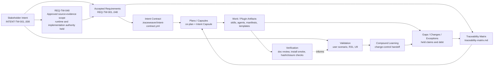

# Traceability: TraceWeaver Core

## System Context

System: TraceWeaver Core
Subsystem: project authority, plugin alpha, CE-compatible workflow surface
Scope: accepted baseline `REQ-BASELINE-2026-04-30-001`
Owner: Oxiom Systems
Mode: Standard / Advisory alpha
Status: accepted_traceability_matrix_with_refreshed_state_code_review_passed_u9_unit1_authority_doc_review_passed_u9_unit2_fixture_smoke_doc_review_passed_u9_unit3_gate_behavior_smoke_code_review_passed_doc_review_passed_u9_unit4_boundary_smoke_code_review_passed_doc_review_passed_u9_unit5_host_registry_filesystem_probe_code_review_passed_doc_review_passed_u9_unit7_host_install_attempt_doc_review_passed_u9_unit8_separate_home_install_passed_fresh_exec_registry_reviewed_held_code_review_passed_authority_doc_review_passed_u9_unit9_registry_shape_repair_auth_boundary_patch_code_review_passed_authority_doc_review_passed_u9_unit10_auth_safe_fresh_exec_and_active_host_runtime_probes_code_review_passed_authority_doc_review_passed_reviewed_held_u9_unit11_active_host_reconciled_runtime_pass_code_review_passed_authority_doc_review_passed_constrained_runtime_accepted_dogfood_classifier_code_review_passed_authority_doc_review_passed_skill_behavior_audit_unit1_behavior_contracts_recorded_review_pending_wrapper_direct_callable_expansion_code_review_passed_authority_doc_review_pending_review_wrapper_skills_recorded_review_pending_ce_350_skill_surface_inventory_source_refreshed_review_pending_tw_wrapper_backlog_reviewed_against_ce_350_recorded_review_pending_controlled_publication_gate_recorded_review_pending_code_test_trace_anchor_requirement_recorded_review_pending_structured_traceability_findings_requirement_recorded_review_pending_publication_held_broader_runtime_claims_held
Last updated: 2026-05-05
Effective review evidence: prior authority-state review `CE-DOC-REVIEW-2026-05-02-AUTHORITY-STATE-CLEAN-001`; current U9 Unit 1 authority-set review `CE-DOC-REVIEW-2026-05-03-U9-UNIT1-AUTHORITY-CLEAN-001` passed with no findings for ART-TW-024, VER-TW-019, TRACE-TW-010, U9 evidence, plan, and smoke-script scope. U9 Unit 2 authority-set review `CE-DOC-REVIEW-2026-05-03-U9-UNIT2-AUTHORITY-CLEAN-001` passed with no findings for ART-TW-025, VER-TW-020, TRACE-TW-011, fixture workspaces, U9 evidence, plan, matrix, Intent Contract, alpha evidence, and fixture-smoke scope. U9 Unit 3 authority-set review `CE-DOC-REVIEW-2026-05-03-U9-UNIT3-AUTHORITY-CLEAN-001` passed with no findings for ART-TW-026, VER-TW-021, TRACE-TW-012, fixture smoke harness, U9 evidence, plan, matrix, Intent Contract, and alpha evidence. The behavior-bearing harness `/ce-code-review` first returned P1 missing `tw-auto` dependency-resolution coverage; the harness was patched and rerun clean as `CE-CODE-REVIEW-2026-05-03-U9-UNIT3-HARNESS-CLEAN-001`. U9 Unit 4 boundary smoke is recorded as ART-TW-027, VER-TW-022, and TRACE-TW-013; behavior-bearing code review passed as `CE-CODE-REVIEW-2026-05-03-U9-UNIT4-HARNESS-CLEAN-001`, and authority-set doc review passed as `CE-DOC-REVIEW-2026-05-03-U9-UNIT4-AUTHORITY-CLEAN-001`. U9 Unit 5 host-registry filesystem probe is recorded as ART-TW-028, VER-TW-023, and TRACE-TW-014; behavior-bearing code review passed as `CE-CODE-REVIEW-2026-05-03-U9-UNIT5-HOST-REGISTRY-HARNESS-CLEAN-001`, and authority-set doc review passed as `CE-DOC-REVIEW-2026-05-03-U9-UNIT5-AUTHORITY-CLEAN-001`. U9 Unit 7 host install attempt is recorded as ART-TW-029, VER-TW-024, and TRACE-TW-015; authority-set doc review passed as `CE-DOC-REVIEW-2026-05-03-U9-UNIT7-AUTHORITY-CLEAN-001`. Unit 7 is accepted only as held install-conflict limitation evidence. U9 Unit 8 separate-home install/fresh exec registry probe is recorded as ART-TW-030, VER-TW-025, and TRACE-TW-016; refreshed behavior-bearing code review passed as `CE-CODE-REVIEW-2026-05-04-U9-SEPARATE-HOME-HARNESS-CLEAN-002` after replacing an asserted blocker cause with a neutral held observation, authority-set doc review passed as `CE-DOC-REVIEW-2026-05-04-U9-UNIT8-AUTHORITY-CLEAN-002`, and Unit 8 is accepted only as reviewed-held limitation evidence. U9 Unit 9 registry-shape/auth-boundary repair is recorded as ART-TW-031, VER-TW-026, and TRACE-TW-017; registry-shape and legacy-upgrade code review passed as `CE-CODE-REVIEW-2026-05-04-U9-UNIT9-INSTALLER-HARNESS-CLEAN-001`, refreshed auth-boundary behavior-code review passed as `CE-CODE-REVIEW-2026-05-04-U9-UNIT9-AUTH-BOUNDARY-HARNESS-CLEAN-001`, authority doc review passed as `CE-DOC-REVIEW-2026-05-04-U9-UNIT9-AUTHORITY-CLEAN-001`, and Unit 9 is accepted only as reviewed-held registry-shape/auth-boundary evidence. U9 Unit 10 auth-safe no-copy fresh exec and active-host runtime probes are recorded as ART-TW-032, VER-TW-027, and TRACE-TW-018; separate-home behavior-code review passed as `CE-CODE-REVIEW-2026-05-05-U9-UNIT10-AUTH-SAFE-HARNESS-CLEAN-001`, active-host harness code review passed as `CE-CODE-REVIEW-2026-05-05-U9-UNIT10-ACTIVE-HOST-HARNESS-CLEAN-001`, authority doc review passed as `CE-DOC-REVIEW-2026-05-05-U9-UNIT10-AUTHORITY-CLEAN-001`, and Unit 10 is accepted only as reviewed-held auth-safe/runtime-limitation evidence while runtime claims remain held. U9 Unit 11 active-host reconciled runtime pass is recorded as ART-TW-034, VER-TW-029, and TRACE-TW-020; the active host produced the exact `tw-authority-gate` skill-hash sentinel with required skills visible only after the host skill surface was reduced and the external CE plugin was disabled. Code review passed as `CE-CODE-REVIEW-2026-05-05-U9-UNIT11-HOST-REGISTRY-HARNESS-CLEAN-001`, authority doc review passed as `CE-DOC-REVIEW-2026-05-05-U9-UNIT11-AUTHORITY-CLEAN-001`, and Unit 11 is accepted only as constrained active-host `tw-authority-gate` runtime invocation proof while broader runtime, replacement, publication, release, and unconstrained-host claims remain held. Dogfood audit evidence is recorded as ART-TW-033, VER-TW-028, and TRACE-TW-019; classifier behavior code review passed as `CE-CODE-REVIEW-2026-05-05-DOGFOOD-CLASSIFIER-CLEAN-001`, authority doc review passed as `CE-DOC-REVIEW-2026-05-05-DOGFOOD-AUTHORITY-CLEAN-001`, and dogfood audit accepted use is limited to reviewed manual/advisory input while broader runtime claims remain held. Skill behavior audit Unit 1 is recorded as ART-TW-035, VER-TW-030, and TRACE-TW-021 with authority doc review pending; it must not be used as accepted audit input until `/ce-doc-review` passes. Wrapper direct-callable expansion for `ce-debug`, `ce-commit`, and `ce-commit-push-pr` is recorded as ART-TW-036, VER-TW-031, and TRACE-TW-022 with behavior code review passed as `CE-CODE-REVIEW-2026-05-05-WRAPPER-DIRECT-CALLABLE-CLEAN-001` and authority doc review pending; commit/push/PR behavior remains held. Candidate `tw-code-review`/`tw-doc-review` wrapper visibility and routing is recorded as ART-TW-037, VER-TW-032, and TRACE-TW-023 with review pending; CE review delegation and runtime behavior remain held. CE 3.5.0 full-surface inventory is refreshed from `/Users/hanneszietsman/CrypotAI/compound-engineering-plugin-main-3.5.0` at upstream commit `1f3c6466e4eb4e1b584c658953dfb1ca98dd3335` and recorded as ART-TW-038, VER-TW-033, and TRACE-TW-024 with requirements/doc review pending; the wrapper backlog is reviewed against that source surface as ART-TW-039, VER-TW-034, and TRACE-TW-025. Controlled publication-route candidate wording is recorded as ART-TW-040, VER-TW-035, and TRACE-TW-026 with requirements/doc review pending. Code/test trace-anchor candidate wording is recorded as ART-TW-041, VER-TW-036, and TRACE-TW-027 with requirements/doc review pending; scanner behavior, matrix code-anchor table behavior, `tw-code-review` enforcement, and dead-TDD classification remain held until planned, implemented, reviewed, and proven. Structured traceability-finding candidate wording is recorded as ART-TW-042, VER-TW-037, and TRACE-TW-028 with requirements/doc review pending; structured finding emission, file/line anchoring, severity mapping, Codex code-comment output, and wrapper integration remain held until planned, implemented, reviewed, and proven. Clean replacement and full CE parity remain held.
Effective gate: behavior-bearing unit traceability gate active for new or
changed meaningful behavior after this record.

Success signal: every meaningful artifact and behavior claim traces to
stakeholder intent, approved requirement or approved exception, verification
method, validation question, baseline version, and next-step handoff.

Failure signal: a plugin file, skill behavior, validation claim, workflow route,
or release statement exists without approved authority, verification evidence,
or a recorded gap/held claim.

Baseline or starting ref:

- baseline ID: `REQ-BASELINE-2026-04-30-001`
- baseline hash:
  `6934da7234fe4b59057baebb3cd1ff8a6570b533776185e9a9e3572b617768ba`
- requirements authority: `requirements.md`
- Intent Contract: `.traceweaver/intent-contract.yml`

This matrix is the accepted initial audit record for TraceWeaver Core. It is
seeded from `requirements.md` and `.traceweaver/intent-contract.yml`. It does
not promote candidate brainstorms, active plans, review findings, traceability
debt, or agent assumptions into implementation authority.

## Stakeholder Needs

| ID | Intent ID | Need | Stakeholder / Source | Success Signal | Status |
| --- | --- | --- | --- | --- | --- |
| NEED-TW-001 | INTENT-TW-001 | Preserve stakeholder intent through agentic planning, implementation, review, and release decisions. | `requirements.md`; `.traceweaver/intent-contract.yml` | Meaningful behavior changes trace back to what the stakeholder wanted. | Approved |
| NEED-TW-002 | INTENT-TW-002 | Prevent agents from silently converting assumptions into implementation authority. | `requirements.md`; `.traceweaver/intent-contract.yml` | Assumptions become questions, proposed requirements, exceptions, risks, or rejected assumptions. | Approved |
| NEED-TW-003 | INTENT-TW-003 | Provide a lightweight systems-engineering workflow usable by coding agents without a heavyweight database. | `requirements.md`; `.traceweaver/intent-contract.yml` | File-based authority artifacts are enough to control requirements, traceability, evidence, and changes. | Approved |
| NEED-TW-004 | INTENT-TW-004 | Preserve the Compound Engineering workflow while adding TraceWeaver authority controls. | `requirements.md`; `.traceweaver/intent-contract.yml`; `README.md` | CE planning, work, review, and compound workflows continue while TraceWeaver records warnings and held claims. | Approved |
| NEED-TW-005 | INTENT-TW-005 | Ship only claims with evidence and keep unproven claims explicitly held. | `requirements.md`; `.traceweaver/intent-contract.yml` | Static, dynamic, release, upstream, and clean-replacement claims are separated. | Approved |
| NEED-TW-006 | INTENT-TW-006 | Keep public artifacts clean of private provenance, protected source text, and unsupported compliance claims. | `requirements.md`; `.traceweaver/intent-contract.yml` | Public files pass hygiene checks before package or release claims. | Approved |
| NEED-TW-007 | INTENT-TW-007 | Provide a standalone TraceWeaver plugin based on the selected CE workflow surface, with TraceWeaver authority and traceability as the default control layer. | `requirements.md`; plugin README; `tw-auto`; `lfg` alias | Installing TraceWeaver gives users a TraceWeaver-controlled path instead of raw CE autopilot. | Approved |
| NEED-TW-008 | INTENT-TW-008 | Repackage the Compound Engineering method with systems-engineering authority while preserving the simple CE workflow steps. | `requirements.md`; README; plugin README; wrapped CE/TW skills | Users can move from idea to requirements to implementation and learning without dark code, duplicate behavior, hidden assumptions, or missing requirements becoming product behavior. | Approved |

## Requirements

| ID | Type | Requirement Summary | Source Need / Parent | Verification Method | Validation Path | Owner | Status |
| --- | --- | --- | --- | --- | --- | --- | --- |
| REQ-TW-001 | System | Define an Intent Contract as the controlled authority baseline for agent work. | NEED-TW-001; NEED-TW-002 | Inspection | VAL-TW-001 | Oxiom Systems | Approved |
| REQ-TW-002 | Constraint | Meaningful work must cite intent, approved authority, verification, validation question, and baseline version. | NEED-TW-001; NEED-TW-002 | Inspection | VAL-TW-001 | Oxiom Systems | Approved |
| REQ-TW-003 | Constraint | Agent assumptions must become explicit questions, requirements, exceptions, risks, or rejected assumptions. | NEED-TW-002 | Inspection | VAL-TW-002 | Oxiom Systems | Approved |
| REQ-TW-004 | Workflow | Every meaningful task must have an Intent Capsule or equivalent bounded work package. | NEED-TW-001; NEED-TW-002 | Inspection | VAL-TW-001 | Oxiom Systems | Approved |
| REQ-TW-005 | System | Maintain the controlled chain from intent to requirements, authority, implementation, verification, validation, and change control. | NEED-TW-001; NEED-TW-003 | Inspection | VAL-TW-001 | Oxiom Systems | Approved |
| REQ-TW-006 | Review | Classify meaningful behavior without approved trace as dark behavior. | NEED-TW-001; NEED-TW-002 | Inspection / review | VAL-TW-002 | Oxiom Systems | Approved |
| REQ-TW-007 | V&V | Keep verification evidence separate from validation evidence and carry validation questions with tasks. | NEED-TW-001; NEED-TW-003 | Inspection | VAL-TW-001 | Oxiom Systems | Approved |
| REQ-TW-008 | Audit | Use the Markdown traceability matrix as the authoritative audit record. | NEED-TW-003 | Inspection | VAL-TW-003 | Oxiom Systems | Approved |
| REQ-TW-009 | Architecture | Target the eleven-skill Core suite in controlled promotion increments. | NEED-TW-003; NEED-TW-005 | Inspection | VAL-TW-004 | Oxiom Systems | Approved |
| REQ-TW-010 | Architecture | Keep `requirements-reviewer` and `systems-engineering-traceability` upstream-neutral. | NEED-TW-003; NEED-TW-004 | Inspection | VAL-TW-005 | Oxiom Systems | Approved |
| REQ-TW-011 | Scope | U6b Unit 2 alpha includes only selected authority foundation and selected CE-compatible surfaces. | NEED-TW-001; NEED-TW-003 | Inspection | VAL-TW-004 | Oxiom Systems | Approved |
| REQ-TW-012 | Scope | Runtime scope stays staged until later accepted scope decisions approve more. | NEED-TW-005 | Inspection | VAL-TW-004 | Oxiom Systems | Approved |
| REQ-TW-013 | Adapter | CE wrappers invoke Core skills without redefining Core semantics. | NEED-TW-004 | Inspection | VAL-TW-005 | Oxiom Systems | Approved |
| REQ-TW-014 | Adapter | Preserve selected CE workflow skill names while clean replacement remains held. | NEED-TW-004; NEED-TW-005 | Install smoke / runtime proof | VAL-TW-006 | Oxiom Systems | Approved |
| REQ-TW-015 | Packaging | Plugin README and manifests must accurately describe alpha skill invocation and avoid unproven slash-command claims. | NEED-TW-005 | Inspection | VAL-TW-006 | Oxiom Systems | Approved |
| REQ-TW-016 | Packaging | Documented Codex install command must materialize selected skills using `--include-skills`. | NEED-TW-004; NEED-TW-005 | Install smoke | VAL-TW-006 | Oxiom Systems | Approved |
| REQ-TW-017 | Provenance | Resolve CE upstream source pin or record accepted local-cache-only limitation before vendoring/release claims. | NEED-TW-005; NEED-TW-006 | Inspection | VAL-TW-007 | Oxiom Systems | Approved |
| REQ-TW-018 | Packaging | Prove transitive closure for selected CE support files. | NEED-TW-004; NEED-TW-005 | Static closure audit | VAL-TW-006 | Oxiom Systems | Approved |
| REQ-TW-019 | Claims | Limit U6b-alpha to package/install/static materialization evidence. | NEED-TW-005 | Inspection | VAL-TW-006 | Oxiom Systems | Approved |
| REQ-TW-020 | Claims | U7 release claims must stay narrow and keep unproven claims held. | NEED-TW-005 | Inspection | VAL-TW-008 | Oxiom Systems | Approved |
| REQ-TW-021 | Hygiene | Public artifacts must avoid private paths, protected source names, raw standards text, copied source material, and unsupported compliance claims. | NEED-TW-006 | Hygiene scan | VAL-TW-009 | Oxiom Systems | Approved |
| REQ-TW-022 | Validation | R31 real-project validation remains required before release-ready or upstream-ready claims. | NEED-TW-005 | Real-project validation review | VAL-TW-010 | Oxiom Systems | Held |
| REQ-TW-023 | Workflow | Completed TraceWeaver tasks must end with suggested next steps. | NEED-TW-003; NEED-TW-005 | Inspection | VAL-TW-011 | Oxiom Systems | Approved |
| REQ-TW-024 | Authority | Classify authority-chain, installed-artifact, validation-claim, public-doc, and user-visible changes as meaningful by default. | NEED-TW-001; NEED-TW-002 | Inspection | VAL-TW-001 | Oxiom Systems | Approved |
| REQ-TW-025 | Workflow | Advisory alpha supports minimal capsules for low-risk work without bypassing authority. | NEED-TW-003; NEED-TW-005 | Inspection | VAL-TW-011 | Oxiom Systems | Approved |
| REQ-TW-026 | Scope | Needs capture and risk/gap/change-control runtime materialization remain future or separately scoped. | NEED-TW-003; NEED-TW-005 | Inspection | VAL-TW-004 | Oxiom Systems | Approved |
| REQ-TW-027 | Policy | U6b Unit 2 defines static advisory policy only; runtime warning/gap-routing remains held. | NEED-TW-004; NEED-TW-005 | Inspection | VAL-TW-006 | Oxiom Systems | Approved |
| REQ-TW-028 | CE Compatibility | Materialize selected CE agents or record explicit per-workflow limitations and claim classes. | NEED-TW-004; NEED-TW-005 | Package file list / install smoke | VAL-TW-006 | Oxiom Systems | Approved |
| REQ-TW-029 | Provenance | Local-cache-only CE source limitations must record provenance, hashes, claim restrictions, stale reset, and unproven scope. | NEED-TW-005; NEED-TW-006 | Inspection | VAL-TW-007 | Oxiom Systems | Approved |
| REQ-TW-030 | Mode | Alpha defaults to advisory mode through a controlled policy contract. | NEED-TW-004; NEED-TW-005 | Inspection / install smoke | VAL-TW-011 | Oxiom Systems | Approved |
| REQ-TW-031 | Templates | Unit 2 must materialize Intent Contract, task capsule, trace record, gap, change, and exception templates. | NEED-TW-001; NEED-TW-003 | Inspection / install smoke | VAL-TW-006 | Oxiom Systems | Approved |
| REQ-TW-032 | Drift Check | Alpha must provide a low-friction advisory drift check for plans, reviews, or task capsules. | NEED-TW-001; NEED-TW-003; NEED-TW-004 | Inspection | VAL-TW-011 | Oxiom Systems | Approved |
| REQ-TW-033 | Workflow | TraceWeaver-controlled workflow composition must group authority-control steps with CE-compatible workflow stages once wrapper sequencing is implemented and proven. | NEED-TW-001; NEED-TW-004 | Inspection | VAL-TW-011 | Oxiom Systems | Approved |
| REQ-TW-034 | Automation | The first TraceWeaver-controlled autonomous alpha surface must be `tw-auto`, and packaged `lfg` must delegate to `tw-auto` instead of running raw CE autopilot. | NEED-TW-004; NEED-TW-005; NEED-TW-007 | Inspection / install smoke | VAL-TW-011 | Oxiom Systems | Approved |
| REQ-TW-035 | Automation | Controlled automation may continue only while authority remains clear and must stop for missing or changed authority, unresolved dark behavior, or human authority decisions. | NEED-TW-001; NEED-TW-002; NEED-TW-005 | Inspection | VAL-TW-011 | Oxiom Systems | Approved |
| REQ-TW-036 | Traceability | `tw-auto` must find or bootstrap `traceability-matrix.md` before implementation starts. | NEED-TW-001; NEED-TW-003 | Inspection / smoke test | VAL-TW-003; VAL-TW-011 | Oxiom Systems | Approved |
| REQ-TW-037 | Automation | The autonomous review-fix loop must be bounded by progress checks and default to at most two review-fix cycles per run unless reviewed configuration says otherwise. | NEED-TW-003; NEED-TW-005 | Inspection | VAL-TW-011 | Oxiom Systems | Approved |
| REQ-TW-038 | Verification | Behavior-bearing code changes made by controlled automation must link test evidence to the matrix by default unless approved authority permits non-test verification. | NEED-TW-001; NEED-TW-003 | Inspection / test evidence | VAL-TW-001; VAL-TW-003 | Oxiom Systems | Approved |
| REQ-TW-039 | Automation | `tw-auto` must stop before commit, push, or PR while authority, verification, review, traceability, dark-behavior, stale-evidence, or gap/change/exception write blockers remain. | NEED-TW-002; NEED-TW-005 | Inspection | VAL-TW-011 | Oxiom Systems | Approved |
| REQ-TW-040 | Review | `tw-auto` must define review severity policy before running automation. | NEED-TW-003; NEED-TW-005 | Inspection | VAL-TW-011 | Oxiom Systems | Approved |
| REQ-TW-041 | Standalone Plugin | TraceWeaver must be productized as a standalone CE-based plugin where familiar workflow entrypoints route through TraceWeaver authority controls or are marked legacy/manual-continuity only. | NEED-TW-004; NEED-TW-007 | Inspection | VAL-TW-011 | Oxiom Systems | Approved |
| REQ-TW-042 | Bootstrap | Fresh installs must provide an authority bootstrap path for `requirements.md`, `traceability-matrix.md`, and `.traceweaver/intent-contract.yml` before implementation. | NEED-TW-001; NEED-TW-003; NEED-TW-007 | Inspection / smoke test | VAL-TW-001; VAL-TW-011 | Oxiom Systems | Approved |
| REQ-TW-043 | Workflow Boundary | Direct selected CE-compatible skills are packaged implementation components; direct CE invocation does not satisfy TraceWeaver closure unless TraceWeaver authority, traceability, verification, and validation records are also updated. | NEED-TW-004; NEED-TW-005; NEED-TW-007 | Inspection | VAL-TW-011 | Oxiom Systems | Approved |
| REQ-TW-044 | Wrapper Method | Selected CE method steps must be wrapped or repackaged with TraceWeaver systems-engineering controls instead of leaving TraceWeaver as adjacent skills. | NEED-TW-004; NEED-TW-008 | Inspection / runtime proof | VAL-TW-011 | Oxiom Systems | Approved |
| REQ-TW-045 | Baseline Bootstrap | Idea and brainstorm flows must create or update root `requirements.md`, root `traceability-matrix.md`, `.traceweaver/intent-contract.yml`, and gap/change/exception records before implementation authority exists. | NEED-TW-001; NEED-TW-003; NEED-TW-008 | Inspection / smoke test | VAL-TW-001; VAL-TW-003 | Oxiom Systems | Approved |
| REQ-TW-046 | Dark Behavior Detection | Traceability checks must flag untraced, duplicate, unnecessary, or logical-but-uncaptured behavior-bearing units as dark behavior, proposed requirements, gaps, changes, exceptions, or removal candidates. | NEED-TW-001; NEED-TW-002; NEED-TW-008 | Review evidence / matrix inspection | VAL-TW-002; VAL-TW-003 | Oxiom Systems | Approved |
| REQ-TW-047 | Systems Engineering Source Hygiene | TraceWeaver may operationalize IEEE 15288/INCOSE-style principles in original wording, but must not copy protected standards text or overclaim formal conformance. | NEED-TW-006; NEED-TW-008 | Hygiene scan / doc review | VAL-TW-009 | Oxiom Systems | Approved |
| REQ-TW-048 | Intent Deepening | Optional `tw-grill` runs after an ideation source and before `ce-brainstorm`, supports bootstrap mode when no authority exists and delta/gap mode when partial authority exists, inventories existing authority before broad questioning, classifies coverage gaps, focuses questions on missing/weak/stale/contradictory/dark-behavior items, routes outcomes to source-evidence authority deltas, credits the `grill-with-docs` inspiration, and outputs source evidence only. `ce:ideate` remains optional external CE context until separately selected for packaging. | NEED-TW-001; NEED-TW-003; NEED-TW-008 | Inspection / install smoke | VAL-TW-011 | Oxiom Systems | Approved |
| REQ-TW-049 | Review Wrapper | `tw-code-review` must run or require `tw-traceability-check` before delegating to TraceWeaver-packaged `ce-code-review`, and must keep staging, commit, push, PR, publication, clean replacement, release, and broader runtime claims held until separate gates pass. | NEED-TW-001; NEED-TW-004; NEED-TW-008 | Inspection / future fixture smoke | VAL-TW-011 | Oxiom Systems | Candidate for review |
| REQ-TW-050 | Review Wrapper | `tw-doc-review` must run or require `tw-requirements-review` for requirements or authority text, require trace/hash/status consistency checks for authority records, and delegate to TraceWeaver-packaged `ce-doc-review` only after preflights are passable or explicitly held. | NEED-TW-001; NEED-TW-003; NEED-TW-004; NEED-TW-008 | Inspection / future fixture smoke | VAL-TW-011 | Oxiom Systems | Candidate for review |
| REQ-TW-051 | CE Surface Inventory | TraceWeaver must compare the active CE source skill surface against packaged/routed TraceWeaver skills and classify each missing or unwrapped CE skill before claiming full standalone-plugin parity or clean CE replacement. | NEED-TW-004; NEED-TW-005; NEED-TW-007; NEED-TW-008 | Source inventory diff / inspection | VAL-TW-011 | Oxiom Systems | Candidate for review |
| REQ-TW-052 | TW Wrapper Backlog | TraceWeaver must maintain a wrapper backlog for every CE-derived skill users may expect after replacing CE, naming the TW route or held/out-of-scope decision plus authority, traceability, verification, validation, allowed-output, blocked-output, and publication boundaries for each selected wrapper. | NEED-TW-001; NEED-TW-003; NEED-TW-004; NEED-TW-005; NEED-TW-007; NEED-TW-008 | Backlog inspection / future fixture smoke | VAL-TW-011 | Oxiom Systems | Candidate for review |
| REQ-TW-053 | Controlled Publication Route | `tw-auto` must support normal verified code publication without a new requirements gate when approved authority is unchanged, but must route requirement, authority, validation-intent, release-claim, or publication-policy changes back through requirements/authority review before staging, commit, push, or PR. | NEED-TW-001; NEED-TW-002; NEED-TW-003; NEED-TW-004; NEED-TW-005; NEED-TW-007; NEED-TW-008 | Requirements review / future publication-route fixture smoke | VAL-TW-011 | Oxiom Systems | Candidate for review |
| REQ-TW-054 | Code/Test Trace Anchors | Behavior-bearing source files, high-level functions, tests, fixtures, and smoke scripts must carry requirement and verification anchors at file/function/test granularity, with exceptions recorded in the matrix or approved exceptions. | NEED-TW-001; NEED-TW-003; NEED-TW-008 | Scanner / future fixture smoke | VAL-TW-011 | Oxiom Systems | Candidate for review |
| REQ-TW-055 | Structured Traceability Findings | `tw-traceability-check` must emit reviewer-style structured findings for traceability failures, including severity, status, title, evidence, affected IDs, file/line anchors when available, claim impact, and concrete remediation. | NEED-TW-001; NEED-TW-003; NEED-TW-008 | Fixture smoke / future implementation review | VAL-TW-011 | Oxiom Systems | Candidate for review |

## Artifact Inventory

| Artifact ID | Artifact | Linked Requirements | Role | Current Coverage | Status |
| --- | --- | --- | --- | --- | --- |
| ART-TW-001 | `requirements.md` | REQ-TW-001 - REQ-TW-055 | Accepted master requirements baseline plus review-pending candidate wrapper, CE-surface inventory, TW-wrapper backlog, controlled publication-route, code/test trace-anchor, and structured traceability-finding requirements. | Baseline accepted by `CE-DOC-REVIEW-2026-04-30-REQ-MASTER-CLEAN-001`, amended by `REQ-AMEND-2026-05-01-001` for controlled-autonomy requirements and standalone plugin intent, amended by `REQ-AMEND-2026-05-03-001` for approved `tw-grill` source-evidence intent deepening, and now records REQ-TW-049/050 as candidate review-wrapper requirements, REQ-TW-051 as a candidate CE full-surface classification requirement, REQ-TW-052 as a candidate TW-wrapper backlog requirement, REQ-TW-053 as a candidate controlled publication-route requirement, REQ-TW-054 as a candidate code/test trace-anchor requirement, and REQ-TW-055 as a candidate structured traceability-finding requirement only. | Approved baseline through REQ-TW-048 / REQ-TW-049-055 candidate review pending / runtime/publication/code-anchor/structured-finding enforcement held |
| ART-TW-002 | `.traceweaver/intent-contract.yml` | REQ-TW-001 - REQ-TW-004; REQ-TW-024; REQ-TW-025; REQ-TW-030 | Project authority contract. | Exists and cites accepted baseline/hash. | Approved for matrix use |
| ART-TW-003 | `traceability-matrix.md` | REQ-TW-005 - REQ-TW-008; REQ-TW-023 | This audit matrix. | Accepted initial matrix by `CE-DOC-REVIEW-2026-05-01-TRACEABILITY-MATRIX-P2-CLOSURE-001`; behavior-bearing unit gate is active for new/changed meaningful behavior. | Approved |
| ART-TW-004 | `plugins/traceweaver-core/.codex-plugin/plugin.json` and peer manifests | REQ-TW-014 - REQ-TW-016; REQ-TW-019 - REQ-TW-021 | Installable plugin manifest surface. | Covered by U6b alpha static materialization evidence; dynamic runtime, slash-command, enforcing-mode, and clean-replacement claims remain held. | Static accepted / runtime held |
| ART-TW-005 | `plugins/traceweaver-core/skills/tw-requirements-review/SKILL.md` | REQ-TW-001 - REQ-TW-005; REQ-TW-013; REQ-TW-032 | TraceWeaver adapter for requirements review. | Static package present; runtime proof held. | Partial |
| ART-TW-006 | `plugins/traceweaver-core/skills/tw-authority-gate/SKILL.md` | REQ-TW-002 - REQ-TW-006; REQ-TW-013; REQ-TW-030 | Advisory authority gate adapter. | Static package present; runtime proof held. | Partial |
| ART-TW-007 | `plugins/traceweaver-core/skills/tw-traceability-check/SKILL.md` | REQ-TW-005 - REQ-TW-008; REQ-TW-013; REQ-TW-032 | Traceability and dark-behavior adapter. | Static package present; runtime proof held. | Partial |
| ART-TW-008 | `plugins/traceweaver-core/skills/requirements-reviewer/SKILL.md` | REQ-TW-010 - REQ-TW-012 | Selected upstream-neutral requirements-quality skill. | Static package present. | Partial |
| ART-TW-009 | `plugins/traceweaver-core/skills/systems-engineering-traceability/SKILL.md` | REQ-TW-005 - REQ-TW-012 | Selected upstream-neutral traceability skill. | Static package present. | Partial |
| ART-TW-010 | Selected CE-compatible skill directories recorded by `docs/validation/traceweaver-core-11-ce-runtime-inventory.md`: `ce-brainstorm`, `ce-code-review`, `ce-commit`, `ce-commit-push-pr`, `ce-compound`, `ce-compound-refresh`, `ce-debug`, `ce-doc-review`, `ce-plan`, `ce-resolve-pr-feedback`, `ce-session-extract`, `ce-session-inventory`, `ce-sessions`, `ce-setup`, `ce-test-browser`, `ce-test-xcode`, `ce-work`, `ce-worktree`, and TraceWeaver-packaged `lfg` alias. | REQ-TW-014; REQ-TW-017; REQ-TW-018; REQ-TW-027 - REQ-TW-029; REQ-TW-041; REQ-TW-043; REQ-TW-044 | Selected CE-compatible implementation component surface plus `lfg` compatibility alias. | Static files, source pin, support-closure audit, and U6b stale-reset coverage are accepted for Unit 2 static materialization. `lfg` now delegates to `tw-auto`; direct `ce-*` invocation remains manual-continuity only and does not satisfy TraceWeaver closure by itself. `ce-plan` and `ce-work` include TraceWeaver package-boundary primers, but they are not runtime-proven wrappers. Future wrapper work must embed TraceWeaver controls into the CE method steps. | Static accepted / runtime held |
| ART-TW-011 | Selected CE agent files recorded by `docs/validation/traceweaver-core-11-ce-runtime-inventory.md` and installed under `plugins/traceweaver-core/agents/`. | REQ-TW-014; REQ-TW-028 | Selected CE agent file materialization only. | Installed identity/hash proof is accepted in U6b evidence. This row does not authorize unlisted CE agents or agent-backed runtime behavior. | Static accepted / runtime held |
| ART-TW-012 | `plugins/traceweaver-core/references/*template*.yml` and `traceweaver-runtime-policy.md` | REQ-TW-001 - REQ-TW-004; REQ-TW-024; REQ-TW-025; REQ-TW-030; REQ-TW-031 | Template and advisory policy surface. | Static template and policy materialization is accepted for Unit 2. Runtime warning/gap-routing behavior remains held until later runtime proof. | Static accepted / runtime held |
| ART-TW-013 | `docs/validation/traceweaver-core-11-u6b-plugin-runtime.md` | REQ-TW-014 - REQ-TW-021; REQ-TW-027 - REQ-TW-031 | U6b alpha and Unit 2 validation evidence. | U6b alpha and Unit 2 static materialization evidence is accepted for selected skills, references, CE-compatible skill files, selected agents, templates, source pin, support closure, and stale-reset coverage. Dynamic runtime invocation, automatic wrapper sequencing, slash commands, enforcing mode, and clean CE replacement remain held. | Static accepted / runtime held |
| ART-TW-014 | `docs/brainstorms/2026-05-01-traceweaver-controlled-autonomy-requirements.md` | REQ-TW-032 - REQ-TW-040 | Controlled-autonomy requirements source. | Promoted into `requirements.md` by `REQ-AMEND-2026-05-01-001`; authorizes planning/static materialization only, not runtime claims. | Promoted source / runtime held |
| ART-TW-015 | `docs/plans/2026-05-01-003-feat-traceweaver-controlled-autonomy-plan.md` | REQ-TW-032 - REQ-TW-040 | Controlled autonomy implementation plan. | Plan review passed before static materialization; authorizes static `tw-auto` package surface only, not runtime or publication claims. | Reviewed plan / runtime held |
| ART-TW-016 | `README.md`; `plugins/traceweaver-core/README.md` | REQ-TW-004; REQ-TW-013; REQ-TW-014; REQ-TW-027; REQ-TW-030; REQ-TW-033 - REQ-TW-048 | User-facing workflow and installed-surface documentation. | Describes root `requirements.md` and `traceability-matrix.md` authority files; selected CE skills as implementation components/manual-continuity surfaces; `tw-grill` as approved optional post-ideation source evidence; `lfg` as a `tw-auto` compatibility alias; `tw-auto` as advisory controlled automation; and the core product intent to repackage the CE method with TraceWeaver systems-engineering authority at each handoff. | Static updated / review pending |
| ART-TW-017 | `plugins/traceweaver-core/skills/tw-auto/SKILL.md`; `plugins/traceweaver-core/skills/tw-auto/references/`; `plugins/traceweaver-core/skills/lfg/SKILL.md` | REQ-TW-033 - REQ-TW-050 | TraceWeaver-controlled autonomous alpha skill, `lfg` compatibility alias, plus skill-local policy/templates required by include-skills installs; `tw-grill` source-evidence boundary is referenced as approved static/advisory scope and review-wrapper routing is candidate/review-pending. | Static skill and skill-local references materialized; requires or bootstraps authority files, requires Intent Contract, root matrix, authority gate, trace update, severity policy, bounded review-fix cycles, reviewer subagent queue/backpressure/close handling, stop-before-commit boundary, and now routes review handoffs through candidate `tw-code-review`/`tw-doc-review`. Runtime invocation proof remains held; `tw-grill` output remains source evidence only; REQ-TW-049/050 are not accepted authority until review passes. | Static materialized / candidate wrapper routing recorded / runtime held |
| ART-TW-018 | `plugins/traceweaver-core/references/requirements-baseline-template.md`; `plugins/traceweaver-core/references/intent-contract-template.yml`; `plugins/traceweaver-core/references/traceweaver-controlled-autonomy-policy.md`; `plugins/traceweaver-core/references/automation-loop-state-template.yml`; `plugins/traceweaver-core/references/traceability-matrix-bootstrap-template.md`; `plugins/traceweaver-core/skills/tw-auto/references/requirements-baseline-template.md`; `plugins/traceweaver-core/skills/tw-auto/references/intent-contract-template.yml`; `plugins/traceweaver-core/skills/tw-auto/references/traceweaver-controlled-autonomy-policy.md`; `plugins/traceweaver-core/skills/tw-auto/references/automation-loop-state-template.yml`; `plugins/traceweaver-core/skills/tw-auto/references/traceability-matrix-bootstrap-template.md`; `plugins/traceweaver-core/references/traceweaver-runtime-policy.md` | REQ-TW-033 - REQ-TW-048 | Controlled-autonomy policy and templates. | Static policy/templates materialized at plugin level and skill-local `tw-auto` level; policy covers requirements baseline bootstrap, Intent Contract bootstrap, authority bootstrap, and `lfg` compatibility alias; YAML parse/static inspection passed; isolated install smoke proved skill-local `tw-auto` templates materialize with `--include-skills`; code review and doc review passed after tracked blocker repairs. | Static checks/install smoke passed / code review passed / doc review passed / runtime held |
| ART-TW-019 | `docs/validation/traceweaver-controlled-autonomy-alpha.md` | REQ-TW-019 - REQ-TW-023; REQ-TW-033 - REQ-TW-048 | Controlled-autonomy alpha evidence. | Evidence record created for static `tw-auto` package-scope addition, `lfg` alias, and approved static/advisory `tw-grill` source-evidence skill; static checks and refreshed isolated install smoke passed for the current `tw-auto` and `tw-grill` hashes; current reviewer-capacity/authority-state code review passed, prior doc review passed before the REQ-TW-048 two-mode amendment, and REQ-TW-048 amendment doc review passed. | Static checks/install smoke passed / current hashes installed / code review passed / REQ-TW-048 doc review passed / runtime held |
| ART-TW-020 | `plugins/traceweaver-core/skills/tw-grill/SKILL.md`; `plugins/traceweaver-core/skills/tw-grill/references/upstream-notice.md` | REQ-TW-048 | Optional post-ideation intent-deepening skill plus upstream attribution. | Static skill and notice materialized; install smoke proves both are copied by `--include-skills`; requires selected idea, uses bootstrap only when no controlled authority set exists, uses delta/gap whenever any controlled authority artifact exists, inventories existing authority for delta/gap mode, classifies coverage gaps, interrogates unresolved decision branches, inspects repo/domain docs, challenges terminology, provides recommended answers, credits the upstream inspiration, and records source evidence only. Runtime invocation proof and implementation-authority claims remain held. | Static materialized / install smoke passed / requirement approved / runtime held |
| ART-TW-021 | `src/index.ts` | REQ-TW-016; REQ-TW-041; REQ-TW-043 | Repository-local installer for the documented README command. | Self-contained Codex alpha installer materializes TraceWeaver skill directories and selected CE agent TOML files with `--include-skills`, writes an install manifest, and fails closed when skill materialization is omitted, a non-Codex target is requested, or a direct callable install would overwrite an existing unowned global skill directory. | Static materialized / install smoke refreshed |
| ART-TW-022 | Historical upstream CE 3.4.1 skill surface | REQ-TW-041; REQ-TW-044 | Superseded future full-surface wrapping scope. | The historical CE 3.4.1 comparison remains U6b planning evidence only. Current wrapper-backlog decisions now use the CE 3.5.0 source surface recorded in ART-TW-038/039, so agents must not use this row to claim current CE-surface coverage or clean replacement. | Historical / superseded for current source-surface decisions |
| ART-TW-023 | `docs/validation/traceweaver-u7-static-advisory-claims.md` | REQ-TW-019 - REQ-TW-022; REQ-TW-033 - REQ-TW-048 | U7 static/advisory claim record for `tw-auto`, `lfg`, the README install command, and `tw-grill` source-evidence behavior. | Tracked authority artifact refreshed against non-stale controlled-autonomy alpha evidence and matrix; prior `/ce-doc-review` passed with no findings for the earlier U7 static/advisory scope; current reviewer-capacity/authority refresh has code review passed and refreshed install smoke passed for current `tw-auto`/`tw-grill` hashes; accepts TW-CLAIM-U7-STATIC-001 through TW-CLAIM-U7-STATIC-004 as static/advisory claims; keeps runtime, release, clean-replacement, slash-command, enforcing, dynamic-discovery, autonomous-publication, and U9 claims held. | Static/advisory accepted / current hashes installed / code review passed / REQ-TW-048 approved / runtime held |
| ART-TW-024 | `scripts/traceweaver-smoke-codex-discovery`; `docs/validation/traceweaver-u9-codex-runtime-discovery.md` | REQ-TW-014; REQ-TW-016; REQ-TW-033 - REQ-TW-048 | U9 Unit 1 isolated Codex install and discovery smoke harness plus evidence record. | Proves isolated `--codexHome` install materializes 27 packaged TraceWeaver skill directories outside the active Codex skill scan path, 27 direct callable skill directories, 49 selected agent TOML files, 17 references, zero prompts, source-identical required `tw-*`/`lfg`/CE-compatible dependency copies, direct callable marker files, and fail-closed handling for an unowned direct callable conflict. Host-level active Codex registry discovery remains held until fresh session/reload evidence exists. | Isolated install/discovery smoke passed / host registry discovery held |
| ART-TW-025 | `fixtures/u9-codex/`; `scripts/traceweaver-smoke-u9-fixtures`; `docs/validation/traceweaver-u9-codex-runtime-discovery.md` | REQ-TW-035; REQ-TW-036; REQ-TW-038; REQ-TW-039; REQ-TW-042; REQ-TW-045; REQ-TW-046; REQ-TW-047; REQ-TW-048 | U9 Unit 2 controlled fixture workspaces and deterministic fixture scan. | Creates synthetic authority-present, missing-authority, stale-authority, weak-requirement, trace-gap, and trace-write fixtures. The smoke harness classifies the negative fixtures as blocked, verifies matching fixture authority hashes, and writes trace/gap/change/exception/matrix outputs only in a temporary copy while source fixture files remain unchanged. Fixtures are not project authority and do not prove active host-registry discovery or real `tw-*` runtime invocation. REQ-TW-048 is approved only for static/advisory source-evidence scope here. | Fixture classification smoke passed / doc review passed / runtime claims held |
| ART-TW-026 | `scripts/traceweaver-smoke-u9-fixtures`; `docs/validation/traceweaver-u9-codex-runtime-discovery.md` | REQ-TW-035; REQ-TW-036; REQ-TW-038; REQ-TW-039; REQ-TW-042; REQ-TW-045; REQ-TW-046; REQ-TW-047; REQ-TW-048 | U9 Unit 3 deterministic core gate-behavior smoke. | Extends the fixture harness to classify authority-present/missing/stale authority gate behavior, complete/trace-gap traceability behavior, approved/weak requirements-review behavior, `tw-auto` authority loading, missing authority, missing TraceWeaver-packaged skill resolution, and temporary-copy-only trace-write containment. The missing-skill-resolution fixture now covers a missing TraceWeaver-native dependency and a missing CE-compatible dependency. Host-level active Codex registry discovery, real `tw-*` runtime invocation, enforcing behavior, and project-level authority-file mutation remain held. REQ-TW-048 is approved only for static/advisory source-evidence scope here. | Gate-behavior smoke passed / code review passed / doc review passed / host-registry and runtime claims held |
| ART-TW-027 | `scripts/traceweaver-smoke-codex-discovery`; `scripts/traceweaver-smoke-no-publication`; `docs/validation/traceweaver-u9-codex-runtime-discovery.md` | REQ-TW-034; REQ-TW-039; REQ-TW-040; REQ-TW-041; REQ-TW-043; REQ-TW-044; REQ-TW-048 | U9 Unit 4 deterministic `lfg`, PR-helper publication-stop, and reviewer backpressure boundary smoke. | Verifies installed and source `lfg` delegates to `tw-auto`, blocks raw CE autopilot fallback, and does not directly run raw CE workflow steps. Verifies PR helper scripts stop before `gh`, including bypass-like env input, while broader commit/push/release paths remain static marker checks. Verifies event-derived reviewer capacity backpressure is incomplete coverage with pending reviewers and cannot close required review, U9, runtime, or release gates. Active Codex host registry, real skill invocation, live reviewer-capacity behavior, and runtime claims remain held. REQ-TW-048 is approved only for static/advisory source-evidence scope here. | Boundary smoke passed / code review passed / doc review passed / runtime claims held |
| ART-TW-028 | `scripts/traceweaver-smoke-codex-host-registry`; `docs/validation/traceweaver-u9-codex-runtime-discovery.md` | REQ-TW-014; REQ-TW-016; REQ-TW-033 - REQ-TW-048 | U9 Unit 5 current Codex host-home filesystem registry probe, extended by Unit 10 active-host runtime probe. | Read-only probe of `${CODEX_HOME:-$HOME/.codex}/skills` found current direct callable host entries for `lfg`, `ce-plan`, `ce-work`, `ce-code-review`, and `ce-doc-review`, but not `tw-auto`, `tw-authority-gate`, `tw-traceability-check`, `tw-requirements-review`, or `tw-grill`; present entries were unmarked and stale relative to TraceWeaver-packaged source hashes. Unit 10 extends this harness to record prompt-input visibility and read-only host `codex exec`; current host prompt-input omits required skills and host exec returns `TRACEWEAVER_SKILL_HELD=not_available`. Active Codex host registry, real skill invocation, and runtime claims remain held. | Host active-runtime probe recorded / active-host code review passed / authority doc review passed / reviewed-held limitation evidence only / missing TraceWeaver-native callable files / runtime claims held |
| ART-TW-029 | `src/index.ts`; `docs/validation/traceweaver-u9-codex-runtime-discovery.md` | REQ-TW-014; REQ-TW-016; REQ-TW-041; REQ-TW-043; REQ-TW-033 - REQ-TW-048 | U9 Unit 7 current Codex host install attempt. | Running the documented installer against the default current Codex home exited with code 1 before overwrite because existing global callable skill directories were not TraceWeaver-marked direct callable copies: `ce-brainstorm`, `ce-code-review`, `ce-compound`, `ce-compound-refresh`, `ce-debug`, `ce-doc-review`, `ce-plan`, `ce-sessions`, `ce-setup`, `ce-work`, and `lfg`. No fresh reload or real `tw-*` invocation was attempted. Doc review passed, but only for held install-conflict limitation evidence. | Host install attempt reviewed held / install blocked by unowned callable conflicts / runtime claims held |
| ART-TW-030 | `scripts/traceweaver-smoke-codex-separate-home-runtime`; `docs/validation/traceweaver-u9-codex-runtime-discovery.md` | REQ-TW-014; REQ-TW-016; REQ-TW-041; REQ-TW-043; REQ-TW-033 - REQ-TW-048 | U9 Unit 8 separate Codex home install and fresh exec registry probe. | Running the isolated-home harness installed TraceWeaver successfully into a temporary separate Codex home, then launched `codex exec` with both `HOME` and `CODEX_HOME` pointed at the isolated home. The fresh exec session exited 0, but the captured visible-skill list excluded `tw-authority-gate`; the harness now emits `fresh_codex_registry_loading_observation=held_tw_authority_gate_not_in_visible_skill_list` instead of asserting a registry-loading cause. | Separate-home install passed / fresh exec registry held / code review passed / authority doc review passed / reviewed-held limitation evidence only / runtime claims held |
| ART-TW-031 | `src/index.ts`; `scripts/traceweaver-smoke-codex-discovery`; `scripts/traceweaver-smoke-codex-separate-home-runtime`; `docs/validation/traceweaver-u9-codex-runtime-discovery.md` | REQ-TW-014; REQ-TW-016; REQ-TW-041; REQ-TW-043; REQ-TW-033 - REQ-TW-048 | U9 Unit 9 Codex registry-shape and auth-boundary repair. | Installer now writes only direct callable skills under `.codex/skills` and moves packaged/provenance skill copies to `.codex/traceweaver-core/skills`, outside the active skill scan path. Discovery smoke passed with all required `tw-*`, `lfg`, and wrapped CE skills visible in `codex debug prompt-input`; it also proved owned legacy `.codex/skills/traceweaver-core` cleanup and fail-closed handling for unowned legacy active skill surfaces. Separate-home fresh exec recorded required skills visible and the exact skill-hash sentinel, but runtime acceptance remains held because a copied live Codex auth file was available to the read-only exec environment. | Registry-shape/auth-boundary repair reviewed held / code review passed / doc review passed / real runtime invocation held |
| ART-TW-032 | `scripts/traceweaver-smoke-codex-separate-home-runtime`; `scripts/traceweaver-smoke-codex-host-registry`; `docs/validation/traceweaver-u9-codex-runtime-discovery.md` | REQ-TW-014; REQ-TW-016; REQ-TW-041; REQ-TW-043; REQ-TW-033 - REQ-TW-048 | U9 Unit 10 auth-safe separate-home fresh exec and active-host runtime probes. | Separate-home harness now defaults to no auth copy, proves required `tw-*`, `lfg`, and wrapped CE skills are visible in the isolated prompt-input registry, verifies no auth copy is retained, and records that isolated `codex exec` exits with auth required when no credential is copied into the isolated `CODEX_HOME`. Current-host harness uses normal host auth without copying credentials, but prompt-input omits required skills and host `codex exec` returns `TRACEWEAVER_SKILL_HELD=not_available`. | Auth-safe and active-host runtime probes recorded / code review passed / authority doc review passed / reviewed-held limitation evidence only / runtime invocation held |
| ART-TW-033 | `docs/plans/2026-05-05-001-feat-traceweaver-dogfood-audit-plan.md`; `docs/validation/traceweaver-dogfood-audit.md`; `scripts/traceweaver-smoke-ce-replacement-classifier`; `scripts/traceweaver-classify-ce-replacement` | REQ-TW-002; REQ-TW-005; REQ-TW-008; REQ-TW-014; REQ-TW-016; REQ-TW-021; REQ-TW-022; REQ-TW-035 - REQ-TW-048 | Dogfood audit plan, evidence record, and locale-safe CE replacement classifier fix. | Dogfood smokes passed or emitted explicit held observations. The audit found and patched a Ruby locale bug in the CE replacement classifier, recorded skill-by-skill output observations, and identified requirements gaps around code-level annotations, consolidated metrics, automatic Mermaid generation, project-level trace writes, and active host/runtime invocation. Classifier behavior code review passed as `CE-CODE-REVIEW-2026-05-05-DOGFOOD-CLASSIFIER-CLEAN-001`; authority doc review passed as `CE-DOC-REVIEW-2026-05-05-DOGFOOD-AUTHORITY-CLEAN-001`. | Dogfood classifier code review passed / authority doc review passed / runtime claims held |
| ART-TW-034 | `scripts/traceweaver-smoke-codex-host-registry`; `docs/validation/traceweaver-u9-codex-runtime-discovery.md` | REQ-TW-014; REQ-TW-016; REQ-TW-041; REQ-TW-043; REQ-TW-033 - REQ-TW-048 | U9 Unit 11 active-host reconciled runtime pass. | The active host skill surface was backed up and reduced to `.system` plus the ten TraceWeaver-required direct callable entries; the external CE plugin was disabled in host config; wrapped `lfg` and `ce-*` entries were installed as TraceWeaver-marked copies. The host smoke recorded all required skills visible and `codex exec` returned the exact `tw-authority-gate` hash sentinel. Code review passed as `CE-CODE-REVIEW-2026-05-05-U9-UNIT11-HOST-REGISTRY-HARNESS-CLEAN-001`; authority doc review passed as `CE-DOC-REVIEW-2026-05-05-U9-UNIT11-AUTHORITY-CLEAN-001`. | Constrained active-host runtime proof accepted / clean replacement held / unconstrained host support held |
| ART-TW-035 | `docs/plans/2026-05-05-002-feat-tw-skill-behavior-audit-plan.md`; `docs/validation/traceweaver-skill-behavior-audit.md`; selected `plugins/traceweaver-core/skills/tw-*/SKILL.md`; `plugins/traceweaver-core/skills/lfg/SKILL.md`; selected wrapped CE continuity skills | REQ-TW-001; REQ-TW-002; REQ-TW-005; REQ-TW-008; REQ-TW-014; REQ-TW-021; REQ-TW-033 - REQ-TW-050 | TraceWeaver skill behavior audit Unit 1 behavior contracts. | Defines expected inputs, allowed outputs, blocked outputs, fail-closed conditions, evidence expectations, and held claims for `tw-requirements-review`, `tw-authority-gate`, `tw-traceability-check`, `tw-code-review`, `tw-doc-review`, `tw-grill`, `tw-auto`, `lfg`, `ce-debug`, `ce-commit`, and `ce-commit-push-pr`. Uses the private source-oracle only as internal quality context and records public-safe TraceWeaver wording. | Behavior contracts recorded / authority doc review pending / no runtime or publication claims accepted |
| ART-TW-036 | `scripts/traceweaver-smoke-codex-discovery`; `scripts/traceweaver-smoke-codex-host-registry`; `scripts/traceweaver-smoke-codex-separate-home-runtime`; `docs/validation/traceweaver-u9-codex-runtime-discovery.md` | REQ-TW-014; REQ-TW-016; REQ-TW-039 - REQ-TW-044 | Wrapped CE continuity direct-callable expansion for `ce-debug`, `ce-commit`, and `ce-commit-push-pr`. | Prior CE-wrapper expansion evidence only: it extended required direct-callable visibility to include three TraceWeaver-packaged CE continuity wrappers. Isolated install/discovery smoke passed, active host was expanded from 11 to 14 active directories with a fresh backup, host prompt-input saw the prior 13 required direct callables, and the existing constrained `tw-authority-gate` sentinel still passed. The later candidate `tw-code-review`/`tw-doc-review` expansion supersedes active-host expectations and is held in ART-TW-037 until installed/reviewed. Behavior code review passed; wrapper runtime behavior, commit, push, PR, publication, clean replacement, and broad runtime claims remain held until authority doc review and later behavior proof. | Prior wrapper visibility recorded / behavior code review passed / authority doc review pending / publication held |
| ART-TW-037 | `plugins/traceweaver-core/skills/tw-code-review/SKILL.md`; `plugins/traceweaver-core/skills/tw-doc-review/SKILL.md`; `plugins/traceweaver-core/skills/tw-auto/SKILL.md`; `scripts/traceweaver-smoke-codex-discovery`; `scripts/traceweaver-smoke-codex-host-registry`; `scripts/traceweaver-smoke-codex-separate-home-runtime` | REQ-TW-049; REQ-TW-050 | Candidate TraceWeaver review-wrapper skill surface for code and document reviews. | Adds `tw-code-review` and `tw-doc-review` direct-callable skill files, updates `tw-auto` review routing to use them before raw CE review, and extends discovery/host/separate-home required-skill lists. These are candidate/review-pending behavior-bearing skills: runtime wrapper behavior, CE delegation behavior, and authority acceptance remain held until requirements review, code review, doc review, and fixture/runtime proof pass. | Candidate wrapper skills recorded / review pending / runtime held |
| ART-TW-038 | CE 3.5.0 source worktree comparison against `plugins/traceweaver-core/skills/` | REQ-TW-051 | Candidate CE full-surface classification inventory. | Source surface is `/Users/hanneszietsman/CrypotAI/compound-engineering-plugin-main-3.5.0` at upstream commit `1f3c6466e4eb4e1b584c658953dfb1ca98dd3335`, package version `3.5.0`, with 38 `ce-*` skill directories plus upstream `lfg`. Local comparison found 20 CE 3.5.0 skill directories not packaged in TraceWeaver: `ce-agent-native-architecture`, `ce-agent-native-audit`, `ce-clean-gone-branches`, `ce-demo-reel`, `ce-dhh-rails-style`, `ce-frontend-design`, `ce-gemini-imagegen`, `ce-ideate`, `ce-optimize`, `ce-polish-beta`, `ce-product-pulse`, `ce-proof`, `ce-release-notes`, `ce-report-bug`, `ce-riffrec-feedback-analysis`, `ce-simplify-code`, `ce-slack-research`, `ce-strategy`, `ce-update`, and `ce-work-beta`. Each requires a reviewed classification before TraceWeaver can claim full CE surface parity. | Candidate inventory source refreshed / review pending / parity and clean replacement held |
| ART-TW-039 | Candidate TW-wrapper backlog reviewed against CE 3.5.0 | REQ-TW-052 | Candidate wrapper-route inventory for familiar CE surfaces. | Backlog scope includes packaged/manual-continuity CE surfaces (`ce-brainstorm`, `ce-plan`, `ce-work`, `ce-debug`, `ce-commit`, `ce-commit-push-pr`, `ce-compound`, `ce-compound-refresh`, `ce-resolve-pr-feedback`, `ce-session-extract`, `ce-session-inventory`, `ce-sessions`, `ce-setup`, `ce-test-browser`, `ce-test-xcode`, and `ce-worktree`), the TraceWeaver `lfg` alias route to `tw-auto`, and all REQ-TW-051 missing CE 3.5.0 surfaces including `ce-riffrec-feedback-analysis`. No additional wrapper behavior is accepted until each route has reviewed authority, behavior contracts, and proof. | Candidate backlog source refreshed / review pending / wrapper behavior held |
| ART-TW-040 | `plugins/traceweaver-core/skills/tw-auto/SKILL.md`; `plugins/traceweaver-core/skills/ce-work/SKILL.md`; future publication wrapper route | REQ-TW-039; REQ-TW-040; REQ-TW-041; REQ-TW-052; REQ-TW-053 | Candidate controlled publication-route wording for `tw-auto` and TraceWeaver-packaged `ce-work`. | Replaces blanket no-publication wording with publication-gated wording: implementation remains non-publishing by default, but staging, commit, push, or PR may proceed later through the controlled TraceWeaver publication route after normal code verification/review gates pass. Requirements review is only required when requirements, authority, validation intent, release claims, or publication policy change. No publication wrapper behavior is accepted until requirements review, code review, authority doc review, and deterministic fixture/runtime proof pass. | Candidate publication route recorded / review pending / publication behavior held |
| ART-TW-041 | Candidate code/test trace-anchor requirement and future scanner | REQ-TW-038; REQ-TW-046; REQ-TW-049; REQ-TW-054 | Candidate code/test trace-anchor authority. | Records the requirement that behavior-bearing files, selected high-level functions, tests, fixtures, and smoke scripts carry `REQ-TW-*` and verification anchors at useful granularity. No scanner, code-review enforcement, code-anchor table, or dead-TDD classification behavior is accepted until planned, implemented, reviewed, and proven. | Candidate trace-anchor requirement recorded / review pending / scanner and enforcement held |
| ART-TW-042 | Candidate structured traceability-finding requirement and `tw-traceability-check` skill notes | REQ-TW-005; REQ-TW-008; REQ-TW-046; REQ-TW-049; REQ-TW-050; REQ-TW-054; REQ-TW-055 | Candidate structured traceability-finding authority. | Records the requirement and skill-note contract that `tw-traceability-check` must emit actionable reviewer-style findings for traceability failures, with severity, status, evidence, affected IDs, file/line anchors when available, claim impact, and remediation. No runtime structured-finding behavior, Codex `::code-comment` output, wrapper integration, or automated enforcement is accepted until planned, implemented, reviewed, and proven. | Candidate structured-finding requirement recorded / review pending / behavior held |

## Traceability Matrix

| Trace ID | Owner | Need | Requirement | Authority | Design / ADR | Risk Control | Plan / Task | Implementation | Verification | Validation | Status | Gap / Debt |
| --- | --- | --- | --- | --- | --- | --- | --- | --- | --- | --- | --- | --- |
| TRACE-TW-001 | Oxiom Systems | NEED-TW-001; NEED-TW-002 | REQ-TW-001; REQ-TW-002; REQ-TW-003; REQ-TW-004; REQ-TW-024; REQ-TW-025 | Accepted baseline + Intent Contract | README Intent Contract model; `.traceweaver/intent-contract.yml` | ASM-TW-004 | U6b Unit 2 plan; current matrix creation task | ART-TW-001; ART-TW-002; ART-TW-012 | VER-TW-001; VER-TW-002; VER-TW-011 | VAL-TW-001; VAL-TW-002 | Partial | TD-TW-001 |
| TRACE-TW-002 | Oxiom Systems | NEED-TW-001; NEED-TW-003 | REQ-TW-005; REQ-TW-006; REQ-TW-007; REQ-TW-008; REQ-TW-023 | Accepted baseline | Traceability matrix template; README workflow map | ASM-TW-004 | Traceability matrix adoption plan | ART-TW-003; ART-TW-007; ART-TW-009 | VER-TW-003; VER-TW-011 | VAL-TW-003 | Accepted initial matrix | Closed by `CE-DOC-REVIEW-2026-05-01-TRACEABILITY-MATRIX-P2-CLOSURE-001` |
| TRACE-TW-003 | Oxiom Systems | NEED-TW-003; NEED-TW-005 | REQ-TW-009; REQ-TW-010; REQ-TW-011; REQ-TW-012; REQ-TW-026 | Accepted staged runtime scope | Core 11 taxonomy; U5.5/U6a runtime scope records | ASM-TW-005 | U6b Unit 2 plan | ART-TW-008; ART-TW-009; selected held Core folders | VER-TW-004; VER-TW-005 | VAL-TW-004; VAL-TW-005 | Partial | TD-TW-003 |
| TRACE-TW-004 | Oxiom Systems | NEED-TW-004; NEED-TW-005 | REQ-TW-013; REQ-TW-014; REQ-TW-015; REQ-TW-016; REQ-TW-027; REQ-TW-028; REQ-TW-030 | Accepted baseline + held clean-replacement claims | CE-compatible adapter model; README CE workflow map | EXC-TW-002; EXC-TW-003 | U6b Unit 2 materialization plan | ART-TW-004; ART-TW-005; ART-TW-006; ART-TW-007; ART-TW-010; ART-TW-011; ART-TW-012 | VER-TW-006; VER-TW-007; VER-TW-008; VER-TW-011 | VAL-TW-006; VAL-TW-011 | Static materialization accepted; runtime held | Runtime equivalence remains held by DARK-TW-002 and U9. |
| TRACE-TW-005 | Oxiom Systems | NEED-TW-005; NEED-TW-006 | REQ-TW-017; REQ-TW-018; REQ-TW-021; REQ-TW-029 | Accepted baseline + provenance limits | CE source inventory and local-cache limitation policy | EXC-TW-006 | U6b Unit 2 source-pin and closure audit tasks | ART-TW-010; ART-TW-011; ART-TW-013 | VER-TW-009; VER-TW-010 | VAL-TW-007; VAL-TW-009 | Static provenance and closure accepted | Release/upstream claims remain held by U7/U9/R31 gates. |
| TRACE-TW-006 | Oxiom Systems | NEED-TW-005 | REQ-TW-019; REQ-TW-020; REQ-TW-022 | Accepted baseline + held runtime/release claims | U6a/U6b/U7/U9 gate split | EXC-TW-001; EXC-TW-004 | U6b alpha evidence; U7 static/advisory claim record; future U9 | ART-TW-013; ART-TW-023 | VER-TW-006; VER-TW-012 | VAL-TW-008; VAL-TW-010 | Narrow U7 static/advisory accepted; runtime/U9 held | TD-TW-008 |
| TRACE-TW-007 | Oxiom Systems | NEED-TW-001; NEED-TW-003; NEED-TW-004; NEED-TW-007; NEED-TW-008 | REQ-TW-032 - REQ-TW-048 | Accepted baseline amendment for advisory drift check, controlled autonomy, standalone plugin intent, CE-method repackaging intent, and approved post-ideation intent deepening | Fast advisory drift-check, `tw-grill`, `tw-auto`, authority bootstrap, `lfg` alias, and wrapped CE handoff concept | ASM-TW-001; ASM-TW-004 | Controlled-autonomy requirements and plan | ART-TW-014; ART-TW-015; ART-TW-016; ART-TW-020 | VER-TW-013; VER-TW-014; VER-TW-018 | VAL-TW-011 | Core controlled-autonomy requirements and `tw-grill` source-evidence scope promoted; runtime held | TD-TW-009 |
| TRACE-TW-008 | Oxiom Systems | NEED-TW-003; NEED-TW-005 | REQ-TW-031 | Accepted baseline | Template materialization model | Runtime behavior held, not static template gap | U6b Unit 2 template materialization | ART-TW-012 | VER-TW-011 | VAL-TW-006 | Static accepted / runtime held | Closed static evidence; runtime warning/gap-routing held |
| TRACE-TW-009 | Oxiom Systems | NEED-TW-001; NEED-TW-002; NEED-TW-003; NEED-TW-004; NEED-TW-005; NEED-TW-007; NEED-TW-008 | REQ-TW-033; REQ-TW-034; REQ-TW-035; REQ-TW-036; REQ-TW-037; REQ-TW-038; REQ-TW-039; REQ-TW-040; REQ-TW-041; REQ-TW-042; REQ-TW-043; REQ-TW-044; REQ-TW-045; REQ-TW-046; REQ-TW-047; REQ-TW-048 | Accepted baseline + Intent Contract + behavior-bearing unit gate for REQ-TW-033 through REQ-TW-048; approved source-evidence scope for REQ-TW-048 | `tw-auto` controlled-autonomy plan, policy, `lfg` alias, `tw-grill` post-ideation source-evidence step, CE-method wrapping rule, and dark-behavior rule | EXC-TW-002; EXC-TW-003; EXC-TW-007; EXC-TW-008 | `docs/plans/2026-05-01-003-feat-traceweaver-controlled-autonomy-plan.md` | ART-TW-017; ART-TW-018; ART-TW-019; ART-TW-020; ART-TW-004; ART-TW-016; ART-TW-010 | VER-TW-014; VER-TW-015; VER-TW-016; VER-TW-017; VER-TW-018 | VAL-TW-011 | Static materialized for approved requirements; `tw-grill` source-evidence scope recorded; behavior runtime held | TD-TW-010 |
| TRACE-TW-010 | Oxiom Systems | NEED-TW-004; NEED-TW-005; NEED-TW-007 | REQ-TW-016; REQ-TW-041; REQ-TW-043; REQ-TW-014; REQ-TW-033 - REQ-TW-048 | Accepted baseline + static alpha install evidence + U9 Unit 1 evidence with host-registry discovery held | Repo-local installer shim boundary; isolated Codex install/discovery boundary | EXC-TW-002; EXC-TW-008; EXC-TW-001 | Controlled-autonomy alpha evidence patch; U9 Unit 1 isolated Codex install/discovery smoke | ART-TW-021; ART-TW-016; ART-TW-019; ART-TW-024 | VER-TW-006; VER-TW-015; VER-TW-019 | VAL-TW-006; VAL-TW-011 | Static install wrapper materialized; isolated U9 install/discovery smoke passed; host registry discovery held | Native TraceWeaver installer, active Codex host-registry discovery, runtime invocation, and full CE replacement remain held |
| TRACE-TW-011 | Oxiom Systems | NEED-TW-001; NEED-TW-002; NEED-TW-003; NEED-TW-005; NEED-TW-008 | REQ-TW-035; REQ-TW-036; REQ-TW-038; REQ-TW-039; REQ-TW-042; REQ-TW-045; REQ-TW-046; REQ-TW-047; REQ-TW-048 | Accepted baseline + reviewed U9 Unit 2 fixture-only evidence with runtime claims held | Controlled fixture workspace model for authority-present, missing-authority, stale-authority, weak-requirement, trace-gap, and trace-write cases | EXC-TW-008; EXC-TW-007 | U9 Unit 2 controlled fixture workspaces | ART-TW-025 | VER-TW-020 | VAL-TW-001; VAL-TW-002; VAL-TW-003; VAL-TW-011 | Fixture classification smoke passed; doc review passed; host-registry/runtime claims held; REQ-TW-048 source-evidence scope approved | Project-level matrix/trace/gap/change/exception runtime maintenance remains held |
| TRACE-TW-012 | Oxiom Systems | NEED-TW-001; NEED-TW-002; NEED-TW-003; NEED-TW-005; NEED-TW-008 | REQ-TW-035; REQ-TW-036; REQ-TW-038; REQ-TW-039; REQ-TW-042; REQ-TW-045; REQ-TW-046; REQ-TW-047; REQ-TW-048 | Accepted baseline + reviewed U9 Unit 3 deterministic gate-behavior evidence with runtime claims held | Core TraceWeaver gate-behavior fixture model for authority gate, traceability check, requirements review, and `tw-auto` fail-closed skill resolution | EXC-TW-008; EXC-TW-007 | U9 Unit 3 core gate-behavior proof | ART-TW-026 | VER-TW-021 | VAL-TW-001; VAL-TW-002; VAL-TW-003; VAL-TW-011 | Gate-behavior smoke passed; code review passed; doc review passed; host-registry/runtime claims held; REQ-TW-048 source-evidence scope approved | Active host-registry discovery, real skill runtime invocation, enforcing behavior, and project-level trace/matrix/gap/change/exception runtime writes remain held |
| TRACE-TW-013 | Oxiom Systems | NEED-TW-004; NEED-TW-005; NEED-TW-007; NEED-TW-008 | REQ-TW-034; REQ-TW-039; REQ-TW-040; REQ-TW-041; REQ-TW-043; REQ-TW-044; REQ-TW-048 | Accepted baseline + reviewed U9 Unit 4 boundary evidence with approved REQ-TW-048 source-evidence scope | `lfg` compatibility alias boundary, publication-stop boundary, reviewer backpressure policy boundary | EXC-TW-007; EXC-TW-008 | U9 Unit 4 boundary proof | ART-TW-027 | VER-TW-022 | VAL-TW-011 | Boundary smoke passed; code review passed; doc review passed; runtime claims held | Active host-registry discovery, real skill runtime invocation, live reviewer backpressure behavior, autonomous publication, enforcing behavior, clean replacement, and release claims remain held |
| TRACE-TW-014 | Oxiom Systems | NEED-TW-004; NEED-TW-005; NEED-TW-007 | REQ-TW-014; REQ-TW-016; REQ-TW-033 - REQ-TW-048 | Accepted baseline + U9 Unit 5 host-home filesystem probe with runtime held | Current Codex host skill-home readiness boundary | EXC-TW-001; EXC-TW-002; EXC-TW-008 | U9 Unit 5 host-registry filesystem probe | ART-TW-028 | VER-TW-023 | VAL-TW-011 | Host filesystem probe reviewed held; code/doc review passed; runtime claims held | Active host-registry discovery still requires host install plus fresh session/reload transcript or supported automated host runner; real `tw-*` invocation remains held |
| TRACE-TW-015 | Oxiom Systems | NEED-TW-004; NEED-TW-005; NEED-TW-007 | REQ-TW-014; REQ-TW-016; REQ-TW-041; REQ-TW-043; REQ-TW-033 - REQ-TW-048 | Reviewed U9 Unit 7 host install attempt with runtime held | Current Codex host install conflict boundary | EXC-TW-001; EXC-TW-002; EXC-TW-008 | U9 Unit 7 host install attempt | ART-TW-029 | VER-TW-024 | VAL-TW-011 | Host install blocked before overwrite; doc review passed; runtime claims held | Unit 8 separate-home proof recorded reviewed-held registry limitation evidence; real `tw-*` invocation remains held |
| TRACE-TW-016 | Oxiom Systems | NEED-TW-004; NEED-TW-005; NEED-TW-007 | REQ-TW-014; REQ-TW-016; REQ-TW-041; REQ-TW-043; REQ-TW-033 - REQ-TW-048 | U9 Unit 8 separate-home install and fresh exec registry probe with runtime held | Isolated Codex home install/reload boundary | EXC-TW-001; EXC-TW-002; EXC-TW-008 | U9 Unit 8 separate-home runtime probe | ART-TW-030 | VER-TW-025 | VAL-TW-011 | Separate-home install passed; visible-skill registry list excluded `tw-authority-gate`; refreshed harness code review passed; authority doc review passed; reviewed-held limitation evidence only; runtime claims held | Investigate Codex skill-registry loading before any runtime-discoverable claim; real `tw-*` invocation remains held |
| TRACE-TW-017 | Oxiom Systems | NEED-TW-004; NEED-TW-005; NEED-TW-007 | REQ-TW-014; REQ-TW-016; REQ-TW-041; REQ-TW-043; REQ-TW-033 - REQ-TW-048 | U9 Unit 9 registry-shape/auth-boundary repair with runtime held | Single active Codex skill surface boundary plus live-auth-copy runtime limitation | EXC-TW-001; EXC-TW-002; EXC-TW-008 | U9 Unit 9 registry-shape/auth-boundary repair | ART-TW-031 | VER-TW-026 | VAL-TW-011 | Prompt-input registry visibility passed; exact sentinel observed with copied-auth boundary; refreshed code review passed; doc review passed; reviewed-held registry-shape/auth-boundary evidence only; real runtime invocation held | Superseded by reviewed-held Unit 10 auth-safe no-copy and active-host probes; reconcile host home or provide supported auth-safe credential path before claiming real runtime invocation |
| TRACE-TW-018 | Oxiom Systems | NEED-TW-004; NEED-TW-005; NEED-TW-007 | REQ-TW-014; REQ-TW-016; REQ-TW-041; REQ-TW-043; REQ-TW-033 - REQ-TW-048 | U9 Unit 10 auth-safe no-copy fresh exec and active-host runtime probes with runtime held | Auth-safe isolated Codex execution boundary plus current-host runtime availability boundary | EXC-TW-001; EXC-TW-002; EXC-TW-008 | U9 Unit 10 auth-safe fresh exec and active-host runtime proof | ART-TW-032 | VER-TW-027 | VAL-TW-011 | Isolated required skills visible in prompt-input without auth copy; isolated `codex exec` exits auth-required; current host prompt-input omits required skills; host `codex exec` reports skill unavailable; code review passed; authority doc review passed; reviewed-held limitation evidence only; runtime invocation held | Reconcile host home or provide supported auth-safe credential path before claiming real runtime invocation |
| TRACE-TW-019 | Oxiom Systems | NEED-TW-001; NEED-TW-002; NEED-TW-003; NEED-TW-004; NEED-TW-005; NEED-TW-007; NEED-TW-008 | REQ-TW-002; REQ-TW-005; REQ-TW-008; REQ-TW-014; REQ-TW-016; REQ-TW-021; REQ-TW-022; REQ-TW-035 - REQ-TW-048 | Dogfood audit of current TraceWeaver repository with runtime claims held | Manual/advisory TraceWeaver use boundary, metrics visibility, Mermaid-derived-view boundary, and requirements-gap routing | EXC-TW-001; EXC-TW-002; EXC-TW-004; EXC-TW-008 | Dogfood audit plan | ART-TW-033 | VER-TW-028 | VAL-TW-011 | Smokes passed or emitted held observations; classifier locale bug patched; classifier code review passed; authority doc review passed; skill outputs audited from packaged instructions; active host/runtime invocation held; code-level annotation and automatic Mermaid generation are proposed gaps, not current requirements | Use reviewed dogfood evidence as manual/advisory input for the next scoped gap decision; keep runtime and automation claims held |
| TRACE-TW-020 | Oxiom Systems | NEED-TW-004; NEED-TW-005; NEED-TW-007 | REQ-TW-014; REQ-TW-016; REQ-TW-041; REQ-TW-043; REQ-TW-033 - REQ-TW-048 | U9 Unit 11 active-host reconciled runtime pass accepted for constrained host only | Constrained active host skill-surface boundary plus external CE plugin disablement | EXC-TW-002; EXC-TW-008 | U9 Unit 11 active host reconciliation proof | ART-TW-034 | VER-TW-029 | VAL-TW-011 | Required skills visible and exact `tw-authority-gate` hash sentinel returned under reconciled host setup; code/doc review passed; constrained runtime invocation accepted | Use as constrained Codex host proof for `tw-authority-gate` invocation only; clean replacement, project-level trace writes, publication, release/package/upstream, R31, and unconstrained host support remain held |
| TRACE-TW-021 | Oxiom Systems | NEED-TW-001; NEED-TW-002; NEED-TW-003; NEED-TW-004; NEED-TW-005; NEED-TW-007; NEED-TW-008 | REQ-TW-001; REQ-TW-002; REQ-TW-005; REQ-TW-008; REQ-TW-014; REQ-TW-021; REQ-TW-033 - REQ-TW-050 | Skill behavior audit Unit 1 review-pending authority | Public-safe behavior-contract boundary for TW skills, `lfg`, and selected wrapped CE continuity skills | EXC-TW-001; EXC-TW-002; EXC-TW-004; EXC-TW-008 | TraceWeaver skill behavior audit plan | ART-TW-035; ART-TW-037 | VER-TW-030; VER-TW-032 | VAL-TW-011 | Behavior contracts recorded for `tw-requirements-review`, `tw-authority-gate`, `tw-traceability-check`, `tw-code-review`, `tw-doc-review`, `tw-grill`, `tw-auto`, `lfg`, `ce-debug`, `ce-commit`, and `ce-commit-push-pr`; authority doc review pending; runtime, project-write, and publication claims held | Do not use as accepted audit input until `/ce-doc-review` passes; then proceed to deterministic fixtures |
| TRACE-TW-022 | Oxiom Systems | NEED-TW-004; NEED-TW-005; NEED-TW-007 | REQ-TW-014; REQ-TW-016; REQ-TW-039 - REQ-TW-044 | Wrapper direct-callable expansion review-pending authority | Constrained active host skill-surface boundary plus held publication wrappers | EXC-TW-002; EXC-TW-008 | TraceWeaver wrapper active-surface expansion | ART-TW-036 | VER-TW-031 | VAL-TW-011 | `ce-debug`, `ce-commit`, and `ce-commit-push-pr` are now required TraceWeaver-marked active direct callables in isolated and host visibility smokes; existing `tw-authority-gate` sentinel still passes; behavior code review passed; authority doc review pending | Do not treat wrapper runtime behavior or publication as accepted until authority doc review and later wrapper behavior proof pass |
| TRACE-TW-023 | Oxiom Systems | NEED-TW-001; NEED-TW-003; NEED-TW-004; NEED-TW-008 | REQ-TW-049; REQ-TW-050 | Candidate review-wrapper authority only | `tw-code-review` and `tw-doc-review` route CE review through TW preflights | EXC-TW-002; EXC-TW-007; EXC-TW-008 | TraceWeaver review-wrapper expansion | ART-TW-037 | VER-TW-032 | VAL-TW-011 | Candidate requirements and skill files recorded; requirements review, code review, authority doc review, and runtime behavior proof pending | Do not use `tw-code-review`/`tw-doc-review` as accepted TraceWeaver closure until review and fixture/runtime evidence pass |
| TRACE-TW-024 | Oxiom Systems | NEED-TW-004; NEED-TW-005; NEED-TW-007; NEED-TW-008 | REQ-TW-051 | Candidate CE full-surface classification authority only | CE 3.5.0 source-worktree comparison before full standalone plugin parity claim | EXC-TW-002; EXC-TW-008 | CE 3.5.0 skill-surface comparison from commit `1f3c6466e4eb4e1b584c658953dfb1ca98dd3335` | ART-TW-038 | VER-TW-033 | VAL-TW-011 | 20 missing/unclassified CE 3.5.0 skills named in requirements; each must be classified as wrap, manual continuity, alias, hidden, held, or out-of-scope before clean replacement or full parity claims | Do not claim full CE plugin replacement or support for unlisted CE skills until classification and proof pass |
| TRACE-TW-025 | Oxiom Systems | NEED-TW-001; NEED-TW-003; NEED-TW-004; NEED-TW-005; NEED-TW-007; NEED-TW-008 | REQ-TW-052 | Candidate TW-wrapper backlog authority only | Wrapper-route inventory reviewed against CE 3.5.0 before creating additional TW wrappers | EXC-TW-002; EXC-TW-007; EXC-TW-008 | TW wrapper backlog against CE 3.5.0 source surface | ART-TW-039 | VER-TW-034 | VAL-TW-011 | Packaged/manual-continuity, upstream `lfg`, and missing CE-derived skills are named as needing a TW route, alias, manual-continuity decision, hidden/internal decision, held future-surface decision, or out-of-scope decision | Do not implement or claim additional TW wrappers until the backlog and per-wrapper behavior contracts are reviewed |
| TRACE-TW-026 | Oxiom Systems | NEED-TW-001; NEED-TW-002; NEED-TW-003; NEED-TW-004; NEED-TW-005; NEED-TW-007; NEED-TW-008 | REQ-TW-039; REQ-TW-040; REQ-TW-041; REQ-TW-052; REQ-TW-053 | Candidate controlled publication-route authority only | `tw-auto` publication route that can eventually automate stage/commit/push/PR after verified code work without bypassing TW controls | EXC-TW-002; EXC-TW-004; EXC-TW-007; EXC-TW-008 | Controlled publication-route requirement and skill wording | ART-TW-040 | VER-TW-035 | VAL-TW-011 | Candidate requirement and skill wording recorded; publication defaults to blocked until route proof passes; requirements review is required when requirements/authority change; behavior code review, authority doc review, negative publication smoke, credential/remote boundary proof, and human/override policy pending | Do not claim automated publication support until REQ-TW-053 is reviewed and publication-route behavior proof passes |
| TRACE-TW-027 | Oxiom Systems | NEED-TW-001; NEED-TW-003; NEED-TW-008 | REQ-TW-038; REQ-TW-046; REQ-TW-049; REQ-TW-054 | Candidate code/test trace-anchor authority only | File/function/test anchor model for requirement-to-code-to-verification navigation and dead-TDD detection | EXC-TW-007; EXC-TW-008 | Code/test trace-anchor requirement | ART-TW-041 | VER-TW-036 | VAL-TW-011 | Candidate requirement recorded; implementation scanner, matrix code-anchor table, fixture cases, and `tw-code-review` enforcement remain pending | Do not require or claim code-level trace-anchor enforcement until REQ-TW-054 review and scanner/fixture proof pass |
| TRACE-TW-028 | Oxiom Systems | NEED-TW-001; NEED-TW-003; NEED-TW-008 | REQ-TW-005; REQ-TW-008; REQ-TW-046; REQ-TW-049; REQ-TW-050; REQ-TW-054; REQ-TW-055 | Candidate structured traceability-finding authority only | Reviewer-style traceability findings for missing authority, missing matrix links, stale evidence, missing verification/validation, dark behavior, missing anchors, dead-TDD candidates, and unsupported done/release claims | EXC-TW-007; EXC-TW-008 | Structured traceability-finding requirement and skill notes | ART-TW-042 | VER-TW-037 | VAL-TW-011 | Candidate requirement recorded; implementation, severity mapping, file/line anchoring, Codex `::code-comment` output, fixture cases, and wrapper integration remain pending | Do not claim `tw-traceability-check` emits reviewer-style findings until REQ-TW-055 review and fixture/runtime proof pass |

## Document Chain Links

| Requirement | Requirements Doc | Plan / Task Doc | ATP Entry | Result Record | Status |
| --- | --- | --- | --- | --- | --- |
| REQ-TW-001 - REQ-TW-004; REQ-TW-024; REQ-TW-025; REQ-TW-031 | `requirements.md` | `docs/plans/2026-05-01-001-feat-u6b-unit2-materialization-plan.md` | ATP-TW-001 | RESULT-TW-001 | Partial |
| REQ-TW-005 - REQ-TW-008; REQ-TW-023 | `requirements.md` | `docs/plans/2026-05-01-002-feat-traceability-matrix-adoption-plan.md` | ATP-TW-002 | RESULT-TW-002 | Accepted initial matrix |
| REQ-TW-009 - REQ-TW-012; REQ-TW-026 | `requirements.md` | `docs/plans/2026-04-30-001-feat-traceweaver-clean-ce-plugin-swap-plan.md`; `docs/plans/2026-05-01-001-feat-u6b-unit2-materialization-plan.md` | ATP-TW-003 | RESULT-TW-003 | Partial |
| REQ-TW-013 - REQ-TW-018; REQ-TW-027 - REQ-TW-030 | `requirements.md` | `docs/plans/2026-05-01-001-feat-u6b-unit2-materialization-plan.md` | ATP-TW-004 | RESULT-TW-004 | Static materialization accepted; runtime held |
| REQ-TW-019 - REQ-TW-022 | `requirements.md` | `docs/validation/traceweaver-u7-static-advisory-claims.md`; future U9 validation plans | ATP-TW-005 | RESULT-TW-005 | Narrow U7 static/advisory accepted; U9/runtime/release held |
| REQ-TW-032 - REQ-TW-048 | `requirements.md`; `docs/brainstorms/2026-05-01-traceweaver-controlled-autonomy-requirements.md`; `docs/brainstorms/2026-05-01-traceweaver-ce-method-authority-correction.md`; `docs/brainstorms/2026-05-01-traceweaver-grill-intent-deepening-requirements.md` | `docs/plans/2026-05-01-003-feat-traceweaver-controlled-autonomy-plan.md`; `plugins/traceweaver-core/skills/tw-auto/SKILL.md`; `plugins/traceweaver-core/skills/lfg/SKILL.md`; `plugins/traceweaver-core/skills/tw-grill/SKILL.md`; `plugins/traceweaver-core/skills/tw-auto/references/`; `docs/validation/traceweaver-controlled-autonomy-alpha.md` | ATP-TW-006 | RESULT-TW-006 | Static materialized for approved requirements; approved `tw-grill` source-evidence scope recorded; install/review and runtime behavior held |
| REQ-TW-049 - REQ-TW-050 | `requirements.md`; user workflow feedback on 2026-05-05; `docs/validation/traceweaver-skill-behavior-audit.md` | `plugins/traceweaver-core/skills/tw-code-review/SKILL.md`; `plugins/traceweaver-core/skills/tw-doc-review/SKILL.md`; `plugins/traceweaver-core/skills/tw-auto/SKILL.md` | ATP-TW-007 | RESULT-TW-007 | Candidate review-wrapper requirements recorded; review and runtime proof pending |
| REQ-TW-051 | `requirements.md`; CE 3.5.0 source worktree at upstream commit `1f3c6466e4eb4e1b584c658953dfb1ca98dd3335` compared on 2026-05-05 | CE full-surface classification inventory; future selected wrappers or out-of-scope/held records | ATP-TW-008 | RESULT-TW-008 | Candidate inventory names 20 missing/unclassified CE skills from a clean 3.5.0 source surface; classification and review pending |
| REQ-TW-052 | `requirements.md`; packaged/manual-continuity CE skill list; upstream `lfg`; REQ-TW-051 missing CE 3.5.0 surface list | Candidate TW-wrapper backlog; future per-skill wrapper contracts and proof | ATP-TW-009 | RESULT-TW-009 | Candidate backlog names packaged and missing CE surfaces that need TW routes; review and per-wrapper proof pending |
| REQ-TW-053 | `requirements.md`; user workflow feedback on 2026-05-05; `plugins/traceweaver-core/skills/tw-auto/SKILL.md`; `plugins/traceweaver-core/skills/ce-work/SKILL.md` | Candidate controlled publication-route wording; future publication-wrapper contracts and proof | ATP-TW-010 | RESULT-TW-010 | Candidate publication route recorded; review and behavior proof pending |

## ATP Entries

ATP means acceptance test plan or acceptance test procedure.

| ID | Requirement | Procedure / Scenario | Setup / Context | Expected Result | Owner | Status |
| --- | --- | --- | --- | --- | --- | --- |
| ATP-TW-001 | REQ-TW-001 - REQ-TW-004; REQ-TW-024; REQ-TW-025; REQ-TW-031 | Inspect Intent Contract, task capsule, trace record, gap, change, and exception schema/template coverage. | Accepted baseline and plugin reference templates. | Each required field and artifact path exists or has a recorded gap. | Oxiom Systems | Partial |
| ATP-TW-002 | REQ-TW-005 - REQ-TW-008; REQ-TW-023 | Review this matrix for requirement, artifact, evidence, gap, dark behavior, and next-step trace coverage. | `traceability-matrix.md` after creation. | `/ce-doc-review` reports no blocking matrix findings after P2 closure. | Oxiom Systems | Closed |
| ATP-TW-003 | REQ-TW-009 - REQ-TW-012; REQ-TW-026 | Inspect runtime-scope records and plugin file list for staged scope and held Core 11 skills. | U5.5, U6a, U6b records and plugin paths. | Included skills match selected scope; non-selected skills remain held. | Oxiom Systems | Partial |
| ATP-TW-004 | REQ-TW-013 - REQ-TW-018; REQ-TW-027 - REQ-TW-030 | Install plugin with documented command and inspect selected skills, references, agents, manifests, policies, source pin, and support closure. | Isolated install using README command. | Installed tree contains selected artifacts and evidence proves exact identity where claimed. | Oxiom Systems | Closed for static materialization |
| ATP-TW-005 | REQ-TW-019 - REQ-TW-022 | Review U7/U9 claim records and R31 evidence boundaries. | `docs/validation/traceweaver-u7-static-advisory-claims.md`; future U9 work. | Narrow approved claims match evidence; release-ready/clean replacement/enforcing claims stay held until proven. | Oxiom Systems | Narrow U7 static/advisory accepted; U9 held |
| ATP-TW-006 | REQ-TW-032 - REQ-TW-048 | Inspect static `tw-auto` skill, `lfg` alias, approved source-evidence `tw-grill` skill, controlled-autonomy policy/templates, docs, manifests, matrix rows, and install materialization; later test happy path, fresh-authority bootstrap, missing-matrix bootstrap, missing authority stop, failed verification stop, repeated finding stop, P3 debt handling, CE-method wrapper sequencing, logical-but-uncaptured behavior routing, duplicate behavior routing, and dark-behavior matrix/gap updates at runtime. | Static package files first; runtime invocation later. | Static files encode requirements baseline bootstrap, authority bootstrap, matrix bootstrap, `lfg` to `tw-auto` delegation, `tw-grill` as source evidence only, severity, cycle-limit, trace-update, and stop-before-commit policy; runtime tests remain held. | Oxiom Systems | Static inspection in progress / runtime test held |
| ATP-TW-007 | REQ-TW-049 - REQ-TW-050 | Inspect `tw-code-review`, `tw-doc-review`, `tw-auto` routing, install/discovery required-skill lists, and later deterministic review-wrapper fixture behavior. | Candidate review-wrapper skill files and smoke harnesses. | Code review routes through `tw-traceability-check` before CE code review; doc review routes through requirements/traceability preflights before CE doc review; publication and authority-acceptance claims remain held until evidence closes. | Oxiom Systems | Candidate / review pending |
| ATP-TW-008 | REQ-TW-051 | Compare active CE source skill directories with TraceWeaver-packaged skill directories, then classify every missing or unwrapped CE skill. | CE 3.5.0 source worktree `/Users/hanneszietsman/CrypotAI/compound-engineering-plugin-main-3.5.0` at commit `1f3c6466e4eb4e1b584c658953dfb1ca98dd3335` and `plugins/traceweaver-core/skills/`. | Every CE skill has a reviewed status: wrapped now, selected manual continuity, aliased to TW, hidden internal component, held future surface, or out of scope. | Oxiom Systems | Candidate / review pending |
| ATP-TW-009 | REQ-TW-052 | Inspect the TW-wrapper backlog and verify every packaged/manual-continuity CE surface and every REQ-TW-051 missing surface has a named TraceWeaver route or held/out-of-scope decision. | `requirements.md`, wrapper backlog record, `plugins/traceweaver-core/skills/`, and future wrapper skill files. | Each selected wrapper defines authority preflight, requirements-quality check when applicable, traceability check, verification evidence, validation question, allowed outputs, blocked outputs, publication boundary, and held claims before implementation starts. | Oxiom Systems | Candidate / review pending |
| ATP-TW-010 | REQ-TW-053 | Inspect controlled publication-route wording and later run deterministic publication-route fixture cases. | `requirements.md`, `tw-auto`, TraceWeaver-packaged `ce-work`, future publication wrappers, staged-tree fixture, fake remote/credential boundary fixture, and authority records. | Normal code publication can proceed after implementation, verification, traceability, and review gates pass when approved authority is unchanged. Requirement/authority/validation-intent/release-claim/publication-policy changes force requirements or authority review before mutation. Negative cases stop before mutation. | Oxiom Systems | Candidate / review pending |
| ATP-TW-011 | REQ-TW-054 | Inspect code/test trace-anchor requirement with `tw-requirements-review`, inspect the trace chain with `tw-traceability-check`, run `tw-authority-gate` before scanner implementation, and later run scanner fixture cases for valid anchors, missing file anchors, missing high-level function anchors, stale requirement IDs, tests without verification IDs, and tests linked to superseded or missing requirements. | `requirements.md`, matrix code-anchor rows, future scanner, future fixture files, and `tw-code-review` preflight. | Behavior-bearing code and verification artifacts can be navigated by requirement and verification ID without line-by-line annotation; stale or orphan tests become dead-TDD candidates. | Oxiom Systems | Candidate / TW preflight passed for candidate chain / implementation held |
| ATP-TW-012 | REQ-TW-055 | Inspect structured traceability-finding requirement with `tw-requirements-review`, inspect the candidate chain with `tw-traceability-check`, run `tw-authority-gate` before implementation, and later run fixture cases for missing authority, missing matrix row, stale hash, missing verification, missing validation, unsupported release claim, missing code/test anchor, dead-TDD candidate, and clean complete trace. | `requirements.md`, `plugins/traceweaver-core/skills/tw-traceability-check/SKILL.md`, future fixture files, `tw-code-review`/`tw-doc-review` integration, and Codex output checks. | Traceability gaps produce actionable structured findings with severity, affected IDs, file/line anchors when available, claim impact, and remediation; clean traces can pass without false blockers. | Oxiom Systems | Candidate / TW preflight pending formal review / implementation held |

## Result Records

| ID | Requirement / Need | ATP / Method | Tested Ref / Context | Evidence Artifact | Result | Date / Session |
| --- | --- | --- | --- | --- | --- | --- |
| RESULT-TW-001 | REQ-TW-001 - REQ-TW-004; REQ-TW-024; REQ-TW-025; REQ-TW-031 | Inspection | Accepted baseline and Intent Contract | `requirements.md`; `.traceweaver/intent-contract.yml` | Partial | 2026-05-01 |
| RESULT-TW-002 | REQ-TW-005 - REQ-TW-008; REQ-TW-023 | Inspection | Initial matrix creation and P2 closure | `traceability-matrix.md` | Accepted initial matrix; behavior-bearing unit gate active | 2026-05-01 |
| RESULT-TW-003 | REQ-TW-009 - REQ-TW-012; REQ-TW-026 | Inspection | Static runtime-scope evidence | `docs/validation/traceweaver-core-11-u5-u55-runtime-subset.md`; `docs/validation/traceweaver-core-11-u6a-runtime-scope.md` | Partial | 2026-05-01 |
| RESULT-TW-004 | REQ-TW-013 - REQ-TW-018; REQ-TW-027 - REQ-TW-030 | Install smoke / inspection | U6b Unit 2 evidence | `docs/validation/traceweaver-core-11-u6b-plugin-runtime.md` | Accepted for static materialization; runtime claims held | 2026-05-01 |
| RESULT-TW-005 | REQ-TW-019 - REQ-TW-022; REQ-TW-048 | Review / validation | U7 static/advisory claim boundary | `docs/validation/traceweaver-u7-static-advisory-claims.md` | TW-CLAIM-U7-STATIC-001 through TW-CLAIM-U7-STATIC-004 accepted as static/advisory only after clean review evidence; `tw-grill` output remains source evidence only, while U9/runtime/R31, release-ready, clean-replacement, enforcing, slash-command, dynamic-discovery, implementation-authority, and autonomous-publication claims remain held | 2026-05-04 |
| RESULT-TW-006 | REQ-TW-032 - REQ-TW-048 | Requirements promotion and static materialization | Controlled-autonomy source, CE-method correction source, `tw-grill` intent-deepening source, and static package files | `requirements.md`; `docs/brainstorms/2026-05-01-traceweaver-controlled-autonomy-requirements.md`; `docs/brainstorms/2026-05-01-traceweaver-ce-method-authority-correction.md`; `docs/brainstorms/2026-05-01-traceweaver-grill-intent-deepening-requirements.md`; `.traceweaver/intent-contract.yml`; `plugins/traceweaver-core/skills/tw-auto/SKILL.md`; `plugins/traceweaver-core/skills/lfg/SKILL.md`; `plugins/traceweaver-core/skills/tw-grill/SKILL.md`; `plugins/traceweaver-core/skills/tw-auto/references/`; `docs/validation/traceweaver-controlled-autonomy-alpha.md` | REQ-TW-032 through REQ-TW-048 promoted; static `tw-auto` materialization, `lfg` alias, approved `tw-grill` source-evidence skill, skill-local references, and requirements baseline template recorded; runtime invocation, implementation-authority use of `tw-grill` output, and commit/push/PR automation held | 2026-05-04 |
| RESULT-TW-007 | REQ-TW-049 - REQ-TW-050 | Candidate review-wrapper static inspection | `tw-code-review`, `tw-doc-review`, `tw-auto` review routing, and updated discovery harnesses | `plugins/traceweaver-core/skills/tw-code-review/SKILL.md`; `plugins/traceweaver-core/skills/tw-doc-review/SKILL.md`; `plugins/traceweaver-core/skills/tw-auto/SKILL.md`; `docs/validation/traceweaver-skill-behavior-audit.md` | Candidate requirements and skill files recorded; requirements review, code review, authority doc review, deterministic fixture proof, and runtime behavior proof pending | 2026-05-05 |
| RESULT-TW-008 | REQ-TW-051 | Candidate CE surface comparison | CE 3.5.0 source worktree skill directory list compared to TraceWeaver packaged skill directory list | `requirements.md`; `traceability-matrix.md`; `docs/validation/traceweaver-skill-behavior-audit.md`; source worktree at commit `1f3c6466e4eb4e1b584c658953dfb1ca98dd3335` | 20 CE 3.5.0 skill directories named as missing/unclassified; source provenance refreshed; classification, requirements review, and behavior proof pending | 2026-05-05 |
| RESULT-TW-009 | REQ-TW-052 | Candidate TW-wrapper backlog recording | Packaged/manual-continuity CE surfaces, upstream `lfg`, and missing CE 3.5.0 surfaces | `requirements.md`; `traceability-matrix.md`; `docs/validation/traceweaver-skill-behavior-audit.md` | Candidate backlog scope reviewed against CE 3.5.0; per-skill route classification, behavior contracts, review, install/discovery smoke, and runtime/fixture proof pending | 2026-05-05 |
| RESULT-TW-010 | REQ-TW-053 | Candidate controlled publication-route recording | User request to remove the blanket no-publication ceiling while preserving TraceWeaver systems-engineering controls and treating requirements review as a change-authority gate, not a normal PR gate | `requirements.md`; `traceability-matrix.md`; `plugins/traceweaver-core/skills/tw-auto/SKILL.md`; `plugins/traceweaver-core/skills/ce-work/SKILL.md` | Candidate publication-route requirement and wording recorded; actual staging, commit, push, PR, release, and publication behavior remain held until requirements review for the changed authority, code review, authority doc review, negative publication smoke, credential/remote boundary proof, and human/override policy pass | 2026-05-05 |
| RESULT-TW-011 | REQ-TW-054 | Candidate code/test trace-anchor recording plus manual TW preflight | User request for visible requirement anchors in files, high-level functions, and TDD/verification code | `requirements.md`; `traceability-matrix.md`; `docs/validation/traceweaver-skill-behavior-audit.md` | Candidate trace-anchor requirement recorded. Manual `tw-requirements-review` found REQ-TW-054 acceptable as a candidate after narrowing to behavior-bearing files, selected high-level functions, tests, fixtures, smoke scripts, explicit exceptions, scanner behavior, and dead-TDD candidate detection. Manual `tw-traceability-check` found the candidate chain complete through ART-TW-041, TRACE-TW-027, ATP-TW-011, RESULT-TW-011, and VER-TW-036. Manual `tw-authority-gate` result is reduce-scope/blocked for scanner implementation until authority doc review promotes the requirement and later scanner/fixture proof passes. | 2026-05-05 |
| RESULT-TW-012 | REQ-TW-055 | Candidate structured traceability-finding recording plus manual TW preflight | User request that `tw-traceability-check` produce actionable issues like code/doc review | `requirements.md`; `traceability-matrix.md`; `plugins/traceweaver-core/skills/tw-traceability-check/SKILL.md`; `docs/validation/traceweaver-skill-behavior-audit.md` | Candidate structured-finding requirement recorded. Manual `tw-requirements-review` scope is limited to candidate quality until formal doc review. Manual `tw-traceability-check` links REQ-TW-055 to ART-TW-042, TRACE-TW-028, ATP-TW-012, RESULT-TW-012, and VER-TW-037. Implementation, fixture behavior, file/line anchoring, severity mapping, Codex `::code-comment` output, and `tw-code-review`/`tw-doc-review` integration remain held. | 2026-05-05 |

## Verification Evidence

| ID | Requirement | Method | Procedure / Command | Tested Ref | Result | Evidence Path | Date / Session | Notes |
| --- | --- | --- | --- | --- | --- | --- | --- | --- |
| VER-TW-001 | REQ-TW-001 - REQ-TW-004 | Document review | `/ce-doc-review requirements.md` | `REQ-BASELINE-2026-04-30-001` | Pass recorded in baseline | `requirements.md` | 2026-04-30 | Baseline acceptance evidence ID `CE-DOC-REVIEW-2026-04-30-REQ-MASTER-CLEAN-001`. |
| VER-TW-002 | REQ-TW-001 - REQ-TW-004; REQ-TW-024; REQ-TW-025 | Inspection | Inspect Intent Contract fields against accepted schema. | `.traceweaver/intent-contract.yml` | Accepted for matrix linkage | `.traceweaver/intent-contract.yml` | 2026-05-01 | Contract exists and cites baseline. |
| VER-TW-003 | REQ-TW-005 - REQ-TW-008 | Inspection | Seed matrix from accepted baseline and Intent Contract, then close P2 effective-state finding. | `traceability-matrix.md` | Pass | `traceability-matrix.md` | 2026-05-01 | Review evidence `CE-DOC-REVIEW-2026-05-01-TRACEABILITY-MATRIX-P2-CLOSURE-001`. |
| VER-TW-004 | REQ-TW-009 - REQ-TW-012; REQ-TW-026 | Inspection | Review U5.5/U6a static runtime scope. | selected runtime records | Partial | `docs/validation/traceweaver-core-11-u5-u55-runtime-subset.md`; `docs/validation/traceweaver-core-11-u6a-runtime-scope.md` | 2026-05-01 | Static scope is reduced; dynamic proof held. |
| VER-TW-005 | REQ-TW-010 | Inspection | Confirm selected Core skills remain upstream-neutral. | selected `SKILL.md` files | Partial | `plugins/traceweaver-core/skills/requirements-reviewer/SKILL.md`; `plugins/traceweaver-core/skills/systems-engineering-traceability/SKILL.md` | 2026-05-01 | Runtime invocation not proven. |
| VER-TW-006 | REQ-TW-014 - REQ-TW-016; REQ-TW-019; REQ-TW-027; REQ-TW-030 | Install smoke | Documented install command with `--include-skills`. | plugin alpha install | Pass for static materialization | `docs/validation/traceweaver-core-11-u6b-plugin-runtime.md` | 2026-05-01 | Runtime invocation and dynamic discovery remain held. |
| VER-TW-007 | REQ-TW-028 | Package file list | Prove selected CE agents installed by exact identity/hash. | `plugins/traceweaver-core/agents/` | Pass for static identity | `docs/validation/traceweaver-core-11-u6b-plugin-runtime.md` | 2026-05-01 | Source-agent-to-installed-TOML identity/hash table recorded; agent-backed runtime behavior remains held. |
| VER-TW-008 | REQ-TW-013; REQ-TW-014; REQ-TW-027 | Inspection | Verify selected CE-compatible static-continuity skills do not claim automatic TraceWeaver gate sequencing, runtime equivalence, enforcement, or unmaterialized TraceWeaver entry points. | Selected CE-compatible skills from `docs/validation/traceweaver-core-11-ce-runtime-inventory.md`; README | Pass for docs boundary | `README.md`; `plugins/traceweaver-core/README.md`; selected skills | 2026-05-01 | Review `CE-DOC-REVIEW-2026-05-01-README-PLUGIN-MATRIX-CLEAN-001` found no issues. Runtime equivalence held; unlisted CE skills are out of scope; CE skills require manual TW gate sequencing in alpha; authority-baseline, verification, and validation are alpha records unless later materialized as skills. |
| VER-TW-009 | REQ-TW-017; REQ-TW-029 | Inspection | Record CE source pin or accepted local-cache-only limitation. | CE source inventory | Pass for source-pinned static materialization | `docs/validation/traceweaver-core-11-ce-runtime-inventory.md`; `plugins/traceweaver-core/references/ce-upstream-source-inventory.md`; `docs/validation/traceweaver-core-11-u6b-plugin-runtime.md` | 2026-05-01 | Source repository, version, tags, commit, license, and aggregate fingerprint recorded. |
| VER-TW-010 | REQ-TW-018 | Static closure audit | Parse selected CE `SKILL.md` references/scripts/assets and confirm installed path/hash closure. | selected CE skills | Pass for static closure | `docs/plans/2026-05-01-001-feat-u6b-unit2-materialization-plan.md`; `docs/validation/traceweaver-core-11-u6b-plugin-runtime.md` | 2026-05-01 | Closure audit records `missing=none` and `untracked=none`. |
| VER-TW-011 | REQ-TW-023; REQ-TW-030; REQ-TW-031; REQ-TW-032 | Inspection | Review templates, policy, task summaries, and next-step handoffs. | TraceWeaver docs and plugin references | Pass for static template materialization; repeated-use evidence pending | `plugins/traceweaver-core/references/`; README | 2026-05-01 | Runtime warning/gap-routing and repeated task-closeout use remain later proof work. |
| VER-TW-012 | REQ-TW-020; REQ-TW-022 | Release / validation review | Review U7 static/advisory claim record after alpha evidence gates pass; create U9 runtime records later. | `docs/validation/traceweaver-u7-static-advisory-claims.md`; future U9 records | Pass for narrow U7 static/advisory only / REQ-TW-048 amendment doc review passed / runtime held | U7 static/advisory evidence | 2026-05-02 | Prior `/ce-doc-review` passed on the refreshed authority records before the REQ-TW-048 two-mode amendment; `CE-DOC-REVIEW-2026-05-04-REQ-TW-048-AMENDMENT-CLEAN-001` promoted REQ-TW-048 for static/advisory source-evidence behavior. Release-ready/upstream-ready, clean replacement, enforcing mode, slash commands, dynamic discovery, runtime behavior, U9, and R31 claims remain held. |
| VER-TW-013 | REQ-TW-032 - REQ-TW-048 | Document review / requirements promotion | `/ce-doc-review docs/brainstorms/2026-05-01-traceweaver-controlled-autonomy-requirements.md`, promotion into `requirements.md`, pinned CE-method authority correction review, and REQ-TW-048 amendment review | controlled-autonomy, standalone plugin, and `tw-grill` intent-deepening requirements | Pass for REQ-TW-032 through REQ-TW-048 promotion and pinned CE-method authority correction | `requirements.md`; `docs/brainstorms/2026-05-01-traceweaver-controlled-autonomy-requirements.md`; `docs/brainstorms/2026-05-01-traceweaver-ce-method-authority-correction.md`; `docs/brainstorms/2026-05-01-traceweaver-grill-intent-deepening-requirements.md` | 2026-05-04 | Review evidence `CE-DOC-REVIEW-2026-05-01-CONTROLLED-AUTONOMY-REQ-CLEAN-001`, `CE-DOC-REVIEW-2026-05-01-TW-AUTHORITY-BOOTSTRAP-CLEAN-001`, and `CE-DOC-REVIEW-2026-05-04-REQ-TW-048-AMENDMENT-CLEAN-001`; runtime behavior and implementation-authority claims remain held. |
| VER-TW-014 | REQ-TW-033 - REQ-TW-048 | Plan review | `/ce-doc-review docs/plans/2026-05-01-003-feat-traceweaver-controlled-autonomy-plan.md` | controlled-autonomy plan | Pass for approved static materialization scope; source-evidence scope recorded for `tw-grill` | `docs/plans/2026-05-01-003-feat-traceweaver-controlled-autonomy-plan.md` | 2026-05-01 | Review findings were patched before `tw-auto` static work; `tw-grill` remains source evidence and does not authorize implementation by itself. |
| VER-TW-015 | REQ-TW-033 - REQ-TW-048 | Static inspection / parse, install checks, and no-publication script smoke | JSON manifest parse with `python3 -m json.tool`; YAML template parse with Ruby for plugin-level and skill-local loop-state plus plugin-level and skill-local Intent Contract templates; generated Codex agent TOML parse; `test -f src/index.ts`; `scripts/traceweaver-audit-plugin-scope`; `scripts/traceweaver-audit-ce-closure`; `scripts/traceweaver-smoke-no-publication`; static text scan for held-claim boundaries; `git diff --check`; isolated `--include-skills` Codex install smoke using `bun run src/index.ts install ./plugins/traceweaver-core --to codex --include-skills --codexHome <TEMP_CODEX_HOME>`; direct callable conflict smoke with an existing unowned `.codex/skills/ce-work` directory | `tw-auto` skill, `lfg` alias, approved source-evidence `tw-grill` skill, skill-local references, selected CE agent TOML files, policy/templates, manifests, README, repo-local installer shim, matrix | Pass for static checks and refreshed current-hash isolated install smoke under approved/runtime-held split; full runtime invocation remains held | `docs/validation/traceweaver-controlled-autonomy-alpha.md` | 2026-05-04 | Refreshed isolated install smoke through the repo-local README command with `--codexHome <TEMP_CODEX_HOME>` proved current `tw-auto` hash `a65199ab5d447bd750bfae03251bc755452d35b424e6ba428f926e143f766de3`, `lfg`, and current `tw-grill` hash `666420213f2a9df5b44d7212efeb621943413ace61c3b74c86f89b2c43e79c90` materialize under packaged TraceWeaver directories such as `<TEMP_CODEX_HOME>/.codex/traceweaver-core/skills/tw-grill/SKILL.md` and direct callable directories such as `<TEMP_CODEX_HOME>/.codex/skills/tw-grill/SKILL.md`; selected agents materialize under `<TEMP_CODEX_HOME>/.codex/agents/traceweaver-core/ce-correctness-reviewer.toml`; install manifest records 27 packaged skill copies, 27 direct callable skill copies, 49 selected agent TOML files, 17 reference files, and zero prompts. Existing-home upgrade/conflict behavior is held except for the direct-callable unowned-directory conflict smoke. `tw-grill` is installed/static source-evidence support for idea/brainstorm flow; runtime and implementation-authority claims remain held. |
| VER-TW-016 | REQ-TW-033 - REQ-TW-048 | Required review gates | `/ce-code-review` for behavior-bearing skill/policy/manifest/matrix changes; `/ce-doc-review` for docs/evidence | controlled-autonomy alpha diff plus refreshed reviewer-capacity/authority-state updates | Code review passed on current behavior-bearing diff / REQ-TW-048 amendment doc review passed / runtime held | `docs/validation/traceweaver-controlled-autonomy-alpha.md`; current `tw-auto`, Intent Contract, matrix, and U7 record diff | 2026-05-04 | Current `/ce-code-review` passed with no findings for `tw-auto`, Intent Contract, and matrix. Prior `/ce-doc-review` passed with no findings for `.traceweaver/intent-contract.yml`, `traceability-matrix.md`, `docs/validation/traceweaver-controlled-autonomy-alpha.md`, and `docs/validation/traceweaver-u7-static-advisory-claims.md` before the REQ-TW-048 two-mode amendment; `CE-DOC-REVIEW-2026-05-04-REQ-TW-048-AMENDMENT-CLEAN-001` closed the amendment review. Runtime behavior remains held; `tw-grill` output remains source evidence only. |
| VER-TW-017 | REQ-TW-035 - REQ-TW-048 | Behavior-level runtime verification gap | Future isolated `tw-auto`/`lfg`/`tw-grill` runtime smoke must exercise requirements baseline bootstrap, Intent Contract bootstrap, matrix bootstrap, missing-authority stop, bounded review-fix stop, reviewer subagent capacity/backpressure handling, stop-before-commit, failed-verification stop, severity-policy classification, CE-method wrapper sequencing, `tw-grill` bootstrap mode, `tw-grill` delta/gap mode authority inventory, coverage classification, source-evidence boundary, logical-but-uncaptured behavior routing, duplicate behavior routing, and dark-behavior matrix/gap updates. | `tw-auto` runtime behavior; `lfg` alias behavior; `tw-grill` runtime behavior; CE-method wrapper behavior; dark-behavior routing | Approved verification gap for static alpha; runtime proof held; `tw-grill` output remains source evidence only | EXC-TW-008; future U9/runtime evidence | 2026-05-04 | Static materialization may close with review/install evidence, but `tw-auto`, `lfg`, `tw-grill`, wrapper sequencing, reviewer capacity management, dark-behavior detection, and release claims remain held until these scenarios pass. |
| VER-TW-018 | REQ-TW-048 | Static inspection / install smoke | Inspect `tw-grill` skill, skill-local upstream notice, README/plugin README workflow placement, manifest default prompt, source evidence, bootstrap-mode instructions, delta/gap authority inventory, coverage classification, routing outputs, and isolated `--include-skills` install materialization. | `plugins/traceweaver-core/skills/tw-grill/SKILL.md`; `plugins/traceweaver-core/skills/tw-grill/references/upstream-notice.md`; `docs/brainstorms/2026-05-01-traceweaver-grill-intent-deepening-requirements.md` | Static materialization and REQ-TW-048 amendment review passed; runtime held | `docs/validation/traceweaver-controlled-autonomy-alpha.md`; this matrix amendment | 2026-05-04 | `tw-grill` is source evidence only; runtime behavior proof remains held; it does not authorize implementation claims. |
| VER-TW-019 | REQ-TW-014; REQ-TW-016; REQ-TW-033 - REQ-TW-048 | Isolated Codex install/discovery smoke | `scripts/traceweaver-smoke-codex-discovery` | Isolated `--codexHome` install; direct callable skill surface; packaged TraceWeaver copies; selected agent TOML files; references; install manifest; unowned direct callable conflict path | Pass for isolated install/direct callable identity and conflict fail-closed behavior; active Codex host-registry discovery held | `docs/validation/traceweaver-u9-codex-runtime-discovery.md` | 2026-05-02 | Smoke proved 27 packaged skill directories outside `.codex/skills`, 27 direct callable skill directories, 49 selected agent TOML files, 17 reference files, zero prompts, zero prompt files, source-identical required `tw-*`/`lfg`/CE-compatible dependency `SKILL.md` copies, direct callable `.traceweaver-core-install.json` markers, and fail-closed handling before overwriting an unowned `.codex/skills/ce-work` directory. It records runtime invocation held until the exact fresh Codex exec skill-hash sentinel is captured. |
| VER-TW-020 | REQ-TW-035; REQ-TW-036; REQ-TW-038; REQ-TW-039; REQ-TW-042; REQ-TW-045; REQ-TW-046; REQ-TW-047; REQ-TW-048 | Fixture classification and temporary-copy write smoke | `scripts/traceweaver-smoke-u9-fixtures` | Synthetic fixture workspaces under `fixtures/u9-codex/` | Pass for deterministic fixture classification and temporary-copy trace/gap/change/exception/matrix writes; active host-registry discovery, real skill invocation, and project-level runtime write behavior held | `docs/validation/traceweaver-u9-codex-runtime-discovery.md`; `fixtures/u9-codex/`; `scripts/traceweaver-smoke-u9-fixtures` | 2026-05-03 | Output recorded `u9_fixture_authority_present=pass`, missing/stale/weak/trace-gap fixtures blocked, and `u9_fixture_trace_write=temp_write_pass_real_repo_unchanged`. Review `CE-DOC-REVIEW-2026-05-03-U9-UNIT2-AUTHORITY-CLEAN-001` passed with no findings before using Unit 2 as fixture-scoped U9 input. REQ-TW-048 is approved only for static/advisory source-evidence scope here. |
| VER-TW-021 | REQ-TW-035; REQ-TW-036; REQ-TW-038; REQ-TW-039; REQ-TW-042; REQ-TW-045; REQ-TW-046; REQ-TW-047; REQ-TW-048 | Deterministic gate-behavior smoke | `scripts/traceweaver-smoke-u9-fixtures` | Synthetic fixture workspaces under `fixtures/u9-codex/`; `tw-auto` skill-resolution fallback rule | Pass for fixture-level authority-gate, traceability-check, requirements-review, `tw-auto` missing authority, missing TraceWeaver-native and CE-compatible skill resolution, and temp-copy trace-write classifications; code review passed; doc review passed; host-registry discovery and real skill runtime invocation held | `docs/validation/traceweaver-u9-codex-runtime-discovery.md`; `scripts/traceweaver-smoke-u9-fixtures` | 2026-05-03 | Output recorded `tw_authority_gate_authority_present=pass`, missing/stale authority blocked, complete trace passed, trace gap blocked as dark-behavior candidate, approved requirement passed, weak requirement blocked, `tw_auto_missing_skill_resolution=held_install_package_gap_no_external_ce_fallback missing=tw-traceability-check,ce-work`, and host/runtime held markers. Doc review `CE-DOC-REVIEW-2026-05-03-U9-UNIT3-AUTHORITY-CLEAN-001` passed with no findings; behavior-bearing code review `CE-CODE-REVIEW-2026-05-03-U9-UNIT3-HARNESS-CLEAN-001` passed with no findings. REQ-TW-048 is approved only for static/advisory source-evidence scope here. |
| VER-TW-022 | REQ-TW-034; REQ-TW-039; REQ-TW-040; REQ-TW-041; REQ-TW-043; REQ-TW-044; REQ-TW-048 | Deterministic boundary smoke | `scripts/traceweaver-smoke-codex-discovery`; `scripts/traceweaver-smoke-no-publication` | Installed direct callable `lfg` copy; source `lfg`; PR helper scripts with fake `gh`; `tw-auto` reviewer-capacity policy | Pass for installed/source `lfg` delegation and no raw CE autopilot, PR helper publication stop before external mutation, static publication-stop markers for broader routes, and event-derived reviewer backpressure classified as incomplete coverage; code review passed; doc review passed; host-registry discovery and real runtime invocation held | `docs/validation/traceweaver-u9-codex-runtime-discovery.md`; `scripts/traceweaver-smoke-codex-discovery`; `scripts/traceweaver-smoke-no-publication` | 2026-05-03 | Output recorded `installed_lfg_delegation=pass`, `installed_lfg_no_raw_ce_autopilot=pass`, `pr_helper_publication_stop_before_external_mutation=pass`, `publication_stop_static_markers=present`, `reviewer_backpressure=incomplete_coverage_no_gate_closure` with dispatch/capacity/complete/close/retry events, `degraded_review_acceptance=held_condition_not_gate_closure`, and `unit4_boundary_smoke=pass`. Code review passed as `CE-CODE-REVIEW-2026-05-03-U9-UNIT4-HARNESS-CLEAN-001`; doc review passed as `CE-DOC-REVIEW-2026-05-03-U9-UNIT4-AUTHORITY-CLEAN-001`. REQ-TW-048 is approved only for static/advisory source-evidence scope here. |
| VER-TW-023 | REQ-TW-014; REQ-TW-016; REQ-TW-033 - REQ-TW-048 | Current Codex host-home filesystem registry probe | `scripts/traceweaver-smoke-codex-host-registry` | `${CODEX_HOME:-$HOME/.codex}/skills` direct callable skill files | Reviewed held evidence for active host-registry/runtime claims; current host is missing TraceWeaver-native direct callable files and has unmarked/stale continuity entries; code/doc review passed | `docs/validation/traceweaver-u9-codex-runtime-discovery.md`; `scripts/traceweaver-smoke-codex-host-registry` | 2026-05-03 | Output recorded `codex_host_present_skills=lfg ce-plan ce-work ce-code-review ce-doc-review`, `codex_host_missing_skills=tw-auto tw-authority-gate tw-traceability-check tw-requirements-review tw-grill`, `codex_host_registry_filesystem_probe=held_missing_or_untrusted_direct_callable_files`, and `real_tw_skill_runtime_invocation=held_no_host_transcript_or_runner`. Code review passed as `CE-CODE-REVIEW-2026-05-03-U9-UNIT5-HOST-REGISTRY-HARNESS-CLEAN-001`; doc review passed as `CE-DOC-REVIEW-2026-05-03-U9-UNIT5-AUTHORITY-CLEAN-001`. |
| VER-TW-024 | REQ-TW-014; REQ-TW-016; REQ-TW-041; REQ-TW-043; REQ-TW-033 - REQ-TW-048 | Current Codex host install attempt | `bun run src/index.ts install ./plugins/traceweaver-core --to codex --include-skills` | Default current Codex home direct callable skill directories | Reviewed held evidence; installer blocked before overwrite because existing callable skill directories are unowned by TraceWeaver; active host-registry discovery and real runtime invocation held | `docs/validation/traceweaver-u9-codex-runtime-discovery.md`; `src/index.ts` | 2026-05-03 | Output recorded `host_install_exit_code=1`, conflict paths for `ce-brainstorm`, `ce-code-review`, `ce-compound`, `ce-compound-refresh`, `ce-debug`, `ce-doc-review`, `ce-plan`, `ce-sessions`, `ce-setup`, `ce-work`, and `lfg`, plus `host_codex_registry_discovery=held_install_blocked_existing_unowned_callable_skills` and `real_tw_skill_runtime_invocation=held_no_successful_host_install_or_fresh_reload_transcript`. Doc review passed as `CE-DOC-REVIEW-2026-05-03-U9-UNIT7-AUTHORITY-CLEAN-001`; accepted scope is held install-conflict limitation evidence only. |
| VER-TW-025 | REQ-TW-014; REQ-TW-016; REQ-TW-041; REQ-TW-043; REQ-TW-033 - REQ-TW-048 | Separate-home fresh exec registry probe | `scripts/traceweaver-smoke-codex-separate-home-runtime` | Isolated temporary Codex home plus fresh `codex exec` with `HOME` and `CODEX_HOME` pointed at that home | Reviewed-held limitation evidence; separate-home install passed, but the visible-skill registry list excluded `tw-authority-gate`; runtime invocation held | `docs/validation/traceweaver-u9-codex-runtime-discovery.md`; `scripts/traceweaver-smoke-codex-separate-home-runtime` | 2026-05-04 | Output recorded `separate_home_install_result=pass`, `separate_home_runtime_home_isolated=true`, `fresh_codex_exec_exit_code=0`, `fresh_codex_tw_authority_gate_visible=false`, `fresh_codex_reload_probe=held_skill_registry_visible_list_excludes_tw_authority_gate`, `fresh_codex_runtime_skill_invocation=held_skill_registry_visible_list_excludes_tw_authority_gate`, and `fresh_codex_registry_loading_observation=held_tw_authority_gate_not_in_visible_skill_list`. Harness patch replaced the asserted registry-loading cause with a neutral held observation; code review passed as `CE-CODE-REVIEW-2026-05-04-U9-SEPARATE-HOME-HARNESS-CLEAN-002`. Authority doc review passed as `CE-DOC-REVIEW-2026-05-04-U9-UNIT8-AUTHORITY-CLEAN-002`. Host-registry discovery and real runtime invocation remain held. |
| VER-TW-026 | REQ-TW-014; REQ-TW-016; REQ-TW-041; REQ-TW-043; REQ-TW-033 - REQ-TW-048 | Registry-shape repair smoke and separate-home prompt-input/auth-boundary probe | `scripts/traceweaver-smoke-codex-discovery`; `scripts/traceweaver-smoke-codex-separate-home-runtime` | Isolated temporary Codex home with direct callable active skill surface and packaged copy outside `.codex/skills`; owned and unowned legacy active namespaced-surface fixtures; copied-auth runtime boundary | Discovery smoke passed, active namespaced skill surface absent, owned legacy active surface removed on upgrade, unowned legacy active surface blocked before removal, required `tw-*`/`lfg`/wrapped CE skills visible in prompt-input, separate-home required skills visible, and exact skill-hash sentinel observed only with copied-auth boundary; refreshed behavior-code review and authority doc review passed for reviewed-held registry-shape/auth-boundary evidence | `docs/validation/traceweaver-u9-codex-runtime-discovery.md`; `src/index.ts`; `scripts/traceweaver-smoke-codex-discovery`; `scripts/traceweaver-smoke-codex-separate-home-runtime` | 2026-05-04 | Output recorded `codex_discovery_smoke=pass`, `active_namespaced_skill_surface=absent`, `owned_legacy_active_skill_surface=removed_on_upgrade`, `unowned_legacy_active_skill_surface=blocked_before_removal`, `codex_prompt_input_visible_required_skills=tw-auto lfg tw-authority-gate tw-traceability-check tw-requirements-review tw-grill ce-plan ce-work ce-code-review ce-doc-review`, `fresh_codex_required_skills_visible=true`, `fresh_codex_auth_boundary=held_live_auth_copy_available_to_read_only_exec_until_tokenless_probe_exists`, `fresh_codex_exec_exit_code=0`, and `fresh_codex_runtime_skill_invocation=held_live_auth_copy_boundary`. Prior registry-shape code review passed as `CE-CODE-REVIEW-2026-05-04-U9-UNIT9-INSTALLER-HARNESS-CLEAN-001`; refreshed auth-boundary behavior-code review passed as `CE-CODE-REVIEW-2026-05-04-U9-UNIT9-AUTH-BOUNDARY-HARNESS-CLEAN-001`; authority doc review passed as `CE-DOC-REVIEW-2026-05-04-U9-UNIT9-AUTHORITY-CLEAN-001`. |
| VER-TW-027 | REQ-TW-014; REQ-TW-016; REQ-TW-041; REQ-TW-043; REQ-TW-033 - REQ-TW-048 | Auth-safe separate-home fresh exec and active-host runtime probes | `scripts/traceweaver-smoke-codex-separate-home-runtime`; `scripts/traceweaver-smoke-codex-host-registry` | Isolated temporary Codex home with no copied auth file; current host home with normal auth but no credential copy; prompt-input registry; fresh `codex exec` held paths | Reviewed-held limitation evidence; isolated required skills are visible and no auth copy is used or retained, but isolated `codex exec` exits auth-required; current host prompt-input omits required skills and host `codex exec` reports `tw-authority-gate` unavailable | `docs/validation/traceweaver-u9-codex-runtime-discovery.md`; `scripts/traceweaver-smoke-codex-separate-home-runtime`; `scripts/traceweaver-smoke-codex-host-registry` | 2026-05-05 | Output recorded `fresh_codex_auth_mode=none`, `fresh_codex_auth_boundary=pass_no_auth_copy_used`, `fresh_codex_retained_auth_copy_present=false`, `fresh_codex_required_skills_visible=true`, `fresh_codex_exec_exit_code=1`, `fresh_codex_runtime_skill_invocation=held_no_runtime_invocation_without_auth_in_isolated_codex_home`, `codex_host_prompt_input_registry_probe=held_required_skills_not_visible`, `codex_host_exec_exit_code=0`, and `real_tw_skill_runtime_invocation=held_host_exec_skill_not_available`. Separate-home behavior-code review passed as `CE-CODE-REVIEW-2026-05-05-U9-UNIT10-AUTH-SAFE-HARNESS-CLEAN-001`; active-host code review passed as `CE-CODE-REVIEW-2026-05-05-U9-UNIT10-ACTIVE-HOST-HARNESS-CLEAN-001`; authority doc review passed as `CE-DOC-REVIEW-2026-05-05-U9-UNIT10-AUTHORITY-CLEAN-001`; runtime invocation remains held. |
| VER-TW-028 | REQ-TW-002; REQ-TW-005; REQ-TW-008; REQ-TW-014; REQ-TW-016; REQ-TW-021; REQ-TW-022; REQ-TW-035 - REQ-TW-048 | Dogfood audit smoke run and manual skill-output audit | `scripts/traceweaver-smoke-codex-discovery`; `scripts/traceweaver-smoke-u9-fixtures`; `scripts/traceweaver-smoke-no-publication`; `scripts/traceweaver-smoke-codex-host-registry`; `scripts/traceweaver-smoke-codex-separate-home-runtime`; `scripts/traceweaver-smoke-ce-replacement-classifier` | Private raw logs summarized by `docs/validation/traceweaver-dogfood-audit.md` | Dogfood classifier code review passed; dogfood authority doc review passed; smokes passed or emitted explicit held observations; CE replacement classifier locale bug fixed and covered by a `LC_ALL=C LANG=C` smoke path | `docs/validation/traceweaver-dogfood-audit.md`; private audit run label `2026-05-05-tw-dogfood` | 2026-05-05 | Dogfood audit records isolated install/discovery pass, fixture classification pass, no-publication pass, current-host registry held, auth-safe runtime invocation held, classifier static readiness pass, and requirements gaps for code-level annotations, consolidated metrics, automatic Mermaid generation, project-level trace writes, and active host/runtime invocation. Classifier code review passed as `CE-CODE-REVIEW-2026-05-05-DOGFOOD-CLASSIFIER-CLEAN-001`; authority doc review passed as `CE-DOC-REVIEW-2026-05-05-DOGFOOD-AUTHORITY-CLEAN-001`; accepted use is reviewed manual/advisory dogfood input only. |
| VER-TW-029 | REQ-TW-014; REQ-TW-016; REQ-TW-041; REQ-TW-043; REQ-TW-033 - REQ-TW-048 | Active-host reconciled runtime invocation proof | `scripts/traceweaver-smoke-codex-host-registry` | Active Codex host with 11 active skill directories, external CE plugin disabled, TraceWeaver-marked required direct callable skills, and normal host auth | Constrained runtime pass accepted; all required skills visible and `codex exec` returned exact `tw-authority-gate` hash sentinel; code/doc review passed | `docs/validation/traceweaver-u9-codex-runtime-discovery.md`; host backup `/Users/hanneszietsman/.codex/traceweaver-core/host-reconciliation-backups/20260505T102358Z-active-surface` | 2026-05-05 | Output recorded `codex_host_active_skill_directory_count=11`, `codex_host_compound_engineering_plugin_enabled=false`, `codex_host_prompt_input_registry_probe=pass_required_skills_visible`, `codex_host_registry_visibility_condition=pass_required_skills_visible_with_external_ce_plugin_disabled`, `host_codex_registry_discovery=pass_prompt_input_registry_required_skills_visible`, and `real_tw_skill_runtime_invocation=pass_host_tw_authority_gate_skill_file_read`. Code review passed as `CE-CODE-REVIEW-2026-05-05-U9-UNIT11-HOST-REGISTRY-HARNESS-CLEAN-001`; authority doc review passed as `CE-DOC-REVIEW-2026-05-05-U9-UNIT11-AUTHORITY-CLEAN-001`. Acceptance is limited to constrained active-host `tw-authority-gate` invocation; broader runtime and replacement claims remain held. |
| VER-TW-030 | REQ-TW-001; REQ-TW-002; REQ-TW-005; REQ-TW-008; REQ-TW-014; REQ-TW-021; REQ-TW-033 - REQ-TW-048 | Skill behavior-contract inspection | `docs/validation/traceweaver-skill-behavior-audit.md`; selected `tw-*`, `lfg`, and wrapped CE continuity skill files | Public-safe behavior contract table checked against accepted requirements, Intent Contract state, dogfood audit findings, and packaged skill instructions | Review-pending evidence only; contracts name required inputs, allowed outputs, blocked outputs, fail-closed conditions, evidence expectations, and held claims | `docs/validation/traceweaver-skill-behavior-audit.md` | 2026-05-05 | Unit 1 records expected behavior for requirements review, authority gate, traceability check, intent deepening, controlled automation, `lfg` aliasing, debug continuity, and held commit/PR publication continuity. Authority doc review is required before using these contracts as accepted audit input; runtime, project-write, and publication claims remain held. |
| VER-TW-031 | REQ-TW-014; REQ-TW-016; REQ-TW-039 - REQ-TW-044 | Wrapped CE active-surface visibility smoke | `scripts/traceweaver-smoke-codex-discovery`; `scripts/traceweaver-smoke-codex-host-registry`; `scripts/traceweaver-smoke-codex-separate-home-runtime` | Isolated temporary Codex home plus active host skill surface with external CE plugin disabled | Prior review-pending CE-wrapper evidence only; isolated install/discovery listed the prior 13 required direct callables, current host had 14 active directories including `.system`, the prior required direct callables were present/marked/current, prompt-input visibility passed, the constrained `tw-authority-gate` sentinel still passed, and behavior code review passed. Current `tw-code-review`/`tw-doc-review` active-host expectations are tracked separately in VER-TW-032 and remain held. | `docs/validation/traceweaver-u9-codex-runtime-discovery.md`; host backup `/Users/hanneszietsman/.codex/traceweaver-core/host-reconciliation-backups/20260505T132921Z-wrapper-expansion` | 2026-05-05 | Output recorded `direct_callable_required_skills=tw-auto lfg tw-authority-gate tw-traceability-check tw-requirements-review tw-grill ce-plan ce-work ce-code-review ce-doc-review ce-debug ce-commit ce-commit-push-pr`, `codex_host_active_skill_directory_count=14`, `codex_host_present_skills=... ce-debug ce-commit ce-commit-push-pr`, `host_codex_registry_discovery=pass_prompt_input_registry_required_skills_visible`, and `real_tw_skill_runtime_invocation=pass_host_tw_authority_gate_skill_file_read`. Behavior code review passed as `CE-CODE-REVIEW-2026-05-05-WRAPPER-DIRECT-CALLABLE-CLEAN-001`; authority doc review is pending; wrapper runtime behavior and publication claims remain held. |
| VER-TW-032 | REQ-TW-049; REQ-TW-050 | Candidate review-wrapper static inspection and visibility smoke | `plugins/traceweaver-core/skills/tw-code-review/SKILL.md`; `plugins/traceweaver-core/skills/tw-doc-review/SKILL.md`; `plugins/traceweaver-core/skills/tw-auto/SKILL.md`; `scripts/traceweaver-smoke-codex-discovery`; `scripts/traceweaver-smoke-codex-host-registry`; `scripts/traceweaver-smoke-codex-separate-home-runtime` | Source skill files plus isolated/host required direct-callable lists | Review-pending evidence only; `tw-code-review` requires `tw-traceability-check` before `ce-code-review`, `tw-doc-review` requires requirements/traceability preflights before `ce-doc-review`, and `tw-auto` routes review handoffs through the TW wrappers. Deterministic behavior fixture, code review, authority doc review, and real runtime behavior proof remain pending. | `docs/validation/traceweaver-skill-behavior-audit.md`; `docs/validation/traceweaver-u9-codex-runtime-discovery.md` | 2026-05-05 | Candidate wrapper skills created and discovery lists updated; not accepted as TraceWeaver closure until review gates and behavior proof pass. |
| VER-TW-033 | REQ-TW-051 | Candidate CE full-surface inventory diff | CE 3.5.0 source worktree skill directories compared to TraceWeaver packaged skill directories | Source worktree `/Users/hanneszietsman/CrypotAI/compound-engineering-plugin-main-3.5.0`, upstream commit `1f3c6466e4eb4e1b584c658953dfb1ca98dd3335`, and repository `plugins/traceweaver-core/skills/` | Review-pending evidence only; missing/unclassified skills are named but not accepted as wrapped, supported, or out-of-scope until requirements/doc review and classification evidence pass. | `requirements.md`; `traceability-matrix.md`; `docs/validation/traceweaver-skill-behavior-audit.md` | 2026-05-05 | Candidate inventory names 20 missing CE skills; full CE parity, clean replacement, and support for those skills remain held. |
| VER-TW-034 | REQ-TW-052 | Candidate TW-wrapper backlog inspection | Packaged/manual-continuity CE skill list, upstream `lfg`, and REQ-TW-051 missing CE 3.5.0 list | Requirements, matrix candidate rows, and CE 3.5.0 backlog review table | Review-pending evidence only; wrapper backlog scope is named but no additional wrappers are accepted until per-wrapper requirements/doc review, code review, install/discovery smoke, and fixture/runtime proof pass. | `requirements.md`; `traceability-matrix.md`; `docs/validation/traceweaver-skill-behavior-audit.md` | 2026-05-05 | Candidate wrapper backlog recorded; additional TW wrappers, clean replacement, publication, full CE parity, and runtime behavior remain held. |
| VER-TW-035 | REQ-TW-053 | Candidate controlled publication-route inspection | Static inspection of `requirements.md`, `tw-auto`, and TraceWeaver-packaged `ce-work` wording plus manual `tw-requirements-review`/`tw-traceability-check` pass | Candidate requirement and skill wording only | Review-pending evidence only; blanket no-publication wording is replaced with controlled publication-route wording, requirements review is scoped to changed authority/intent/policy, and normal verified code publication does not require a new requirements gate when authority is unchanged. Publication behavior is not accepted until fixture/runtime proof and reviews pass. | `requirements.md`; `traceability-matrix.md`; `plugins/traceweaver-core/skills/tw-auto/SKILL.md`; `plugins/traceweaver-core/skills/ce-work/SKILL.md` | 2026-05-05 | Publication remains blocked by default and may proceed only through a future reviewed route with authority, traceability, verification, review closure, staged-tree, target, credential/remote, and human/override proof. |
| VER-TW-036 | REQ-TW-054 | Candidate code/test trace-anchor inspection with manual TW preflight | Static inspection of proposed requirement and matrix rows; manual `tw-requirements-review`, `tw-traceability-check`, and `tw-authority-gate`; future scanner fixture proof | Candidate requirement and trace rows only | Review-pending evidence only; manual TW preflights support candidate quality and candidate trace completeness, but no code-anchor scanner, fixture behavior, matrix code-anchor table, or `tw-code-review` enforcement is accepted yet. | `requirements.md`; `traceability-matrix.md`; `docs/validation/traceweaver-skill-behavior-audit.md` | 2026-05-05 | Candidate trace-anchor behavior recorded; `tw-authority-gate` keeps scanner implementation blocked until clean authority doc review and later scanner/fixture proof; dead-TDD detection and code-level enforcement remain held. |
| VER-TW-037 | REQ-TW-055 | Candidate structured traceability-finding inspection with manual TW preflight | Static inspection of proposed requirement, `tw-traceability-check` skill notes, and matrix rows; future structured-finding fixture proof | Candidate requirement and skill notes only | Review-pending evidence only; manual TW preflights support candidate quality and candidate trace completeness, but no structured-finding runtime behavior, severity mapping, file/line anchoring, Codex `::code-comment` output, or wrapper integration is accepted yet. | `requirements.md`; `traceability-matrix.md`; `plugins/traceweaver-core/skills/tw-traceability-check/SKILL.md`; `docs/validation/traceweaver-skill-behavior-audit.md` | 2026-05-05 | Candidate structured-finding behavior recorded; `tw-authority-gate` keeps implementation blocked until clean authority doc review and later fixture/runtime proof pass. |

## Validation Evidence

| ID | Source Need | Scenario / Intended Use | Stakeholder / Representative | Acceptance Signal | Evidence Path | Result | Owner | Deferred Trigger / Notes |
| --- | --- | --- | --- | --- | --- | --- | --- | --- |
| VAL-TW-001 | NEED-TW-001 | Agent handoff preserves intent, requirement authority, verification method, validation question, and baseline version. | Oxiom Systems | Reviewer can follow a meaningful change from intent to evidence. | `.traceweaver/intent-contract.yml`; this matrix | Planned / partial | Oxiom Systems | Needs real task use after matrix review. |
| VAL-TW-002 | NEED-TW-002 | Agent assumption is recorded as gap/change/exception/risk/question instead of implementation authority. | Oxiom Systems | No silent assumption becomes code or claim authority. | `.traceweaver/gaps/`; `.traceweaver/changes/`; `.traceweaver/exceptions/` | Planned | Oxiom Systems | Needs first real gap/change use. |
| VAL-TW-003 | NEED-TW-003 | File-based matrix works as audit record without database. | Oxiom Systems | Matrix rows expose requirements, artifacts, evidence, debt, next steps, and active behavior-bearing unit gate. | `traceability-matrix.md` | Accepted initial matrix | Oxiom Systems | Expand in staged adoption for selected skill/file and later behavior-bearing section/function/method/class rows. |
| VAL-TW-004 | NEED-TW-003; NEED-TW-005 | Staged Core scope avoids claiming full 11-skill runtime readiness. | Oxiom Systems | Non-selected skills remain held. | U5.5/U6a/U6b validation records | Partial | Oxiom Systems | Needs stale-review cleanup. |
| VAL-TW-005 | NEED-TW-003; NEED-TW-004 | Core skills remain usable outside CE. | Oxiom Systems | Core skills do not depend on CE wrapper semantics. | selected Core skill files | Partial | Oxiom Systems | Runtime use not proven. |
| VAL-TW-006 | NEED-TW-004; NEED-TW-005 | Installable alpha materializes selected skills, references, agents, and templates. | Oxiom Systems | README command installs the actual usable surface. | U6b evidence record | Accepted for static install/materialization | Oxiom Systems | Runtime invocation, dynamic discovery, and clean replacement remain held. |
| VAL-TW-007 | NEED-TW-005; NEED-TW-006 | CE-compatible materialization preserves provenance discipline. | Oxiom Systems | Source pin or complete accepted local-cache limitation exists. | CE inventory and source map | Accepted for source-pinned static materialization | Oxiom Systems | Release/upstream claims still require U7/U8/U9/R31 gates. |
| VAL-TW-008 | NEED-TW-005 | U7 claim records approve only proven alpha/static/advisory claims. | Oxiom Systems | Clean replacement, dynamic discovery, slash commands, full Core 11, implementation-authority use of source evidence, and release-ready claims remain held. | `docs/validation/traceweaver-u7-static-advisory-claims.md` | Pass for narrow static/advisory claims | Oxiom Systems | U7 accepts static/advisory `tw-auto`, `lfg`, README install-command, and `tw-grill` source-evidence claims; keep U9/runtime/R31, release-ready, clean-replacement, enforcing, slash-command, dynamic-discovery, implementation-authority, and autonomous-publication claims held. |
| VAL-TW-009 | NEED-TW-006 | Public-safe artifacts contain no private/protected leakage. | Oxiom Systems | Hygiene scan passes. | validation evidence and scans | Partial | Oxiom Systems | Re-run before release/PR. |
| VAL-TW-010 | NEED-TW-005 | R31 real-project validation proves value on real feature, unclear module, and low-risk Lite scenarios. | Oxiom Systems | R31 evidence passes. | future R31 record | Held | Oxiom Systems | Required before release-ready/upstream-ready claims. |
| VAL-TW-011 | NEED-TW-003; NEED-TW-004; NEED-TW-005 | Contributors can see the next CE/TW step at task end and use advisory drift checks. | Oxiom Systems | Task closeouts name next command/gate/evidence/held condition. | task summaries; `tw-auto` static skill | Partial | Oxiom Systems | Needs install/review evidence and later runtime use. |

## Traceability Diagram

If this diagram and the matrix rows disagree, update the diagram from the
matrix. The matrix wins.

## Traceability Debt

| Debt ID | Description | Affected IDs | Risk | Owner | Action | Status |
| --- | --- | --- | --- | --- | --- | --- |
| TD-TW-001 | Runtime warning/gap-routing behavior and repeated real-use examples remain future proof work; U6b Unit 2 static template materialization is accepted. | REQ-TW-001 - REQ-TW-004; REQ-TW-024; REQ-TW-025; REQ-TW-031 | Static template evidence could be mistaken for runtime warning/gap-routing behavior. | Oxiom Systems | Keep static materialization accepted and prove runtime warning/gap-routing behavior in U9 or later runtime validation. | Runtime held |
| TD-TW-002 | Initial matrix review/effective-state gap. | REQ-TW-005 - REQ-TW-008; REQ-TW-023 | Matrix errors could become false authority. | Oxiom Systems | Closed by `CE-DOC-REVIEW-2026-05-01-TRACEABILITY-MATRIX-P2-CLOSURE-001`; behavior-bearing unit gate is now active for new/changed meaningful behavior. | Closed |
| TD-TW-003 | Non-selected Core 11 runtime materialization remains held. | REQ-TW-009; REQ-TW-012; REQ-TW-026 | Public skill-folder presence may be mistaken for runtime readiness. | Oxiom Systems | Keep held claims visible until separate scope decisions approve more skills. | Deferred |
| TD-TW-004 | U6b stale-reset Unit 2 input coverage. | REQ-TW-014 - REQ-TW-021; REQ-TW-027 - REQ-TW-031 | U6b Unit 2 could remain passed after source, inventory, closure, agent/template, or package-scope drift. | Oxiom Systems | Closed by `docs/validation/traceweaver-core-11-u6b-plugin-runtime.md`: stale reset now covers CE source pin drift, inventory/hash drift, support-closure audit failure, installed CE agent/template drift, and selected CE package-scope changes. | Closed |
| TD-TW-005 | Exact installed CE agent identity proof. | REQ-TW-014; REQ-TW-028 | A count of installed agents could hide wrong files. | Oxiom Systems | Closed by source-agent-to-installed-TOML manifest, source hashes, and `agent_identity_check installed=49 source=49 missing=none extra=none` in U6b evidence. | Closed |
| TD-TW-006 | U6b Unit 2 U7 handoff claim boundary. | REQ-TW-020; REQ-TW-027; REQ-TW-028; REQ-TW-031 | U7 could create underspecified release claims. | Oxiom Systems | Closed by `TW-CLAIM-PLUGIN-ALPHA-STATIC-MATERIALIZATION` handoff boundary in U6b evidence. | Closed |
| TD-TW-007 | CE source pin or accepted local-cache limitation. | REQ-TW-017; REQ-TW-029 | Public vendoring or release claims may lack source authority. | Oxiom Systems | Closed for static materialization by source repository, version, tags, commit, license, and aggregate fingerprint in U6b evidence. | Closed |
| TD-TW-008 | U7 static/advisory is accepted narrowly; U9 release and runtime validation records are not started as accepted authority. | REQ-TW-019 - REQ-TW-022 | Static alpha evidence could be mistaken for release-ready runtime proof. | Oxiom Systems | Keep U7 acceptance limited to TW-CLAIM-U7-STATIC-001 through TW-CLAIM-U7-STATIC-004; keep U9 held until runtime validation. | U7 static/advisory accepted / U9 held |
| TD-TW-009 | Controlled-autonomy requirements promotion and plan review are complete for static `tw-auto` materialization, standalone plugin intent, and static/advisory `tw-grill` source-evidence behavior. Runtime behavior remains held separately. | REQ-TW-032 - REQ-TW-048 | Static materialization could be mistaken for runtime approval or `tw-grill` implementation authority if not separated from TD-TW-010 and EXC-TW-008. | Oxiom Systems | Keep static `tw-auto`/`lfg`/`tw-grill` materialization recorded; keep runtime and implementation-authority claims held until later proof. | Static materialization recorded / REQ-TW-048 approved / runtime held |
| TD-TW-010 | `tw-auto` static package surface, `lfg` alias, approved source-evidence `tw-grill`, and skill-local references are materialized; static checks and install smoke passed, but behavior-level runtime proof is not complete. | REQ-TW-033 - REQ-TW-048 | Static instructions could be mistaken for proven autonomous runtime behavior, complete CE replacement, or `tw-grill` implementation authority. | Oxiom Systems | Keep U7 acceptance limited to reviewed static/advisory claims; keep `tw-grill` output as source evidence only; run later behavior-level runtime smoke for requirements baseline bootstrap, Intent Contract bootstrap, matrix bootstrap, missing-authority stop, bounded-loop stop, reviewer subagent capacity/backpressure handling, stop-before-commit, failed-verification stop, severity-policy classification, `lfg` to `tw-auto` delegation, `tw-grill` bootstrap mode, `tw-grill` delta/gap mode, source-evidence boundary, CE-method wrapper sequencing, logical-but-uncaptured behavior routing, duplicate behavior routing, and dark-behavior matrix/gap updates before U9 runtime claims. | Static/advisory accepted / REQ-TW-048 approved / runtime behavior held |

## Approved Traceability Gaps And Held Claims

| Gap / Claim ID | Description | Affected IDs | Owner | Allowed Use / Scope | Approval ID | Approved By | Approval Date / Session | Review / Expiry Condition | Status |
| --- | --- | --- | --- | --- | --- | --- | --- | --- | --- |
| EXC-TW-001 | Dynamic no-forced discovery may remain held after U6b-alpha. | REQ-TW-019 | Oxiom Systems | Allows U6b-alpha static install/materialization without dynamic discovery proof. | requirements baseline | Oxiom Systems | 2026-04-30 | Close only with U6b-dynamic/U9 runtime discovery evidence or superseding limitation. | Approved limitation |
| EXC-TW-002 | Clean CE replacement is not approved by static materialization alone. | REQ-TW-014 | Oxiom Systems | Allows CE-compatible static work while replacement claims stay held. | requirements baseline | Oxiom Systems | 2026-04-30 | Close only when U9 proves CE workflow continuity without installed CE dependency. | Held claim |
| EXC-TW-003 | Slash-command availability is held because alpha installs skills, not prompts/commands. | REQ-TW-015 | Oxiom Systems | Allows skill-only alpha docs if docs do not advertise slash commands. | requirements baseline | Oxiom Systems | 2026-04-30 | Close when prompt/command files and install/runtime evidence exist. | Held claim |
| EXC-TW-004 | Release-ready and upstream-ready claims are held until R31 and later release gates pass. | REQ-TW-022 | Oxiom Systems | Allows alpha/static claims only. | requirements baseline | Oxiom Systems | 2026-04-30 | Close when R31 real-project validation and release records pass. | Held claim |
| EXC-TW-006 | Local-cache-only CE source use is not accepted until a complete limitation record exists. | REQ-TW-017; REQ-TW-029 | Oxiom Systems | Does not authorize public release/vendoring claims until complete. | requirements baseline | Oxiom Systems | 2026-04-30 | Close with upstream source pin or complete accepted local-cache limitation. | Held limitation option |
| EXC-TW-007 | `tw-auto`, `tw-grill`, and the `lfg` alias alpha must stop before commit, push, PR creation, release publication, enforcing behavior, slash commands, and runtime-equivalence claims. | REQ-TW-034; REQ-TW-039; REQ-TW-040; REQ-TW-041; REQ-TW-043; REQ-TW-044; REQ-TW-048 | Oxiom Systems | Allows static/advisory controlled-autonomy and source-evidence skill materialization while publication and runtime claims remain held. | controlled-autonomy baseline amendment | Oxiom Systems | 2026-05-01 | Close only with later runtime/U9 evidence and approved claim records. | Held claim |
| EXC-TW-008 | Behavior-level `tw-auto`, `lfg` alias, `tw-grill` interview execution, CE-method wrapper sequencing, fresh-baseline bootstrap, reviewer subagent capacity/backpressure handling, and dark-behavior detection runtime verification are held for static alpha. | REQ-TW-035; REQ-TW-036; REQ-TW-037; REQ-TW-038; REQ-TW-039; REQ-TW-040; REQ-TW-041; REQ-TW-042; REQ-TW-043; REQ-TW-044; REQ-TW-045; REQ-TW-046; REQ-TW-047; REQ-TW-048 | Oxiom Systems | Allows static materialization and review/install evidence to proceed while runtime behavior tests are deferred. Narrow U7 static/advisory claims may proceed after accepted static checks, install smoke, code review, and doc review. Runtime, autonomous, clean-replacement, enforcing, slash-command, and release-ready claims remain held until later runtime/U9 evidence closes this gap. | controlled-autonomy matrix update | Oxiom Systems | 2026-05-01 | Close only when isolated runtime smoke proves requirements baseline bootstrap, Intent Contract bootstrap, matrix bootstrap, missing-authority stop, bounded-loop stop, reviewer subagent capacity/backpressure handling, stop-before-commit, failed-verification stop, severity-policy classification, `lfg` to `tw-auto` delegation, `tw-grill` bootstrap mode, `tw-grill` delta/gap mode authority inventory and coverage classification, source-evidence boundary, CE-method wrapper sequencing, logical-but-uncaptured behavior routing, duplicate behavior routing, and dark-behavior matrix/gap updates. | Approved verification gap / runtime held; REQ-TW-048 source-evidence scope approved |

Open traceability debt is not authority. It becomes authority only when
explicitly approved as a gap or exception with allowed scope, approval evidence,
and review/expiry condition.

## Behavior-Bearing Unit Traceability Gate

Effective from `CE-DOC-REVIEW-2026-05-01-TRACEABILITY-MATRIX-P2-CLOSURE-001`,
every new or changed meaningful behavior-bearing unit must update this matrix
before the associated work, review, or release task can close.

A behavior-bearing unit includes any skill instruction, workflow wrapper,
command, script, function, method, class, validation claim, installed artifact
route, or user-visible behavior that can affect what an agent or user does.

Minimum required trace for each changed behavior-bearing unit:

- approved requirement or approved exception;
- stakeholder intent ID;
- implementation location, such as file path plus section, function, method,
  class, command, or skill name where applicable;
- verification evidence or approved verification gap;
- validation question or validation evidence path;
- status and any open debt, gap, or held claim.

Existing artifacts are allowed to enter through staged adoption instead of a
single blocking retrofit. The next adoption pass starts at selected skill/file
level, then expands to section/function/method/class-level rows when a unit
contains behavior-bearing logic or when later U9/runtime evidence depends on
that finer trace.

## Dark-Behavior Candidates

| Candidate | Location | Why Flagged | Suggested Action | Owner | Status |
| --- | --- | --- | --- | --- | --- |
| DARK-TW-001 | `plugins/traceweaver-core/skills/tw-auto/SKILL.md`; `plugins/traceweaver-core/skills/lfg/SKILL.md`; `plugins/traceweaver-core/skills/tw-grill/SKILL.md`; `plugins/traceweaver-core/skills/tw-auto/references/` | `tw-auto`, `tw-grill`, and the `lfg` compatibility alias are behavior-bearing workflow skills; static checks and install smoke are recorded, but runtime behavior is not proven. The amended `tw-grill` bootstrap and delta/gap modes are approved static/advisory source-evidence behavior only. | Keep runtime claims held by EXC-TW-008 until behavior-level runtime smoke passes. | Oxiom Systems | Static/advisory accepted / REQ-TW-048 approved / U9 reviewed-held evidence recorded / runtime held |
| DARK-TW-002 | Selected CE-compatible skills listed in ART-TW-010 | Static CE-compatible files exist, but clean replacement/runtime equivalence is not proven. | Keep claims static/advisory and defer runtime equivalence to U9. | Oxiom Systems | Runtime held |
| DARK-TW-003 | Selected CE agent files listed in ART-TW-011 | Agent identity is proven for static install, but agent-backed workflow behavior is not runtime-proven. | Keep static identity accepted and defer agent-backed behavior parity to U9. | Oxiom Systems | Runtime held |
| DARK-TW-004 | Any behavior-bearing code, function, method, class, skill instruction, command, script, workflow wrapper, or validation claim not listed in this matrix after matrix acceptance | No behavior-bearing-unit trace exists. | Add a matrix row with approved authority, implementation location, and verification evidence before the work/review task can close, or record an approved gap/held claim. | Oxiom Systems | Open |

## Human Decisions Required

| ID | Question | Options | Recommendation | Status |
| --- | --- | --- | --- | --- |
| DEC-TW-001 | Should `tw-auto` be implemented before or after controlled-autonomy plan review? | Implement only after plan review passes; or defer to U7/U9. | Resolved: plan review was patched clean before static `tw-auto` materialization; runtime claims remain held. | Closed |
| DEC-TW-002 | Is the first matrix acceptable as grouped requirement traces, or should the next pass expand to one trace row per requirement and per skill file? | Grouped now, expanded later; or exhaustive now. | Use grouped rows now to unblock advisory practice, then expand during U9/function-level trace adoption. | Open |
| DEC-TW-003 | What is the minimum function/class-level trace depth for a docs-and-skills repo? | Skill-level only; file-level; section/function-level for behavior-bearing scripts/code. | Resolved by the behavior-bearing unit gate: start at selected skill/file level for existing artifacts, and require section/function/method/class trace when a changed unit contains behavior-bearing logic or runtime evidence depends on it. | Closed |

## Change Impact Analysis

Change: create `traceability-matrix.md` as the initial seeded
TraceWeaver audit matrix and add behavior-bearing trace rows for the static
`tw-auto` controlled-autonomy alpha surface, packaged `lfg`
compatibility alias, and optional `tw-grill` post-ideation source-evidence skill.

Affected needs: NEED-TW-001 through NEED-TW-008.

Affected requirements: REQ-TW-005 through REQ-TW-008 directly; REQ-TW-001
through REQ-TW-048 as accepted seeded matrix content; REQ-TW-048 for
`tw-grill` source evidence only; REQ-TW-033 through REQ-TW-048 for `tw-auto`
and the `lfg` alias; REQ-TW-049 and REQ-TW-050 as candidate review-wrapper
requirements; REQ-TW-051 as a candidate CE full-surface inventory;
REQ-TW-052 as a candidate TW-wrapper backlog; REQ-TW-053 as a candidate
controlled publication-route requirement; REQ-TW-054 as a candidate
code/test trace-anchor requirement; and REQ-TW-055 as a candidate structured
traceability-finding requirement pending review.

Affected design decisions: matrix is the audit record; diagram is derived.

Affected implementation: static `tw-auto` skill, packaged `lfg` alias,
static `tw-grill` skill, candidate `tw-code-review` and `tw-doc-review`
wrappers, TraceWeaver-packaged `ce-work` publication-gated wording,
skill-local `tw-auto` controlled-autonomy references and review/publication
routing, future code/test trace-anchor scanner and matrix code-anchor table,
structured `tw-traceability-check` findings and review-wrapper integration,
controlled-autonomy policy, loop-state template, bootstrap matrix template,
plugin manifests, and docs.

Affected verification: records closed `/ce-doc-review` evidence for the initial
matrix, static verification/review rows for `tw-auto`, `lfg`, and `tw-grill`, and an
approved runtime behavior verification gap for requirements baseline bootstrap,
Intent Contract bootstrap, matrix bootstrap, stop-before-commit, `lfg`
delegation, CE-method wrapper sequencing, missing-authority stop,
bounded-loop stop, failed-verification stop, severity-policy classification,
logical-but-uncaptured behavior routing, duplicate behavior routing, and
dark-behavior matrix/gap updates.

Affected validation: adds planned validation rows for advisory TraceWeaver use.

Affected risk controls: records held claims, open debt, and dark-behavior
candidates instead of treating them as authority.

Affected gaps or debt: creates and updates TD-TW-001 through TD-TW-010 and
DARK-TW-001 through DARK-TW-004.

Human decision required: decide whether the next pass expands the matrix to
per-file/per-skill and later function/class-level rows.

## Suggested Next Steps

1. Run `/ce-doc-review` on the full staged skill-behavior authority set before
   accepting any review-pending records as input. The review scope must include
   `.traceweaver/intent-contract.yml`, `traceability-matrix.md`,
   `requirements.md`, `docs/plans/2026-05-05-002-feat-tw-skill-behavior-audit-plan.md`,
   `docs/validation/traceweaver-skill-behavior-audit.md`,
   `docs/validation/traceweaver-controlled-autonomy-alpha.md`,
   `docs/validation/traceweaver-u9-codex-runtime-discovery.md`,
   `docs/validation/traceweaver-core-11-ce-runtime-inventory.md`,
   `docs/plans/2026-05-02-001-feat-full-ce-341-traceweaver-authority-wrapping-plan.md`,
   `docs/plans/2026-05-02-003-feat-u9-codex-runtime-discovery-proof-plan.md`,
   candidate `tw-code-review`/`tw-doc-review` skill files, `tw-auto`,
   TraceWeaver-packaged `ce-work`, and the updated Codex discovery/host/separate
   home smoke harnesses.
2. If the staged-set review is clean, proceed to deterministic fixture/runtime
   proof for `tw-code-review`, `tw-doc-review`, `tw-auto` review routing,
   wrapped CE continuity behavior, CE 3.5.0 wrapper backlog decisions, and the
   controlled publication route, then plan and implement the REQ-TW-054
   code/test trace-anchor scanner, matrix code-anchor table, `tw-code-review`
   preflight update, dead-TDD fixture proof, and REQ-TW-055 structured
   traceability-finding fixture proof.
3. Keep runtime invocation beyond the constrained Unit 11 `tw-authority-gate`
   proof, automatic wrapper sequencing, code/test trace-anchor enforcement,
   structured traceability-finding emission, dead-TDD classification,
   commit/push/PR automation, enforcing mode, clean CE replacement, full CE
   3.5.0 parity, R31, and release-ready claims held until their evidence gates
   pass.
